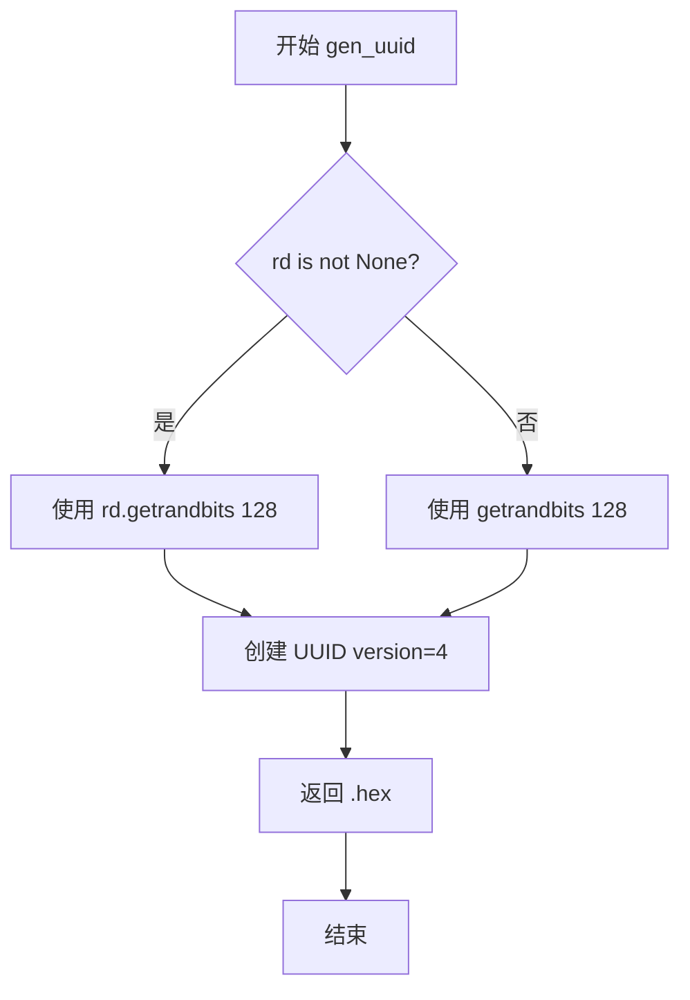
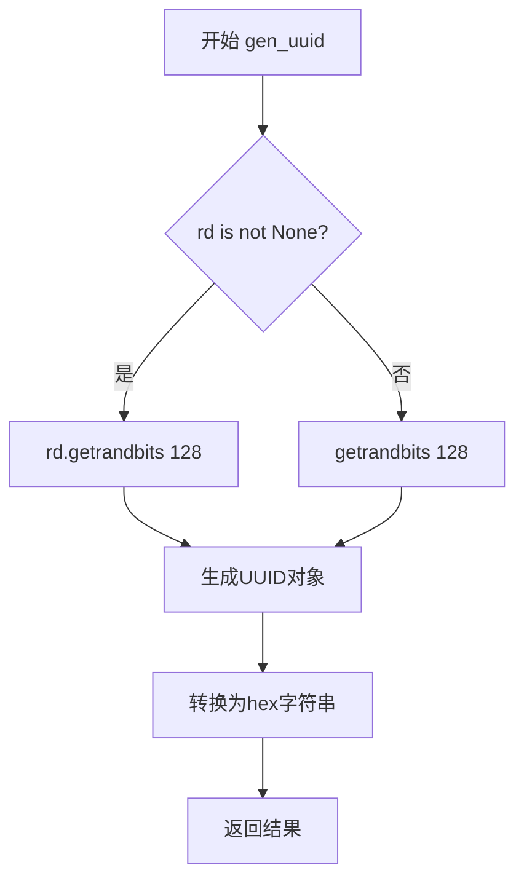

# `graphrag\packages\graphrag\graphrag\index\utils\uuid.py` 详细设计文档

一个轻量级的UUID工具模块，核心功能是生成随机的UUID v4字符串，支持可选的自定义随机数生成器。

## 整体流程

```mermaid
graph TD
    A[开始] --> B{rd参数是否为None?}
    B -- 是 --> C[调用getrandbits(128)生成随机数]
    B -- 否 --> D[调用rd.getrandbits(128)生成随机数]
    C --> E[使用uuid.UUID创建版本4的UUID对象]
D --> E
    E --> F[调用hex属性转换为16进制字符串]
    F --> G[返回UUID字符串]
```

## 类结构

```
uuid_utils (模块)
└── gen_uuid (函数)
```

## 全局变量及字段


### `uuid`
    
Python标准库uuid模块，用于生成UUID

类型：`module`
    


### `Random`
    
random模块中的随机数生成器类

类型：`class`
    


### `getrandbits`
    
random模块中生成指定位数随机数的函数

类型：`function`
    


### `rd`
    
可选的随机数生成器实例，如果为None则使用全局getrandbits

类型：`Random | None`
    


    

## 全局函数及方法


### `gen_uuid`

生成随机 UUID v4 的工具函数，支持使用自定义随机数生成器。

参数：

- `rd`：`Random | None`，可选的随机数生成器实例，如果提供则使用该实例生成随机位，否则使用全局随机数生成器

返回值：`str`，UUID 的十六进制字符串表示

#### 流程图



#### 带注释源码

```python
import uuid
from random import Random, getrandbits


def gen_uuid(rd: Random | None = None):
    """Generate a random UUID v4.
    
    Args:
        rd: 可选的 Random 实例。如果提供，则使用该实例的随机数生成器；
            否则使用 Python 内置的全局随机数生成器（通过 random.getrandbits）。
    
    Returns:
        UUID v4 的十六进制字符串表示（32个十六进制字符，不包含连字符）。
    """
    # 如果提供了随机数生成器，使用它生成128位随机数；
    # 否则使用全局的 getrandbits 函数
    random_bits = rd.getrandbits(128) if rd is not None else getrandbits(128)
    
    # 使用随机位创建 UUID v4（版本号4表示随机生成的 UUID）
    # 然后获取其十六进制字符串表示（不含连字符）
    return uuid.UUID(
        int=random_bits, 
        version=4
    ).hex
```

## 关键组件


### 核心功能概述

该模块提供UUID v4随机生成功能，支持可选的自定义随机数生成器，以满足不同场景下的UUID生成需求。

### 文件整体运行流程

该模块为工具模块，无独立运行流程。导入时仅加载依赖模块，调用`gen_uuid`函数时执行以下流程：
1. 检查是否传入自定义随机数生成器`rd`
2. 若传入`rd`，则调用`rd.getrandbits(128)`生成128位随机数
3. 若未传入`rd`，则调用`getrandbits(128)`生成128位随机数
4. 将随机数转换为UUID v4格式并返回十六进制字符串

### 全局函数详细信息

#### gen_uuid

| 属性 | 详情 |
|------|------|
| 函数名称 | gen_uuid |
| 参数名称 | rd |
| 参数类型 | Random \| None |
| 参数描述 | 可选的自定义随机数生成器，若为None则使用全局随机数生成器 |
| 返回值类型 | str |
| 返回值描述 | 32位十六进制字符串格式的UUID v4 |

**mermaid流程图：**



**带注释源码：**

```python
def gen_uuid(rd: Random | None = None):
    """Generate a random UUID v4."""
    # 判断是否传入了自定义随机数生成器
    # 若传入则使用该生成器，否则使用全局随机数生成器
    # getrandbits(128)生成128位随机数
    # uuid.UUID将随机数转换为version 4的UUID对象
    # .hex将UUID对象转换为32位十六进制字符串
    return uuid.UUID(
        int=rd.getrandbits(128) if rd is not None else getrandbits(128), version=4
    ).hex
```

### 关键组件信息

#### uuid模块

Python标准库组件，提供UUID数据类型和UUID生成功能。

#### Random类

Python random模块提供的随机数生成器类，支持自定义种子和随机数生成策略。

#### getrandbits函数

Python random模块提供的全局函数，用于生成指定位数的随机整数。

### 潜在技术债务与优化空间

1. **缺少输入验证**：未对`rd`参数进行类型检查，若传入非Random对象可能导致运行时错误
2. **错误处理缺失**：未处理`uuid.UUID`可能抛出的异常（如无效的随机数）
3. **性能优化空间**：对于高频调用场景，可考虑缓存或预生成UUID池
4. **文档完善**：可添加更多使用示例和异常情况说明

### 其它项目

#### 设计目标与约束

- **目标**：提供符合RFC 4122标准的UUID v4生成功能
- **约束**：依赖Python标准库，无需外部依赖

#### 错误处理与异常设计

- 当前实现无显式错误处理
- 潜在异常：传入无效Random对象时可能抛出AttributeError
- 建议：添加参数类型检查和异常包装

#### 数据流与状态机

- 纯函数式设计，无状态存储
- 输入：可选的Random对象
- 输出：确定性的UUID字符串
- 无状态机设计

#### 外部依赖与接口契约

- **依赖**：Python标准库 `uuid`, `random`
- **接口契约**：
  - 输入：Random对象或None
  - 输出：32位十六进制字符串
  - 线程安全性：取决于传入的Random对象实现


## 问题及建议


### 已知问题

- 参数命名不够清晰：`rd` 过于简短，应使用更描述性的名称如 `random_instance`
- 返回值类型和格式未在文档中明确说明：函数返回十六进制字符串，但文档字符串未注明
- 缺少输入参数的类型验证：如果传入的 `rd` 参数不是 `Random` 类型，运行时可能产生难以追踪的错误
- 与 Python 标准库功能重复：`uuid.uuid4()` 已经提供 UUID v4 生成功能，当前实现只是在其基础上进行了包装
- 类型注解兼容性：使用 `|` 联合类型语法（Python 3.10+），对更低版本 Python 兼容性不佳

### 优化建议

- 改进参数命名：`rd` 改为 `random_instance` 以提高可读性
- 完善文档字符串：明确说明参数类型要求、返回值是十六进制字符串格式
- 添加参数类型检查：在函数入口处验证 `random_instance` 是否为 `Random` 类型或 `None`，提供友好的错误信息
- 考虑使用 `uuid.uuid4().hex` 替代当前实现：标准库实现经过优化，更加可靠和高效
- 考虑兼容性：使用 `typing.Optional[Random]` 替代 `Random | None` 以支持更低版本的 Python
- 添加类型注解：明确返回值类型为 `str`

## 其它


### 错误处理与异常设计

由于`getrandbits(128)`在极端情况下可能抛出`OverflowError`（当位数过大时），但128位在Python的`int`类型处理范围内，通常不会抛出异常。若`rd`参数类型不符合预期，可能在调用`rd.getrandbits()`时抛出`AttributeError`。建议在文档中明确说明：若传入的`rd`对象不具有`getrandbits`方法，将抛出`AttributeError`。当前实现未对`rd`参数进行类型校验。

### 外部依赖与接口契约

- **依赖项**：Python标准库`uuid`、`random`模块
- **接口契约**：
  - 函数签名：`def gen_uuid(rd: Random | None = None) -> str`
  - 输入：`rd`为`random.Random`实例或`None`
  - 输出：返回32位十六进制字符串（不含连字符），对应UUID v4的128位随机数
  - 异常：若`rd`不为`None`且不具备`getrandbits`方法，可能抛出`AttributeError`

### 安全性考虑

- UUID v4基于伪随机数生成，安全性取决于底层`Random`对象的随机源
- 若用于安全敏感场景（如令牌、加密密钥），应确保`rd`使用密码学安全的随机数生成器（如`secrets`模块）
- 当前实现使用`getrandbits`，在`rd=None`时调用全局`getrandbits`函数，其随机源取决于操作系统

### 性能考虑

- 时间复杂度：O(1)，生成固定128位随机数
- 空间复杂度：O(1)，仅存储返回的32字符字符串
- 性能瓶颈：主要在随机数生成效率，当前实现已做优化（直接生成128位而非多次调用）

### 测试策略

- 单元测试：验证返回值为32位十六进制字符串、每次调用返回不同值、传入特定`Random`实例的行为
- 边界测试：`rd=None`、传入`Random`实例
- 逆向测试：验证生成的字符串可转换为有效UUID（通过`uuid.UUID(hex=...)`）

### 使用示例

```python
from random import Random
from uuid_util import gen_uuid

# 基本用法
uuid_hex = gen_uuid()  # 返回如 "550e8400-e29b-41d4-a716-446655440000" 的hex形式

# 使用特定随机数生成器
rng = Random(42)
uuid_hex = gen_uuid(rng)
```

### 配置说明

本模块为纯函数式工具，无配置文件依赖。`gen_uuid`函数的`rd`参数提供了随机数生成器的可配置性，便于测试和高级用法。

### 版本历史和变更记录

- v1.0.0（2024）：初始版本，支持UUID v4生成

### 参考文献

- RFC 4122：UUID v4规范
- Python `uuid`模块官方文档
- Python `random`模块官方文档


    