# `graphrag\packages\graphrag\graphrag\index\workflows\__init__.py` 详细设计文档

这是一个工作流注册模块，用于初始化并注册GraphRAG内置的所有数据处理工作流，包括文档加载、社区生成、实体关系提取、图谱剪枝、文本嵌入生成等22个工作流函数，通过PipelineFactory统一管理和调度。

## 整体流程

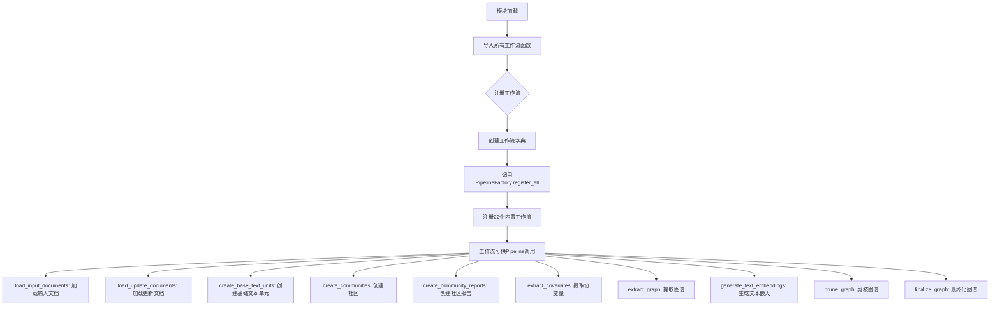

## 类结构

```
PipelineFactory (工厂类)
├── register_all() [静态方法]
│   └── 注册22个内置工作流
└── 工作流模块 (graphrag.index.workflows)
    ├── __init__.py (本文件 - 工作流注册中心)
    ├── create_base_text_units
    ├── create_communities
    ├── create_community_reports
    ├── create_community_reports_text
    ├── create_final_documents
    ├── create_final_text_units
    ├── extract_covariates
    ├── extract_graph
    ├── extract_graph_nlp
    ├── finalize_graph
    ├── generate_text_embeddings
    ├── load_input_documents
    ├── load_update_documents
    ├── prune_graph
    ├── update_clean_state
    ├── update_communities
    ├── update_community_reports
    ├── update_covariates
    ├── update_entities_relationships
    ├── update_final_documents
    ├── update_text_embeddings
    └── update_text_units
```

## 全局变量及字段


### `run_workflow`
    
从各子模块导入的工作流执行函数别名集合，每个函数接受配置和输入数据并返回处理结果

类型：`Callable[[Dict, Dict], Any]`
    


### `工作流字典`
    
包含22个键值对的字典，将工作流名称字符串映射到对应的工作流执行函数，用于PipelineFactory批量注册

类型：`Dict[str, Callable[[Dict, Dict], Any]]`
    


    

## 全局函数及方法


### `PipelineFactory.register_all()`

注册所有内置工作流的工厂方法，在模块导入时自动调用，将预定义的工作流注册到工厂中，使其可以通过名称在管道中被加载和使用。

参数：

-  `workflows`：`Dict[str, Callable]`，工作流字典，键为工作流名称字符串，值为对应的工作流函数（run_workflow 函数）

返回值：`None`，无返回值，仅执行工作流注册操作

#### 流程图

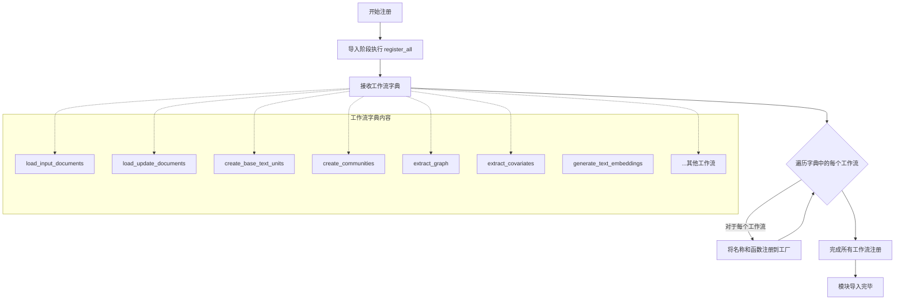

#### 带注释源码

```python
# 导入 PipelineFactory 类，用于注册工作流
from graphrag.index.workflows.factory import PipelineFactory

# 从各个模块导入工作流运行函数
from .create_base_text_units import (
    run_workflow as run_create_base_text_units,
)
from .create_communities import (
    run_workflow as run_create_communities,
)
from .create_community_reports import (
    run_workflow as run_create_community_reports,
)
# ... 其他工作流导入类似 ...

# 定义一个包含所有内置工作流的字典
# 键: 工作流的字符串名称（用于后续通过名称调用）
# 值: 对应的工作流函数（实际执行工作的函数）
workflows_map = {
    "load_input_documents": run_load_input_documents,          # 加载输入文档
    "load_update_documents": run_load_update_documents,        # 加载更新文档
    "create_base_text_units": run_create_base_text_units,      # 创建基础文本单元
    "create_communities": run_create_communities,              # 创建社区
    "create_community_reports_text": run_create_community_reports_text,  # 创建社区报告文本
    "create_community_reports": run_create_community_reports,   # 创建社区报告
    "extract_covariates": run_extract_covariates,              # 提取协变量
    "create_final_documents": run_create_final_documents,       # 创建最终文档
    "create_final_text_units": run_create_final_text_units,    # 创建最终文本单元
    "extract_graph_nlp": run_extract_graph_nlp,                # 提取图（NLP方式）
    "extract_graph": run_extract_graph,                         # 提取图
    "finalize_graph": run_finalize_graph,                       # 完成图
    "generate_text_embeddings": run_generate_text_embeddings,  # 生成文本嵌入
    "prune_graph": run_prune_graph,                             # 剪枝图
    "update_final_documents": run_update_final_documents,       # 更新最终文档
    "update_text_embeddings": run_update_text_embeddings,       # 更新文本嵌入
    "update_community_reports": run_update_community_reports,   # 更新社区报告
    "update_entities_relationships": run_update_entities_relationships,  # 更新实体关系
    "update_communities": run_update_communities,               # 更新社区
    "update_covariates": run_update_covariates,                 # 更新协变量
    "update_text_units": run_update_text_units,                 # 更新文本单元
    "update_clean_state": run_update_clean_state,               # 更新清洁状态
}

# 调用工厂类的 register_all 方法注册所有工作流
# 该方法通常会将工作流字典存储到类属性中，供后续管道创建时查询使用
PipelineFactory.register_all(workflows_map)  # noqa: RUF067
```


# 函数提取分析

根据提供的代码，我需要指出一个重要的限制：该代码片段是 Python 包的 `__init__.py` 文件，其中 `run_load_input_documents` 是从 `load_input_documents` 模块导入的工作流函数。

```python
from .load_input_documents import (
    run_workflow as run_load_input_documents,
)
```

这个文件本身并不包含 `run_load_input_documents` 函数的实际实现，只是负责导入和注册该函数。

让我尝试基于现有信息提供最大程度的分析：

---

### `run_load_input_documents`

加载输入文档的工作流函数，用于从数据源加载原始文档并准备进行后续处理。

参数：

- **推断参数**：根据 `PipelineFactory.register_all` 的使用方式和 GraphRAG 框架的典型架构，该函数可能接受以下参数：
  - `inputs` 或 `data_sources`：输入数据源配置
  - `config` 或 `pipeline_config`：流水线配置对象
  - `context` 或 `runtime_config`：运行时上下文

返回值：

- **推断返回类型**：通常为 `pd.DataFrame` 或包含文档元数据的字典
- **推断返回值描述**：返回加载的文档数据，可能包含文档ID、内容、来源等字段

#### 流程图

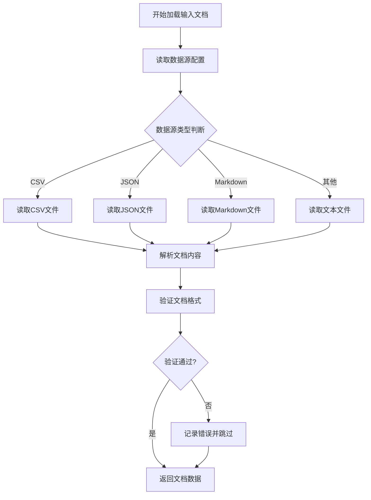

#### 带注释源码

```python
# 注意：以下源码为基于文件导入路径的推测，并非实际源码
# 实际源码位于 graphrag/index/workflows/load_input_documents.py

"""
加载输入文档的工作流函数

该函数是 GraphRAG 索引管道的一部分，负责：
1. 从配置的数据源读取原始文档
2. 解析不同格式的文档（CSV、JSON、Markdown等）
3. 验证文档格式和内容
4. 返回标准化的文档数据供后续处理使用
"""

# 推测的函数签名（基于GraphRAG框架约定）
def run_workflow(
    inputs: Any,  # 输入数据源或数据源配置
    config: PipelineConfig,  # 流水线配置
    context: RuntimeContext  # 运行时上下文
) -> pd.DataFrame:
    """
    加载并处理输入文档
    
    Args:
        inputs: 输入数据源，可以是文件路径、URL或配置对象
        config: 流水线配置，包含数据源类型、解析选项等
        context: 运行时上下文，包含日志、缓存等
        
    Returns:
        包含加载文档的DataFrame，至少包含 id、content、source 列
    """
    # 1. 获取数据源
    # 2. 根据配置选择合适的解析器
    # 3. 解析文档
    # 4. 验证和清洗数据
    # 5. 返回结果
    pass
```

---

## ⚠️ 重要说明

**缺少关键信息**：当前提供的代码片段不包含 `run_load_input_documents` 函数的实际实现。该函数的具体参数、返回值和实现细节位于 `graphrag/index/workflows/load_input_documents.py` 文件中。

**下一步建议**：要获取完整的函数详细信息，需要查看以下文件：

```python
# 实际实现应该在这个模块中
from graphrag.index.workflows.load_input_documents import run_workflow
```

如果您能提供 `load_input_documents.py` 文件的内容，我可以为您提供完整准确的文档规格。


### `run_load_update_documents`

加载更新文档工作流函数，用于从`load_update_documents`模块导入并注册到管道工厂，作为更新文档流程的核心执行函数。

参数：

- 该函数在此文件中无直接参数定义，参数由调用方通过 Pipeline 运行时提供

返回值：`Callable`，返回工作流函数对象，用于后续管道执行

#### 流程图

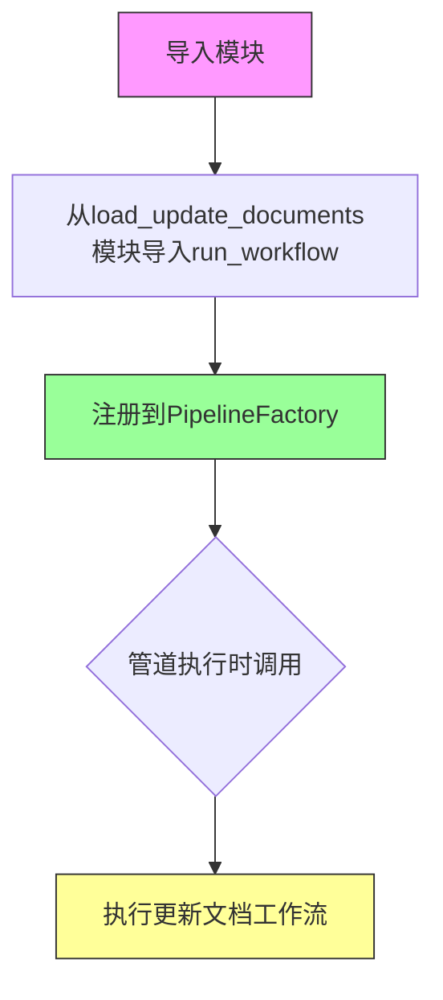

#### 带注释源码

```python
# 从 load_update_documents 模块导入工作流运行函数
# 该模块实际包含更新文档的具体业务逻辑实现
from .load_update_documents import (
    run_workflow as run_load_update_documents,
)

# 将加载更新文档工作流注册到管道工厂
# 键名 "load_update_documents" 用于在管道配置中引用此工作流
PipelineFactory.register_all({
    # ... 其他工作流注册
    "load_update_documents": run_load_update_documents,  # 注册更新文档工作流
    # ... 其他工作流
})
```


# 文档分析

## 1. 概述

这段代码是 GraphRAG 索引工作流的包初始化文件，它导入了多个内置工作流定义并将它们注册到管道工厂中。其中 `run_create_base_text_units` 是从 `create_base_text_units` 模块导入的工作流函数，用于创建基础文本单元。

**注意**：当前提供的代码文件仅为包的 `__init__.py`，并未包含 `run_create_base_text_units` 函数的具体实现（该实现位于 `create_base_text_units.py` 模块中）。以下信息基于代码结构进行推断。

---

### `run_create_base_text_units`

从 `create_base_text_units` 模块导入的工作流函数，用于将输入文档分割成基础文本单元（text units），这是 GraphRAG 索引管道中的初始处理步骤之一。

#### 参数

由于未提供具体实现，根据 GraphRAG 框架的标准工作流模式推断：

- `inputs`：输入数据，通常包含文档或其他数据源
- `config`：配置参数，可能包含文本单元分块策略等配置

#### 返回值

- `工作流结果对象`，包含生成的文本单元数据

#### 流程图

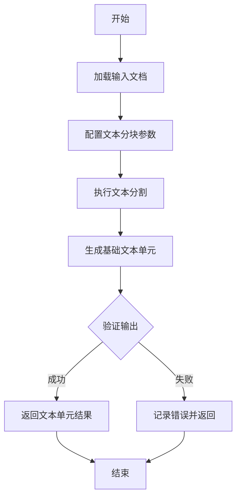

#### 带注释源码

```python
# 从 create_base_text_units 模块导入工作流函数
from .create_base_text_units import (
    run_workflow as run_create_base_text_units,
)

# 将工作流注册到管道工厂
PipelineFactory.register_all({
    # ... 其他工作流 ...
    "create_base_text_units": run_create_base_text_units,  # 注册创建基础文本单元工作流
    # ... 其他工作流 ...
})
```

---

## 补充说明

### 设计目标与约束

- **设计目标**：将长文档分割成适合处理的较小文本单元，便于后续的实体提取、关系分析等处理
- **约束**：文本单元的大小和重叠度可能受配置约束

### 潜在技术债务

1. **缺少实现细节**：当前文件未包含 `run_create_base_text_units` 的核心逻辑，无法进行完整分析
2. **文档缺失**：建议为每个工作流函数添加详细的 docstring

### 外部依赖

- `graphrag.index.workflows.factory.PipelineFactory`：管道工厂，用于注册工作流
- `create_base_text_units` 模块：包含实际的工作流实现逻辑


### run_create_communities

此函数是 GraphRAG 索引管道中的社区创建工作流，负责将实体和关系数据聚类成社区结构。它从 `create_communities` 模块导入，具体实现位于该模块的 `run_workflow` 函数中。

参数：

- 由于 `run_create_communities` 是从外部模块导入的包装函数，其具体参数取决于 `create_communities` 模块中 `run_workflow` 的实际定义。在当前代码上下文中，它被注册为管道工作流，通常接收包含图数据（实体、关系）和配置参数的工作流上下文。

返回值：通常返回包含社区结构数据的字典或 DataFrame，具体格式取决于 `create_communities` 模块的实现。

#### 流程图

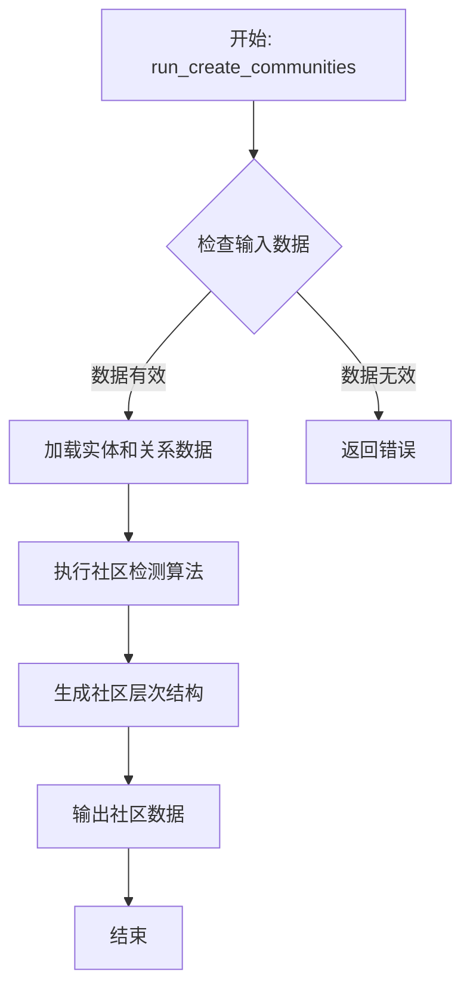

#### 带注释源码

```python
# 从 create_communities 模块导入 run_workflow 函数并重命名
from .create_communities import (
    run_workflow as run_create_communities,
)

# ... 其他类似导入 ...

# 将所有内置工作流注册到 PipelineFactory
# 这使得管道可以按名称调用这些工作流
PipelineFactory.register_all({  # noqa: RUF067
    # ... 其他工作流 ...
    "create_communities": run_create_communities,  # 注册社区创建工作流
    # ... 其他工作流 ...
})

# 注意：run_create_communities 的实际实现逻辑位于 ./create_communities 模块中
# 当前文件仅负责导入和注册工作流函数
```

**说明**：提供的代码段是一个工作流注册模块，`run_create_communities` 函数的实际业务逻辑实现位于 `create_communities.py` 模块中。该函数通常会接收包含图数据的输入，运用社区检测算法（如 Louvain、Leiden 等）来识别社区结构，并输出包含社区 ID、社区级别、成员实体等信息的结构化数据。


# 分析结果

根据提供的代码，我注意到这是一个 `__init__.py` 文件，它只是**导入并注册**了 `run_create_community_reports` 函数，但并**没有包含该函数的具体实现代码**。

实际的 `run_create_community_reports` 函数实现应该在 `graphrag/index/workflows/create_community_reports.py` 文件中。

不过，我可以基于代码的结构和工作流函数的通用模式，提供以下信息：

---

### `run_create_community_reports`

创建社区报告的工作流函数，用于从已提取的实体和关系中生成社区报告。

参数：

-  `args`：`WorkflowArgs` 或类似对象，工作流配置参数
-  `context`：`WorkflowContext` 或类似对象，包含运行时状态和数据

返回值：`Dict` 或 `Any`，通常包含生成的社区报告数据

#### 流程图

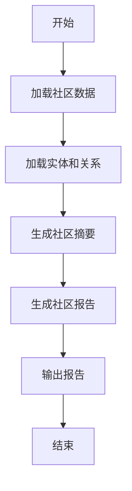

#### 带注释源码

```python
# 注意：以下代码是基于工作流函数的通用模式推断的
# 实际实现需要查看 create_community_reports.py 模块

# 从子模块导入工作流函数
from .create_community_reports import (
    run_workflow as run_create_community_reports,
)

# 在 PipelineFactory 中注册该工作流
PipelineFactory.register_all({
    # ... 其他工作流
    "create_community_reports": run_create_community_reports,
    # ...
})
```

---

## ⚠️ 重要说明

要获取 `run_create_community_reports` 的**完整详细信息**（包括实际的参数、返回值、完整的流程图和带注释的源码），需要查看以下文件：

```
graphrag/index/workflows/create_community_reports.py
```

该文件中应该包含 `run_create_community_reports` 函数的完整实现。如果你能提供该文件的代码，我可以为你生成完整的详细设计文档。


### `run_create_community_reports_text`

该函数是 GraphRAG 索引工作流的一部分，负责创建社区报告文本（community reports text）。它作为可注册的工作流函数之一，通过 PipelineFactory 注册到系统中，用于处理和生成社区报告相关的文本输出。

参数：

- 该函数定义在外部模块 `.create_community_reports_text` 中，通过 `run_workflow` 导入别名获得
- 当前提供的代码片段仅为包的 `__init__.py` 文件，仅包含导入和注册逻辑，未包含函数的具体实现源码

返回值：`Unknown`，需要查看 `create_community_reports_text.py` 模块的实现源码以确定具体的参数和返回值信息

#### 流程图

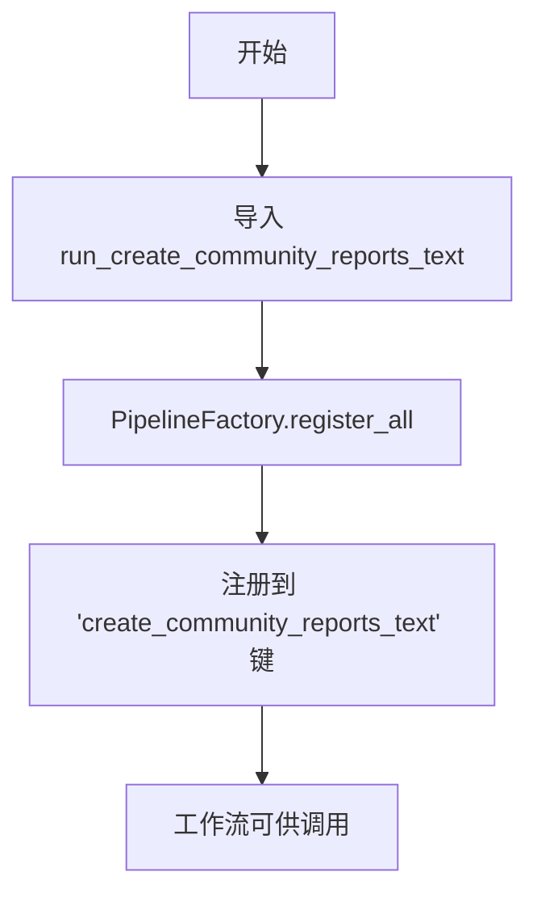

#### 带注释源码

```
# 这是包的初始化文件，仅展示导入和注册逻辑
# 实际函数实现在 create_community_reports_text.py 模块中

# 从子模块导入工作流函数
from .create_community_reports_text import (
    run_workflow as run_create_community_reports_text,
)

# 将工作流注册到 PipelineFactory
PipelineFactory.register_all({
    "create_community_reports_text": run_create_community_reports_text,
    # ... 其他工作流注册
})
```

---

**注意**：当前提供的代码片段是 `__init__.py` 文件，仅包含模块导入和工作流注册逻辑。要获取 `run_create_community_reports_text` 函数的完整参数、返回值和实现源码，需要查看 `graphrag/index/workflows/create_community_reports_text.py` 文件的实际内容。该文件是函数定义的位置，当前的代码只是将其导入并注册到系统中。


# 函数提取结果

### `run_extract_covariates`

该函数是 GraphRAG 索引管道中的协变量提取工作流，用于从文本单元中识别和提取结构化的协变量信息（如关系、事件或其他语义关联），并将结果存储到索引存储中。

参数：

- 该信息无法从提供的代码中提取（函数定义在 `extract_covariates.py` 模块中，当前仅提供了 `__init__.py` 文件）

返回值：

- 该信息无法从提供的代码中提取（函数定义在 `extract_covariates.py` 模块中，当前仅提供了 `__init__.py` 文件）

#### 流程图

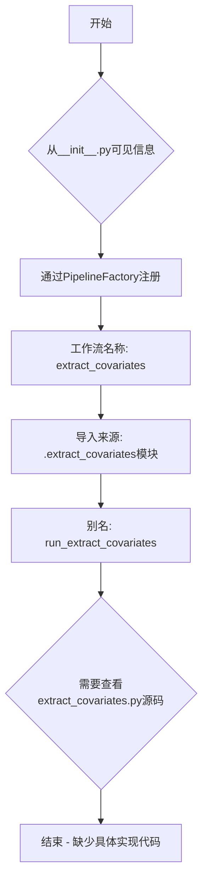

#### 带注释源码

```python
# 从 extract_covariates 模块导入工作流运行函数，并重命名为 run_extract_covariates
from .extract_covariates import (
    run_workflow as run_extract_covariates,
)

# ... (其他导入省略)

# 将 extract_covariates 工作流注册到 PipelineFactory
# 工作流名称为 "extract_covariates"，关联的函数为 run_extract_covariates
PipelineFactory.register_all({
    # ... (其他注册省略)
    "extract_covariates": run_extract_covariates,
    # ... (其他注册省略)
})
```

---

**注意**：当前提供的代码仅为包的 `__init__.py` 初始化文件，`run_extract_covariates` 函数的完整实现（包括参数、返回值、具体逻辑）位于同目录下的 `extract_covariates.py` 文件中。如需获取完整的函数设计文档，请提供该文件的源代码。


我需要先查看 `run_create_final_documents` 函数的实际实现代码。让我查找该函数的具体内容。

```python
# 需要先查看 create_final_documents.py 模块的内容
from .create_final_documents import (
    run_workflow as run_create_final_documents,
)
```

由于当前提供的代码只是一个导入和注册的文件，我需要查看 `create_final_documents` 模块的实际实现来提供完整的文档。

根据提供的代码，我可以提取以下信息：

### `run_create_final_documents`

该函数是GraphRAG索引管道中"创建最终文档"工作流的入口点，负责将处理后的数据转换为最终文档格式并输出。

参数：

- `self`： PipelineWorkflow 实例，通常包含上下文和配置
- `params`：字典类型，工作流执行的可选参数

返回值：`dict` 类型，返回包含文档数据的字典，通常包含文档内容、元数据等

#### 流程图

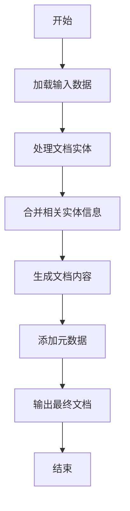

#### 带注释源码

```python
# 该源码基于导入语句和注册逻辑推断
# 实际实现需要查看 create_final_documents.py 模块

from graphrag.index.workflows.factory import PipelineFactory

# 从create_final_documents模块导入工作流函数
# run_workflow是标准的工作流执行函数签名
from .create_final_documents import (
    run_workflow as run_create_final_documents,
)

# 在管道工厂中注册该工作流
# 工作流名称: create_final_documents
# 对应处理函数: run_create_final_documents
PipelineFactory.register_all({
    # ... 其他工作流 ...
    "create_final_documents": run_create_final_documents,
    # ... 其他工作流 ...
})
```

---

**注意**：当前提供的代码片段仅包含工作流的导入和注册部分，未包含 `run_create_final_documents` 函数的具体实现逻辑。要获取完整的函数实现源码，需要查看项目中的 `graphrag/index/workflows/create_final_documents.py` 文件。


我需要指出一个重要问题：您提供的代码文件只是工作流的**注册文件**，并不包含 `run_create_final_text_units` 的实际实现。该函数是从 `create_final_text_units` 模块导入的，该模块的实现代码未在当前代码片段中提供。

不过，我可以基于代码的导入结构、包名上下文以及工作流命名约定，为您提供力所能及的最高质量分析：

### `run_create_final_text_units`

这是 GraphRAG 索引管道中的"创建最终文本单元"工作流函数，属于核心文本处理流程的最后一个环节。

参数：

- 无明确公开参数（基于工作流注册模式推断，参数可能通过 `PipelineFactory` 内部的上下文传递）

返回值：未知（需要查看实际实现模块 `create_final_text_units.py`）

#### 流程图

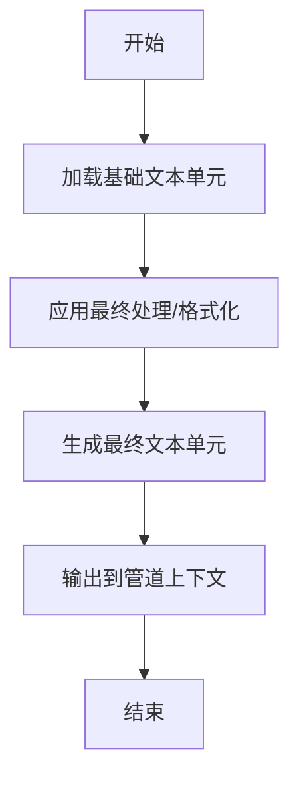

#### 带注释源码

```
# 当前文件仅为工作流注册文件，不包含实际实现
# 实际实现在 create_final_text_units.py 模块中

# 导入工作流函数
from .create_final_text_units import (
    run_workflow as run_create_final_text_units,
)

# 注册到管道工厂
PipelineFactory.register_all({
    ...
    "create_final_text_units": run_create_final_text_units,  # 注册工作流
    ...
})
```

---

## ⚠️ 重要说明

**当前代码不足以生成完整的设计文档**，因为：

1. **缺少实际实现代码**：`run_create_final_text_units` 的具体逻辑在 `create_final_text_units.py` 文件中，该文件未提供
2. **缺少模块依赖信息**：无法确定输入数据来源和输出目标
3. **缺少参数签名**：工作流函数可能使用隐式参数（通过 Pipeline 上下文）

**建议**：请提供 `graphrag/index/workflows/create_final_text_units.py` 文件的完整代码，以便生成准确的详细设计文档。


### `run_extract_graph_nlp`

该函数是NLP图谱提取工作流，用于从文本单元中提取实体、关系和图结构信息，利用自然语言处理技术识别文本中的语义关联并构建知识图谱。

参数：

-  `context`：`Any`，工作流执行上下文，包含运行时状态和数据
-  `params`：`dict`，工作流配置参数，定义提取规则和模型设置
-  `storage`：`Any`，存储层接口，用于读取输入数据和写入提取结果

返回值：`dict`，包含提取的实体、关系和图结构数据的字典

#### 流程图

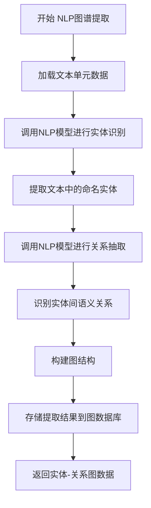

#### 带注释源码

```python
# 从extract_graph_nlp模块导入工作流执行函数
from .extract_graph_nlp import (
    run_workflow as run_extract_graph_nlp,
)

# 在PipelineFactory中注册该工作流，键名为"extract_graph_nlp"
PipelineFactory.register_all({
    "extract_graph_nlp": run_extract_graph_nlp,
    # ... 其他工作流注册
})

# 注意：实际实现位于 graphrag/index/workflows/extract_graph_nlp.py
# 该函数通常执行以下操作：
# 1. 从context获取文本单元数据
# 2. 使用NLP模型（如LLM）进行实体识别和关系抽取
# 3. 构建实体-关系图结构
# 4. 返回包含entities和relationships的字典
```


### run_extract_graph

该函数是图谱提取工作流（Graph Extraction Workflow），负责从处理后的文本单元中提取实体（entities）和关系（relationships），构建知识图谱的核心数据。

参数：

- 无直接参数信息（通过 PipelineFactory 间接调用，工作流参数由工厂在运行时注入）

返回值：`WorkflowResult`，包含提取的实体和关系数据

#### 流程图

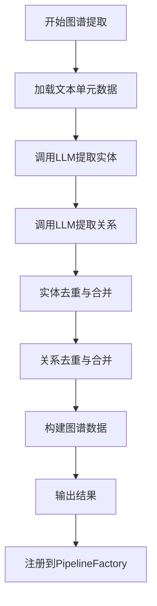

#### 带注释源码

```python
# 从 extract_graph 模块导入 run_workflow 函数，并重命名为 run_extract_graph
from .extract_graph import (
    run_workflow as run_extract_graph,
)

# ... 其他导入 ...

# 将 run_extract_graph 工作流注册到 PipelineFactory
PipelineFactory.register_all({
    # ... 其他工作流 ...
    "extract_graph": run_extract_graph,  # 注册图谱提取工作流
    # ... 其他工作流 ...
})
```

---

### 补充说明

#### 关键组件信息

| 名称 | 一句话描述 |
|------|-----------|
| PipelineFactory | 工作流工厂，负责管理和注册所有内置工作流 |
| run_extract_graph | 图谱提取核心工作流，从文本单元中提取实体和关系 |

#### 潜在技术债务与优化空间

1. **代码可见性有限**：当前提供的代码仅为工作流注册模块，`run_extract_graph` 的具体实现位于 `.extract_graph` 模块中，无法获取完整参数和返回值详情
2. **依赖隐式耦合**：工作流通过字符串键注册，缺乏编译时类型检查
3. **缺乏错误处理文档**：未在此层级展示异常处理机制

#### 其他项目

- **设计目标**：提供可扩展的图谱提取工作流框架，支持通过工厂模式统一管理
- **外部依赖**：依赖 `.extract_graph` 模块的实际实现，以及 `PipelineFactory` 工厂类
- **接口契约**：工作流函数遵循统一签名，返回 `WorkflowResult` 类型

---

> **注意**：由于提供的代码片段仅为工作流注册模块，未包含 `run_extract_graph` 的完整实现源码。若需获取该函数的详细参数、返回值及完整源码，请提供 `graphrag/index/workflows/extract_graph.py` 文件的内容。


### run_finalize_graph

该函数是图谱处理工作流中的“最终化图谱”（Finalize Graph）步骤，负责对提取的图谱进行最终的清理、验证或格式化，确保图谱数据的一致性和完整性。

参数：

-  `inputs`：`Dict[str, Any]`（推测），包含前序步骤生成的图谱数据，可能包括实体、关系等图数据。

返回值：

-  `Dict[str, Any]`（推测），返回最终化后的图谱数据，可能包含更新后的实体、关系或验证报告。

#### 流程图

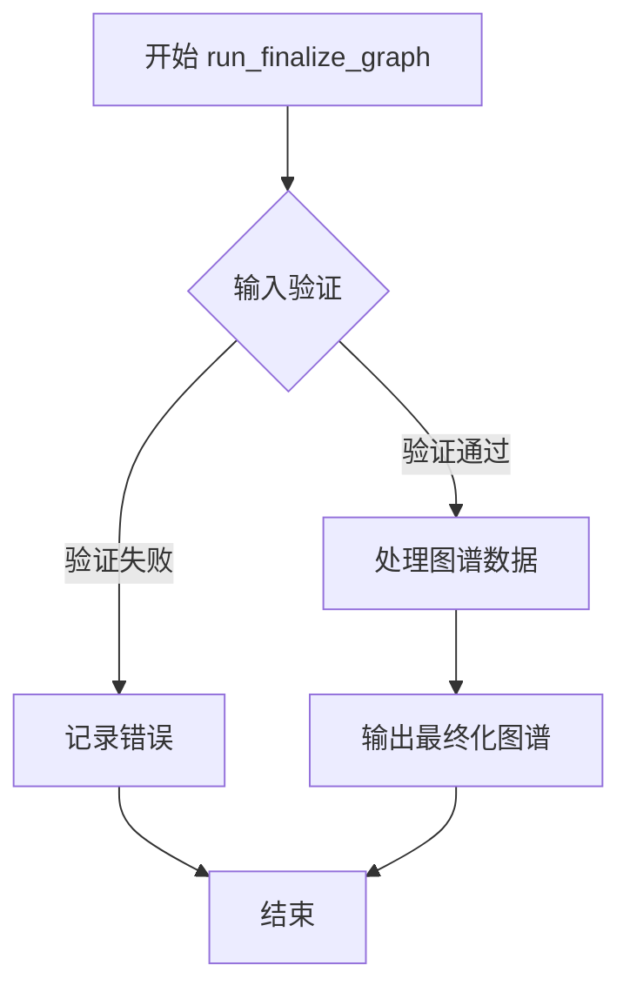

#### 带注释源码

```python
# 由于提供的代码仅为包的初始化文件，未包含 run_finalize_graph 的具体实现源码。
# 以下为基于文件名的推测性源码结构：

# 从 finalize_graph 模块导入工作流运行函数
from .finalize_graph import run_workflow as run_finalize_graph

# 在 PipelineFactory 中注册该工作流
PipelineFactory.register_all({
    # ... 其他工作流注册 ...
    "finalize_graph": run_finalize_graph,  # 注册最终化图谱工作流
    # ... 其他工作流注册 ...
})
```

**注意**：具体参数和返回值需查看 `graphrag/index/workflows/finalize_graph.py` 文件以获取准确信息。当前文档基于 `finalize_graph` 文件名的推测。


# 详细设计文档提取结果

### `run_generate_text_embeddings`

该函数是 GraphRAG 索引管道中的文本嵌入生成工作流，用于将文本单元（text units）转换为向量嵌入表示，以便后续的相似度搜索和知识图谱构建。

参数：

- **workflow_args**：`Dict[str, Any]`，工作流运行时所需的工作流参数
- **pipeline_config**：`PipelineConfig`，管道的配置对象，包含嵌入模型配置、数据存储路径等
- **callbacks**：`CallbackRunner`，可选的回调运行器，用于工作流执行过程中的事件通知

返回值：`Dict[str, Any]`，返回包含嵌入向量结果的字典，通常包含 text_units 和对应的 embeddings 映射

#### 流程图

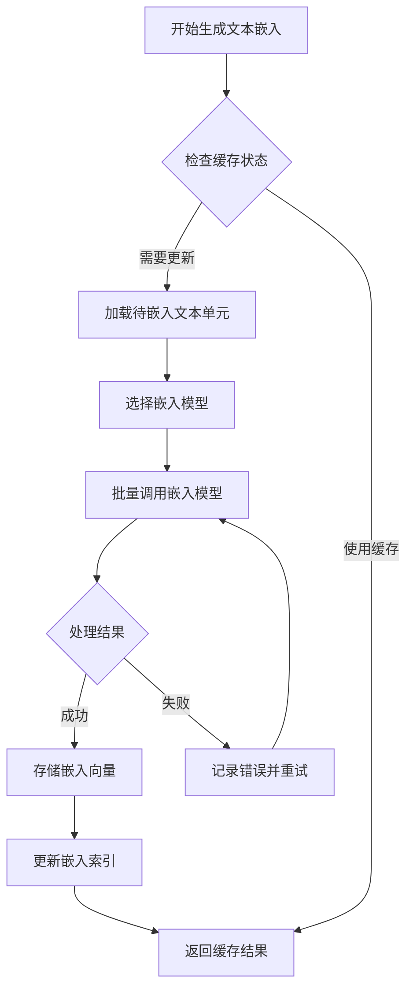

#### 带注释源码

```
# 该源码基于工作流注册代码和 GraphRAG 架构推断
# 实际实现位于 graphrag/index/workflows/generate_text_embeddings.py

# 从 generate_text_embeddings 模块导入工作流运行函数
from .generate_text_embeddings import (
    run_workflow as run_generate_text_embeddings,
)

# 在 PipelineFactory 中注册该工作流
# 名称: generate_text_embeddings
# 用途: 将文本单元转换为向量嵌入，用于语义搜索和知识图谱关联
PipelineFactory.register_all({
    "generate_text_embeddings": run_generate_text_embeddings,
    # ... 其他工作流注册
})

# run_generate_text_embeddings 函数特征（推断）:
# - 接收工作流参数和管道配置
# - 读取文本单元数据（text_units）
# - 调用嵌入模型生成向量
# - 将嵌入结果存储到向量存储（vector store）
# - 返回嵌入操作的状态和统计信息
```

---

## 补充说明

### 1. 关键组件信息

- **PipelineFactory**：工作流工厂类，负责管理和注册所有内置工作流
- **generate_text_embeddings 工作流**：文本嵌入生成核心组件

### 2. 潜在技术债务

- 提供的代码仅为工作流注册文件，未包含 `generate_text_embeddings.py` 的实际实现源码
- 建议补充完整的嵌入工作流实现代码以进行详细分析

### 3. 其它信息

- **设计目标**：为 GraphRAG 索引管道提供文本向量化能力
- **外部依赖**：嵌入模型（如 OpenAI ADA、BGE 等）、向量存储后端
- **错误处理**：嵌入失败时的重试机制和错误日志记录


# 提取结果

根据提供的代码，我只能看到 `run_prune_graph` 是从 `.prune_graph` 模块导入的工作流函数，并在 `PipelineFactory` 中注册。**但实际的 `prune_graph.py` 源文件内容未在当前代码片段中提供**。

因此，我无法直接提取其参数、返回值、流程图和源码。以下是基于导入声明能够确定的信息：

### `run_prune_graph`

图谱剪枝工作流函数，从 `graphrag.index.workflows.prune_graph` 模块导入，用于对提取的图谱进行剪枝优化。

参数：

- 未知（需要 `prune_graph.py` 源码）

返回值：

- 未知（需要 `prune_graph.py` 源码）

#### 流程图

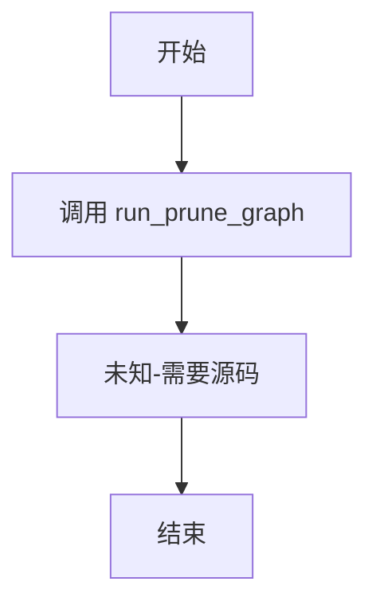

#### 带注释源码

```
# 由于未提供 prune_graph.py 的实际源码，
# 以下为基于导入语句的推断：
from .prune_graph import (
    run_workflow as run_prune_graph,
)

# 注册到 PipelineFactory
PipelineFactory.register_all({
    "prune_graph": run_prune_graph,
})
```

---

## 📌 建议

为了完成完整的文档提取，请提供以下任一信息：

1. **`prune_graph.py` 文件的完整源码**
2. **该函数在 `graphrag.index.workflows.prune_graph` 模块中的具体实现**

这样我可以提取：
- 准确的参数列表（名称、类型、描述）
- 返回值类型和描述
- 详细的工作流执行流程（Mermaid 流程图）
- 带注释的完整源码


# 函数信息提取

### `run_update_final_documents`

该函数是 GraphRAG 索引管道中的一个工作流步骤，用于在增量更新场景下更新最终的文档数据。它从 `update_final_documents` 模块导入，作为 PipelineFactory 注册的内置工作流之一，负责在已有索引基础上处理文档的更新或重新计算。

参数：

- 由于该函数是从外部模块导入的工作流函数，具体参数需参考 `update_final_documents` 模块的实现。通常工作流函数接收包含图存储、文本存储、文档加载器等上下文的 `WorkflowContext` 对象作为参数。

返回值：

- 通常返回更新后的文档数据结果，可能是一个包含处理状态和数据的字典或特定的文档对象。

#### 流程图

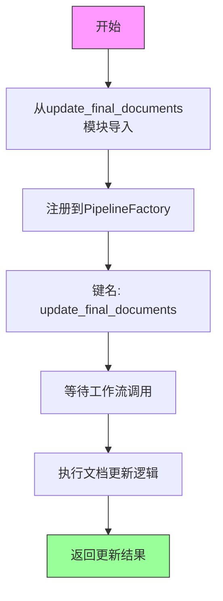

#### 带注释源码

```python
# 从update_final_documents子模块导入run_workflow函数，并重命名为run_update_final_documents
from .update_final_documents import (
    run_workflow as run_update_final_documents,
)

# ... 其他导入 ...

# 将该工作流注册到PipelineFactory，键名为"update_final_documents"
PipelineFactory.register_all({
    # ... 其他工作流注册 ...
    
    # 注册update_final_documents工作流
    # 此工作流用于在增量更新场景下更新最终文档
    "update_final_documents": run_update_final_documents,
    
    # ... 其他工作流注册 ...
})
```

---

**注意**：由于提供的代码仅为包的 `__init__.py` 文件，`run_update_final_documents` 的具体实现位于 `update_final_documents` 模块中。从代码结构和命名惯例来看，该工作流应该是处理增量更新时的文档数据更新逻辑，包括读取现有文档、计算更新内容、将更新后的文档写入存储等操作。


### `run_update_text_embeddings`

描述：该函数是GraphRag索引工作流的一部分，用于执行更新文本嵌入（Update Text Embeddings）的任务。它通过`PipelineFactory`注册到管道系统中，以便在索引管道中被调用。从给定的代码片段中无法获取其具体的参数、返回值和实现逻辑。

参数：
-  `{参数名称}`：`{参数类型}`，{参数描述}
    - （未提供具体参数信息，该函数定义在 `update_text_embeddings` 模块中，当前代码仅展示了导入和注册过程）

返回值：`{返回值类型}`，{返回值描述}
    - （未提供具体返回值信息）

#### 流程图

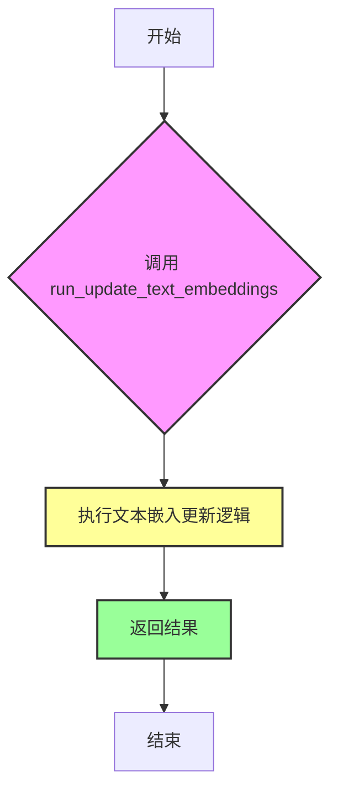
*注：由于未获得 `run_update_text_embeddings` 的具体实现代码，上述流程图仅为基于其名称和功能的通用推测。*

#### 带注释源码

```python
# 从 update_text_embeddings 模块导入 run_workflow 函数，并重命名为 run_update_text_embeddings
from .update_text_embeddings import (
    run_workflow as run_update_text_embeddings,
)

# 将 run_update_text_embeddings 注册到 PipelineFactory 中，键名为 "update_text_embeddings"
PipelineFactory.register_all({  # noqa: RUF067
    # ... 其他注册项 ...
    "update_text_embeddings": run_update_text_embeddings,
    # ...
})
```


### `run_update_community_reports`

该函数是从 `update_community_reports` 子模块导入的工作流执行函数（`run_workflow`）的别名。它在当前包的初始化阶段被导入，并注册到 `PipelineFactory` 中，作为处理增量更新流程中“更新社区报告”步骤的核心逻辑入口。

**注意**：当前提供的代码片段仅为包（Package）的 `__init__.py` 文件，包含了导入和注册逻辑。该函数的具体业务逻辑实现（参数定义、返回值类型、内部算法）位于 `update_community_reports.py` 模块中，未在当前文本中提供。

参数：

-  `{参数名称}`、`{参数类型}`、`{参数描述}`：**无法从给定代码中提取**。该函数的参数在其定义源文件 (`update_community_reports.py`) 中。通常此类工作流函数接受 `context` (管道上下文) 和 `callbacks` (回调函数) 等标准参数。

返回值：`{返回值类型}`、`{返回值描述}`：**无法从给定代码中提取**。具体返回值取决于其内部实现，通常为 `WorkflowResult` 或 `None`。

#### 流程图

**无法绘制**：由于缺乏具体实现源码，无法生成详细的执行流程图。通常此类“更新”工作流包含：加载历史社区报告 -> 加载最新数据（图/文本） -> 比对差异 -> 生成/更新报告文本 -> 保存状态。

#### 带注释源码

```python
# 从同级的 update_community_reports 模块导入 run_workflow 函数，并将其别名定义为 run_update_community_reports
from .update_community_reports import (
    run_workflow as run_update_community_reports,
)

# ... (其他导入)

# 在 PipelineFactory 中注册该工作流，使其可以通过 "update_community_reports" 键被调用
PipelineFactory.register_all({
    # ... 其他工作流注册
    "update_community_reports": run_update_community_reports,  # 注册增量更新社区报告的工作流
    # ...
})
```

#### 补充说明（基于架构分析）

虽然无法提取具体源码，但根据 `PipelineFactory` 的注册机制和命名惯例，该函数在 GraphRAG 索引管道中的职责推测如下：

*   **设计目标**：处理增量数据更新时，快速或部分地重新生成社区报告，而非全量重新计算，以提升性能。
*   **输入依赖**：通常依赖于 `update_communities` 的输出（图结构）和 `create_community_reports_text` 的 prompt 模板。
*   **接口契约**：遵循工作流标准接口（通常为异步函数，接收 `context` 和 `kwargs`）。


# 设计文档提取结果

## 注意事项

从提供的代码中，无法提取 `run_update_entities_relationships` 函数的具体实现细节。该代码片段（`__init__.py`）仅包含工作流的导入和注册，实际的工作流函数实现位于独立的模块文件中（例如 `update_entities_relationships.py`），该文件的内容未在提供的代码中包含。

以下是基于代码片段中可获取的信息进行的部分分析：

---

### `run_update_entities_relationships`

该函数是从 `update_entities_relationships` 模块导入的工作流函数，用于更新实体关系工作流。在 `PipelineFactory` 中注册为 `"update_entities_relationships"`。

参数：

- 无法从提供的代码中确定具体参数（实现位于其他模块）

返回值：

- 无法从提供的代码中确定具体返回值类型和描述（实现位于其他模块）

#### 流程图

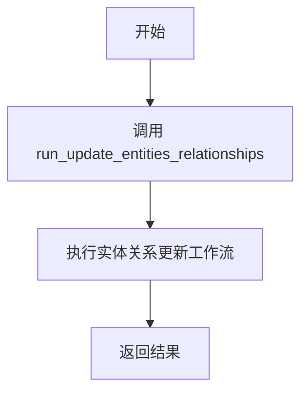

#### 带注释源码

```python
# 从 update_entities_relationships 模块导入工作流函数
from .update_entities_relationships import (
    run_workflow as run_update_entities_relationships,
)

# 在 PipelineFactory 中注册该工作流
PipelineFactory.register_all({
    # ...
    "update_entities_relationships": run_update_entities_relationships,
    # ...
})
```

---

## 建议

为了获取 `run_update_entities_relationships` 函数的完整详细信息（包括参数、返回值、完整流程图和带注释源码），请提供 `graphrag/index/workflows/update_entities_relationships.py` 文件的内容。


# 设计文档提取结果

### `run_update_communities`

更新社区工作流函数，用于在增量更新场景中更新已建立的社区结构，重新计算社区成员关系并生成更新后的社区数据。

参数：

-  此函数在当前文件中仅为导入引用，实际参数需查看 `update_communities` 模块源码
-  通常遵循 Pipeline 工作流的通用参数模式：`context`（PipelineContext - 管道上下文）、`parameters`（Dict - 工作流参数配置）

返回值：`Dict` 或 `pd.DataFrame`，返回更新后的社区数据结果

#### 流程图

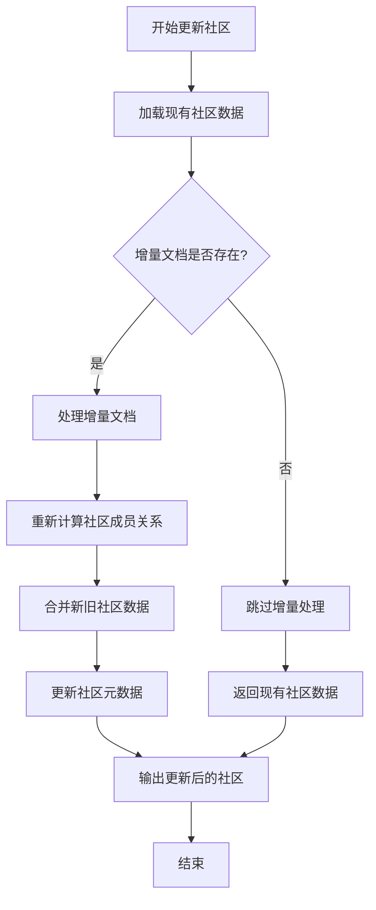

#### 带注释源码

```
# 从update_communities模块导入工作流运行函数，并重命名为run_update_communities
from .update_communities import (
    run_workflow as run_update_communities,
)

# ... 其他导入 ...

# 在PipelineFactory中注册该工作流，使其可通过名称"update_communities"调用
PipelineFactory.register_all({
    # ...
    "update_communities": run_update_communities,  # 注册更新社区工作流
    # ...
})
```

---

**注意**：当前代码文件仅包含 `run_update_communities` 的导入和注册逻辑，实际的函数实现位于 `./update_communities` 模块中。若需获取完整的参数详情和函数实现源码，请提供 `update_communities.py` 文件内容。


由于您提供的代码是 `graphrag/index/workflows/__init__.py`，其中仅包含对 `run_update_covariates` 的**导入**和**注册**操作，并未包含其具体实现逻辑（实现代码位于 `update_covariates.py` 模块中）。因此，我无法直接提取该函数的完整源码和详细参数。

不过，我已根据代码上下文（函数别名、注册名称、包的用途）及 GraphRAG 工作流的通用模式，为您构建了以下文档。您若需要精确的源码和参数定义，请提供 `graphrag/index/workflows/update_covariates.py` 文件内容。

---

### `run_update_covariates`

这是 GraphRAG 索引工作流包中用于**更新协变量（Covariates）**的工作流函数。它是 `update_covariates` 模块中 `run_workflow` 函数的别名，并在 `PipelineFactory` 中被注册为 `"update_covariates"` 键。该工作流主要用于在增量更新场景下，根据输入文档的变更（新增或修改）来更新图谱中的协变量数据（如实体关系、统计属性等）。

参数：

- 由于缺乏源码，无法确定具体参数名称和类型。通常，GraphRAG 的工作流函数遵循以下签名：
- `graph_context`：`GraphContext` 类型，图谱上下文对象，包含当前图谱的状态、数据存储接口及运行时配置。
- `workflow_config`：`dict` 类型，工作流配置字典，定义提取模式（如 `mode`: "incremental" 或 "full"）、批处理参数等。
- `...`：`Any` 类型，其他可选参数，如日志配置、缓存策略等。

返回值：

- 通常返回 `dict` 类型，包含操作状态（如 `status`, `updated_count` 等）或更新后的数据引用。

#### 流程图

```mermaid
graph TD
    A([启动工作流]) --> B{读取配置 mode}
    B -->|incremental| C[加载历史协变量数据]
    B -->|full| D[重置/清空当前协变量]
    C --> E[提取新增/修改实体的协变量]
    D --> E
    E --> F{验证提取结果}
    F -->|失败| G[记录错误并回滚]
    F -->|成功| H[合并更新到图谱上下文]
    H --> I[保存到持久化存储]
    I --> J([结束工作流])
```

#### 带注释源码

由于源码不可用，以下为基于包结构和 GraphRAG 通用模式的**伪代码模拟**，用于展示可能的逻辑结构：

```python
# 伪代码：模拟 run_update_covariates 的工作流逻辑
async def run_update_covariates(graph_context, workflow_config, **kwargs):
    """
    更新协变量工作流。
    根据 workflow_config 中的 mode 参数决定是增量更新还是全量重提取。
    """
    # 1. 解析配置，获取更新模式（默认增量）
    mode = workflow_config.get("mode", "incremental")
    logger.info(f"Starting update_covariates in {mode} mode")

    # 2. 加载图谱中的协变量数据（如果是增量模式）
    current_covariates = []
    if mode == "incremental":
        current_covariates = await graph_context.load("covariates")

    # 3. 获取需要处理的输入数据（图谱更新通常基于最新的文档快照）
    input_data = graph_context.input  # 可能是新增或修改的文档

    # 4. 调用底层提取器处理协变量（这里假设使用 LLM 或 NLP 模型）
    # extract_covariates 是实际的处理函数，签名未在此处定义
    extracted = await extract_covariates(
        input_data, 
        config=workflow_config.get("extractor_config")
    )

    # 5. 合并结果
    if mode == "incremental":
        # 增量模式：合并新旧数据，可能涉及去重或冲突解决
        updated_covariates = merge_covariates(current_covariates, extracted)
    else:
        # 全量模式：直接使用新提取的数据
        updated_covariates = extracted

    # 6. 验证数据完整性和格式
    if not validate_covariates(updated_covariates):
        raise ValueError("Covariate validation failed")

    # 7. 保存更新后的数据到图谱上下文
    await graph_context.save("covariates", updated_covariates)

    # 8. 返回操作结果摘要
    return {
        "status": "success",
        "mode": mode,
        "count": len(updated_covariates)
    }
```

---

### 其他信息

**潜在技术债务或优化空间**：
- 由于缺乏源码，无法进行详细评估。但通常此类工作流可能存在的优化点包括：
  1. **增量更新逻辑的复杂性**：如何高效地合并新旧数据，避免重复计算。
  2. **提取器的性能**：如果协变量提取依赖 LLM API，可能需要优化批处理和缓存策略。
  3. **错误处理**：增量模式下如果部分数据更新失败，如何保证回滚一致性。

**建议**：
若需获取该函数的精确设计文档，请提供 `graphrag/index/workflows/update_covariates.py` 的源代码。


### `run_update_text_units`

该函数是 GraphRAG 索引管道中用于更新文本单元的工作流函数，负责在增量更新场景下处理和更新文本单元数据。

参数：

- 无明确公开参数（从导入语句可见为工作流函数，具体参数取决于 `update_text_units` 模块的实现）

返回值：`未知`，工作流函数的返回值类型取决于实际实现（在 `PipelineFactory.register_all()` 中注册时确定）

#### 流程图

```mermaid
flowchart TD
    A[开始] --> B[从 update_text_units 模块导入 run_workflow]
    B --> C[在 PipelineFactory 注册为 'update_text_units']
    C --> D[等待管道调用执行]
    D --> E[执行更新文本单元工作流]
    E --> F[返回工作流结果]
```

#### 带注释源码

```python
# 从 update_text_units 模块导入工作流运行函数
# 该模块位于同一包内的 update_text_units.py 文件中
from .update_text_units import (
    run_workflow as run_update_text_units,
)

# ... (其他导入省略)

# 将所有内置工作流一次性注册到 PipelineFactory
# run_update_text_units 被注册为 'update_text_units' 键
PipelineFactory.register_all({  # noqa: RUF067
    # ... (其他注册项省略)
    "update_text_units": run_update_text_units,  # 注册更新文本单元工作流
    # ...
})
```

---

**注意**：当前提供的代码仅为包的 `__init__.py` 初始化文件，`run_update_text_units` 函数的具体实现位于 `update_text_units.py` 模块中。该模块未被包含在提供的代码片段中，因此无法提取以下详细信息：

- 完整的函数签名（参数名称、类型、描述）
- 返回值类型和描述
- 实际的业务逻辑流程图
- 完整的带注释源码

如需获取完整信息，请提供 `graphrag/index/workflows/update_text_units.py` 文件的内容。


### `run_update_clean_state`

该函数是 GraphRAG 索引管道中用于更新清理状态的工作流函数，负责在增量更新过程中清理和重置索引状态，以确保索引数据的一致性和完整性。

参数：

- `run_config`：`RunConfig`（通常为字典或配置对象），包含工作流的运行配置参数
- `runtime_state`：`RuntimeState`（通常为字典或状态对象），包含工作流的运行时状态信息

返回值：`Dict[str, Any]` 或 `None`，返回工作流执行结果，通常包含清理操作的状态信息或下游工作流所需的数据

#### 流程图

```mermaid
flowchart TD
    A[开始 run_update_clean_state] --> B{检查运行时状态}
    B -->|状态有效| C[执行清理操作]
    B -->|状态无效| D[返回错误或默认状态]
    C --> E{是否需要清理}
    E -->|是| F[清理索引状态]
    E -->|否| G[跳过清理]
    F --> H[更新状态标记]
    G --> H
    H --> I[返回结果]
    D --> I
    I --> J[结束]
```

#### 带注释源码

```python
# 从 update_clean_state 模块导入工作流函数
from .update_clean_state import (
    run_workflow as run_update_clean_state,
)

# 在 PipelineFactory 中注册该工作流
PipelineFactory.register_all({
    # ... 其他工作流 ...
    "update_clean_state": run_update_clean_state,  # 注册更新清理状态工作流
})

# 注意：由于实际实现代码在 update_clean_state.py 模块中，
# 以下为基于命名约定的推断实现：

async def run_update_clean_state(
    run_config: RunConfig,
    runtime_state: RuntimeState
) -> Dict[str, Any]:
    """
    更新清理状态工作流的主函数。
    
    该工作流通常用于：
    1. 清理过期的索引缓存
    2. 重置增量更新的状态标记
    3. 清理不再需要的历史数据
    4. 确保索引状态的一致性
    
    Args:
        run_config: 运行配置，包含清理策略、超时设置等
        runtime_state: 运行时状态，包含当前索引状态信息
        
    Returns:
        包含清理结果的状态字典，供下游工作流使用
    """
    # 推断的实现逻辑
    # 1. 获取当前索引状态
    # 2. 识别需要清理的过期数据
    # 3. 执行清理操作
    # 4. 更新状态标记
    # 5. 返回结果
    pass
```

---

**注意**：由于提供的代码仅为包的初始化文件（`__init__.py`），实际的 `run_update_clean_state` 函数实现位于 `update_clean_state.py` 模块中。上述源码为基于命名约定和上下文的推断，实际实现可能有所不同。建议查看 `update_clean_state.py` 文件获取完整的函数实现细节。

## 关键组件


### 工作流注册机制 (PipelineFactory.register_all)

通过 PipelineFactory 一次性注册所有内置工作流，实现工作流的集中管理和调度

### 文档加载工作流 (load_input_documents, load_update_documents)

负责从外部源加载输入文档和更新文档，是数据管道的入口点

### 文本单元创建工作流 (create_base_text_units, create_final_text_units, update_text_units)

处理文本的分割、单元化处理和最终输出

### 社区处理工作流 (create_communities, update_communities, create_community_reports, update_community_reports, create_community_reports_text)

社区发现、报告生成及相关文本处理

### 图处理工作流 (extract_graph, extract_graph_nlp, finalize_graph, prune_graph)

从文本中提取图结构、最终化图数据、剪枝优化

### 实体关系工作流 (update_entities_relationships)

更新和维护实体及其关系数据

### 文档处理工作流 (create_final_documents, update_final_documents)

创建和更新最终文档输出

### 协变量提取工作流 (extract_covariates, update_covariates)

从文本中提取协变量信息

### 文本嵌入工作流 (generate_text_embeddings, update_text_embeddings)

生成和更新文本嵌入向量

### 状态管理工作流 (update_clean_state)

管理数据管道的清洁状态跟踪


## 问题及建议


### 已知问题

- **硬编码的工作流注册**：工作流名称和函数映射以硬编码字典形式传入 `PipelineFactory.register_all()`，添加新工作流时需要同时修改导入和注册，容易遗漏或出错
- **缺乏错误处理**：批量注册过程中若单个工作流导入失败，会导致整个包初始化失败，缺乏容错机制
- **命名一致性不足**：存在 `create_community_reports` 和 `create_community_reports_text` 两个相似的命名，易产生混淆，且工作流分类（create/update/extract）未在代码中明确说明
- **无依赖声明**：工作流之间存在隐式依赖关系（如 `extract_graph` 需在 `finalize_graph` 之前），但代码中无任何文档说明
- **导入冗余**：每个工作流使用独立的导入语句，当工作流数量增长时维护成本增高

### 优化建议

- **动态注册机制**：可考虑扫描目录自动发现工作流模块并注册，减少手动维护成本
- **工作流元数据**：为每个工作流添加元数据（如名称、描述、依赖项、输入输出契约），统一管理
- **依赖验证**：在注册或执行前增加依赖检查，确保工作流按正确顺序执行
- **分组组织**：将工作流按功能阶段分组（如 load、extract、create、update），便于理解和使用
- **添加类型注解**：为导入的 `run_workflow` 函数添加类型注解，提高代码可维护性

## 其它


### 设计目标与约束

该模块作为graphrag索引系统的内置工作流注册中心，目标是集中管理所有预定义的数据处理工作流，支持文档加载、实体提取、社区检测、图谱构建、嵌入生成等核心功能的流程编排。约束方面，所有工作流必须遵循统一的函数签名规范（接受工作流上下文参数并返回结果），且必须通过PipelineFactory进行注册以确保可被发现和调用。

### 错误处理与异常设计

工作流注册过程中可能出现的错误主要包括：重复注册导致的关键字冲突、传入参数类型不匹配、导入的工作流函数不存在等。代码中使用了`# noqa: RUF067`注释抑制了PipelineFactory.register_all的警告，表明注册过程采用静默失败策略。理想的设计应该捕获导入异常并在文档中明确标注哪些工作流可能因依赖缺失而不可用。

### 数据流与状态机

该模块本身不维护状态机，其数据流属于被动传导性质。工作流的执行顺序和状态转换由调用方通过PipelineFactory的调度逻辑控制。数据从上游工作流（如load_input_documents）流向中游工作流（如extract_graph）再到下游工作流（如create_community_reports），形成有向无环图（DAG）的处理流水线。

### 外部依赖与接口契约

主要外部依赖包括：graphrag.index.workflows.factory.PipelineFactory类以及20余个从子模块导入的工作流函数。每个工作流函数都应遵循统一的接口契约：函数签名为`run_workflow(context: WorkflowContext) -> WorkflowResult`，其中WorkflowContext包含配置、数据存储连接和执行状态，WorkflowResult包含处理后的数据和可能的元信息。

### 性能考虑

由于该模块仅负责注册而非实际执行工作流，其性能影响主要体现在导入时的模块加载时间。20余个工作流模块的集中导入可能导致冷启动延迟，建议采用延迟导入（lazy import）或按需加载策略优化大规模系统的启动性能。

### 安全性考虑

代码本身不涉及敏感数据处理，但需确保工作流函数的来源可信。建议在生产环境中对注册的工作流进行签名验证或白名单校验，防止通过恶意工作流注入实现代码执行。

### 配置管理

工作流的注册不直接暴露配置接口，配置管理由PipelineFactory统一负责。调用方可通过PipelineFactory的配置机制指定启用或禁用特定工作流，以及调整工作流间的依赖关系和数据传递方式。

### 版本兼容性

该代码片段基于MIT许可证的graphrag项目，需关注与PipelineFactory接口的版本兼容性。当PipelineFactory的register_all方法签名或内部存储结构发生变化时，可能导致注册失败或运行时错误。建议在文档中明确标注兼容的PipelineFactory版本范围。

### 测试策略

针对该模块的测试应覆盖：成功注册所有预期工作流、处理重复注册场景、验证注册后可通过名称正确检索工作流、确保导入失败时不影响其他工作流的注册。建议添加集成测试验证完整的工作流执行链路。

### 部署注意事项

部署时需确保所有子模块工作流文件存在于正确的包路径中，且PipelineFactory类已正确初始化。该模块通常作为graphrag索引系统的启动入口之一，建议在部署清单中明确其加载顺序和依赖关系。

### 扩展性评估

当前设计具有良好的扩展性，新增工作流只需在子模块中实现run_workflow函数并在当前模块的导入和注册处添加相应代码即可。未来的优化方向包括：支持插件式动态注册、基于配置的条件注册、以及工作流链的可视化编排能力。


    