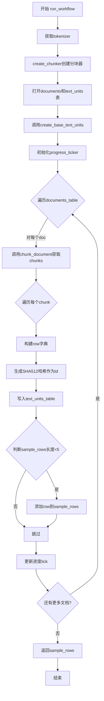
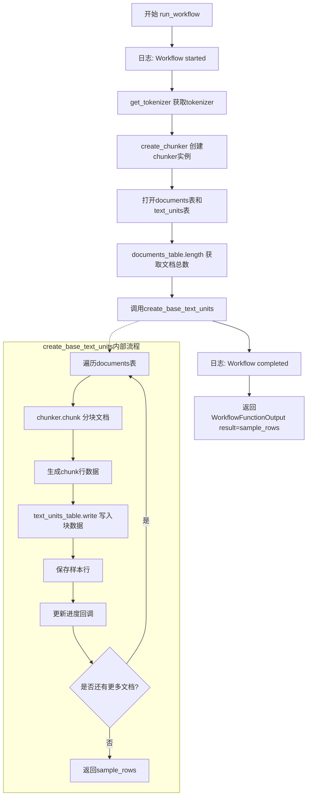
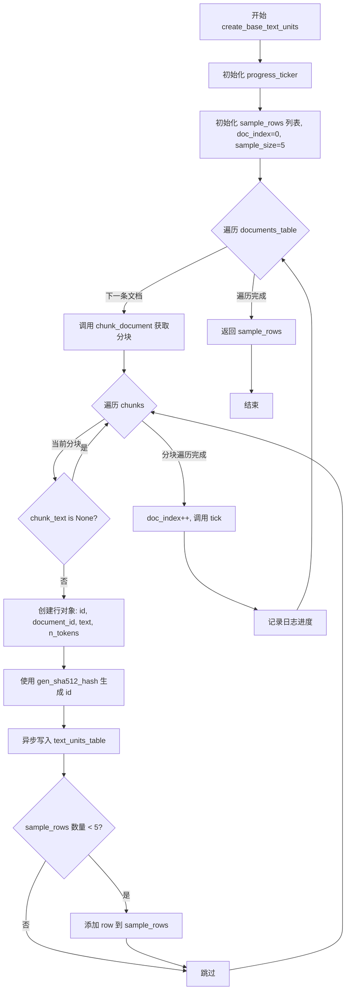
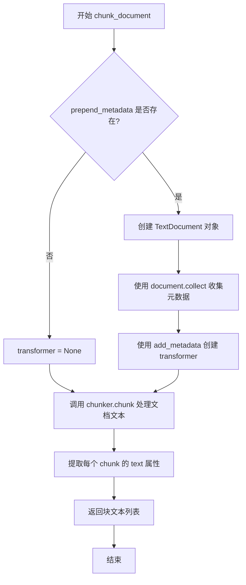

# `graphrag\packages\graphrag\graphrag\index\workflows\create_base_text_units.py` 详细设计文档

一个工作流模块，用于通过分块（chunking）将文档转换为文本单元。它从documents表中异步读取文档，使用配置的分块器进行文本切分，并将结果写入text_units表，同时生成样本数据用于验证。

## 整体流程



## 类结构

```
无显式类定义 - 基于async/await的函数式工作流代码
```

## 全局变量及字段


### `logger`
    
模块级日志记录器，用于输出工作流运行过程中的信息

类型：`logging.Logger`
    


### `tokenizer`
    
文本分词器实例，用于编码和解码文本，测量token数量

类型：`Tokenizer`
    


### `chunker`
    
文档分块器实例，用于将长文本分割成较小的块

类型：`Chunker`
    


### `total_rows`
    
文档表中待处理的文档总数，用于进度报告和循环控制

类型：`int`
    


### `sample_rows`
    
存储前5个文本单元样本行的列表，用于返回工作流执行结果样本

类型：`list[dict[str, Any]]`
    


### `sample_size`
    
样本行数量常量，固定值为5，用于限制返回的样本数量

类型：`int`
    


### `doc_index`
    
已处理的文档计数器，记录当前处理的文档索引位置

类型：`int`
    


### `tick`
    
进度回调函数，由progress_ticker创建，用于更新任务进度

类型：`Callable`
    


    

## 全局函数及方法


### `run_workflow`

该函数是GraphRAG chunking工作流的入口点，负责协调文档到文本单元的转换过程。它获取tokenizer和chunker配置，打开输入输出表，获取文档总数，然后调用`create_base_text_units`将文档分块转换为文本单元，最后返回样本行结果。

参数：

- `config`：`GraphRagConfig`，GraphRAG全局配置对象，包含chunking相关配置（如encoding_model、prepend_metadata等）
- `context`：`PipelineRunContext`，流水线运行时上下文，提供输出表访问provider和回调函数

返回值：`WorkflowFunctionOutput`，流水线函数输出对象，包含处理结果（sample_rows）

#### 流程图



#### 带注释源码

```python
async def run_workflow(
    config: GraphRagConfig,
    context: PipelineRunContext,
) -> WorkflowFunctionOutput:
    """All the steps to transform base text_units."""
    # 记录工作流开始日志
    logger.info("Workflow started: create_base_text_units")

    # 从配置中获取tokenizer，用于编码/解码文本
    tokenizer = get_tokenizer(encoding_model=config.chunking.encoding_model)
    
    # 根据配置创建chunker实例，用于将文档文本分割成块
    # 传入tokenizer的encode和decode方法
    chunker = create_chunker(config.chunking, tokenizer.encode, tokenizer.decode)

    # 使用async context manager打开输入输出表
    async with (
        # 打开documents表用于读取源文档
        context.output_table_provider.open("documents") as documents_table,
        # 打开text_units表用于写入分块后的文本单元
        context.output_table_provider.open("text_units") as text_units_table,
    ):
        # 获取文档总数，用于进度报告
        total_rows = await documents_table.length()
        
        # 调用核心处理函数create_base_text_units
        # 传入表实例、总数、回调、tokenizer和chunker
        sample_rows = await create_base_text_units(
            documents_table,
            text_units_table,
            total_rows,
            context.callbacks,
            tokenizer=tokenizer,
            chunker=chunker,
            prepend_metadata=config.chunking.prepend_metadata,
        )

    # 记录工作流完成日志
    logger.info("Workflow completed: create_base_text_units")
    
    # 返回WorkflowFunctionOutput，包含样本行结果
    return WorkflowFunctionOutput(result=sample_rows)
```


### `create_base_text_units`

该函数通过流式读写将文档表中的文档分块转换为文本单元，直接写入输出表而无需将所有数据加载到内存中，同时返回前5条样本记录用于预览。

参数：

- `documents_table`：`Table`，用于读取文档的表实例，支持异步迭代
- `text_units_table`：`Table`，用于逐行写入文本单元的表实例
- `total_rows`：`int`，用于进度报告的文档总数
- `callbacks`：`WorkflowCallbacks`，用于进度报告的回调函数
- `tokenizer`：`Tokenizer`，用于测量分块token数量的分词器
- `chunker`：`Chunker`，用于拆分文档文本的分块器
- `prepend_metadata`：`list[str] | None`，可选的要预置到每个分块的元数据字段列表

返回值：`list[dict[str, Any]]`，返回文本单元行的样本列表（前5条），包含id、document_id、text和n_tokens字段

#### 流程图



#### 带注释源码

```python
async def create_base_text_units(
    documents_table: Table,
    text_units_table: Table,
    total_rows: int,
    callbacks: WorkflowCallbacks,
    tokenizer: Tokenizer,
    chunker: Chunker,
    prepend_metadata: list[str] | None = None,
) -> list[dict[str, Any]]:
    """Transform documents into chunked text units via streaming read/write.

    Reads documents row-by-row from an async iterable and writes text units
    directly to the output table, avoiding loading all data into memory.

    Args
    ----
        documents_table: Table
            Table instance for reading documents. Supports async iteration.
        text_units_table: Table
            Table instance for writing text units row by row.
        total_rows: int
            Total number of documents for progress reporting.
        callbacks: WorkflowCallbacks
            Callbacks for progress reporting.
        tokenizer: Tokenizer
            Tokenizer for measuring chunk token counts.
        chunker: Chunker
            Chunker instance for splitting document text.
        prepend_metadata: list[str] | None
            Optional list of metadata fields to prepend to
            each chunk.
    """
    # 创建进度回调的 ticker，用于报告处理进度
    tick = progress_ticker(callbacks.progress, total_rows)

    # 记录分块过程开始日志
    logger.info(
        "Starting chunking process for %d documents",
        total_rows,
    )

    doc_index = 0  # 当前处理的文档索引
    sample_rows: list[dict[str, Any]] = []  # 样本行列表，用于返回前5条
    sample_size = 5  # 样本大小固定为5

    # 异步迭代读取文档表中的每一行文档
    async for doc in documents_table:
        # 调用 chunk_document 将文档拆分为文本块
        chunks = chunk_document(doc, chunker, prepend_metadata)
        
        # 遍历每一个文本块
        for chunk_text in chunks:
            # 跳过空值分块
            if chunk_text is None:
                continue
            
            # 构建文本单元行对象
            row = {
                "id": "",  # 初始为空，后续通过hash生成
                "document_id": doc["id"],  # 关联的文档ID
                "text": chunk_text,  # 分块后的文本内容
                "n_tokens": len(tokenizer.encode(chunk_text)),  # 计算token数量
            }
            # 使用SHA512哈希算法基于文本内容生成唯一ID
            row["id"] = gen_sha512_hash(row, ["text"])
            
            # 异步写入文本单元表
            await text_units_table.write(row)

            # 如果样本行未满5条，则添加到样本列表
            if len(sample_rows) < sample_size:
                sample_rows.append(row)

        # 文档索引递增，更新进度
        doc_index += 1
        tick()
        # 记录当前分块进度日志
        logger.info(
            "chunker progress:  %d/%d",
            doc_index,
            total_rows,
        )

    # 处理完成后返回样本行列表
    return sample_rows
```


### `chunk_document`

将单个文档行拆分为文本片段，通过可选的元数据前缀增强处理。

参数：

- `doc`：`dict[str, Any]`，文档行作为字典
- `chunker`：`Chunker`，用于拆分文本的 Chunker 实例
- `prepend_metadata`：`list[str] | None`，可选的元数据字段列表，用于前置到每个块

返回值：`list[str]`，块文本字符串列表

#### 流程图



#### 带注释源码

```python
def chunk_document(
    doc: dict[str, Any],
    chunker: Chunker,
    prepend_metadata: list[str] | None = None,
) -> list[str]:
    """Chunk a single document row into text fragments.

    Args
    ----
        doc: dict[str, Any]
            A single document row as a dictionary.
        chunker: Chunker
            Chunker instance for splitting text.
        prepend_metadata: list[str] | None
            Optional metadata fields to prepend.

    Returns
    -------
        list[str]:
            List of chunk text strings.
    """
    # 初始化 transformer 为 None
    transformer = None
    
    # 如果提供了 prepend_metadata，则创建 transformer
    if prepend_metadata:
        # 从文档字典创建 TextDocument 对象
        document = TextDocument(
            id=doc["id"],
            title=doc.get("title", ""),
            text=doc["text"],
            creation_date=doc.get("creation_date", ""),
            raw_data=doc.get("raw_data"),
        )
        # 收集指定的元数据字段
        metadata = document.collect(prepend_metadata)
        # 创建元数据转换器，使用 ".\n" 作为行分隔符
        transformer = add_metadata(metadata=metadata, line_delimiter=".\n")

    # 使用 chunker 对文档文本进行分块，传入可选的 transformer
    # 并提取每个 chunk 的 text 属性组成列表返回
    return [chunk.text for chunk in chunker.chunk(doc["text"], transform=transformer)]
```

## 关键组件


### run_workflow

工作流的主入口函数，负责初始化分词器和分块器，打开文档和文本单元表，调用 create_base_text_units 执行具体的文档分块任务，并返回示例结果。

### create_base_text_units

核心转换函数，通过流式读写将文档转换为分块文本单元。从文档表逐行读取文档，使用分块器进行分块处理，写入文本单元表，同时生成样本数据用于返回。

### chunk_document

单个文档的分块函数，根据文档内容调用分块器进行文本切分，支持可选的元数据前置功能，通过 add_metadata 转换器为每个块添加元数据。

### Chunker 接口

文本分块的核心抽象接口，负责将文档文本分割成较小的块，支持自定义转换器（transform）来处理分块过程中的元数据添加逻辑。

### Tokenizer

分词器接口，提供 encode 和 decode 方法用于测量文本的 token 数量，用于计算每个文本块的 n_tokens 字段值。

### Table 接口

数据表抽象，支持异步迭代读取（async for doc in documents_table）和异步写入（await text_units_table.write(row)），实现流式处理避免将所有数据加载到内存。

### WorkflowCallbacks

工作流回调接口，提供进度报告功能，通过 progress_ticker 生成进度指示器用于显示文档处理进度。

### add_metadata

元数据转换器工厂函数，根据指定的元数据字段列表从文档中收集相应信息，并生成可应用于分块文本的转换函数。

### gen_sha512_hash

哈希生成函数，使用 SHA512 算法为文本单元生成唯一标识符，基于文本内容生成哈希值。

### progress_ticker

进度 ticker 工厂函数，用于创建进度报告回调，支持在处理大量文档时报告当前进度百分比。

### TextDocument

文档数据模型类，用于封装文档的 id、title、text、creation_date、raw_data 等属性，提供 collect 方法用于收集指定的元数据字段。


## 问题及建议


### 已知问题

-   **缺乏输入验证**：代码未验证文档必需字段（如 `id`、`text`）是否存在，若字段缺失会导致 `KeyError` 异常
-   **无错误处理机制**：`create_base_text_units` 函数中遍历文档和处理分块时没有 try-except 捕获异常，单个文档处理失败会导致整个工作流中断
-   **重复编码计算**：在 `len(tokenizer.encode(chunk_text))` 计算后，后续 `gen_sha512_hash` 可能再次访问 `row["text"]` 导致重复编码
-   **逐行写入性能瓶颈**：`text_units_table.write(row)` 采用逐行写入模式，未使用批量写入操作，大规模数据处理效率较低
-   **日志过于频繁**：在每个文档处理完成后都记录 "chunker progress" 日志，高频率 I/O 操作可能影响性能
-   **魔法数字**：`sample_size = 5` 使用硬编码值，缺乏可配置性

### 优化建议

-   **添加输入验证**：在处理文档前验证必需字段是否存在，为缺失字段提供明确的错误信息或默认值
-   **实现错误处理**：使用 try-except 包裹文档处理逻辑，记录错误并继续处理后续文档，确保单个文档失败不影响整体流程
-   **缓存编码结果**：将 `tokenizer.encode(chunk_text)` 的结果存储后复用，避免重复计算
-   **批量写入优化**：检查 Table 接口是否支持批量写入 API（如 `write_many`），减少数据库 I/O 次数
-   **调整日志级别**：将 "chunker progress" 日志改为 DEBUG 级别，或改为每处理 N 个文档记录一次（如每 100 个）
-   **配置化采样大小**：将 `sample_size` 从硬编码改为从配置参数读取，提高灵活性
-   **添加类型注解**：为局部变量如 `doc_index`、`sample_rows` 添加类型提示，提升代码可读性


## 其它


### 设计目标与约束

**设计目标**：实现一个高效、低内存占用的文档分块工作流，将原始文档通过流式读取、分块处理、流式写入的方式转换为text_units表，支持自定义元数据前置和进度追踪。

**设计约束**：
- 必须使用异步IO进行流式处理，避免将所有文档加载到内存
- 分块数量必须基于tokenizer进行计算，确保符合LLM上下文窗口限制
- 必须支持进度回调以便在大型数据集上提供用户反馈
- 输出表必须包含id（SHA512哈希）、document_id、text、n_tokens字段

### 错误处理与异常设计

**主要异常场景**：
1. **tokenizer获取失败**：若`get_tokenizer()`返回None或无效tokenizer，程序将在encode/decode调用时抛出AttributeError
2. **chunker创建失败**：`create_chunker()`可能因无效配置返回None或抛出异常
3. **表读取/写入异常**：documents_table或text_units_table的迭代/写入操作可能因底层存储故障抛出异常
4. **文档字段缺失**：若doc字典缺少"id"、"text"等必需字段，将抛出KeyError
5. **metadata字段缺失**：当prepend_metadata指定但doc缺少对应字段时，TextDocument.get()可能返回空值

**错误处理策略**：
- 使用try-except捕获表操作异常，记录日志后继续处理或终止
- 对缺失字段使用dict.get()提供默认值，避免KeyError中断流程
- chunk_text为None时显式跳过，避免写入空值

### 数据流与状态机

**数据流**：
```
[documents表] 
    ↓ (async for遍历)
[文档行 dict]
    ↓ (chunk_document处理)
[文本块列表 list[str]]
    ↓ (逐个处理)
[行字典 row]
    ↓ (await write)
[text_units表]
```

**状态转移**：
1. **初始化状态**：获取tokenizer和chunker实例，打开输入输出表
2. **迭代状态**：遍历documents_table，每次读取一行文档
3. **分块状态**：对当前文档调用chunker.chunk()，得到chunks迭代器
4. **写入状态**：对每个chunk构建行对象，计算哈希，写入text_units_table
5. **采样状态**：维护sample_rows列表，最多保留5条样本
6. **完成状态**：返回sample_rows，关闭表连接

### 外部依赖与接口契约

**外部依赖**：
- `graphrag_chunking.chunker.Chunker`：文本分块抽象接口
- `graphrag_chunking.chunker_factory.create_chunker`：分块器工厂函数
- `graphrag_chunking.transformers.add_metadata`：元数据转换器
- `graphrag_input.TextDocument`：文档数据模型
- `graphrag_llm.tokenizer.Tokenizer`：token计数接口
- `graphrag_storage.tables.table.Table`：表读写抽象
- `graphrag.index.typing.context.PipelineRunContext`：流水线运行时上下文
- `graphrag.index.typing.workflow.WorkflowCallbacks`：进度回调接口

**接口契约**：
- `run_workflow(config, context)`：接收GraphRagConfig和PipelineRunContext，返回WorkflowFunctionOutput
- `documents_table`：必须支持async迭代，返回包含id、text、title、creation_date、raw_data字段的字典
- `text_units_table`：必须支持await write(row)方法，接受包含id、document_id、text、n_tokens字段的字典
- `tokenizer.encode(text)`：返回token列表
- `chunker.chunk(text, transform)`：返回chunk迭代器，每个chunk有text属性

### 并发与异步处理设计

**并发策略**：
- 使用async/await实现异步IO，避免阻塞事件循环
- 表的读取和写入均为异步操作，支持高并发场景
- 使用progress_ticker在每次文档处理后更新进度

**并发限制**：
- 当前实现为串行处理每个文档，未利用asyncio.gather并发处理多个文档
- 写入操作为逐条同步，未使用批量写入优化

### 配置与参数说明

**config参数**：
- `config.chunking.encoding_model`：tokenizer编码模型名称
- `config.chunking.prepend_metadata`：需要前置到chunks的元数据字段列表

**函数参数**：
- `documents_table`：文档输入表
- `text_units_table`：文本块输出表
- `total_rows`：文档总数，用于进度计算
- `callbacks`：进度回调对象
- `tokenizer`：token编码/解码器
- `chunker`：文本分块器实例
- `prepend_metadata`：可选的元数据字段列表

### 性能考虑与优化空间

**当前性能特征**：
- 内存占用：仅在内存中保留当前处理的文档和sample_rows，理论上可处理无限量数据
- IO模式：流式读取+逐条写入，IO效率较低
- 计算瓶颈：每次chunk都需要tokenize计算n_tokens，存在重复计算

**优化建议**：
1. 使用chunker内置的token计数功能，避免单独调用tokenizer.encode
2. 批量写入：积累一定数量chunks后批量写入，减少IO次数
3. 并发处理：使用asyncio.gather并发处理多个文档
4. 采样优化：根据total_rows动态调整sample_size，而非硬编码5

### 安全性考虑

**数据安全**：
- 不存储原始文档内容，仅存储分块后的文本
- SHA512哈希作为ID提供一定程度的去重和防篡改能力

**输入验证**：
- 未对documents_table返回的doc结构进行严格验证
- 未检查chunk_text长度是否超过tokenizer最大限制

### 测试策略建议

**单元测试**：
- 测试chunk_document函数的各种输入场景（有无prepend_metadata、特殊字符等）
- 测试空文档、单字符文档、极大文档的处理

**集成测试**：
- 使用内存表模拟documents_table和text_units_table
- 验证写入的row结构是否符合预期
- 验证sample_rows采样逻辑

**性能测试**：
- 测试10万级文档的处理时间和内存占用
- 测试tokenizer和chunker的性能基准

### 版本兼容性说明

**Python版本**：需要Python 3.10+（支持dict[] | None联合类型语法）

**依赖兼容性**：
- graphrag_chunking模块需实现Chunker接口和create_chunker工厂
- graphrag_input需提供TextDocument类
- graphrag_storage.tables.table需实现Table异步迭代和write方法


    