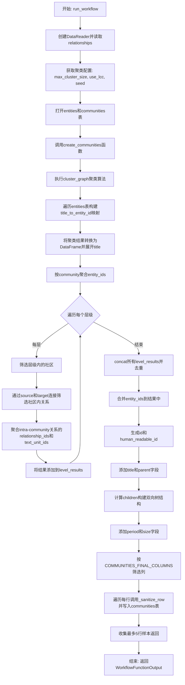
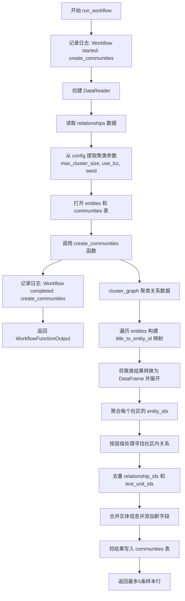
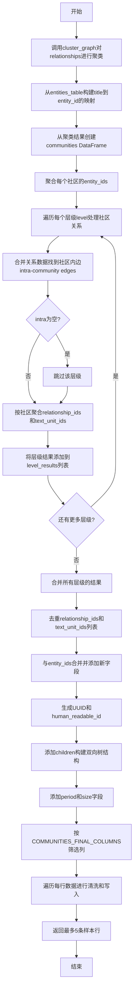

# `graphrag\packages\graphrag\graphrag\index\workflows\create_communities.py` 详细设计文档

一个用于从图中创建社区的工作流模块，通过聚类算法对关系进行社区检测，并构建层次化的社区结构，包括实体聚合、关系聚合、父子层级关系维护，最终将社区数据写入输出表

## 整体流程



## 类结构

```
无显式类定义 (主要使用函数式编程)
├── 全局函数
│   ├── run_workflow (async) - 主工作流入口
│   ├── create_communities (async) - 核心社区创建逻辑
│   └── _sanitize_row - 数据类型清洗辅助函数
├── 外部依赖类/接口
│   ├── GraphRagConfig - 配置模型
│   ├── PipelineRunContext - 管道运行上下文
│   ├── WorkflowFunctionOutput - 工作流输出类型
│   ├── Table - 表操作接口
│   ├── DataReader - 数据读取器
│   └── cluster_graph - 聚图函数
```

## 全局变量及字段


### `logger`
    
模块级日志记录器，用于记录工作流运行信息

类型：`logging.Logger`
    


### `max_cluster_size`
    
最大聚类大小，用于层次Leiden算法

类型：`int`
    


### `use_lcc`
    
是否限制为最大连通分量

类型：`bool`
    


### `seed`
    
随机种子，用于确定聚类

类型：`int | None`
    


### `relationships`
    
包含source、target、weight、text_unit_ids列的关系数据框

类型：`pd.DataFrame`
    


### `clusters`
    
聚类结果列表，每个元素包含level、community、parent、title

类型：`list`
    


### `title_to_entity_id`
    
标题到实体ID的映射字典

类型：`dict[str, str]`
    


### `communities`
    
从聚类数据构建的社区数据框

类型：`pd.DataFrame`
    


### `entity_map`
    
社区与实体ID映射的数据框副本

类型：`pd.DataFrame`
    


### `entity_ids`
    
按社区分组的实体ID聚合结果

类型：`pd.DataFrame`
    


### `level_results`
    
存储每个层级聚类结果的列表

类型：`list[pd.DataFrame]`
    


### `all_grouped`
    
合并并重命名后的层级聚合结果数据框

类型：`pd.DataFrame`
    


### `final_communities`
    
最终社区数据框，包含所有字段和子节点信息

类型：`pd.DataFrame`
    


### `output`
    
按COMMUNITIES_FINAL_COLUMNS筛选后的输出数据框

类型：`pd.DataFrame`
    


### `rows`
    
输出数据框转换成的字典列表

类型：`list[dict[str, Any]]`
    


### `sample_rows`
    
最多5条社区行样本，用于日志记录

类型：`list[dict[str, Any]]`
    


    

## 全局函数及方法


### `run_workflow`

该函数是社区创建工作流的主入口点，通过读取关系数据并调用聚类算法生成社区结构，最终将结果写入社区表中。

参数：

- `config`：`GraphRagConfig`，全局配置对象，包含聚图配置参数（如 max_cluster_size、use_lcc、seed）
- `context`：`PipelineRunContext`，管道运行上下文，提供输出表提供者等运行时环境

返回值：`WorkflowFunctionOutput`，包含社区样本行的结果对象

#### 流程图



#### 带注释源码

```python
async def run_workflow(
    config: GraphRagConfig,
    context: PipelineRunContext,
) -> WorkflowFunctionOutput:
    """All the steps to transform final communities."""
    # 记录工作流开始日志
    logger.info("Workflow started: create_communities")
    
    # 创建数据读取器，用于从输出表提供者读取数据
    reader = DataReader(context.output_table_provider)
    
    # 异步读取关系数据（包含 source, target, weight, text_unit_ids）
    relationships = await reader.relationships()

    # 从配置中提取聚类算法参数
    max_cluster_size = config.cluster_graph.max_cluster_size
    use_lcc = config.cluster_graph.use_lcc
    seed = config.cluster_graph.seed

    # 打开输出表：entities 表（输入）和 communities 表（输出）
    async with (
        context.output_table_provider.open("entities") as entities_table,
        context.output_table_provider.open("communities") as communities_table,
    ):
        # 执行社区创建逻辑，返回最多5条样本用于日志记录
        sample_rows = await create_communities(
            communities_table,
            entities_table,
            relationships,
            max_cluster_size=max_cluster_size,
            use_lcc=use_lcc,
            seed=seed,
        )

    # 记录工作流完成日志
    logger.info("Workflow completed: create_communities")
    
    # 返回工作流输出结果（包含社区样本行）
    return WorkflowFunctionOutput(result=sample_rows)
```


### `create_communities`

该函数通过聚类算法对关系数据进行社区发现，并将结果写入社区表，同时返回最多5条社区记录用于日志记录。

参数：

- `communities_table`：`Table`，输出表，用于写入社区行数据
- `entities_table`：`Table`，包含实体行的表，用于获取实体ID映射
- `relationships`：`pd.DataFrame`，关系数据框，包含source、target、weight、text_unit_ids列
- `max_cluster_size`：`int`，用于层次Leiden算法的最大聚类大小
- `use_lcc`：`bool`，是否限制为最大连通分量
- `seed`：`int | None`，用于确定性聚类的随机种子

返回值：`list[dict[str, Any]]`，最多5条社区行样本，用于日志记录

#### 流程图



#### 带注释源码

```python
async def create_communities(
    communities_table: Table,  # 输出表，写入社区数据
    entities_table: Table,     # 输入表，读取实体数据
    relationships: pd.DataFrame,  # 输入数据，关系表
    max_cluster_size: int,     # 聚类参数：最大簇大小
    use_lcc: bool,             # 聚类参数：是否使用最大连通分量
    seed: int | None = None,  # 聚类参数：随机种子
) -> list[dict[str, Any]]:
    """Build communities from clustered relationships and stream rows to the table.

    Args
    ----
        communities_table: Table
            Output table to write community rows to.
        entities_table: Table
            Table containing entity rows.
        relationships: pd.DataFrame
            Relationships DataFrame with source, target, weight,
            text_unit_ids columns.
        max_cluster_size: int
            Maximum cluster size for hierarchical Leiden.
        use_lcc: bool
            Whether to restrict to the largest connected component.
        seed: int | None
            Random seed for deterministic clustering.

    Returns
    -------
        list[dict[str, Any]]
            Sample of up to 5 community rows for logging.
    """
    # 第一步：使用聚类算法对关系图进行社区发现
    # 返回clusters: [(level, community, parent, title), ...]
    clusters = cluster_graph(
        relationships,
        max_cluster_size,
        use_lcc,
        seed=seed,
    )

    # 第二步：从实体表构建title到entity_id的映射字典
    # 用于后续将社区标题映射到实体ID
    title_to_entity_id: dict[str, str] = {}
    async for row in entities_table:
        title_to_entity_id[row["title"]] = row["id"]

    # 第三步：将聚类结果转换为DataFrame并展开title列
    # 每个title对应一个社区成员
    communities = pd.DataFrame(
        clusters, columns=pd.Index(["level", "community", "parent", "title"])
    ).explode("title")
    # 确保community列为整数类型
    communities["community"] = communities["community"].astype(int)

    # 第四步：聚合每个社区的entity_ids
    # 通过title映射获取对应entity_id，然后按社区分组聚合
    entity_map = communities[["community", "title"]].copy()
    entity_map["entity_id"] = entity_map["title"].map(title_to_entity_id)
    entity_ids = (
        entity_map
        .dropna(subset=["entity_id"])  # 移除没有对应entity的记录
        .groupby("community")
        .agg(entity_ids=("entity_id", list))
        .reset_index()
    )

    # 第五步：按层级处理社区内关系
    # 找出源和目标都在同一社区内的关系（社区内边）
    # 这样可以跟踪每个社区涉及的关系和文本单元
    level_results = []
    for level in communities["level"].unique():
        # 获取当前层级的社区
        level_comms = communities[communities["level"] == level]
        
        # 第一次合并：找到关系源在社区中的记录
        with_source = relationships.merge(
            level_comms, left_on="source", right_on="title", how="inner"
        )
        # 第二次合并：找到关系目标也在社区中的记录
        with_both = with_source.merge(
            level_comms, left_on="target", right_on="title", how="inner"
        )
        # 筛选出社区内边：源和目标在同一个社区
        intra = with_both[with_both["community_x"] == with_both["community_y"]]
        
        if intra.empty:
            continue  # 当前层级没有社区内边，跳过
        
        # 按社区和父节点聚合关系ID和文本单元ID
        grouped = (
            intra
            .explode("text_unit_ids")  # 展开text_unit_ids列表
            .groupby(["community_x", "parent_x"])
            .agg(
                relationship_ids=("id", list),
                text_unit_ids=("text_unit_ids", list),
            )
            .reset_index()
        )
        grouped["level"] = level  # 记录所属层级
        level_results.append(grouped)

    # 第六步：合并所有层级的聚合结果
    all_grouped = pd.concat(level_results, ignore_index=True).rename(
        columns={
            "community_x": "community",
            "parent_x": "parent",
        }
    )

    # 第七步：对ID列表进行去重和排序
    # 确保每个列表中的ID唯一且有序
    all_grouped["relationship_ids"] = all_grouped["relationship_ids"].apply(
        lambda x: sorted(set(x))
    )
    all_grouped["text_unit_ids"] = all_grouped["text_unit_ids"].apply(
        lambda x: sorted(set(x))
    )

    # 第八步：合并实体ID并添加新字段
    # 将社区与对应的实体ID关联，并生成额外字段
    final_communities = all_grouped.merge(entity_ids, on="community", how="inner")
    
    # 生成唯一标识符
    final_communities["id"] = [str(uuid4()) for _ in range(len(final_communities))]
    # 人类可读的社区ID
    final_communities["human_readable_id"] = final_communities["community"]
    # 社区标题
    final_communities["title"] = "Community " + final_communities["community"].astype(
        str
    )
    # 确保parent为整数类型
    final_communities["parent"] = final_communities["parent"].astype(int)
    
    # 第九步：构建双向树结构
    # 为每个社区添加子节点列表，实现树的上下遍历
    parent_grouped = cast(
        "pd.DataFrame",
        final_communities.groupby("parent").agg(children=("community", "unique")),
    )
    final_communities = final_communities.merge(
        parent_grouped,
        left_on="community",
        right_on="parent",
        how="left",
    )
    # 将NaN的children替换为空列表
    final_communities["children"] = final_communities["children"].apply(
        lambda x: x if isinstance(x, np.ndarray) else []  # type: ignore
    )
    
    # 第十步：添加增量更新跟踪字段
    # period：当前日期的ISO格式字符串
    final_communities["period"] = datetime.now(timezone.utc).date().isoformat()
    # size：社区包含的实体数量
    final_communities["size"] = final_communities.loc[:, "entity_ids"].apply(len)

    # 第十一步：按目标列格式筛选并输出
    output = final_communities.loc[:, COMMUNITIES_FINAL_COLUMNS]
    rows = output.to_dict("records")
    
    # 第十二步：逐行写入并收集样本
    sample_rows: list[dict[str, Any]] = []
    for row in rows:
        row = _sanitize_row(row)  # 转换numpy类型为Python原生类型
        await communities_table.write(row)  # 异步写入表
        if len(sample_rows) < 5:
            sample_rows.append(row)
    return sample_rows
```


### `_sanitize_row`

将 NumPy 数据类型转换为原生 Python 类型，以便进行表格序列化和存储。

参数：

- `row`：`dict[str, Any]`，需要清洗的行数据字典，可能包含 NumPy 类型的值

返回值：`dict[str, Any]`，转换后的字典，所有 NumPy 类型均已转换为对应的 Python 原生类型

#### 流程图

```mermaid
flowchart TD
    A[开始] --> B[初始化空字典 sanitized]
    B --> C{遍历 row 中的每个 key-value}
    C --> D{value 是 np.ndarray?}
    D -->|是| E[sanitized[key] = value.tolist]
    D -->|否| F{value 是 np.integer?}
    E --> C
    F -->|是| G[sanitized[key] = int(value)]
    F -->|否| H{value 是 np.floating?}
    G --> C
    H -->|是| I[sanitized[key] = float(value)]
    H -->|否| J[sanitized[key] = value]
    I --> C
    J --> C
    C --> K{遍历完成?}
    K -->|是| L[返回 sanitized 字典]
    K -->|否| C
```

#### 带注释源码

```python
def _sanitize_row(row: dict[str, Any]) -> dict[str, Any]:
    """Convert numpy types to native Python types for table serialization."""
    # 初始化一个空字典用于存储清洗后的数据
    sanitized = {}
    
    # 遍历输入字典中的每个键值对
    for key, value in row.items():
        # 检查值是否为 NumPy 数组类型
        if isinstance(value, np.ndarray):
            # 将 NumPy 数组转换为 Python 列表
            sanitized[key] = value.tolist()
        # 检查值是否为 NumPy 整数类型
        elif isinstance(value, np.integer):
            # 将 NumPy 整数转换为 Python int
            sanitized[key] = int(value)
        # 检查值是否为 NumPy 浮点数类型
        elif isinstance(value, np.floating):
            # 将 NumPy 浮点数转换为 Python float
            sanitized[key] = float(value)
        else:
            # 对于其他类型，直接保留原值
            sanitized[key] = value
    
    # 返回清洗后的字典
    return sanitized
```

## 关键组件


### 社区创建工作流 (run_workflow)

异步工作流入口函数，负责协调整个社区创建流程，包括读取关系数据、调用聚类算法、写入社区表并返回示例行。

### 核心社区构建函数 (create_communities)

从关系和实体数据构建层次化社区，包含图聚类、实体映射、关系聚合、社区树构建等核心逻辑，支持增量更新跟踪。

### 惰性迭代与流式处理 (entities_table async for)

使用异步迭代器逐行读取实体表，按title到id构建映射字典，实现惰性加载避免内存溢出。

### 图聚类算法调用 (cluster_graph)

调用层次化Leiden聚类算法，处理最大簇大小限制和最大连通分量选项，返回包含层级、社区、父节点、标题的聚类结果。

### 层级化社区处理 (level_results 循环)

按层级遍历社区，分别处理每层的内边（intra-community edges），通过两次merge筛选源和目标都在同一社区的关系，控制中间DataFrame大小。

### 关系ID与文本单元聚合 (groupby聚合)

对社区内关系按社区和父节点分组聚合，收集relationship_ids和text_unit_ids列表，支持层次结构追踪。

### 双向树构建 (parent_grouped merge)

通过父节点聚合子社区，构建双向树结构，使社区支持上下遍历，同时处理NaN为空列表的情况。

### 增量更新字段 (period, size)

添加period字段记录UTC日期用于增量更新追踪，计算每个社区的实体数量作为size字段。

### NumPy类型反序列化 (_sanitize_row)

将numpy数组、整数、浮点数转换为Python原生类型列表、int、float，确保表格序列化兼容性。


## 问题及建议


### 已知问题

-   **实体映射效率低下**：使用 `async for row in entities_table` 逐行迭代构建 title_to_entity_id 字典，在大规模实体数据集上性能较差，应考虑批量读取或使用更高效的查询方式
-   **Magic Number 硬编码**：`sample_rows` 限制数量 5 硬编码在代码中（`if len(sample_rows) < 5`），缺乏可配置性
-   **内存占用风险**：多次执行 `explode()` 和多重 `merge()` 操作会在内存中产生大量中间 DataFrame，可能导致大型数据集处理时的内存溢出
-   **title 唯一性假设未验证**：代码假设 entity 的 title 是唯一的，如果存在重复 title，后面的记录会覆盖前面的，导致数据丢失风险
-   **UUID 生成效率**：使用列表推导式 `[str(uuid4()) for _ in range(len(final_communities))]` 逐个生成 UUID，批量场景下可考虑 `uuid4_obj` 优化
-   **关系处理逻辑简化**：仅处理 source 和 target 都在同一社区内的关系，可能遗漏跨社区的重要关系信息
-   **空值处理不完整**：虽然使用了 `dropna()`，但未对空社区层级或空聚类结果进行提前返回或错误处理

### 优化建议

-   **提取配置常量**：将采样数量 5、列名等硬编码值提取为模块级常量或配置参数
-   **批量读取实体**：使用 entities_table 的批量查询方法一次性获取所有实体，减少异步迭代开销
-   **分批处理数据**：对于大规模关系数据，考虑分批处理 merge 操作或使用数据库级别的 JOIN
-   **添加数据校验**：在构建 title_to_entity_id 映射前检查 title 唯一性，必要时记录警告
-   **优化 UUID 生成**：使用 `uuid.NAMESPACE_DNS` 或批量生成策略减少 UUID 对象创建开销
-   **函数拆分**：将 `create_communities` 函数中处理实体映射、关系聚合、社区构建等逻辑拆分为独立函数，提高可测试性
-   **增加错误处理**：对空输入数据（空 relationships、空 entities）添加提前返回或明确错误提示
-   **类型提示完善**：补充部分缺失的类型注解，如 `level_results` 的类型

## 其它


### 设计目标与约束

该代码的核心目标是将图谱中的实体和关系进行聚类，生成层级化的社区结构。主要设计目标包括：1）基于关系数据创建社区聚类；2）支持层级化社区（多层父子关系）；3）支持最大连通分量（LCC）选项；4）支持确定性聚类（通过随机种子）；5）支持增量更新追踪（通过period字段）。约束条件包括：依赖外部的entities和relationships表；需要cluster_graph算法支持；输出表schema必须符合COMMUNITIES_FINAL_COLUMNS定义。

### 错误处理与异常设计

代码采用了以下错误处理策略：1）使用try-except风格的类型转换（通过_sanitize_row函数处理numpy类型转换失败）；2）空数据处理（intra.empty时continue跳过）；3）异步上下文管理器确保资源正确释放；4）缺失值处理（dropna、fillna策略）。潜在异常包括：entities_table读取失败、relationships为空导致无输出、merge操作产生大量无效匹配、内存溢出（大规模数据时）。

### 数据流与状态机

数据流如下：1）输入：relationships DataFrame + entities Table + config参数；2）聚类阶段：cluster_graph生成clusters；3）实体映射阶段：构建title_to_entity_id字典；4）社区构建阶段：创建communities DataFrame并explode title；5）关系聚合阶段：按层级处理，筛选社区内关系，聚合relationship_ids和text_unit_ids；6）字段增强阶段：添加id、human_readable_id、title、parent、children、period、size字段；7）输出阶段：写入communities_table并返回sample_rows。无复杂状态机，为线性数据处理流程。

### 外部依赖与接口契约

主要外部依赖包括：1）graphrag_storage.tables.table.Table - 表读写接口；2）graphrag.config.models.graph_rag_config.GraphRagConfig - 配置模型；3）graphrag.data_model.data_reader.DataReader - 数据读取接口；4）graphrag.index.operations.cluster_graph.cluster_graph - 聚类算法；5）graphrag.index.typing.context.PipelineRunContext - 流程上下文；6）graphrag.data_model.schemas.COMMUNITIES_FINAL_COLUMNS - 输出schema定义。接口契约：reader.relationships()返回pd.DataFrame；entities_table支持async for遍历；communities_table.write()为异步写入。

### 性能考虑与优化点

性能优化点：1）分层处理（for level in communities["level"].unique()）避免内存爆炸；2）使用explode而非笛卡尔积；3）list去重使用set转换；4）sample_rows限制为5条减少内存。潜在优化空间：1）title_to_entity_id构建为dict，可考虑增量更新而非全量构建；2）merge操作可能产生大量中间数据，大规模场景需优化；3）关系聚合可考虑向量化替代循环；4）可添加缓存机制避免重复读取entities。

### 并发与异步处理

代码使用Python异步编程模式：1）async def定义异步函数；2）async with管理资源生命周期；3）await用于异步IO操作（reader.relationships()、table.read()、table.write()）；4）async for遍历异步迭代器。无并发锁或线程池使用，为单协程异步模型。注意事项：需在异步事件循环中运行；write操作可考虑批量写入优化。

### 数据模型与Schema

输入数据模型：relationships表需包含source、target、weight、text_unit_ids、id列；entities表需包含title、id列。输出数据模型（COMMUNITIES_FINAL_COLUMNS）：id（UUID）、human_readable_id、title、level、parent、children（list）、relationship_ids（list）、text_unit_ids（list）、entity_ids（list）、period（ISO日期）、size（int）。内部数据结构：clusters为(level, community, parent, title)元组列表；communities为DataFrame含level/community/parent/title列；entity_map用于社区与实体ID映射。

### 配置与参数

主要配置参数：1）config.cluster_graph.max_cluster_size - 层级Leiden最大聚类数；2）config.cluster_graph.use_lcc - 是否限制为最大连通分量；3）config.cluster_graph.seed - 随机种子用于确定性聚类。其他隐含配置：context.output_table_provider - 表存储提供者；COMMUNITIES_FINAL_COLUMNS - 输出列定义。

### 日志与监控

日志策略：1）使用Python标准logging模块；2）logger.info记录工作流开始和完成；3）模块级别logger（__name__）。监控点：工作流开始/完成日志；sample_rows返回（前5条）用于验证。无指标收集、追踪集成或性能监控。

### 安全性考虑

代码本身无直接安全风险（纯数据处理），但需注意：1）uuid4生成id依赖随机性，生产环境需考虑UUID版本；2）外部输入（relationships/entities）需确保可信；3）period使用datetime.now()存在时钟回拨风险；4）数据写入需考虑表访问权限控制。

### 测试策略

建议测试用例：1）空relationships输入场景；2）空entities输入场景；3）单层级vs多层级的社区生成；4）use_lcc开关的功能验证；5）seed参数确定性验证；6）大规模数据集性能测试；7）_sanitize_row对各类numpy类型的转换覆盖。测试方式：单元测试（cluster_graph mock）、集成测试（完整workflow）、性能基准测试。

### 版本兼容性

Python版本：需3.10+（支持typed dict union语法）；依赖库版本：numpy（类型处理）、pandas（DataFrame操作）、async API（需asyncio支持）。向量化与类型注解：使用pd.Index、cast等较新特性，需确保pandas版本兼容。

### 扩展性与未来考虑

可扩展方向：1）支持自定义聚类算法（注入cluster_graph实现）；2）支持增量更新模式（基于period的差分处理）；3）支持社区元数据（描述、摘要等）；4）支持并行层级处理；5）添加缓存层优化重复计算。当前实现为一次性批处理，适合初始化场景。


    