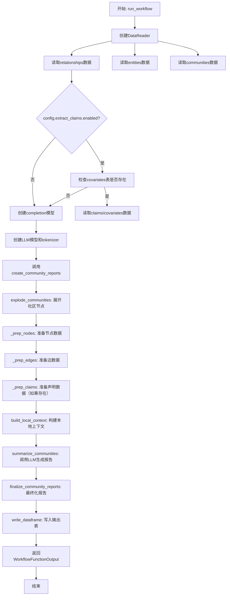
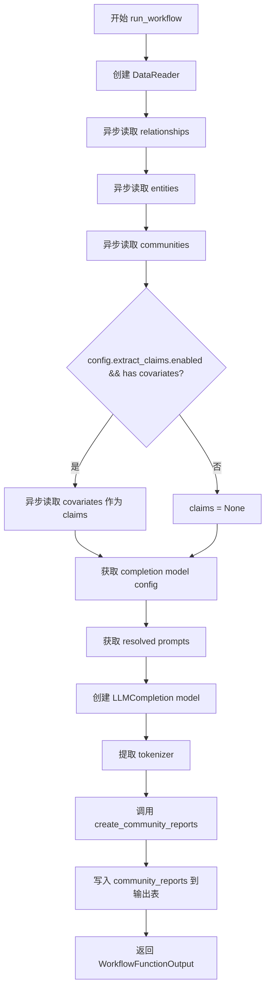
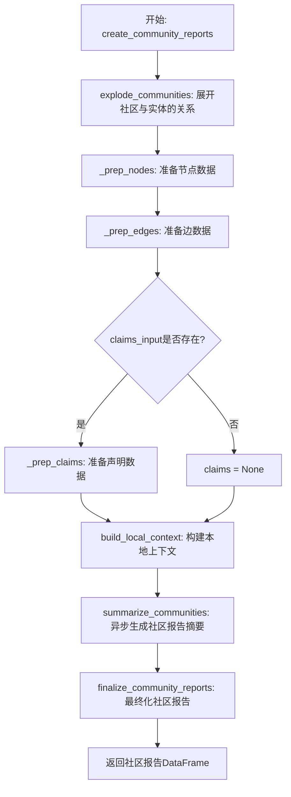
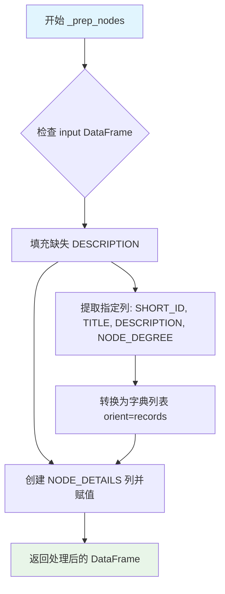
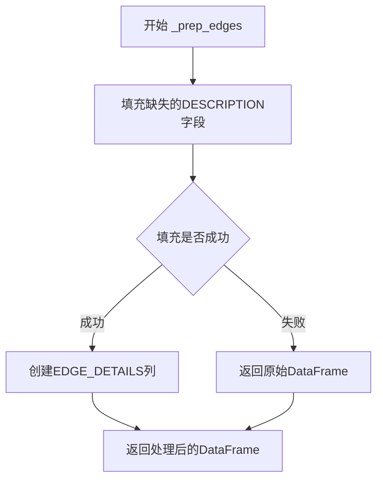
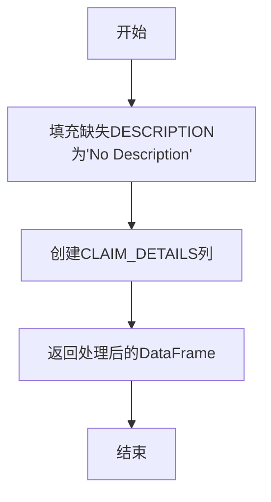

# `graphrag\packages\graphrag\graphrag\index\workflows\create_community_reports.py` 详细设计文档

这是一个社区报告生成工作流模块，通过读取实体、关系、社区和声明数据，使用LLM模型生成社区报告摘要，最终输出结构化的社区报告数据。

## 整体流程



## 类结构

```
模块: graphrag.index.workflows.create_community_reports
└── 主要函数: run_workflow (异步入口)
    └── 内部函数: create_community_reports
        ├── 数据准备: _prep_nodes, _prep_edges, _prep_claims
        └── 核心处理: explode_communities, build_local_context, summarize_communities, finalize_community_reports
```

## 全局变量及字段


### `logger`
    
模块级日志记录器，用于记录工作流执行过程中的信息

类型：`logging.Logger`
    


### `claims`
    
声明/covariates数据DataFrame，包含从数据源读取的额外信息（如有启用）

类型：`pd.DataFrame | None`
    


### `model_config`
    
LLM模型配置对象，包含社区报告生成所需的模型参数

类型：`CompletionModelConfig`
    


### `prompts`
    
提示词配置对象，包含社区报告生成所需的提示词模板

类型：`CommunityReportPrompts`
    


### `model`
    
LLM completion实例，用于生成社区报告内容

类型：`LLMCompletion`
    


### `tokenizer`
    
分词器实例，用于对输入文本进行tokenization并计算token数量

类型：`Tokenizer`
    


### `output`
    
输出的社区报告DataFrame，最终写入到数据表中的结果

类型：`pd.DataFrame`
    


### `nodes`
    
处理后的节点数据，包含实体信息和NODE_DETAILS字段

类型：`pd.DataFrame`
    


### `edges`
    
处理后的边数据，包含关系信息和EDGE_DETAILS字段

类型：`pd.DataFrame`
    


### `local_contexts`
    
本地上下文数据，为每个社区构建的局部上下文信息

类型：`pd.DataFrame`
    


### `community_reports`
    
社区报告数据，经过LLM生成但尚未finalize的原始报告

类型：`pd.DataFrame`
    


    

## 全局函数及方法


### `run_workflow`

`run_workflow` 是社区报告创建工作流的异步主入口函数，负责协调数据读取、模型初始化和社区报告生成的完整流程。它从输入表中读取实体、关系和社区数据，根据配置决定是否提取声明（claims），初始化语言模型后调用 `create_community_reports` 生成最终报告，并将结果写入输出表。

参数：

- `config`：`GraphRagConfig`，GraphRAG 配置文件，包含社区报告配置、模型配置、并发设置等
- `context`：`PipelineRunContext`，管道运行上下文，提供输出表提供者、缓存、回调等运行时环境

返回值：`WorkflowFunctionOutput`，包含生成的社区报告数据框（pd.DataFrame）

#### 流程图



#### 带注释源码

```python
async def run_workflow(
    config: GraphRagConfig,
    context: PipelineRunContext,
) -> WorkflowFunctionOutput:
    """All the steps to transform community reports."""
    logger.info("Workflow started: create_community_reports")
    
    # 创建数据读取器，用于从输出表中读取数据
    reader = DataReader(context.output_table_provider)
    
    # 异步读取关系数据
    relationships = await reader.relationships()
    
    # 异步读取实体数据
    entities = await reader.entities()
    
    # 异步读取社区数据
    communities = await reader.communities()

    # 初始化 claims 为 None
    claims = None
    
    # 检查配置是否启用 claims 提取，且 covariates 表是否存在
    if config.extract_claims.enabled and await context.output_table_provider.has(
        "covariates"
    ):
        # 如果满足条件，异步读取 covariates 数据作为 claims
        claims = await reader.covariates()

    # 从配置中获取社区报告的 completion model 配置
    model_config = config.get_completion_model_config(
        config.community_reports.completion_model_id
    )

    # 获取已解析的 prompt 模板
    prompts = config.community_reports.resolved_prompts()

    # 创建 LLM Completion 实例，使用子缓存和缓存键生成器
    model = create_completion(
        model_config,
        cache=context.cache.child(config.community_reports.model_instance_name),
        cache_key_creator=cache_key_creator,
    )

    # 从模型中提取 tokenizer
    tokenizer = model.tokenizer

    # 调用核心函数创建社区报告
    output = await create_community_reports(
        relationships=relationships,
        entities=entities,
        communities=communities,
        claims_input=claims,
        callbacks=context.callbacks,
        model=model,
        tokenizer=tokenizer,
        prompt=prompts.graph_prompt,
        max_input_length=config.community_reports.max_input_length,
        max_report_length=config.community_reports.max_length,
        num_threads=config.concurrent_requests,
        async_type=config.async_mode,
    )

    # 将生成的社区报告写入输出表
    await context.output_table_provider.write_dataframe("community_reports", output)

    logger.info("Workflow completed: create_community_reports")
    
    # 返回工作流输出结果
    return WorkflowFunctionOutput(result=output)
```


### `create_community_reports`

异步核心处理函数，负责将实体、关系和可选的声明数据转换为结构化的社区报告。该函数通过构建本地上下文、使用LLM生成摘要，并最终格式化报告来完成整个转换流程。

参数：

- `relationships`：`pd.DataFrame`，关系数据，包含实体之间的关系信息
- `entities`：`pd.DataFrame`，实体数据，包含图中的所有实体
- `communities`：`pd.DataFrame`，社区数据，包含社区划分信息
- `claims_input`：`pd.DataFrame | None`，可选的声明/协变量数据，用于增强社区报告的上下文
- `callbacks`：`WorkflowCallbacks`，工作流回调，用于处理进度和状态通知
- `model`：`LLMCompletion`，LLM完成模型实例，用于生成社区报告摘要
- `tokenizer`：`Tokenizer`，分词器，用于处理输入文本的tokenization
- `prompt`：`str`，生成社区报告的提示词模板
- `max_input_length`：`int`，输入内容的最大长度限制
- `max_report_length`：`int`，生成的社区报告的最大长度
- `num_threads`：`int`，并发请求的线程数
- `async_type`：`AsyncType`，异步执行类型（async或sync）

返回值：`pd.DataFrame`，生成的社区报告数据，包含了每个社区的标题、摘要、评级等信息

#### 流程图



#### 带注释源码

```python
async def create_community_reports(
    relationships: pd.DataFrame,
    entities: pd.DataFrame,
    communities: pd.DataFrame,
    claims_input: pd.DataFrame | None,
    callbacks: WorkflowCallbacks,
    model: "LLMCompletion",
    tokenizer: Tokenizer,
    prompt: str,
    max_input_length: int,
    max_report_length: int,
    num_threads: int,
    async_type: AsyncType,
) -> pd.DataFrame:
    """All the steps to transform community reports."""
    # 步骤1: 将社区数据与实体数据爆炸开，创建节点列表
    # 每个社区对应多个实体节点，包含实体的详细信息
    nodes = explode_communities(communities, entities)

    # 步骤2: 准备节点数据 - 填充缺失描述并创建NODE_DETAILS列
    # NODE_DETAILS包含短ID、标题、描述和节点度数
    nodes = _prep_nodes(nodes)

    # 步骤3: 准备边数据 - 填充缺失描述并创建EDGE_DETAILS列
    # EDGE_DETAILS包含边相关的所有属性信息
    edges = _prep_edges(relationships)

    # 步骤4: 可选地准备声明数据 - 如果提供了claims_input
    # 创建CLAIM_DETAILS列用于存储声明的详细信息
    claims = None
    if claims_input is not None:
        claims = _prep_claims(claims_input)

    # 步骤5: 构建本地上下文 - 为每个社区生成相关的局部上下文
    # 包含相关的实体、边和声明信息，受max_input_length限制
    local_contexts = build_local_context(
        nodes,
        edges,
        claims,
        tokenizer,
        callbacks,
        max_input_length,
    )

    # 步骤6: 异步生成社区报告摘要 - 核心LLM调用
    # 使用本地上下文和提示词模板生成每个社区的报告
    community_reports = await summarize_communities(
        nodes,
        communities,
        local_contexts,
        build_level_context,
        callbacks,
        model=model,
        prompt=prompt,
        tokenizer=tokenizer,
        max_input_length=max_input_length,
        max_report_length=max_report_length,
        num_threads=num_threads,
        async_type=async_type,
    )

    # 步骤7: 最终化社区报告 - 格式化和整理输出
    # 合并原始社区信息与生成的报告，生成最终的DataFrame
    return finalize_community_reports(community_reports, communities)
```


### `_prep_nodes`

该函数是图谱社区报告工作流中的数据预处理环节，核心功能是对输入的节点数据 DataFrame 进行清洗和结构化转换——首先将缺失的描述字段填充为默认值"No Description"，随后将指定的元数据列（短ID、标题、描述、节点度）打包为字典列表并存储在新增的 NODE_DETAILS 列中，最终返回增强后的 DataFrame 供下游社区摘要生成使用。

参数：

- `input`：`pd.DataFrame`，待处理的节点数据表，需包含 SHORT_ID、TITLE、DESCRIPTION、NODE_DEGREE 等schema定义的列

返回值：`pd.DataFrame`，处理后的节点数据表，在原数据基础上新增了 NODE_DETAILS 列

#### 流程图



#### 带注释源码

```python
def _prep_nodes(input: pd.DataFrame) -> pd.DataFrame:
    """Prepare nodes by filtering, filling missing descriptions, and creating NODE_DETAILS."""
    
    # Step 1: 填充缺失值
    # 对 DESCRIPTION 列使用 fillna 方法，将所有 NaN 值替换为 "No Description"
    # 这确保后续处理不会有空值导致的问题
    input.loc[:, schemas.DESCRIPTION] = input.loc[:, schemas.DESCRIPTION].fillna(
        "No Description"
    )

    # Step 2: 创建 NODE_DETAILS 列
    # 从输入 DataFrame 中选取特定的元数据列（SHORT_ID, TITLE, DESCRIPTION, NODE_DEGREE）
    # 使用 to_dict(orient='records') 将每行转换为一个字典，字典的键为列名
    # 最终结果是一个包含多个字典的列表，每个字典代表一个节点的详细信息
    # 该列将用于后续构建本地上下文（local context）
    input.loc[:, schemas.NODE_DETAILS] = input.loc[  # type: ignore
        :,
        [
            schemas.SHORT_ID,
            schemas.TITLE,
            schemas.DESCRIPTION,
            schemas.NODE_DEGREE,
        ],
    ].to_dict(orient="records")

    # Step 3: 返回处理后的 DataFrame
    # 返回的 DataFrame 已包含原始列和新增的 NODE_DETAILS 列
    return input
```

#### 关键组件信息

| 组件名称 | 一句话描述 |
|---------|-----------|
| `schemas.DESCRIPTION` | 图谱数据模型中定义的个人/实体描述字段常量 |
| `schemas.SHORT_ID` | 图谱数据模型中定义的对象短标识符字段常量 |
| `schemas.TITLE` | 图谱数据模型中定义的标题字段常量 |
| `schemas.NODE_DEGREE` | 图谱数据模型中定义的节点度数字段常量 |
| `schemas.NODE_DETAILS` | 图谱数据模型中定义的节点详情列名常量 |

#### 潜在技术债务或优化空间

1. **原地修改 DataFrame 的风险**：函数直接修改输入的 DataFrame（通过 `loc[:, col] = `），而非返回副本，这在某些调用场景下可能导致意外的副作用。建议明确文档说明或考虑返回副本以提高函数纯度。

2. **类型标注不完整**：使用了 `# type: ignore` 抑制类型检查警告，表明 `to_dict()` 的返回类型与 `DataFrame` 列赋值之间存在类型兼容性问题，应考虑使用 `cast` 或调整类型定义。

3. **硬编码的空值填充字符串**："No Description" 被硬编码在函数内，建议提取为常量或配置项以提高可维护性。

4. **缺少输入验证**：函数未对输入 DataFrame 的结构进行校验（如检查必要列是否存在），在数据不符合预期时可能产生难以追踪的错误。


### `_prep_edges`

该函数用于准备边数据，通过填充缺失的描述字段并创建包含关键边信息的EDGE_DETAILS列，为后续社区报告生成提供规范化的边数据。

参数：

- `input`：`pd.DataFrame`，输入的边数据DataFrame，包含边的基础信息

返回值：`pd.DataFrame`，处理后的DataFrame，增加了EDGE_DETAILS列用于存储边的详细信息

#### 流程图



#### 带注释源码

```python
def _prep_edges(input: pd.DataFrame) -> pd.DataFrame:
    """Prepare edges by filling missing descriptions and creating EDGE_DETAILS."""
    # 步骤1: 填充缺失的DESCRIPTION字段
    # 使用"No Description"字符串填充DESCRIPTION列中的空值
    input.fillna(value={schemas.DESCRIPTION: "No Description"}, inplace=True)

    # 步骤2: 创建EDGE_DETAILS列
    # 从边数据中提取关键字段（SHORT_ID, EDGE_SOURCE, EDGE_TARGET, DESCRIPTION, EDGE_DEGREE）
    # 并将其转换为字典列表格式，存储在新创建的EDGE_DETAILS列中
    input.loc[:, schemas.EDGE_DETAILS] = input.loc[  # type: ignore
        :,
        [
            schemas.SHORT_ID,        # 边的短ID
            schemas.EDGE_SOURCE,     # 边的源实体
            schemas.EDGE_TARGET,     # 边的目标实体
            schemas.DESCRIPTION,     # 边的描述
            schemas.EDGE_DEGREE,     # 边的度数
        ],
    ].to_dict(orient="records")

    # 返回处理后的DataFrame
    return input
```


### `_prep_claims`

该函数用于准备声明数据，填充缺失的描述字段，并创建一个包含关键声明信息的 CLAIM_DETAILS 列。

参数：

- `input`：`pd.DataFrame`，输入的声明数据 DataFrame

返回值：`pd.DataFrame`，处理后的声明数据 DataFrame

#### 流程图



#### 带注释源码

```python
def _prep_claims(input: pd.DataFrame) -> pd.DataFrame:
    """Prepare claims by filling missing descriptions and creating CLAIM_DETAILS."""
    # Fill missing DESCRIPTION fields with default value "No Description"
    # This ensures all claims have a description, even if it wasn't extracted
    input.fillna(value={schemas.DESCRIPTION: "No Description"}, inplace=True)

    # Create CLAIM_DETAILS column by extracting specific fields and converting to records
    # This creates a structured representation of each claim with:
    # - SHORT_ID: unique identifier for the claim
    # - CLAIM_SUBJECT: the subject/entity the claim is about
    # - TYPE: the type/category of the claim
    # - CLAIM_STATUS: the status of the claim
    # - DESCRIPTION: the description of the claim (now guaranteed to exist)
    input.loc[:, schemas.CLAIM_DETAILS] = input.loc[  # type: ignore
        :,
        [
            schemas.SHORT_ID,
            schemas.CLAIM_SUBJECT,
            schemas.TYPE,
            schemas.CLAIM_STATUS,
            schemas.DESCRIPTION,
        ],
    ].to_dict(orient="records")

    return input
```

## 关键组件


### DataReader

数据读取器组件，负责从输出表提供者异步加载关系、实体、社区和协变量数据。采用惰性加载模式，仅在需要时通过异步方法读取数据。

### explode_communities

社区爆炸组件，将社区数据与实体数据展开合并，生成节点列表。为每个社区创建对应的实体节点集合。

### _prep_nodes

节点预处理组件，负责填充缺失的描述字段，并将多个相关列（SHORT_ID, TITLE, DESCRIPTION, NODE_DEGREE）打包成NODE_DETAILS字典列，实现数据结构的向量化索引。

### _prep_edges

边预处理组件，填充缺失的边描述，将边相关字段（SHORT_ID, EDGE_SOURCE, EDGE_TARGET, DESCRIPTION, EDGE_DEGREE）整合为EDGE_DETAILS字典列，支持批量索引操作。

### _prep_claims

声明/协变量预处理组件，将协变量数据的多个字段（SHORT_ID, CLAIM_SUBJECT, TYPE, CLAIM_STATUS, DESCRIPTION）聚合为CLAIM_DETAILS字典列。

### build_local_context

本地上下文构建组件，基于节点、边和声明数据，为每个社区构建局部上下文，控制最大输入长度，实现上下文数据的按需加载和裁剪。

### summarize_communities

社区总结组件，调用LLM模型对各社区进行批量异步总结，支持多线程和异步模式，根据量化策略配置处理输入提示词和生成响应。

### finalize_community_reports

社区报告最终化组件，将总结结果与原始社区数据合并，生成最终的社区报告DataFrame。

### LLMCompletion模型

大语言模型完成接口组件，支持tokenizer获取和completion生成，通过缓存机制优化重复请求，实现模型推理的量化调用。

### WorkflowCallbacks

工作流回调组件，提供工作流执行过程中的钩子函数，用于监控和记录各处理阶段的状态。


## 问题及建议


### 已知问题

-   **参数名与内置函数冲突**：`_prep_nodes`、`_prep_edges`、`_prep_claims` 函数使用 `input` 作为参数名，这与 Python 内置的 `input` 函数同名，虽然在函数作用域内不会导致错误，但会影响代码可读性并可能引发混淆。
-   **硬编码字符串重复**：多处使用 `"No Description"` 字符串硬编码（如第97行、113行、125行），违反 DRY 原则，增加维护成本。
-   **缺少错误处理和异常捕获**：`run_workflow` 函数中的多个异步操作（如 `reader.relationships()`、`create_completion`、`write_dataframe`）均未进行异常捕获，任何一步失败都可能导致整个工作流崩溃。
-   **类型注解不完整**：`relationships`、`entities`、`communities` 等变量缺少类型注解；`WorkflowFunctionOutput` 在 TYPE_CHECKING 块中未完整定义。
-   **数据空值检查不足**：虽然代码中使用 `fillna` 处理空值，但在调用 `create_community_reports` 之前未对 `relationships`、`entities`、`communities` 的读取结果进行有效性验证。
-   **日志记录不完善**：仅在关键节点有日志记录，缺少步骤失败、参数异常、性能指标等相关日志，不利于问题排查和监控。
-   **代码结构重复**：`_prep_nodes`、`_prep_edges`、`_prep_claims` 三个函数结构高度相似，均执行"填充空值+创建详情列"的模式，可抽象为通用函数。

### 优化建议

-   **重构参数命名**：将 `input` 参数重命名为更具描述性的名称，如 `nodes_df`、`edges_df`、`claims_df`，避免与内置函数冲突。
-   **提取常量**：定义模块级常量 `DEFAULT_DESCRIPTION = "No Description"`，统一替换各处硬编码字符串。
-   **添加异常处理**：使用 try-except 块包裹关键异步操作，为每种可能的异常提供具体处理逻辑（如重试、降级或返回错误状态）。
-   **完善类型注解**：为所有函数参数和返回值添加完整的类型注解，考虑使用 `Optional` 明确标注可空类型。
-   **增加数据验证**：在读取数据后添加断言或验证逻辑，确保 `relationships`、`entities`、`communities` 非空且结构符合预期。
-   **丰富日志记录**：在关键步骤添加 DEBUG 和 WARNING 级别日志，记录重要参数值、执行时长和异常信息。
-   **抽象公共逻辑**：创建通用函数 `_prepare_dataframe(df, schema_fields)`，将重复的数据处理逻辑封装，减少代码冗余。

## 其它


### 设计目标与约束

该模块的核心设计目标是将图谱中的实体、关系和社区信息通过LLM生成社区报告（Community Reports）。主要约束包括：1) 依赖外部LLM服务完成报告生成；2) 受限于max_input_length和max_report_length配置来控制token使用；3) 通过num_threads和async_type控制并发请求数量；4) 需要预先提取实体、关系和社区数据。

### 错误处理与异常设计

代码中主要通过以下方式进行错误处理：1) 使用try-except捕获潜在异常（虽未显式展示但通过调用链传递）；2) 使用logger记录工作流开始和完成状态；3) DataReader的各方法（relationships()、entities()、communities()、covariates()）可能抛出异常将向上传播；4) LLM调用失败会导致整个工作流失败；5) 若output_table_provider.write_dataframe失败，工作流将异常终止。建议增加重试机制和更细粒度的异常捕获。

### 数据流与状态机

数据流遵循以下路径：1) 通过DataReader从output_table_provider读取relationships、entities、communities和可选的covariates数据；2) explode_communities将communities与entities进行爆炸展开；3) _prep_nodes/_prep_edges/_prep_claims进行数据预处理，添加NODE_DETAILS、EDGE_DETAILS、CLAIM_DETAILS列；4) build_local_context构建每个社区的本地上下文；5) summarize_communities调用LLM生成社区报告；6) finalize_community_reports最终化报告并写入output_table_provider。无复杂状态机，为线性处理流程。

### 外部依赖与接口契约

主要外部依赖包括：1) graphrag_llm.completion.create_completion - LLMCompletion工厂函数；2) graphrag_llm.tokenizer.Tokenizer - 分词器接口；3) graphrag.cache.cache_key_creator - 缓存键生成器；4) graphrag.index.operations.* - 社区报告处理操作；5) DataReader - 数据读取接口，需实现output_table_provider；6) PipelineRunContext - 管道运行上下文，包含cache、callbacks、output_table_provider等。接口契约：create_community_reports函数接受特定DataFrame格式和参数，返回pd.DataFrame类型的community_reports。

### 性能考虑与优化空间

性能相关配置包括：1) num_threads控制并发线程数；2) async_type（AsyncType）控制异步模式；3) max_input_length限制输入token数量；4) max_report_length限制输出报告长度。优化空间：1) 批量处理可进一步优化以减少LLM调用次数；2) 缓存机制可扩展用于存储中间结果；3) 可添加进度回调以支持长时间运行的进度跟踪；4) 数据预处理（_prep_*函数）可使用向量化操作替代loc赋值提高性能。

### 并发模型与资源管理

采用Python asyncio实现异步并发：1) run_workflow和create_community_reports均为async函数；2) 通过await等待异步IO操作（reader读取、LLM调用、write_dataframe）；3) num_threads参数透传到summarize_communities控制并发请求数；4) 缓存使用child()创建独立缓存实例避免冲突。资源管理：1) LLM模型实例通过create_completion创建并复用；2) Tokenizer从模型获取；3) DataReader每次调用创建新实例；4) 无显式资源释放代码，依赖Python垃圾回收。

### 配置与参数说明

关键配置参数：1) config.community_reports.completion_model_id - LLM模型标识；2) config.community_reports.max_input_length - 最大输入长度（默认8192）；3) config.community_reports.max_length - 报告最大长度；4) config.concurrent_requests - 并发请求数；5) config.async_mode - 异步模式；6) config.extract_claims.enabled - 是否提取claims；7) config.community_reports.model_instance_name - 模型实例名称用于缓存。prompts通过config.community_reports.resolved_prompts()获取。

### 日志与监控

代码使用Python标准logging：1) logger = logging.getLogger(__name__)获取模块级logger；2) logger.info记录工作流开始和完成状态；3) 日志内容包含工作流名称"create_community_reports"。建议增加：1) 错误日志记录异常详情；2) 性能指标日志（如LLM调用耗时）；3) 调试级别日志记录中间数据状态。

### 安全考量

当前代码未包含显式安全机制：1) LLM调用可能存在提示注入风险（prompt参数来自配置）；2) 数据读取依赖output_table_provider的信任实现；3) 无敏感数据脱敏处理；4) 缓存键可能包含敏感信息。建议对用户提供的prompt进行验证，敏感数据在进入LLM前进行脱敏处理。


    