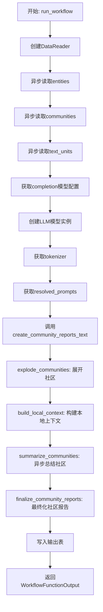
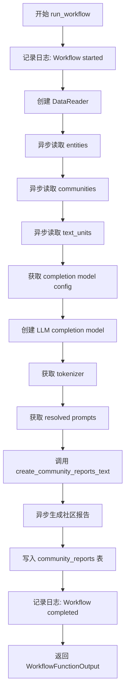
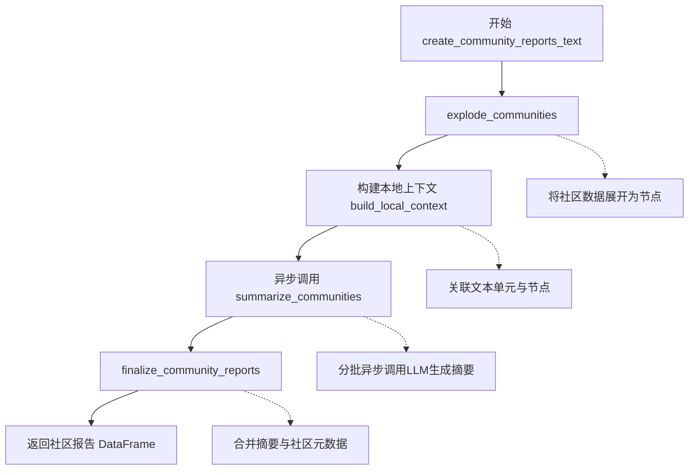
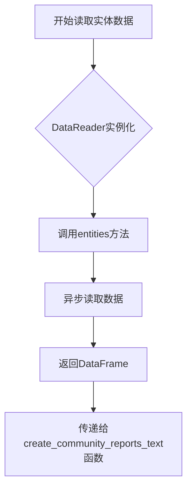
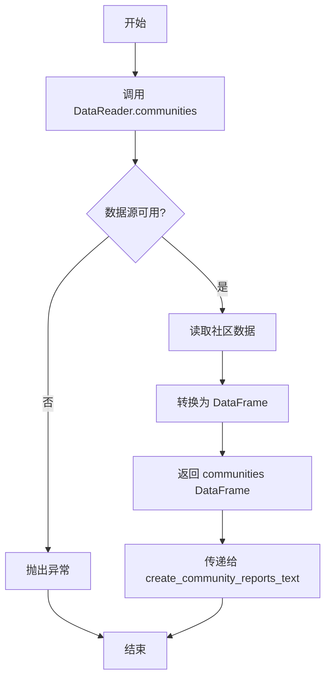
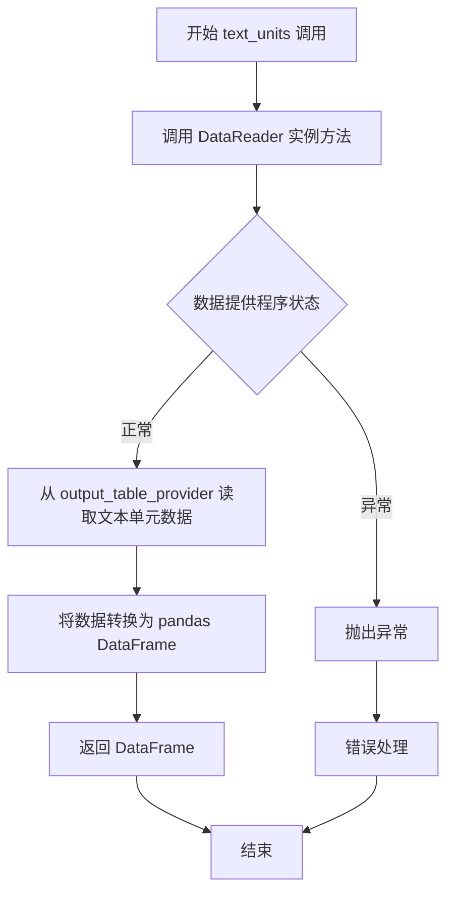
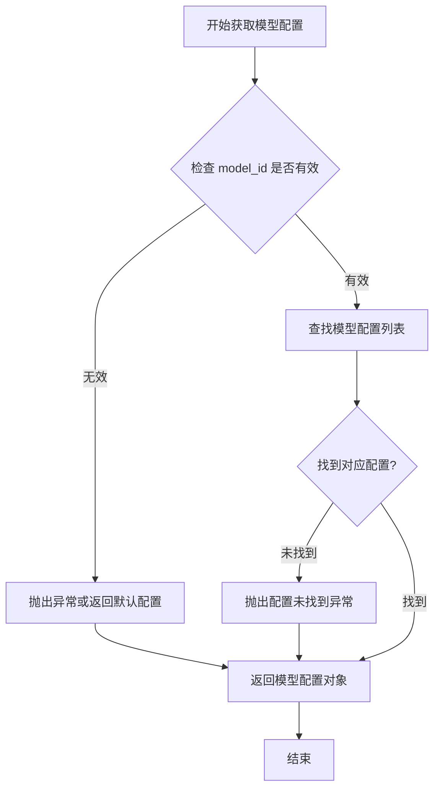
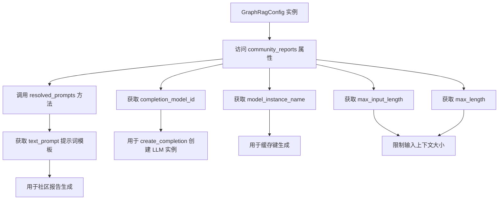
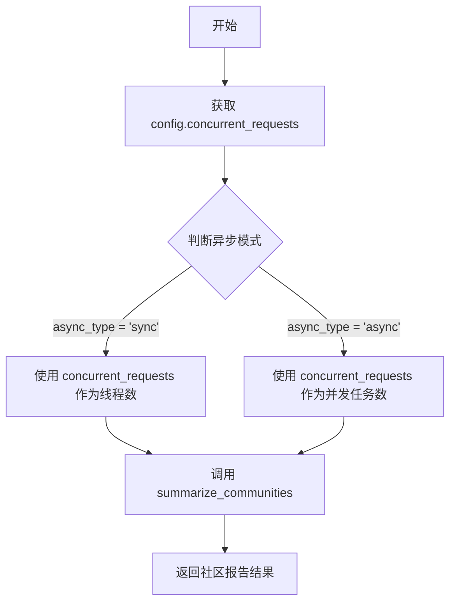
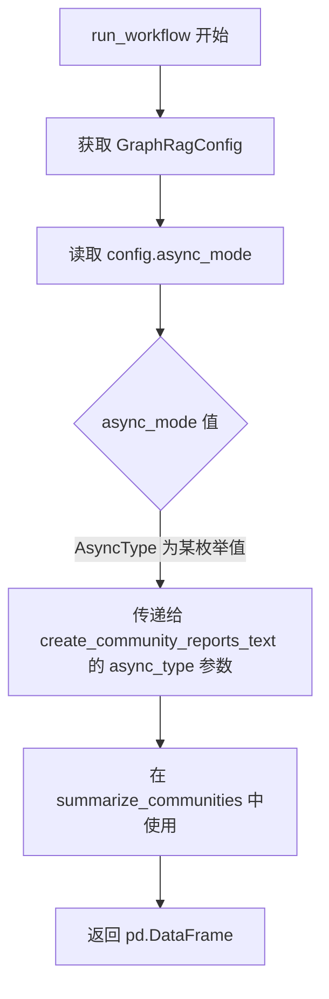

# `graphrag\packages\graphrag\graphrag\index\workflows\create_community_reports_text.py` 详细设计文档

这是一个社区报告生成工作流模块，通过读取实体、社区和文本单元数据，利用LLM模型进行上下文构建和社区报告的总结生成，最终输出结构化的社区报告数据。

## 整体流程



## 类结构

```
Workflow模块
├── run_workflow (顶层异步工作流函数)
└── create_community_reports_text (核心处理函数)
```

## 全局变量及字段


### `config`
    
全局配置对象，包含社区报告生成的所有配置参数

类型：`GraphRagConfig`
    


### `context`
    
管道运行上下文，提供缓存、回调和输出表提供程序等运行时环境

类型：`PipelineRunContext`
    


### `reader`
    
数据读取器，用于从输出表提供程序读取实体、社区和文本单元数据

类型：`DataReader`
    


### `entities`
    
实体数据，包含图中所有实体的信息

类型：`pd.DataFrame`
    


### `communities`
    
社区数据，包含图中所有社区的信息

类型：`pd.DataFrame`
    


### `text_units`
    
文本单元数据，包含所有文本块或文档片段

类型：`pd.DataFrame`
    


### `model_config`
    
语言模型配置，包含模型ID、参数和实例设置

类型：`CompletionModelConfig`
    


### `model`
    
LLMCompletion实例，用于调用大语言模型生成社区报告

类型：`LLMCompletion`
    


### `tokenizer`
    
分词器，用于对文本进行tokenization和计算token数量

类型：`Tokenizer`
    


### `prompts`
    
解析后的提示词模板，包含文本提示词和查询提示词

类型：`ResolvedPrompt`
    


### `output`
    
输出数据，最终生成的社区报告DataFrame

类型：`pd.DataFrame`
    


### `nodes`
    
展开后的节点数据，包含社区中的实体节点及其关系

类型：`pd.DataFrame`
    


### `local_contexts`
    
本地上下文数据，包含每个社区的本地文本上下文信息

类型：`dict`
    


### `community_reports`
    
社区报告数据，生成完成的社区报告

类型：`pd.DataFrame`
    


### `max_input_length`
    
最大输入长度，控制输入文本的token上限

类型：`int`
    


### `max_report_length`
    
最大报告长度，控制生成报告的token上限

类型：`int`
    


### `num_threads`
    
线程数，控制并发请求的线程数量

类型：`int`
    


### `async_type`
    
异步类型，指定并发处理的模式（同步/异步）

类型：`AsyncType`
    


    

## 全局函数及方法


### `run_workflow`

异步工作流主函数，初始化数据读取器并协调整个社区报告生成流程，包括读取实体、社区和文本单元数据，创建LLM模型，获取提示词，生成社区报告，并将结果写入输出表。

参数：

- `config`：`GraphRagConfig`，包含图谱配置信息的配置对象，用于获取社区报告相关的配置参数
- `context`：`PipelineRunContext`，管道运行上下文，包含输出表提供者、缓存、回调等运行时环境信息

返回值：`WorkflowFunctionOutput`，包含生成的社区报告数据的结果对象

#### 流程图



#### 带注释源码

```python
async def run_workflow(
    config: GraphRagConfig,
    context: PipelineRunContext,
) -> WorkflowFunctionOutput:
    """All the steps to transform community reports."""
    # 记录工作流开始日志
    logger.info("Workflow started: create_community_reports_text")
    
    # 创建数据读取器，使用输出表提供者初始化
    reader = DataReader(context.output_table_provider)
    
    # 异步读取实体数据
    entities = await reader.entities()
    # 异步读取社区数据
    communities = await reader.communities()
    # 异步读取文本单元数据
    text_units = await reader.text_units()

    # 从配置中获取社区报告的LLM模型配置
    model_config = config.get_completion_model_config(
        config.community_reports.completion_model_id
    )
    
    # 创建LLM completion实例，包含缓存和缓存键生成器
    model = create_completion(
        model_config,
        cache=context.cache.child(config.community_reports.model_instance_name),
        cache_key_creator=cache_key_creator,
    )

    # 从模型获取tokenizer用于文本处理
    tokenizer = model.tokenizer

    # 获取解析后的提示词模板
    prompts = config.community_reports.resolved_prompts()

    # 调用核心函数生成社区报告文本
    output = await create_community_reports_text(
        entities,                  # 实体数据DataFrame
        communities,              # 社区数据DataFrame
        text_units,               # 文本单元数据DataFrame
        context.callbacks,        # 工作流回调函数
        model=model,              # LLM模型实例
        tokenizer=tokenizer,      # 分词器
        prompt=prompts.text_prompt,  # 文本提示词
        max_input_length=config.community_reports.max_input_length,      # 最大输入长度
        max_report_length=config.community_reports.max_length,           # 最大报告长度
        num_threads=config.concurrent_requests,    # 并发线程数
        async_type=config.async_mode,              # 异步类型配置
    )

    # 将生成的社区报告写入输出表
    await context.output_table_provider.write_dataframe("community_reports", output)

    # 记录工作流完成日志
    logger.info("Workflow completed: create_community_reports_text")
    
    # 返回工作流函数输出结果
    return WorkflowFunctionOutput(result=output)
```


### `create_community_reports_text`

该函数是社区报告生成的异步核心函数，接收实体、社区、文本单元数据和LLM模型配置，通过展开社区构建节点、生成局部上下文、调用LLM异步生成社区报告摘要，最后对报告进行最终处理后返回完整的社区报告数据。

参数：

- `entities`：`pd.DataFrame`，包含实体的DataFrame，提供社区报告所需的知识图谱实体信息
- `communities`：`pd.DataFrame`，社区数据表，包含社区的结构化信息
- `text_units`：`pd.DataFrame`，文本单元数据表，提供与社区关联的原始文本内容
- `callbacks`：`WorkflowCallbacks`，工作流回调接口，用于报告生成过程中的状态通知
- `model`：`LLMCompletion`，LLMCompletion实例，用于调用大语言模型生成社区报告内容
- `tokenizer`：`Tokenizer`，分词器实例，用于计算文本token长度和控制输入长度
- `prompt`：`str`，社区报告生成的提示词模板，指导LLM生成符合规范的报告
- `max_input_length`：`int`，输入上下文的最大token长度限制，防止超过模型上下文窗口
- `max_report_length`：`int`，生成的单个社区报告的最大token长度限制
- `num_threads`：`int`，并发请求的线程数，用于控制异步LLM调用的并发度
- `async_type`：`AsyncType`，异步执行模式类型，指定并发处理策略

返回值：`pd.DataFrame`，包含生成并最终化处理后的社区报告数据，每条记录代表一个社区的完整报告信息

#### 流程图



#### 带注释源码

```python
async def create_community_reports_text(
    entities: pd.DataFrame,
    communities: pd.DataFrame,
    text_units: pd.DataFrame,
    callbacks: WorkflowCallbacks,
    model: "LLMCompletion",
    tokenizer: Tokenizer,
    prompt: str,
    max_input_length: int,
    max_report_length: int,
    num_threads: int,
    async_type: AsyncType,
) -> pd.DataFrame:
    """All the steps to transform community reports."""
    # 步骤1: 将社区数据展开为节点，关联实体信息
    # 将层次化社区结构平铺为独立的处理单元
    nodes = explode_communities(communities, entities)

    # 步骤2: 构建本地上下文
    # 为每个节点关联相关的文本单元内容作为上下文素材
    # 使用tokenizer限制输入长度在max_input_length范围内
    local_contexts = build_local_context(
        communities, text_units, nodes, tokenizer, max_input_length
    )

    # 步骤3: 异步生成社区报告摘要
    # 根据节点和本地上下文调用LLM生成社区报告内容
    # 支持多线程并发和异步模式配置
    community_reports = await summarize_communities(
        nodes,
        communities,
        local_contexts,
        build_level_context,
        callbacks,
        model=model,
        prompt=prompt,
        tokenizer=tokenizer,
        max_input_length=max_input_length,
        max_report_length=max_report_length,
        num_threads=num_threads,
        async_type=async_type,
    )

    # 步骤4: 最终化处理社区报告
    # 合并生成的摘要与原始社区元数据
    # 返回完整的社区报告DataFrame
    return finalize_community_reports(community_reports, communities)
```


### `DataReader.entities()`

该方法是 DataReader 类的异步实例方法，用于从数据提供程序中读取实体数据并返回包含实体信息的 Pandas DataFrame。

参数：暂无参数

返回值：`pd.DataFrame`，返回包含实体数据的 Pandas DataFrame 对象，供后续社区报告生成流程使用。

#### 流程图



#### 带注释源码

```python
# 在 run_workflow 函数中的调用方式
reader = DataReader(context.output_table_provider)  # 创建DataReader实例，传入输出表提供者
entities = await reader.entities()  # 异步调用entities方法读取实体数据，返回pd.DataFrame

# 后续使用示例（来自create_community_reports_text函数签名）
def create_community_reports_text(
    entities: pd.DataFrame,  # entities方法返回的DataFrame作为输入参数
    communities: pd.DataFrame,
    text_units: pd.DataFrame,
    ...
) -> pd.DataFrame:
```

#### 备注

由于 `DataReader` 类的具体实现未在当前代码文件中提供，以上信息是基于以下代码推断：

1. **调用位置**：在 `run_workflow` 函数第 46-47 行
2. **返回值使用**：返回值被赋值给 `entities` 变量，并在第 77 行作为参数传递给 `create_community_reports_text` 函数
3. **类型标注**：从 `create_community_reports_text` 函数签名 `entities: pd.DataFrame` 可推断返回类型为 `pd.DataFrame`
4. **异步特性**：调用使用了 `await` 关键字，表明 `entities()` 是一个异步方法


### `DataReader.communities`

获取社区（Communities）数据的异步方法，用于从数据提供者读取社区信息并返回为 Pandas DataFrame 格式。

参数：
- 该方法无显式参数（仅包含隐式 `self` 参数）

返回值：`pd.DataFrame`，包含社区数据的 DataFrame 对象，后续用于社区报告生成流程

#### 流程图



#### 带注释源码

```python
# 在 run_workflow 函数中的调用方式
reader = DataReader(context.output_table_provider)  # 创建 DataReader 实例
communities = await reader.communities()  # 异步调用 communities 方法获取社区数据

# 后续传递给 create_community_reports_text 函数
output = await create_community_reports_text(
    entities,
    communities,  # 传入社区 DataFrame
    text_units,
    ...
)
```

#### 补充说明

虽然 `DataReader` 类的完整源码未在此文件中给出，但从调用方式可以推断：

1. **方法签名**：`async def communities(self) -> pd.DataFrame`
2. **功能**：从 `output_table_provider` 读取社区（communities）表数据
3. **依赖**：`DataReader` 构造函数接收 `output_table_provider` 参数，用于访问底层数据存储
4. **返回数据格式**：返回的 DataFrame 将包含社区相关字段，用于后续的社区报告文本生成流程


# 详细设计文档提取结果

> **注意**：提供的代码片段中并未包含 `DataReader` 类的完整定义，仅展示了该类在 `run_workflow` 函数中的使用方式。以下信息基于代码中的使用模式进行推断。

---

### `DataReader.text_units`

该方法用于从数据提供程序（output_table_provider）中读取文本单元（text_units）数据，并以 pandas DataFrame 的形式返回。这是工作流中的关键数据读取步骤，为后续的社区报告生成提供原始文本数据支持。

**所属类**：`DataReader`

**参数**：

- 无显式参数（仅包含 self）

**返回值**：`pd.DataFrame`，包含文本单元的数据框（DataFrame）

---

#### 流程图



---

#### 带注释源码

```python
# 使用方式（在 run_workflow 函数中）
reader = DataReader(context.output_table_provider)  # 创建 DataReader 实例，传入输出表提供者
text_units = await reader.text_units()  # 异步调用 text_units 方法获取文本单元数据

# 推断的方法签名（基于使用模式）
async def text_units(self) -> pd.DataFrame:
    """从数据提供程序读取文本单元数据。
    
    Returns:
        pd.DataFrame: 包含所有文本单元的 DataFrame 对象
    """
    # 具体实现未在当前代码片段中提供
    pass
```

---

## 补充说明

### 技术债务/优化空间

1. **缺少类定义**：当前代码片段中未包含 `DataReader` 类的完整定义，无法获取该方法的详细实现逻辑
2. **类型推断**：返回值类型 `pd.DataFrame` 是基于同上下文中的 `entities()` 和 `communities()` 方法使用模式推断得出

### 数据流信息

在 `run_workflow` 函数中，`text_units` 数据流如下：

```
DataReader.text_units() 
    ↓ (返回 pd.DataFrame)
    ↓
create_community_reports_text()
    ↓ (作为参数传入)
build_local_context() - 用于构建本地上下文
    ↓
summarize_communities() - 用于生成社区报告
    ↓
finalize_community_reports() - 最终输出
```

---

> 如需获取 `DataReader` 类的完整定义（包括字段、方法实现细节），请提供 `graphrag/data_model/data_reader.py` 文件的内容。


### `GraphRagConfig.get_completion_model_config`

该方法用于从配置中获取指定模型ID的完整模型配置信息，返回的配置对象将用于创建 LLM Completion 实例。

参数：

- `model_id`：`str`，模型标识符，用于从配置中检索对应的模型配置

返回值：`Any`（具体类型取决于 GraphRagConfig 的实现，通常是包含模型配置信息的对象，如包含 endpoint、api_key、model 等属性的配置对象），返回指定模型的完整配置，包含模型实例化所需的所有参数

#### 流程图



#### 带注释源码

```python
# 代码上下文 - 在 run_workflow 中的调用方式
# config: GraphRagConfig - 配置对象实例
# community_reports.completion_model_id: str - 社区报告使用的模型ID

model_config = config.get_completion_model_config(
    config.community_reports.completion_model_id  # 传入模型ID参数
)

# 返回的 model_config 用于创建 LLM Completion 实例
model = create_completion(
    model_config,
    cache=context.cache.child(config.community_reports.model_instance_name),
    cache_key_creator=cache_key_creator,
)

# 注意：get_completion_model_config 方法的实际定义不在当前代码文件中
# 该方法属于 GraphRagConfig 类，需要查看 graphrag/config/models/graph_rag_config.py
# 根据调用方式推断，方法签名大致为：
# def get_completion_model_config(self, model_id: str) -> Any:
#     """根据模型ID获取对应的模型配置"""
```

> **注意**：当前提供的代码文件仅包含 `run_workflow` 函数和 `create_community_reports_text` 函数。`GraphRagConfig.get_completion_model_config()` 方法的实际定义位于 `graphrag/config/models/graph_rag_config.py` 文件中。上述信息是基于代码中的调用方式推断得出的。


### `GraphRagConfig.community_reports`

该属性是 `GraphRagConfig` 配置类中用于配置社区报告（Community Reports）生成相关参数的嵌套配置对象，包含了社区报告生成所需的模型配置、提示词模板、输入输出长度限制等核心参数。

参数：
- 无（这是一个属性访问，而非方法）

返回值：`CommunityReportsConfig`（或类似的配置类型），返回社区报告的配置对象，包含以下关键配置项：
- `completion_model_id`：用于生成社区报告的 LLM 模型 ID
- `model_instance_name`：模型实例名称，用于缓存键生成
- `max_input_length`：最大输入长度限制
- `max_length`：最大报告长度限制

#### 流程图



#### 带注释源码

```python
# 在 run_workflow 函数中使用 community_reports 配置的示例

# 1. 获取社区报告的模型配置
model_config = config.get_completion_model_config(
    config.community_reports.completion_model_id  # 从配置中获取模型 ID
)

# 2. 创建 LLM 实例，传入社区报告的模型实例名称用于缓存
model = create_completion(
    model_config,
    cache=context.cache.child(config.community_reports.model_instance_name),
    cache_key_creator=cache_key_creator,
)

# 3. 获取解析后的提示词模板
prompts = config.community_reports.resolved_prompts()  # 返回提示词配置对象

# 4. 传递给生成社区报告的核心函数
output = await create_community_reports_text(
    entities,
    communities,
    text_units,
    context.callbacks,
    model=model,
    tokenizer=tokenizer,
    prompt=prompts.text_prompt,  # 使用配置中的提示词
    max_input_length=config.community_reports.max_input_length,  # 传入最大输入长度
    max_report_length=config.community_reports.max_length,  # 传入最大报告长度
    num_threads=config.concurrent_requests,
    async_type=config.async_mode,
)
```

#### 补充说明

`GraphRagConfig.community_reports` 本质上是一个配置对象（通常为 `CommunityReportsConfig` 类型），而非直接执行逻辑的方法。它提供了社区报告生成工作流所需的全部配置参数：

1. **模型配置**：指定使用哪个 LLM 模型来生成社区报告
2. **缓存配置**：通过 `model_instance_name` 支持对模型输出进行缓存
3. **提示词配置**：通过 `resolved_prompts()` 方法获取解析后的提示词模板
4. **长度限制**：通过 `max_input_length` 和 `max_length` 控制输入输出长度，防止超出模型上下文窗口

该配置对象的设计体现了配置与逻辑分离的原则，使得社区报告生成的行为可以通过配置文件灵活调整，而无需修改代码逻辑。


### `GraphRagConfig.concurrent_requests`

该属性定义在 `GraphRagConfig` 配置类中，用于控制社区报告生成过程中的并发请求数量，即同时处理的线程数。

参数：

- 无（这是一个属性访问，不是方法）

返回值：`int`，返回并发请求的线程数量，用于控制并行处理的能力。

#### 流程图



#### 带注释源码

```python
# 在 run_workflow 函数中使用 config.concurrent_requests
# 文件：graphrag/index/workflows/create_community_reports_text.py

async def run_workflow(
    config: GraphRagConfig,
    context: PipelineRunContext,
) -> WorkflowFunctionOutput:
    """All the steps to transform community reports."""
    # ... 前面的代码省略 ...
    
    # 使用 config.concurrent_requests 控制并发请求数
    output = await create_community_reports_text(
        entities,
        communities,
        text_units,
        context.callbacks,
        model=model,
        tokenizer=tokenizer,
        prompt=prompts.text_prompt,
        max_input_length=config.community_reports.max_input_length,
        max_report_length=config.community_reports.max_length,
        num_threads=config.concurrent_requests,  # <--- 并发请求数
        async_type=config.async_mode,
    )
    
    # ... 后面的代码省略 ...

# 在 create_community_reports_text 函数中使用 num_threads 参数
async def create_community_reports_text(
    entities: pd.DataFrame,
    communities: pd.DataFrame,
    text_units: pd.DataFrame,
    callbacks: WorkflowCallbacks,
    model: "LLMCompletion",
    tokenizer: Tokenizer,
    prompt: str,
    max_input_length: int,
    max_report_length: int,
    num_threads: int,  # <--- 接收 concurrent_requests 的值
    async_type: AsyncType,
) -> pd.DataFrame:
    """All the steps to transform community reports."""
    nodes = explode_communities(communities, entities)

    local_contexts = build_local_context(
        communities, text_units, nodes, tokenizer, max_input_length
    )

    # 将 num_threads 传递给 summarize_communities
    community_reports = await summarize_communities(
        nodes,
        communities,
        local_contexts,
        build_level_context,
        callbacks,
        model=model,
        prompt=prompt,
        tokenizer=tokenizer,
        max_input_length=max_input_length,
        max_report_length=max_report_length,
        num_threads=num_threads,  # <--- 用于控制并发
        async_type=async_type,
    )

    return finalize_community_reports(community_reports, communities)
```

#### 补充说明

- **配置来源**：`GraphRagConfig` 类通常在 `graphrag/config/models/graph_rag_config.py` 中定义
- **作用**：控制 LLM 调用社区报告摘要的并发数量
- **典型值**：通常设置为 CPU 核心数的倍数或固定值如 4、8、16 等
- **设计意图**：通过调整并发数可以在性能和资源消耗之间取得平衡


# GraphRagConfig.async_mode 提取结果

### `GraphRagConfig.async_mode`

该属性是 `GraphRagConfig` 配置类的成员，用于指定社区报告生成过程中的异步处理模式（如并发类型），决定了系统如何处理异步请求（如线程池、进程池等）。

参数：无（为类属性，非函数参数）

返回值：`AsyncType`，表示异步处理的类型枚举，用于控制 `summarize_communities` 等异步操作的并发方式

#### 流程图



#### 带注释源码

```python
# 从 GraphRagConfig 类中提取的 async_mode 属性相关代码
# 位置：graphrag/config/models/graph_rag_config.py（推断）

# 在 run_workflow 函数中的使用：
async def run_workflow(
    config: GraphRagConfig,
    context: PipelineRunContext,
) -> WorkflowFunctionOutput:
    """All the steps to transform community reports."""
    # ... 省略部分代码 ...
    
    # 获取异步模式配置
    # async_mode 为 GraphRagConfig 类的属性，类型为 AsyncType 枚举
    output = await create_community_reports_text(
        entities,
        communities,
        text_units,
        context.callbacks,
        model=model,
        tokenizer=tokenizer,
        prompt=prompts.text_prompt,
        max_input_length=config.community_reports.max_input_length,
        max_report_length=config.community_reports.max_length,
        num_threads=config.concurrent_requests,
        async_type=config.async_mode,  # <--- async_mode 在此处被使用
    )

# async_type 参数在 create_community_reports_text 函数中的定义：
async def create_community_reports_text(
    entities: pd.DataFrame,
    communities: pd.DataFrame,
    text_units: pd.DataFrame,
    callbacks: WorkflowCallbacks,
    model: "LLMCompletion",
    tokenizer: Tokenizer,
    prompt: str,
    max_input_length: int,
    max_report_length: int,
    num_threads: int,
    async_type: AsyncType,  # <--- 接收来自 config.async_mode 的值
) -> pd.DataFrame:
    """All the steps to transform community reports."""
    # ... 省略部分代码 ...
    
    # 将 async_type 传递给 summarize_communities
    community_reports = await summarize_communities(
        nodes,
        communities,
        local_contexts,
        build_level_context,
        callbacks,
        model=model,
        prompt=prompt,
        tokenizer=tokenizer,
        max_input_length=max_input_length,
        max_report_length=max_report_length,
        num_threads=num_threads,
        async_type=async_type,  # <--- 最终在此处决定异步处理方式
    )
    
    return finalize_community_reports(community_reports, communities)
```

#### 补充说明

- **配置来源**：`async_mode` 是 `GraphRagConfig` 类的一个配置属性，在配置文件中设置
- **枚举类型**：`AsyncType` 定义在 `graphrag.config.enums` 模块中，可能的取值包括 `AsyncType.Sync`、`AsyncType.Threaded`、`AsyncType.AsyncIO` 等
- **作用**：控制 `summarize_communities` 函数的异步执行策略，影响社区报告生成的并发处理方式

## 关键组件


### DataReader

数据读取器组件，负责从输出表提供者中读取实体(entities)、社区(communities)和文本单元(text_units)数据。它提供了异步方法来获取这些数据，为后续的社区报告生成提供输入数据。

### LLMCompletion Model

语言模型completion组件，通过create_completion函数创建，接收模型配置、缓存和缓存键创建器。该模型用于根据实体和上下文信息生成社区报告的文本内容，是报告生成的核心推理引擎。

### explode_communities

社区爆炸组件，将原始社区数据与实体数据展开为节点形式。这一步骤将社区结构拆解为可处理的单个节点，为后续的上下文构建和摘要生成准备数据结构。

### build_local_context

本地上下文构建组件，根据社区、文本单元和节点信息构建局部上下文。它使用tokenizer对输入进行分词，并限制最大输入长度，确保上下文信息不会超过模型的输入限制。

### summarize_communities

社区摘要生成核心组件，异步调用LLM模型为每个社区节点生成摘要报告。它接收节点、社区、本地上下文、构建层级上下文的函数、回调接口、模型、提示词、tokenizer以及各种长度和并发控制参数，是实现社区报告智能生成的关键模块。

### finalize_community_reports

社区报告最终化组件，接收摘要生成的社区报告和原始社区数据，进行后处理整合，输出最终格式化的社区报告DataFrame。

### 并发控制机制

通过num_threads和async_type参数控制的并发处理机制，支持不同类型的异步模式(AsyncType枚举)，允许配置并发请求数量，以优化大规模社区报告生成的性能和效率。

### 缓存机制

利用context.cache创建子缓存，关联到特定模型实例名称，实现社区报告生成的缓存能力，避免重复计算，提高系统响应速度。

### 工作流入口点(run_workflow)

顶层异步工作流函数，编排整个社区报告生成流程：读取数据→创建模型→准备提示词→生成报告→写入输出表，负责协调各个组件按序执行并管理整体执行生命周期。


## 问题及建议


### 已知问题

-   **缺乏错误处理与异常捕获**：代码中未对`DataReader`的读取操作、`model`调用、`write_dataframe`写入操作进行try-except异常捕获，可能导致工作流意外中断且无明确错误信息
-   **缺少空值与边界检查**：未对`entities`、`communities`、`text_units`数据框进行空值检查，若上游数据为空或格式异常可能导致后续处理失败
-   **日志记录不充分**：仅在流程开始和结束时记录日志，缺少关键步骤（如数据读取成功、模型调用、写入完成等）的中间日志，不利于问题排查与监控
-   **缺乏超时与取消机制**：`async`函数调用未设置超时参数，长时间运行的任务可能被无限期挂起
-   **配置参数缺少默认值校验**：`max_input_length`、`max_report_length`、`num_threads`等参数未在函数内部校验其有效性（如负值、零值、超出合理范围）

### 优化建议

-   **添加完整的异常处理**：为各异步操作添加try-except块，捕获并记录具体异常，必要时进行重试或优雅降级
-   **增加输入数据验证**：在处理前检查数据框是否为None、是否为空、必需列是否存在
-   **完善日志记录**：在关键节点（数据读取、模型调用前后、数据写入）添加INFO/Debug级别日志，记录数据量、执行时间等元信息
-   **引入超时控制**：使用`asyncio.timeout`或`asyncio.wait_for`为异步操作设置合理超时，避免任务挂起
-   **增加配置校验**：在函数入口处对配置参数进行校验，使用默认值或抛出明确配置错误
-   **考虑添加重试机制**：对LLM调用等可能瞬时失败的操作添加重试逻辑（可利用现有cache机制）
-   **提取魔法字符串/数字**：将`"community_reports"`等字符串常量提取为枚举或配置常量，避免硬编码

## 其它


### 设计目标与约束

本模块的设计目标是自动化地将图谱中的实体、社区和文本单元数据转换为结构化的社区报告。核心约束包括：1) 必须使用指定的LLM模型进行报告生成；2) 需要支持异步处理以提高吞吐量；3) 输出结果必须写入指定的输出表；4) 需要遵循GraphRAGConfig中的社区报告配置参数。

### 错误处理与异常设计

代码中主要通过try-except块和异步错误传播机制处理异常。DataReader读取数据时可能抛出数据不存在的异常；create_completion可能因模型调用失败而抛出异常；summarize_communities的异步调用可能因网络问题或模型超时失败。所有异步函数都应捕获并记录异常，必要时向上层抛出WorkflowExecutionError。当前代码依赖logger进行错误记录，建议增加重试机制和降级策略。

### 数据流与状态机

数据流为：输入数据(entities、communities、text_units) → explode_communities(节点展开) → build_local_context(本地上下文构建) → summarize_communities(LLM生成报告) → finalize_community_reports(最终化报告) → 输出表。状态机包括：初始化状态→数据加载状态→上下文构建状态→报告生成状态→完成状态。各状态之间通过await关键字实现状态转换。

### 外部依赖与接口契约

本模块依赖以下外部组件：1) graphrag_llm.completion.create_completion - LLM模型创建接口；2) graphrag.cache.cache_key_creator - 缓存键生成器；3) graphrag.data_model.data_reader.DataReader - 数据读取接口；4) graphrag.index.operations.* - 图谱操作算子。接口契约要求：DataReader需提供entities()、communities()、text_units()方法；model需实现tokenizer属性和异步completion调用；所有操作算子返回pd.DataFrame类型。

### 配置参数说明

config.community_reports.completion_model_id - LLM模型标识符；config.community_reports.model_instance_name - 模型实例名称；config.community_reports.max_input_length - 最大输入token长度；config.community_reports.max_length - 最大报告长度；config.community_reports.resolved_prompts() - 解析后的提示词模板；config.concurrent_requests - 并发请求线程数；config.async_mode - 异步模式类型(AsyncType枚举)。

### 性能考虑

代码通过num_threads和async_type参数控制并发性能。使用tokenizer进行输入长度控制以避免超出模型上下文窗口。潜在性能瓶颈包括：LLM API调用延迟、数据框操作内存开销。建议：1) 对大规模数据实施批处理；2) 添加工具化缓存减少重复调用；3) 考虑流式输出处理。

### 安全性考虑

代码处理的数据包含从图谱中提取的实体信息，可能涉及敏感内容。安全建议：1) 对prompt模板进行注入检查；2) 对输出内容实施脱敏处理；3) 模型调用日志需避免记录敏感数据；4) 实施API密钥和安全凭证的安全存储。

### 测试策略

建议测试覆盖：1) 单元测试 - 验证各函数输入输出正确性；2) 集成测试 - 验证完整workflow与DataReader的集成；3) 模拟测试 - 使用mock LLM模型进行功能验证；4) 性能测试 - 验证大规模数据处理能力；5) 边界测试 - 测试空数据、极大值、特殊字符等边界情况。

### 资源管理

需要管理的资源包括：1) LLM模型实例 - 通过context.cache实现缓存；2) 数据库连接 - 通过output_table_provider管理；3) 内存资源 - pd.DataFrame操作可能产生大量内存占用。建议实施：1) 资源超时释放机制；2) 内存监控和告警；3) 连接池复用。

    