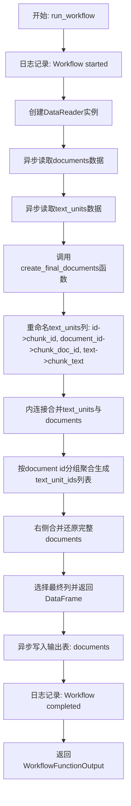
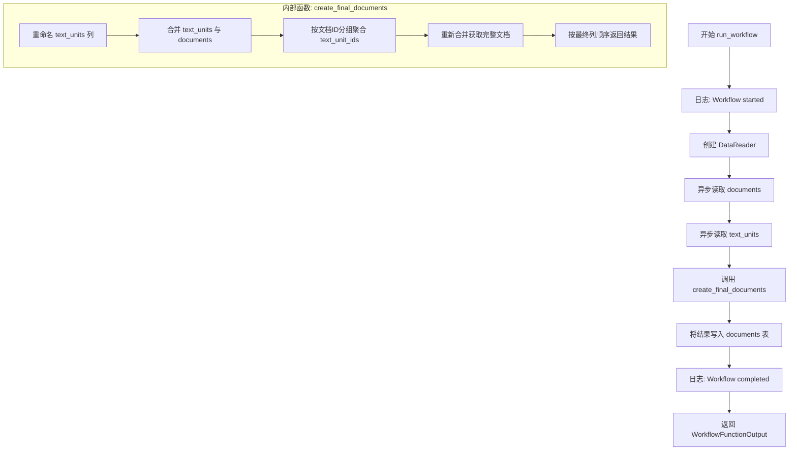
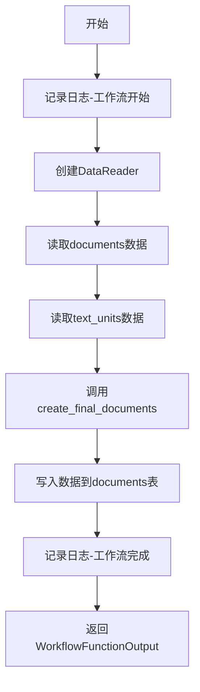
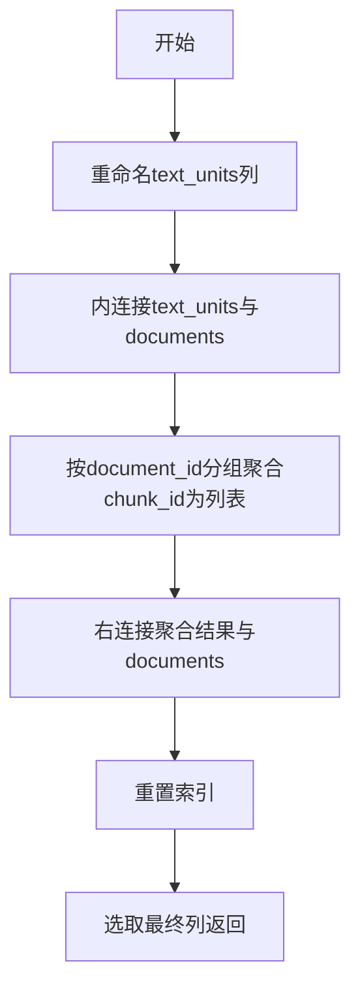

# `graphrag\packages\graphrag\graphrag\index\workflows\create_final_documents.py` 详细设计文档

这是一个异步数据处理工作流模块，负责将文本单元(text_units)与文档(documents)进行关联聚合，生成包含文本单元ID列表的最终文档数据集，并将其写入输出表。

## 整体流程



## 类结构

```
无类定义
└── 模块级函数
    ├── run_workflow (异步主入口)
    └── create_final_documents (同步数据转换)
```

## 全局变量及字段


### `logger`
    
模块级日志记录器，用于记录工作流的开始和完成信息

类型：`logging.Logger`
    


    

## 全局函数及方法


### `run_workflow`

异步主工作流入口函数，负责将最终的文档和文本单元进行转换和关联，生成包含文本单元引用的最终文档输出。

参数：

- `_config`：`GraphRagConfig`，全局配置对象，提供图谱检索增强生成的配置参数
- `context`：`PipelineRunContext`，管道运行时上下文，提供数据读写能力和运行时状态

返回值：`WorkflowFunctionOutput`，包含转换后的最终文档 DataFrame 结果

#### 流程图



#### 带注释源码

```python
async def run_workflow(
    _config: GraphRagConfig,  # 配置对象（当前未使用，保留用于接口一致性）
    context: PipelineRunContext,  # 管道运行时上下文，包含输出表提供者
) -> WorkflowFunctionOutput:
    """All the steps to transform final documents."""
    # 记录工作流开始日志
    logger.info("Workflow started: create_final_documents")
    
    # 使用上下文的输出表提供者创建数据读取器
    reader = DataReader(context.output_table_provider)
    
    # 异步读取文档数据
    documents = await reader.documents()
    
    # 异步读取文本单元数据
    text_units = await reader.text_units()

    # 调用内部函数执行文档转换逻辑
    output = create_final_documents(documents, text_units)

    # 将转换后的结果写入输出表的 documents 表
    await context.output_table_provider.write_dataframe("documents", output)

    # 记录工作流完成日志
    logger.info("Workflow completed: create_final_documents")
    
    # 返回工作流函数输出结果
    return WorkflowFunctionOutput(result=output)
```


### `create_final_documents`

该函数是数据转换核心逻辑，负责将文本单元（text_units）和文档（documents）数据通过关联操作进行合并，生成包含文本单元引用的最终文档数据。

参数：

- `documents`：`pd.DataFrame`，原始文档数据，包含文档的基本信息
- `text_units`：`pd.DataFrame`，文本单元数据，包含文档的文本块信息

返回值：`pd.DataFrame`，转换后的最终文档数据，符合 `DOCUMENTS_FINAL_COLUMNS` 定义的列结构

#### 流程图

```mermaid
flowchart TD
    A[输入: documents, text_units] --> B[选择text_units的id, document_id, text列并重命名]
    B --> C[将重命名后的text_units与documents进行inner join]
    C --> D[按document id分组, 聚合text_unit_ids列表]
    D --> E[再次与documents进行right join, 保留所有文档]
    E --> F[重置索引并选择DOCUMENTS_FINAL_COLUMNS指定的列]
    F --> G[输出: 最终文档数据]
    
    B : renamed = text_units[...].rename(...)
    C : joined = renamed.merge(documents, ...)
    D : docs_with_text_units = joined.groupby(...).agg(...)
    E : rejoined = docs_with_text_units.merge(documents, ...)
    F : return rejoined.loc[:, DOCUMENTS_FINAL_COLUMNS]
```

#### 带注释源码

```python
def create_final_documents(
    documents: pd.DataFrame, text_units: pd.DataFrame
) -> pd.DataFrame:
    """All the steps to transform final documents."""
    
    # 第一步：从text_units表中选取id、document_id、text三列，并重命名列名
    # 将document_id重命名为chunk_doc_id，id重命名为chunk_id，text重命名为chunk_text
    renamed = text_units.loc[:, ["id", "document_id", "text"]].rename(
        columns={
            "document_id": "chunk_doc_id",
            "id": "chunk_id",
            "text": "chunk_text",
        }
    )

    # 第二步：将重命名后的文本单元数据与文档数据进行内连接(Inner Join)
    # 通过chunk_doc_id与documents的id进行关联，只保留两边都存在的记录
    joined = renamed.merge(
        documents,
        left_on="chunk_doc_id",
        right_on="id",
        how="inner",
        copy=False,
    )

    # 第三步：按文档ID(id)分组，将每个文档关联的文本块ID(chunk_id)聚合成列表
    # 生成text_unit_ids列，记录每个文档包含的文本单元ID列表
    docs_with_text_units = joined.groupby("id", sort=False).agg(
        text_unit_ids=("chunk_id", list)
    )

    # 第四步：再次与原始文档数据进行右连接(Right Join)
    # 确保所有文档都被保留，即使某些文档没有关联的文本单元
    # copy=False避免不必要的数据拷贝，优化内存使用
    rejoined = docs_with_text_units.merge(
        documents,
        on="id",
        how="right",
        copy=False,
    ).reset_index(drop=True)

    # 第五步：按DOCUMENTS_FINAL_COLUMNS定义的列顺序选择最终输出列
    # 返回符合预设格式的最终文档数据
    return rejoined.loc[:, DOCUMENTS_FINAL_COLUMNS]
```

## 关键组件


## 一段话描述

该代码是GraphRag索引管道中的一个工作流模块，负责将读取的文档和文本单元数据进行转换和关联，最终生成包含文本单元引用的最终文档数据集，并输出到指定的表中。

## 文件的整体运行流程

1. **初始化**：工作流启动，记录日志
2. **数据读取**：通过DataReader从输出表提供者读取documents和text_units数据
3. **数据转换**：调用create_final_documents函数进行数据处理
   - 重命名text_units列
   - 将text_units与documents进行内连接
   - 按文档ID分组聚合文本单元ID列表
   - 再次与documents进行右连接，确保保留所有文档
   - 选取最终需要的列
4. **数据输出**：将处理后的DataFrame写入"documents"表
5. **完成**：记录完成日志并返回结果

## 全局变量和全局函数详细信息

### logger

- **类型**: logging.Logger
- **描述**: 模块级日志记录器，用于输出工作流执行过程中的信息

### run_workflow

- **名称**: run_workflow
- **参数**:
  - `_config`: GraphRagConfig类型，配置对象（当前未使用）
  - `context`: PipelineRunContext类型，管道运行上下文，包含输出表提供者等
- **参数描述**: 异步工作流入口函数，负责协调整个文档创建流程
- **返回值类型**: WorkflowFunctionOutput
- **返回值描述**: 包含处理后的DataFrame结果的工作流输出对象
- **mermaid流程图**:

- **带注释源码**:
```python
async def run_workflow(
    _config: GraphRagConfig,
    context: PipelineRunContext,
) -> WorkflowFunctionOutput:
    """All the steps to transform final documents."""
    logger.info("Workflow started: create_final_documents")
    # 创建数据读取器，从输出表提供者读取数据
    reader = DataReader(context.output_table_provider)
    # 异步读取文档数据
    documents = await reader.documents()
    # 异步读取文本单元数据
    text_units = await reader.text_units()

    # 执行数据转换
    output = create_final_documents(documents, text_units)

    # 将结果写入输出表的documents表
    await context.output_table_provider.write_dataframe("documents", output)

    logger.info("Workflow completed: create_final_documents")
    return WorkflowFunctionOutput(result=output)
```

### create_final_documents

- **名称**: create_final_documents
- **参数**:
  - `documents`: pd.DataFrame类型，文档数据
  - `text_units`: pd.DataFrame类型，文本单元数据
- **参数描述**: 核心数据转换函数，将文本单元与文档进行关联聚合
- **返回值类型**: pd.DataFrame
- **返回值描述**: 包含文档ID和关联的文本单元ID列表的最终文档数据集
- **mermaid流程图**:

- **带注释源码**:
```python
def create_final_documents(
    documents: pd.DataFrame, text_units: pd.DataFrame
) -> pd.DataFrame:
    """All the steps to transform final documents."""
    # 选取text_units的id、document_id、text列并重命名
    renamed = text_units.loc[:, ["id", "document_id", "text"]].rename(
        columns={
            "document_id": "chunk_doc_id",
            "id": "chunk_id",
            "text": "chunk_text",
        }
    )

    # 将重命名后的text_units与documents进行内连接
    joined = renamed.merge(
        documents,
        left_on="chunk_doc_id",
        right_on="id",
        how="inner",
        copy=False,
    )

    # 按文档ID分组，将chunk_id聚合为列表
    docs_with_text_units = joined.groupby("id", sort=False).agg(
        text_unit_ids=("chunk_id", list)
    )

    # 再次与documents右连接，保留所有文档
    rejoined = docs_with_text_units.merge(
        documents,
        on="id",
        how="right",
        copy=False,
    ).reset_index(drop=True)

    # 返回最终列
    return rejoined.loc[:, DOCUMENTS_FINAL_COLUMNS]
```

## 关键组件信息

### DataReader

数据读取器组件，负责从输出表提供者异步读取documents和text_units数据。

### PipelineRunContext

管道运行上下文，包含output_table_provider用于数据读写操作。

### DOCUMENTS_FINAL_COLUMNS

预定义的最终文档列名列表，定义了输出数据的结构。

### WorkflowFunctionOutput

工作流函数输出包装类型，用于返回管道函数的结果。

## 潜在的技术债务或优化空间

1. **未使用的配置参数**: `_config`参数在函数签名中定义但完全未使用，可能存在设计冗余或功能缺失
2. **copy=False的潜在风险**: merge操作使用`copy=False`可能引发SettingWithCopyWarning警告，在某些pandas版本中可能导致意外行为
3. **缺少错误处理**: 缺乏对DataReader读取失败、merge操作异常等的try-except处理
4. **日志级别单一**: 仅使用info级别日志，缺乏debug、warning等分级日志
5. **硬编码表名**: "documents"表名硬编码在write_dataframe调用中，不如配置灵活

## 其它项目

### 设计目标与约束

- 目标：将分散的documents和text_units数据整合成包含文本单元引用的最终文档数据集
- 约束：必须保留所有文档（包括没有对应text_units的文档），使用右连接确保完整性

### 错误处理与异常设计

- 当前实现缺乏显式的错误处理机制
- 建议添加：数据读取超时处理、merge键为空检查、必要的空值处理

### 数据流与状态机

- 数据流：DataReader读取 → pandas转换处理 → output_table_provider写入
- 状态转换：读取状态 → 转换状态 → 写入状态

### 外部依赖与接口契约

- 依赖pandas库进行数据处理
- 依赖DataReader接口读取数据
- 依赖output_table_provider进行数据持久化
- 依赖GraphRagConfig和PipelineRunContext配置对象


## 问题及建议


### 已知问题

-   **空值处理缺失**：未对 `reader.documents()` 和 `reader.text_units()` 的返回值进行空值检查，可能导致后续操作出现空引用异常
-   **多次DataFrame复制**：存在多次merge操作（renamed.merge、docs_with_text_units.merge），且虽然使用了 `copy=False`，但仍可能产生中间DataFrame的内存开销
-   **列名硬编码**：text_units的列名重命名（"document_id"→"chunk_doc_id"等）硬编码在代码中，缺乏灵活性
-   **缺少数据验证**：未验证输入DataFrame是否包含必需的列（如"id", "document_id", "text"），可能导致运行时KeyError
-   **变量命名可读性差**：中间变量命名（如 `renamed`, `joined`, `rejoined`）不够清晰，影响代码可维护性
-   **同步函数在异步上下文中调用**：`create_final_documents` 是同步函数，在异步工作流中直接调用，阻塞事件循环
-   **日志信息不完整**：仅记录工作流开始和结束，未记录关键中间状态或错误信息

### 优化建议

-   **添加输入验证**：在 `create_final_documents` 开头验证必需列的存在性，对空DataFrame进行提前返回或抛出明确异常
-   **重构为流式处理**：考虑使用dask或polars进行向量化操作，减少中间DataFrame的创建
-   **提取列名配置**：将列名映射提取为常量或配置，减少硬编码
-   **改进日志记录**：增加关键步骤的日志（如记录输入输出行数），便于调试和监控
-   **异步化处理逻辑**：将 `create_final_documents` 改为异步函数或使用 `run_in_executor` 避免阻塞
-   **优化merge策略**：考虑使用索引join替代列join，减少数据复制


## 其它


### 设计目标与约束

本工作流的核心目标是将最终的文档（documents）和文本单元（text_units）进行关联处理，生成包含文本单元引用的最终文档数据集。设计约束包括：必须使用异步I/O操作以提高性能；输出数据框必须符合DOCUMENTS_FINAL_COLUMNS定义的模式；处理过程中需保持数据完整性，采用inner join确保只保留有关联文本单元的文档。

### 错误处理与异常设计

代码中通过try-except块（虽然在此简化版本中未显示完整异常处理，但 logger 用于记录关键节点状态）记录工作流开始和完成状态。DataReader 的 documents() 和 text_units() 方法可能抛出异常，需由调用方处理。merge 操作可能因键不匹配返回空结果集，属于正常业务逻辑而非异常。write_dataframe 操作失败时需确保事务回滚，避免数据不一致。

### 数据流与状态机

数据流为：输入阶段（读取documents和text_units）→ 转换阶段（重命名列、合并数据、分组聚合）→ 输出阶段（写入documents表）。状态机包括：INIT（初始化）→ READING（读取数据）→ TRANSFORMING（数据转换）→ WRITING（写入输出）→ COMPLETED（完成）或FAILED（失败）。

### 外部依赖与接口契约

主要依赖：GraphRagConfig（配置模型）、PipelineRunContext（管道运行上下文，包含output_table_provider）、DataReader（数据读取器）、DOCUMENTS_FINAL_COLUMNS（输出列定义）。接口契约：run_workflow 接受配置和上下文，返回 WorkflowFunctionOutput；create_final_documents 接受两个DataFrame并返回合并后的DataFrame。

### 性能考虑与优化空间

当前实现使用 pandas 的 merge 和 groupby 操作，在大数据集上可能存在性能瓶颈。优化建议：1）对于超大规模数据，考虑使用 polars 替代 pandas 以提升性能；2）merge 操作时使用 copy=False 避免不必要的数据复制（代码已实现）；3）可考虑分批处理或流式处理避免内存溢出；4）groupby 后的 agg 操作可优化为更高效的聚合方式。

### 配置与参数说明

run_workflow 函数参数：_config（GraphRagConfig类型，当前未使用但保留用于未来配置扩展）、context（PipelineRunContext类型，包含output_table_provider用于数据读写）。create_final_documents 函数参数：documents（pd.DataFrame，源文档数据）、text_units（pd.DataFrame，文本单元数据）。返回值均为 pd.DataFrame 类型。

### 并发与异步处理设计

run_workflow 是 async 函数，利用 Python 的 asyncio 框架实现并发。DataReader 的 documents() 和 text_units() 调用可以并行执行以提升性能（当前为顺序执行）。write_dataframe 操作是异步的，配合 await 使用。create_final_documents 是同步函数，处理密集型计算任务。

    