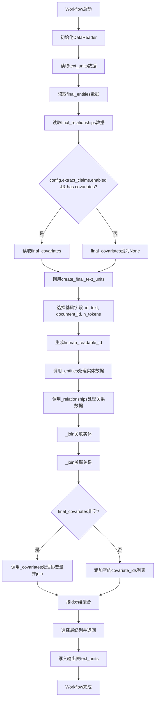
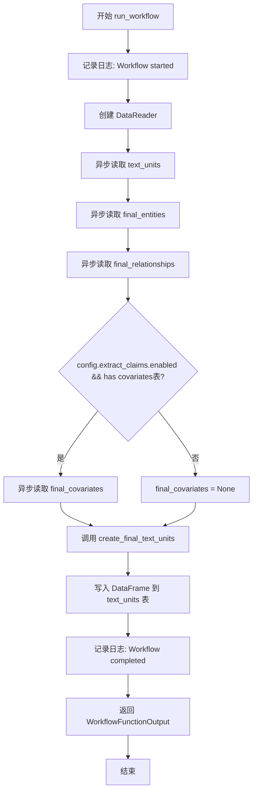
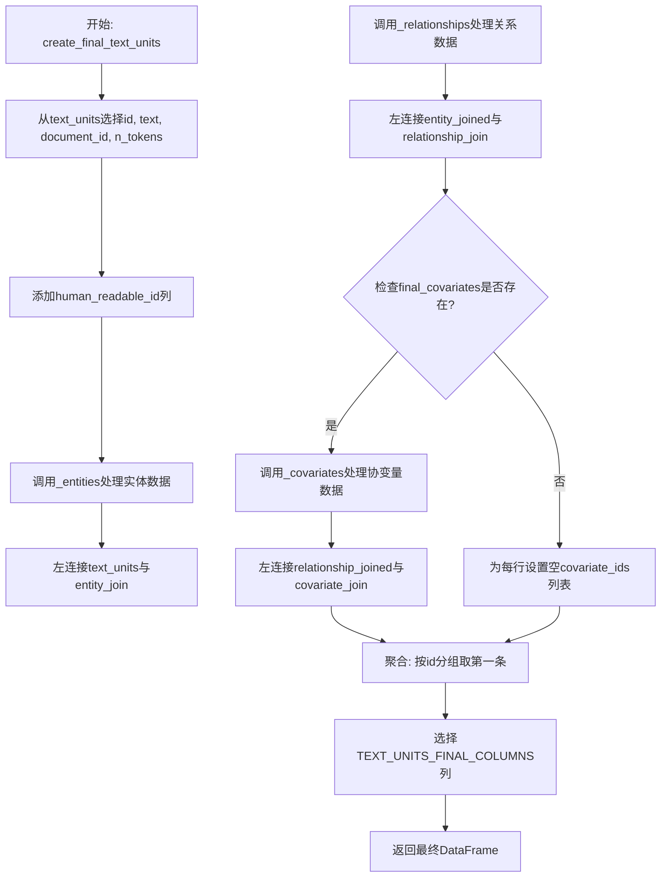
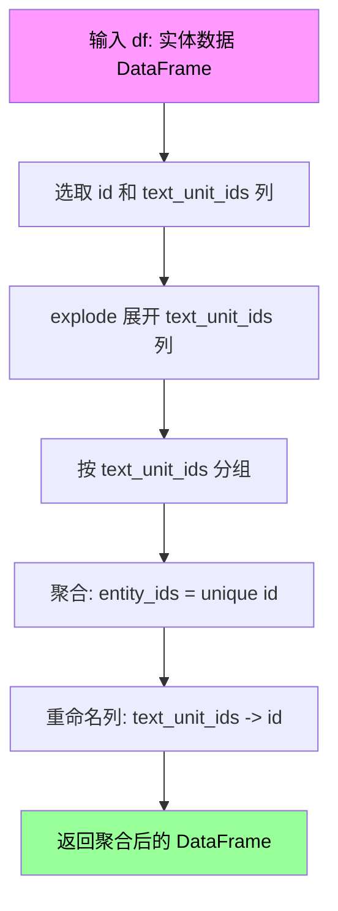
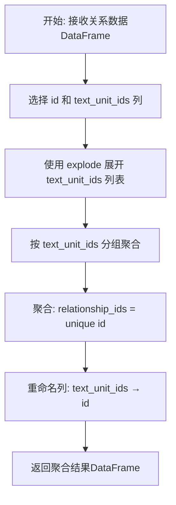
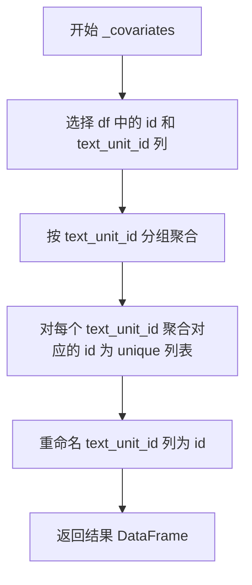
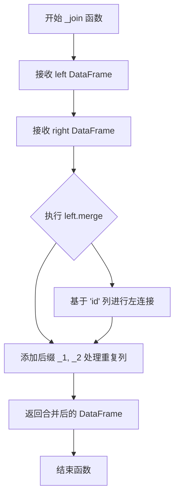

# `graphrag\packages\graphrag\graphrag\index\workflows\create_final_text_units.py` 详细设计文档

该模块是GraphRag项目的工作流组件，负责将原始文本单元（text_units）与实体（entities）、关系（relationships）及协变量（covariates）进行关联和聚合，生成包含完整关联信息的最终文本单元数据集。

## 整体流程



## 类结构

```
模块文件 (无类定义)
└── 函数集合
    ├── run_workflow (异步入口函数)
    ├── create_final_text_units (主处理函数)
    ├── _entities (私有辅助函数)
    ├── _relationships (私有辅助函数)
    ├── _covariates (私有辅助函数)
    └── _join (私有辅助函数)
```

## 全局变量及字段


### `logger`
    
模块级日志记录器，用于记录工作流运行信息

类型：`logging.Logger`
    


### `pd`
    
数据处理库别名，用于DataFrame操作

类型：`pandas`
    


### `GraphRagConfig`
    
配置模型，定义GraphRag的全局配置参数

类型：`GraphRagConfig类型`
    


### `DataReader`
    
数据读取器类，用于从输出表提供器读取各类数据

类型：`DataReader类型`
    


### `TEXT_UNITS_FINAL_COLUMNS`
    
文本单元最终列名定义，指定输出表的列结构

类型：`list/常量`
    


### `PipelineRunContext`
    
管道运行上下文，提供数据表访问和管理功能

类型：`PipelineRunContext类型`
    


### `WorkflowFunctionOutput`
    
工作流输出类型，封装工作流执行结果

类型：`WorkflowFunctionOutput类型`
    


    

## 全局函数及方法


### `run_workflow`

异步入口函数，协调数据读取和处理流程。该函数从上下文中获取数据读取器，异步加载文本单元、实体、关系和协变量（如果启用），然后通过 `create_final_text_units` 将这些数据关联整合成最终的文本单元表，最后将结果写入输出表并返回。

参数：

- `config`：`GraphRagConfig`，图谱配置对象，包含图谱的各种配置选项，特别是 `extract_claims.enabled` 用于控制协变量提取
- `context`：`PipelineRunContext`，管道运行上下文，提供输出表提供者（output_table_provider）用于数据读写，以及配置访问

返回值：`WorkflowFunctionOutput`，包含处理后的 pandas DataFrame 结果（result 字段）

#### 流程图



#### 带注释源码

```python
async def run_workflow(
    config: GraphRagConfig,
    context: PipelineRunContext,
) -> WorkflowFunctionOutput:
    """All the steps to transform the text units."""
    # 记录工作流开始日志
    logger.info("Workflow started: create_final_text_units")
    
    # 创建数据读取器，用于从输出表提供者读取数据
    reader = DataReader(context.output_table_provider)
    
    # 异步读取文本单元数据
    text_units = await reader.text_units()
    # 异步读取实体数据
    final_entities = await reader.entities()
    # 异步读取关系数据
    final_relationships = await reader.relationships()

    # 初始化协变量为 None
    final_covariates = None
    # 检查配置是否启用协变量提取，且输出表中是否存在 covariates 表
    if config.extract_claims.enabled and await context.output_table_provider.has(
        "covariates"
    ):
        # 如果满足条件，异步读取协变量数据
        final_covariates = await reader.covariates()

    # 调用核心处理函数，将文本单元、实体、关系和协变量整合
    output = create_final_text_units(
        text_units,
        final_entities,
        final_relationships,
        final_covariates,
    )

    # 将处理结果写入输出表的 text_units 表中
    await context.output_table_provider.write_dataframe("text_units", output)

    # 记录工作流完成日志
    logger.info("Workflow completed: create_final_text_units")
    
    # 返回包含结果的 WorkflowFunctionOutput 对象
    return WorkflowFunctionOutput(result=output)
```


### `create_final_text_units`

该函数是文本单元最终转换和聚合的主处理函数，负责将文本单元数据与实体、关系和可选的协变量数据进行连接和聚合，生成符合最终架构的文本单元数据表。

参数：

- `text_units`：`pd.DataFrame`，输入的原始文本单元数据表
- `final_entities`：`pd.DataFrame`，已提取的最终实体数据，包含实体ID和对应的文本单元ID
- `final_relationships`：`pd.DataFrame`，已提取的最终关系数据，包含关系ID和对应的文本单元ID
- `final_covariates`：`pd.DataFrame | None`，可选的协变量数据，如果启用了claims提取则包含该数据

返回值：`pd.DataFrame`，经过连接和聚合操作后的最终文本单元数据表，包含实体ID、关系ID和协变量ID的列表

#### 流程图



#### 带注释源码

```python
def create_final_text_units(
    text_units: pd.DataFrame,
    final_entities: pd.DataFrame,
    final_relationships: pd.DataFrame,
    final_covariates: pd.DataFrame | None,
) -> pd.DataFrame:
    """All the steps to transform the text units.
    
    该函数执行以下主要步骤:
    1. 从text_units中选择需要的列并添加human_readable_id
    2. 处理实体数据，创建text_unit_id到entity_ids的映射
    3. 处理关系数据，创建text_unit_id到relationship_ids的映射
    4. 按顺序连接text_units、entities和relationships
    5. 如果存在covariates，则处理并连接；否则设置空列表
    6. 按id聚合数据，取每组第一条
    7. 返回符合TEXT_UNITS_FINAL_COLUMNS规范的最终数据
    """
    # 从text_units中选择id, text, document_id, n_tokens列
    selected = text_units.loc[:, ["id", "text", "document_id", "n_tokens"]]
    # 添加人类可读的ID列，使用原始索引值
    selected["human_readable_id"] = selected.index

    # 处理实体数据：将实体按text_unit_ids展开并聚合
    entity_join = _entities(final_entities)
    # 处理关系数据：将关系按text_unit_ids展开并聚合
    relationship_join = _relationships(final_relationships)

    # 第一步：左连接text_units和entity数据
    entity_joined = _join(selected, entity_join)
    # 第二步：左连接上一步结果和relationship数据
    relationship_joined = _join(entity_joined, relationship_join)
    # 初始化最终结果为relationship连接后的数据
    final_joined = relationship_joined

    # 检查是否存在covariates数据（需要config中启用extract_claims）
    if final_covariates is not None:
        # 处理协变量数据，创建text_unit_id到covariate_ids的映射
        covariate_join = _covariates(final_covariates)
        # 左连接协变量数据
        final_joined = _join(relationship_joined, covariate_join)
    else:
        # 如果没有协变量数据，为每行设置空的covariate_ids列表
        final_joined["covariate_ids"] = [[] for i in range(len(final_joined))]

    # 按id分组聚合，每组取第一条记录（因为一个text_unit可能对应多个实体/关系）
    aggregated = final_joined.groupby("id", sort=False).agg("first").reset_index()

    # 返回符合预定义列规范的最终数据
    return aggregated.loc[
        :,
        TEXT_UNITS_FINAL_COLUMNS,
    ]
```


### `_entities`

该私有函数用于将实体数据按 text_unit_ids 展开并聚合，将每个 text_unit_id 映射到对应的实体 ID 列表。

参数：

- `df`：`pd.DataFrame`，输入的实体数据 DataFrame，包含 `id` 和 `text_unit_ids` 列

返回值：`pd.DataFrame`，聚合后的 DataFrame，包含 `id`（原 text_unit_ids）和 `entity_ids`（对应实体的唯一 ID 列表）

#### 流程图



#### 带注释源码

```python
def _entities(df: pd.DataFrame) -> pd.DataFrame:
    """
    将实体数据按 text_unit_ids 展开并聚合。
    
    参数:
        df: 包含实体数据的 DataFrame，必须包含 'id' 和 'text_unit_ids' 列
        
    返回:
        聚合后的 DataFrame，包含 'id'（对应原 text_unit_ids）
        和 'entity_ids'（该 text_unit_id 关联的所有实体 ID 列表）
    """
    # 步骤1: 从输入 DataFrame 中选取 id 和 text_unit_ids 两列
    selected = df.loc[:, ["id", "text_unit_ids"]]
    
    # 步骤2: 展开 text_unit_ids 列，将列表展开为多行
    # 例如: [{'a', 'b'}] -> [{'a'}, {'b'}]
    unrolled = selected.explode(["text_unit_ids"]).reset_index(drop=True)
    
    # 步骤3: 按 text_unit_ids 分组，聚合获取唯一的实体 ID 列表
    return (
        unrolled
        .groupby("text_unit_ids", sort=False)  # 不排序以提高性能
        .agg(entity_ids=("id", "unique"))      # 聚合为唯一 ID 列表
        .reset_index()                           # 将分组索引转为列
        .rename(columns={"text_unit_ids": "id"}) # 重命名列名
    )
```


### `_relationships`

将关系数据（relationships）按 `text_unit_ids` 展开并聚合，生成以 `text_unit_id` 为主键、包含对应关系ID列表的DataFrame。

参数：

- `df`：`pd.DataFrame`，包含关系数据的数据框，至少包含 `id` 和 `text_unit_ids` 列

返回值：`pd.DataFrame`，按 `text_unit_ids` 聚合后的数据框，包含 `id`（对应原始 `text_unit_ids`）和 `relationship_ids`（对应关系ID列表）列

#### 流程图



#### 带注释源码

```python
def _relationships(df: pd.DataFrame) -> pd.DataFrame:
    """
    将关系数据按 text_unit_ids 展开并聚合。
    
    参数:
        df: 包含关系数据的DataFrame，需要有 'id' 和 'text_unit_ids' 列
    
    返回:
        按 text_unit_ids 分组聚合后的DataFrame，包含 'id' 和 'relationship_ids' 列
    """
    # 步骤1: 从DataFrame中选择需要的列 ['id', 'text_unit_ids']
    selected = df.loc[:, ["id", "text_unit_ids"]]
    
    # 步骤2: 使用explode将text_unit_ids列表展开为多行
    # 例如: [{'a', 'b'}] -> [{'a'}, {'b'}]
    unrolled = selected.explode(["text_unit_ids"]).reset_index(drop=True)
    
    # 步骤3: 按text_unit_ids分组，使用unique聚合获取不重复的relationship id列表
    # 步骤4: 重命名列，将text_unit_ids改名为id，以便后续join操作
    return (
        unrolled
        .groupby("text_unit_ids", sort=False)  # 按text_unit_ids分组，不排序以提高性能
        .agg(relationship_ids=("id", "unique"))  # 聚合: 生成id的unique列表
        .reset_index()  # 将分组索引转回列
        .rename(columns={"text_unit_ids": "id"})  # 重命名列名
    )
```


### `_covariates`

将协变量数据按 `text_unit_id` 分组聚合，生成包含每个 text_unit 对应的协变量 ID 列表的 DataFrame。

参数：

- `df`：`pd.DataFrame`，输入的协变量 DataFrame，需包含 `id` 和 `text_unit_id` 列

返回值：`pd.DataFrame`，按 `id`（原 `text_unit_id`）分组的协变量数据，包含 `covariate_ids` 列

#### 流程图



#### 带注释源码

```python
def _covariates(df: pd.DataFrame) -> pd.DataFrame:
    """将协变量数据按text_unit_id分组聚合"""
    # 从输入DataFrame中选取id和text_unit_id两列
    selected = df.loc[:, ["id", "text_unit_id"]]

    # 使用链式调用进行分组聚合操作：
    # 1. 按text_unit_id列进行分组（不排序以提高性能）
    # 2. 对每个分组，将对应的id聚合为唯一值列表
    # 3. 重命名text_unit_id列为id，以便后续连接操作
    return (
        selected
        .groupby("text_unit_id", sort=False)
        .agg(covariate_ids=("id", "unique"))
        .reset_index()
        .rename(columns={"text_unit_id": "id"})
    )
```


### `_join`

这是一个私有函数，用于执行两个 DataFrame 之间的左连接（left join）操作，基于共同的 "id" 列进行合并，并自动处理重复列名的后缀问题。

参数：

- `left`：`pd.DataFrame`，左侧的 DataFrame，作为连接的主表
- `right`：`pd.DataFrame`，右侧的 DataFrame，作为连接的从表

返回值：`pd.DataFrame`，返回左连接后的 DataFrame，包含左侧表的所有行以及右侧表中匹配的行

#### 流程图



#### 带注释源码

```python
def _join(left, right):
    """执行两个 DataFrame 之间的左连接操作。

    Args:
        left: 左侧 DataFrame，作为连接的主表
        right: 右侧 DataFrame，作为连接的从表

    Returns:
        返回左连接后的 DataFrame，包含左侧表的所有行以及右侧表中匹配的行
    """
    return left.merge(
        right,          # 右侧 DataFrame
        on="id",        # 基于 'id' 列进行连接
        how="left",     # 使用左连接方式，保留左侧所有行
        suffixes=["_1", "_2"],  # 当有重复列名时，添加后缀区分
    )
```

## 关键组件


### run_workflow

异步工作流入口函数，负责协调整个数据处理流程，从DataReader读取文本单元、实体、关系和协变量数据，调用create_final_text_units进行合并处理，最后将结果写入输出表。

### create_final_text_units

主处理函数，将文本单元与实体、关系、协变量进行连接和聚合，生成最终的文本单元数据框，包含id、text、document_id、human_readable_id、entity_ids、relationship_ids、covariate_ids等字段。

### _entities

实体处理函数，将实体数据框按text_unit_ids列展开，按text_unit_id分组聚合得到每个文本单元对应的实体ID列表。

### _relationships

关系处理函数，将关系数据框按text_unit_ids列展开，按text_unit_id分组聚合得到每个文本单元对应的关系ID列表。

### _covariates

协变量处理函数，将协变量数据框按text_unit_id分组聚合得到每个文本单元对应的协变量ID列表。

### _join

通用左连接函数，使用pandas merge实现两个数据框在id列上的左连接，支持数据聚合和关联。


## 问题及建议


### 已知问题

-   **代码重复**：`_entities`、`_relationships`、`_covariates`三个函数结构高度相似，存在大量重复代码，可以抽象出一个通用的分组聚合函数
-   **类型提示不完整**：`create_final_text_units`函数的`final_covariates`参数类型使用了`|`语法（Python 3.10+），但内部`_join`函数完全缺少类型提示
-   **merge的suffixes参数冗余**：在`_join`函数中使用了`suffixes=["_1", "_2"]`，但由于left和right的列名不同（entity_ids vs relationship_ids），实际上不会产生冲突，suffixes参数是不必要的
- **空列表创建方式低效**：`final_joined["covariate_ids"] = [[] for i in range(len(final_joined))]` 使用了循环创建空列表，可以用`[[]] * len(final_joined)`或列表推导式`[[] for _ in range(len(final_joined))]`替代（更符合Python风格）
- **异常处理缺失**：代码没有处理DataReader返回空数据、必需列不存在、或merge失败等异常情况，缺乏健壮性
- **日志信息不完整**：仅有工作流开始和结束的日志，缺少中间步骤（如entities、relationships、covariates加载状态）的日志，不利于调试
- **硬编码列名**：多处硬编码了列名（如"id", "text_unit_ids", "text_unit_id"），如果上游数据模型变化，代码容易出错
- **groupby后的reset_index开销**：在`_entities`等函数中使用`.reset_index()`会增加数据拷贝开销，部分场景可以使用`as_index=False`优化
- **ID类型混合风险**：代码中"id"列可能是字符串或整数类型，没有进行显式类型统一，可能导致merge结果不符合预期

### 优化建议

-   提取通用函数：将分组聚合逻辑抽象为`_aggregate_by_text_unit_ids(df, column_name)`函数，减少代码重复
-   添加完整的类型注解：为所有函数和参数添加类型提示，包括返回值类型
-   移除不必要的suffixes参数，或在文档中说明其存在原因
-   添加try-except异常处理：捕获并处理可能的KeyError、ValueError等异常情况
-   增强日志：在关键步骤添加日志，记录数据行数、处理状态等信息
-   使用配置或常量管理列名：定义列名常量或从schema配置读取，提高代码可维护性
-   考虑使用`as_index=False`替代部分`reset_index()`调用，减少不必要的数据复制
-   在merge前进行数据类型检查和统一，确保join key类型一致

## 其它


### 设计目标与约束

本模块的设计目标是实现文本单元与实体、关系、协变量数据的关联整合，生成符合 TEXT_UNITS_FINAL_COLUMNS 规范的最终数据表。约束条件包括：1）输入数据必须包含 id、text、document_id、n_tokens 字段；2）实体和关系数据通过 text_unit_ids 进行关联；3）协变量数据为可选依赖，由 config.extract_claims.enabled 控制是否加载；4）输出结果按 id 分组聚合，保留第一条记录。

### 错误处理与异常设计

代码中主要依赖 DataReader 的异步方法读取数据，若数据表不存在或读取失败会抛出异常。关键异常处理包括：1）若 config.extract_claims.enabled 为 true 但 covariates 表不存在，会先检查 has("covariates") 再决定是否读取；2）merge 操作使用 left join，当关联数据不存在时填充空列表；3）_join 函数使用 suffixes 参数避免列名冲突。潜在改进：可添加 try-except 包装 reader 方法，捕获并记录具体异常信息，提供更友好的错误提示。

### 数据流与状态机

数据流从输入的 text_units、final_entities、final_relationships、final_covariates 四个 DataFrame 开始，经过选择字段、重命名、展开、聚合、合并等转换步骤，最终输出聚合后的 DataFrame。状态转换包括：text_units 选择字段 → 添加 human_readable_id → 实体关联 → 关系关联 → 协变量关联（可选）→ 按 id 分组聚合 → 选择最终列。整个流程为单向流水线，无循环状态。

### 外部依赖与接口契约

核心依赖包括：1）GraphRagConfig - 配置对象，提供 extract_claims.enabled 开关；2）PipelineRunContext - 运行时上下文，提供 output_table_provider 用于数据读写；3）DataReader - 数据读取器，封装 text_units()、entities()、relationships()、covariates() 异步方法；4）TEXT_UNITS_FINAL_COLUMNS - 输出列名常量，定义在 schemas 模块中。接口契约：run_workflow 接收 config 和 context，返回 WorkflowFunctionOutput；create_final_text_units 接收四个 DataFrame 参数，返回聚合后的 DataFrame。

### 性能考虑与优化空间

当前实现存在以下性能优化点：1）多次 merge 操作（entity_join、relationship_join、covariate_join）可考虑合并为单次操作；2）groupby 聚合使用 "first" 策略，若数据量较大可考虑并行处理；3）explode 和 groupby 操作未指定 sort=False 时可能产生额外排序开销，当前代码已部分优化（sort=False）；4）final_covariates 为 None 时的空列表生成使用列表推导式，可考虑预分配或使用 numpy array 优化。潜在改进：可添加缓存机制避免重复读取，使用向量化操作替代循环。

### 安全性考虑

代码本身为数据处理逻辑，无用户输入直接处理。主要安全关注点：1）DataReader 读取的数据源需确保可信；2）merge 操作无数据脱敏处理，若输出包含敏感信息需额外处理；3）日志记录仅输出工作流起止状态，未记录具体数据内容，符合安全规范。建议添加数据来源验证和输出数据脱敏步骤。

### 测试策略建议

应包含以下测试用例：1）正常流程测试 - 输入完整数据，验证输出列名和行数；2）无协变量测试 - config.extract_claims.enabled=False 时验证 covariate_ids 为空列表；3）空数据测试 - 输入空 DataFrame 验证行为；4）字段缺失测试 - 缺少必需字段时的异常处理；5）大数据量性能测试 - 验证万级数据处理时间；6）merge 冲突测试 - 验证 suffixes 处理正确性。建议使用 pytest 框架和 pytest-asyncio 进行异步测试。

### 并发与异步处理

run_workflow 为异步函数，使用 await 并发读取多个数据源（text_units、entities、relationships、covariates），但写入操作（write_dataframe）为串行。create_final_text_units 为同步函数，内部使用 pandas 向量化操作。若需进一步提升性能，可考虑：1）将 create_final_text_units 改为异步函数；2）多个 merge 操作并行化；3）使用 polars 替代 pandas 提升大数据处理性能。

### 命名规范与代码风格

函数命名遵循 snake_case 规范，私有函数以单下划线前缀开头（_entities、_relationships、_covariates、_join）。变量命名清晰表达语义（text_units、final_entities、final_joined 等）。类型注解完整，参数和返回值均标注类型。docstring 简洁但足够说明功能。建议保持与项目其他模块一致的文档风格。

### 版本兼容性与依赖管理

代码使用 Python 3.10+ 语法（类型联合语法 |），依赖包括 pandas、graphrag.config、graphrag.data_model、graphrag.index。需确保 TEXT_UNITS_FINAL_COLUMNS 常量在 schemas 模块中正确定义。建议在 requirements.txt 或 pyproject.toml 中明确版本约束，注明 minimum pandas 版本要求。

    