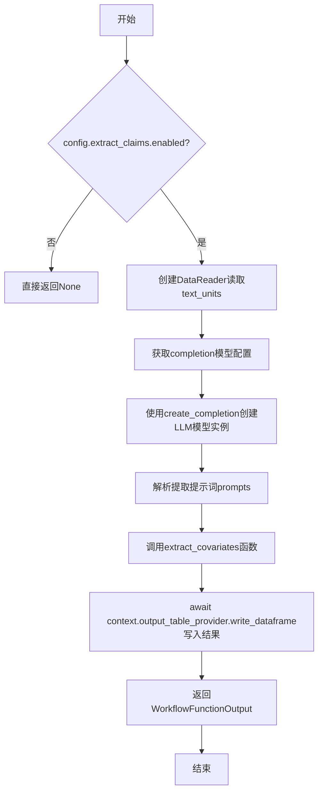
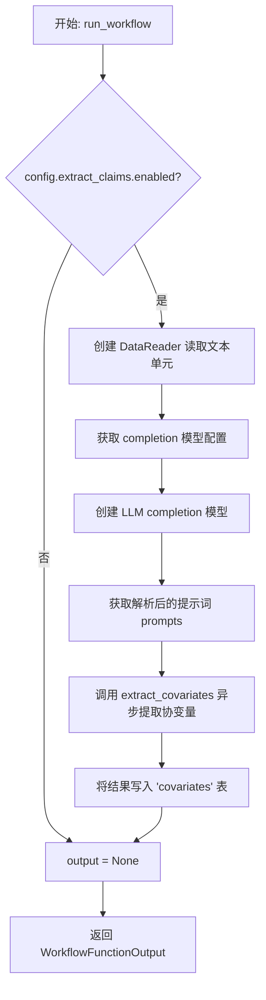
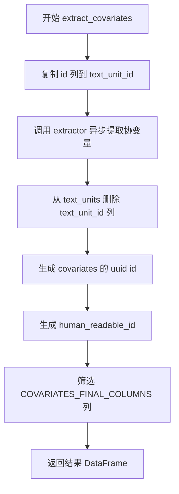

# `graphrag\packages\graphrag\graphrag\index\workflows\extract_covariates.py` 详细设计文档

这是一个GraphRAG项目的工作流模块，主要功能是从文本单元数据中提取covariates（声明/协变量），通过配置启用LLM模型进行提取，并将结果以DataFrame格式写入输出表

## 整体流程



## 类结构

```
模块级函数
├── run_workflow (异步主入口函数)
└── extract_covariates (异步核心提取函数)
```

## 全局变量及字段


### `logger`
    
用于记录模块运行日志的全局logger实例，通过__name__标识日志来源

类型：`logging.Logger`
    


    

## 全局函数及方法


### `run_workflow`

这是一个异步工作流函数，用于从文本单元中提取声明（claims）作为协变量，并将其写入输出表。它首先检查配置是否启用了声明提取功能，如果启用则创建数据读取器、LLM模型和提示词，然后调用协变量提取器进行处理。

参数：

- `config`：`GraphRagConfig`，GraphRag 配置对象，包含提取声明的相关配置（如是否启用、模型ID、提示词等）
- `context`：`PipelineRunContext`，流水线运行上下文，提供缓存、回调、输出表提供者等运行时环境

返回值：`WorkflowFunctionOutput`，工作流函数输出对象，包含提取的协变量结果（pd.DataFrame 或 None）

#### 流程图



#### 带注释源码

```python
async def run_workflow(
    config: GraphRagConfig,
    context: PipelineRunContext,
) -> WorkflowFunctionOutput:
    """All the steps to extract and format covariates."""
    # 记录工作流开始日志
    logger.info("Workflow started: extract_covariates")
    
    # 初始化输出为 None
    output = None
    
    # 检查配置中是否启用了声明提取功能
    if config.extract_claims.enabled:
        # 创建数据读取器，从输出表提供者读取文本单元
        reader = DataReader(context.output_table_provider)
        text_units = await reader.text_units()

        # 获取完成模型的配置
        model_config = config.get_completion_model_config(
            config.extract_claims.completion_model_id
        )

        # 创建 LLM 完成模型，传入模型配置、缓存和缓存键创建器
        model = create_completion(
            model_config,
            cache=context.cache.child(config.extract_claims.model_instance_name),
            cache_key_creator=cache_key_creator,
        )

        # 获取解析后的提示词（包含 extraction_prompt）
        prompts = config.extract_claims.resolved_prompts()

        # 调用异步函数 extract_covariates 提取协变量
        output = await extract_covariates(
            text_units=text_units,
            callbacks=context.callbacks,
            model=model,
            covariate_type="claim",  # 协变量类型为声明
            max_gleanings=config.extract_claims.max_gleanings,
            claim_description=config.extract_claims.description,
            prompt=prompts.extraction_prompt,
            entity_types=DEFAULT_ENTITY_TYPES,
            num_threads=config.concurrent_requests,
            async_type=config.async_mode,
        )

        # 将提取的协变量写入输出表的 'covariates' 表
        await context.output_table_provider.write_dataframe("covariates", output)

    # 记录工作流完成日志
    logger.info("Workflow completed: extract_covariates")
    
    # 返回工作流函数输出结果
    return WorkflowFunctionOutput(result=output)
```


### `extract_covariates`

该函数是一个异步协变量提取工作流，接收文本单元数据，通过 LLM 模型从文本中提取指定类型的协变量（如声明/claim），并对输出结果进行格式化处理，包括生成唯一标识符和列筛选，最终返回符合 `COVARIATES_FINAL_COLUMNS` 规范的 DataFrame。

参数：

- `text_units`：`pd.DataFrame`，包含待提取协变量的文本单元数据
- `callbacks`：`WorkflowCallbacks`，工作流回调接口，用于处理进度和事件
- `model`：`LLMCompletion`，LLM 模型实例，用于执行协变量提取
- `covariate_type`：`str`，协变量类型标识（如 "claim"）
- `max_gleanings`：`int`，最大 gleanings 次数，控制提取深度
- `claim_description`：`str`，对要提取的声明/证据的描述
- `prompt`：`str`，用于指导 LLM 提取的提示词模板
- `entity_types`：`list[str]`，要提取的实体类型列表
- `num_threads`：`int`，并发请求的线程数
- `async_type`：`AsyncType`，异步执行模式枚举

返回值：`pd.DataFrame`，包含提取并格式化后的协变量数据

#### 流程图



#### 带注释源码

```python
async def extract_covariates(
    text_units: pd.DataFrame,
    callbacks: WorkflowCallbacks,
    model: "LLMCompletion",
    covariate_type: str,
    max_gleanings: int,
    claim_description: str,
    prompt: str,
    entity_types: list[str],
    num_threads: int,
    async_type: AsyncType,
) -> pd.DataFrame:
    """All the steps to extract and format covariates."""
    # 将 text_units 的 id 列复制为 text_unit_id
    # 原因：在 extractor 输出时 id 会被协变量 id 覆盖
    # 这样可以让输出的协变量表保留对原始文本单元的引用
    text_units["text_unit_id"] = text_units["id"]

    # 调用底层 extractor 执行实际的协变量提取
    covariates = await extractor(
        input=text_units,
        callbacks=callbacks,
        model=model,
        column="text",
        covariate_type=covariate_type,
        max_gleanings=max_gleanings,
        claim_description=claim_description,
        prompt=prompt,
        entity_types=entity_types,
        num_threads=num_threads,
        async_type=async_type,
    )
    
    # 清理临时添加的 text_unit_id 列，避免污染全局 text_units
    text_units.drop(columns=["text_unit_id"], inplace=True)
    
    # 为每条协变量生成全局唯一标识符
    covariates["id"] = covariates["covariate_type"].apply(lambda _x: str(uuid4()))
    
    # 生成人类可读的序号 ID
    covariates["human_readable_id"] = covariates.index

    # 筛选并返回符合标准模式的列
    return covariates.loc[:, COVARIATES_FINAL_COLUMNS]
```

## 关键组件


### run_workflow

工作流主函数，负责协调整个协变量提取流程，包括数据读取、模型创建、调用extract_covariates提取器并将结果写入输出表。

### extract_covariates

核心协变量提取函数，负责重新分配text_unit_id、调用extractor执行实际提取、生成唯一id标识、筛选最终列并返回协变量数据框。

### DataReader

数据读取组件，用于从output_table_provider读取文本单元数据。

### create_completion

LLM模型创建函数，基于model_config创建completion模型实例，支持缓存功能。

### cache_key_creator

缓存键创建器，用于生成缓存键以支持LLM响应缓存。

### WorkflowCallbacks

工作流回调接口，用于在提取过程中触发回调事件。

### extract_covariates (extractor)

底层提取器，执行实际的协变量提取逻辑，支持多种参数配置如max_gleanings、claim_description、entity_types等。

### GraphRagConfig

图RAG配置类，管理工作流配置参数，包括extract_claims.enabled、completion_model_id、max_gleanings等。

### PipelineRunContext

管道运行上下文，提供缓存、回调、输出表provider等运行时环境。

### WorkflowFunctionOutput

工作流函数输出结构，包含提取的协变量结果数据。

### COVARIATES_FINAL_COLUMNS

协变量最终列定义，指定输出数据框的列结构。

### uuid4

UUID生成器，用于为每个协变量生成唯一标识符。


## 问题及建议


### 已知问题

- **错误处理缺失**：`run_workflow` 和 `extract_covariates` 函数均缺乏 try-except 异常处理机制，若 `DataReader.text_units()`、`create_completion` 或 `extractor` 调用失败，会导致未捕获的异常向上传播
- **资源清理不完善**：`text_units.drop(columns=["text_unit_id"], inplace=True)` 在提取失败时不会执行，可能导致输入 DataFrame 被修改（`text_unit_id` 列已添加但未还原）
- **硬编码字符串**：`"claim"` 作为 covariate_type、`"covariates"` 作为表名、`"text_unit_id"` 作为列名均被硬编码，降低了代码可维护性和可复用性
- **日志记录不充分**：仅记录开始和完成状态，缺少提取记录数、耗时、错误等关键诊断信息
- **直接修改输入参数**：`text_units["text_unit_id"] = text_units["id"]` 直接修改传入的 DataFrame，可能对调用方造成副作用
- **空输入未检查**：`text_units` 为空 DataFrame 时仍会执行后续逻辑，可能产生不必要的开销或空输出
- **无效参数命名**：lambda 表达式 `lambda _x: str(uuid4())` 使用 `_x` 参数但未使用，应简化为 `lambda _: str(uuid4())` 或 `lambda _x: uuid4()` 并调整类型
- **缺少输入验证**：未验证 `max_gleanings`、`num_threads` 等参数的有效性

### 优化建议

- **添加异常处理**：为 `run_workflow` 添加 try-except-finally 块，捕获可能的异常并记录错误日志，确保资源正确清理
- **使用配置常量**：将硬编码的字符串提取为模块级常量或配置类属性
- **防御性复制**：在 `extract_covariates` 入口处对 `text_units` 进行 `.copy()` 避免修改原数据
- **增强日志记录**：使用 `logger.debug/info` 记录提取的记录数、处理耗时、模型配置等关键指标
- **添加空输入检查**：在函数入口检查 `text_units` 是否为空，若为空直接返回空 DataFrame
- **参数验证**：添加参数有效性校验，如 `max_gleanings > 0`、`num_threads > 0` 等
- **优化 lambda 表达式**：移除无效参数或使用更清晰的实现方式

## 其它


### 设计目标与约束

该模块旨在从文本单元中自动提取covariates（协变量），具体为claims（声明/断言），并将其格式化为结构化数据存储。设计约束包括：1) 仅在config.extract_claims.enabled为True时执行提取；2) 使用异步处理支持高并发；3) 输出必须符合COVARIATES_FINAL_COLUMNS定义的模式；4) 必须支持多种实体类型和可配置的LLM提示词。

### 错误处理与异常设计

错误处理策略包括：1) DataReader读取失败时抛出异常并终止工作流；2) create_completion创建LLM模型失败时向上传播；3) extract_covariates执行失败时捕获异常并记录日志；4) write_dataframe写入失败时记录警告但继续执行；5) 所有关键操作均有try-catch包裹并配合logger记录详细错误信息。异常设计遵循"快速失败"原则，确保问题能被及时发现。

### 数据流与状态机

数据流如下：1) 初始状态：工作流启动，config.extract_claims.enabled检查；2) 读取状态：DataReader从output_table_provider读取text_units；3) 模型创建状态：create_completion创建LLM实例；4) 提取状态：调用extractor执行实际covariate提取；5) 处理状态：添加uuid、human_readable_id并筛选最终列；6) 输出状态：write_dataframe写入"covariates"表；7) 结束状态：返回WorkflowFunctionOutput。状态转换依赖config配置和context上下文。

### 外部依赖与接口契约

主要外部依赖包括：1) graphrag_llm.completion.create_completion - LLM创建接口；2) graphrag.cache.cache_key_creator - 缓存键生成；3) graphrag.index.operations.extract_covariates.extract_covariates - 实际提取器；4) graphrag.data_model.schemas.COVARIATES_FINAL_COLUMNS - 输出模式定义；5) PipelineRunContext - 运行时上下文接口。接口契约要求：输入text_units必须包含"id"和"text"列；输出DataFrame必须包含COVARIATES_FINAL_COLUMNS指定的列。

### 配置参数说明

关键配置参数：1) config.extract_claims.enabled - Boolean，控制是否启用提取；2) config.extract_claims.completion_model_id - String，指定使用的LLM模型ID；3) config.extract_claims.max_gleanings - Integer，最大提取次数；4) config.extract_claims.description - String，claim描述；5) config.extract_claims.resolved_prompts() - 方法，返回解析后的提示词；6) config.concurrent_requests - Integer，并发请求数；7) config.async_mode - AsyncType枚举，异步模式类型。

### 性能考虑与优化空间

性能优化点：1) 文本单元的批量处理可考虑分页加载避免内存溢出；2) cache_key_creator的调用可缓存结果避免重复计算；3) text_unit_id的列复制操作可优化为直接引用；4) uuid生成使用lambda可考虑批量预生成；5) drop_columns操作可与后续筛选合并减少DataFrame复制。当前实现对大规模数据集可能存在内存压力，建议增加流式处理支持。

### 安全性与权限控制

安全考虑：1) LLM模型实例通过cache_key_creator生成缓存键，需确保键的唯一性和安全性；2) context.cache.child()创建子缓存时需验证model_instance_name的有效性；3) 文件读取操作需确保context.output_table_provider的权限正确；4) 敏感信息如API密钥应由config安全注入而非硬编码。当前代码未包含输入验证，建议增加对text_units列结构和类型的校验。

### 测试策略与覆盖范围

建议测试覆盖：1) 单元测试：extract_covariates函数的边界条件处理；2) 集成测试：run_workflow与DataReader、extractor的集成；3) Mock测试：模拟LLM模型返回验证数据流转；4) 性能测试：大数据集下的内存和执行时间；5) 异常测试：各种失败场景的优雅处理。当前代码缺少测试文件，建议补充。
    