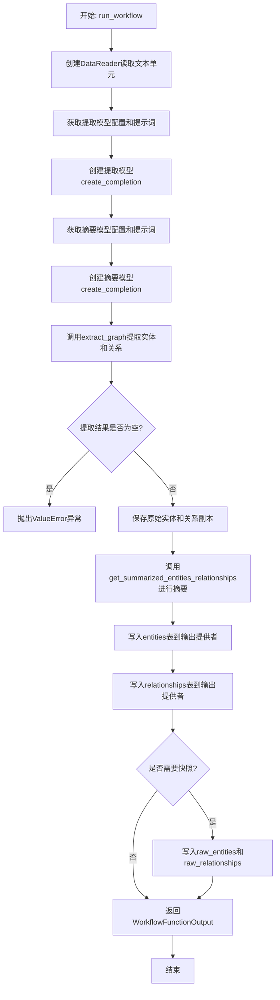
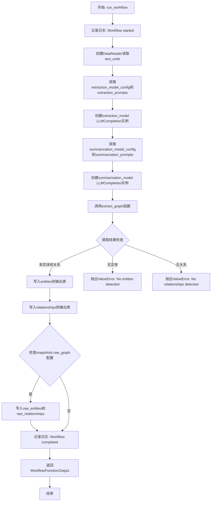
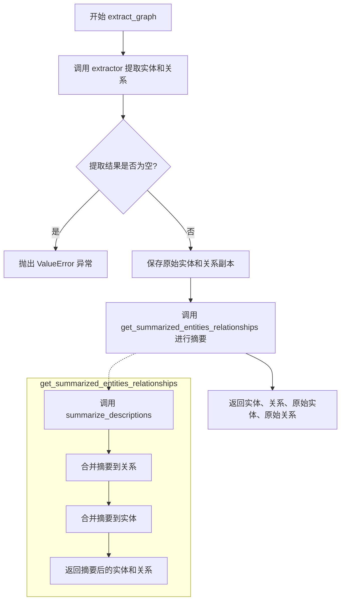
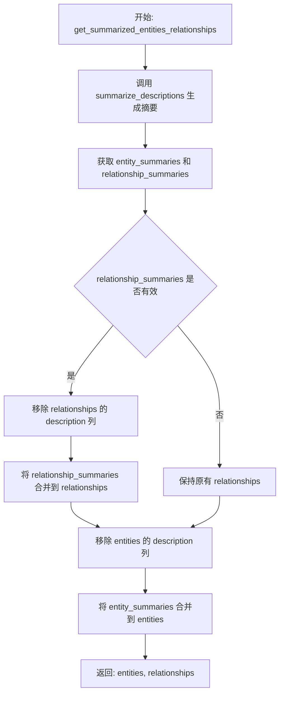

# `graphrag\packages\graphrag\graphrag\index\workflows\extract_graph.py` 详细设计文档

这是一个图谱提取工作流模块，通过读取文本单元数据，使用LLM模型从文本中提取实体和关系，并对实体描述和关系描述进行摘要，最终将处理结果写入输出表。该工作流是GraphRAG系统的核心组件，负责构建基础实体图谱。

## 整体流程



## 类结构

```
该文件为模块文件，不包含类定义
主要包含三个异步函数:
├── run_workflow (主工作流入口)
├── extract_graph (图谱提取核心逻辑)
└── get_summarized_entities_relationships (摘要处理)
```

## 全局变量及字段


### `logger`
    
用于记录工作流日志

类型：`logging.Logger`
    


    

## 全局函数及方法


### `run_workflow`

主工作流函数，负责协调整个图谱提取流程，包括初始化数据读取器、创建提取和摘要模型、执行图提取和描述摘要，最终将实体和关系写入输出表。

参数：

- `config`：`GraphRagConfig`，包含图谱提取的配置信息，如模型设置、实体类型、最大重试次数等
- `context`：`PipelineRunContext`，管道运行上下文，提供缓存、回调、输出表提供程序等运行时环境

返回值：`WorkflowFunctionOutput`，包含提取的实体和关系数据的结果对象

#### 流程图



#### 带注释源码

```python
async def run_workflow(
    config: GraphRagConfig,
    context: PipelineRunContext,
) -> WorkflowFunctionOutput:
    """All the steps to create the base entity graph."""
    # 记录工作流开始日志
    logger.info("Workflow started: extract_graph")
    
    # 创建数据读取器，用于读取文本单元数据
    reader = DataReader(context.output_table_provider)
    text_units = await reader.text_units()

    # 获取图提取模型的配置和提示词
    extraction_model_config = config.get_completion_model_config(
        config.extract_graph.completion_model_id
    )
    extraction_prompts = config.extract_graph.resolved_prompts()
    
    # 创建图提取模型实例，包含缓存配置
    extraction_model = create_completion(
        extraction_model_config,
        cache=context.cache.child(config.extract_graph.model_instance_name),
        cache_key_creator=cache_key_creator,
    )

    # 获取描述摘要模型的配置和提示词
    summarization_model_config = config.get_completion_model_config(
        config.summarize_descriptions.completion_model_id
    )
    summarization_prompts = config.summarize_descriptions.resolved_prompts()
    
    # 创建描述摘要模型实例，包含缓存配置
    summarization_model = create_completion(
        summarization_model_config,
        cache=context.cache.child(config.summarize_descriptions.model_instance_name),
        cache_key_creator=cache_key_creator,
    )

    # 调用extract_graph执行完整的图提取和摘要流程
    entities, relationships, raw_entities, raw_relationships = await extract_graph(
        text_units=text_units,
        callbacks=context.callbacks,
        extraction_model=extraction_model,
        extraction_prompt=extraction_prompts.extraction_prompt,
        entity_types=config.extract_graph.entity_types,
        max_gleanings=config.extract_graph.max_gleanings,
        extraction_num_threads=config.concurrent_requests,
        extraction_async_type=config.async_mode,
        summarization_model=summarization_model,
        max_summary_length=config.summarize_descriptions.max_length,
        max_input_tokens=config.summarize_descriptions.max_input_tokens,
        summarization_prompt=summarization_prompts.summarize_prompt,
        summarization_num_threads=config.concurrent_requests,
    )

    # 将提取的实体写入输出表
    await context.output_table_provider.write_dataframe("entities", entities)
    # 将提取的关系写入输出表
    await context.output_table_provider.write_dataframe("relationships", relationships)

    # 如果配置了快照选项，保存原始提取数据
    if config.snapshots.raw_graph:
        await context.output_table_provider.write_dataframe(
            "raw_entities", raw_entities
        )
        await context.output_table_provider.write_dataframe(
            "raw_relationships", raw_relationships
        )

    # 记录工作流完成日志
    logger.info("Workflow completed: extract_graph")
    
    # 返回包含实体和关系的结果对象
    return WorkflowFunctionOutput(
        result={
            "entities": entities,
            "relationships": relationships,
        }
    )
```


### `extract_graph`

该函数是图谱提取的核心异步函数，负责从文本单元中提取实体和关系，并对其进行摘要处理。它首先调用`extractor`进行基础的实体和关系提取，然后通过`get_summarized_entities_relationships`函数对提取的实体和关系进行摘要，最终返回实体、关系、原始实体和原始关系四个DataFrame。

参数：

- `text_units`：`pd.DataFrame`，待提取的文本单元数据
- `callbacks`：`WorkflowCallbacks`，工作流回调接口，用于处理进度和错误
- `extraction_model`：`LLMCompletion`，用于实体和关系提取的大语言模型
- `extraction_prompt`：`str`，实体和关系提取的提示模板
- `entity_types`：`list[str]`，需要提取的实体类型列表
- `max_gleanings`：`int`，最大重复提取次数，用于提高提取质量
- `extraction_num_threads`：`int`，提取操作的并发线程数
- `extraction_async_type`：`AsyncType`，提取操作的异步类型（sync/async）
- `summarization_model`：`LLMCompletion`，用于摘要生成的大语言模型
- `max_summary_length`：`int`，摘要内容的最大长度
- `max_input_tokens`：`int`，摘要模型输入的最大token数限制
- `summarization_prompt`：`str`，实体和关系描述摘要的提示模板
- `summarization_num_threads`：`int`，摘要操作的并发线程数

返回值：`tuple[pd.DataFrame, pd.DataFrame, pd.DataFrame, pd.DataFrame]`，返回一个包含四个DataFrame的元组，分别是（摘要后的实体，摘要后的关系，原始实体，原始关系）

#### 流程图



#### 带注释源码

```python
async def extract_graph(
    text_units: pd.DataFrame,
    callbacks: WorkflowCallbacks,
    extraction_model: "LLMCompletion",
    extraction_prompt: str,
    entity_types: list[str],
    max_gleanings: int,
    extraction_num_threads: int,
    extraction_async_type: AsyncType,
    summarization_model: "LLMCompletion",
    max_summary_length: int,
    max_input_tokens: int,
    summarization_prompt: str,
    summarization_num_threads: int,
) -> tuple[pd.DataFrame, pd.DataFrame, pd.DataFrame, pd.DataFrame]:
    """All the steps to create the base entity graph."""
    # 调用extractor从每个文本单元中提取图谱数据，稍后进行合并
    extracted_entities, extracted_relationships = await extractor(
        text_units=text_units,
        callbacks=callbacks,
        text_column="text",
        id_column="id",
        model=extraction_model,
        prompt=extraction_prompt,
        entity_types=entity_types,
        max_gleanings=max_gleanings,
        num_threads=extraction_num_threads,
        async_type=extraction_async_type,
    )

    # 如果没有提取到任何实体，抛出错误并记录日志
    if len(extracted_entities) == 0:
        error_msg = "Graph Extraction failed. No entities detected during extraction."
        logger.error(error_msg)
        raise ValueError(error_msg)

    # 如果没有提取到任何关系，抛出错误并记录日志
    if len(extracted_relationships) == 0:
        error_msg = (
            "Graph Extraction failed. No relationships detected during extraction."
        )
        logger.error(error_msg)
        raise ValueError(error_msg)

    # 在进行任何摘要之前，按原样复制这些数据
    raw_entities = extracted_entities.copy()
    raw_relationships = extracted_relationships.copy()

    # 调用摘要处理函数，对实体和关系进行描述摘要
    entities, relationships = await get_summarized_entities_relationships(
        extracted_entities=extracted_entities,
        extracted_relationships=extracted_relationships,
        callbacks=callbacks,
        model=summarization_model,
        max_summary_length=max_summary_length,
        max_input_tokens=max_input_tokens,
        summarization_prompt=summarization_prompt,
        num_threads=summarization_num_threads,
    )

    # 返回摘要后的实体、关系以及原始未摘要的版本
    return (entities, relationships, raw_entities, raw_relationships)
```


### `get_summarized_entities_relationships`

该函数负责对提取的实体和关系进行摘要处理，通过调用 `summarize_descriptions` 函数生成实体和关系的描述摘要，然后将这些摘要合并回原始数据中，移除旧的 description 列并返回更新后的实体和关系 DataFrame。

参数：

- `extracted_entities`：`pd.DataFrame`，包含已提取的实体数据
- `extracted_relationships`：`pd.DataFrame`，包含已提取的关系数据
- `callbacks`：`WorkflowCallbacks`，工作流回调函数，用于处理异步事件
- `model`：`LLMCompletion`，用于生成摘要的 LLM 模型
- `max_summary_length`：`int`，摘要的最大长度
- `max_input_tokens`：`int`，输入令牌的最大数量
- `summarization_prompt`：`str`，用于摘要生成的提示词
- `num_threads`：`int`，并发线程数

返回值：`tuple[pd.DataFrame, pd.DataFrame]`，返回两个 DataFrame，分别是更新后的实体和关系数据

#### 流程图



#### 带注释源码

```python
async def get_summarized_entities_relationships(
    extracted_entities: pd.DataFrame,
    extracted_relationships: pd.DataFrame,
    callbacks: WorkflowCallbacks,
    model: "LLMCompletion",
    max_summary_length: int,
    max_input_tokens: int,
    summarization_prompt: str,
    num_threads: int,
) -> tuple[pd.DataFrame, pd.DataFrame]:
    """Summarize the entities and relationships.
    
    该函数对已提取的实体和关系进行摘要处理：
    1. 调用 summarize_descriptions 生成摘要
    2. 将摘要合并回原始数据
    3. 移除旧的 description 列
    4. 返回更新后的数据
    """
    # 调用摘要生成函数，获取实体和关系的摘要
    entity_summaries, relationship_summaries = await summarize_descriptions(
        entities_df=extracted_entities,
        relationships_df=extracted_relationships,
        callbacks=callbacks,
        model=model,
        max_summary_length=max_summary_length,
        max_input_tokens=max_input_tokens,
        prompt=summarization_prompt,
        num_threads=num_threads,
    )

    # 处理关系数据：移除原始 description 列，合并新的摘要
    relationships = extracted_relationships.drop(columns=["description"]).merge(
        relationship_summaries, on=["source", "target"], how="left"
    )

    # 处理实体数据：移除原始 description 列，合并新的摘要
    # 注意：此处使用 inplace=True 直接修改原始 DataFrame
    extracted_entities.drop(columns=["description"], inplace=True)
    entities = extracted_entities.merge(entity_summaries, on="title", how="left")
    
    # 返回处理后的实体和关系
    return entities, relationships
```

## 关键组件


### run_workflow

主工作流函数，负责协调整个图谱提取流程，包括数据读取、模型创建、图谱提取和摘要、以及结果写入。

### extract_graph

核心图谱提取函数，负责从文本单元中提取实体和关系，并进行摘要处理，返回实体、关系和原始数据。

### get_summarized_entities_relationships

实体和关系摘要函数，负责使用LLM模型对提取的实体和关系进行描述摘要，合并摘要信息后返回处理后的数据框。

### DataReader

数据读取器组件，负责从输出表提供者读取文本单元数据。

### extraction_model

图谱提取所使用的LLM completion模型，负责根据提示从文本中提取实体和关系。

### summarization_model

摘要生成所使用的LLM completion模型，负责为实体和关系生成描述摘要。

### extractor

图谱提取操作模块，调用LLM从每个文本单元中提取实体和关系。

### summarize_descriptions

描述摘要操作模块，调用LLM对提取的实体和关系进行描述摘要生成。

### WorkflowCallbacks

工作流回调接口，用于在图谱提取过程中触发回调事件。

### PipelineRunContext

管道运行上下文，包含缓存、回调、输出表提供者等运行时信息。

### GraphRagConfig

图谱配置模型，包含提取和摘要的相关配置参数，如实体类型、最大 gleanings 数、线程数等。

## 问题及建议


### 已知问题

- **错误处理不足**：缺少对`DataReader.text_units()`返回空数据或`None`的检查，以及对`create_completion`创建模型失败的异常处理。
- **日志信息不完整**：仅在Workflow开始和结束时记录日志，缺少中间步骤（如提取了多少实体/关系）的详细信息，不利于问题排查和监控。
- **DataFrame操作风险**：`get_summarized_entities_relationships`中使用了`inplace=True`修改原始DataFrame，可能导致意外的数据修改和SettingWithCopyWarning。
- **硬编码列名**：在多处直接使用字符串常量如"text"、"id"、"description"、"source"、"target"、"title"，缺乏统一管理，增加维护成本。
- **配置依赖未验证**：函数直接使用`config`对象的多个深层属性（如`config.extract_graph.*`、`config.summarize_descriptions.*`），未在函数入口做空值或类型校验。
- **缺乏重试机制**：对于LLM调用等可能瞬时失败的操作，没有实现重试逻辑。
- **资源管理不明确**：创建的缓存`context.cache.child(...)`没有显式的生命周期管理或错误释放机制。

### 优化建议

- 增加详细的中间步骤日志，记录提取/摘要前后的数据量、处理耗时等指标。
- 移除所有`inplace=True`操作，改为链式赋值或创建副本，提高代码健壮性和避免警告。
- 抽取配置中的字符串列名为常量或枚举类，统一管理。
- 在函数入口增加配置项的断言或默认值处理，确保配置完整性。
- 对关键LLM调用添加重试装饰器或逻辑，提升容错能力。
- 增加对空输入数据的早期返回或友好错误提示，避免后续处理失败。
- 考虑将模型创建的重复逻辑抽象为工厂函数或工具方法。

## 其它


### 设计目标与约束

本模块的设计目标是实现一个完整的图谱提取工作流，能够从文本单元中自动提取实体、关系，并对实体和关系描述进行摘要。核心约束包括：1）必须使用配置驱动的模型选择，支持不同的LLM后端；2）支持并发和异步处理以提升性能；3）结果必须写入指定的输出表；4）需要支持原始数据的快照保存。

### 错误处理与异常设计

代码中包含两处关键的错误处理逻辑：1）当`extracted_entities`为空时，抛出`ValueError`并记录"Graph Extraction failed. No entities detected during extraction."错误信息；2）当`extracted_relationships`为空时，抛出`ValueError`并记录"Graph Extraction failed. No relationships detected during extraction."错误信息。所有错误都通过`logger.error()`记录，并向上传递异常以便调用方感知和处理。

### 数据流与状态机

数据流经过以下阶段：1）初始化阶段：创建DataReader、加载提取模型和摘要模型配置；2）提取阶段：调用`extractor`从text_units中提取实体和关系；3）验证阶段：检查提取结果是否为空；4）快照阶段：保存原始实体和关系的副本（如果启用快照）；5）摘要阶段：调用`summarize_descriptions`对实体和关系进行摘要；6）合并阶段：将摘要结果与原始数据合并；7）输出阶段：将结果写入输出表。整个流程是串行执行的，前一阶段的输出作为下一阶段的输入。

### 外部依赖与接口契约

主要依赖包括：1）`graphrag_llm.completion.create_completion`：用于创建LLMCompletion实例；2）`graphrag.cache.cache_key_creator`：用于生成缓存键；3）`graphrag.data_model.data_reader.DataReader`：用于读取文本单元数据；4）`graphrag.index.operations.extract_graph.extract_graph`：图提取核心操作；5）`graphrag.index.operations.summarize_descriptions.summarize_descriptions`：描述摘要操作；6）`graphrag.config.models.graph_rag_config.GraphRagConfig`：配置模型；7）`graphrag.index.typing.context.PipelineRunContext`：管道运行上下文。输入契约要求text_units必须是包含"text"和"id"列的DataFrame；输出契约返回包含entities和relationships的WorkflowFunctionOutput。

### 性能考量与优化空间

性能优化点包括：1）提取和摘要操作支持`num_threads`和`async_type`参数，可根据硬件配置调整并发度；2）使用缓存机制避免重复LLM调用；3）模型实例通过`config.model_instance_name`隔离缓存。当前优化空间：1）提取和摘要过程串行执行，可以考虑流水线并行；2）错误处理是fail-fast模式，可以增加重试机制；3）大数据集可以考虑分批处理以控制内存使用。

### 配置管理

配置通过`GraphRagConfig`对象集中管理，关键配置项包括：1）`config.extract_graph.completion_model_id`：提取模型ID；2）`config.extract_graph.entity_types`：实体类型列表；3）`config.extract_graph.max_gleanings`：最大 gleanings 次数；4）`config.summarize_descriptions.completion_model_id`：摘要模型ID；5）`config.summarize_descriptions.max_length`：最大摘要长度；6）`config.summarize_descriptions.max_input_tokens`：最大输入token数；7）`config.concurrent_requests`：并发请求数；8）`config.async_mode`：异步模式类型；9）`config.snapshots.raw_graph`：是否保存原始图快照。

### 并发与异步处理设计

代码支持两种并发模式：1）通过`extraction_num_threads`/`summarization_num_threads`参数控制线程池大小；2）通过`extraction_async_type`/`async_type`（在summarize_descriptions中）控制异步类型（AsyncType枚举）。模型调用通过`create_completion`创建，支持异步调用。工作流本身是async函数，可以使用asyncio.gather或类似机制进一步并行化多个独立步骤。

### 缓存策略

使用分层缓存机制：1）顶层缓存通过`context.cache.child()`创建，以模型实例名称隔离；2）缓存键通过`cache_key_creator`生成，确保相同输入产生相同的缓存键；3）缓存键按模型实例名称分别维护，避免不同模型配置的缓存冲突。缓存适用于LLM调用的结果，可以显著减少重复计算。

### 日志与监控

日志使用标准Python logging模块，logger名称为`__name__`（即模块路径）。日志级别和信息：1）`logger.info("Workflow started: extract_graph")`：工作流启动；2）`logger.info("Workflow completed: extract_graph")`：工作流完成；3）`logger.error(error_msg)`：提取失败时记录错误。建议增加更多细粒度日志，如每个处理阶段的开始和结束、处理的文本单元数量、提取到的实体/关系数量等，以便问题诊断和性能监控。

### 测试策略建议

建议补充以下测试：1）单元测试：测试`extract_graph`函数在空输入、正常输入、边界输入下的行为；2）集成测试：测试整个工作流与mock的LLM和输出提供商的交互；3）错误处理测试：验证空实体/空关系时是否正确抛出异常；4）配置测试：验证不同配置组合下的行为；5）性能测试：验证并发处理和缓存的效果。由于代码中import了TYPE_CHECKING，测试时需要mock `LLMCompletion`类型。

### 版本兼容性考虑

代码依赖于特定版本的依赖模块：1）`graphrag_llm`模块的`create_completion`函数和`LLMCompletion`类型；2）`graphrag`包的多个子模块。需要注意GraphRagConfig、PipelineRunContext、WorkflowCallbacks等接口的兼容性。建议在文档中明确列出依赖的版本范围，并说明接口契约变更时的迁移策略。

    