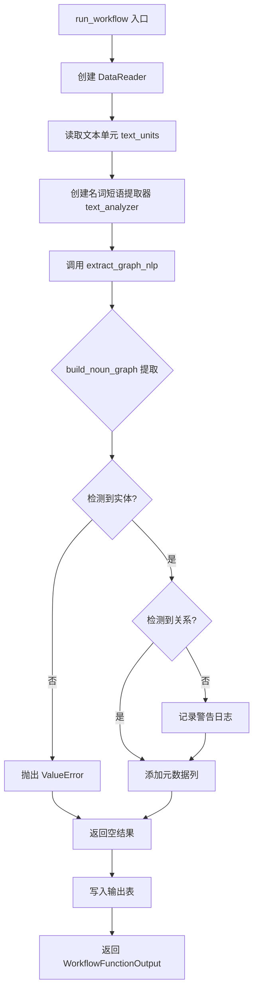
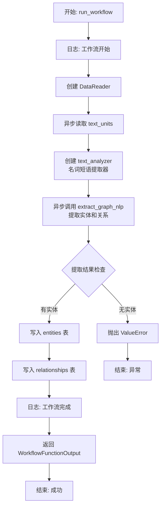
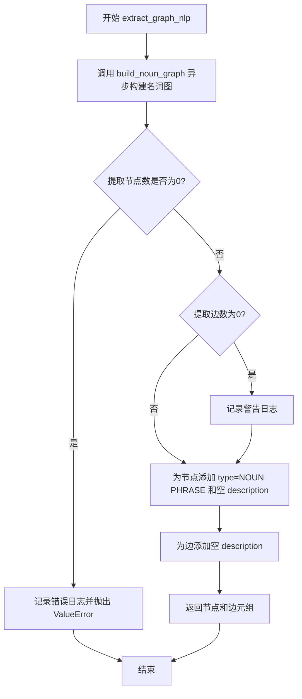

# `graphrag\packages\graphrag\graphrag\index\workflows\extract_graph_nlp.py` 详细设计文档

该模块是 GraphRAG 的核心工作流之一，负责从文本单元数据中通过 NLP 技术提取名词短语作为实体，并构建实体之间的关联关系，最终输出 entities 和 relationships 两个 DataFrame 用于下游图谱构建。

## 整体流程



## 类结构

```
Workflow Module (工作流模块)
└── extract_graph_nlp.py
    ├── run_workflow (主入口函数)
    └── extract_graph_nlp (核心提取函数)
```

## 全局变量及字段


### `logger`
    
模块级日志记录器，用于记录工作流执行过程中的信息

类型：`logging.Logger`
    


    

## 全局函数及方法


### `run_workflow`

这是异步工作流的入口函数，协调整个 NLP 图提取流程，包括读取文本单元、创建名词短语提取器、提取实体和关系、写入输出表，并返回包含实体和关系的结果。

参数：

- `config`：`GraphRagConfig`，全局配置对象，包含图提取的各项配置参数（如文本分析器配置、边权重归一化、并发线程数、异步模式等）
- `context`：`PipelineRunContext`，管道运行上下文，提供缓存访问和输出表Provider用于读写数据

返回值：`WorkflowFunctionOutput`，工作流函数输出对象，包含提取结果字典，其中键为 "entities" 和 "relationships"，值分别为提取的实体 DataFrame 和关系 DataFrame

#### 流程图



#### 带注释源码

```python
import logging
import pandas as pd
from graphrag_cache import Cache

from graphrag.config.enums import AsyncType
from graphrag.config.models.graph_rag_config import GraphRagConfig
from graphrag.data_model.data_reader import DataReader
from graphrag.index.operations.build_noun_graph.build_noun_graph import build_noun_graph
from graphrag.index.operations.build_noun_graph.np_extractors.base import (
    BaseNounPhraseExtractor,
)
from graphrag.index.operations.build_noun_graph.np_extractors.factory import (
    create_noun_phrase_extractor,
)
from graphrag.index.typing.context import PipelineRunContext
from graphrag.index.typing.workflow import WorkflowFunctionOutput

logger = logging.getLogger(__name__)


async def run_workflow(
    config: GraphRagConfig,
    context: PipelineRunContext,
) -> WorkflowFunctionOutput:
    """All the steps to create the base entity graph."""
    # 记录工作流开始日志
    logger.info("Workflow started: extract_graph_nlp")
    
    # 创建数据读取器，用于从输出表Provider读取文本单元数据
    reader = DataReader(context.output_table_provider)
    # 异步读取文本单元数据DataFrame
    text_units = await reader.text_units()

    # 从配置中获取文本分析器配置，并创建名词短语提取器实例
    text_analyzer_config = config.extract_graph_nlp.text_analyzer
    text_analyzer = create_noun_phrase_extractor(text_analyzer_config)

    # 异步执行NLP图提取核心逻辑，传入文本单元、缓存、分析器及配置参数
    entities, relationships = await extract_graph_nlp(
        text_units,
        context.cache,
        text_analyzer=text_analyzer,
        # 边权重是否归一化配置
        normalize_edge_weights=config.extract_graph_nlp.normalize_edge_weights,
        # 并发请求线程数配置
        num_threads=config.extract_graph_nlp.concurrent_requests,
        # 异步模式配置
        async_type=config.extract_graph_nlp.async_mode,
    )

    # 将提取的实体数据写入输出表的 "entities" 表
    await context.output_table_provider.write_dataframe("entities", entities)
    # 将提取的关系数据写入输出表的 "relationships" 表
    await context.output_table_provider.write_dataframe("relationships", relationships)

    # 记录工作流完成日志
    logger.info("Workflow completed: extract_graph_nlp")

    # 返回工作流输出结果，包含实体和关系数据
    return WorkflowFunctionOutput(
        result={
            "entities": entities,
            "relationships": relationships,
        }
    )


async def extract_graph_nlp(
    text_units: pd.DataFrame,
    cache: Cache,
    text_analyzer: BaseNounPhraseExtractor,
    normalize_edge_weights: bool,
    num_threads: int,
    async_type: AsyncType,
) -> tuple[pd.DataFrame, pd.DataFrame]:
    """All the steps to create the base entity graph."""
    # 调用名词图构建核心函数，执行实体和边的提取
    extracted_nodes, extracted_edges = await build_noun_graph(
        text_units,
        text_analyzer=text_analyzer,
        normalize_edge_weights=normalize_edge_weights,
        num_threads=num_threads,
        async_mode=async_type,
        cache=cache,
    )

    # 检查是否提取到实体，若无实体则抛出异常
    if len(extracted_nodes) == 0:
        error_msg = (
            "NLP Graph Extraction failed. No entities detected during extraction."
        )
        logger.error(error_msg)
        raise ValueError(error_msg)

    # 检查是否提取到关系，若无关系则记录错误日志（但不抛出异常，兼容空关系情况）
    if len(extracted_edges) == 0:
        error_msg = (
            "NLP Graph Extraction failed. No relationships detected during extraction."
        )
        logger.error(error_msg)

    # 为提取的节点添加下游工作流所需的列：type 和 description
    extracted_nodes["type"] = "NOUN PHRASE"
    extracted_nodes["description"] = ""
    # 为提取的边添加 description 列
    extracted_edges["description"] = ""

    # 返回提取的实体和关系元组
    return (extracted_nodes, extracted_edges)
```

---

### 关键组件信息

| 组件名称 | 一句话描述 |
|---------|-----------|
| `DataReader` | 数据读取器，负责从输出表Provider中读取文本单元数据 |
| `BaseNounPhraseExtractor` | 名词短语提取器抽象基类，定义提取器接口规范 |
| `create_noun_phrase_extractor` | 工厂函数，根据配置创建具体的名词短语提取器实例 |
| `build_noun_graph` | 核心图构建操作，负责从文本中提取名词实体和关系边 |
| `PipelineRunContext` | 管道运行上下文，提供缓存和输出表Provider的访问能力 |
| `WorkflowFunctionOutput` | 工作流函数输出数据结构，包含执行结果 |

---

### 潜在的技术债务或优化空间

1. **异常处理不一致**：当 `extracted_edges` 为空时仅记录错误日志而不抛出异常，与 `extracted_nodes` 为空时的行为不一致，可能导致下游流程出现意外行为
2. **硬编码的默认值**：实体和关系的 `description` 字段被硬编码为空字符串 ""，缺乏从文本中提取描述信息的能力
3. **缺乏重试机制**：网络异常或临时性故障时没有重试逻辑，可能导致工作流失败
4. **配置校验缺失**：未对 `config.extract_graph_nlp` 的各项配置进行前置校验，可能导致运行时错误

---

### 其它项目

#### 设计目标与约束

- **目标**：从文本单元中提取名词短语作为实体，构建实体之间的关系图
- **约束**：依赖 `GraphRagConfig` 中的 `extract_graph_nlp` 配置块，必须提供有效的文本分析器和并发配置

#### 错误处理与异常设计

- 若提取结果为空（无实体或无关系），记录错误日志并根据情况抛出 `ValueError`
- 使用 Python 标准 `logging` 模块进行日志记录，支持分级输出

#### 数据流与状态机

1. **初始化状态** → 读取配置和数据
2. **处理状态** → 调用 NLP 提取核心逻辑
3. **验证状态** → 检查提取结果有效性
4. **持久化状态** → 写入输出表
5. **完成状态** → 返回结果

#### 外部依赖与接口契约

- **输入**：通过 `context.output_table_provider` 读取 `text_units` 表
- **输出**：通过 `context.output_table_provider` 写入 `entities` 和 `relationships` 表
- **核心依赖**：`build_noun_graph` 函数执行实际的图提取逻辑，`text_analyzer` 提供名词短语识别能力


### `extract_graph_nlp`

该函数是异步核心提取函数，执行名词短语实体和关系抽取。它接收文本单元数据、缓存实例、文本分析器及配置参数，调用 `build_noun_graph` 构建名词图，验证提取结果并为节点和边补充元数据后返回实体和关系数据框。

参数：

- `text_units`：`pd.DataFrame`，包含待提取的文本单元数据
- `cache`：`Cache`，用于缓存提取结果以提升性能的缓存实例
- `text_analyzer`：`BaseNounPhraseExtractor`，名词短语提取器，用于从文本中识别实体和关系
- `normalize_edge_weights`：`bool`，是否对边权重进行归一化处理
- `num_threads`：`int`，并发请求的线程数，控制异步处理并发度
- `async_type`：`AsyncType`，异步模式类型，指定并发处理策略

返回值：`tuple[pd.DataFrame, pd.DataFrame]`，返回包含提取实体（节点）和关系（边）的元组，第一个元素为实体数据框，第二个元素为关系数据框

#### 流程图



#### 带注释源码

```python
async def extract_graph_nlp(
    text_units: pd.DataFrame,
    cache: Cache,
    text_analyzer: BaseNounPhraseExtractor,
    normalize_edge_weights: bool,
    num_threads: int,
    async_type: AsyncType,
) -> tuple[pd.DataFrame, pd.DataFrame]:
    """All the steps to create the base entity graph."""
    # 调用 build_noun_graph 异步构建名词图，执行实体和关系抽取
    extracted_nodes, extracted_edges = await build_noun_graph(
        text_units,
        text_analyzer=text_analyzer,
        normalize_edge_weights=normalize_edge_weights,
        num_threads=num_threads,
        async_mode=async_type,
        cache=cache,
    )

    # 检查是否成功提取到实体节点，若无则抛出异常
    if len(extracted_nodes) == 0:
        error_msg = (
            "NLP Graph Extraction failed. No entities detected during extraction."
        )
        logger.error(error_msg)
        raise ValueError(error_msg)

    # 检查是否成功提取到关系边，若无则记录警告日志
    if len(extracted_edges) == 0:
        error_msg = (
            "NLP Graph Extraction failed. No relationships detected during extraction."
        )
        logger.error(error_msg)

    # 为提取的节点添加类型标记和空描述字段，满足下游工作流元数据要求
    extracted_nodes["type"] = "NOUN PHRASE"
    extracted_nodes["description"] = ""
    # 为提取的边添加空描述字段，保持数据结构一致性
    extracted_edges["description"] = ""

    # 返回提取的实体节点和关系边元组
    return (extracted_nodes, extracted_edges)
```

## 关键组件


### 文本单元读取 (DataReader + text_units)

使用 DataReader 从 output_table_provider 读取文本单元数据，作为图提取的输入数据源，支持异步读取。

### 名词短语提取器 (text_analyzer)

由 create_noun_phrase_extractor 工厂函数创建的名词短语提取器实例，负责从文本中提取名词短语，是图提取的核心分析器组件。

### 名词图构建 (build_noun_graph)

核心图提取操作，接收文本单元和名词短语提取器，返回提取的节点(实体)和边(关系)数据帧，支持归一化边权重、并发控制和异步模式。

### 实体与关系数据处理

对提取结果进行验证和增强：检查空结果、添加 type 和 description 字段，将节点类型标记为"NOUN PHRASE"，为下游工作流准备标准化的图数据。

### 缓存机制 (cache)

使用 Cache 对象实现增量计算和结果复用，支持通过文本单元内容哈希进行缓存键管理，提升重复执行的效率。

### 工作流输出 (WorkflowFunctionOutput)

将提取的 entities 和 relationships 打包为标准工作流输出格式，同时写入 output_table_provider 供下游步骤使用。

### 配置参数 (extract_graph_nlp)

从 GraphRagConfig 中获取 text_analyzer、normalize_edge_weights、concurrent_requests、async_mode 等提取参数，控制图提取行为的各个环节。


## 问题及建议


### 已知问题

-   **错误处理不一致**：当`extracted_nodes`为空时抛出`ValueError`，但当`extracted_edges`为空时仅记录错误日志而继续执行，这种不一致的行为可能导致下游工作流出现难以追踪的问题
-   **缺少参数验证**：对`num_threads`、`async_type`和`normalize_edge_weights`等关键参数缺乏验证，可能导致运行时错误
-   **硬编码字符串**："NOUN PHRASE"和空字符串描述在多处硬编码，违反DRY原则，修改时需要多处修改
-   **缓存未做空值检查**：直接传递`cache`参数给`build_noun_graph`而未检查是否为`None`，可能导致空指针异常
-   **缺乏数据验证**：读取`text_units`后未验证其结构和内容合法性，写入操作后也未确认是否成功
-   **日志信息不完整**：仅在开始和结束时记录日志，缺少处理进度、文本单元数量等中间状态信息
-   **异常信息缺乏上下文**：错误消息未包含有助于调试的上下文信息（如处理的文本单元数量等）

### 优化建议

-   统一错误处理策略：要么都对空数据抛出异常，要么都记录警告但允许继续，取决于业务需求
-   添加参数验证函数：在函数入口处验证所有输入参数的合法性和范围
-   提取常量：将硬编码的字符串定义为模块级常量或配置项
-   添加缓存空值检查：在使用缓存前进行`None`检查或使用Optional类型
-   增强数据验证：验证`text_units`DataFrame包含必要列，检查写入操作是否成功
-   完善日志记录：添加处理数量、关键步骤、耗时等中间日志，使用结构化日志便于分析
-   丰富异常上下文：在异常信息中包含更多调试信息，如数据统计、配置参数等

## 其它


### 设计目标与约束

本工作流的核心设计目标是从文本单元（text_units）中提取命名实体图（noun phrase graph），为下游的图索引和知识图谱构建提供基础数据。设计约束包括：1）必须支持异步处理以提高性能；2）依赖外部缓存机制来避免重复计算；3）输出必须包含标准的entities和relationships DataFrame格式；4）需要兼容GraphRagConfig中的extract_graph_nlp配置模块。

### 错误处理与异常设计

代码包含两层错误处理逻辑：1）当extract_graph_nlp函数检测到extracted_nodes为空时，抛出ValueError异常并记录错误日志"NLP Graph Extraction failed. No entities detected during extraction."；2）当extracted_edges为空时，仅记录警告日志但不抛出异常，因为某些场景下可能只有节点没有边。此外，所有异步操作通过await关键字进行，调用方需要处理可能的asyncio相关异常。

### 数据流与状态机

数据流经过以下阶段：1）初始化阶段：创建DataReader和text_analyzer；2）读取阶段：通过DataReader.text_units()获取文本单元数据；3）提取阶段：调用build_noun_graph进行NLP提取；4）验证阶段：检查提取结果是否为空；5）后处理阶段：添加type和description字段；6）输出阶段：写入输出表并返回结果。状态转换由await关键字驱动，呈现线性流程。

### 外部依赖与接口契约

本模块依赖以下外部组件：1）graphrag_cache.Cache - 缓存接口，用于存储和检索已计算的NLP结果；2）graphrag.config.models.graph_rag_config.GraphRagConfig - 配置模型，提供extract_graph_nlp子配置；3）graphrag.data_model.data_reader.DataReader - 数据读取接口，需实现text_units()方法返回pd.DataFrame；4）graphrag.index.operations.build_noun_graph.build_noun_graph.build_noun_graph - 图构建核心函数；5）graphrag.index.operations.build_noun_graph.np_extractors.base.BaseNounPhraseExtractor - 名词短语提取器抽象基类；6）graphrag.index.typing.context.PipelineRunContext - 管道运行上下文；7）graphrag.index.typing.workflow.WorkflowFunctionOutput - 工作流输出结构。

### 性能考虑与优化建议

当前实现通过以下机制优化性能：1）异步I/O操作（async/await）提高并发吞吐量；2）支持num_threads和async_type配置以适配不同硬件环境；3）使用Cache避免重复计算同名实体。然而存在以下优化空间：1）错误处理中edges为空时未抛出异常，可能导致下游处理静默失败；2）DataReader.text_units()可能返回大量数据，建议增加分页或流式处理机制；3）build_noun_graph调用后可考虑增量更新而非全量计算。

### 配置参数说明

关键配置参数包括：1）config.extract_graph_nlp.text_analyzer - 名词短语提取器配置，用于create_noun_phrase_extractor工厂函数；2）config.extract_graph_nlp.normalize_edge_weights - 布尔值，是否对边权重进行归一化处理；3）config.extract_graph_nlp.concurrent_requests - 整数，并发请求线程数；4）config.extract_graph_nlp.async_mode - AsyncType枚举，指定异步模式（SIMPLE或TASK_GROUP）。

### 安全性考虑

当前代码缺少以下安全措施：1）输入验证：未检查text_units的DataFrame结构是否符合预期；2）资源限制：未对extracted_nodes/extracted_edges的大小进行上限控制；3）缓存安全：Cache对象的使用未包含过期策略或容量限制；4）日志脱敏：logger输出可能包含敏感信息。建议在生产环境中增加输入schema验证和敏感数据过滤。

### 测试策略建议

建议补充以下测试用例：1）单元测试：验证extract_graph_nlp在空输入、正常输入、单节点输入等场景下的行为；2）集成测试：与DataReader和Cache的交互测试；3）性能测试：大规模text_units下的处理时间和内存占用；4）异常测试：模拟build_noun_graph抛出异常时的错误传播；5）配置测试：验证不同text_analyzer配置对输出结果的影响。


    