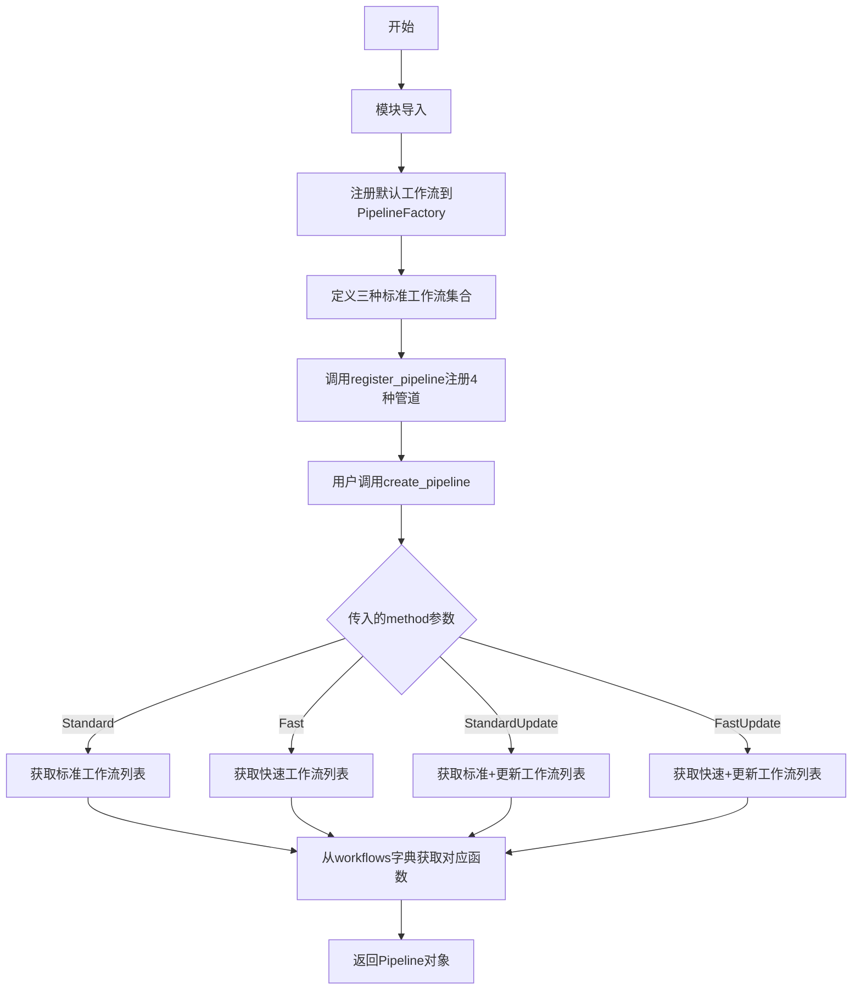
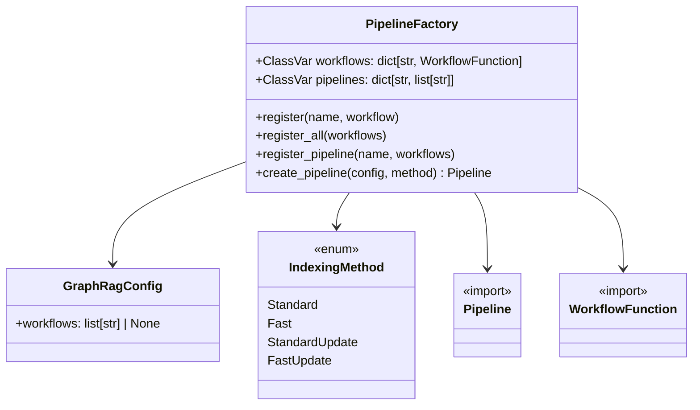
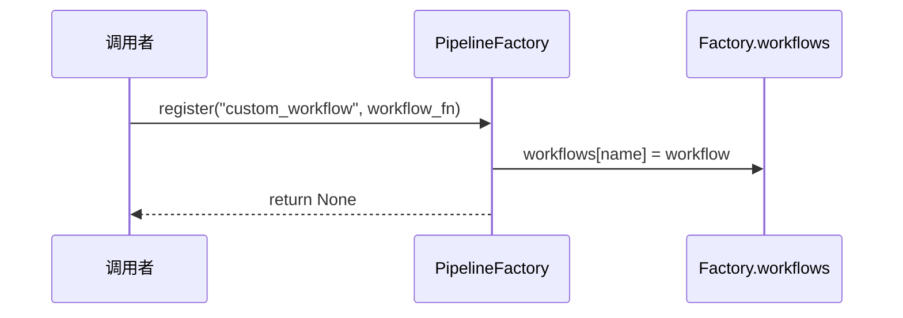
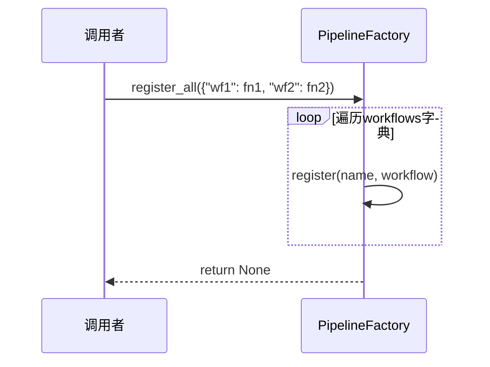
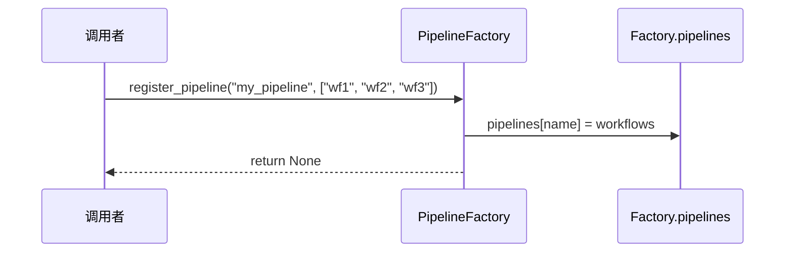
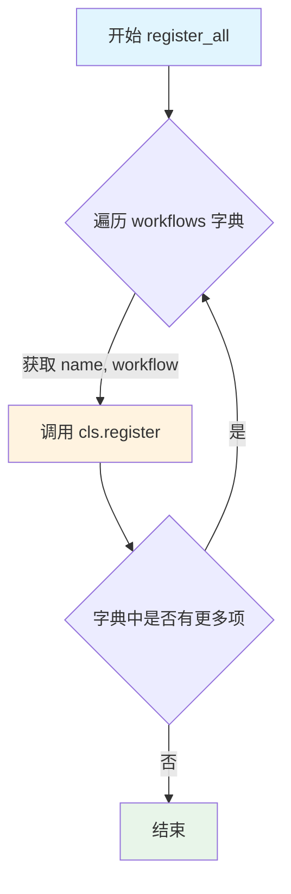
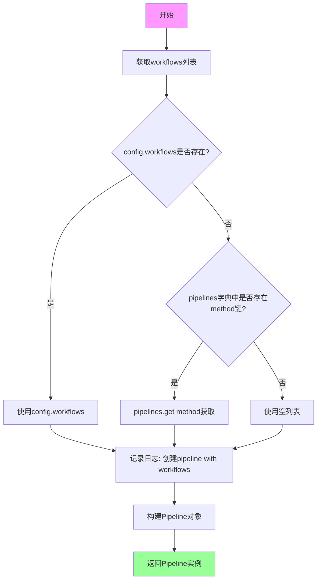

# `graphrag\packages\graphrag\graphrag\index\workflows\factory.py` 详细设计文档

这是一个工作流管道工厂类，用于管理和注册各种索引方法的工作流，并支持根据配置动态创建对应的处理管道。

## 整体流程



## 类结构

```
PipelineFactory (工厂类)
├── ClassVar: workflows (工作流函数注册表)
├── ClassVar: pipelines (管道名称到工作流列表的映射)
└── Methods
    ├── register() - 注册单个工作流
    ├── register_all() - 批量注册工作流
    ├── register_pipeline() - 注册管道
    └── create_pipeline() - 创建管道实例
```

## 全局变量及字段


### `_standard_workflows`
    
标准索引方法的工作流名称列表

类型：`list[str]`
    


### `_fast_workflows`
    
快速索引方法的工作流名称列表

类型：`list[str]`
    


### `_update_workflows`
    
更新索引方法的工作流名称列表

类型：`list[str]`
    


### `logger`
    
模块级日志记录器

类型：`logging.Logger`
    


### `PipelineFactory.workflows`
    
工作流函数注册表

类型：`ClassVar[dict[str, WorkflowFunction]]`
    


### `PipelineFactory.pipelines`
    
管道名称到工作流名称列表的映射

类型：`ClassVar[dict[str, list[str]]]`
    
    

## 全局函数及方法


# PipelineFactory 类详细设计文档

## 概述

`PipelineFactory` 是一个工厂类，封装了工作流（Workflow）的注册管理和索引管道的创建功能，支持通过配置选择不同的工作流组合来实现标准、快速或增量更新模式的文档索引处理。

---

### `PipelineFactory`

工厂类，负责管理工作流函数的注册以及根据配置创建索引管道。

#### 流程图



#### 带注释源码

```python
class PipelineFactory:
    """A factory class for workflow pipelines."""
    
    # 类变量：存储已注册的工作流函数，键为工作流名称，值为工作流函数
    workflows: ClassVar[dict[str, WorkflowFunction]] = {}
    
    # 类变量：存储预定义的管道配置，键为管道名称，值为工作流名称列表
    pipelines: ClassVar[dict[str, list[str]]] = {}
```

---

### `PipelineFactory.register`

注册单个自定义工作流函数到工厂类中。

参数：

- `name`：`str`，工作流的唯一标识名称
- `workflow`：`WorkflowFunction`，要注册的工作流函数

返回值：`None`，无返回值（类方法）

#### 流程图



#### 带注释源码

```python
@classmethod
def register(cls, name: str, workflow: WorkflowFunction):
    """Register a custom workflow function."""
    cls.workflows[name] = workflow  # 将工作流函数存储到类变量字典中
```

---

### `PipelineFactory.register_all`

批量注册多个自定义工作流函数。

参数：

- `workflows`：`dict[str, WorkflowFunction]`，包含多个工作流函数名称和函数本身的字典

返回值：`None`，无返回值（类方法）

#### 流程图



#### 带注释源码

```python
@classmethod
def register_all(cls, workflows: dict[str, WorkflowFunction]):
    """Register a dict of custom workflow functions."""
    for name, workflow in workflows.items():
        cls.register(name, workflow)  # 遍历字典，逐一调用register方法注册
```

---

### `PipelineFactory.register_pipeline`

将一组工作流名称注册为命名管道，支持通过管道名称快速创建完整的工作流序列。

参数：

- `name`：`str`，管道的唯一标识名称
- `workflows`：`list[str]`，构成该管道的工作流名称列表

返回值：`None`，无返回值（类方法）

#### 流程图



#### 带注释源码

```python
@classmethod
def register_pipeline(cls, name: str, workflows: list[str]):
    """Register a new pipeline method as a list of workflow names."""
    cls.pipelines[name] = workflows  # 将工作流名称列表存储到类变量pipelines中
```

---

### `PipelineFactory.create_pipeline`

根据配置和指定的索引方法创建可迭代的管道对象，用于执行文档索引工作流。

参数：

- `config`：`GraphRagConfig`，图谱 RAG 配置对象，包含自定义工作流列表
- `method`：`IndexingMethod | str`，索引方法，默认为 `IndexingMethod.Standard`，可选值包括 Standard、Fast、StandardUpdate、FastUpdate

返回值：`Pipeline`，返回配置好的管道生成器对象

#### 流程图

```mermaid
flowchart TD
    A[开始创建管道] --> B{config.workflows是否存在?}
    B -->|是| C[使用config.workflows]
    B -->|否| D{method是否在pipelines中?}
    D -->|是| E[使用pipelines[method]]
    D -->|否| F[使用空列表]
    C --> G[日志记录工作流列表]
    E --> G
    F --> G
    G --> H[构建Pipeline对象]
    H --> I[返回Pipeline]
    
    style A fill:#f9f,color:#000
    style I fill:#9f9,color:#000
```

#### 带注释源码

```python
@classmethod
def create_pipeline(
    cls,
    config: GraphRagConfig,
    method: IndexingMethod | str = IndexingMethod.Standard,
) -> Pipeline:
    """Create a pipeline generator."""
    # 优先使用config中指定的工作流，否则根据method获取预定义的管道
    workflows = config.workflows or cls.pipelines.get(method, [])
    
    # 记录日志，便于调试追踪
    logger.info("Creating pipeline with workflows: %s", workflows)
    
    # 构建管道：创建由(名称, 工作流函数)组成的元组列表
    return Pipeline([(name, cls.workflows[name]) for name in workflows])
```

---

## 全局变量

### `_standard_workflows`

- **类型**：`list[str]`
- **描述**：标准索引流程的默认工作流列表，包含创建文本单元、提取图谱、创建社区报告等完整处理步骤

### `_fast_workflows`

- **类型**：`list[str]`
- **描述**：快速索引流程的工作流列表，使用 NLP 提取和图谱剪枝等优化策略以提高处理速度

### `_update_workflows`

- **类型**：`list[str]`
- **描述**：增量更新工作流列表，用于对已索引的文档进行增量更新处理

---

## 关键组件信息

| 组件名称 | 描述 |
|---------|------|
| `Pipeline` | 索引管道类型，来自 `graphrag.index.typing.pipeline`，负责按顺序执行工作流 |
| `WorkflowFunction` | 工作流函数类型，来自 `graphrag.index.typing/workflow`，定义工作流的调用签名 |
| `GraphRagConfig` | 配置模型，包含用户自定义工作流列表的配置项 |
| `IndexingMethod` | 枚举类型，定义 Standard、Fast、StandardUpdate、FastUpdate 四种索引模式 |

---

## 潜在技术债务与优化空间

1. **错误处理缺失**：`create_pipeline` 方法中通过列表推导式直接访问 `cls.workflows[name]`，若指定的工作流名称不存在会抛出 `KeyError` 异常，建议添加容错处理和明确的错误提示。

2. **硬编码的工作流列表**：默认工作流列表以全局变量形式定义在文件末尾，可考虑迁移至配置文件或注册机制，增强灵活性。

3. **类型提示不完整**：`method` 参数支持 `str` 类型但实际应为 `IndexingMethod` 枚举值，应限制为严格类型或添加运行时校验。

4. **日志级别**：使用 `logger.info` 记录管道创建信息，在生产环境可能需要支持可配置的日志级别控制。

---

## 设计目标与约束

- **设计目标**：提供统一的工作流注册与管道创建机制，支持灵活扩展自定义工作流，支持 Standard、Fast、Update 等多种索引模式
- **约束**：所有工作流需遵循 `WorkflowFunction` 类型签名，管道执行顺序由工作流名称列表决定

---

## 错误处理与异常设计

- 当 `create_pipeline` 调用时若工作流名称不存在于 `workflows` 字典中，将抛出 `KeyError`
- 当 `method` 参数对应的管道不存在且 `config.workflows` 为空时，返回空管道 `[]`

---

## 外部依赖与接口契约

| 依赖模块 | 用途 |
|---------|------|
| `graphrag.config.enums.IndexingMethod` | 索引方法枚举定义 |
| `graphrag.config.models.graph_rag_config.GraphRagConfig` | 配置模型 |
| `graphrag.index.typing.pipeline.Pipeline` | 管道类型 |
| `graphrag.index.typing.workflow.WorkflowFunction` | 工作流函数类型签名 |
| `logging` | 日志记录 |


### `PipelineFactory.register`

在 `PipelineFactory` 类中注册一个单一的工作流函数，将其映射到指定的名称，以便在后续创建管道（Pipeline）时能够根据名称索引并调用该工作流。

参数：

- `name`：`str`，工作流的唯一标识名称，用于在后续流程中引用该工作流。
- `workflow`：`WorkflowFunction`，具体的工作流函数实现，该函数应该符合 `WorkflowFunction` 类型签名。

返回值：`None`，该方法直接修改类变量 `workflows` 的内容，不返回任何数据。

#### 流程图

```mermaid
graph TD
    A[Start] --> B[Input: name, workflow]
    B --> C[Update Class Variable: cls.workflows[name] = workflow]
    C --> D[End]
```

#### 带注释源码

```python
@classmethod
def register(cls, name: str, workflow: WorkflowFunction):
    """Register a custom workflow function."""
    # 将传入的 workflow 函数注册到类的 workflows 字典中
    # 键为 workflow 的名称 name，值为 workflow 函数对象
    cls.workflows[name] = workflow
```


### `PipelineFactory.register_all`

批量注册工作流函数的类方法，通过遍历输入的工作流字典，逐个调用 `register` 方法将工作流函数注册到类的 `workflows` 类变量中。

参数：

- `workflows`：`dict[str, WorkflowFunction]`，需要批量注册的工作流函数字典，键为工作流名称（字符串），值为工作流函数对象

返回值：`None`，无返回值，仅执行注册操作

#### 流程图



#### 带注释源码

```python
@classmethod
def register_all(cls, workflows: dict[str, WorkflowFunction]):
    """Register a dict of custom workflow functions."""
    # 遍历传入的工作流字典，字典键为工作流名称，值为工作流函数对象
    for name, workflow in workflows.items():
        # 逐个调用 register 方法将工作流注册到类的 workflows 类变量中
        cls.register(name, workflow)
```


### `PipelineFactory.register_pipeline`

该方法是一个类方法，用于将预定义的工作流名称列表注册到工厂类的类变量中，以便后续通过管道创建方法根据索引方法动态加载对应的工作流组合，实现工作流管道的可配置化注册机制。

参数：

- `name`：`str`，管道的名称标识，通常对应 `IndexingMethod` 枚举值，用于后续管道创建时的查找键
- `workflows`：`list[str]`，由工作流函数名称组成的列表，定义了该管道需要依次执行的工作流顺序

返回值：`None`，该方法直接将工作流列表存储到类变量中，无返回值

#### 流程图

```mermaid
flowchart TD
    A[开始注册管道] --> B{验证pipelines字典是否存在}
    B -->|是| C[将workflows列表赋值给pipelines[name]键]
    C --> D[结束注册]
    
    style A fill:#e1f5fe,stroke:#01579b
    style C fill:#e8f5e8,stroke:#2e7d32
    style D fill:#fff3e0,stroke:#ef6c00
```

#### 带注释源码

```python
@classmethod
def register_pipeline(cls, name: str, workflows: list[str]):
    """Register a new pipeline method as a list of workflow names.
    
    该方法是一个类方法，允许将预定义的工作流名称列表注册到工厂类的类变量pipelines中。
    注册后的管道可以通过create_pipeline方法根据传入的IndexingMethod动态加载对应的工作流组合。
    
    Args:
        name: str - 管道的唯一标识名称，通常为IndexingMethod枚举值
               如'Standard'、'Fast'、'StandardUpdate'、'FastUpdate'等
        workflows: list[str] - 工作流函数名称的列表，按执行顺序排列
                   例如['load_input_documents', 'create_base_text_units', ...]
    
    Returns:
        None - 直接修改类变量pipelines，无返回值
    
    Example:
        # 注册标准索引管道
        PipelineFactory.register_pipeline(
            IndexingMethod.Standard,
            ["load_input_documents", "create_base_text_units", "extract_graph"]
        )
    """
    cls.pipelines[name] = workflows  # 将工作流列表以name为键存入类变量pipelines字典中
```

#### 关键组件信息

| 组件名称 | 描述 |
|---------|------|
| `Pipeline` | 管道生成器类型，用于组合多个工作流函数 |
| `WorkflowFunction` | 工作流函数类型定义，标识可执行的工作流单元 |
| `GraphRagConfig` | 图谱检索增强生成配置模型，包含工作流配置 |
| `IndexingMethod` | 索引方法枚举，定义标准/快速/更新等索引策略 |
| `workflows` (类变量) | 存储已注册的工作流函数映射表 |
| `pipelines` (类变量) | 存储已注册的管道名称到工作流名称列表的映射 |

#### 潜在的技术债务或优化空间

1. **缺乏参数验证**：方法未对 `name` 和 `workflows` 参数进行有效性校验，如空字符串检查、重复名称覆盖警告等
2. **无注册回调机制**：管道注册后缺乏通知或钩子机制，无法在注册时执行额外的初始化逻辑
3. **错误处理缺失**：当工作流名称不存在于 `workflows` 字典中时，`create_pipeline` 方法会在运行时抛出 KeyError，缺乏前置校验
4. **类型提示不够精确**：使用 `IndexingMethod | str` 混合类型可能导致类型推断混乱

#### 其它项目

**设计目标与约束**：
- 采用类方法设计，支持在不实例化工厂类的情况下进行管道注册
- 通过类变量存储实现跨实例共享的注册表
- 与 `IndexingMethod` 枚举紧密耦合，确保管道名称的规范性

**错误处理与异常设计**：
- 当前实现未对重复注册进行处理，后续注册会直接覆盖已有配置
- 建议添加警告日志记录管道注册行为，便于调试追踪

**数据流与状态机**：
- 该方法是注册阶段的入口点，将字符串形式的工作流名称列表转换为可执行的管道
- 数据流向：配置层（IndexingMethod）→ 注册层（register_pipeline）→ 执行层（create_pipeline）

**外部依赖与接口契约**：
- 依赖 `graphrag.index.typing.pipeline.Pipeline` 类型定义
- 依赖 `graphrag.index.typing.workflow.WorkflowFunction` 工作流函数类型
- 依赖 `graphrag.config.enums.IndexingMethod` 索引方法枚举
- 依赖 `graphrag.config.models.graph_rag_config.GraphRagConfig` 配置模型


### `PipelineFactory.create_pipeline`

该方法是一个类方法，用于根据配置和指定的索引方法创建对应的数据处理管道实例。它首先从配置对象中获取自定义工作流列表，若未定义则根据索引方法从预定义的管道字典中获取相应的工作流名称列表，然后将这些工作流名称与已注册的工作流函数配对，最终返回一个包含完整工作流序列的管道对象。

**参数：**

- `config`：`GraphRagConfig`，包含图谱索引配置的对象，用于获取自定义工作流配置
- `method`：`IndexingMethod | str`，索引方法，默认为 `IndexingMethod.Standard`，用于从预定义管道字典中查找对应的工作流列表

**返回值：** `Pipeline`，返回构建好的管道实例，包含按顺序执行的工作流函数列表

#### 流程图



#### 带注释源码

```python
@classmethod
def create_pipeline(
    cls,
    config: GraphRagConfig,
    method: IndexingMethod | str = IndexingMethod.Standard,
) -> Pipeline:
    """Create a pipeline generator.
    
    根据传入的配置和索引方法创建对应的数据处理管道。
    优先使用配置对象中的自定义工作流，若未定义则根据索引方法
    从预定义的管道字典中获取标准工作流列表。
    
    Args:
        config: GraphRagConfig对象，包含索引配置信息
        method: 索引方法，默认为Standard，可选值包括Standard/Fast/StandardUpdate/FastUpdate
        
    Returns:
        Pipeline: 包含工作流函数序列的管道实例
    """
    # 从配置对象获取自定义工作流列表，若无则根据method从预定义字典中获取
    # pipelines字典在类初始化时已注册了四种标准索引方法对应的workflow列表
    workflows = config.workflows or cls.pipelines.get(method, [])
    
    # 记录创建的管道所包含的工作流信息，用于调试和监控
    logger.info("Creating pipeline with workflows: %s", workflows)
    
    # 构建Pipeline对象：将工作流名称与对应注册的work函数配对
    # workflows是名称列表，cls.workflows是name->WorkflowFunction的映射字典
    return Pipeline([(name, cls.workflows[name]) for name in workflows])
```

## 关键组件


### PipelineFactory 类

负责创建和管理工作流管道的工厂类，提供了工作流注册、管道创建等核心功能，支持自定义和默认工作流的灵活配置。

### workflows 类变量

类型：ClassVar[dict[str, WorkflowFunction]]
描述：存储所有已注册的工作流函数，以工作流名称为键，函数对象为值。

### pipelines 类变量

类型：ClassVar[dict[str, list[str]]]
描述：存储已注册的管道配置，以管道名称为键，工作流名称列表为值。

### register() 方法

参数：name (str) - 工作流名称，workflow (WorkflowFunction) - 工作流函数对象
返回值：无
描述：注册单个自定义工作流函数到工作流字典中。

### register_all() 方法

参数：workflows (dict[str, WorkflowFunction]) - 工作流函数字典
返回值：无
描述：批量注册多个自定义工作流函数。

### register_pipeline() 方法

参数：name (str) - 管道名称，workflows (list[str]) - 工作流名称列表
返回值：无
描述：注册一个新的管道方法，将一系列工作流名称组合成管道配置。

### create_pipeline() 方法

参数：config (GraphRagConfig) - 图谱配置对象，method (IndexingMethod | str) - 索引方法，默认为 IndexingMethod.Standard
返回值：Pipeline - 管道生成器对象
描述：根据配置和索引方法创建对应的管道实例，返回由工作流函数对组成的管道。

### 标准工作流列表 (_standard_workflows)

包含标准索引流程的9个核心工作流：创建基础文本单元、创建最终文档、提取图谱、完成图谱、提取协变量、创建社区、创建最终文本单元、创建社区报告、生成文本嵌入。

### 快速工作流列表 (_fast_workflows)

包含快速索引流程的9个工作流，使用NLP提取和图谱剪枝替代完整的图谱提取，提供更快的索引速度。

### 更新工作流列表 (_update_workflows)

包含8个更新操作工作流，用于增量更新已有索引：更新最终文档、更新实体关系、更新文本单元、更新协变量、更新社区、更新社区报告、更新文本嵌入、更新清理状态。

### IndexingMethod 枚举集成

定义了四种索引方法：Standard（标准）、Fast（快速）、StandardUpdate（标准更新）、FastUpdate（快速更新），用于区分不同的管道配置策略。


## 问题及建议


### 已知问题

-   **缺少错误处理**：在 `create_pipeline` 方法中，通过列表推导式访问 `cls.workflows[name]` 时，如果指定的工作流不存在，会直接抛出 `KeyError` 异常，缺乏对无效工作流名称的容错处理。
-   **类型安全风险**：`method` 参数接受 `IndexingMethod | str` 类型，但当传入字符串类型时，未验证该字符串是否为有效的 `IndexingMethod` 枚举值，可能导致运行时错误。
-   **全局可变状态**：类变量 `workflows` 和 `pipelines` 作为可变字典，在多线程或并发环境下可能存在竞态条件（race condition）风险，缺乏线程安全保护。
-   **模块级副作用**：底部的大段注册代码在模块导入时立即执行，这种隐式的全局状态修改不利于单元测试，且难以控制初始化顺序。
-   **硬编码耦合**：三种工作流列表（`_standard_workflows`、`_fast_workflows`、`_update_workflows`）直接定义在全局作用域，与 `PipelineFactory` 类的耦合度过高。
-   **缺失日志记录**：`register`、`register_all`、`register_pipeline` 等注册方法没有日志输出，调试时难以追踪工作流注册情况。
-   **日志级别不当**：`create_pipeline` 方法使用 `%s` 格式化字符串但传递了列表对象，可能在极端情况下产生格式化问题。

### 优化建议

-   在 `create_pipeline` 方法中添加工作流存在性校验，对不存在的工作流记录警告或抛出明确的自定义异常。
-   对 `method` 参数的字符串类型进行验证，确保其符合 `IndexingMethod` 枚举定义。
-   考虑使用线程锁（如 `threading.RLock`）保护类变量的读写操作，或提供实例化版本以避免全局状态问题。
-   将默认工作流注册逻辑移至显式的初始化方法或配置类中，提高可测试性。
-   将工作流列表定义移至配置模块或独立的常量文件中，降低模块间的耦合度。
-   为所有注册方法添加适当的日志记录，使用 `logger.debug` 或 `logger.info` 记录注册操作。
-   统一日志格式化方式，直接使用 f-string 或 `logger.info("Creating pipeline with workflows: %s", workflows)` 的现代写法。

## 其它


### 设计目标与约束

该模块的设计目标是提供一个灵活的工作流管道工厂系统，支持默认管道的配置和自定义管道的扩展。设计约束包括：1）工作流名称必须唯一且非空；2）管道创建依赖config.workflows或预定义的IndexingMethod；3）工作流函数必须符合WorkflowFunction类型签名。

### 错误处理与异常设计

主要异常场景包括：1）访问不存在的工作流时抛出KeyError；2）config.workflows为None且method不在预定义管道中时返回空列表；3）类型检查使用IndexingMethod枚举或字符串兼容处理。建议增加自定义异常类如PipelineCreationError和WorkflowNotFoundError以提供更精确的错误信息。

### 外部依赖与接口契约

核心依赖包括：1）graphrag.config.enums.IndexingMethod - 索引方法枚举；2）graphrag.config.models.graph_rag_config.GraphRagConfig - 配置模型；3）graphrag.index.typing.pipeline.Pipeline - 管道类型；4）graphrag.index.typing.WorkflowFunction - 工作流函数类型。接口契约要求WorkflowFunction为可调用对象，接收特定输入参数并返回可迭代结果。

### 配置说明

该模块通过GraphRagConfig对象接收配置，主要配置项为config.workflows（自定义工作流列表）或通过method参数指定预定义管道。预定义的四种管道（Standard、Fast、StandardUpdate、FastUpdate）分别对应不同的索引场景：Standard为标准全量索引，Fast为快速索引，StandardUpdate和FastUpdate为增量更新场景。

### 使用示例

```python
# 创建标准管道
config = GraphRagConfig()
pipeline = PipelineFactory.create_pipeline(config, IndexingMethod.Standard)

# 创建快速管道
fast_pipeline = PipelineFactory.create_pipeline(config, IndexingMethod.Fast)

# 注册自定义工作流
def custom_workflow():
    yield {"data": "custom"}
PipelineFactory.register("custom_workflow", custom_workflow)

# 创建自定义管道
PipelineFactory.register_pipeline("custom", ["load_input_documents", "custom_workflow"])
custom_pipeline = PipelineFactory.create_pipeline(config, "custom")
```

### 性能考虑与优化建议

当前实现每次create_pipeline调用都会重新构建工作流元组列表，对于高频调用场景可考虑缓存机制。workflows和pipelines作为类变量在模块加载时初始化，适合单例模式使用。建议：1）对极端高频场景增加lru_cache；2）考虑工作流函数的懒加载以加速启动；3）添加管道验证方法检查工作流依赖完整性。

    