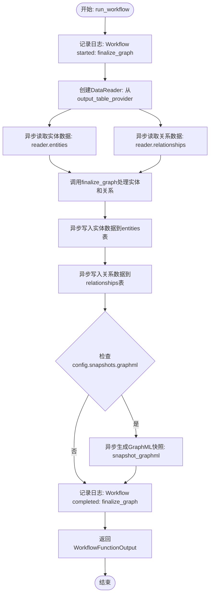
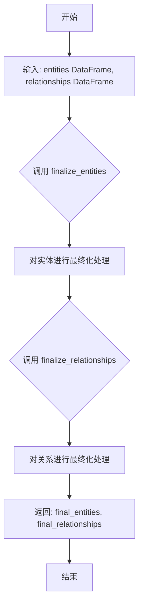
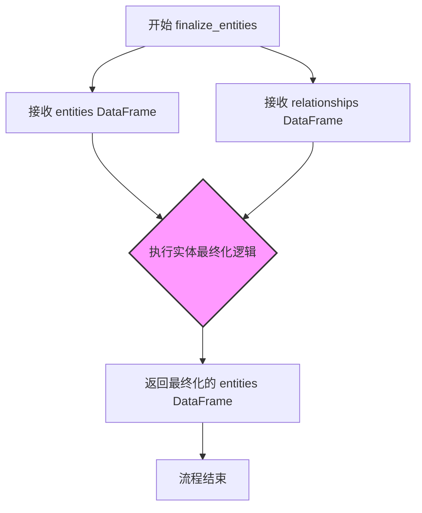
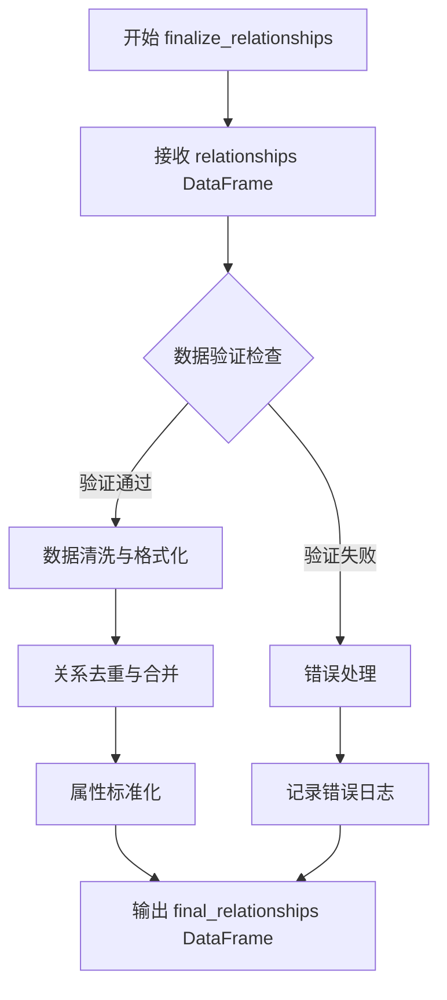
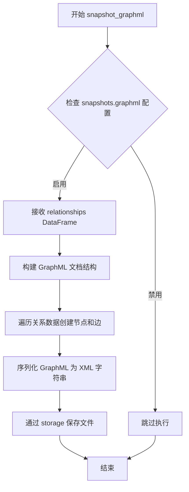
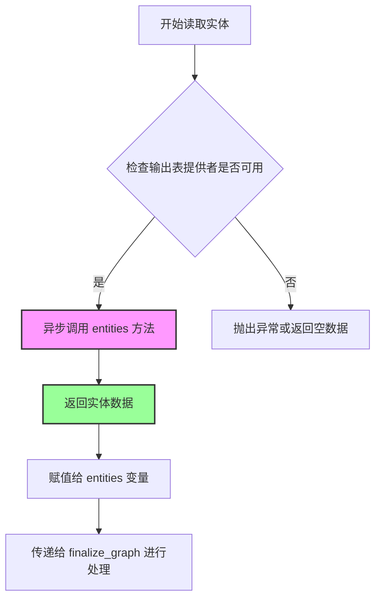
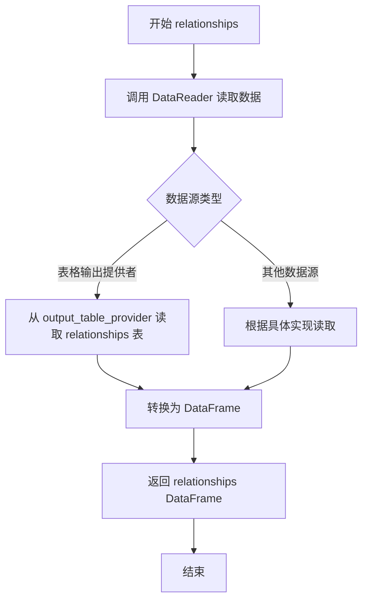

# `graphrag\packages\graphrag\graphrag\index\workflows\finalize_graph.py` 详细设计文档

这是一个图谱最终化工作流模块，通过DataReader读取实体和关系数据，调用finalize_entities和finalize_relationships进行格式最终化处理，然后将结果写入输出表，并在配置启用时生成GraphML快照文件。

## 整体流程

```mermaid
graph TD
A[开始: run_workflow] --> B[记录日志: Workflow started]
B --> C[创建DataReader实例]
C --> D[异步读取实体数据: reader.entities()]
D --> E[异步读取关系数据: reader.relationships()]
E --> F[调用finalize_graph处理数据]
F --> G[写入实体数据到输出表]
G --> H[写入关系数据到输出表]
H --> I{config.snapshots.graphml是否为True?}
I -- 是 --> J[生成GraphML快照]
I -- 否 --> K[跳过快照生成]
J --> L[记录日志: Workflow completed]
K --> L
L --> M[返回WorkflowFunctionOutput]
M --> N[结束]
```

## 类结构

```
工作流模块 (扁平化结构，无继承)
├── run_workflow (异步主函数)
└── finalize_graph (同步辅助函数)
```

## 全局变量及字段


### `logger`
    
日志记录器对象，用于记录工作流执行过程中的日志信息

类型：`logging.Logger`
    


### `GraphRagConfig.snapshots.graphml`
    
GraphML快照配置，控制是否生成GraphML格式的图快照

类型：`bool`
    


### `PipelineRunContext.output_table_provider`
    
输出表提供者，用于读取和写入表格数据

类型：`TableProvider`
    


### `PipelineRunContext.output_storage`
    
输出存储，用于持久化图数据

类型：`Storage`
    


### `WorkflowFunctionOutput.result`
    
包含实体和关系的结果字典

类型：`dict`
    
    

## 全局函数及方法


### `run_workflow`

异步主工作流函数，负责协调整个图谱最终化流程，包括读取实体和关系数据、最终化处理、数据写入输出存储，并可选地生成GraphML快照。

参数：

-  `config`：`GraphRagConfig`，全局配置对象，包含图谱工作流的各项配置参数（如快照设置等）
-  `context`：`PipelineRunContext`，管道运行上下文，提供对输出表提供者和存储的访问

返回值：`WorkflowFunctionOutput`，工作流函数输出对象，包含最终化后的实体和关系数据

#### 流程图



#### 带注释源码

```python
async def run_workflow(
    config: GraphRagConfig,
    context: PipelineRunContext,
) -> WorkflowFunctionOutput:
    """All the steps to create the base entity graph."""
    # 记录工作流开始日志
    logger.info("Workflow started: finalize_graph")
    
    # 创建数据读取器，用于从输出表提供者读取数据
    reader = DataReader(context.output_table_provider)
    
    # 异步读取实体和关系数据
    entities = await reader.entities()
    relationships = await reader.relationships()

    # 对实体和关系进行最终化处理
    final_entities, final_relationships = finalize_graph(
        entities,
        relationships,
    )

    # 将最终化的实体数据写入输出表的entities表
    await context.output_table_provider.write_dataframe("entities", final_entities)
    
    # 将最终化的关系数据写入输出表的relationships表
    await context.output_table_provider.write_dataframe(
        "relationships", final_relationships
    )

    # 如果配置中启用了GraphML快照，则生成GraphML文件
    if config.snapshots.graphml:
        await snapshot_graphml(
            final_relationships,
            name="graph",
            storage=context.output_storage,
        )

    # 记录工作流完成日志
    logger.info("Workflow completed: finalize_graph")
    
    # 返回工作流输出结果，包含实体和关系数据
    return WorkflowFunctionOutput(
        result={
            "entities": entities,
            "relationships": relationships,
        }
    )
```


### `finalize_graph`

封装实体和关系的最终化处理逻辑，同步函数，负责将实体和关系数据框进行最终的格式处理和优化。

参数：

-  `entities`：`pd.DataFrame`，输入的实体数据框，包含原始实体信息
-  `relationships`：`pd.DataFrame`，输入的关系数据框，包含原始关系信息

返回值：`tuple[pd.DataFrame, pd.DataFrame]`，返回最终处理后的实体数据框和关系数据框

#### 流程图



#### 带注释源码

```python
def finalize_graph(
    entities: pd.DataFrame,
    relationships: pd.DataFrame,
) -> tuple[pd.DataFrame, pd.DataFrame]:
    """All the steps to finalize the entity and relationship formats.
    
    负责完成实体和关系数据的最终处理：
    1. 调用 finalize_entities 处理实体数据
    2. 调用 finalize_relationships 处理关系数据
    3. 返回处理后的结果元组
    
    参数:
        entities: 包含原始实体信息的 pandas DataFrame
        relationships: 包含原始关系信息的 pandas DataFrame
    
    返回:
        包含最终处理后的实体和关系的元组
    """
    # 调用 finalize_entities 函数对实体数据进行最终化处理
    # 该函数会接收实体和关系作为输入，进行实体去重、格式化等操作
    final_entities = finalize_entities(entities, relationships)
    
    # 调用 finalize_relationships 函数对关系数据进行最终化处理
    # 该函数会进行关系去重、排序等操作
    final_relationships = finalize_relationships(relationships)
    
    # 返回最终处理后的实体和关系数据
    return (final_entities, final_relationships)
```


### `finalize_entities`

该函数是导入的实体最终化操作函数，用于对实体数据进行最终处理和格式化，接收实体数据框和关系数据框，处理后返回格式化后的实体数据框。

参数：

- `entities`：`pd.DataFrame`，包含待处理的实体数据
- `relationships`：`pd.DataFrame`，包含关系数据，用于实体最终化的参考

返回值：`pd.DataFrame`，返回经过最终化处理的实体数据

#### 流程图



#### 带注释源码

```python
# 从 graphrag.index.operations.finalize_entities 模块导入 finalize_entities 函数
# 该函数定义在 graphrag/index/operations/finalize_entities.py 文件中
from graphrag.index.operations.finalize_entities import finalize_entities

# 在 finalize_graph 函数中调用 finalize_entities
def finalize_graph(
    entities: pd.DataFrame,
    relationships: pd.DataFrame,
) -> tuple[pd.DataFrame, pd.DataFrame]:
    """All the steps to finalize the entity and relationship formats."""
    # 调用 finalize_entities 函数对实体进行最终化处理
    # 参数: entities - 实体数据框, relationships - 关系数据框
    # 返回值: final_entities - 经过最终化处理的实体数据框
    final_entities = finalize_entities(entities, relationships)
    final_relationships = finalize_relationships(relationships)
    return (final_entities, final_relationships)
```

> **注意**: 该函数的完整实现源码未在提供的代码片段中显示，仅包含导入语句和调用方式。该函数属于 `graphrag.index.operations` 模块，负责实体数据的最终格式化处理。


### `finalize_relationships`

该函数是关系数据最终化操作的核心函数，负责对导入的关系数据进行清洗、验证和格式化处理，最终输出符合图谱要求的标准关系数据。

参数：

- `relationships`：`pd.DataFrame`，输入的关系数据DataFrame，包含了从数据源读取的原始关系信息

返回值：`pd.DataFrame`，返回经过最终化处理后的关系数据DataFrame，数据格式已标准化并准备好用于后续的图谱构建流程

#### 流程图



#### 带注释源码

```
# 注意：源码未在当前代码片段中提供，以下为基于代码上下文的推断
# 实际实现位于 graphrag/index/operations/finalize_relationships.py

from graphrag.index.operations.finalize_relationships import finalize_relationships

# 在 finalize_graph 函数中的调用方式：
final_relationships = finalize_relationships(relationships)

# 函数签名（推断）：
def finalize_relationships(
    relationships: pd.DataFrame,
) -> pd.DataFrame:
    """All the steps to finalize the relationship formats.
    
    Args:
        relationships: The input relationships DataFrame containing raw relationship data
        
    Returns:
        The finalized relationships DataFrame with standardized format
    """
    # 具体实现逻辑需要查看源文件
    pass
```

---

**注意**：当前提供的代码片段仅包含 `finalize_relationships` 函数的导入语句和使用示例，未包含该函数的具体实现代码。该函数的完整实现位于 `graphrag/index/operations/finalize_relationships.py` 模块中。从代码上下文可以推断：

1. 该函数接受一个 pandas DataFrame 类型的 `relationships` 参数
2. 返回一个处理后的 pandas DataFrame
3. 在 `finalize_graph` 工作流中与 `finalize_entities` 配合使用，用于完成整个图谱数据的最终化处理


### `snapshot_graphml`

该函数是 GraphML 快照生成函数，负责将处理后的关系数据导出为 GraphML 格式文件，用于可视化和数据交换。

参数：

- `final_relationships`：`pd.DataFrame`，包含需要导出为 GraphML 格式的关系数据
- `name`：`str`，指定输出文件的名称（不含扩展名）
- `storage`：`StorageBase`，输出存储对象，用于持久化生成的 GraphML 文件

返回值：`None`，该函数为异步函数，通过 `await` 调用，执行副作用（写入文件）后返回

#### 流程图



#### 带注释源码

```python
# 从 graphrag.index.operations.snapshot_graphml 模块导入 snapshot_graphml 函数
from graphrag.index.operations.snapshot_graphml import snapshot_graphml

# 在 run_workflow 中的调用方式：
if config.snapshots.graphml:
    # 当配置启用 GraphML 快照时调用
    await snapshot_graphml(
        final_relationships,  # pd.DataFrame: 处理后的关系数据
        name="graph",          # str: 输出文件名（不含 .graphml 扩展名）
        storage=context.output_storage,  # StorageBase: 存储后端
    )
```

> **注意**：由于 `snapshot_graphml` 函数是从外部模块导入的，其完整实现源码未在此代码文件中提供。以上调用方式和参数信息是从当前代码的导入语句和调用上下文推断得出。


### DataReader.entities()

该方法是中国微软 graphrag 项目中 DataReader 类的实例方法，用于从图谱输出表提供者中异步读取实体数据，是构建实体关系图谱工作流的关键数据读取步骤。

参数：
- 该方法无显式参数（隐式参数为 self）

返回值：`Any`（根据代码推断为可 await 的异步对象，可能返回 DataFrame 或类似的 pandas 数据结构），返回从输出表提供者读取的原始实体数据，供后续流程进行最终化处理

#### 流程图



#### 带注释源码

```
# 方法调用位于 run_workflow 异步函数中
# 上下文：config: GraphRagConfig, context: PipelineRunContext

# 1. 创建 DataReader 实例，传入输出表提供者
reader = DataReader(context.output_table_provider)

# 2. 异步调用 entities() 方法读取实体数据
# 注意：实际 DataReader 类定义未在本文件中展示
entities = await reader.entities()

# 3. 读取完成后，entities 变量包含原始实体数据
# 后续将传递给 finalize_graph 进行格式最终化处理
```

> **说明**：由于提供的代码文件中未包含 `DataReader` 类的完整实现源码，以上源码为该方法在实际工作流中的调用方式展示。完整的 `DataReader.entities()` 方法定义需查看 `graphrag/data_model/data_reader.py` 文件。


### `DataReader.relationships()`

该方法用于从数据源读取关系（relationships）数据，并返回一个包含关系信息的 Pandas DataFrame 对象，供后续的图谱构建和优化步骤使用。

参数：

- 该方法无显式参数（隐式参数为 `self`）

返回值：`pd.DataFrame`，返回包含关系数据的 DataFrame 对象，其中每一行代表一条关系记录，列包含关系的属性信息（如源实体、目标实体、权重等）

#### 流程图



#### 带注释源码

```python
# 从 graphrag.data_model.data_reader 导入 DataReader 类
from graphrag.data_model.data_reader import DataReader

# 在 run_workflow 函数中创建 DataReader 实例
reader = DataReader(context.output_table_provider)

# 调用 relationships 方法异步读取关系数据
# 返回类型为 pd.DataFrame，包含所有关系记录
relationships = await reader.relationships()

# relationships 数据将传递给 finalize_graph 函数进行进一步处理
# finalize_graph 函数接收 entities 和 relationships 两个 DataFrame
# 返回处理后的 final_entities 和 final_relationships
final_entities, final_relationships = finalize_graph(
    entities,
    relationships,
)
```

> **注意**：由于提供的代码片段未包含 `DataReader` 类的完整定义，以上信息基于 `run_workflow` 函数中对 `relationships()` 方法的调用方式推断得出。具体实现细节建议查看 `graphrag/data_model/data_reader.py` 源文件。

## 关键组件


### run_workflow 异步函数

主工作流入口，协调整个实体图最终化流程，负责读取数据、处理实体关系、写入输出并生成可选的GraphML快照。

### finalize_graph 函数

将原始实体和关系数据框进行最终格式化处理，调用专门的最终化函数处理实体和关系的细节。

### DataReader 数据读取器

从输出表提供者读取实体和关系数据的读取器类，负责将存储的数据转换为DataFrame格式供后续处理使用。

### finalize_entities 实体最终化操作

对实体DataFrame进行最终处理，可能包括去重、格式化字段、合并信息等操作，返回标准化的实体数据。

### finalize_relationships 关系最终化操作

对关系DataFrame进行最终处理，可能包括去重、格式化字段、验证完整性等操作，返回标准化的关系数据。

### snapshot_graphml 图快照生成

当配置启用GraphML快照时，将最终化的关系数据导出为GraphML格式文件，用于可视化或其他用途。

### PipelineRunContext 管道运行上下文

提供工作流执行所需的环境信息，包括输出表提供者、输出存储等基础设施组件。

### GraphRagConfig 图谱RAG配置

包含系统配置信息，其中snapshots.graphml字段控制是否生成GraphML格式的图快照。


## 问题及建议


### 已知问题

-   **返回值数据不一致**：`run_workflow` 函数返回的 `result` 中使用的是原始的 `entities` 和 `relationships`，而非经过 `finalize_graph` 处理后的 `final_entities` 和 `final_relationships`，这可能导致调用方获取到非最终数据
-   **缺乏错误处理**：整个工作流没有任何 try-except 块，DataReader 的读取操作、write_dataframe 写入操作以及 snapshot_graphml 操作均可能抛出异常但未被捕获，容易导致工作流崩溃且难以追踪问题根源
-   **缺少输入验证**：未对从 DataReader 读取的 entities 和 relationships DataFrame 进行有效性检查（如空值、必需列是否存在等），下游的 finalize_entities 和 finalize_relationships 可能因数据问题失败
-   **日志信息不够详细**：仅记录工作流开始和完成，缺乏关键步骤（如读取完成、写入完成、快照生成）的日志，不利于问题排查和监控
-   **硬编码字符串**："entities" 和 "relationships" 作为表名在代码中硬编码，若需修改表名需要改动多处代码，缺乏统一配置管理

### 优化建议

-   **修正返回值**：将 `result` 中的返回数据改为 `final_entities` 和 `final_relationships`，确保调用方获取到的是经过最终处理的数据
-   **添加异常处理**：为各关键步骤添加 try-except 块，配合详细日志记录异常信息，提高工作流的健壮性和可调试性
-   **增加输入验证**：在处理前验证 DataFrame 的有效性（如检查是否为空、必需列是否存在），提前暴露数据问题
-   **丰富日志层次**：在读取、写入、快照生成等关键步骤添加 INFO 级别日志，记录数据量、执行状态等信息
-   **提取常量或配置**：将表名 "entities" 和 "relationships" 提取为常量或从配置中获取，提高代码可维护性
-   **考虑并行化**：读取和写入操作可以适当考虑并行化处理，提升性能表现

## 其它


### 设计目标与约束

本工作流的设计目标是将原始实体和关系数据转换为最终格式，并输出到指定的存储中。约束包括：1) 必须使用异步IO操作；2) 依赖GraphRagConfig配置对象控制行为；3) 输出格式必须符合DataFrame规范；4) GraphML快照功能为可选特性。

### 错误处理与异常设计

主要依赖底层组件的异常传播。DataReader读取失败会抛出异常；finalize_entities和finalize_relationships处理失败会向上传递；write_dataframe写入失败会触发异常；snapshot_graphml的异常会被捕获但不阻断主流程。所有异常通过Python内置异常机制传播，调用方负责处理。

### 数据流与状态机

数据流为：读取原始实体/关系DataFrame → finalize_graph进行格式最终化 → 写入输出表 → (可选)生成GraphML快照 → 返回结果。工作流为线性状态机，状态包括：初始化 → 数据读取 → 数据处理 → 数据写入 → 快照(可选) → 完成。

### 外部依赖与接口契约

依赖GraphRagConfig配置对象（包含snapshots.graphml开关）；依赖PipelineRunContext提供output_table_provider和output_storage；依赖DataReader读取entities和relationships；依赖finalize_entities、finalize_relationships、snapshot_graphml三个处理函数。输出契约为WorkflowFunctionOutput类型，包含entities和relationships的DataFrame。

### 并发与异步处理

run_workflow为async函数，支持并发执行。DataReader的entities()和relationships()为异步方法可并行调用；write_dataframe调用为异步但串行执行；snapshot_graphml为异步调用。finalize_graph为同步函数，在异步上下文中同步执行。

### 配置说明

通过GraphRagConfig.snapshots.graphml布尔值控制是否生成GraphML快照文件。该配置影响工作流的执行分支，但不改变核心数据处理逻辑。

### 日志记录

使用Python标准logging模块，记录工作流开始和完成的INFO级别日志。日志内容包含工作流名称"finalize_graph"，用于追踪执行状态。

### 关键模块输入输出

输入：config(GraphRagConfig)、context(PipelineRunContext)；输出：WorkflowFunctionOutput(result: dict，包含entities和relationships键)。

    