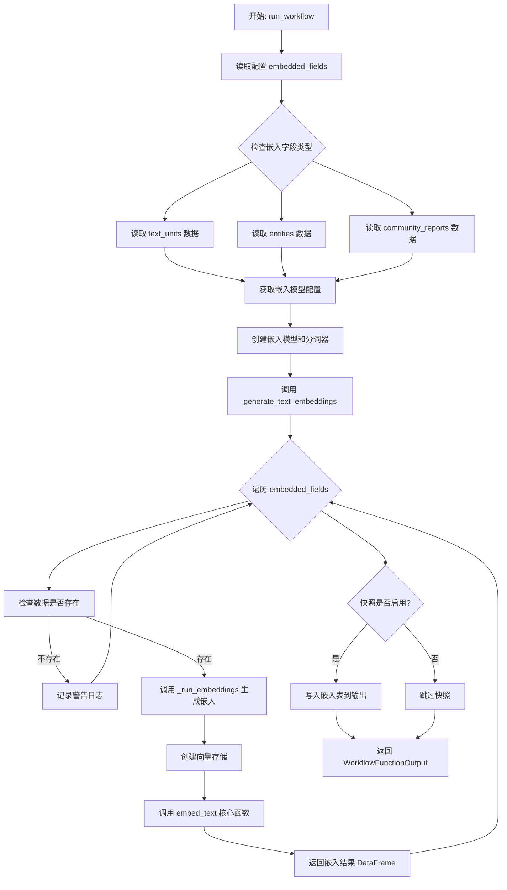
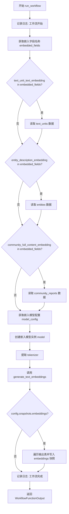
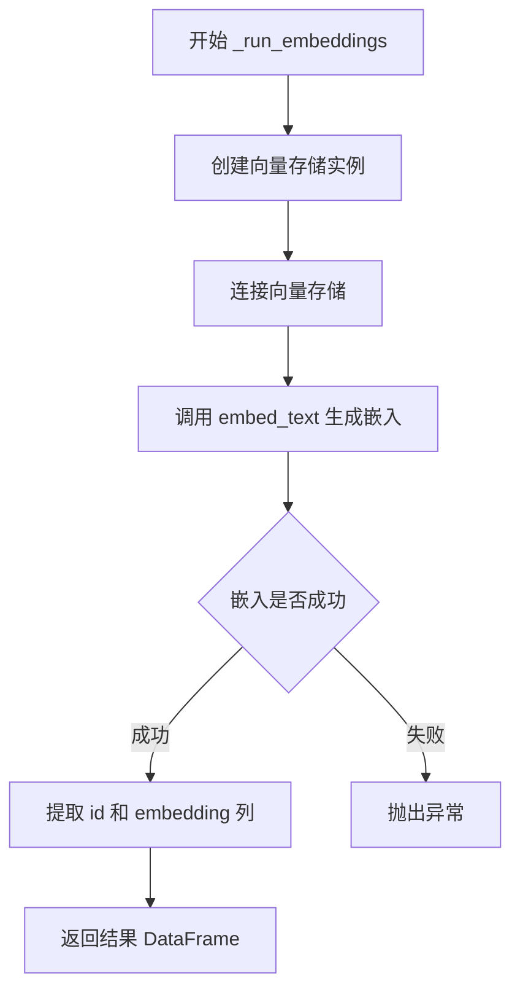

# `graphrag\packages\graphrag\graphrag\index\workflows\generate_text_embeddings.py` 详细设计文档

该模块是GraphRAG系统的文本嵌入工作流核心组件，负责将文本单元(entity)、实体描述和社区报告转换为向量形式存储。它通过配置读取待嵌入数据源，创建嵌入模型，并行生成向量，最后写入向量存储库。

## 整体流程



## 类结构

```
模块: generate_text_embeddings (无类定义)
├── run_workflow (顶层异步入口函数)
├── generate_text_embeddings (嵌入生成主逻辑)
└── _run_embeddings (单个字段嵌入生成私有函数)
```

## 全局变量及字段


### `logger`
    
模块级日志记录器，用于记录工作流运行日志

类型：`logging.Logger`
    


### `embedded_fields`
    
待嵌入字段名列表，从配置中获取需要处理的字段

类型：`list[str]`
    


### `reader`
    
数据读取器实例，用于读取文本单元、实体和社区报告数据

类型：`DataReader`
    


### `text_units`
    
文本单元数据，包含待嵌入的文本内容

类型：`pd.DataFrame | None`
    


### `entities`
    
实体数据，包含实体的标题和描述信息

类型：`pd.DataFrame | None`
    


### `community_reports`
    
社区报告数据，包含社区的完整内容

类型：`pd.DataFrame | None`
    


### `model_config`
    
嵌入模型配置对象，从配置中获取模型参数

类型：`Any`
    


### `model`
    
嵌入模型实例，用于生成文本向量表示

类型：`LLMEmbedding`
    


### `tokenizer`
    
分词器实例，用于文本分词处理

类型：`Tokenizer`
    


### `output`
    
嵌入输出结果，键为字段名，值为包含id和embedding的DataFrame

类型：`dict[str, pd.DataFrame]`
    


### `embedding_param_map`
    
嵌入参数映射字典，存储各字段对应的数据和嵌入列信息

类型：`dict`
    


### `field`
    
当前处理的嵌入字段名

类型：`str`
    


### `vector_store`
    
向量存储实例，用于持久化嵌入向量

类型：`VectorStore`
    


### `data`
    
待嵌入的DataFrame，包含原始数据

类型：`pd.DataFrame`
    


    

## 全局函数及方法


### `run_workflow`

异步主工作流函数，协调整个嵌入流程。该函数根据配置读取文本单元、实体和社区报告数据，使用指定的嵌入模型生成文本嵌入，并可选地将嵌入结果写入输出表。

参数：

- `config`：`GraphRagConfig`，全局配置对象，包含嵌入模型、批处理、向量存储等配置信息
- `context`：`PipelineRunContext`，管道运行上下文，提供缓存、回调、输出表提供器等运行时环境

返回值：`WorkflowFunctionOutput`，包含嵌入结果字典的工作流函数输出

#### 流程图



#### 带注释源码

```python
async def run_workflow(
    config: GraphRagConfig,
    context: PipelineRunContext,
) -> WorkflowFunctionOutput:
    """All the steps to transform community reports."""
    # 记录工作流开始日志
    logger.info("Workflow started: generate_text_embeddings")
    
    # 从配置中获取需要嵌入的字段名称列表
    embedded_fields = config.embed_text.names
    logger.info("Embedding the following fields: %s", embedded_fields)
    
    # 创建数据读取器，用于从输出表提供者读取数据
    reader = DataReader(context.output_table_provider)
    
    # 初始化可能需要的数据变量
    text_units = None
    entities = None
    community_reports = None
    
    # 根据配置的嵌入字段，条件性地读取相应的数据表
    # 只有当某个嵌入字段被配置时，才读取对应的数据
    if text_unit_text_embedding in embedded_fields:
        text_units = await reader.text_units()
    if entity_description_embedding in embedded_fields:
        entities = await reader.entities()
    if community_full_content_embedding in embedded_fields:
        community_reports = await reader.community_reports()

    # 获取嵌入模型的配置信息
    model_config = config.get_embedding_model_config(
        config.embed_text.embedding_model_id
    )

    # 创建嵌入模型实例，传入配置、缓存和缓存键创建器
    model = create_embedding(
        model_config,
        cache=context.cache.child(config.embed_text.model_instance_name),
        cache_key_creator=cache_key_creator,
    )

    # 从模型中提取分词器
    tokenizer = model.tokenizer

    # 调用核心嵌入生成函数，处理所有数据并生成嵌入向量
    output = await generate_text_embeddings(
        text_units=text_units,
        entities=entities,
        community_reports=community_reports,
        callbacks=context.callbacks,
        model=model,
        tokenizer=tokenizer,
        batch_size=config.embed_text.batch_size,
        batch_max_tokens=config.embed_text.batch_max_tokens,
        num_threads=config.concurrent_requests,
        vector_store_config=config.vector_store,
        embedded_fields=embedded_fields,
    )

    # 如果配置了嵌入快照，则将嵌入结果写入输出表
    if config.snapshots.embeddings:
        for name, table in output.items():
            await context.output_table_provider.write_dataframe(
                f"embeddings.{name}",
                table,
            )

    # 记录工作流完成日志并返回结果
    logger.info("Workflow completed: generate_text_embeddings")
    return WorkflowFunctionOutput(result=output)
```


### `generate_text_embeddings`

该函数是嵌入工作流的核心入口，负责解析配置并分发嵌入任务。它接收文本单元、实体和社区报告数据，根据配置的嵌入字段列表（embedded_fields）循环调用内部方法 `_run_embeddings` 为每个字段生成向量嵌入，最终返回以嵌入字段名为键、包含 id 和 embedding 列的 DataFrame 为值的字典。

参数：

- `text_units`：`pd.DataFrame | None`，包含待嵌入文本单元的数据框，需具备 id 和 text 列
- `entities`：`pd.DataFrame | None`，包含待嵌入实体的数据框，需具备 id、title 和 description 列
- `community_reports`：`pd.DataFrame | None`，包含待嵌入社区报告的数据框，需具备 id 和 full_content 列
- `callbacks`：`WorkflowCallbacks`，工作流回调接口，用于嵌入过程中的事件通知
- `model`：`LLMEmbedding`，嵌入模型实例，负责实际生成向量表示
- `tokenizer`：`Tokenizer`，分词器实例，用于对文本进行分词处理以控制 token 数量
- `batch_size`：`int`，批处理大小，控制每次请求处理的文档数量
- `batch_max_tokens`：`int`，批处理最大 token 数，控制每批次的最大 token 限制
- `num_threads`：`int`，并发线程数，用于控制并发嵌入请求的数量
- `vector_store_config`：`VectorStoreConfig`，向量存储配置，包含索引模式和连接信息
- `embedded_fields`：`list[str]`，嵌入字段名称列表，指定需要对哪些字段进行嵌入

返回值：`dict[str, pd.DataFrame]`，返回字典对象，键为嵌入字段名称，值为包含 id 和 embedding 列的 DataFrame

#### 流程图

```mermaid
flowchart TD
    A[开始 generate_text_embeddings] --> B[构建 embedding_param_map]
    B --> C{遍历 embedded_fields}
    C -->|字段存在数据| D[调用 _run_embeddings 生成嵌入]
    C -->|字段数据为空| E[记录警告日志并跳过]
    D --> F[将结果存入 outputs 字典]
    E --> F
    F --> C
    C --> G[返回 outputs 字典]
    G --> H[结束]
    
    subgraph embedding_param_map 构建
    I1[text_unit_text_embedding: data=text_units['id','text']] 
    I2[entity_description_embedding: data=entities['id','title','description']]
    I3[community_full_content_embedding: data=community_reports['id','full_content']]
    end
    
    subgraph _run_embeddings 内部流程
    J1[创建向量存储实例]
    J2[连接向量存储]
    J3[调用 embed_text 生成 embedding]
    J4[返回 id 和 embedding 列]
    end
    
    D -.-> J1
    J1 --> J2
    J2 --> J3
    J3 --> J4
    J4 --> F
```

#### 带注释源码

```python
async def generate_text_embeddings(
    text_units: pd.DataFrame | None,           # 文本单元数据，可为 None
    entities: pd.DataFrame | None,             # 实体数据，可为 None
    community_reports: pd.DataFrame | None,    # 社区报告数据，可为 None
    callbacks: WorkflowCallbacks,              # 工作流回调接口
    model: "LLMEmbedding",                     # 嵌入模型实例
    tokenizer: Tokenizer,                       # 分词器实例
    batch_size: int,                           # 批处理大小
    batch_max_tokens: int,                     # 批处理最大 token 数
    num_threads: int,                          # 并发线程数
    vector_store_config: VectorStoreConfig,    # 向量存储配置
    embedded_fields: list[str],                # 需要嵌入的字段列表
) -> dict[str, pd.DataFrame]:
    """All the steps to generate all embeddings."""
    
    # 构建嵌入参数字典，映射每个嵌入字段到对应的数据和嵌入列
    # text_unit_text_embedding: 使用 text 列进行嵌入
    # entity_description_embedding: 合并 title 和 description 为 title_description 后嵌入
    # community_full_content_embedding: 使用 full_content 列进行嵌入
    embedding_param_map = {
        text_unit_text_embedding: {
            "data": text_units.loc[:, ["id", "text"]].fillna("")
            if text_units is not None
            else None,
            "embed_column": "text",
        },
        entity_description_embedding: {
            "data": entities
            .loc[:, ["id", "title", "description"]]
            .fillna("")
            .assign(title_description=lambda df: df["title"] + ":" + df["description"])
            if entities is not None
            else None,
            "embed_column": "title_description",
        },
        community_full_content_embedding: {
            "data": community_reports.loc[:, ["id", "full_content"]].fillna("")
            if community_reports is not None
            else None,
            "embed_column": "full_content",
        },
    }

    logger.info("Creating embeddings")
    outputs = {}
    
    # 遍历每个需要嵌入的字段
    for field in embedded_fields:
        # 检查数据是否存在，若不存在则记录警告日志
        if embedding_param_map[field]["data"] is None:
            msg = f"Embedding {field} is specified but data table is not in storage. This may or may not be intentional - if you expect it to me here, please check for errors earlier in the logs."
            logger.warning(msg)
        else:
            # 调用内部方法 _run_embeddings 生成单个字段的嵌入
            outputs[field] = await _run_embeddings(
                name=field,
                callbacks=callbacks,
                model=model,
                tokenizer=tokenizer,
                vector_store_config=vector_store_config,
                batch_size=batch_size,
                batch_max_tokens=batch_max_tokens,
                num_threads=num_threads,
                **embedding_param_map[field],  # 展开 data 和 embed_column
            )
    return outputs
```


### `_run_embeddings`

执行单个字段的嵌入生成和向量存储写入。该函数接收待嵌入的数据框、指定嵌入列、分词器、模型等参数，通过调用 `embed_text` 函数生成文本嵌入，并将结果写入向量存储，最后返回包含 id 和 embedding 列的数据框。

参数：

- `name`：`str`，嵌入字段的名称，用于标识和日志记录
- `data`：`pd.DataFrame`，包含待嵌入文本数据的数据框，必须包含 id 列和嵌入列
- `embed_column`：`str`，要嵌入的列名，指定数据框中哪一列的文本需要被嵌入
- `callbacks`：`WorkflowCallbacks`，工作流回调接口，用于嵌入过程中的事件通知
- `model`：`LLMEmbedding`，嵌入模型实例，负责生成文本向量表示
- `tokenizer`：`Tokenizer`，分词器实例，用于对文本进行分词处理
- `batch_size`：`int`，批处理大小，控制每次处理的数据条数
- `batch_max_tokens`：`int`，每批最大 token 数，控制每批次的 token 数量上限
- `num_threads`：`int`，并发线程数，控制嵌入计算的并行度
- `vector_store_config`：`VectorStoreConfig`，向量存储配置，包含存储后端和索引模式信息

返回值：`pd.DataFrame`，返回一个只包含 id 和 embedding 两列的数据框，其中 embedding 列存储生成的向量数据

#### 流程图



#### 带注释源码

```python
async def _run_embeddings(
    name: str,                              # 嵌入字段名称，用于日志和配置
    data: pd.DataFrame,                     # 待嵌入的数据框
    embed_column: str,                      # 需要嵌入的列名
    callbacks: WorkflowCallbacks,           # 工作流回调接口
    model: "LLMEmbedding",                  # LLM嵌入模型
    tokenizer: Tokenizer,                   # 分词器
    batch_size: int,                        # 批处理大小
    batch_max_tokens: int,                  # 每批最大token数
    num_threads: int,                       # 并发线程数
    vector_store_config: VectorStoreConfig # 向量存储配置
) -> pd.DataFrame:
    """All the steps to generate single embedding."""
    # 根据配置和索引模式创建向量存储实例
    vector_store = create_vector_store(
        vector_store_config, vector_store_config.index_schema[name]
    )
    # 建立与向量存储的连接
    vector_store.connect()

    # 调用 embed_text 函数生成文本嵌入
    # 嵌入结果直接添加到 data 数据框的 embedding 列中
    data["embedding"] = await embed_text(
        input=data,                         # 输入数据框
        callbacks=callbacks,                # 回调接口
        model=model,                        # 嵌入模型
        tokenizer=tokenizer,                # 分词器
        embed_column=embed_column,          # 嵌入列名
        batch_size=batch_size,              # 批大小
        batch_max_tokens=batch_max_tokens,  # 批最大token数
        num_threads=num_threads,            # 并发线程数
        vector_store=vector_store,          # 向量存储实例
    )

    # 返回只包含 id 和 embedding 列的数据框
    # 使用 loc 进行列筛选，确保返回干净的输出格式
    return data.loc[:, ["id", "embedding"]]
```

## 关键组件


### 张量索引与惰性加载

代码使用条件检查 `if text_unit_text_embedding in embedded_fields` 来实现惰性加载，只有当特定字段被配置为需要嵌入时才从数据源读取相应的数据表（text_units、entities、community_reports），避免不必要的I/O操作。

### 向量存储配置与创建

使用 `VectorStoreConfig` 配置向量存储，通过 `create_vector_store` 工厂函数根据索引模式（index_schema）动态创建不同类型的向量存储，并在 `_run_embeddings` 中通过 `connect()` 方法建立连接。

### 嵌入参数字段映射

`embedding_param_map` 字典将三种嵌入类型（text_unit、entity、community_report）映射到对应的数据列和嵌入列，动态处理不同数据源的列选择和数据预处理（如填充空值、合并title和description）。

### 批量嵌入处理

通过 `batch_size` 和 `batch_max_tokens` 参数控制嵌入处理的批量大小和每批最大token数，使用 `num_threads` 控制并发请求数，实现高效的批量嵌入生成。

### 数据快照输出

当 `config.snapshots.embeddings` 启用时，将生成的嵌入结果以DataFrame形式写入输出表，提供嵌入结果的持久化和可追溯性。

### 统一嵌入接口

`_run_embeddings` 函数封装了单个字段的完整嵌入流程，包括向量存储创建、嵌入生成和结果返回，提供统一的嵌入处理接口。


## 问题及建议


### 已知问题

-   **硬编码的嵌入字段映射**：embedding_param_map 在 generate_text_embeddings 中硬编码了三种嵌入类型的处理逻辑，新增嵌入类型需修改函数内部代码，违反开闭原则
-   **向量存储重复创建**：_run_embeddings 在循环内每次都调用 create_vector_store 创建新的向量存储实例，导致频繁的连接创建和销毁
-   **数据处理逻辑分散**：数据填充（fillna）和列拼接逻辑嵌套在字典定义中，可读性和可维护性较差
- **缺少输入数据验证**：读取 text_units、entities、community_reports 后未进行类型和完整性校验，直接传递可能导致隐藏错误
- **日志级别使用不当**：使用 logger.warning 记录配置错误，但在某些分支数据为 None 时继续执行，可能导致后续难以追踪的问题
- **变量初始化冗余**：text_units、entities、community_reports 初始化为 None 后在 if 块中重新赋值，逻辑可简化

### 优化建议

-   **提取配置驱动逻辑**：将 embedding_param_map 的构建逻辑抽象为独立函数或配置类，支持动态扩展嵌入类型
-   **优化向量存储生命周期**：在 generate_text_embeddings 中预先创建向量存储实例并复用，或实现连接池机制
-   **统一数据预处理**：创建专门的数据预处理函数处理 fillna、列选择等操作，提高可读性
-   **增强错误处理**：在数据读取后添加显式校验，明确区分"预期空"和"意外空"两种情况
-   **分离关注点**：将 run_workflow 中的数据读取、模型创建、嵌入生成等步骤拆分为独立函数，提升测试友好性

## 其它


### 设计目标与约束

本工作流的设计目标是为 GraphRAG 系统提供统一的文本嵌入生成能力，支持对文本单元（text_units）、实体（entities）和社区报告（community_reports）进行向量化处理。约束条件包括：1）必须使用配置的嵌入模型进行向量化；2）嵌入操作需要支持批处理以优化性能；3）结果需要持久化到向量存储中。

### 错误处理与异常设计

工作流中包含两处关键错误处理：1）在 `generate_text_embeddings` 中，当指定嵌入字段但对应数据表为空时，记录警告日志而非抛出异常，允许流程继续执行；2）向量化存储连接失败时，由 `create_vector_store` 内部处理并向上传播异常。

### 数据流与状态机

数据流经过以下阶段：读取阶段（从 DataReader 获取 DataFrame）→ 预处理阶段（填充空值、合并字段）→ 嵌入阶段（调用 embed_text 生成向量）→ 存储阶段（写入向量存储）→ 输出阶段（返回结果字典）。状态转换由配置中的 embedded_fields 列表驱动。

### 外部依赖与接口契约

主要依赖包括：GraphRagConfig（配置对象）、PipelineRunContext（运行时上下文，提供缓存、回调、输出表提供器）、DataReader（数据读取接口）、LLMEmbedding（嵌入模型接口）、VectorStoreConfig（向量存储配置）、WorkflowCallbacks（工作流回调接口）。

### 输入输出规范

输入：config（GraphRagConfig）、context（PipelineRunContext）。输出：WorkflowFunctionOutput，包含 result 字段，类型为 dict[str, pd.DataFrame]，键为嵌入字段名，值为包含 id 和 embedding 列的 DataFrame。可选输出：当 snapshots.embeddings 启用时，额外写入 embeddings.{name} 表。

### 配置参数详解

关键配置参数包括：embed_text.names（需要嵌入的字段列表）、embed_text.embedding_model_id（嵌入模型标识）、embed_text.batch_size（批处理大小）、embed_text.batch_max_tokens（批处理最大 token 数）、embed_text.model_instance_name（模型实例名称）、vector_store（向量存储配置）、concurrent_requests（并发请求数）、snapshots.embeddings（是否保存嵌入快照）。

### 日志与监控

使用标准 Python logging 模块，logger 名称为 `graphrag.index.workflows.embed_text.run_workflow`。记录两条关键日志：工作流启动时记录嵌入字段列表；工作流完成后记录完成状态。

### 性能优化考量

代码支持两项性能优化：1）batch_size 和 batch_max_tokens 参数控制嵌入批处理粒度；2）num_threads 参数控制并发请求数。潜在优化空间：可以添加嵌入缓存机制避免重复计算当前未实现。

### 安全性与权限

嵌入模型创建时使用缓存，缓存键由 cache_key_creator 生成。需要确保缓存目录访问权限正确。向量存储连接需要有效的 index_schema 配置。

### 版本兼容性说明

代码依赖以下关键版本：Python 3.10+（支持类型联合语法）、pandas（数据处理）、graphrag_llm（嵌入接口）、graphrag_vectors（向量存储）。向后兼容性由各依赖包版本策略决定。

### 测试策略建议

建议测试场景包括：1）正常流程：三种数据表都存在时正确生成嵌入；2）边界情况：部分数据表缺失时仅处理存在的表；3）异常情况：向量存储连接失败时的错误传播；4）性能测试：大批量数据下的批处理效率。


    