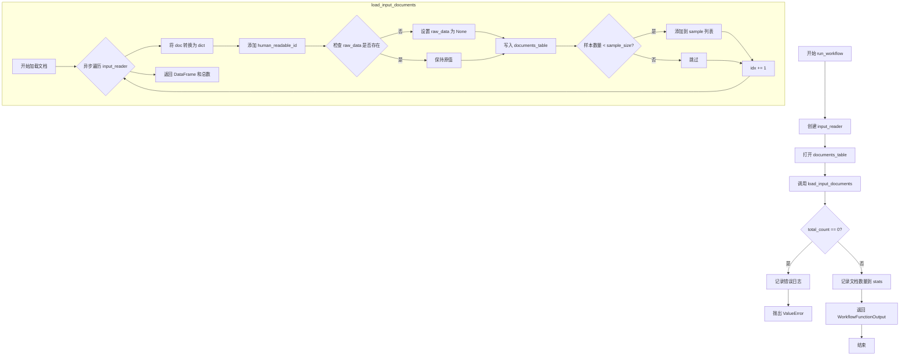
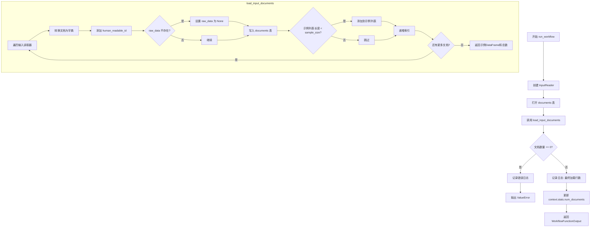

# `graphrag\packages\graphrag\graphrag\index\workflows\load_input_documents.py` 详细设计文档

这是一个工作流模块，用于从输入源加载和解析文档，将其转换为标准格式并写入文档表中，同时返回样本数据用于后续处理。

## 整体流程



## 类结构

```
graphrag_input.workflow (模块)
└── run_workflow (主函数)
└── load_input_documents (辅助函数)
```

## 全局变量及字段


### `logger`
    
模块级日志记录器，用于记录工作流执行过程中的日志信息

类型：`logging.Logger`
    


    

## 全局函数及方法


### `run_workflow`

异步主工作流函数，用于加载并解析输入文档为标准格式。该函数创建输入读取器，打开输出文档表，调用文档加载函数处理输入文档，验证文档数量，并返回包含示例数据的WorkflowFunctionOutput对象。

参数：

- `config`：`GraphRagConfig`，图谱RAG配置对象，包含输入配置和其他相关配置
- `context`：`PipelineRunContext`，管道运行上下文，提供输入存储、输出表提供器和统计信息等

返回值：`WorkflowFunctionOutput`，工作流函数输出对象，包含result属性（示例DataFrame）

#### 流程图



#### 带注释源码

```python
async def run_workflow(
    config: GraphRagConfig,
    context: PipelineRunContext,
) -> WorkflowFunctionOutput:
    """Load and parse input documents into a standard format."""
    # 根据配置和输入存储创建输入读取器
    input_reader = create_input_reader(config.input, context.input_storage)

    # 异步打开输出文档表
    async with (
        context.output_table_provider.open("documents") as documents_table,
    ):
        # 加载输入文档，返回示例数据和总文档数
        sample, total_count = await load_input_documents(input_reader, documents_table)

        # 检查是否成功读取到文档
        if total_count == 0:
            msg = "Error reading documents, please see logs."
            logger.error(msg)
            raise ValueError(msg)

        # 记录最终加载的行数
        logger.info("Final # of rows loaded: %s", total_count)
        # 更新上下文中的文档统计信息
        context.stats.num_documents = total_count

    # 返回工作流函数输出，包含示例数据
    return WorkflowFunctionOutput(result=sample)


async def load_input_documents(
    input_reader: InputReader, documents_table: Table, sample_size: int = 5
) -> tuple[pd.DataFrame, int]:
    """Load and parse input documents into a standard format."""
    sample: list[dict] = []  # 存储示例文档
    idx = 0  # 文档索引计数器

    # 异步遍历输入读取器中的每个文档
    async for doc in input_reader:
        # 将文档对象转换为字典
        row = asdict(doc)
        # 添加人类可读的ID
        row["human_readable_id"] = idx
        # 如果没有原始数据字段，则设置为None
        if "raw_data" not in row:
            row["raw_data"] = None
        # 将文档行写入输出表
        await documents_table.write(row)
        # 如果示例列表未满，添加到示例中
        if len(sample) < sample_size:
            sample.append(row)
        # 递增索引
        idx += 1

    # 返回示例DataFrame和总文档数
    return pd.DataFrame(sample), idx
```


### `load_input_documents`

这是一个异步辅助函数，用于从输入读取器异步加载文档，将每个文档转换为字典格式并添加人类可读的 ID，然后写入到文档表格中，同时收集指定数量的样本数据用于返回。

参数：

- `input_reader`：`InputReader`，输入读取器实例，用于异步迭代读取输入文档
- `documents_table`：`Table`，文档表格实例，用于写入加载的文档数据
- `sample_size`：`int`，可选参数，默认为 5，要返回的样本文档数量

返回值：`tuple[pd.DataFrame, int]`，包含一个样本 DataFrame（包含最多 sample_size 个文档行）和已加载的文档总数

#### 流程图

```mermaid
flowchart TD
    A[开始 load_input_documents] --> B[初始化空样本列表 sample, idx = 0]
    B --> C[异步迭代 input_reader 中的文档]
    C --> D{是否还有文档}
    D -->|是| E[将当前文档转换为字典 row = asdict(doc)]
    E --> F[添加 human_readable_id = idx]
    F --> G{row 中是否存在 raw_data 字段}
    G -->|否| H[设置 row['raw_data'] = None]
    G -->|是| I[保持 raw_data 不变]
    H --> J[将 row 写入 documents_table]
    I --> J
    J --> K{len(sample) < sample_size}
    K -->|是| L[将当前 row 添加到 sample 列表]
    K -->|否| M[跳过添加样本]
    L --> N[idx += 1]
    M --> N
    N --> C
    D -->|否| O[返回 pd.DataFrame(sample), idx]
    O --> P[结束]
```

#### 带注释源码

```python
async def load_input_documents(
    input_reader: InputReader, documents_table: Table, sample_size: int = 5
) -> tuple[pd.DataFrame, int]:
    """Load and parse input documents into a standard format.
    
    从输入读取器异步加载文档，将文档写入表格，并返回样本数据。
    
    Args:
        input_reader: 输入读取器，用于迭代读取输入文档
        documents_table: 文档表格，用于存储加载的文档
        sample_size: 要返回的样本数量，默认为 5
    
    Returns:
        包含样本 DataFrame 和文档总数的元组
    """
    # 初始化样本列表，用于存储返回的样本数据
    sample: list[dict] = []
    # 文档计数器，用于生成 human_readable_id
    idx = 0

    # 异步迭代输入读取器中的每个文档
    async for doc in input_reader:
        # 将文档数据类转换为字典格式
        row = asdict(doc)
        # 添加人类可读的文档 ID
        row["human_readable_id"] = idx
        # 如果文档中没有 raw_data 字段，则设置为 None
        if "raw_data" not in row:
            row["raw_data"] = None
        # 将文档行异步写入文档表格
        await documents_table.write(row)
        # 如果样本列表未满，则添加当前行到样本中
        if len(sample) < sample_size:
            sample.append(row)
        # 文档计数加 1
        idx += 1

    # 返回样本 DataFrame 和总文档数
    return pd.DataFrame(sample), idx
```

## 关键组件


### run_workflow

异步工作流入口函数，负责初始化输入读取器、打开输出文档表、加载输入文档并返回示例数据，同时记录文档总数到上下文统计中。

### load_input_documents

核心文档加载函数，通过异步迭代器逐个读取输入文档，将每条文档转换为字典格式并添加可读ID和原始数据字段，然后写入表格存储，最后返回示例数据帧和文档总数。

### InputReader

输入文档读取器接口，负责从配置指定的数据源读取原始文档数据，支持异步迭代访问。

### Table

表格存储接口，提供异步的open和write方法，用于持久化文档数据到存储后端。

### PipelineRunContext

管道运行上下文对象，包含输入存储、输出表提供者、统计信息等运行时环境信息。

### WorkflowFunctionOutput

工作流函数输出数据结构，用于封装工作流执行结果，包含result字段。

### GraphRagConfig

图谱RAG配置模型，定义输入、存储等模块的配置参数。


## 问题及建议


### 已知问题

-   **资源泄漏风险**：未显式关闭 `input_reader`，虽然使用了 `async with`，但文档读取器本身可能需要显式释放资源
-   **批量写入缺失**：循环中逐条 `await documents_table.write(row)`，在文档数量较大时性能低下，应改为批量写入
-   **样本代表性不足**：`sample_size=5` 硬编码为固定值，且仅取前5条记录，无法代表完整数据集的分布
-   **错误处理不完善**：如果 `documents_table.write` 失败，已写入的数据无法回滚，可能导致数据不一致
-   **类型注解缺失**：`documents_table.write()` 方法缺少返回类型注解，影响代码可维护性
-   **重复字典操作**：`asdict(doc)` 在每次迭代中创建新字典，随后又手动添加字段，可考虑优化字典构造方式

### 优化建议

-   实现批量写入机制（如使用 `documents_table.write_many` 或累积后统一提交），减少 I/O 次数
-   支持配置化的样本大小，并通过随机采样或分层采样提高样本代表性
-   添加事务支持或写入前的数据验证，确保写入失败时能够回滚或重试
-   为关键方法补充完整的类型注解，提升代码可读性和 IDE 支持
-   使用 `contextlib.asynccontextmanager` 或显式的资源管理确保所有资源正确释放
-   考虑在写入前进行数据校验，避免无效数据进入存储层

## 其它


### 设计目标与约束

本模块的核心设计目标是将各种格式的输入文档解析并加载为统一的表格格式，支持批量文档处理并提供样本预览功能。设计约束包括：1）必须使用异步IO以支持大规模文档处理；2）所有文档必须包含human_readable_id字段；3）raw_data字段可选但需要统一处理；4）sample_size默认为5用于调试和预览。

### 错误处理与异常设计

代码中包含以下错误处理机制：当total_count为0时，记录错误日志并抛出ValueError异常，错误信息为"Error reading documents, please see logs."。InputReader的迭代过程中可能存在文件读取异常，由调用方处理。Table写入失败时异常会向上传播。日志记录使用logging模块，区分info级别（加载完成）和error级别（加载失败）。

### 数据流与状态机

数据流如下：1) create_input_reader创建输入读取器；2) 打开documents_table输出表；3) 异步迭代input_reader获取每个文档；4) 将文档转换为字典格式并添加human_readable_id；5) 处理raw_data字段（不存在时设为None）；6) 写入documents_table；7) 维护sample列表直到达到sample_size；8) 返回样本DataFrame和总计数idx。状态机包含：初始化 -> 读取中 -> 写入中 -> 完成 四个状态。

### 外部依赖与接口契约

主要外部依赖包括：1) graphrag_input.InputReader - 输入文档读取接口；2) graphrag_storage.tables.Table - 文档表存储接口；3) graphrag.config.models.GraphRagConfig - 配置模型；4) graphrag.index.typing.PipelineRunContext - 管道运行上下文；5) pandas.DataFrame - 数据结构。InputReader需实现__aiter__协议返回可迭代对象，每个元素需支持asdict()转换。Table需支持async上下文管理器open和write方法。

### 并发模型与异步设计

采用asyncio异步编程模型，使用async/await语法。并发点包括：1) 异步迭代InputReader（async for）；2) 异步写入Table（await documents_table.write）。load_input_documents函数设计为协程，可并发调用处理不同批次的文档。context.output_table_provider需支持异步上下文管理器。

### 配置说明

config参数为GraphRagConfig类型，包含input配置项用于创建InputReader。sample_size参数在load_input_documents函数中默认为5，可在调用时覆盖。context.input_storage和context.output_table_provider由框架注入，分别提供输入存储和输出表提供者的访问能力。

### 性能考虑与优化建议

当前实现逐条写入文档，可考虑批量写入优化。sample列表在内存中累积，大规模文档场景需考虑流式处理或限制内存使用。idx计数器可用于进度跟踪和断点续传。优化建议：1) 实现批量写入减少IO次数；2) 添加进度回调机制；3) 支持流式样本返回；4) 考虑使用连接池管理数据库连接。

### 安全性考虑

代码不直接处理用户输入，但通过配置文件指定数据源。human_readable_id使用顺序索引，需注意多进程场景下的ID冲突问题。raw_data字段直接透传，需确保上游数据来源可信。

### 测试策略建议

单元测试应覆盖：1) 空文档集场景（应抛出ValueError）；2) 正常文档加载场景；3) sample_size边界测试；4) raw_data字段不存在时的默认处理。集成测试需验证InputReader和Table的正确交互。可使用mock对象模拟input_reader和documents_table。

    