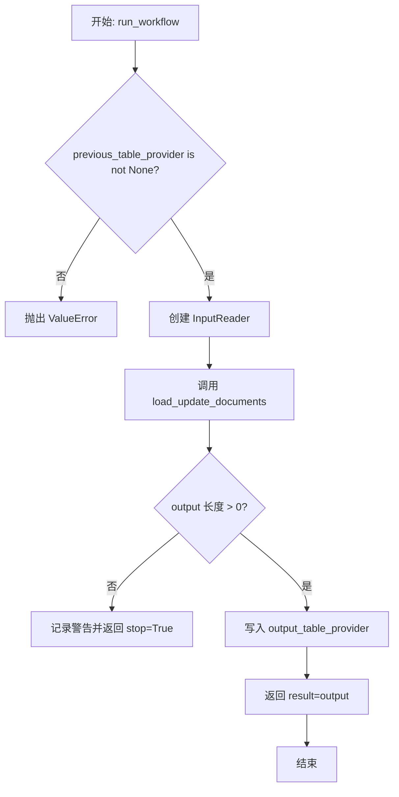
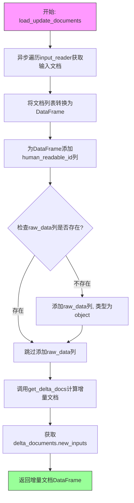
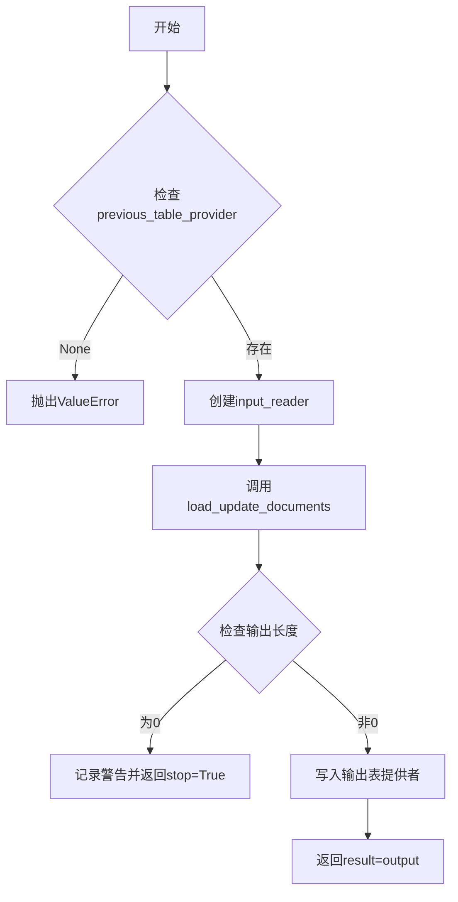
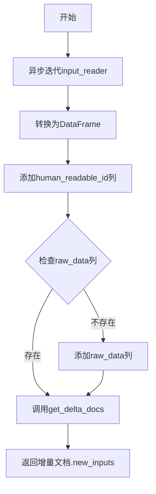

# `graphrag\packages\graphrag\graphrag\index\workflows\load_update_documents.py` 详细设计文档

该模块通过异步函数 run_workflow 和 load_update_documents 实现增量更新工作流，加载输入文档，计算与先前运行的差异，并输出更新后的文档到表格中。

## 整体流程



## 类结构

```
模块: graphrag_index.update.run_workflow (假设)
├── 函数: run_workflow (异步主函数)
└── 函数: load_update_documents (异步辅助函数)
```

## 全局变量及字段


### `logger`
    
模块级日志记录器，用于记录工作流执行过程中的日志信息

类型：`logging.Logger`
    


    

## 全局函数及方法


### `run_workflow`

该函数是异步工作流入口点，用于加载和解析仅更新（增量）的输入文档，将其转换为标准格式。它首先验证上下文中是否存在前一次运行的表提供者，然后通过输入读取器加载新文档，计算与前一次运行的增量差异，并将结果写入输出表。

参数：

- `config`：`GraphRagConfig`，全局配置对象，包含输入、存储等配置信息
- `context`：`PipelineRunContext`，管道运行上下文，包含输入存储、前一次表提供者、输出表提供者、统计信息等

返回值：`WorkflowFunctionOutput`，工作流函数输出对象，包含处理结果（DataFrame 或 None）和是否停止标志

#### 流程图

```mermaid
flowchart TD
    A[开始 run_workflow] --> B{previous_table_provider is None?}
    B -->|是| C[抛出 ValueError: previous_table_provider is required for update workflows]
    B -->|否| D[创建 input_reader]
    D --> E[调用 load_update_documents 加载增量文档]
    E --> F[记录日志: Final # of update rows loaded]
    F --> G[更新 context.stats.update_documents]
    G --> H{len(output) == 0?}
    H -->|是| I[记录警告: No new update documents found]
    I --> J[返回 WorkflowFunctionOutput result=None, stop=True]
    H -->|否| K[写入 DataFrame 到 output_table_provider]
    K --> L[返回 WorkflowFunctionOutput result=output]
```

#### 带注释源码

```python
async def run_workflow(
    config: GraphRagConfig,
    context: PipelineRunContext,
) -> WorkflowFunctionOutput:
    """Load and parse update-only input documents into a standard format."""
    # 验证上下文中的前一次表提供者是否存在，增量更新工作流必需此依赖
    if context.previous_table_provider is None:
        msg = "previous_table_provider is required for update workflows"
        raise ValueError(msg)

    # 根据配置创建输入读取器，用于读取增量输入文档
    input_reader = create_input_reader(config.input, context.input_storage)
    
    # 加载并解析增量文档，计算与前一次运行的差异
    output = await load_update_documents(
        input_reader,
        context.previous_table_provider,
    )

    # 记录最终加载的更新行数
    logger.info("Final # of update rows loaded: %s", len(output))
    
    # 更新上下文统计信息
    context.stats.update_documents = len(output)

    # 如果没有新的更新文档，记录警告并提前返回
    if len(output) == 0:
        logger.warning("No new update documents found.")
        return WorkflowFunctionOutput(result=None, stop=True)

    # 将处理后的文档写入输出表
    await context.output_table_provider.write_dataframe("documents", output)

    # 返回包含结果的工作流输出
    return WorkflowFunctionOutput(result=output)
```


### `load_update_documents`

加载并解析仅更新（增量）输入文档，通过对比当前输入与上一次运行的输出，计算出增量文档并返回新增或修改的数据。

参数：

- `input_reader`：`InputReader`，输入读取器，用于异步遍历读取原始输入文档
- `previous_table_provider`：`TableProvider`，表提供者，包含上一次索引运行的输出结果，用于与当前输入进行差量计算

返回值：`pd.DataFrame`，返回增量文档中的新输入数据（只包含新增或已修改的文档）

#### 流程图



#### 带注释源码

```python
async def load_update_documents(
    input_reader: InputReader,
    previous_table_provider: TableProvider,
) -> pd.DataFrame:
    """Load and parse update-only input documents into a standard format.
    
    该函数负责加载更新模式的输入文档，并与上一次运行的输出进行对比，
    最终返回增量（新增或修改）的文档数据。
    
    Args:
        input_reader: 输入读取器，提供异步迭代器遍历原始输入文档
        previous_table_provider: 上一次运行的表提供者，包含历史文档数据
        
    Returns:
        pd.DataFrame: 增量文档数据框，仅包含新增或已修改的文档
    """
    # 步骤1: 异步遍历输入读取器，将所有文档转换为字典列表
    # 使用列表推导式异步收集所有文档对象
    input_documents = [asdict(doc) async for doc in input_reader]
    
    # 步骤2: 将字典列表转换为Pandas DataFrame，便于后续数据处理
    input_documents = pd.DataFrame(input_documents)
    
    # 步骤3: 添加human_readable_id列，基于DataFrame索引生成人类可读的ID
    input_documents["human_readable_id"] = input_documents.index
    
    # 步骤4: 确保raw_data列存在（如果不存在则创建）
    # 这是为了保证数据格式的一致性，raw_data用于存储原始数据
    if "raw_data" not in input_documents.columns:
        input_documents["raw_data"] = pd.Series(dtype="object")
    
    # 步骤5: 调用get_delta_docs函数计算增量文档
    # previous_table_provider包含上一次运行的输出，用于与当前输入进行差量对比
    # 该函数会返回包含新增、修改、删除文档信息的增量对象
    delta_documents = await get_delta_docs(input_documents, previous_table_provider)
    
    # 步骤6: 返回增量文档中的新输入数据（new_inputs属性）
    # 这只包含需要处理的新增或修改文档，不包含未变化的文档
    return delta_documents.new_inputs
```

## 关键组件


### 核心功能概述

该模块实现了一个异步增量更新工作流，通过 `run_workflow` 函数从输入读取器加载增量文档，与之前的表提供者进行差异对比，过滤出新增或修改的文档，并输出到指定的表提供者中。

### 文件运行流程

1. **初始化阶段**：创建输入读取器，验证 `previous_table_provider` 是否存在
2. **数据加载阶段**：异步迭代输入文档，转换为 pandas DataFrame 格式
3. **数据增强阶段**：添加 `human_readable_id` 列和 `raw_data` 列（如果不存在）
4. **差异计算阶段**：调用 `get_delta_docs` 获取增量文档
5. **输出阶段**：将增量文档写入输出表提供者，返回工作流结果

### 全局函数

#### run_workflow

- **名称**: run_workflow
- **参数**:
  - `config`: GraphRagConfig - 图检索增强生成配置对象
  - `context`: PipelineRunContext - 管道运行上下文，包含输入存储、表提供者和统计信息
- **返回值**: WorkflowFunctionOutput - 包含结果数据和工作流控制标志
- **描述**: 异步主工作流函数，负责协调增量文档的加载、解析和输出
- **流程图**: 

- **源码**:
```python
async def run_workflow(
    config: GraphRagConfig,
    context: PipelineRunContext,
) -> WorkflowFunctionOutput:
    """Load and parse update-only input documents into a standard format."""
    if context.previous_table_provider is None:
        msg = "previous_table_provider is required for update workflows"
        raise ValueError(msg)

    input_reader = create_input_reader(config.input, context.input_storage)
    output = await load_update_documents(
        input_reader,
        context.previous_table_provider,
    )

    logger.info("Final # of update rows loaded: %s", len(output))
    context.stats.update_documents = len(output)

    if len(output) == 0:
        logger.warning("No new update documents found.")
        return WorkflowFunctionOutput(result=None, stop=True)

    await context.output_table_provider.write_dataframe("documents", output)

    return WorkflowFunctionOutput(result=output)
```

#### load_update_documents

- **名称**: load_update_documents
- **参数**:
  - `input_reader`: InputReader - 输入文档读取器接口
  - `previous_table_provider`: TableProvider - 之前的表提供者，用于差异计算
- **返回值**: pd.DataFrame - 增量文档数据框
- **描述**: 加载并解析增量输入文档为标准格式，执行与历史数据的差异对比
- **流程图**:

- **源码**:
```python
async def load_update_documents(
    input_reader: InputReader,
    previous_table_provider: TableProvider,
) -> pd.DataFrame:
    """Load and parse update-only input documents into a standard format."""
    input_documents = [asdict(doc) async for doc in input_reader]
    input_documents = pd.DataFrame(input_documents)
    input_documents["human_readable_id"] = input_documents.index
    if "raw_data" not in input_documents.columns:
        input_documents["raw_data"] = pd.Series(dtype="object")
    # previous table provider has the output of the previous run
    # we'll use this to diff the input from the prior
    delta_documents = await get_delta_docs(input_documents, previous_table_provider)
    return delta_documents.new_inputs
```

### 关键组件信息

#### 组件1: 异步惰性加载机制

通过 `async for` 迭代器和列表推导式实现输入文档的惰性加载，避免一次性将所有文档加载到内存中，提高大规模数据处理效率。

#### 组件2: 增量差异计算

`get_delta_docs` 函数通过比较输入文档与 `previous_table_provider` 中的历史数据，智能识别新增、修改和删除的文档，实现增量更新策略。

#### 组件3: 数据标准化处理

统一为 DataFrame 格式，添加 `human_readable_id` 和 `raw_data` 列，确保输出数据的一致性和完整性。

### 潜在技术债务与优化空间

1. **错误处理缺失**: `input_reader` 迭代过程中的异常未被捕获处理，可能导致工作流中断
2. **内存占用风险**: `[asdict(doc) async for doc in input_reader]` 在内存中构建完整列表，大数据量时可能导致内存溢出
3. **硬编码输出表名**: "documents" 表名硬编码，缺乏灵活性
4. **日志信息不完整**: 缺少详细的性能指标和调试日志
5. **类型注解不完整**: `input_documents` 变量类型从 list 转为 DataFrame 的过程缺乏明确类型标注

### 其它项目

#### 设计目标与约束

- **目标**: 实现增量更新工作流，支持仅处理新增或修改的文档
- **约束**: 必须提供 `previous_table_provider`，否则抛出异常

#### 错误处理与异常设计

- 依赖 `get_delta_docs` 的异常传播机制
- 缺少对输入读取失败、数据转换异常等场景的显式处理

#### 数据流与状态机

```
InputReader → 异步迭代 → 列表 → DataFrame → 差异计算 → 输出DataFrame → TableProvider
```

#### 外部依赖与接口契约

- **InputReader**: 必须实现异步迭代协议
- **TableProvider**: 必须提供 `read_table` 方法供差异计算使用
- **GraphRagConfig**: 提供输入配置和存储访问


## 问题及建议


### 已知问题

- **缺少返回类型注解**: `load_update_documents` 函数缺少返回类型注解（应为 `pd.DataFrame`），影响代码可读性和类型检查
- **内存占用风险**: 使用列表推导式 `[asdict(doc) async for doc in input_reader]` 一次性加载所有文档到内存，当输入数据量较大时可能导致内存溢出
- **缺乏输入验证**: 对 `input_documents` DataFrame 缺少列名验证和类型检查，若输入数据缺少必要字段或类型不匹配，将在中下游引发难以追踪的 KeyError 或 TypeError
- **硬编码表名**: 输出表名 "documents" 被硬编码，缺乏配置灵活性
- **异常处理缺失**: `input_reader` 迭代、`get_delta_docs` 调用以及 `write_dataframe` 写入操作均无 try-except 保护，任何 I/O 错误都会导致工作流直接失败
- **职责过于集中**: `load_update_documents` 函数同时负责加载、解析和增量计算 delta，多个职责耦合不利于单元测试和维护

### 优化建议

- 为 `load_update_documents` 添加返回类型注解，并在关键路径添加类型守卫（如 `isinstance` 检查）
- 考虑使用生成器模式或流式处理替代全量加载，或添加批处理机制以控制内存使用
- 在 DataFrame 操作前增加必要的列名校验和默认值处理逻辑，提高容错性
- 将 "documents" 表名提取为配置参数或常量
- 为所有异步 I/O 操作添加异常捕获和重试机制，并针对空数据集场景提供更友好的日志记录
- 拆分 `load_update_documents` 为独立的加载函数和 delta 计算函数，提高函数单一职责性

## 其它


### 设计目标与约束

该模块旨在实现增量更新工作流，目标是将输入的更新文档与上一次运行的输出进行差异对比，仅处理新增或变更的文档，以优化处理效率和资源占用。设计约束包括：1) 必须提供previous_table_provider以进行差异计算；2) 输入文档必须遵循标准格式；3) 输出结果必须是DataFrame格式；4) 整个流程必须异步执行以支持大规模数据处理。

### 错误处理与异常设计

主要异常场景包括：1) 若context.previous_table_provider为None，抛出ValueError并提示"previous_table_provider is required for update workflows"；2) 若input_reader读取失败或数据格式不兼容，可能抛出相应的IOError或DataError；3) 若get_delta_docs计算过程中出现异常，会向上传播；4) 若写入output_table_provider失败，会抛出相应的存储异常。错误处理原则是立即失败并抛出明确错误信息，而非静默处理。

### 数据流与状态机

数据流如下：输入文档通过InputReader异步迭代读取 → 转换为DataFrame并添加human_readable_id和raw_data字段 → 调用get_delta_docs与previous_table_provider进行差异计算 → 返回增量文档的new_inputs → 最终通过output_table_provider写入"documents"表。状态机包含：初始化状态（检查依赖）→ 加载状态（读取输入）→ 差异计算状态（对比历史）→ 输出状态（写入结果）→ 完成状态。

### 外部依赖与接口契约

核心依赖包括：1) graphrag_input模块的InputReader接口，需实现异步迭代器接口；2) graphrag_storage模块的TableProvider接口，需提供read_table和write_dataframe方法；3) graphrag.config的GraphRagConfig配置模型；4) graphrag.index的PipelineRunContext和WorkflowFunctionOutput；5) get_delta_docs函数来自graphrag.index.update.incremental_index模块。接口契约：InputReader必须实现__aiter__方法返回异步迭代器；TableProvider必须提供get_delta_docs所需的表读取能力；返回的WorkflowFunctionOutput包含result、stop和stats字段。

### 性能考量与优化空间

当前实现存在以下优化空间：1) 一次性将所有输入文档加载到内存（input_documents = [asdict(doc) async for doc in input_reader]），对于大规模数据集可能导致内存压力，建议改为流式处理或分批加载；2) 使用pandas DataFrame进行全量数据操作，对于纯文本或简单结构数据可能过重，考虑使用更轻量的数据结构；3) delta_documents.new_inputs的获取可能涉及全量数据对比，可考虑使用更高效的哈希或索引机制；4) 缺少重试机制，外部依赖（存储读写）失败时直接抛错。

### 安全性与合规性

安全考量：1) 输入数据通过InputReader读取，需确保数据源可信；2) previous_table_provider的数据来源需要验证，防止历史数据篡改；3) 写入操作需确保幂等性，防止重复写入；4) 日志记录需注意敏感信息泄露（当前仅记录文档数量，无敏感数据）。合规性方面，代码遵循MIT许可证，暂无特定行业合规要求。

### 配置与可扩展性

配置通过GraphRagConfig和context参数传入，支持灵活的配置外部化。可扩展方向：1) 可通过实现不同的InputReader支持多种输入格式（JSON、CSV、XML等）；2) delta计算逻辑可通过插件机制扩展；3) 输出表名"documents"可配置化；4) 可添加预处理/后处理钩子以支持自定义业务逻辑。当前硬编码了输出表名为"documents"，缺乏灵活性。

### 测试策略建议

建议补充以下测试用例：1) 单元测试：验证load_update_documents对空输入、单条输入、多条输入的处理；2) 集成测试：模拟previous_table_provider存在/不存在场景，验证异常抛出；3) 差异计算测试：构造特定场景验证增量检测逻辑正确性；4) 性能测试：使用大规模数据集验证内存使用和执行时间；5) 故障恢复测试：模拟读写失败场景验证错误处理。

    