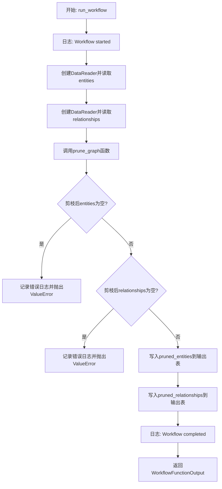
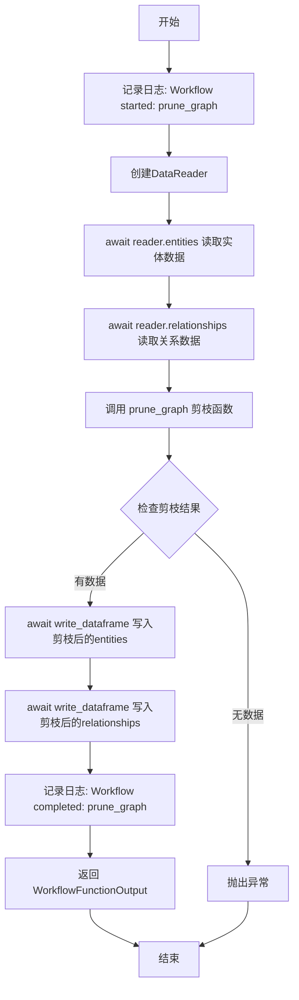
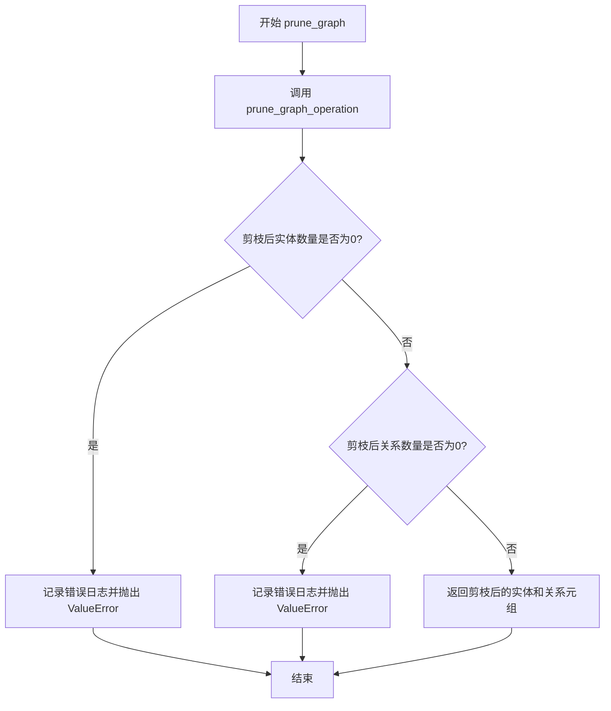

# `graphrag\packages\graphrag\graphrag\index\workflows\prune_graph.py` 详细设计文档

该模块实现了一个图剪枝工作流，通过读取实体和关系数据，应用基于图统计信息的剪枝算法（包含节点频率、节点度数、边权重等参数），移除不满足阈值的节点和边，最终将剪枝后的数据写回输出表并返回结果。

## 整体流程



## 类结构

```
该文件为扁平结构，无类定义
包含两个主要函数:
- run_workflow (异步工作流入口)
- prune_graph (同步剪枝逻辑)
```

## 全局变量及字段


### `logger`
    
模块级日志记录器，用于记录工作流运行状态和错误信息

类型：`logging.Logger`
    


### `config`
    
图RAG配置对象，包含图剪枝等配置参数

类型：`GraphRagConfig`
    


### `context`
    
管道运行上下文，提供数据读写能力和输出表提供者

类型：`PipelineRunContext`
    


### `reader`
    
数据读取器实例，用于从输出表提供者读取实体和关系数据

类型：`DataReader`
    


### `entities`
    
原始实体数据，从数据源读取的待处理实体数据框

类型：`pd.DataFrame`
    


### `relationships`
    
原始关系数据，从数据源读取的待处理关系数据框

类型：`pd.DataFrame`
    


### `pruned_entities`
    
剪枝后的实体数据，经过图剪枝操作后保留的实体数据框

类型：`pd.DataFrame`
    


### `pruned_relationships`
    
剪枝后的关系数据，经过图剪枝操作后保留的关系数据框

类型：`pd.DataFrame`
    


### `pruning_config`
    
剪枝配置参数，包含节点频率、度等剪枝阈值配置

类型：`PruneGraphConfig`
    


### `error_msg`
    
错误消息字符串，用于记录和抛出剪枝失败的错误信息

类型：`str`
    


    

## 全局函数及方法


### `run_workflow`

异步工作流入口函数，接收配置和上下文，执行完整的图剪枝流程，输出剪枝后的实体和关系数据。

参数：

- `config`：`GraphRagConfig`，图检索增强生成配置，包含剪枝参数配置
- `context`：`PipelineRunContext`，管道运行上下文，提供数据读写能力和输出表提供者

返回值：`WorkflowFunctionOutput`，工作流函数输出，包含剪枝后的实体DataFrame和关系DataFrame

#### 流程图



#### 带注释源码

```python
async def run_workflow(
    config: GraphRagConfig,
    context: PipelineRunContext,
) -> WorkflowFunctionOutput:
    """All the steps to create the base entity graph."""
    # 记录工作流开始日志
    logger.info("Workflow started: prune_graph")
    
    # 创建数据读取器，用于从输出表提供者读取数据
    reader = DataReader(context.output_table_provider)
    
    # 异步读取实体数据
    entities = await reader.entities()
    
    # 异步读取关系数据
    relationships = await reader.relationships()

    # 调用剪图函数，对实体和关系进行剪枝
    pruned_entities, pruned_relationships = prune_graph(
        entities,
        relationships,
        pruning_config=config.prune_graph,
    )

    # 将剪枝后的实体数据写入输出表
    await context.output_table_provider.write_dataframe("entities", pruned_entities)
    
    # 将剪枝后的关系数据写入输出表
    await context.output_table_provider.write_dataframe(
        "relationships", pruned_relationships
    )

    # 记录工作流完成日志
    logger.info("Workflow completed: prune_graph")
    
    # 返回工作流输出结果，包含剪枝后的实体和关系
    return WorkflowFunctionOutput(
        result={
            "entities": pruned_entities,
            "relationships": pruned_relationships,
        }
    )
```


### `prune_graph`

该函数是图剪枝的核心同步函数，负责调用底层 `prune_graph_operation` 执行实际剪枝操作，并对剪枝结果进行验证，确保剪枝后仍有实体和关系保留，否则抛出相应的错误信息。

参数：

- `entities`：`pd.DataFrame`，输入的实体数据表
- `relationships`：`pd.DataFrame`，输入的关系数据表
- `pruning_config`：`PruneGraphConfig`，图剪枝的配置参数，包含节点频率、节点度数、边权重等阈值设置

返回值：`tuple[pd.DataFrame, pd.DataFrame]`，返回剪枝后的实体数据表和关系数据表组成的元组

#### 流程图



#### 带注释源码

```python
def prune_graph(
    entities: pd.DataFrame,
    relationships: pd.DataFrame,
    pruning_config: PruneGraphConfig,
) -> tuple[pd.DataFrame, pd.DataFrame]:
    """Prune a full graph based on graph statistics."""
    # 调用底层剪枝操作函数，传入实体、关系以及各项剪枝参数
    pruned_entities, pruned_relationships = prune_graph_operation(
        entities,
        relationships,
        min_node_freq=pruning_config.min_node_freq,          # 最小节点频率阈值
        max_node_freq_std=pruning_config.max_node_freq_std,  # 节点频率最大标准差
        min_node_degree=pruning_config.min_node_degree,      # 最小节点度数阈值
        max_node_degree_std=pruning_config.max_node_degree_std, # 节点度数最大标准差
        min_edge_weight_pct=pruning_config.min_edge_weight_pct, # 最小边权重百分比
        remove_ego_nodes=pruning_config.remove_ego_nodes,    # 是否移除自我中心节点
        lcc_only=pruning_config.lcc_only,                     # 是否仅保留最大连通分量
    )

    # 验证剪枝后的实体是否为空，若为空则表示剪枝失败
    if len(pruned_entities) == 0:
        error_msg = "Graph Pruning failed. No entities remain."
        logger.error(error_msg)
        raise ValueError(error_msg)

    # 验证剪枝后的关系是否为空，若为空则表示剪枝失败
    if len(pruned_relationships) == 0:
        error_msg = "Graph Pruning failed. No relationships remain."
        logger.error(error_msg)
        raise ValueError(error_msg)

    # 返回剪枝后的实体和关系数据
    return (pruned_entities, pruned_relationships)
```


### `prune_graph_operation`

外部导入的图剪枝操作函数，用于根据图统计数据对实体关系图进行剪枝，移除低频节点、低权重边和孤立节点，生成精简的图结构。

参数：

- `entities`：`pd.DataFrame`，输入的实体数据表
- `relationships`：`pd.DataFrame`，输入的关系（边）数据表
- `min_node_freq`：剪枝配置中的最小节点频率阈值，用于过滤低频实体
- `max_node_freq_std`：剪枝配置中的节点频率标准差最大值，用于过滤异常频率节点
- `min_node_degree`：剪枝配置中的最小节点度数阈值，用于过滤孤立或低连接度节点
- `max_node_degree_std`：剪枝配置中的节点度数标准差最大值，用于过滤高度数异常节点
- `min_edge_weight_pct`：`float`，剪枝配置中的最小边权重百分比阈值，用于过滤低权重边
- `remove_ego_nodes`：`bool`，剪枝配置中的是否移除自我中心节点的标志
- `lcc_only`：`bool`，剪枝配置中的是否仅保留最大连通分量的标志

返回值：`tuple[pd.DataFrame, pd.DataFrame]`，返回剪枝后的实体数据表和关系数据表

#### 流程图

```mermaid
flowchart TD
    A[开始图剪枝操作] --> B[输入entities和relationships数据]
    B --> C[应用min_node_freq过滤低频节点]
    C --> D[应用max_node_freq_std过滤异常频率节点]
    D --> E[应用min_node_degree过滤低度数节点]
    E --> F[应用max_node_degree_std过滤高度数异常节点]
    F --> G[应用min_edge_weight_pct过滤低权重边]
    G --> H{remove_ego_nodes是否为True]
    H -->|是| I[移除自我中心节点]
    H -->|否| J{是否有remove_ego_nodes参数]
    J -->|有| I
    J -->|无| K{lcc_only是否为True]
    I --> K
    K -->|是| L[仅保留最大连通分量]
    K -->|否| M[返回剪枝后的entities和relationships]
    L --> M
    M --> N[结束图剪枝操作]
```

#### 带注释源码

```python
# 从外部模块导入的图剪枝操作函数
# 位于 graphrag.index.operations.prune_graph 模块
from graphrag.index.operations.prune_graph import prune_graph as prune_graph_operation

# prune_graph_operation 函数调用示例（在 prune_graph 函数内部）:
pruned_entities, pruned_relationships = prune_graph_operation(
    entities,                                    # pd.DataFrame: 输入的实体数据
    relationships,                              # pd.DataFrame: 输入的关系数据
    min_node_freq=pruning_config.min_node_freq,        # 最小节点频率阈值
    max_node_freq_std=pruning_config.max_node_freq_std, # 节点频率标准差最大值
    min_node_degree=pruning_config.min_node_degree,    # 最小节点度数阈值
    max_node_degree_std=pruning_config.max_node_degree_std, # 节点度数标准差最大值
    min_edge_weight_pct=pruning_config.min_edge_weight_pct, # 最小边权重百分比
    remove_ego_nodes=pruning_config.remove_ego_nodes,      # 是否移除自我中心节点
    lcc_only=pruning_config.lcc_only,                      # 是否仅保留最大连通分量
)
```

## 关键组件


### 一段话描述

该模块是GraphRag的图剪枝工作流，通过读取实体和关系数据，根据配置的剪枝策略（节点频率、节点度数、边权重等）移除不符合条件的节点和边，最终将剪枝后的图数据写回输出表并返回结果。

### 文件的整体运行流程

1. **工作流启动**：日志记录"Workflow started: prune_graph"
2. **数据读取**：通过DataReader从输出表提供者读取实体(entities)和关系(relationships)数据
3. **图剪枝执行**：调用prune_graph函数，传入实体、关系和剪枝配置，执行图剪枝操作
4. **数据写入**：将剪枝后的实体和关系写回输出表
5. **工作流完成**：日志记录"Workflow completed: prune_graph"
6. **返回结果**：返回包含剪枝后实体和关系的WorkflowFunctionOutput

### 关键组件信息

### 1. run_workflow 异步工作流函数

核心异步工作流入口，协调整个图剪枝流程

### 2. prune_graph 同步剪枝函数

图剪枝的核心业务逻辑实现，包含剪枝参数校验和异常处理

### 3. DataReader 数据读取器

从PipelineRunContext的输出表提供者读取实体和关系数据

### 4. prune_graph_operation 底层剪枝操作

实际执行图剪枝的底层操作，接受多个剪枝参数

### 5. GraphRagConfig 全局配置

包含图剪枝配置(PruneGraphConfig)的全局配置模型

### 6. PruneGraphConfig 剪枝配置

定义图剪枝的具体参数：节点最小频率、节点频率标准差、节点最小度数、节点度数标准差、边权重百分比、是否移除自我节点、是否仅保留最大连通分量

### 7. PipelineRunContext 管道运行上下文

提供输出表提供者用于读写数据

### 8. WorkflowFunctionOutput 工作流函数输出

标准工作流输出结构，包含结果字典

### 潜在的技术债务或优化空间

1. **缺乏重试机制**：写入数据失败时没有重试逻辑
2. **错误处理粒度粗**：所有错误都直接抛出ValueError，可考虑分类处理
3. **日志信息简略**：可增加更多调试信息如剪枝前后数据量对比
4. **同步阻塞风险**：prune_graph_operation可能为长时间运行操作，应考虑异步化
5. **配置校验缺失**：未校验pruning_config参数的有效性

### 其它项目

#### 设计目标与约束

- 目标：创建基础实体图，通过剪枝移除低质量节点和边
- 约束：剪枝后必须保留至少1个实体和1个关系，否则抛出异常

#### 错误处理与异常设计

- 实体全部被剪枝：抛出ValueError("Graph Pruning failed. No entities remain.")
- 关系全部被剪枝：抛出ValueError("Graph Pruning failed. No relationships remain.")
- 所有错误都通过logger.error记录并向上传播

#### 数据流与状态机

- 输入状态：原始实体DataFrame和关系DataFrame
- 处理状态：调用prune_graph_operation进行剪枝
- 输出状态：剪枝后的实体DataFrame和关系DataFrame
- 状态转换由配置参数控制（min_node_freq、max_node_freq_std、min_node_degree等）

#### 外部依赖与接口契约

- 依赖DataReader读取数据
- 依赖prune_graph_operation执行实际剪枝
- 依赖PipelineRunContext.output_table_provider进行数据读写
- 返回WorkflowFunctionOutput需包含result字典，键为"entities"和"relationships"


## 问题及建议


### 已知问题

-   **同步阻塞风险**：`prune_graph_operation` 是同步函数，在 `async` 函数 `run_workflow` 中直接调用，可能阻塞事件循环，影响并发性能
-   **缺少输入验证**：未对 `reader.entities()` 和 `reader.relationships()` 返回结果进行空值检查，可能导致后续处理失败
-   **硬编码表名**：表名 "entities" 和 "relationships" 被硬编码在代码中，降低了可维护性和可配置性
-   **错误处理不完善**：使用 `logger.error` 后直接 `raise`，未使用 `logger.exception` 记录完整堆栈信息，不利于调试
-   **重复检查逻辑**：`pruned_entities` 和 `pruned_relationships` 的空值检查分散在两处，可以合并

### 优化建议

-   **异步化剪枝操作**：使用 `asyncio.to_thread()` 或 `run_in_executor` 将 `prune_graph` 调度到线程池执行，避免阻塞事件循环
-   **添加输入验证**：在读取数据后立即检查是否为 `None` 或空 DataFrame，并提供有意义的错误信息
-   **提取常量或配置**：将表名提取为模块级常量或从配置对象获取，提高代码可维护性
-   **改进错误日志**：将 `logger.error(error_msg)` 改为 `logger.exception(error_msg)`，保留异常堆栈信息
-   **合并验证逻辑**：将两个空值检查合并为一个逻辑块，简化代码结构

## 其它


### 设计目标与约束

本模块的设计目标是根据配置的图统计信息（节点频率、节点度数、边权重等）对实体关系图进行剪枝，移除低频或低权重的节点和边，从而生成一个精简的基 entity graph。约束条件包括：输入的entities和relationships必须为有效的pandas DataFrame；pruning_config参数必须为PruneGraphConfig类型；剪枝后的结果集不能为空，否则视为剪枝失败。

### 错误处理与异常设计

本模块包含两处关键的错误检查逻辑：1）当剪枝后pruned_entities为空时，抛出ValueError并记录错误日志"Graph Pruning failed. No entities remain."；2）当剪枝后pruned_relationships为空时，抛出ValueError并记录错误日志"Graph Pruning failed. No relationships remain."。所有异常均通过logger记录详细错误信息，便于问题追踪。异步函数run_workflow未显式捕获异常，异常将向上传播至调用方处理。

### 数据流与状态机

数据流如下：1）run_workflow接收GraphRagConfig和PipelineRunContext；2）通过DataReader从context.output_table_provider读取entities和relationships数据；3）调用prune_graph函数执行剪枝操作；4）将剪枝后的数据写回output_table_provider的entities和relationships表；5）返回WorkflowFunctionOutput对象。状态转换：初始状态→数据加载→图剪枝→数据持久化→完成。

### 外部依赖与接口契约

本模块依赖以下外部组件：1）GraphRagConfig - 图谱配置模型，包含prune_graph配置项；2）PipelineRunContext - 管道运行上下文，提供output_table_provider用于数据读写；3）DataReader - 数据读取器，用于从表提供程序读取实体和关系数据；4）prune_graph_operation - 图剪枝操作函数，执行实际剪枝逻辑。接口契约要求output_table_provider必须实现entities()、relationships()异步方法和write_dataframe()异步方法。

### 性能考虑

当前实现中，数据读取和写入均为异步操作，但prune_graph_operation为同步函数，可能成为性能瓶颈。对于大规模图数据，建议：1）评估是否可将prune_graph_operation改为异步实现；2）考虑对剪枝参数进行预验证，避免无效计算；3）监控剪枝操作的执行时间，确保在可接受范围内。

### 安全性考虑

本模块不直接处理用户输入，安全性风险较低。但需注意：1）DataReader读取的数据源需确保可信；2）错误信息中未暴露敏感系统信息，符合安全最佳实践；3）日志记录仅包含业务相关错误，不记录敏感数据。

### 配置说明

pruning_config（PruneGraphConfig）包含以下关键参数：min_node_freq - 节点最小频率阈值；max_node_freq_std - 节点最大频率标准差倍数；min_node_degree - 节点最小度数；max_node_degree_std - 节点最大度数标准差倍数；min_edge_weight_pct - 边最小权重百分比；remove_ego_nodes - 是否移除自我中心节点；lcc_only - 是否仅保留最大连通分量。

### 使用示例

```python
# 假设config和context已正确初始化
workflow_output = await run_workflow(config, context)
result = workflow_output.result
pruned_entities = result["entities"]
pruned_relationships = result["relationships"]
```

### 注意事项

1）本模块为async函数，调用时必须使用await；2）剪枝操作可能产生空结果集，调用方需做好处理空结果的准备；3）prune_graph_operation的具体实现需参考graphrag.index.operations.prune_graph模块；4）日志级别为INFO，便于生产环境监控工作流执行状态。

    