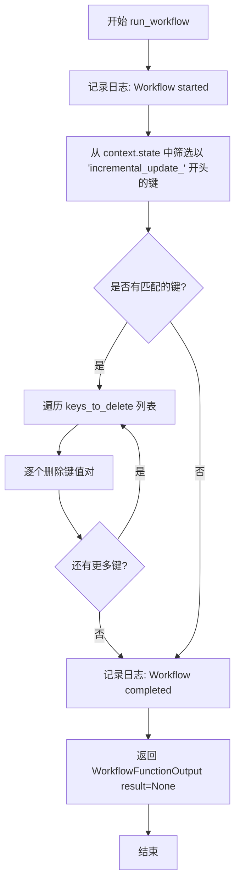

# `graphrag\packages\graphrag\graphrag\index\workflows\update_clean_state.py` 详细设计文档

一个异步工作流函数，用于清理增量更新后的状态，删除context.state中所有以'incremental_update_'开头的键值对

## 整体流程

```mermaid
graph TD
    A[开始] --> B[日志记录: Workflow started: update_clean_state]
B --> C[构建keys_to_delete列表]
C --> D{遍历keys_to_delete}
D --> E[删除context.state中的对应键]
E --> D
D --> F[日志记录: Workflow completed: update_clean_state]
F --> G[返回WorkflowFunctionOutput(result=None)]
```

## 类结构

```
模块: graphrag.index.workflows.update_clean_state
└── run_workflow (异步函数)
```

## 全局变量及字段


### `logger`
    
用于记录日志信息的全局日志记录器

类型：`logging.Logger`
    


    

## 全局函数及方法


### `run_workflow`

该异步函数是GraphRag工作流的一部分，用于在增量更新后清理状态。它会遍历上下文状态中的所有键，删除以"incremental_update_"开头的键，从而清除增量更新过程中产生的临时数据。

参数：

- `_config`：`GraphRagConfig`，图RAG配置对象（当前未使用，使用下划线前缀表示）
- `context`：`PipelineRunContext`，管道运行上下文，包含state属性用于存储和访问工作流状态数据

返回值：`WorkflowFunctionOutput`，工作流函数输出对象，此处返回result=None表示无具体结果输出

#### 流程图



#### 带注释源码

```python
# 异步函数定义，用于在工作流中清理增量更新后的状态
async def run_workflow(  # noqa: RUF029  (RUF029警告表示函数未使用异步特性，但保留以满足接口一致性)
    _config: GraphRagConfig,  # 配置参数，当前实现中未使用
    context: PipelineRunContext,  # 管道运行上下文，包含state字典用于存储状态
) -> WorkflowFunctionOutput:  # 返回工作流函数输出对象
    """Clean the state after the update."""
    # 记录工作流开始的日志信息
    logger.info("Workflow started: update_clean_state")
    
    # 列表推导式：从context.state中筛选出所有以'incremental_update_'开头的键名
    keys_to_delete = [
        key_name
        for key_name in context.state
        if key_name.startswith("incremental_update_")
    ]

    # 遍历需要删除的键，逐个从context.state中删除
    for key_name in keys_to_delete:
        del context.state[key_name]

    # 记录工作流完成的日志信息
    logger.info("Workflow completed: update_clean_state")
    
    # 返回工作流输出结果，此处result设为None表示无具体返回值
    return WorkflowFunctionOutput(result=None)
```

## 关键组件


### run_workflow 异步工作流函数

核心功能是清理增量更新后的状态，通过删除所有以"incremental_update_"开头的状态键来实现状态清理。

### GraphRagConfig 配置参数

传入的工作流配置对象，类型为 GraphRagConfig，包含图谱检索增强生成的配置信息。

### PipelineRunContext 管道运行上下文

提供对管道执行上下文的访问，包含 state 状态字典，用于在管道执行过程中存储和共享数据。

### context.state 状态字典

管道执行过程中的状态存储，类型为字典，用于保存增量更新相关的状态信息。

### keys_to_delete 键列表推导式

通过列表推导式筛选出所有以"incremental_update_"开头的状态键名称，用于后续批量删除。

### logger 信息日志

使用标准 logging 模块获取的日志记录器，用于记录工作流开始和完成的状态信息。

### WorkflowFunctionOutput 工作流输出

异步工作流函数的返回值类型，包含执行结果数据，此处返回 result=None 表示无特定返回值。


## 问题及建议


### 已知问题

-   **并发安全性问题**：直接使用 `del` 修改 `context.state` 字典，缺乏并发控制机制，在多线程/多协程环境下可能导致竞态条件
-   **异常处理缺失**：如果指定的 key 不存在，`del context.state[key_name]` 会抛出 `KeyError` 导致工作流中断
-   **返回值类型不明确**：`WorkflowFunctionOutput` 的 `result=None` 可能不符合调用方的预期，缺乏对返回值的说明
-   **未充分利用异步特性**：函数声明为 `async` 但内部操作完全是同步的，未体现异步优势
-   **日志信息不完整**：仅记录开始和结束状态，未记录实际删除的键数量或任何错误信息

### 优化建议

-   添加 try-except 块捕获 KeyError，使用 `context.state.pop(key_name, None)` 安全删除
-   考虑添加并发锁（如 asyncio.Lock）或使用线程安全的数据结构
-   增加删除操作的日志记录，包括删除的键数量和具体键名
-   考虑返回更有意义的输出，如删除的键数量统计
-   若无需真正异步，可改为同步函数以避免异步开销
-   添加更详细的文档字符串，说明返回值含义和可能的错误情况


## 其它


### 设计目标与约束

本模块的设计目标是在增量更新工作流完成后，清理上下文状态中以 "incremental_update_" 前缀开头的临时键值对，释放内存空间并保持状态整洁。约束条件包括：1) 仅删除以特定前缀开头的键，不影响其他状态数据；2) 必须在工作流完成后执行，以确保增量更新数据的完整性；3) 异步函数设计，支持在异步上下文中调用。

### 错误处理与异常设计

本模块的错误处理机制较为简单，主要依赖 Python 内置的异常传播机制。若 `context.state` 不是可写的字典类型或在迭代过程中被其他协程修改，可能抛出 `TypeError` 或 `RuntimeError`。建议在调用方使用 try-except 块捕获可能的异常，并记录详细的错误日志以便排查。由于删除操作在循环中执行，若某个键的删除失败，将跳过该键继续处理后续键，但这可能导致状态不一致问题。

### 数据流与状态机

该模块的数据流相对简单：输入为 `PipelineRunContext` 对象，其包含 `state` 字典属性；处理逻辑遍历 `state` 中的所有键，筛选出以 "incremental_update_" 开头的键；输出为删除这些键后的状态变更。状态机视角下，该工作流处于 "清理" 状态，负责从 "增量更新" 状态向 "完成" 状态的过渡，清理临时状态数据。

### 外部依赖与接口契约

外部依赖包括：1) `GraphRagConfig` 配置模型，用于接收工作流配置参数；2) `PipelineRunContext` 运行时上下文，提供状态管理能力；3) `WorkflowFunctionOutput` 工作流输出类型，定义返回结构；4) `logging` 模块，用于记录操作日志。接口契约要求：`context` 参数必须为有效的 `PipelineRunContext` 实例且包含可写的 `state` 字典属性；函数返回 `WorkflowFunctionOutput` 对象，result 字段为 `None`。

### 性能考虑

当前实现采用列表推导式构建待删除键列表，时间复杂度为 O(n)，其中 n 为状态字典的键数量。删除操作同样为 O(n)。对于状态字典较小的场景，性能影响可忽略不计。若状态字典包含大量键，可考虑使用生成器表达式减少内存占用，或在删除时使用批量操作提高效率。该函数为异步设计，可与其他异步操作并发执行，不会阻塞事件循环。

### 安全性考虑

本模块不直接涉及用户输入处理或敏感数据操作，安全性风险较低。但需要注意：1) 删除操作不可逆，调用前需确保数据已持久化或不再需要；2) 若 `context.state` 被多方共享，删除操作可能影响其他组件的状态预期；3) 建议在生产环境中添加审计日志，记录被删除的键名称，以便问题追踪。

### 可测试性设计

该模块的可测试性设计要点包括：1) 函数签名清晰，依赖注入便于 mock；2) 纯逻辑操作，无外部系统依赖，易于单元测试；3) 建议编写测试用例覆盖：正常删除场景、空状态场景、无匹配键场景、并发访问场景。可通过模拟 `PipelineRunContext` 对象，注入不同的 `state` 字典，验证删除逻辑的正确性。

### 配置说明

本模块无显式配置参数，配置信息通过 `GraphRagConfig` 参数传入但未使用（参数名称以下划线前缀标识为未使用）。运行时行为由上下文状态内容决定，无需额外配置。若未来需要定制清理逻辑（如自定义前缀、排除特定键），可通过配置对象扩展。

### 使用示例/调用方式

该工作流函数通常由工作流调度器自动调用，不建议直接手动调用。示例调用场景：
```python
# 工作流调度器内部调用方式
context = PipelineRunContext(state={"incremental_update_entities": [...], "other_key": "value"})
output = await run_workflow(config, context)
# 执行后 context.state 仅包含 {"other_key": "value"}
```

### 并发与线程安全性

由于采用异步函数设计，该模块可在异步上下文中安全运行。但需注意：1) 若多个协程共享同一 `PipelineRunContext` 实例，并发调用可能产生竞态条件；2) Python 字典在 CPython 中不是线程安全的，跨线程调用需加锁保护；3) 建议在工作流调度层面保证同一上下文实例的串行访问。

### 日志设计

日志设计符合项目规范，使用模块级 `logger` 记录操作信息。日志级别为 INFO，输出内容包含工作流名称和执行状态，便于运维监控和问题排查。建议未来可增加 DEBUG 级别日志，输出被删除键的详细信息，便于细粒度问题诊断。


    