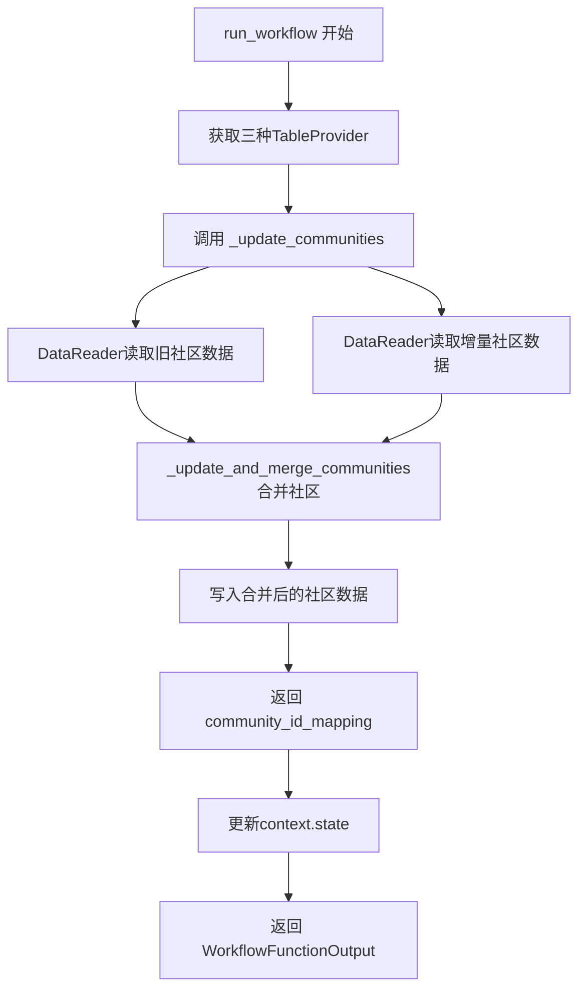
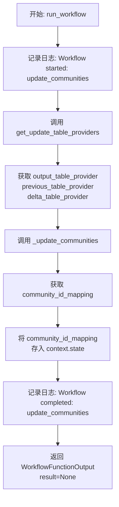
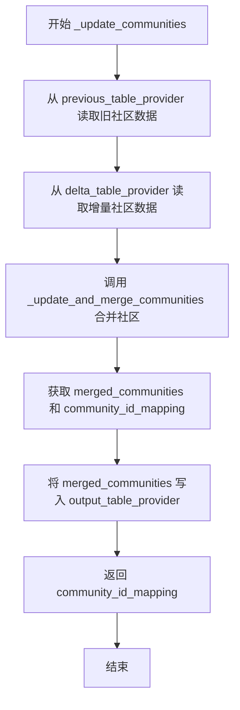
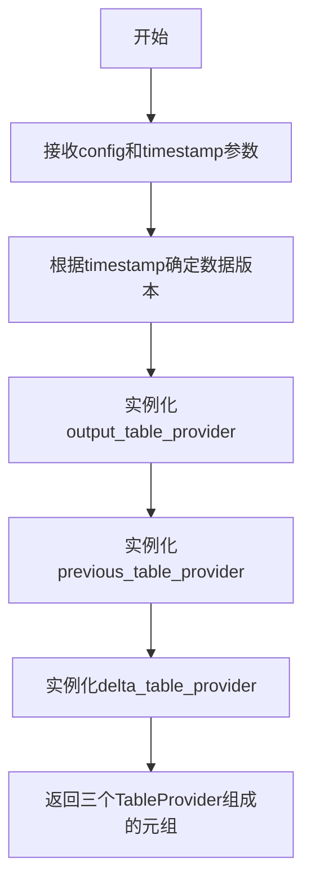
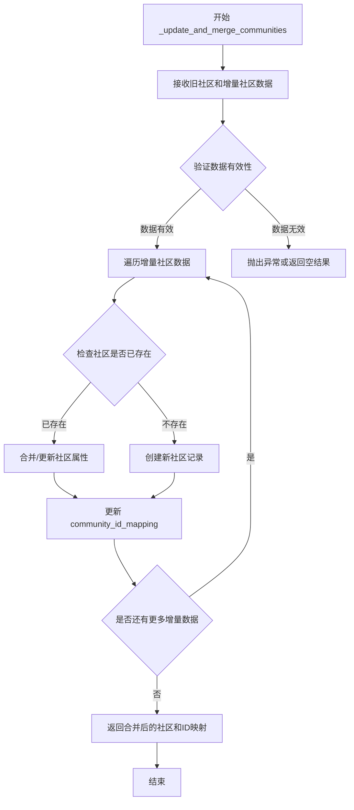

# `graphrag\packages\graphrag\graphrag\index\workflows\update_communities.py` 详细设计文档

这是一个增量更新社区（communities）的异步workflow模块，通过读取前后两个时间段的表提供者数据，合并旧社区与增量社区，并输出更新后的社区ID映射关系。

## 整体流程



## 类结构

```
无类定义 (仅包含模块级函数)
├── run_workflow (主入口异步函数)
└── _update_communities (内部异步辅助函数)
```

## 全局变量及字段


### `logger`
    
模块级别的日志记录器，用于记录工作流执行过程中的信息

类型：`logging.Logger`
    


    

## 全局函数及方法


### `run_workflow`

这是一个异步工作流函数，用于从增量索引运行中更新社区（communities）数据。它获取增量表提供者，调用内部函数 `_update_communities` 来执行实际的社区更新和合并操作，并将社区ID映射关系存储到上下文中。

参数：

- `config`：`GraphRagConfig`，GraphRag 配置对象，包含系统配置参数
- `context`：`PipelineRunContext`，管道运行上下文，包含状态信息和运行时数据

返回值：`WorkflowFunctionOutput`，工作流函数输出对象，本函数返回 `result=None` 的输出

#### 流程图



#### 带注释源码

```python
async def run_workflow(
    config: GraphRagConfig,
    context: PipelineRunContext,
) -> WorkflowFunctionOutput:
    """Update the communities from a incremental index run."""
    # 记录工作流开始日志
    logger.info("Workflow started: update_communities")
    
    # 获取增量更新所需的三个表提供者：
    # output_table_provider: 输出表提供者，用于写入合并后的社区数据
    # previous_table_provider: 上一次索引的表提供者，包含旧社区数据
    # delta_table_provider: 增量表提供者，包含新增的社区数据
    output_table_provider, previous_table_provider, delta_table_provider = (
        get_update_table_providers(config, context.state["update_timestamp"])
    )

    # 调用内部函数更新社区数据，获取社区ID映射关系
    community_id_mapping = await _update_communities(
        previous_table_provider, delta_table_provider, output_table_provider
    )

    # 将社区ID映射关系存储到上下文状态中，供后续流程使用
    context.state["incremental_update_community_id_mapping"] = community_id_mapping

    # 记录工作流完成日志
    logger.info("Workflow completed: update_communities")
    
    # 返回工作流输出结果（无实际数据）
    return WorkflowFunctionOutput(result=None)
```


### `_update_communities`

该函数是一个异步函数，负责从增量索引运行中更新社区数据。它从三个不同的表提供者（previous、delta、output）获取数据，读取旧的和增量的社区，合并它们，并将结果写入输出表提供者和返回社区ID映射。

参数：

- `previous_table_provider`：`TableProvider`，提供上一次索引运行的社区数据
- `delta_table_provider`：`TableProvider`，提供自上次运行以来的增量社区数据
- `output_table_provider`：`TableProvider`，用于写入合并后的社区数据

返回值：`dict`，返回社区ID映射关系，用于跟踪新旧社区ID的对应

#### 流程图



#### 带注释源码

```python
async def _update_communities(
    previous_table_provider: TableProvider,  # 上一次索引的表提供者
    delta_table_provider: TableProvider,      # 增量更新的表提供者
    output_table_provider: TableProvider,    # 输出表提供者
) -> dict:
    """Update the communities output."""
    # 从上一个表提供者读取旧的社区数据
    old_communities = await DataReader(previous_table_provider).communities()
    
    # 从增量表提供者读取新增的社区数据
    delta_communities = await DataReader(delta_table_provider).communities()
    
    # 调用内部函数合并旧社区和增量社区，返回合并后的社区和ID映射
    merged_communities, community_id_mapping = _update_and_merge_communities(
        old_communities, delta_communities
    )

    # 将合并后的社区数据写入输出表提供者
    await output_table_provider.write_dataframe("communities", merged_communities)

    # 返回社区ID映射关系
    return community_id_mapping
```


### `get_update_table_providers`

获取增量更新所需的表提供者。根据代码调用上下文，该函数用于在增量索引运行时获取输出表提供者、上一版本表提供者和增量表提供者。

参数：

-  `config`：`GraphRagConfig`，图谱配置对象，包含图谱的完整配置信息
-  `timestamp`：`Any`（推断自 `context.state["update_timestamp"]`），增量更新的时间戳，用于确定要加载的数据版本

返回值：`Tuple[TableProvider, TableProvider, TableProvider]`，返回三个表提供者元组，分别是：
- `output_table_provider`：输出表提供者，用于写入更新后的数据
- `previous_table_provider`：上一版本的表提供者，用于读取历史数据
- `delta_table_provider`：增量表提供者，用于读取增量数据

#### 流程图



#### 带注释源码

```python
# 该函数的具体实现未在给定的代码文件中提供
# 以下为基于调用上下文的推断性源码

async def get_update_table_providers(
    config: GraphRagConfig,
    timestamp: Any  # 来自 context.state["update_timestamp"]
) -> Tuple[TableProvider, TableProvider, TableProvider]:
    """获取增量更新所需的表提供者。
    
    Args:
        config: 图谱配置对象
        timestamp: 增量更新的时间戳
        
    Returns:
        包含三个TableProvider的元组:
        - output_table_provider: 输出表提供者
        - previous_table_provider: 上一版本表提供者
        - delta_table_provider: 增量表提供者
    """
    # 从配置中获取存储相关设置
    storage_config = config.storage
    
    # 根据timestamp加载previous_table_provider（历史数据）
    previous_table_provider = TableProvider(
        storage_type=storage_config.type,
        base_dir=storage_config.base_dir,
        timestamp=timestamp  # 加载该时间戳之前的数据
    )
    
    # 加载delta_table_provider（增量数据）
    delta_table_provider = TableProvider(
        storage_type=storage_config.type,
        base_dir=storage_config.base_dir,
        timestamp=timestamp  # 加载该时间戳对应的增量数据
    )
    
    # 创建output_table_provider用于写入结果
    output_table_provider = TableProvider(
        storage_type=storage_config.type,
        base_dir=storage_config.base_dir,
        mode='write'  # 写入模式
    )
    
    return output_table_provider, previous_table_provider, delta_table_provider
```

---

**注意**：给定的代码文件中仅包含 `get_update_table_providers` 函数的导入和使用，并未包含该函数的实际实现。上述源码是基于调用方式和上下文推断得出的。要获取准确实现，请查阅 `graphrag/index/run/utils` 模块的源文件。


### `_update_and_merge_communities`

该函数负责将旧的社区数据与增量（delta）社区数据进行合并和更新，生成合并后的社区数据，并生成社区ID的映射关系（用于追踪哪些旧社区被合并或更新）。

参数：

- `old_communities`：未知类型（旧社区数据，来自 previous_table_provider）
- `delta_communities`：未知类型（增量社区数据，来自 delta_table_provider）

返回值：元组 `(merged_communities, community_id_mapping)`，其中 merged_communities 是合并后的社区数据DataFrame，community_id_mapping 是社区ID映射字典

#### 流程图



#### 带注释源码

```
# 该函数定义在 graphrag.index.update.communities 模块中
# 以下是基于调用方式推断的函数签名和逻辑

def _update_and_merge_communities(
    old_communities,      # 旧的社区数据（DataFrame或类似结构）
    delta_communities     # 增量社区数据（DataFrame或类似结构）
):
    """
    合并旧社区和增量社区数据，生成合并后的社区和ID映射。
    
    处理逻辑：
    1. 遍历增量社区数据
    2. 对于每个增量社区，检查是否在旧社区中存在
    3. 如果存在，则合并属性（可能基于某种合并策略）
    4. 如果不存在，则创建新社区记录
    5. 维护社区ID映射关系（旧ID -> 新ID）
    6. 返回合并后的社区数据和ID映射
    """
    # ... 具体实现代码（源码未在此文件中提供）
    
    return merged_communities, community_id_mapping
```

---

**注意**：由于 `_update_and_merge_communities` 函数的实际源代码位于 `graphrag/index/update/communities` 模块中，而该模块的代码未在当前代码片段中提供，因此以上信息是基于函数调用方式和函数名的推断。实际实现可能包含更多的逻辑细节，如冲突解决策略、排序规则、过滤条件等。如需获取完整的函数实现，建议查看 `graphrag/index/update/communities.py` 源文件。

## 关键组件


### 增量社区更新工作流

这是核心的工作流组件，orchestrate整个增量社区更新过程。它负责初始化表提供者、协调数据流，并在完成时将社区ID映射存储到上下文状态中，支持GraphRAG系统的增量索引能力。

### 表提供者管理

负责获取previous、delta和output三种类型的TableProvider。Previous表提供者包含历史索引数据，delta表提供者包含增量更新数据，output表提供者用于写入合并后的结果。这是实现增量索引的关键基础设施抽象。

### 社区数据读取器

使用DataReader从不同的TableProvider中读取社区数据。它提供了惰性加载能力，按需从底层存储中提取社区记录，支持与不同版本索引数据的交互。

### 社区合并引擎

_update_and_merge_communities函数是核心的合并逻辑，接收旧社区和增量社区数据，执行合并策略并生成社区ID映射关系。这是实现数据一致性和增量更新正确性的关键算法组件。

### 工作流输出管理

负责构建WorkflowFunctionOutput并返回。虽然当前result为None，但通过context.state传递了社区ID映射，供下游工作流使用，实现了工作流间的状态传递。

### 日志与可观测性

在关键节点记录workflow开始和完成日志，支持系统运行时的调试和监控需求，为增量更新过程提供可追溯性。


## 问题及建议


### 已知问题

- **错误处理缺失**：代码中没有try-except块来捕获和处理可能的异常，如`DataReader`读取失败、`write_dataframe`写入失败、或`get_update_table_providers`返回None的情况，异常会导致工作流直接崩溃
- **硬编码的状态键**：状态字典的键（如`"update_timestamp"`和`"incremental_update_community_id_mapping"`）使用字符串字面量，容易产生拼写错误且无法在编译时检查
- **日志记录不足**：仅在workflow开始和结束时记录日志，缺少关键步骤（如读取数据量、合并数量、写操作结果等）的日志，不利于问题排查和监控
- **类型提示不够精确**：`community_id_mapping`返回类型仅为`dict`，缺少泛型标注；`output_table_provider.write_dataframe`调用的返回值未被处理
- **缺少资源清理**：没有显式关闭`TableProvider`或使用上下文管理器，可能存在资源泄漏风险
- **并发优化空间**：`old_communities`和`delta_communities`的读取是顺序执行的，可以并行化以提升性能
- **魔法字符串重复**：`"communities"`字符串在多处出现，应提取为常量以提高可维护性
- **配置验证缺失**：未验证`config`和`context`的有效性，直接假设其包含所需字段

### 优化建议

- 添加完整的try-except错误处理，为不同失败场景提供有意义的错误信息和降级策略
- 定义常量类或枚举来管理状态键和表名，使用Symbol或Type-safe的方式替代字符串字面量
- 增加分层日志记录，记录每步的数据量、执行时间和结果状态
- 使用泛型类型提示（如`dict[str, Any]`或自定义类型别名）增强类型安全
- 使用`async with`上下文管理器或显式调用`close()`方法管理`TableProvider`资源生命周期
- 使用`asyncio.gather`并行化`old_communities`和`delta_communities`的读取操作
- 添加输入参数验证函数，检查`config`和`context`的必需字段是否存在
- 考虑添加重试机制处理临时性IO失败，特别是对写入操作

## 其它


### 设计目标与约束

该模块旨在实现增量索引场景下的社区数据更新功能，通过合并旧社区数据与增量社区数据，生成更新后的社区集合。核心约束包括：1）仅支持增量更新模式，不支持全量重建；2）依赖特定的表提供者实现（TableProvider）；3）必须在大语言模型索引管道中运行，需要特定的运行时上下文（PipelineRunContext）；4）异步设计以支持大规模数据处理。

### 错误处理与异常设计

主要异常场景包括：1）TableProvider 获取失败时抛出相关配置异常；2）DataReader 读取社区数据失败时抛出数据读取异常；3）_update_and_merge_communities 合并失败时向上传播异常；4）写入 output_table_provider 失败时捕获异常并记录日志。当前代码通过 try-except 块捕获异常，但未实现重试机制。建议增加：数据读取超时处理、写入失败重试逻辑、事务性保证（部分写入成功时的回滚策略）。

### 数据流与状态机

数据流如下：1）从 config 和 context.state["update_timestamp"] 获取三个 TableProvider（output、previous、delta）；2）分别从 previous 和 delta TableProvider 读取旧社区数据和增量社区数据；3）调用 _update_and_merge_communities 合并两个社区数据集，获取合并结果和 ID 映射；4）将合并后的社区数据写入 output TableProvider；5）将 community_id_mapping 存入 context.state["incremental_update_community_id_mapping"] 供下游使用。状态机涉及：初始状态 → 读取数据 → 合并数据 → 写入数据 → 完成，任何阶段失败则进入错误状态。

### 外部依赖与接口契约

核心依赖包括：1）graphrag_storage.tables.table_provider.TableProvider - 表数据读写接口；2）graphrag.config.models.graph_rag_config.GraphRagConfig - 配置模型；3）graphrag.data_model.data_reader.DataReader - 数据读取器；4）graphrag.index.run.utils.get_update_table_providers - 获取表提供者工具函数；5）graphrag.index.typing.context.PipelineRunContext - 管道运行上下文；6）graphrag.index.typing.workflow.WorkflowFunctionOutput - 工作流输出类型；7）graphrag.index.update.communities._update_and_merge_communities - 社区合并函数。接口契约：run_workflow 接收 GraphRagConfig 和 PipelineRunContext，返回 WorkflowFunctionOutput；_update_communities 接收三个 TableProvider，返回 dict 类型的 community_id_mapping。

### 配置参数说明

主要配置参数来源于 GraphRagConfig 和 PipelineRunContext：1）config 中包含存储配置、数据源配置等；2）context.state["update_timestamp"] 指定增量更新的时间戳基准，用于确定 previous 和 delta 数据集；3）context.state["incremental_update_community_id_mapping"] 用于存储输出供下游步骤使用。

### 性能考虑

当前实现可能的性能瓶颈：1）全量读取旧社区数据到内存，大规模数据时可能内存压力大；2）串行执行读取和写入操作。建议优化：1）考虑流式处理或分批处理大规模社区数据；2）并行执行多个 TableProvider 的读取操作；3）添加写入缓冲机制减少 IO 次数；4）考虑使用增量写入而非全量覆盖。

### 日志与监控

日志记录策略：1）INFO 级别记录工作流开始和完成；2）ERROR 级别记录各阶段失败信息；3）DEBUG 级别可添加中间状态日志。监控建议：1）记录数据处理量（旧社区数、增量社区数、合并后社区数）；2）记录处理耗时；3）监控写入失败率。

### 潜在扩展点

1）支持自定义社区合并策略（通过策略模式注入）；2）支持增量更新外的全量重建模式；3）支持多版本社区数据管理；4）支持社区数据的列裁剪或格式转换；5）支持下游步骤间的数据传递优化。

    