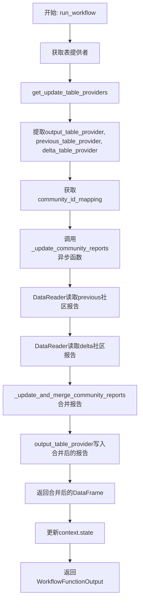
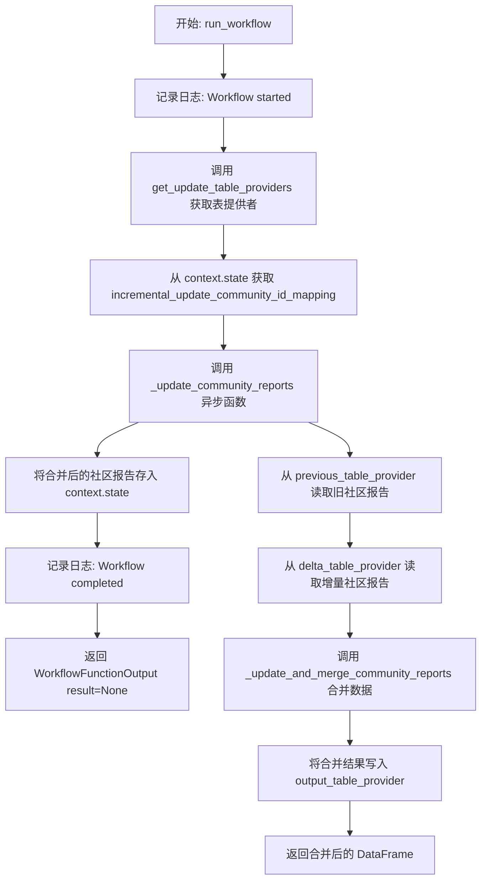
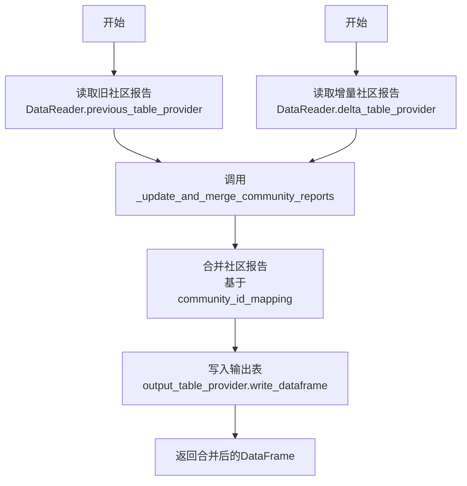

# `graphrag\packages\graphrag\graphrag\index\workflows\update_community_reports.py` 详细设计文档

这是一个增量更新社区报告的工作流模块，负责从增量索引运行中读取旧的和新增的社区报告，通过合并算法将两者整合，并写入到输出表提供者中，同时维护增量更新的社区ID映射关系。

## 整体流程



## 类结构

```
Global
├── logger (logging.Logger)
├── run_workflow (async function)
└── _update_community_reports (async function)
```

## 全局变量及字段


### `logger`
    
模块级日志记录器，用于记录工作流运行过程中的信息

类型：`logging.Logger`
    


    

## 全局函数及方法


### `run_workflow`

异步工作流函数，用于在增量索引运行中更新和合并社区报告。它从三个不同的表提供者（之前的、增量的、输出的）获取数据，通过社区ID映射进行合并，然后将结果写入输出表并存储在运行上下文中。

参数：

- `config`：`GraphRagConfig`，全局配置对象，包含图检索增强生成的各种配置参数
- `context`：`PipelineRunContext`，管道运行上下文，包含状态信息和增量更新的时间戳

返回值：`WorkflowFunctionOutput`，工作流函数输出对象，包含执行结果（此处返回 `result=None`）

#### 流程图



#### 带注释源码

```python
async def run_workflow(
    config: GraphRagConfig,
    context: PipelineRunContext,
) -> WorkflowFunctionOutput:
    """Update the community reports from a incremental index run."""
    # 记录工作流启动日志，用于追踪执行状态
    logger.info("Workflow started: update_community_reports")
    
    # 获取增量更新所需的三个表提供者：
    # 1. output_table_provider - 输出表提供者，用于写入合并后的结果
    # 2. previous_table_provider - 上一次索引运行的表提供者，包含历史数据
    # 3. delta_table_provider - 增量表提供者，包含本次新增/修改的数据
    output_table_provider, previous_table_provider, delta_table_provider = (
        get_update_table_providers(config, context.state["update_timestamp"])
    )

    # 从上下文中获取社区ID映射关系，用于关联新旧社区报告
    community_id_mapping = context.state["incremental_update_community_id_mapping"]

    # 调用内部函数执行实际的社区报告更新和合并逻辑
    merged_community_reports = await _update_community_reports(
        previous_table_provider,
        delta_table_provider,
        output_table_provider,
        community_id_mapping,
    )

    # 将合并后的社区报告存入运行上下文状态，供后续步骤使用
    context.state["incremental_update_merged_community_reports"] = (
        merged_community_reports
    )

    # 记录工作流完成日志
    logger.info("Workflow completed: update_community_reports")
    
    # 返回工作流输出结果（此处结果为 None，表示无直接返回值）
    return WorkflowFunctionOutput(result=None)
```


### `_update_community_reports`

更新社区报告数据，将旧数据和增量数据通过社区ID映射进行合并，并写入输出表。

参数：

- `previous_table_provider`：`TableProvider`，提供历史/旧的社区报告数据
- `delta_table_provider`：`TableProvider`，提供增量/新的社区报告数据
- `output_table_provider`：`TableProvider`，用于写入合并后的社区报告数据
- `community_id_mapping`：`dict`，社区ID映射关系，用于合并时正确关联新旧数据

返回值：`pd.DataFrame`，合并后的社区报告数据

#### 流程图



#### 带注释源码

```python
async def _update_community_reports(
    previous_table_provider: TableProvider,
    delta_table_provider: TableProvider,
    output_table_provider: TableProvider,
    community_id_mapping: dict,
) -> pd.DataFrame:
    """Update the community reports output."""
    
    # 使用DataReader从previous_table_provider读取历史社区报告数据
    old_community_reports = await DataReader(
        previous_table_provider
    ).community_reports()
    
    # 使用DataReader从delta_table_provider读取增量/新的社区报告数据
    delta_community_reports = await DataReader(delta_table_provider).community_reports()
    
    # 调用内部函数_update_and_merge_community_reports执行合并逻辑
    # 合并时会使用community_id_mapping来处理ID映射问题
    merged_community_reports = _update_and_merge_community_reports(
        old_community_reports, delta_community_reports, community_id_mapping
    )

    # 将合并后的社区报告写入输出表
    await output_table_provider.write_dataframe(
        "community_reports", merged_community_reports
    )

    # 返回合并后的DataFrame供调用方使用
    return merged_community_reports
```

## 关键组件


### 社区报告增量更新工作流 (run_workflow)

该模块负责执行增量索引运行中的社区报告更新，通过协调之前的表提供者、增量表提供者和输出表提供者，实现社区报告数据的合并与持久化。

### 异步工作流入口函数 (run_workflow)

异步主函数，作为增量更新社区报告工作流的入口点，负责获取表提供者、调用更新逻辑并将合并结果存储到运行上下文状态中。

### 社区报告更新核心函数 (_update_community_reports)

异步辅助函数，负责从不同表提供者读取社区报告数据，执行合并操作并将结果写入输出表提供者，同时返回合并后的数据帧。

### 增量更新表提供者获取工具 (get_update_table_providers)

从graphrag.index.run.utils模块导入的工具函数，用于根据配置和更新时间戳获取输出表提供者、之前的表提供者和增量表提供者。

### 社区报告数据读取器 (DataReader)

从graphrag.data_model.data_reader模块导入的类，用于从表提供者读取社区报告数据。

### 社区报告合并函数 (_update_and_merge_community_reports)

从graphrag.index.update.communities模块导入的函数，负责将旧的社区报告和增量社区报告根据社区ID映射进行合并。

### 表提供者抽象 (TableProvider)

来自graphrag_storage.tables.table_provider模块的抽象类，提供数据表的读取和写入能力。

### 配置模型 (GraphRagConfig)

来自graphrag.config.models.graph_rag_config的配置模型，包含图谱检索增强生成系统的配置参数。

### 管道运行上下文 (PipelineRunContext)

来自graphrag.index.typing.context的上下文对象，包含管道运行时的状态信息，如更新时间戳和增量更新相关的数据。

### 工作流函数输出 (WorkflowFunctionOutput)

来自graphrag.index.typing.workflow的输出类型定义，用于表示工作流函数的返回结果。


## 问题及建议


### 已知问题

-   **Magic Strings 硬编码**：使用字符串字面量访问 `context.state`，如 `"update_timestamp"`, `"incremental_update_community_id_mapping"`, `"incremental_update_merged_community_reports"`，存在拼写错误风险，缺乏类型安全
-   **缺乏错误处理**：代码没有 try-except 块，`DataReader`、表提供者写入或 `_update_and_merge_community_reports` 可能抛出异常导致工作流直接失败
-   **日志记录不足**：仅在开始和结束时记录日志，缺少关键步骤（如读取数据、合并数据、写入数据）的详细日志，难以排查问题
-   **返回值固定为 None**：`WorkflowFunctionOutput(result=None)` 始终返回 None，增量更新的结果未被传递出去，调用方无法获取合并后的报告数据
-   **依赖未抽象**：直接 `await DataReader(previous_table_provider).community_reports()` 实例化 `DataReader`，不利于单元测试和依赖注入
-   **缺少参数验证**：未验证 `community_id_mapping` 是否为空或有效，传入空字典可能导致合并逻辑异常
-   **文档不完整**：`_update_community_reports` 函数的参数缺少描述，参数名（如 `previous_table_provider`）自身解释性不足

### 优化建议

-   **提取常量**：定义状态键常量和表名常量，避免魔法字符串，如 `UPDATE_TIMESTAMP_KEY = "update_timestamp"`
-   **添加异常处理**：用 try-except 包裹关键操作，捕获并记录异常，必要时重新抛出或返回错误状态
-   **增强日志**：在读取、合并、写入每一步添加 logger.info 或 logger.debug，记录数据行数、耗时等关键指标
-   **返回实际结果**：将 `merged_community_reports` 通过 `WorkflowFunctionOutput` 返回，或至少返回成功标志
-   **依赖注入**：将 `DataReader` 或其工厂作为参数传入，便于单元测试时 mock
-   **参数校验**：在函数入口检查 `community_id_mapping` 是否为有效字典，可抛出明确异常
-   **补充文档**：为 `_update_community_reports` 的参数添加类型提示和描述

## 其它


### 设计目标与约束

本模块的主要设计目标是实现社区报告的增量更新功能，通过对比前一次索引运行的社区报告与新增的增量社区报告，完成社区报告的合并与更新。设计约束包括：1）必须支持异步执行以提高性能；2）依赖GraphRagConfig配置对象和PipelineRunContext运行时上下文；3）需要正确处理社区ID映射关系以确保数据一致性；4）输出结果通过WorkflowFunctionOutput返回，其中result字段为None表示成功执行。

### 错误处理与异常设计

本模块采用分层错误处理策略。在run_workflow主函数中，通过try-except捕获潜在异常并记录日志，异常信息通过logging模块输出便于调试。_update_community_reports函数中，DataReader读取数据可能抛出FileNotFoundException或DataFormatException，TableProvider的write_dataframe方法可能抛出IOError或PermissionError。社区报告合并函数_update_and_merge_community_reports可能抛出KeyError（当community_id_mapping中缺少必要的映射关系时）或ValueError（当输入数据格式不符合预期时）。所有异常均向上传播至调用者，由上层工作流引擎统一处理。

### 数据流与状态机

数据流遵循以下路径：输入阶段通过get_update_table_providers获取三个TableProvider实例（output、previous、delta），同时从context.state中提取incremental_update_community_id_mapping映射字典；处理阶段通过DataReader分别读取previous_table_provider和delta_table_provider中的community_reports表数据，调用_update_and_merge_community_reports进行合并；输出阶段将合并后的DataFrame通过output_table_provider.write_dataframe写入"community_reports"表，并将结果存储至context.state的incremental_update_merged_community_reports键下。状态转换包括：初始状态（获取providers和mapping）→读取状态（加载旧数据和增量数据）→合并状态（执行合并算法）→写入状态（持久化结果）→完成状态（返回WorkflowFunctionOutput）。

### 外部依赖与接口契约

本模块依赖以下外部组件：1）graphrag_storage.tables.table_provider.TableProvider接口，定义write_dataframe方法和数据表读写能力；2）graphrag.config.models.graph_rag_config.GraphRagConfig配置模型，提供索引运行所需的配置参数；3）graphrag.index.typing.context.PipelineRunContext运行时上下文，包含state字典用于存储中间状态和结果；4）graphrag.index.typing.workflow.WorkflowFunctionOutput工作流输出包装类；5）graphrag.data_model.data_reader.DataReader数据读取器，提供community_reports()方法读取社区报告；6）graphrag.index.update.communities._update_and_merge_community_reports社区报告合并函数，接收旧报告、增量报告和ID映射，返回合并后的DataFrame；7）pandas库用于DataFrame数据结构操作；8）logging模块用于日志记录。

### 性能考量

性能优化主要体现在以下方面：1）使用async/await实现异步IO操作，避免阻塞事件循环；2）通过增量更新策略减少全量重新计算开销，仅处理新增或变更的社区报告；3）社区ID映射采用字典数据结构，实现O(1)查找效率；4）数据写入采用批量写入方式，通过write_dataframe一次性持久化整个DataFrame。潜在性能瓶颈包括：大规模社区报告合并时的内存占用、TableProvider网络IO延迟、DataReader读取大量历史数据的耗时。建议在生产环境中监控这些指标，必要时引入分页读取或流式处理机制。

### 安全性考量

本模块不直接处理用户输入，安全性风险较低。但需注意：1）GraphRagConfig和PipelineRunContext来源于外部配置和运行时环境，需验证其非空性和有效性；2）community_id_mapping来自context.state，需确保上游正确初始化；3）TableProvider的数据源路径需进行路径遍历检查，防止恶意路径注入；4）日志输出需避免敏感信息泄露，建议在生产环境使用脱敏日志策略。

### 兼容性考量

本模块设计需兼容以下版本：1）Python 3.8+（支持async/await语法）；2）pandas 1.0+（DataFrame操作API）；3）graphrag核心库各版本间的接口兼容性。TableProvider和DataReader接口需保持稳定，新版本应提供向后兼容的适配层。社区报告的数据模式（schema）变更需通过版本控制管理，确保增量更新算法能够正确处理不同版本的输入数据。

### 测试策略

建议采用以下测试策略：1）单元测试：针对_update_community_reports函数设计测试用例，模拟三个TableProvider和community_id_mapping，验证合并逻辑正确性和输出DataFrame结构；2）集成测试：与完整的索引管道集成，验证增量更新在真实数据场景下的正确性；3）边界测试：测试空社区报告、单条记录、重复ID、缺失映射等边界条件；4）性能测试：在不同规模数据集上测量执行时间和内存占用，建立性能基线。

### 部署配置

部署时需确保以下配置就绪：1）logging配置需正确初始化，建议设置级别为INFO并配置合适的handler；2）TableProvider的存储后端需提前配置好，包括output、previous、delta三类存储位置；3）context.state中的incremental_update_community_id_mapping和update_timestamp需由上层工作流正确初始化；4）如需分布式部署，需确保所有worker能访问共享的TableProvider存储。

### 配置参数

关键配置项包括：1）GraphRagConfig中的索引相关配置（存储路径、缓冲区大小等）；2）context.state["update_timestamp"]时间戳用于确定增量数据的范围；3）community_id_mapping字典的构建策略（建议在索引初始化阶段预计算并缓存）；4）output_table_provider的写入策略（同步/异步、压缩选项等）。


    