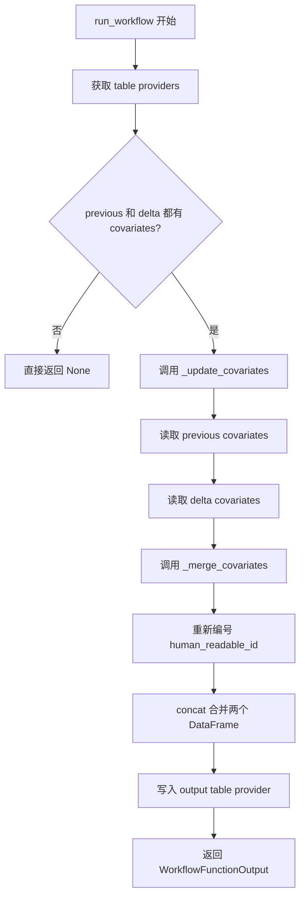
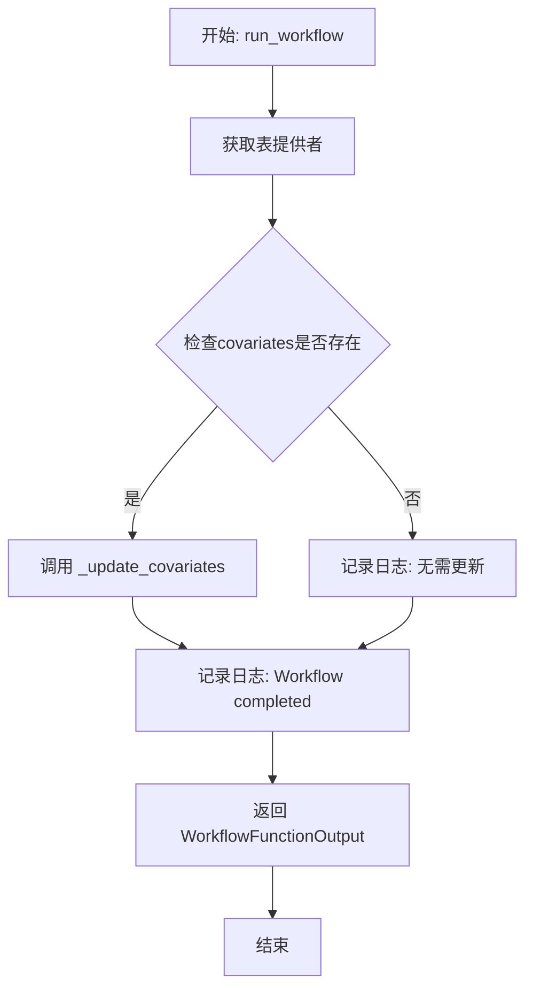
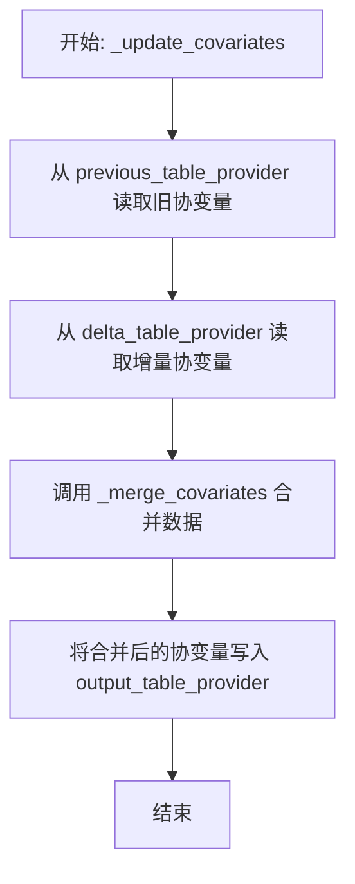
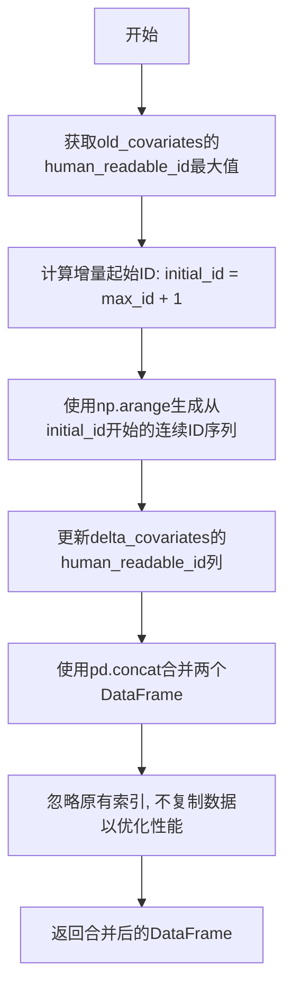

# `graphrag\packages\graphrag\graphrag\index\workflows\update_covariates.py` 详细设计文档

这是一个异步工作流模块，用于在增量索引运行时更新协变量(covariates)数据。它从previous和delta两个数据源读取covariates，合并后写入输出表，主要解决增量数据合并时的ID连续性问题。

## 整体流程



## 类结构

```
此模块为扁平结构，无继承关系
包含3个函数：run_workflow(公开), _update_covariates(私有), _merge_covariates(私有)
```

## 全局变量及字段


### `logger`
    
模块级日志记录器，用于记录工作流执行过程中的信息日志

类型：`logging.Logger`
    


    

## 全局函数及方法


### run_workflow

这是一个异步主工作流函数，用于从增量索引运行中更新协变量（covariates）。它检查是否存在先前的和增量的协变量数据，如果存在则合并它们。

参数：

- `config`：`GraphRagConfig`，图形RAG配置对象，包含索引运行所需的配置参数
- `context`：`PipelineRunContext`，管道运行上下文，提供状态信息（如更新时间戳）

返回值：`WorkflowFunctionOutput`，工作流函数输出对象，此处返回结果为 None

#### 流程图



#### 带注释源码

```python
async def run_workflow(
    config: GraphRagConfig,
    context: PipelineRunContext,
) -> WorkflowFunctionOutput:
    """Update the covariates from a incremental index run."""
    logger.info("Workflow started: update_covariates")
    
    # 获取更新所需的表提供者：输出表提供者、上一时刻表提供者、增量表提供者
    output_table_provider, previous_table_provider, delta_table_provider = (
        get_update_table_providers(config, context.state["update_timestamp"])
    )

    # 检查上一时刻和增量表中是否都存在covariates数据
    if await previous_table_provider.has(
        "covariates"
    ) and await delta_table_provider.has("covariates"):
        logger.info("Updating Covariates")
        # 执行协变量更新操作
        await _update_covariates(
            previous_table_provider, delta_table_provider, output_table_provider
        )

    logger.info("Workflow completed: update_covariates")
    # 返回结果为None的WorkFlow输出对象
    return WorkflowFunctionOutput(result=None)
```


### `_update_covariates`

这是一个异步私有函数，负责从增量索引运行中更新协变量数据。它读取旧的协变量和增量协变量，合并它们，并写入输出表。

参数：

- `previous_table_provider`：`TableProvider`，提供历史/上一版本的协变量数据表
- `delta_table_provider`：`TableProvider`，提供增量/新版本的协变量数据表
- `output_table_provider`：`TableProvider`，用于写入合并后的协变量结果

返回值：`None`，该函数执行副作用（写入数据），不返回任何值

#### 流程图



#### 带注释源码

```python
async def _update_covariates(
    previous_table_provider: TableProvider,
    delta_table_provider: TableProvider,
    output_table_provider: TableProvider,
) -> None:
    """Update the covariates output."""
    # 使用 DataReader 从之前的表提供者读取历史协变量数据
    old_covariates = await DataReader(previous_table_provider).covariates()
    
    # 使用 DataReader 从增量表提供者读取新增的协变量数据
    delta_covariates = await DataReader(delta_table_provider).covariates()
    
    # 调用内部函数 _merge_covariates 将旧数据和增量数据合并
    merged_covariates = _merge_covariates(old_covariates, delta_covariates)

    # 将合并后的协变量数据写入输出表提供者，持久化存储
    await output_table_provider.write_dataframe("covariates", merged_covariates)
```


### `_merge_covariates`

这是一个同步私有函数，负责将旧的covariates与增量的covariates进行合并，并对增量数据的`human_readable_id`字段进行重新编号，以确保ID的连续性和唯一性。

参数：

- `old_covariates`：`pd.DataFrame`，旧的covariates数据，包含历史记录
- `delta_covariates`：`pd.DataFrame`，新增加的covariates数据，需要进行ID重编号

返回值：`pd.DataFrame`，合并后的covariates数据

#### 流程图



#### 带注释源码

```python
def _merge_covariates(
    old_covariates: pd.DataFrame, delta_covariates: pd.DataFrame
) -> pd.DataFrame:
    """Merge the covariates.

    Parameters
    ----------
    old_covariates : pd.DataFrame
        The old covariates.
    delta_covariates : pd.DataFrame
        The delta covariates.

    Returns
    -------
    pd.DataFrame
        The merged covariates.
    """
    # 获取旧covariates中human_readable_id的最大值，作为增量ID的起始点
    # 例如：旧数据最大ID为100，则增量数据从101开始编号
    initial_id = old_covariates["human_readable_id"].max() + 1
    
    # 使用numpy的arange生成从initial_id开始的连续整数序列
    # 序列长度与增量数据行数相同，实现ID的自动递增
    delta_covariates["human_readable_id"] = np.arange(
        initial_id, initial_id + len(delta_covariates)
    )

    # 使用pandas concat合并两个DataFrame
    # ignore_index=True: 忽略原有索引，重新生成0到n-1的连续索引
    # copy=False: 避免不必要的数据复制，提高性能（仅在满足条件时生效）
    return pd.concat([old_covariates, delta_covariates], ignore_index=True, copy=False)
```

## 关键组件


### 增量协变量更新工作流 (Incremental Covariates Update Workflow)

负责从增量索引运行中更新协变量数据，管理工作流程的执行流程和状态管理。

### 协变量合并逻辑 (Covariates Merging Logic)

将旧的协变量与增量协变量进行合并，包括ID重新分配和数据拼接操作。

### 表提供者管理 (Table Provider Management)

管理三个表提供者：previous_table_provider（旧数据）、delta_table_provider（增量数据）和output_table_provider（输出数据），支持数据的增量更新。

### 数据读取器 (DataReader)

异步读取协变量数据，支持从不同的表提供者获取数据。

### ID重新分配机制 (ID Reassignment Mechanism)

使用numpy.arange为增量协变量重新生成连续的人类可读ID，确保ID的连续性和唯一性。

### 异步工作流输出 (Async Workflow Output)

返回WorkflowFunctionOutput结果，支持异步工作流的标准化输出格式。


## 问题及建议


### 已知问题

- **空 DataFrame 处理缺失**: 当 `old_covariates` DataFrame 为空时，调用 `max()` 方法会返回 `NaN`，导致后续计算失败
- **缺失列验证缺失**: 未验证 `human_readable_id` 列是否存在或包含有效数据，运行时可能抛出 KeyError
- **错误处理不足**: 缺少 try-except 块，任何 TableProvider 或 DataReader 操作失败都会导致整个工作流崩溃
- **日志记录不完整**: 仅记录开始和完成状态，缺少关键操作步骤、警告和错误信息
- **返回值设计**: 始终返回 `result=None`，未能提供任何有意义的输出信息给调用方
- **类型注解不完整**: `WorkflowFunctionOutput` 的具体类型未在代码中体现，无法静态验证返回值结构

### 优化建议

- **添加空 DataFrame 保护**: 在调用 `max()` 前检查 DataFrame 是否为空，空数据应设置初始 ID 为 0
- **添加列存在性检查**: 使用 `if "human_readable_id" in old_covariates.columns` 验证列存在性
- **增强错误处理**: 为所有异步 IO 操作添加 try-except 块，捕获并记录具体异常信息
- **完善日志记录**: 在关键步骤（如读取、合并、写入数据）添加详细日志，包含数据行数等信息
- **优化返回值**: 根据实际需求返回有意义的 `WorkflowFunctionOutput`，如合并后的记录数或状态信息
- **添加数据验证**: 验证合并后的 DataFrame 结构是否符合预期，确保必要列存在

## 其它


### 设计目标与约束

该模块的核心设计目标是实现增量索引运行时协变量(covariates)数据的更新功能。通过区分旧数据(previous)、增量数据(delta)和输出数据(output)三个表格提供者，实现高效的数据合并。设计约束包括：仅在previous和delta表都存在covariates时才执行更新操作；使用pandas DataFrame进行数据处理；依赖异步IO操作以提高性能。

### 错误处理与异常设计

代码中主要依赖TableProvider和DataReader的异步方法进行数据读写。潜在异常场景包括：1)previous_table_provider或delta_table_provider的has方法返回False时，不执行更新直接返回；2)DataReader读取covariates失败时抛出异常；3)human_readable_id字段缺失或类型不匹配时会导致KeyError或类型错误；4)空DataFrame时max()方法可能返回NaN。建议增加缺失字段的默认值处理、DataFrame为空时的边界检查、以及完整的try-except包装。

### 数据流与状态机

数据流如下：1)获取三个TableProvider实例(previous、delta、output)；2)检查previous和delta表是否都包含covariates；3)使用DataReader分别读取old_covariates和delta_covariates；4)调用_merge_covariates进行数据合并(重新编号human_readable_id并concat)；5)将合并结果写入output表的covariates表。状态机包含：初始状态→检查状态→读取状态→合并状态→写入状态→完成状态。

### 外部依赖与接口契约

主要依赖包括：1)graphrag_storage.tables.table_provider.TableProvider - 表格数据存储抽象；2)graphrag.config.models.graph_rag_config.GraphRagConfig - 配置模型；3)graphrag.data_model.data_reader.DataReader - 数据读取器；4)graphrag.index.run.utils.get_update_table_providers - 获取表格提供者工具函数；5)graphrag.index.typing.context.PipelineRunContext - 管道运行上下文；6)graphrag.index.typing.workflow.WorkflowFunctionOutput - 工作流输出类型；7)numpy和pandas库。接口契约：run_workflow接收config和context参数，返回WorkflowFunctionOutput；_update_covariates和_merge_covariates为内部函数。

### 性能考量

当前实现存在以下性能优化空间：1)pd.concat使用copy=False可减少内存复制，但大规模数据时仍可能面临内存压力；2)human_readable_id的重新编号使用np.arange，对于超大DataFrame效率可进一步优化；3)未实现批量写入或流式处理，内存占用随数据量线性增长；4)缺少缓存机制，重复运行时可能重复读取相同数据。建议在数据量级较大时考虑分批处理或使用更高效的数据结构。

### 安全性考虑

代码本身不直接处理用户输入，但通过config和context参数间接接收配置。当前安全考量包括：1)config参数应确保来自可信配置源；2)context.state中的update_timestamp应验证其有效性和格式；3)DataReader读取的数据应验证schema一致性；4)写入output_table_provider时应处理可能的权限问题。建议增加输入验证和权限检查逻辑。

### 配置参数说明

该模块涉及的关键配置通过GraphRagConfig传入，主要包括：1)update_timestamp - 增量更新的时间戳，用于确定previous和delta数据的分界；2)TableProvider相关的存储配置(类型、路径、连接参数等)；3)可能的数据格式配置。配置验证应在模块入口处完成，确保必要配置项存在且类型正确。

### 测试策略

建议的测试覆盖包括：1)单元测试：_merge_covariates函数的边界情况(empty DataFrame、single row、duplicate IDs)；2)集成测试：run_workflow的完整流程模拟(使用mock TableProvider)；3)性能测试：大规模数据合并的内存和耗时评估；4)异常测试：各种失败场景(读取失败、字段缺失、数据类型错误)。测试数据应包含正常场景、边界场景和异常场景。

### 部署与运维注意事项

部署时需确保：1)graphrag-storage、numpy、pandas等依赖正确安装；2)TableProvider的后端存储可用且配置正确；3)异步运行时(asyncio)正确配置。运维关注点：1)增量更新日志监控；2)数据合并结果的正确性校验；3)长时间运行时的资源监控；4)故障恢复机制(数据一致性问题)。建议增加详细的日志记录和数据校验逻辑。

    