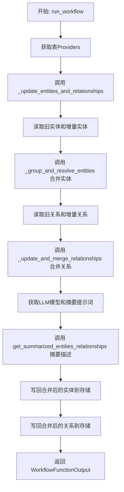
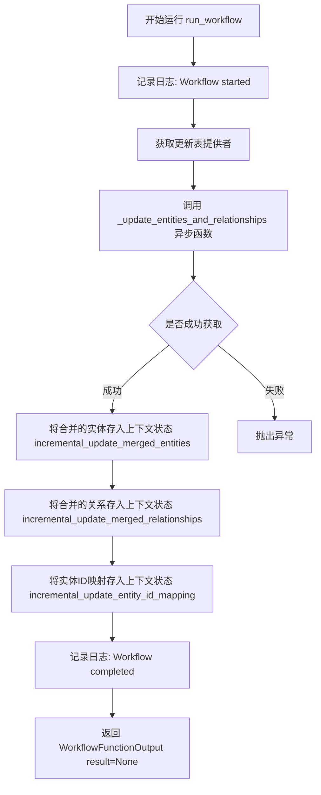
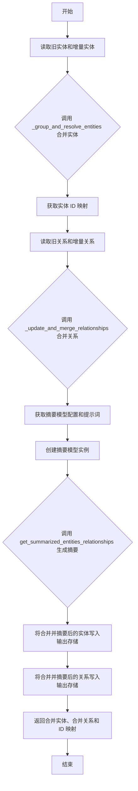

# `graphrag\packages\graphrag\graphrag\index\workflows\update_entities_relationships.py` 详细设计文档

该模块实现了一个增量索引工作流，用于更新图谱中的实体和关系。它通过读取先前状态和增量数据源，合并实体和关系，使用LLM对实体描述进行摘要，最后将更新后的数据写回存储。

## 整体流程



## 类结构

```
该文件为模块文件，不包含类定义
主要包含两个异步函数: run_workflow (公开接口) 和 _update_entities_and_relationships (私有实现)
```

## 全局变量及字段


### `output_table_provider`
    
输出表提供者，用于写入更新后的实体和关系数据

类型：`TableProvider`
    


### `previous_table_provider`
    
上一次索引运行的表提供者，包含历史的实体和关系数据

类型：`TableProvider`
    


### `delta_table_provider`
    
增量表提供者，包含本次新增或变更的实体和关系数据

类型：`TableProvider`
    


### `merged_entities_df`
    
合并后的实体数据DataFrame，包含去重和解析后的实体记录

类型：`pd.DataFrame`
    


### `merged_relationships_df`
    
合并后的关系数据DataFrame，包含去重和合并后的关系记录

类型：`pd.DataFrame`
    


### `entity_id_mapping`
    
实体ID映射字典，用于追踪旧实体ID到新实体ID的映射关系

类型：`dict`
    


### `old_entities`
    
从上次索引运行中读取的历史实体数据

类型：`pd.DataFrame`
    


### `delta_entities`
    
从增量数据中读取的新增实体数据

类型：`pd.DataFrame`
    


### `old_relationships`
    
从上次索引运行中读取的历史关系数据

类型：`pd.DataFrame`
    


### `delta_relationships`
    
从增量数据中读取的新增关系数据

类型：`pd.DataFrame`
    


### `summarization_model_config`
    
摘要生成模型的配置对象，用于描述摘要任务的模型参数

类型：`CompletionModelConfig`
    


### `prompts`
    
解析后的提示词对象，包含用于摘要生成的提示模板

类型：`ResolvedPrompts`
    


### `model`
    
创建的大语言模型实例，用于生成实体描述的摘要

类型：`Completion`
    


    

## 全局函数及方法


### `run_workflow`

更新增量索引运行中的实体和关系，将之前的实体与增量实体合并，处理关系，并生成汇总描述。

参数：

- `config`：`GraphRagConfig`，GraphRAG 的配置对象，包含模型配置、摘要配置等
- `context`：`PipelineRunContext`，管道运行上下文，包含缓存、回调、状态等信息

返回值：`WorkflowFunctionOutput`，工作流函数的输出结果

#### 流程图



#### 带注释源码

```python
async def run_workflow(
    config: GraphRagConfig,
    context: PipelineRunContext,
) -> WorkflowFunctionOutput:
    """Update the entities and relationships from a incremental index run."""
    # 记录工作流开始日志
    logger.info("Workflow started: update_entities_relationships")
    
    # 获取更新所需的表提供者：输出表提供者、之前的表提供者、增量表提供者
    # 根据 context.state["update_timestamp"] 获取对应时间戳的数据
    output_table_provider, previous_table_provider, delta_table_provider = (
        get_update_table_providers(config, context.state["update_timestamp"])
    )

    # 调用异步函数执行实体和关系的合并更新
    (
        merged_entities_df,           # 合并后的实体 DataFrame
        merged_relationships_df,      # 合并后的关系 DataFrame
        entity_id_mapping,            # 实体ID映射字典
    ) = await _update_entities_and_relationships(
        previous_table_provider,      # 之前的表提供者
        delta_table_provider,         # 增量表提供者
        output_table_provider,        # 输出表提供者
        config,                       # GraphRAG 配置
        context.cache,                # 缓存对象
        context.callbacks,            # 工作流回调
    )

    # 将合并后的实体存入上下文状态，供后续步骤使用
    context.state["incremental_update_merged_entities"] = merged_entities_df
    # 将合并后的关系存入上下文状态
    context.state["incremental_update_merged_relationships"] = merged_relationships_df
    # 将实体ID映射存入上下文状态，用于追踪实体变化
    context.state["incremental_update_entity_id_mapping"] = entity_id_mapping

    # 记录工作流完成日志
    logger.info("Workflow completed: update_entities_relationships")
    # 返回工作流输出，结果为 None
    return WorkflowFunctionOutput(result=None)
```


### `_update_entities_and_relationships`

该函数是一个异步函数，用于从增量索引运行中更新和合并实体与关系。它读取旧的实体/关系和增量实体/关系，进行合并处理，生成摘要，并将更新后的实体和关系保存回存储。

参数：

- `previous_table_provider`：`TableProvider`，提供上一轮索引运行的实体和关系数据
- `delta_table_provider`：`TableProvider`，提供本轮增量更新的实体和关系数据
- `output_table_provider`：`TableProvider`，用于写入合并后的实体和关系数据
- `config`：`GraphRagConfig`，GraphRag 配置对象，包含摘要长度、输入 token 限制等配置
- `cache`：`Cache`，缓存实例，用于模型调用的缓存管理
- `callbacks`：`WorkflowCallbacks`，工作流回调函数，用于处理进度和状态更新

返回值：`tuple[pd.DataFrame, pd.DataFrame, dict]`，返回合并后的实体 DataFrame、合并后的关系 DataFrame 以及实体 ID 映射字典

#### 流程图



#### 带注释源码

```python
async def _update_entities_and_relationships(
    previous_table_provider: TableProvider,
    delta_table_provider: TableProvider,
    output_table_provider: TableProvider,
    config: GraphRagConfig,
    cache: Cache,
    callbacks: WorkflowCallbacks,
) -> tuple[pd.DataFrame, pd.DataFrame, dict]:
    """Update Final Entities  and Relationships output."""
    
    # 从之前的表提供者和增量表提供者读取实体数据
    old_entities = await DataReader(previous_table_provider).entities()
    delta_entities = await DataReader(delta_table_provider).entities()

    # 调用 _group_and_resolve_entities 函数对旧实体和增量实体进行分组和解析
    # 返回合并后的实体 DataFrame 和实体 ID 映射关系
    merged_entities_df, entity_id_mapping = _group_and_resolve_entities(
        old_entities, delta_entities
    )

    # Update Relationships
    # 读取旧关系和增量关系数据
    old_relationships = await DataReader(previous_table_provider).relationships()
    delta_relationships = await DataReader(delta_table_provider).relationships()
    
    # 调用 _update_and_merge_relationships 函数合并关系数据
    merged_relationships_df = _update_and_merge_relationships(
        old_relationships,
        delta_relationships,
    )

    # 获取摘要模型配置，用于生成实体和关系的描述摘要
    summarization_model_config = config.get_completion_model_config(
        config.summarize_descriptions.completion_model_id
    )
    # 获取解析后的提示词模板
    prompts = config.summarize_descriptions.resolved_prompts()
    # 创建摘要模型实例，使用子缓存进行缓存管理
    model = create_completion(
        summarization_model_config,
        cache=cache.child("summarize_descriptions"),
        cache_key_creator=cache_key_creator,
    )

    # 调用 get_summarized_entities_relationships 函数对合并后的实体和关系进行摘要生成
    # 使用回调处理进度，最大摘要长度和输入 token 限制由配置指定
    (
        merged_entities_df,
        merged_relationships_df,
    ) = await get_summarized_entities_relationships(
        extracted_entities=merged_entities_df,
        extracted_relationships=merged_relationships_df,
        callbacks=callbacks,
        model=model,
        max_summary_length=config.summarize_descriptions.max_length,
        max_input_tokens=config.summarize_descriptions.max_input_tokens,
        summarization_prompt=prompts.summarize_prompt,
        num_threads=config.concurrent_requests,
    )

    # Save the updated entities back to storage
    # 将合并并摘要后的实体数据写入输出存储的 'entities' 表
    await output_table_provider.write_dataframe("entities", merged_entities_df)
    # 将合并并摘要后的关系数据写入输出存储的 'relationships' 表
    await output_table_provider.write_dataframe(
        "relationships", merged_relationships_df
    )

    # 返回合并后的实体 DataFrame、关系 DataFrame 和实体 ID 映射字典
    return merged_entities_df, merged_relationships_df, entity_id_mapping
```

## 关键组件


### 增量更新机制 (Incremental Update Mechanism)

使用get_update_table_providers获取三个表提供程序（output、previous、delta），通过比较时间戳实现增量数据的识别和加载，支持惰性加载避免全量数据处理。

### 数据读取器 (DataReader)

从不同的TableProvider中异步读取entities和relationships数据，通过统一的接口支持旧数据和增量数据的加载。

### 实体解析与合并 (Entity Resolution & Merge)

_group_and_resolve_entities函数对旧实体和增量实体进行分组、冲突解决和合并，生成统一的实体DataFrame并输出实体ID映射关系。

### 关系更新与合并 (Relationship Update & Merge)

_update_and_merge_relationships函数处理旧关系和增量关系的合并逻辑，确保关系的完整性和一致性。

### 摘要生成 (Summarization)

get_summarized_entities_relationships使用LLM对实体和关系进行摘要，通过max_summary_length和max_input_tokens控制摘要长度，支持并发处理。

### 表数据写入 (Table Data Persistence)

output_table_provider.write_dataframe将合并后的实体和关系写回存储，完成增量更新的闭环。

### 配置驱动 (Configuration Driven)

通过GraphRagConfig控制摘要模型选择、提示词模板、并发线程数等参数，实现策略的可配置化。


## 问题及建议


### 已知问题

-   **缺乏错误处理机制**：整个工作流没有try-except块，任何异常都会导致工作流直接失败，缺乏容错能力
-   **串行执行可并行化操作**：old_entities和old_relationships的读取、delta_entities和delta_relationships的读取都是串行执行的，可以并行化以提升性能
-   **缺少中间状态日志**：只在开始和结束时记录日志，中间过程（如数据读取、合并、摘要）没有日志，无法追踪问题
-   **硬编码字符串重复**：表名"entities"和"relationships"在多处重复，状态键如"update_timestamp"等也是硬编码，应提取为常量
-   **配置依赖未校验**：config对象的多个方法（如summarize_descriptions、get_completion_model_config等）被直接调用，没有预先校验配置的有效性
-   **模型初始化缺乏错误处理**：create_completion调用如果失败，没有优雅的降级方案
-   **内存压力风险**：merged_entities_df和merged_relationships_df在内存中多次传递，对于大规模数据集可能导致内存溢出

### 优化建议

-   **添加异常处理**：为关键操作（数据读取、模型调用、数据写入）添加try-except块，实现优雅的错误处理和重试逻辑
-   **并行化数据读取**：使用asyncio.gather并行读取old/delta的entities和relationships
-   **增加详细日志**：在关键步骤添加info/debug日志，记录数据行数、处理状态等信息
-   **提取常量**：将表名和状态键提取为模块级常量，避免字符串重复和拼写错误
-   **添加配置校验**：在函数入口处校验必要配置的存在性和有效性，提前失败
-   **实现流式处理**：对于大数据集，考虑使用生成器模式或分批处理，避免一次性加载全部数据到内存
-   **添加超时控制**：为异步操作（尤其是LLM调用）设置合理的超时时间，防止无限等待
-   **考虑缓存降级**：当缓存不可用时，应能正常运行，而不是完全失败


## 其它


### 设计目标与约束

本工作流的核心设计目标是在增量索引运行时更新和合并实体（entities）与关系（relationships），实现知识图谱的增量更新而非全量重建。主要约束包括：1）仅处理自上次更新以来的增量数据（delta），避免全量重处理以提升性能；2）实体ID映射需保证一致性，确保合并后的实体可追溯；3）依赖外部LLM进行描述摘要，存在网络延迟和API调用失败风险。

### 错误处理与异常设计

代码中主要通过try-except捕获异常（虽然当前代码片段未显示显式异常处理），但关键风险点包括：1）TableProvider读取/写入失败时抛出异常导致工作流中断；2）LLM调用失败时get_summarized_entities_relationships会传播异常；3）DataReader返回空DataFrame时的边界情况处理。建议增加：a) 对TableProvider操作的重试机制；b) LLM调用失败时的降级策略（如跳过摘要直接合并）；c) 空数据情况的显式处理和日志记录。

### 数据流与状态机

数据流如下：1) 读取阶段：从previous_table_provider和delta_table_provider分别读取old_entities、delta_entities、old_relationships、delta_relationships；2) 合并阶段：调用_group_and_resolve_entities合并实体，调用_update_and_merge_relationships合并关系；3) 摘要阶段：调用get_summarized_entities_relationships使用LLM对实体和关系描述进行摘要；4) 写入阶段：将merged_entities_df和merged_relationships_df写入output_table_provider。状态机涉及：init（初始状态）→ reading（读取数据）→ merging（合并数据）→ summarizing（LLM摘要）→ writing（写入存储）→ completed（完成）。

### 外部依赖与接口契约

本模块依赖以下外部组件：1) TableProvider接口 - 必须实现read_dataframe和write_dataframe方法，用于持久化实体和关系数据；2) DataReader类 - 需提供entities()和relationships()异步方法返回pandas DataFrame；3) Cache接口 - 提供child()方法创建子缓存，存储LLM调用结果；4) LLM模型 - 通过create_completion创建，需支持异步调用；5) WorkflowCallbacks - 回调接口用于进度通知和错误报告。所有接口均需保证线程安全性和异步兼容性。

### 配置参数说明

关键配置参数包括：1) config.summarize_descriptions.completion_model_id - 指定用于摘要的LLM模型；2) config.summarize_descriptions.max_length - 摘要最大长度限制；3) config.summarize_descriptions.max_input_tokens - 输入token上限；4) config.concurrent_requests - 并发请求线程数，控制LLM调用并发度；5) context.state["update_timestamp"] - 增量更新时间戳，用于确定delta数据范围。这些参数直接影响处理性能和输出质量。

### 并发与异步设计

代码使用async/await实现异步处理，主要并发点包括：1) 多个DataReader异步读取操作可并行执行；2) LLM摘要调用通过num_threads控制并发数；3) TableProvider写操作可考虑批量异步写入。当前设计为串行读取后合并，建议优化：a) 同时发起previous和delta的entities/relationships读取；b) 合并和摘要阶段可流水化处理；c) 写入操作可后台异步执行不影响返回值计算。

### 缓存策略

代码使用两层缓存：1) context.cache.child("summarization") - 用于缓存LLM摘要结果，键值由cache_key_creator生成；2) TableProvider自身可能包含底层存储缓存。缓存失效策略：增量更新时需考虑旧缓存条目是否仍有效，建议在entity_id_mapping变化时主动清除相关缓存条目。当前设计在增量更新场景下缓存命中率可能较低，需评估缓存有效性。

### 性能考量与优化空间

当前性能瓶颈：1) LLM摘要调用是主要延迟来源，max_input_tokens和max_length需合理配置；2) 全量DataFrame内存操作可能在大规模数据下导致内存压力；3) 串行写入两个表。优化建议：a) 实施流式处理分批合并实体；b) 批量写入减少IO次数；c) 考虑增量摘要仅处理新增或变更的实体描述；d) 添加处理进度回调便于长时间运行监控。

### 安全性考虑

当前代码安全考量：1) 无敏感数据直接暴露，仅处理实体和关系元数据；2) LLM调用需防止提示注入攻击，prompts应经过验证；3) 文件路径和表名未做严格校验可能存在注入风险；4) 并发场景下需防止race condition导致数据不一致。建议增加：输入数据校验、权限控制、日志脱敏处理。

### 测试策略建议

建议补充的测试覆盖：1) 单元测试：_group_and_resolve_entities和_update_and_merge_relationships的边界条件（空输入、重复ID、冲突数据）；2) 集成测试：模拟增量更新完整流程，验证数据一致性；3) 性能测试：大规模实体合并和LLM调用延迟；4) 故障恢复测试：LLM调用失败、存储写入失败场景下的行为；5) 并发测试：多线程场景下缓存和状态竞争条件。

### 日志与可观测性

当前仅在函数入口和完成时记录INFO级别日志，建议增强：1) 添加各阶段耗时统计；2) 记录合并的实体/关系数量和ID映射详情；3) LLM调用失败时记录完整错误上下文；4) 添加度量指标（处理行数、token消耗、缓存命中率）便于运维监控。

### 版本兼容性

代码依赖多个内部模块，需注意：1) GraphRagConfig结构变更可能影响配置读取；2) DataReader接口变化需同步更新；3) TableProvider不同实现（内存/文件/数据库）的兼容性；4) LLM API版本升级时的适配。建议在文档中明确支持的依赖版本范围。


    