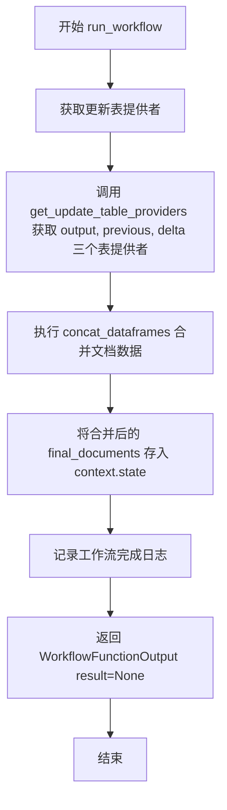

# `graphrag\packages\graphrag\graphrag\index\workflows\update_final_documents.py` 详细设计文档

这是一个增量索引更新工作流模块，通过合并前一个状态表、增量表和输出表提供者中的documents数据帧来更新最终文档，并将其存储到流水线运行上下文的增量更新状态中。

## 整体流程

```mermaid
graph TD
    A[开始: run_workflow] --> B[记录日志: Workflow started]
B --> C[获取更新表提供者]
C --> D[调用get_update_table_providers获取output_table_provider, previous_table_provider, delta_table_provider]
D --> E[异步合并数据帧]
E --> F[调用concat_dataframes合并documents]
F --> G[更新上下文状态]
G --> H[设置context.state['incremental_update_final_documents'] = final_documents]
H --> I[记录日志: Workflow completed]
I --> J[返回WorkflowFunctionOutput(result=None)]
J --> K[结束]
```

## 类结构

```
模块: update_final_documents
└── 全局函数: run_workflow (异步函数)
```

## 全局变量及字段


### `logger`
    
模块级日志记录器，用于记录工作流执行信息

类型：`logging.Logger`
    


    

## 全局函数及方法


### `run_workflow`

这是一个异步全局函数，用于执行增量文档更新工作流，接收 GraphRagConfig 和 PipelineRunContext 作为参数，通过合并先前表、增量表和输出表中的文档数据，更新上下文中存储的最终文档，并返回 WorkflowFunctionOutput。

参数：

- `config`：`GraphRagConfig`，全局配置对象，包含图谱检索增强生成的配置信息
- `context`：`PipelineRunContext`，管道运行上下文，包含状态信息和更新相关的数据

返回值：`WorkflowFunctionOutput`，表示工作流函数的输出结果，此处返回 `result=None` 表示成功完成更新操作

#### 流程图



#### 带注释源码

```python
# 异步全局函数：执行增量文档更新工作流
# 接收配置和上下文参数，返回工作流输出结果
async def run_workflow(
    config: GraphRagConfig,      # 全局配置对象，包含图谱RAG配置
    context: PipelineRunContext, # 管道运行上下文，包含状态和元数据
) -> WorkflowFunctionOutput:     # 工作流函数输出结果
    """Update the documents from a incremental index run."""
    
    # 记录工作流开始日志
    logger.info("Workflow started: update_final_documents")
    
    # 获取更新表提供者：output表（当前输出）、previous表（之前数据）、delta表（增量数据）
    # 根据 context.state["update_timestamp"] 获取对应时间戳的数据
    output_table_provider, previous_table_provider, delta_table_provider = (
        get_update_table_providers(config, context.state["update_timestamp"])
    )

    # 合并三个数据源中的 documents 数据帧
    # 优先级：output > delta > previous（后者覆盖前者）
    final_documents = await concat_dataframes(
        "documents",               # 数据表名称
        previous_table_provider,  # 之前的数据提供者
        delta_table_provider,      # 增量数据提供者
        output_table_provider,    # 输出数据提供者
    )

    # 将合并后的最终文档存入上下文状态，供后续步骤使用
    context.state["incremental_update_final_documents"] = final_documents

    # 记录工作流完成日志
    logger.info("Workflow completed: update_final_documents")
    
    # 返回工作流输出结果（此处 result 为 None 表示成功执行）
    return WorkflowFunctionOutput(result=None)
```

## 关键组件


### run_workflow 函数

异步工作流函数，用于执行增量索引更新操作，通过获取输出表提供者、之前表提供者和增量表提供者，将文档数据合并到增量更新上下文中

### get_update_table_providers 函数

根据配置和时间戳获取三类表提供者（output、previous、delta），用于支持增量索引的读写操作

### concat_dataframes 函数

将多个表提供者的数据按名称合并为统一的数据帧，支持增量更新中的数据聚合

### GraphRagConfig 配置模型

GraphRAG 系统的配置类，封装了图索引和检索增强生成的所有配置参数

### PipelineRunContext 管道运行上下文

包含管道运行时的状态信息和执行环境，支持增量更新的时间戳和状态管理

### WorkflowFunctionOutput 工作流输出

工作流函数的返回类型封装，包含执行结果和元数据

### incremental_update_final_documents 状态管理

通过上下文状态存储合并后的最终文档数据，支持增量索引的数据传递

### 增量索引更新机制

基于时间戳的差异化数据处理策略，通过分离历史数据（previous）和新增数据（delta）实现高效的增量更新


## 问题及建议


### 已知问题

-   **缺乏错误处理**：代码中没有 try-except 块来捕获和处理可能的异常（如 `get_update_table_providers` 或 `concat_dataframes` 调用失败），可能导致未处理的异常中断工作流
-   **返回值无意义**：`WorkflowFunctionOutput(result=None)` 返回 None，无法为下游流程提供有用的结果信息
-   **缺少输入验证**：未验证 `config`、`context` 或 `context.state["update_timestamp"]` 是否为有效值，可能导致后续调用失败时难以定位问题
-   **硬编码字符串**："documents" 字符串硬编码在代码中，降低了代码的可维护性和可复用性
-   **日志信息不足**：仅记录开始和完成状态，缺少关键变量（如表提供者状态、数据量等）的记录，不利于问题排查和监控
-   **隐式依赖未显式声明**：依赖的 `get_update_table_providers` 和 `concat_dataframes` 函数若不存在或签名变更，运行时才会失败

### 优化建议

-   添加 try-except 块包装核心逻辑，捕获并记录具体异常信息，考虑重试机制或优雅降级
-   评估 `WorkflowFunctionOutput` 的结构，返回有意义的结果（如合并后的文档数量、状态标志等）
-   在函数入口添加参数校验，确保 `config`、`context`、`context.state["update_timestamp"]` 等必要参数存在且有效
-   将 "documents" 提取为模块级常量或配置参数，提高代码可维护性
-   增强日志记录，包括：表提供者状态、合并操作的行数、耗时等关键指标
-   添加类型注解和文档字符串，说明函数的输入输出约束和潜在异常

## 其它


### 设计目标与约束

本模块的设计目标是实现增量索引更新功能，在保持系统性能的同时，高效地将新文档合并到现有的文档集合中。约束条件包括：必须使用异步处理以提高并发性能，需要支持多种表提供者的数据合并，且必须在 GraphRagConfig 和 PipelineRunContext 的上下文中执行。

### 错误处理与异常设计

代码中主要通过日志记录关键节点信息，logger.info 用于记录工作流开始和完成状态。当前错误处理较为基础，潜在的异常情况包括：get_update_table_providers 返回 None、concat_dataframes 处理空数据失败、context.state 键不存在等。建议增加异常捕获机制，对表提供者初始化失败、数据合并异常等情况进行具体处理，并考虑重试逻辑。

### 数据流与状态机

数据流首先通过 get_update_table_providers 获取三个表提供者（output、previous、delta），然后使用 concat_dataframes 合并三个数据源的数据，最后将结果存储到 context.state 的 incremental_update_final_documents 键中。状态转换包括：初始化 -> 获取表提供者 -> 合并数据 -> 更新状态 -> 完成。

### 外部依赖与接口契约

主要依赖包括：GraphRagConfig 配置模型类，PipelineRunContext 管道运行上下文类，WorkflowFunctionOutput 工作流函数输出类型，get_update_table_providers 工具函数，concat_dataframes 数据合并函数。所有外部依赖均来自 graphrag.index 和 graphrag.config 模块。接口契约要求 config 必须为有效 GraphRagConfig 实例，context 必须包含 update_timestamp 状态信息，返回值必须为 WorkflowFunctionOutput 类型。

### 性能考虑

该模块采用异步处理模式，符合高性能要求。潜在的性能优化点包括：对于大数据量的 dataframe 合并，可考虑分批处理；表提供者可以添加缓存机制；可监控合并操作的执行时间。当前实现为串行合并，在高并发场景下可能存在性能瓶颈。

### 并发处理

模块使用 async/await 异步模式，支持并发执行。context.state 作为共享状态，需要注意并发写入的安全性。当前实现中 final_documents 的写入操作需要考虑多实例并发场景下的状态一致性问题，建议添加适当的锁机制或使用原子操作。

### 日志与监控

当前仅在关键节点添加了 INFO 级别日志，记录工作流开始和完成状态。建议增加以下日志：表提供者初始化详情、合并操作耗时、异常错误日志、数据量统计信息。可考虑添加 metrics 指标采集，记录处理文档数量、执行时长等监控数据。

### 配置管理

配置通过 GraphRagConfig 传入，包含完整的图索引配置信息。get_update_table_providers 依赖 config 和 timestamp 参数生成表提供者。建议在文档中明确说明必需的配置项和可选配置项，以及配置校验逻辑。

### 安全性考虑

代码中未包含敏感数据处理逻辑，但作为索引更新模块，需要注意：确保传入的 config 来源可信，context.state 的 update_timestamp 需要验证合法性，防止注入攻击。生产环境建议增加权限校验和操作审计。

### 兼容性设计

当前实现假设 concat_dataframes 函数支持 "documents" 表名的合并操作。需确保与下游数据消费者（如存储层、查询层）的数据格式兼容。建议在文档中明确输出数据的 Schema 定义，并保持版本兼容性。

    