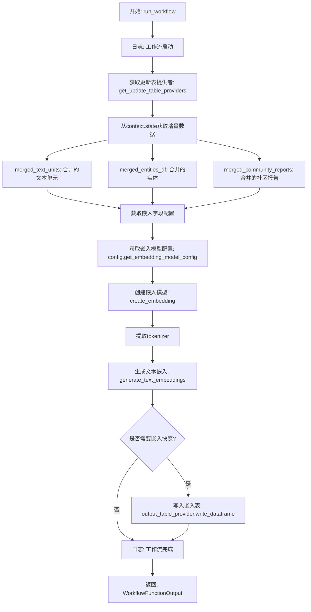
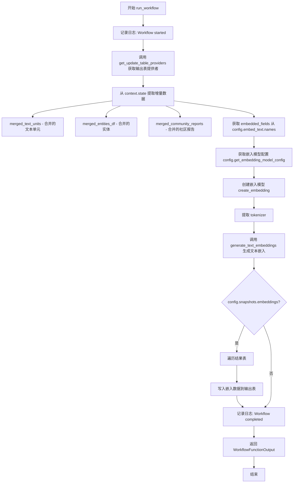

# `graphrag\packages\graphrag\graphrag\index\workflows\update_text_embeddings.py` 详细设计文档

这是一个增量索引工作流模块，用于更新文本嵌入（text embeddings）。该模块从上下文中获取已合并的文本单元、实体和社区报告，通过配置的嵌入模型生成文本嵌入，并可选地将嵌入结果写入输出表。

## 整体流程



## 类结构

```
无类定义（模块级函数）
└── run_workflow (async函数)
```

## 全局变量及字段


### `output_table_provider`
    
更新表提供者实例，用于将嵌入数据写入输出表

类型：`TableOutputProvider`
    


### `merged_text_units`
    
合并的文本单元数据，包含增量更新后的文本单元信息

类型：`DataFrame`
    


### `merged_entities_df`
    
合并的实体数据框，存储增量更新后的实体信息

类型：`DataFrame`
    


### `merged_community_reports`
    
合并的社区报告，包含增量更新后的社区报告数据

类型：`DataFrame`
    


### `embedded_fields`
    
要嵌入的字段名称列表，指定哪些字段需要进行文本嵌入处理

类型：`List[str]`
    


### `model_config`
    
嵌入模型配置，包含模型类型、参数等配置信息

类型：`EmbeddingModelConfig`
    


### `model`
    
嵌入模型实例，用于生成文本和实体的向量表示

类型：`EmbeddingModel`
    


### `tokenizer`
    
分词器实例，用于将文本分割成 tokens 供模型处理

类型：`Tokenizer`
    


### `result`
    
生成嵌入的结果，包含各类型数据的嵌入向量表

类型：`Dict[str, DataFrame]`
    


    

## 全局函数及方法


### `run_workflow`

这是一个异步工作流函数，用于在增量索引运行中更新文本嵌入。它从上下文中获取已合并的文本单元、实体和社区报告，然后使用配置的嵌入模型生成文本嵌入，可选地将结果写入输出表。

参数：

- `config`：`GraphRagConfig`，全局配置对象，包含嵌入模型、批处理和向量存储等配置信息
- `context`：`PipelineRunContext`，管道运行上下文，包含增量更新状态、缓存、回调等运行时信息

返回值：`WorkflowFunctionOutput`，工作流函数输出对象，此处返回 `result=None`

#### 流程图



#### 带注释源码

```python
# 异步工作流函数：更新文本嵌入
# 用于从增量索引运行中更新文本嵌入
async def run_workflow(
    config: GraphRagConfig,
    context: PipelineRunContext,
) -> WorkflowFunctionOutput:
    """Update the text embeddings from a incremental index run."""
    
    # 记录工作流开始日志
    logger.info("Workflow started: update_text_embeddings")
    
    # 获取更新表提供者，用于将嵌入数据写入输出表
    output_table_provider, _, _ = get_update_table_providers(
        config, context.state["update_timestamp"]
    )

    # 从上下文状态中提取增量更新数据
    merged_text_units = context.state["incremental_update_merged_text_units"]  # 合并的文本单元
    merged_entities_df = context.state["incremental_update_merged_entities"]  # 合并的实体DataFrame
    merged_community_reports = context.state[
        "incremental_update_merged_community_reports"
    ]  # 合并的社区报告

    # 从配置中获取需要嵌入的字段名称
    embedded_fields = config.embed_text.names

    # 获取嵌入模型配置
    model_config = config.get_embedding_model_config(
        config.embed_text.embedding_model_id
    )

    # 创建嵌入模型实例，传入模型配置和缓存
    model = create_embedding(
        model_config,
        cache=context.cache.child("text_embedding"),  # 创建子缓存
        cache_key_creator=cache_key_creator,  # 缓存键创建器
    )

    # 从模型中获取分词器
    tokenizer = model.tokenizer

    # 异步调用生成文本嵌入的核心函数
    result = await generate_text_embeddings(
        text_units=merged_text_units,  # 待嵌入的文本单元
        entities=merged_entities_df,  # 实体数据
        community_reports=community_reports,  # 社区报告
        callbacks=context.callbacks,  # 回调函数
        model=model,  # 嵌入模型
        tokenizer=tokenizer,  # 分词器
        batch_size=config.embed_text.batch_size,  # 批处理大小
        batch_max_tokens=config.embed_text.batch_max_tokens,  # 批处理最大token数
        num_threads=config.concurrent_requests,  # 并发请求数
        vector_store_config=config.vector_store,  # 向量存储配置
        embedded_fields=embedded_fields,  # 需要嵌入的字段
    )
    
    # 如果启用了嵌入快照，则将嵌入结果写入输出表
    if config.snapshots.embeddings:
        for name, table in result.items():
            await output_table_provider.write_dataframe(f"embeddings.{name}", table)

    # 记录工作流完成日志
    logger.info("Workflow completed: update_text_embeddings")
    
    # 返回工作流输出结果
    return WorkflowFunctionOutput(result=None)
```

## 关键组件


### run_workflow

异步工作流函数，接收配置和运行上下文，用于执行增量索引中的文本嵌入更新操作，调用嵌入模型生成文本单元、实体和社区报告的向量表示，并将结果写入向量存储。

### get_update_table_providers

获取增量更新表的提供者，用于在索引更新过程中读写数据表，包含输出表提供者、输入表提供者和关联表提供者。

### create_embedding

工厂函数，根据模型配置创建嵌入模型实例，支持缓存机制和缓存键生成器，用于避免重复计算相同文本的嵌入。

### cache_key_creator

缓存键创建器函数，为嵌入结果生成唯一标识符，支持嵌入缓存的键值管理。

### generate_text_embeddings

核心嵌入生成函数，接收文本单元、实体和社区报告数据，通过嵌入模型生成向量表示，支持批处理、并发控制和可配置的嵌入字段。

### output_table_provider

输出表提供者实例，用于将生成的嵌入数据写入向量存储，支持按名称写入不同的数据表。

### context.state 增量状态数据

包含三个关键的增量更新数据源：merged_text_units（合并的文本单元）、merged_entities_df（合并的实体数据框）和 merged_community_reports（合并的社区报告），这些数据在增量索引运行中由前序步骤产生。

### embed_text 配置

嵌入文本的配置对象，包含 names（嵌入字段名列表）、embedding_model_id（嵌入模型标识符）、batch_size（批大小）和 batch_max_tokens（批最大令牌数）等参数。

### 并发控制

通过 config.concurrent_requests 配置并发请求数，使用 num_threads 参数控制嵌入生成过程中的线程数量。


## 问题及建议


### 已知问题

-   **返回值错误**：`return WorkflowFunctionOutput(result=None)` 始终返回 `None`，而实际计算结果存储在 `result` 变量中未被使用，导致工作流输出无效
-   **缺少错误处理**：对 `get_update_table_providers`、`create_embedding`、`generate_text_embeddings` 等关键调用缺乏 try-except 异常捕获，任何一处失败都会导致整个工作流崩溃
-   **字典访问风险**：直接访问 `context.state` 中的键（如 `"incremental_update_merged_text_units"`），若键不存在会抛出 `KeyError`，缺乏 `.get()` 安全访问或前置验证
-   **配置空值风险**：假设 `config.embed_text.names`、`config.embed_text.embedding_model_id`、`config.embed_text.batch_size` 等配置必存在，未做空值检查
-   **硬编码字符串**：缓存键 `"text_embedding"` 和输出表名前缀 `"embeddings."` 硬编码在代码中，降低可维护性
-   **未使用返回值**：`get_update_table_providers` 返回三个值，但只使用了第一个，其余两个输出 provider 和统计信息被丢弃
-   **日志不完善**：仅记录工作流开始和结束，缺少关键步骤（如 embedding 模型创建、批量处理进度）的日志，难以排查问题

### 优化建议

-   **修复返回值**：将 `return WorkflowFunctionOutput(result=None)` 改为 `return WorkflowFunctionOutput(result=result)`
-   **添加异常处理**：为关键异步调用添加 try-except-finally 结构，捕获并记录异常，必要时进行重试或优雅降级
-   **安全字典访问**：使用 `context.state.get()` 并提供默认值，或在访问前使用 `in` 检查键是否存在
-   **配置校验**：在函数入口处添加配置项的必需性检查，对缺失或无效配置抛出明确的 `ValueError`
-   **提取魔法字符串**：将 `"text_embedding"` 和 `"embeddings."` 定义为常量或配置项
-   **增强日志**：在创建 embedding 模型、写入表、批次处理等关键节点添加 INFO/DEBUG 级别日志
-   **处理空数据**：若 `merged_text_units` 等数据为空，应提前返回或记录警告而非继续执行嵌入计算

## 其它


### 设计目标与约束

该工作流旨在实现增量索引场景下的文本嵌入更新，支持在已有索引基础上进行增量计算，避免全量重新计算。设计约束包括：1) 依赖GraphRagConfig中的嵌入配置和模型；2) 需配合PipelineRunContext中的状态管理和缓存机制；3) 遵循异步架构以提高并发性能；4) 受config.concurrent_requests控制的线程数限制。

### 错误处理与异常设计

1. 嵌入模型创建失败：create_embedding抛出异常时沿调用栈传播，由上层工作流调度器捕获处理；2. 嵌入生成失败：generate_text_embeddings内部处理各类数据异常，返回空结果；3. 表写入失败：output_table_provider.write_dataframe异常时仅记录日志，不中断工作流；4. 缓存相关异常：cache.child()或cache_key_creator异常时降级为无缓存模式运行。所有异常均通过logger记录详细日志。

### 数据流与状态机

工作流从context.state获取三个关键数据源：incremental_update_merged_text_units（合并的文本单元）、incremental_update_merged_entities（合并的实体）、incremental_update_merged_community_reports（合并的社区报告）。数据流路径：输入数据 → 嵌入模型推理 → 向量化结果 → （可选）快照保存 → 返回空结果。工作流状态转换：STARTED → EMBEDDING_GENERATED → COMPLETED/FAILED。

### 外部依赖与接口契约

1. GraphRagConfig：配置对象，提供嵌入模型配置、批处理参数、向量存储配置；2. PipelineRunContext：运行时上下文，提供状态字典、缓存实例、回调接口；3. generate_text_embeddings：核心嵌入生成函数，接收文本单元、实体、社区报告及模型参数；4. output_table_provider：表提供者接口，需实现write_dataframe方法；5. create_embedding：嵌入工厂函数，返回支持tokenizer属性的模型对象。

### 配置参数说明

config.embed_text.names：需要嵌入的字段名称列表；config.embed_text.embedding_model_id：嵌入模型标识符；config.embed_text.batch_size：批处理大小；config.embed_text.batch_max_tokens：批处理最大token数；config.concurrent_requests：并发请求线程数；config.vector_store：向量存储配置；config.snapshots.embeddings：是否保存嵌入快照的布尔标志；config.get_embedding_model_config()：获取模型配置的工厂方法。

### 性能考虑与优化空间

1. 当前实现使用async/await但内部嵌入生成为同步调用，存在性能瓶颈；2. batch_max_tokens参数可根据实际模型上下文窗口动态调整；3. num_threads参数控制并发但当前硬编码传入，建议暴露给配置；4. 缓存机制依赖child cache实现，但未实现缓存命中率的监控；5. 快照写入为同步操作，可考虑异步化以提高吞吐量。

### 安全性与合规性

1. 嵌入模型加载需验证模型来源可信；2. 缓存键生成需避免敏感信息泄露；3. 向量存储配置需确保数据加密传输；4. 日志输出需避免记录敏感数据如实体内容。

    