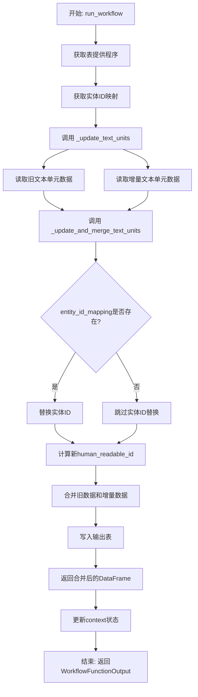
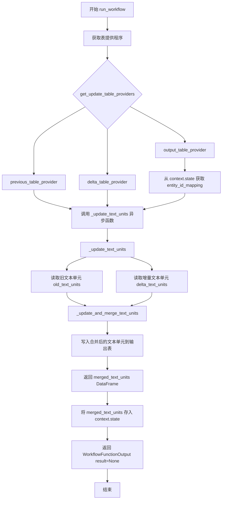
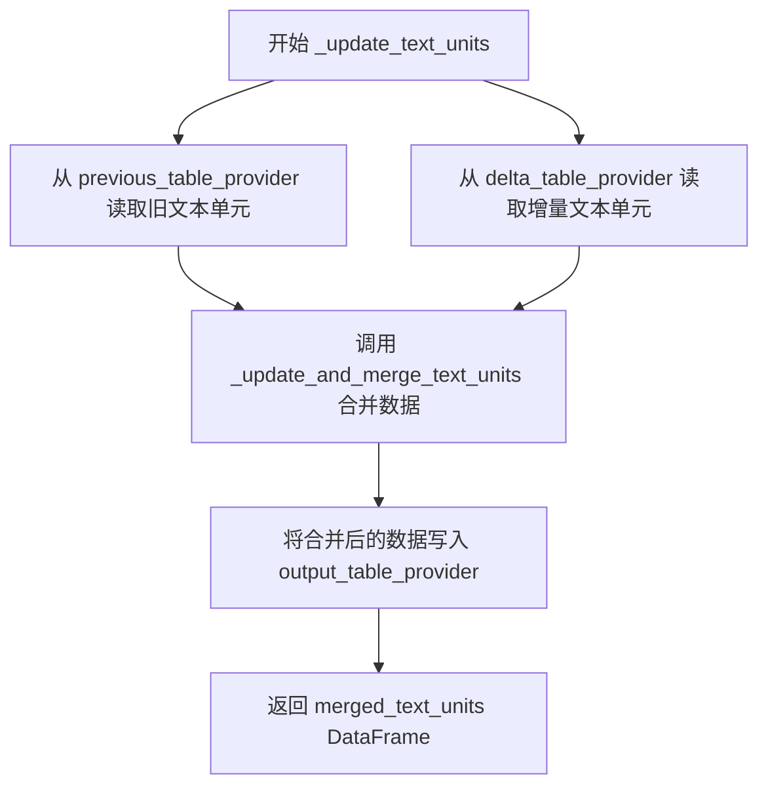
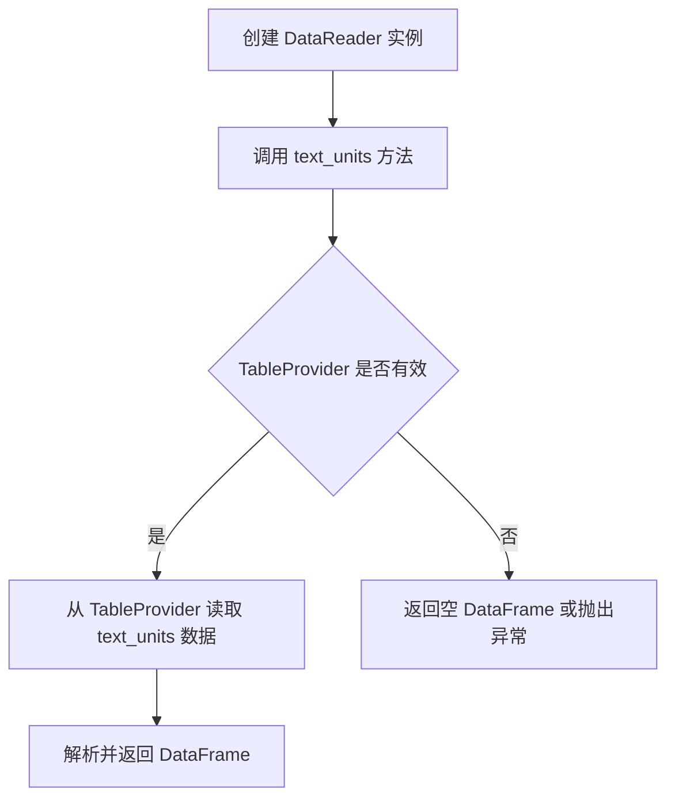

# `graphrag\packages\graphrag\graphrag\index\workflows\update_text_units.py` 详细设计文档

这是一个增量索引工作流模块，用于更新和合并文本单元数据。该模块通过三个表提供程序（旧数据、增量数据和输出数据）读取数据，应用实体ID映射处理，最后将合并后的文本单元数据写入输出表，实现增量索引过程中的文本单元更新。

## 整体流程



## 类结构

```
无明确类层次结构，主要为模块级函数
函数: run_workflow (异步主入口)
函数: _update_text_units (异步内部函数)
函数: _update_and_merge_text_units (同步工具函数)
```

## 全局变量及字段


### `config`
    
图谱RAG配置对象

类型：`GraphRagConfig`
    


### `context`
    
管道运行上下文

类型：`PipelineRunContext`
    


### `output_table_provider`
    
输出表提供程序

类型：`TableProvider`
    


### `previous_table_provider`
    
上一次索引的表提供程序

类型：`TableProvider`
    


### `delta_table_provider`
    
增量数据的表提供程序

类型：`TableProvider`
    


### `entity_id_mapping`
    
实体ID映射字典

类型：`dict`
    


### `merged_text_units`
    
合并后的文本单元数据

类型：`pd.DataFrame`
    


### `old_text_units`
    
旧的文本单元数据

类型：`pd.DataFrame`
    


### `delta_text_units`
    
增量文本单元数据

类型：`pd.DataFrame`
    


### `initial_id`
    
初始ID值，用于生成新的human_readable_id

类型：`int`
    


    

## 全局函数及方法


### `run_workflow`

该函数是异步主工作流函数，用于从增量索引运行中更新文本单元（text units）。它接收配置和上下文，管理表提供程序，获取实体ID映射，更新并合并文本单元，最后将合并结果存储到上下文中。

参数：

- `config`：`GraphRagConfig`，GraphRAG 配置对象，包含工作流的配置参数
- `context`：`PipelineRunContext`，管道运行上下文，包含状态信息如增量更新的时间戳和实体ID映射

返回值：`WorkflowFunctionOutput`，工作流函数输出对象，包含 `result=None` 表示该工作流不返回具体数据，结果通过上下文状态传递

#### 流程图



#### 带注释源码

```python
async def run_workflow(
    config: GraphRagConfig,
    context: PipelineRunContext,
) -> WorkflowFunctionOutput:
    """Update the text units from a incremental index run."""
    # 记录工作流开始日志
    logger.info("Workflow started: update_text_units")
    
    # 获取增量更新所需的表提供程序：输出表、旧表（历史数据）、增量表（新增数据）
    output_table_provider, previous_table_provider, delta_table_provider = (
        get_update_table_providers(config, context.state["update_timestamp"])
    )
    
    # 从上下文中获取增量更新期间的实体ID映射，用于处理实体ID变更
    entity_id_mapping = context.state["incremental_update_entity_id_mapping"]

    # 调用异步函数执行文本单元的更新和合并
    merged_text_units = await _update_text_units(
        previous_table_provider,
        delta_table_provider,
        output_table_provider,
        entity_id_mapping,
    )

    # 将合并后的文本单元存储到上下文状态，供下游工作流使用
    context.state["incremental_update_merged_text_units"] = merged_text_units

    # 记录工作流完成日志
    logger.info("Workflow completed: update_text_units")
    
    # 返回工作流输出，结果为 None
    return WorkflowFunctionOutput(result=None)


async def _update_text_units(
    previous_table_provider: TableProvider,
    delta_table_provider: TableProvider,
    output_table_provider: TableProvider,
    entity_id_mapping: dict,
) -> pd.DataFrame:
    """Update the text units output."""
    # 使用 DataReader 从表提供程序读取文本单元数据
    old_text_units = await DataReader(previous_table_provider).text_units()
    delta_text_units = await DataReader(delta_table_provider).text_units()
    
    # 执行文本单元的更新、合并和ID重映射
    merged_text_units = _update_and_merge_text_units(
        old_text_units, delta_text_units, entity_id_mapping
    )

    # 将合并后的文本单元写入输出表提供程序
    await output_table_provider.write_dataframe("text_units", merged_text_units)

    # 返回合并后的文本单元 DataFrame
    return merged_text_units


def _update_and_merge_text_units(
    old_text_units: pd.DataFrame,
    delta_text_units: pd.DataFrame,
    entity_id_mapping: dict,
) -> pd.DataFrame:
    """Update and merge text units.

    Parameters
    ----------
    old_text_units : pd.DataFrame
        The old text units.
    delta_text_units : pd.DataFrame
        The delta text units.
    entity_id_mapping : dict
        The entity id mapping.

    Returns
    -------
    pd.DataFrame
        The updated text units.
    """
    # 如果存在实体ID映射，则更新增量文本单元中的实体ID列表
    # 将旧的实体ID替换为映射后的新ID
    if entity_id_mapping:
        delta_text_units["entity_ids"] = delta_text_units["entity_ids"].apply(
            lambda x: [entity_id_mapping.get(i, i) for i in x] if x is not None else x
        )

    # 计算新的可读ID起始值：旧文本单元的最大human_readable_id + 1
    initial_id = old_text_units["human_readable_id"].max() + 1
    
    # 为增量文本单元分配新的可读ID
    delta_text_units["human_readable_id"] = np.arange(
        initial_id, initial_id + len(delta_text_units)
    )
    
    # 合并旧文本单元和增量文本单元，返回最终的文本单元DataFrame
    return pd.concat([old_text_units, delta_text_units], ignore_index=True, copy=False)
```


### `_update_text_units`

这是一个异步内部函数，负责从三个不同的表提供者读取文本单元数据，将旧数据和增量数据进行合并，更新实体ID映射，并写入输出表提供者，最后返回合并后的文本单元DataFrame。

参数：

- `previous_table_provider`：`TableProvider`，提供增量更新前的历史文本单元数据
- `delta_table_provider`：`TableProvider`，提供增量更新新增的文本单元数据
- `output_table_provider`：`TableProvider`，用于写入合并后的文本单元数据
- `entity_id_mapping`：`dict`，实体ID映射字典，用于在合并时替换旧的实体ID

返回值：`pd.DataFrame`，合并更新后的文本单元数据

#### 流程图



#### 带注释源码

```python
async def _update_text_units(
    previous_table_provider: TableProvider,
    delta_table_provider: TableProvider,
    output_table_provider: TableProvider,
    entity_id_mapping: dict,
) -> pd.DataFrame:
    """Update the text units output."""
    # 从历史表提供者读取旧的文本单元数据
    old_text_units = await DataReader(previous_table_provider).text_units()
    # 从增量表提供者读取新增的文本单元数据
    delta_text_units = await DataReader(delta_table_provider).text_units()
    # 调用内部函数进行合并和更新处理
    merged_text_units = _update_and_merge_text_units(
        old_text_units, delta_text_units, entity_id_mapping
    )

    # 将合并后的文本单元写入输出表提供者
    await output_table_provider.write_dataframe("text_units", merged_text_units)

    # 返回合并后的数据供后续流程使用
    return merged_text_units
```


### `_update_and_merge_text_units`

该函数是一个同步函数，负责将增量文本单元（delta）与旧文本单元（old）进行合并，并通过实体ID映射表对增量数据中的实体ID进行转换，最后重新计算human_readable_id并返回合并后的DataFrame。

参数：

- `old_text_units`：`pd.DataFrame`，旧版本的文本单元数据表
- `delta_text_units`：`pd.DataFrame`，增量（新添加的）文本单元数据表
- `entity_id_mapping`：`dict`，实体ID映射字典，用于将旧的实体ID映射到新的实体ID

返回值：`pd.DataFrame`，合并并更新后的文本单元数据表

#### 流程图

```mermaid
flowchart TD
    A[开始 _update_and_merge_text_units] --> B{entity_id_mapping 是否存在}
    B -- 是 --> C[遍历 delta_text_units 的 entity_ids 列]
    C --> D[将每个实体ID通过映射表转换]
    D --> E[重新赋值 delta_text_units['entity_ids']]
    B -- 否 --> F[跳过实体ID映射]
    E --> G[计算新的 human_readable_id 起始值]
    F --> G
    G --> H[为 delta_text_units 生成递增的 human_readable_id]
    H --> I[使用 pd.concat 合并 old_text_units 和 delta_text_units]
    I --> J[返回合并后的 DataFrame]
```

#### 带注释源码

```python
def _update_and_merge_text_units(
    old_text_units: pd.DataFrame,
    delta_text_units: pd.DataFrame,
    entity_id_mapping: dict,
) -> pd.DataFrame:
    """更新并合并文本单元。

    Parameters
    ----------
    old_text_units : pd.DataFrame
        旧的文本单元。
    delta_text_units : pd.DataFrame
        增量文本单元。
    entity_id_mapping : dict
        实体ID映射关系。

    Returns
    -------
    pd.DataFrame
        更新后的文本单元。
    """
    # 如果存在实体ID映射表，则对增量文本单元中的实体ID进行替换
    if entity_id_mapping:
        # 对 delta_text_units 的 entity_ids 列应用映射转换
        # 如果 entity_ids 不为 None，则将每个实体ID通过映射表转换，否则保持原值
        delta_text_units["entity_ids"] = delta_text_units["entity_ids"].apply(
            lambda x: [entity_id_mapping.get(i, i) for i in x] if x is not None else x
        )

    # 计算增量文本单元的 human_readable_id 起始值
    # 从旧文本单元的最大 human_readable_id 加 1 开始
    initial_id = old_text_units["human_readable_id"].max() + 1
    # 使用 numpy 生成从 initial_id 开始的连续整数序列
    delta_text_units["human_readable_id"] = np.arange(
        initial_id, initial_id + len(delta_text_units)
    )
    # 合并旧的文本单元和增量文本单元
    # ignore_index=True 表示重新生成索引，copy=False 表示尽可能避免复制以优化性能
    return pd.concat([old_text_units, delta_text_units], ignore_index=True, copy=False)
```


### `get_update_table_providers`

外部导入函数，用于在增量索引更新场景中获取三个关键的表提供程序（TableProvider）：用于读取上一版本数据的 `previous_table_provider`、用于读取增量数据的 `delta_table_provider`，以及用于写入更新后数据的 `output_table_provider`。

参数：

-  `config`：`GraphRagConfig`，图检索增强生成（GraphRAG）的配置对象，包含存储路径、表提供程序类型等配置信息
-  `timestamp`：`Any`（具体类型依赖 `context.state["update_timestamp"]` 的实际类型，可能是 `datetime` 或 `str`），表示增量更新操作的时间戳，用于确定数据版本边界

返回值：`Tuple[TableProvider, TableProvider, TableProvider]`，返回一个包含三个元素的元组：
- 第一个元素：`previous_table_provider`（TableProvider），用于读取上一次索引运行产生的数据
- 第二个元素：`delta_table_provider`（TableProvider），用于读取自上次运行以来的增量数据
- 第三个元素：`output_table_provider`（TableProvider），用于写入合并后的数据

#### 流程图

```mermaid
flowchart TD
    A[开始: get_update_table_providers] --> B[接收 config 和 timestamp 参数]
    B --> C{检查配置中指定的存储类型}
    
    C -->|使用默认存储| D[创建默认的表提供程序实例]
    C -->|自定义存储| E[根据配置创建对应的表提供程序]
    
    D --> F[实例化 previous_table_provider]
    E --> F
    
    F --> G[实例化 delta_table_provider]
    G --> H[实例化 output_table_provider]
    
    H --> I[返回 Tuple[previous, delta, output]]
    
    style A fill:#f9f,stroke:#333
    style I fill:#9f9,stroke:#333
```

#### 带注释源码

```
# 该函数定义位于 graphrag.index.run.utils 模块中
# 以下为基于使用方式的推断实现

async def get_update_table_providers(
    config: GraphRagConfig,
    timestamp: Any
) -> Tuple[TableProvider, TableProvider, TableProvider]:
    """获取增量更新所需的表提供程序。
    
    Parameters
    ----------
    config : GraphRagConfig
        GraphRAG 配置对象，包含存储相关配置
    timestamp : Any
        增量更新的时间戳，用于确定数据版本
        
    Returns
    -------
    Tuple[TableProvider, TableProvider, TableProvider]
        previous_table_provider: 读取旧版本数据
        delta_table_provider: 读取增量数据  
        output_table_provider: 写入合并后的数据
    """
    
    # 1. 根据配置获取或创建存储相关的表提供程序
    # previous_table_provider: 指向上一版本数据的存储位置
    previous_table_provider = _create_table_provider(
        storage_type=config.storage_type,
        base_path=config.storage_path,
        version=timestamp  # 使用时间戳定位历史版本
    )
    
    # 2. 创建用于读取增量数据的表提供程序
    # delta_table_provider: 指向增量数据（自上次运行以来的新数据）
    delta_table_provider = _create_table_provider(
        storage_type=config.storage_type,
        base_path=config.delta_storage_path,
        version="latest"  # 读取最新增量
    )
    
    # 3. 创建用于写入结果的表提供程序
    # output_table_provider: 指向输出位置（通常是新的合并版本）
    output_table_provider = _create_table_provider(
        storage_type=config.storage_type,
        base_path=config.output_storage_path,
        version="new"  # 写入新版本
    )
    
    return previous_table_provider, delta_table_provider, output_table_provider
```


### `DataReader.text_units`

读取文本单元数据，返回包含文本单元信息的 DataFrame。

参数：

-  无显式参数（构造函数接受 `table_provider: TableProvider`）

返回值：`pd.DataFrame`，包含文本单元数据

#### 流程图



#### 带注释源码

```python
# DataReader 类从 graphrag.data_model.data_reader 导入
# 以下是基于代码使用方式推断的方法签名和实现

class DataReader:
    """数据读取器，用于从 TableProvider 读取各种数据实体。"""
    
    def __init__(self, table_provider: TableProvider):
        """初始化 DataReader。
        
        Parameters
        ----------
        table_provider : TableProvider
            表提供者，用于提供数据读取接口
        """
        self._table_provider = table_provider
    
    async def text_units(self) -> pd.DataFrame:
        """读取文本单元数据。
        
        此方法从 table_provider 中异步读取 text_units 表数据，
        并将其转换为 pandas DataFrame 返回。
        
        Returns
        -------
        pd.DataFrame
            包含文本单元数据的 DataFrame，列通常包含：
            - id: 文本单元唯一标识
            - text: 文本内容
            - human_readable_id: 人类可读的ID
            - entity_ids: 关联的实体ID列表
            等字段
        
        Raises
        ------
        Exception
            如果读取过程中发生错误
        """
        # 从 TableProvider 读取 text_units 表数据
        # 具体实现取决于 TableProvider 的具体实现
        pass
```

---

**备注**：由于 `DataReader` 类是从外部模块 `graphrag.data_model.data_reader` 导入的，源代码中未包含其完整实现。以上信息是根据代码中的调用方式 `await DataReader(previous_table_provider).text_units()` 推断得出的。该方法接受一个 `TableProvider` 实例作为构造参数，返回一个 `pd.DataFrame` 对象，并且是一个异步方法。

## 关键组件


### 实体ID映射与转换

在 `_update_and_merge_text_units` 函数中，通过 `delta_text_units["entity_ids"].apply(lambda x: [entity_id_mapping.get(i, i) for i in x] if x is not None else x)` 实现实体ID的映射转换。该组件将增量数据中的实体ID根据提供的映射字典进行替换，支持增量更新场景下的实体ID重定向。

### human_readable_id 分配机制

通过 `np.arange(initial_id, initial_id + len(delta_text_units))` 为增量文本单元分配连续递增的 human_readable_id。initial_id 基于旧文本单元的最大ID值计算，确保ID的连续性和唯一性，避免冲突。

### DataFrame 增量合并策略

使用 `pd.concat([old_text_units, delta_text_units], ignore_index=True, copy=False)` 实现高效的DataFrame合并。`copy=False` 参数避免不必要的数据拷贝，提升性能；`ignore_index=True` 确保合并后的索引重新生成。

### 异步数据读取与写入

`_update_text_units` 函数通过 `DataReader` 异步读取 previous_table_provider 和 delta_table_provider 的文本单元数据，然后异步写入 output_table_provider，实现了增量更新的IO操作流程。

### 增量更新工作流入口

`run_workflow` 异步函数作为增量更新工作流的入口点，协调三个表提供者（output、previous、delta）的交互，通过 context.state 传递增量更新所需的实体ID映射和合并后的文本单元数据。

### 工作流状态管理

通过 `context.state` 字典管理增量更新状态，包括 `update_timestamp`、`incremental_update_entity_id_mapping` 和 `incremental_update_merged_text_units`，实现工作流内部状态传递和上下文共享。


## 问题及建议


### 已知问题

- **空值处理不安全**：`old_text_units["human_readable_id"].max()` 当 old_text_units 为空时返回 NaN，导致后续 `np.arange` 计算出错
- **None 与空列表判断不一致**：代码中 `x is not None` 只检查了 None，但 `entity_ids` 可能是空列表 `[]`，逻辑不够严谨
- **缺少输入参数校验**：未对 `previous_table_provider`、`delta_table_provider`、`entity_id_mapping` 等关键参数为 None 或空的情况进行校验
- **DataReader 缺乏异常处理**：读取数据可能失败，但没有 try-except 包裹，异常信息不友好
- **apply 性能瓶颈**：使用 `apply` 逐行处理 `entity_ids` 映射，在大型 DataFrame 上性能较差，建议使用向量化操作

### 优化建议

- 使用 `fillna(0)` 或显式检查空 DataFrame 来处理 `human_readable_id` 为空的情况
- 将 `x is not None` 改为更健壮的空值检查，如 `if x`
- 在函数入口添加参数校验，提升代码健壮性
- 为 DataReader 调用添加异常处理和日志记录
- 使用 `map` 或向量化的方式替代 `apply`，或使用 `pd.Series.map` 进行批量映射
- 考虑将状态键（如 "update_timestamp"）提取为常量，避免硬编码和拼写错误

## 其它


### 设计目标与约束

该模块的设计目标是实现增量索引过程中文本单元（text units）的更新与合并功能，支持在已有文本单元基础上追加新的增量数据，并通过实体ID映射确保数据一致性。核心约束包括：1）仅支持增量模式运行，需配合GraphRagConfig和PipelineRunContext使用；2）依赖TableProvider实现的表格读写能力；3）entity_id_mapping为可选参数，若提供则进行ID替换，否则保持原ID；4）human_readable_id字段需保持全局唯一且递增。

### 错误处理与异常设计

1. **DataReader读取失败**：若previous_table_provider或delta_table_provider中的text_units表不存在或读取失败，将抛出异常终止工作流，需确保增量索引前数据源有效；2. **entity_id_mapping类型错误**：apply操作假设entity_ids为列表类型，若类型不匹配可能导致运行时错误，建议添加类型检查；3. **空DataFrame处理**：old_text_units或delta_text_units为空时，concat仍能正常执行，但需注意max()操作在空Series上的行为；4. **写入失败**：output_table_provider.write_dataframe失败时，工作流异常终止，已修改的context.state不会回滚。

### 数据流与状态机

数据流如下：1）从config和context获取update_timestamp和entity_id_mapping；2）通过get_update_table_providers获取三个TableProvider实例；3）分别从previous和delta表读取text_units DataFrame；4）执行_update_and_merge_text_units进行数据合并：先替换entity_ids（若mapping存在），再计算新的human_readable_id起始值，最后concat合并；5）将结果写入output_table_provider；6）将merged_text_units存入context.state供下游工作流使用。状态转换：Workflow Started → Data Loading → Data Merging → Data Writing → Workflow Completed。

### 外部依赖与接口契约

| 依赖模块 | 接口契约 |
|---------|---------|
| graphrag.config.models.graph_rag_config.GraphRagConfig | 配置对象，提供索引相关配置参数 |
| graphrag.index.typing.context.PipelineRunContext | 运行时上下文，包含state字典存储增量状态 |
| graphrag.index.typing.workflow.WorkflowFunctionOutput | 工作流输出包装类 |
| graphrag.data_model.data_reader.DataReader | 需实现text_units()异步方法返回pd.DataFrame |
| graphrag.index.run.utils.get_update_table_providers | 接受config和timestamp，返回(output, previous, delta)三元组 |
| graphrag_storage.tables.table_provider.TableProvider | 需实现read_dataframe和write_dataframe方法 |

### 性能考虑与优化空间

1. **concat性能**：使用copy=False参数避免数据拷贝，但需注意内存占用；2. **apply性能**：entity_id_mapping的apply操作对每行执行Python循环，大数据量下建议向量化或使用map操作；3. **增量粒度**：当前为全量合并，可考虑基于timestamp或ID的增量追加策略减少计算量；4. **DataFrame序列化**：write_dataframe的序列化开销可考虑批量写入优化。

### 配置参数说明

| 参数名 | 来源 | 说明 |
|-------|------|------|
| update_timestamp | context.state | 增量更新的时间戳标识，用于获取delta数据范围 |
| entity_id_mapping | context.state | 实体ID映射字典，key为旧ID，value为新ID |
| incremental_update_merged_text_units | context.state | 输出字段，存储合并后的完整text_units |

### 并发与线程安全性

该函数为async定义，支持事件循环并发执行，但：1）DataReader和TableProvider的并发访问取决于具体实现是否线程安全；2）context.state的读写在单次运行内是原子的，但多worker并发运行同一工作流时需外部协调；3）human_readable_id的计算依赖max()，多worker并发时应使用分布式ID生成器或锁机制。

### 版本兼容性说明

该代码依赖numpy的np.arange和pandas的DataFrame操作，需确保numpy>=1.20和pandas>=1.3版本；TableProvider接口需符合graphrag_storage 2024年API规范；增量更新机制依赖于context.state的特定键，需与index pipeline版本匹配。


    