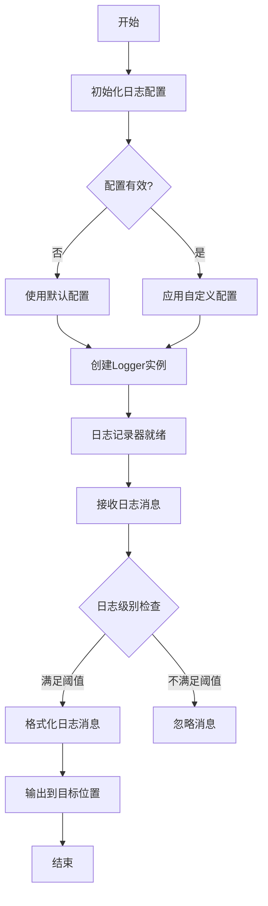

# `graphrag\packages\graphrag\graphrag\logger\__init__.py` 详细设计文档

这是一个日志工具模块，提供日志记录工具和实现，用于应用程序的日志管理、级别控制、格式化和输出目标配置。

## 整体流程



## 类结构

```
Logger (主日志类)
├── LoggerConfig (日志配置类)
├── Formatter (格式化器)
├── Handler (处理器基类)
│   ├── ConsoleHandler (控制台输出)
│   ├── FileHandler (文件输出)
│   └── RotatingHandler (轮转输出)
└── Level (日志级别枚举)
```

## 全局变量及字段


    

## 全局函数及方法


## 关键组件


### Logger 模块

日志工具和实现的集合，提供统一的日志记录功能。

### 关键组件信息

由于提供的代码仅为模块框架（版权声明和模块文档字符串），尚未包含实际实现，因此无法识别具体的类、全局变量或函数。当前代码结构如下：

- **模块名称**: logger (从docstring推断)
- **模块描述**: Logger utilities and implementations (日志工具和实现)
- **模块状态**: 空模块框架，仅包含文档

### 潜在的技术债务或优化空间

- **未完成的模块**: 当前模块为占位符状态，需要实现具体的日志工具类
- **设计目标与约束**: 待根据实际实现确定
- **错误处理与异常设计**: 待根据实际实现确定
- **数据流与状态机**: 待根据实际实现确定
- **外部依赖与接口契约**: 待根据实际实现确定


## 问题及建议


### 已知问题

-   模块仅包含文档字符串和版权声明，缺乏实际的日志工具实现代码
-   未定义日志记录器的核心类或接口，无法提供具体功能
-   缺少日志级别管理机制（如 DEBUG、INFO、WARNING、ERROR、CRITICAL）
-   未实现日志处理器（Handler），无法将日志输出到不同目标（文件、控制台、网络等）
-   缺少日志格式化器（Formatter），无法自定义日志输出格式
-   未考虑线程安全性设计，多线程环境下可能存在竞态条件
-   缺少日志轮转机制（Log Rotation），可能导致日志文件过大
-   未定义错误处理和异常捕获逻辑
-   缺少与标准库 logging 模块的集成或扩展
-   缺少性能优化考量（如异步日志写入、缓冲机制）

### 优化建议

-   补充完整的日志工具类实现，包括基础日志记录器、专用处理器和格式化器
-   实现线程安全的日志写入机制，可考虑使用锁或无锁数据结构
-   添加日志轮转功能，支持按大小或时间自动分割日志文件
-   提供灵活的日志级别配置接口，支持运行时动态调整
-   实现结构化日志功能，支持 JSON 格式输出便于日志分析
-   添加性能指标监控，记录日志写入延迟和吞吐量
-   考虑异步日志写入机制，提升高并发场景下的性能
-   与 Python 标准库 logging 模块保持兼容性或提供适配器
-   添加单元测试和集成测试，确保日志功能的正确性和稳定性
-   提供详细的配置文档和使用示例


## 其它


### 一段话描述

该模块提供日志工具和实现，用于应用程序的日志记录功能，支持不同级别的日志输出、格式化和多种输出目标。

### 文件的整体运行流程

该模块作为日志基础设施被导入后，可通过配置日志级别、格式化和输出处理器来初始化日志系统。应用程序在运行时调用日志记录方法时，日志记录器根据配置的级别判断是否输出，并使用格式化器处理日志消息，最后通过处理器将日志发送到指定的目标（如控制台、文件等）。

### 类的详细信息

由于当前代码仅包含模块文档字符串，具体的类结构待实现。根据日志模块的常见设计模式，预计包含以下类：

### 类字段和全局变量

由于当前代码仅包含模块文档字符串，具体的字段和变量待定义。以下为推测的字段和变量：

| 名称 | 类型 | 描述 |
|------|------|------|
| _instance | Logger | 日志器单例实例 |
| _level | LogLevel | 当前日志级别 |
| _handlers | List[Handler] | 日志处理器列表 |
| _formatter | Formatter | 日志格式化器 |

### 类方法和全局函数

由于当前代码仅包含模块文档字符串，具体的方法和函数待实现。以下为推测的方法和函数：

| 名称 | 参数名称 | 参数类型 | 参数描述 | 返回值类型 | 返回值描述 |
|------|----------|----------|----------|------------|------------|
| get_logger | name | str | 日志记录器名称 | Logger | 获取日志记录器实例 |
| debug | message | str | 调试信息 | None | 记录调试级别日志 |
| info | message | str | 信息日志 | None | 记录信息级别日志 |
| warning | message | str | 警告信息 | None | 记录警告级别日志 |
| error | message | str | 错误信息 | None | 记录错误级别日志 |
| critical | message | str | 严重错误信息 | None | 记录严重级别日志 |

### 关键组件信息

| 名称 | 一句话描述 |
|------|------------|
| Logger | 日志记录器主类，负责日志消息的发送和管理 |
| Handler | 日志处理器，负责任日志输出到不同目标 |
| Formatter | 日志格式化器，负责日志消息的格式转换 |
| Filter | 日志过滤器，用于过滤特定条件的日志 |

### 潜在的技术债务或优化空间

1. **异步日志处理**：当前设计未考虑异步日志写入，高并发场景下可能成为性能瓶颈
2. **日志轮转机制**：缺少日志文件轮转功能，长期运行可能导致磁盘空间问题
3. **结构化日志**：未提供JSON格式的结构化日志支持，不利于日志聚合分析
4. **配置管理**：缺乏灵活的运行时配置更新能力
5. **性能优化**：未实现日志缓冲和批量写入机制

### 其它项目

#### 设计目标与约束

- **设计目标**：提供轻量级、易用的日志工具，支持多种输出格式和目标
- **约束**：需要保持与Python标准日志库logging的兼容性，支持基本的日志级别控制

#### 错误处理与异常设计

- 日志模块自身的错误不应中断主业务逻辑
- 应捕获并记录日志系统本身的异常
- 对于严重的日志系统故障，应有降级方案（如回退到标准输出）

#### 数据流与状态机

- 日志数据流：应用程序 → Logger → Filter → Formatter → Handler → 输出目标
- 状态转换：初始化 → 配置 → 运行 → 关闭

#### 外部依赖与接口契约

- 依赖Python标准库logging模块或第三方日志库
- 提供统一的日志接口，支持第三方日志框架集成
- 配置接口应支持文件、字典、环境变量等多种配置源

#### 日志级别定义

| 级别 | 数值 | 描述 |
|------|------|------|
| DEBUG | 10 | 详细的调试信息 |
| INFO | 20 | 确认程序按预期运行 |
| WARNING | 30 | 指示潜在问题 |
| ERROR | 40 | 严重问题导致部分功能失败 |
| CRITICAL | 50 | 严重错误导致程序无法运行 |

#### 性能考量

- 日志调用应尽可能低开销
- 字符串格式化应在日志级别启用时才执行
- 考虑使用__slots__优化内存使用

    