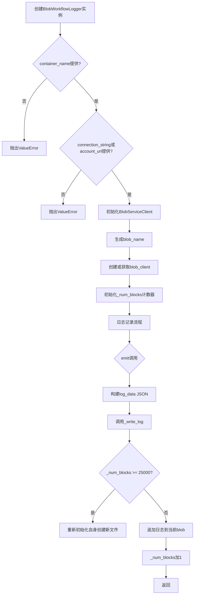
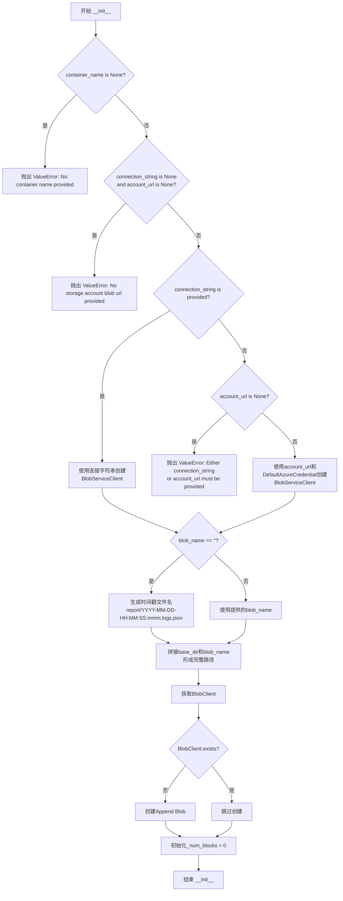
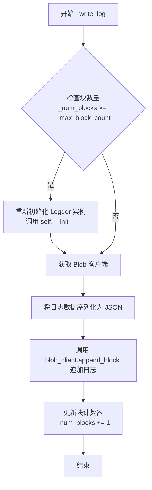

# `graphrag\packages\graphrag\graphrag\logger\blob_workflow_logger.py` 详细设计文档

一个日志处理器，将索引引擎的更新日志写入Azure Blob Storage，支持连接字符串或账户URL认证，当块数量接近25000时自动创建新文件。

## 整体流程



## 类结构

```
logging.Handler (标准库)
└── BlobWorkflowLogger (自定义日志处理器)
```

## 全局变量及字段


### `BlobWorkflowLogger._blob_service_client`
    
Azure Blob服务客户端，用于与Azure Storage进行交互

类型：`BlobServiceClient`
    


### `BlobWorkflowLogger._container_name`
    
容器名称，指定日志写入的Azure Blob容器

类型：`str`
    


### `BlobWorkflowLogger._max_block_count`
    
最大块数量(25000)，用于控制单个Blob文件的最大块数

类型：`int`
    


### `BlobWorkflowLogger._connection_string`
    
连接字符串，用于通过连接字符串方式认证Azure Storage

类型：`str | None`
    


### `BlobWorkflowLogger._account_url`
    
账户URL，用于通过URL方式认证Azure Storage

类型：`str | None`
    


### `BlobWorkflowLogger._blob_name`
    
Blob名称，指定日志文件的名称和路径

类型：`str`
    


### `BlobWorkflowLogger._blob_client`
    
Blob客户端，用于执行具体的Blob操作

类型：`BlobClient`
    


### `BlobWorkflowLogger._num_blocks`
    
当前块计数，记录已写入的块数量用于判断是否需要创建新文件

类型：`int`
    
    

## 全局函数及方法


### `BlobWorkflowLogger.__init__`

构造函数，初始化Blob存储客户端和日志配置，验证输入参数，创建BlobServiceClient，生成日志文件名，并初始化追加Blob以接收日志记录。

参数：

- `connection_string`：`str | None`，Azure Storage连接字符串，用于身份验证
- `container_name`：`str | None`，Azure Blob存储容器名称，用于指定日志写入的目标容器
- `blob_name`：`str`，日志Blob文件名，默认为空字符串，将自动生成时间戳文件名
- `base_dir`：`str | None`，Blob文件的基础目录路径，默认为None
- `account_url`：`str | None`，Azure Storage账户URL，当无连接字符串时用于身份验证
- `level`：`int`，日志记录级别，默认为logging.NOTSET

返回值：`None`，构造函数无返回值

#### 流程图



#### 带注释源码

```python
def __init__(
    self,
    connection_string: str | None,
    container_name: str | None,
    blob_name: str = "",
    base_dir: str | None = None,
    account_url: str | None = None,
    level: int = logging.NOTSET,
):
    """Create a new instance of the BlobWorkflowLogger class."""
    # 调用父类logging.Handler的构造函数，设置日志级别
    super().__init__(level)

    # 验证容器名称必须提供
    if container_name is None:
        msg = "No container name provided for blob storage."
        raise ValueError(msg)
    
    # 验证至少提供连接字符串或账户URL之一
    if connection_string is None and account_url is None:
        msg = "No storage account blob url provided for blob storage."
        raise ValueError(msg)

    # 存储连接字符串和账户URL供后续使用
    self._connection_string = connection_string
    self.account_url = account_url

    # 根据提供的凭证创建BlobServiceClient
    if self._connection_string:
        # 使用连接字符串创建客户端（传统方式）
        self._blob_service_client = BlobServiceClient.from_connection_string(
            self._connection_string
        )
    else:
        # 使用账户URL和默认Azure凭证创建客户端
        if account_url is None:
            msg = "Either connection_string or account_url must be provided."
            raise ValueError(msg)

        self._blob_service_client = BlobServiceClient(
            account_url,
            credential=DefaultAzureCredential(),
        )

    # 如果未指定blob_name，则自动生成带时间戳的文件名
    if blob_name == "":
        blob_name = f"report/{datetime.now(tz=timezone.utc).strftime('%Y-%m-%d-%H:%M:%S:%f')}.logs.json"

    # 拼接基础目录和blob名称形成完整路径
    self._blob_name = str(Path(base_dir or "") / blob_name)
    self._container_name = container_name
    
    # 获取指定容器中的Blob客户端
    self._blob_client = self._blob_service_client.get_blob_client(
        self._container_name, self._blob_name
    )
    
    # 如果Blob不存在，则创建追加Blob用于持续写入日志
    if not self._blob_client.exists():
        self._blob_client.create_append_blob()

    # 初始化块计数器，用于跟踪已写入的块数量
    self._num_blocks = 0  # refresh block counter
```


### `BlobWorkflowLogger.emit`

重写 `logging.Handler` 的 emit 方法，将日志记录序列化为 JSON 格式并追加写入 Azure Blob 存储，支持添加额外的 details、cause 和 stack 信息。

参数：

- `record`：`logging.LogRecord`，Python logging 模块的标准日志记录对象，包含日志级别、消息、时间等元数据

返回值：`NoneType`，该方法无返回值，直接将日志写入 Blob 存储

#### 流程图

```mermaid
flowchart TD
    A[开始 emit 方法] --> B{接收 record}
    B --> C[创建基础 log_data 字典]
    C --> D{检查 record.details 属性}
    D -->|存在| E[添加 details 到 log_data]
    D -->|不存在| F{检查 record.exc_info}
    E --> F
    F --> G{record.exc_info[1] 存在}
    G -->|是| H[添加 cause 到 log_data]
    G -->|否| I{检查 record.stack 属性}
    H --> I
    I --> J{检查 record.stack 属性}
    J -->|存在| K[添加 stack 到 log_data]
    J -->|不存在| L[调用 _write_log 方法]
    K --> L
    L --> M[异常处理: OSError 或 ValueError]
    M --> N{发生异常}
    N -->|是| O[调用 handleError 记录异常]
    N -->|否| P[结束]
    O --> P
```

#### 带注释源码

```python
def emit(self, record) -> None:
    """Emit a log record to blob storage."""
    try:
        # Create JSON structure based on record
        # 根据日志记录创建 JSON 结构，包含日志类型和消息数据
        log_data = {
            "type": self._get_log_type(record.levelno),
            "data": record.getMessage(),
        }

        # Add additional fields if they exist
        # 检查并添加额外的 details 字段（如果存在）
        if hasattr(record, "details") and record.details:  # type: ignore[reportAttributeAccessIssue]
            log_data["details"] = record.details  # type: ignore[reportAttributeAccessIssue]
        
        # 添加异常原因（如果存在异常信息）
        if record.exc_info and record.exc_info[1]:
            log_data["cause"] = str(record.exc_info[1])
        
        # 添加堆栈信息（如果存在）
        if hasattr(record, "stack") and record.stack:  # type: ignore[reportAttributeAccessIssue]
            log_data["stack"] = record.stack  # type: ignore[reportAttributeAccessIssue]

        # 调用内部方法将日志写入 Blob 存储
        self._write_log(log_data)
    
    # 异常处理：捕获 OSError（系统级别错误）和 ValueError（值错误）
    except (OSError, ValueError):
        # 调用父类的 handleError 方法处理异常
        self.handleError(record)
```

#### 关键设计说明

| 项目 | 说明 |
|------|------|
| **日志类型映射** | 通过 `_get_log_type` 方法将日志级别映射为 "error"、"warning" 或 "log" 三种字符串类型 |
| **异常处理** | 捕获写入过程中的系统错误和值错误，调用 `handleError` 进行处理，保证日志系统不因写入失败而中断 |
| **数据格式** | 日志以 JSON Lines 格式追加写入，每个日志条目为独立的 JSON 对象 |
| **扩展字段** | 支持自定义的 details、cause（异常原因）和 stack（堆栈信息）字段 |


### `BlobWorkflowLogger._get_log_type`

根据日志级别返回对应的日志类型字符串（"error"/"warning"/"log"）。

参数：

- `level`：`int`，日志级别（Python logging模块的标准级别，如 logging.ERROR、logging.WARNING 等）

返回值：`str`，日志类型字符串。当 level >= logging.ERROR 时返回 "error"，当 level >= logging.WARNING 时返回 "warning"，否则返回 "log"。

#### 流程图

```mermaid
flowchart TD
    A[开始: _get_log_type] --> B{level >= logging.ERROR?}
    B -->|是| C[返回 "error"]
    B -->|否| D{level >= logging.WARNING?}
    D -->|是| E[返回 "warning"]
    D -->|否| F[返回 "log"]
    C --> G[结束]
    E --> G
    F --> G
```

#### 带注释源码

```python
def _get_log_type(self, level: int) -> str:
    """Get log type string based on log level."""
    # 如果日志级别大于等于ERROR，返回"error"类型
    if level >= logging.ERROR:
        return "error"
    # 如果日志级别大于等于WARNING，返回"warning"类型
    if level >= logging.WARNING:
        return "warning"
    # 否则返回默认的"log"类型
    return "log"
```


### `BlobWorkflowLogger._write_log`

将日志数据写入 Azure Blob 存储，支持自动创建新文件以避免超出 Azure Blob 的单文件最大块数限制（25k 块）。当累积的日志块数量达到上限时，会重新初始化 logger 实例以创建新文件。

参数：

- `log`：`dict[str, Any]`，待写入的日志数据字典，包含日志类型、数据及可选的 details、cause、stack 等字段

返回值：`None`，该方法直接操作 Blob 存储，不返回任何数据

#### 流程图



#### 带注释源码

```python
def _write_log(self, log: dict[str, Any]):
    """Write log data to blob storage."""
    # 检查当前累积的块数量是否已达到最大限制（25k）
    # 如果达到上限，则创建新的 blob 文件以避免超出 Azure Blob 的限制
    if (
        self._num_blocks >= self._max_block_count
    ):  # Check if block count exceeds 25k
        # 重新初始化当前实例，创建新文件继续写入日志
        self.__init__(
            self._connection_string,
            self._container_name,
            account_url=self.account_url,
        )

    # 获取当前 blob 的客户端实例，用于后续的写入操作
    blob_client = self._blob_service_client.get_blob_client(
        self._container_name, self._blob_name
    )
    # 将日志字典序列化为 JSON 字符串，使用缩进格式化，
    # ensure_ascii=False 允许写入非 ASCII 字符（如中文），并添加换行符
    blob_client.append_block(json.dumps(log, indent=4, ensure_ascii=False) + "\n")

    # 更新内部块计数器，记录本次写入操作
    # update the blob's block count
    self._num_blocks += 1
```

## 关键组件


### BlobWorkflowLogger 类

一个继承自 logging.Handler 的日志处理器类，用于将日志记录写入 Azure Blob 存储。支持通过连接字符串或 account_url + DefaultAzureCredential 两种方式进行认证，并自动创建追加 blob 以支持增量日志写入。

### _blob_service_client (BlobServiceClient)

Azure Blob 服务客户端实例，用于与 Azure 存储账户进行交互。负责创建 blob 客户端和执行块追加操作。

### _container_name (str)

Azure Blob 存储中的容器名称，用于指定日志数据写入的目标容器。必须提供，否则抛出 ValueError。

### _max_block_count (int)

最大块数量限制，设置为 25000。当块计数达到此阈值时，会创建新的 blob 文件以继续写入日志，防止单文件过大。

### emit() 方法

日志记录发射方法，将日志记录转换为 JSON 结构并写入 blob 存储。包含日志类型判断、异常信息捕获和详细信息处理逻辑。

### _write_log() 方法

核心日志写入方法，负责将 JSON 格式的日志数据追加到 blob。支持自动换文件机制，当块数量超过阈值时重新初始化以创建新文件。

### _get_log_type() 方法

日志类型映射方法，根据日志级别返回对应的字符串类型（error/warning/log），用于前端日志展示和过滤。

### 自动换文件机制

当日志块数量达到 25000 时，自动创建新的 blob 文件继续写入，防止单文件过大导致 Azure 存储限制问题。

### 异常处理机制

emit 方法捕获 OSError 和 ValueError 异常，调用 handleError 进行默认错误处理，保证日志记录失败不影响主业务流程。


## 问题及建议


### 已知问题

- **递归重新初始化对象**：在 `_write_log` 方法中，当块计数达到上限时，调用 `self.__init__()` 重新初始化整个对象。这种做法非常危险，会丢失当前对象的状态（如 `_blob_service_client`、`_container_name` 等），且在方法内部重新构造对象可能导致不可预测的行为和内存泄漏。
- **缺少资源管理**：该类未实现 `__enter__` 和 `__exit__` 方法，不支持上下文管理器，无法确保 blob 连接和资源被正确释放。
- **并发安全问题**：多个线程同时调用 `emit` 方法时，`_num_blocks` 的读写操作不是原子的，可能导致块计数不准确和 blob 写入冲突。
- **初始化参数丢失**：当通过 `__init__` 重新初始化时，`base_dir` 参数丢失（因为 `__init__` 方法定义中没有传递 `base_dir` 参数），导致重新创建后路径可能不正确。
- **异常处理不完整**：`_write_log` 方法内部没有异常处理，一旦 `append_block` 失败，异常会直接抛出而非被 `emit` 中的 `handleError` 捕获。
- **日志字段访问不够安全**：使用 `hasattr` 检查属性存在后直接访问，仍然可能在多线程环境下产生竞态条件，且 `type: ignore` 注释表明代码本身意识到类型安全问题但未真正解决。
- **竞态条件**：`exists()` 检查和 `create_append_blob()` 调用之间存在时间窗口，多个实例同时运行时可能导致异常。

### 优化建议

- **重构块限制逻辑**：不要在 `_write_log` 中重新初始化对象，而是创建新的 blob 文件（使用递增的后缀或时间戳），或将日志写入多个 blob 文件。
- **添加上下文管理器支持**：实现 `__enter__` 和 `__exit__` 方法，确保资源在使用后被正确释放。
- **添加线程安全保护**：使用 threading.Lock 保护 `_num_blocks` 的读写操作，或使用线程安全的数据结构。
- **完善错误处理**：在 `_write_log` 中添加 try-except 块，捕获可能的异常并调用 `handleError`。
- **使用 `getattr` 带默认值**：用 `getattr(record, 'details', None)` 替代 `hasattr` + 直接访问的模式，更安全且更 Pythonic。
- **处理 base_dir 参数**：确保重新初始化时传递所有必要的参数，包括 `base_dir`。
- **考虑使用连接池或会话管理**：复用 BlobServiceClient，减少连接开销。

## 其它


### 设计目标与约束

该代码的设计目标是为索引引擎提供一种将日志输出到 Azure Blob 存储的机制。主要约束包括：1) 仅支持 Azure Blob Storage 作为日志存储后端；2) 单个 Blob 最大支持 25000 个块（block），超过限制后会创建新文件；3) 必须提供 container_name，且至少提供 connection_string 或 account_url 之一；4) 日志格式固定为 JSON 结构。

### 错误处理与异常设计

代码采用 Python 标准日志框架的错误处理机制。在 `emit` 方法中，使用 try-except 捕获 `OSError` 和 `ValueError`，并调用 `handleError(record)` 进行处理。构造函数中对缺失必要参数（container_name、connection_string/account_url）抛出 `ValueError`。设计考虑了网络异常（OSError）和参数验证错误（ValueError），但未对 Azure SDK 特定异常（如 `AzureCoreError`）进行细分处理。

### 数据流与状态机

日志数据流如下：1) 应用程序调用 logging.info/warning/error → 2) Python logging framework 触发 handler.emit() → 3) BlobWorkflowLogger.emit() 构造 JSON 结构 → 4) 调用 _write_log() 写入 Blob → 5) 检查块计数，若超过 25000 则重新初始化创建新文件。状态机包含三个状态：初始化状态（构造函数完成）、运行状态（可写日志）、重置状态（超过块限制后重新初始化）。

### 外部依赖与接口契约

核心依赖包括：1) `azure-identity` 包（DefaultAzureCredential 用于 OAuth 认证）；2) `azure-storage-blob` 包（BlobServiceClient 和相关类）；3) Python 标准库（logging、json、datetime、pathlib）。接口契约方面，`emit(record)` 方法遵循 `logging.Handler` 基类接口，接收 `logging.LogRecord` 对象；构造函数接受 connection_string（字符串或 None）、container_name（字符串或 None）、blob_name（默认空字符串）、base_dir（默认 None）、account_url（默认 None）、level（默认 logging.NOTSET）。

### 性能考虑

代码在性能方面做了以下设计：1) 使用 append_block 而非 put_block，适合增量写入场景；2) 每条日志单独作为一个块追加（可能导致小块多、效率略低）；3) 块计数阈值设为 25000，在单文件大小和创建新文件频率间取得平衡；4) 未实现日志缓冲或批量写入机制，高频日志场景可能产生性能瓶颈。

### 安全性考虑

安全相关设计包括：1) 支持两种认证方式（连接字符串和 Azure Identity）；2) 使用 DefaultAzureCredential 实现托管标识或 Service Principal 认证；3) 连接字符串和 account_url 可通过构造函数外部传入，建议从环境变量或密钥保管库获取，不要硬编码；4) 日志内容可能包含敏感信息，未实现自动脱敏机制。

### 配置管理

配置通过构造函数参数传入，包括：connection_string（Azure 存储连接字符串）、container_name（Blob 容器名称）、blob_name（Blob 名称，默认按时间戳生成）、base_dir（目录前缀）、account_url（存储账户 URL）、level（日志级别）。建议将配置外部化到环境变量或配置文件，避免代码修改。

### 并发与线程安全

Azure Blob SDK 的 `append_block` 操作在服务端是原子性的，但代码中的 `_num_blocks` 计数器在多线程环境下存在竞态条件。多个线程同时写入时，计数器可能不准确，导致提前触发或延迟触发文件切换。`self._blob_client` 和 `self._blob_service_client` 可能存在线程安全问题，建议使用线程锁保护共享状态。

### 测试策略

建议的测试覆盖包括：1) 单元测试：验证 _get_log_type 方法对不同日志级别的返回值；2) 集成测试：使用 Azure 存储模拟器（Azurite）测试实际写入功能；3) 边界测试：测试块计数达到 25000 时的文件切换逻辑；4) 异常测试：模拟网络异常、认证失败等场景；5) 并发测试：多线程同时记录日志，验证线程安全性。

### 部署与运维

部署时需确保：1) 安装依赖包 `azure-identity` 和 `azure-storage-blob`；2) 配置适当的 Azure 认证方式（开发环境可使用 Azure CLI 登录，生产环境建议使用托管标识或 Service Principal）；3) 监控 Blob 容器大小和文件数量；4) 日志保留策略需在 Azure 存储生命周期管理中配置；5) 建议为容器设置合适的访问策略和网络安全规则。


    