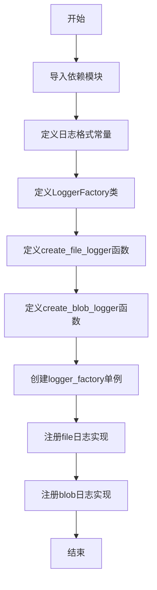
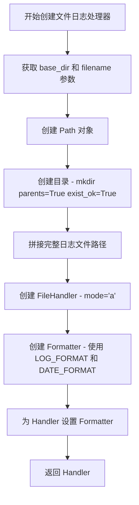
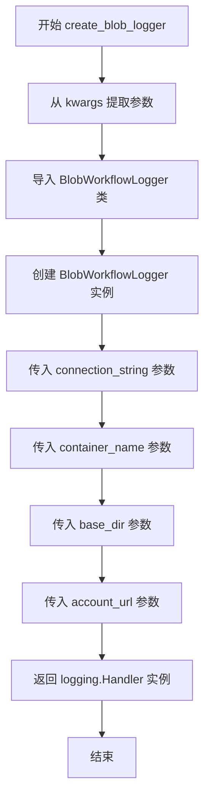
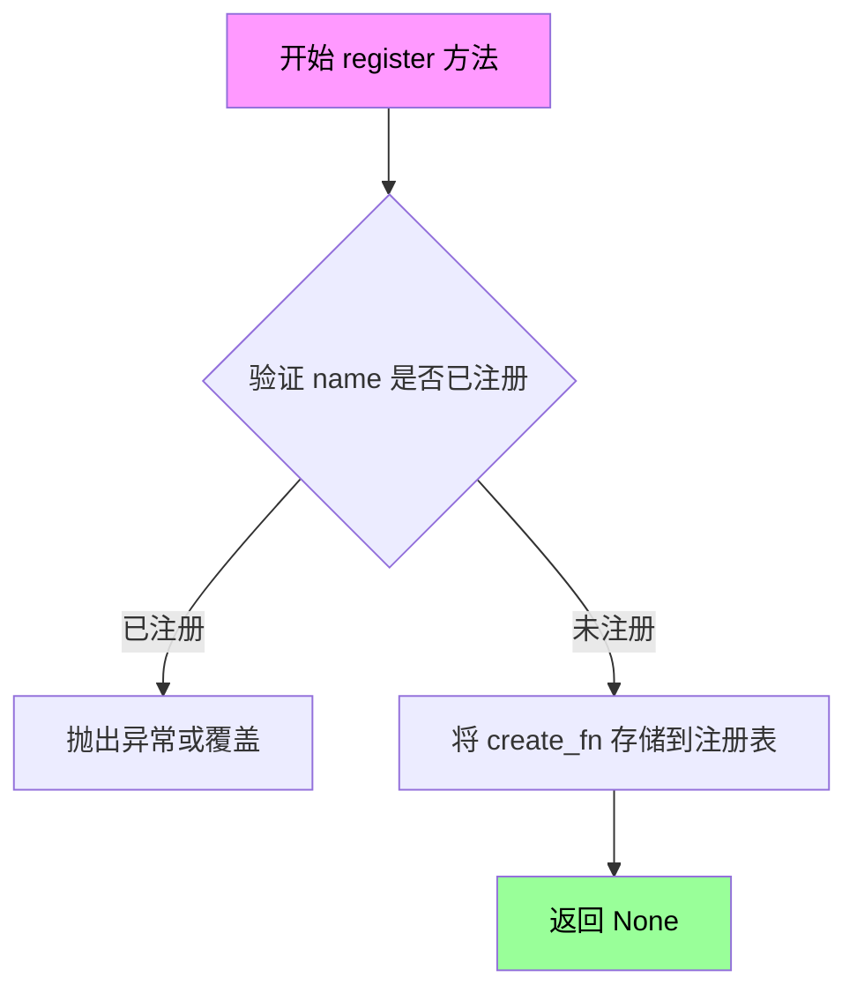
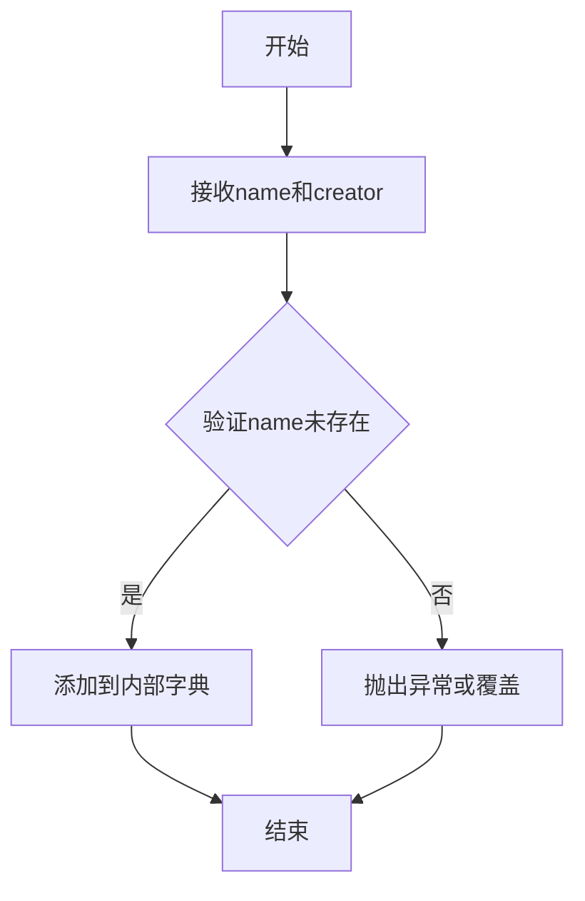
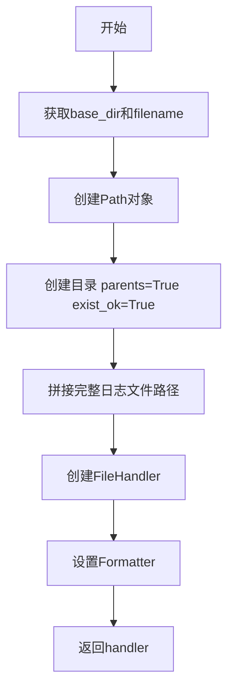
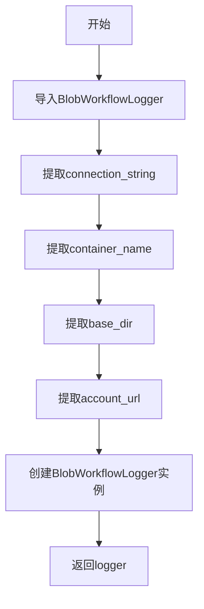

# `graphrag\packages\graphrag\graphrag\logger\factory.py` 详细设计文档

一个日志工厂模块，通过工厂模式提供文件日志和Blob存储日志两种日志处理器的创建与注册功能，支持用户自定义日志实现。

## 整体流程



## 类结构

```
LoggerFactory (继承自Factory基类)
└── 注册实现: create_file_logger, create_blob_logger
```

## 全局变量及字段


### `LOG_FORMAT`
    
日志输出格式字符串，定义每条日志的时间、级别、名称和消息的格式

类型：`str`
    


### `DATE_FORMAT`
    
日志时间戳的日期格式字符串，用于指定日期时间的显示格式

类型：`str`
    


### `logger_factory`
    
全局日志工厂实例，用于注册和创建不同类型的日志处理器

类型：`LoggerFactory`
    


    

## 全局函数及方法


### `create_file_logger`

创建一个基于文件的日志处理器，用于将日志输出到指定目录的文件中。

参数：

- `**kwargs`：可变关键字参数，包含以下必需参数：
  - `base_dir`：`str`，日志文件所在的根目录路径
  - `filename`：`str`，日志文件的名称

返回值：`logging.Handler`，返回一个配置好的文件日志处理器对象

#### 流程图



#### 带注释源码

```python
def create_file_logger(**kwargs) -> logging.Handler:
    """Create a file-based logger."""
    # 从 kwargs 中提取 base_dir 参数，作为日志文件存放的根目录
    base_dir = kwargs["base_dir"]
    # 从 kwargs 中提取 filename 参数，作为日志文件的名称
    filename = kwargs["filename"]
    # 将字符串路径转换为 Path 对象，便于路径操作
    log_dir = Path(base_dir)
    # 创建日志目录，如果父目录不存在则一并创建，exist_ok=True 避免目录已存在时报错
    log_dir.mkdir(parents=True, exist_ok=True)
    # 拼接完整的日志文件路径：base_dir/filename
    log_file_path = log_dir / filename

    # 创建文件日志处理器，使用追加模式 'a' 保留历史日志
    handler = logging.FileHandler(str(log_file_path), mode="a")

    # 创建格式化器，定义日志输出格式
    # 格式包含：时间 - 日志级别 - logger名称 - 消息内容
    formatter = logging.Formatter(fmt=LOG_FORMAT, datefmt=DATE_FORMAT)
    # 为处理器设置格式化器
    handler.setFormatter(formatter)

    # 返回配置好的日志处理器，可直接添加到 logger 中使用
    return handler
```


### `create_blob_logger`

创建基于 Azure Blob 存储的日志处理器，用于将日志输出到 Azure Blob 存储服务。

参数：

- `connection_string`：`str`，Azure Blob 存储的连接字符串，用于身份验证和连接
- `container_name`：`str`，Azure Blob 存储的容器名称，指定日志文件存放的容器
- `base_dir`：`str`，本地基础目录路径，用于确定日志文件的相对路径
- `account_url`：`str`，Azure 存储账户的 URL 地址，用于定位存储服务

返回值：`logging.Handler`，返回一个配置好的 Blob 存储日志处理器实例

#### 流程图



#### 带注释源码

```python
def create_blob_logger(**kwargs) -> logging.Handler:
    """Create a blob storage-based logger."""
    # 从 kwargs 中导入 Azure Blob 工作流日志记录器类
    # 该类负责处理与 Azure Blob 存储的交互逻辑
    from graphrag.logger.blob_workflow_logger import BlobWorkflowLogger

    # 创建并返回一个 BlobWorkflowLogger 实例
    # 参数说明：
    # - connection_string: Azure 存储连接字符串，用于身份验证
    # - container_name: Azure Blob 容器名称，指定日志存储位置
    # - base_dir: 本地基础目录，用于日志文件的组织
    # - account_url: Azure 存储账户端点 URL
    return BlobWorkflowLogger(
        connection_string=kwargs["connection_string"],  # Azure 连接字符串
        container_name=kwargs["container_name"],         # Blob 容器名称
        base_dir=kwargs["base_dir"],                     # 日志基础目录
        account_url=kwargs["account_url"],               # 存储账户 URL
    )
```


### LoggerFactory.register

描述：该方法继承自 `Factory` 基类，用于注册日志处理程序的创建函数到工厂注册表中，允许工厂根据给定的名称创建相应的日志处理器实例。

参数：

- `name`：`str`，日志处理程序的标识名称，用于后续通过工厂创建该类型的日志处理器
- `create_fn`：`Callable[..., logging.Handler]`（或 `typing.Callable`），创建日志处理程序的函数，接受关键字参数并返回 `logging.Handler` 实例

返回值：`None`，该方法仅注册创建函数，不返回任何值

#### 流程图



#### 带注释源码

```python
# 由于 register 方法定义在 graphrag_common.factory.Factory 基类中，
# 以下为基于工厂模式推测的典型实现

def register(self, name: str, create_fn: Callable[..., logging.Handler]) -> None:
    """注册一个日志处理程序创建函数到工厂注册表。
    
    Args:
        name: 日志处理程序的唯一标识名称（如 'file', 'blob'）
        create_fn: 创建日志处理程序的函数，接受关键字参数并返回 logging.Handler
        
    Returns:
        None
        
    Raises:
        ValueError: 如果名称已被注册
    """
    # 检查是否已存在同名注册
    if name in self._registry:
        raise ValueError(f"Logger type '{name}' is already registered")
    
    # 将创建函数存储到内部注册表中
    self._registry[name] = create_fn
    
    # 返回 None，完成注册
    return None


# 在实际代码中的调用示例
logger_factory.register(ReportingType.file.value, create_file_logger)
logger_factory.register(ReportingType.blob.value, create_blob_logger)
```

## 关键组件


### 一段话描述

该代码实现了一个日志工厂系统，通过工厂模式提供文件日志和Blob存储日志两种日志处理器的创建与注册机制，允许用户灵活配置日志输出目标。

### 文件的整体运行流程

1. 模块导入阶段：加载logging标准库、Path路径处理、Factory基类和ReportingType枚举
2. 全局配置初始化：定义日志格式字符串LOG_FORMAT和日期格式DATE_FORMAT
3. 工厂类定义：创建LoggerFactory泛型类继承自Factory基类
4. 日志处理器实现：定义create_file_logger和create_blob_logger两个函数分别创建文件和Blob日志处理器
5. 工厂实例化与注册：创建logger_factory单例并注册file和blob两种内置日志类型

### 类的详细信息

#### LoggerFactory类

**类说明**：继承自Factory基类的泛型工厂类，用于管理日志处理器的注册和创建。

**类字段**：
- 无显式类字段

**类方法**：
- register(name: str, creator: Callable) - 注册日志处理器创建函数
- create(name: str, **kwargs) - 根据名称创建对应的日志处理器

#### 类方法详情

##### register方法

**方法签名**：
```python
def register(self, name: str, creator: Callable[[...], logging.Handler]) -> None
```

**参数**：
| 参数名 | 参数类型 | 参数描述 |
|--------|----------|----------|
| name | str | 日志处理器标识名称 |
| creator | Callable | 创建日志处理器的函数 |

**返回值类型**：None

**返回值描述**：无返回值，仅注册到内部映射

**mermaid流程图**：


**带注释源码**：
```python
def register(self, name: str, creator: Callable[[...], logging.Handler]) -> None:
    """Register a logger implementation.
    
    Args:
        name: Unique identifier for the logger type
        creator: Callable that returns a logging.Handler instance
    """
    # 内部实现将creator添加到_factory_creators字典
```

### 全局变量和全局函数详细信息

#### LOG_FORMAT

**变量名**：LOG_FORMAT

**类型**：str

**描述**：日志输出格式模板，包含时间、毫秒、级别、名称和消息

#### DATE_FORMAT

**变量名**：DATE_FORMAT

**类型**：str

**描述**：日期时间格式模板，精确到秒级别

#### logger_factory

**变量名**：logger_factory

**类型**：LoggerFactory[logging.Handler]

**描述**：全局日志工厂单例实例，已预注册file和blob两种日志类型

#### create_file_logger函数

**函数签名**：
```python
def create_file_logger(**kwargs) -> logging.Handler
```

**参数**：
| 参数名 | 参数类型 | 参数描述 |
|--------|----------|----------|
| base_dir | str | 日志文件基础目录路径 |
| filename | str | 日志文件名 |

**返回值类型**：logging.Handler

**返回值描述**：配置好的FileHandler实例，用于将日志写入文件

**mermaid流程图**：


**带注释源码**：
```python
def create_file_logger(**kwargs) -> logging.Handler:
    """Create a file-based logger."""
    # 从kwargs中提取必要参数
    base_dir = kwargs["base_dir"]
    filename = kwargs["filename"]
    # 使用Path处理目录，确保目录存在（递归创建）
    log_dir = Path(base_dir)
    log_dir.mkdir(parents=True, exist_ok=True)
    # 拼接完整文件路径
    log_file_path = log_dir / filename

    # 创建文件日志处理器，追加模式
    handler = logging.FileHandler(str(log_file_path), mode="a")

    # 创建格式化器并设置给handler
    formatter = logging.Formatter(fmt=LOG_FORMAT, datefmt=DATE_FORMAT)
    handler.setFormatter(formatter)

    return handler
```

#### create_blob_logger函数

**函数签名**：
```python
def create_blob_logger(**kwargs) -> logging.Handler
```

**参数**：
| 参数名 | 参数类型 | 参数描述 |
|--------|----------|----------|
| connection_string | str | Azure Blob存储连接字符串 |
| container_name | str | Blob容器名称 |
| base_dir | str | 日志基础目录 |
| account_url | str | 存储账户URL |

**返回值类型**：logging.Handler

**返回值描述**：BlobWorkflowLogger实例，用于将日志写入Azure Blob存储

**mermaid流程图**：


**带注释源码**：
```python
def create_blob_logger(**kwargs) -> logging.Handler:
    """Create a blob storage-based logger."""
    # 延迟导入避免循环依赖
    from graphrag.logger.blob_workflow_logger import BlobWorkflowLogger

    # 使用kwargs中的参数创建Blob日志记录器
    return BlobWorkflowLogger(
        connection_string=kwargs["connection_string"],
        container_name=kwargs["container_name"],
        base_dir=kwargs["base_dir"],
        account_url=kwargs["account_url"],
    )
```

### 关键组件信息

### LoggerFactory工厂类

工厂模式实现，继承自graphrag_common.factory.Factory基类，提供日志处理器的注册和创建机制

### create_file_logger函数

文件日志处理器创建函数，负责目录创建和FileHandler配置

### create_blob_logger函数

Azure Blob存储日志处理器创建函数，封装BlobWorkflowLogger的实例化

### logger_factory全局实例

预配置的单例工厂，已注册file和blob两种日志类型的全局工厂实例

### BlobWorkflowLogger依赖

外部依赖的日志实现类，通过延迟导入引用

### 潜在的技术债务或优化空间

1. **错误处理缺失**：create_file_logger和create_blob_logger函数未对kwargs中缺失必要参数进行处理，可能导致运行时KeyError
2. **日志级别配置**：工厂未提供日志级别配置接口，无法灵活设置不同处理器的日志级别
3. **类型注解不完整**：LoggerFactory类的register和create方法缺少详细的类型注解
4. **资源清理**：FileHandler和BlobWorkflowLogger未实现显式的资源清理或上下文管理协议
5. **单元测试覆盖**：代码中无任何测试用例，无法验证各组件的正确性

### 其它项目

#### 设计目标与约束

- 目标：提供统一的日志处理器创建接口，支持多种日志存储后端
- 约束：依赖Python内置logging架构，工厂不返回实例仅配置日志

#### 错误处理与异常设计

- 目录创建使用exist_ok=True避免目录已存在异常
- 缺少参数验证逻辑，存在隐性异常风险

#### 数据流与状态机

- 数据流：配置参数 -> 工厂方法 -> 处理器创建 -> 日志输出
- 状态：静态配置阶段 -> 运行时日志记录阶段

#### 外部依赖与接口契约

- graphrag_common.factory.Factory：工厂基类
- graphrag.config.enums.ReportingType：日志类型枚举
- graphrag.logger.blob_workflow_logger.BlobWorkflowLogger：Blob日志实现类
- pathlib.Path：路径处理（标准库）
- logging：日志框架（标准库）


## 问题及建议


### 已知问题

-   **缺少参数验证**：create_file_logger 和 create_blob_logger 函数没有对必需参数进行显式验证，如果 kwargs 缺少必要字段，可能在运行时产生难以追踪的错误
-   **异常处理缺失**：Path.mkdir、logging.FileHandler 构造函数以及 BlobWorkflowLogger 的创建过程均未进行异常捕获，可能导致程序意外终止
-   **硬编码配置**：日志格式(LOG_FORMAT)、日期格式(DATE_FORMAT)和文件写入模式(mode="a")均为硬编码，限制了灵活性
-   **延迟导入风险**：create_blob_logger 在函数内部延迟导入 BlobWorkflowLogger，虽然避免了循环依赖，但将导入错误延迟到运行时
-   **日志轮转缺失**：使用基础的 logging.FileHandler，没有配置日志轮转机制，长时间运行可能导致日志文件过大
-   **类型注解不精确**：工厂方法返回类型标注为 logging.Handler，但实际返回的是具体子类(如 BlobWorkflowLogger)，类型信息不够精确

### 优化建议

-   添加参数验证：在函数入口处检查必需参数是否存在，可使用 Pydantic 或自定义验证逻辑
-   增加异常处理：为文件操作和 blob 初始化添加 try-except 块，捕获并转换有意义的异常
-   配置外部化：将日志格式、写入模式等配置提取到配置文件中，支持运行时定制
-   统一导入位置：将 BlobWorkflowLogger 的导入移至模块顶部，配合类型检查和静态分析工具
-   添加日志轮转：使用 logging.handlers.RotatingFileHandler 或 logging.handlers.TimedRotatingFileHandler 替代 FileHandler
-   完善类型注解：为工厂类和方法添加泛型约束，确保类型安全
-   考虑添加工厂方法用于查询已注册的日志类型，增强可扩展性

## 其它


### 设计目标与约束

本模块的设计目标是提供一个灵活的日志工厂系统，支持创建不同类型的日志处理器（文件存储、Azure Blob存储等），同时允许用户注册自定义日志实现。约束包括：1) 依赖Python内置logging架构，不直接返回日志实例而是通过配置方式工作；2) 必须遵循Factory基类的注册机制；3) 所有日志处理器必须返回logging.Handler类型。

### 错误处理与异常设计

1. **文件日志创建**：若base_dir路径无效或无权限创建目录，Path.mkdir()会抛出FileNotFoundError或PermissionError；若磁盘空间不足，FileHandler可能抛出OSError。建议调用方捕获IOException并提供友好的错误提示。
2. **Blob日志创建**：依赖graphrag.logger.blob_workflow_logger模块，若导入失败会抛出ImportError；BlobWorkflowLogger构造时的参数缺失或无效会导致KeyError或相关验证异常。
3. **工厂注册冲突**：重复注册相同key的处理器会覆盖已有实现，建议通过警告日志提示。

### 外部依赖与接口契约

1. **核心依赖**：Python标准库logging、pathlib；graphrag_common.factory.Factory基类；graphrag.config.enums.ReportingType枚举类型。
2. **可选依赖**：graphrag.logger.blob_workflow_logger.BlobWorkflowLogger（仅在创建blob日志时需要）。
3. **接口契约**：所有注册到LoggerFactory的创建函数必须接受**kwargs参数并返回logging.Handler实例；ReportingType枚举需包含file和blob两个值与注册key对应。

### 性能考虑

1. **文件日志**：FileHandler默认使用文本模式追加写入，高并发场景下建议评估是否需要日志轮转机制（logging.handlers.RotatingFileHandler）。
2. **Blob日志**：网络IO可能成为瓶颈，建议评估异步写入或批量上传策略。
3. **工厂查找**：register和create操作的时间复杂度为O(1)，注册表规模较小时性能可忽略。

### 安全性考虑

1. **路径遍历风险**：create_file_logger未验证filename参数是否存在../等路径遍历攻击风险，建议添加路径安全校验。
2. **敏感信息**：日志内容可能包含敏感数据，需确保日志存储路径的访问权限控制；Blob存储需使用安全的连接字符串管理机制。
3. **日志注入**：用户输入直接写入日志可能造成日志污染，建议在Formatter层面实施输入过滤。

### 兼容性考虑

1. **Python版本**：代码使用from __future__ import annotations支持类型注解的前向引用，兼容Python 3.7+。
2. **日志格式**：LOG_FORMAT和DATE_FORMAT为固定格式，若需国际化需重构为可配置格式。
3. ** Factory基类**：依赖graphrag_common的Factory实现，需确保版本兼容性。

### 配置管理

配置通过kwargs传递，支持以下参数：
- **文件日志**：base_dir(必需，字符串)、filename(必需，字符串)
- **Blob日志**：connection_string(必需，字符串)、container_name(必需，字符串)、base_dir(必需，字符串)、account_url(必需，字符串)

建议使用graphrag.config模块中的配置模型统一管理这些参数，提供配置验证和默认值设置。

### 测试策略

1. **单元测试**：针对create_file_logger和create_blob_logger分别测试正常路径和异常路径；测试LoggerFactory的register、create、get等方法。
2. **集成测试**：测试完整的日志器创建流程，验证日志输出到指定存储后可正常读取。
3. **Mock策略**：BlobWorkflowLogger可使用mock替代，避免真实Azure存储操作。

### 数据流与状态机

数据流如下：
1. 客户端调用logger_factory.create(ReportingType.file.value, **kwargs)
2. Factory基类根据key查找对应的创建函数
3. 创建函数接收kwargs并实例化对应的logging.Handler
4. Handler返回后由客户端配置到logging.Logger

状态机涉及：Factory注册表（已注册/未注册）、日志处理器状态（初始化/活跃/关闭）。

### 版本演进

1. **短期**：添加日志轮转支持、路径安全校验、配置验证模块。
2. **中期**：支持更多存储后端（S3、Google Cloud Storage）、支持异步日志写入。
3. **长期**：提供日志聚合分析能力、统一的日志监控接口。

    