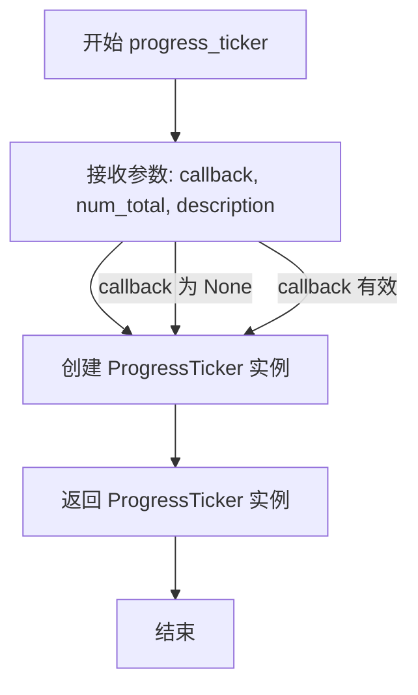
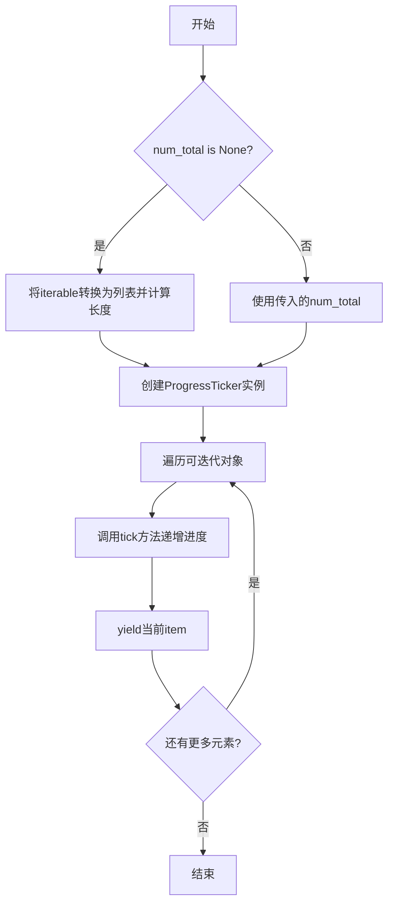
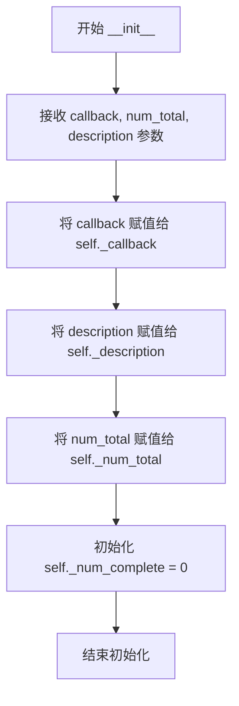
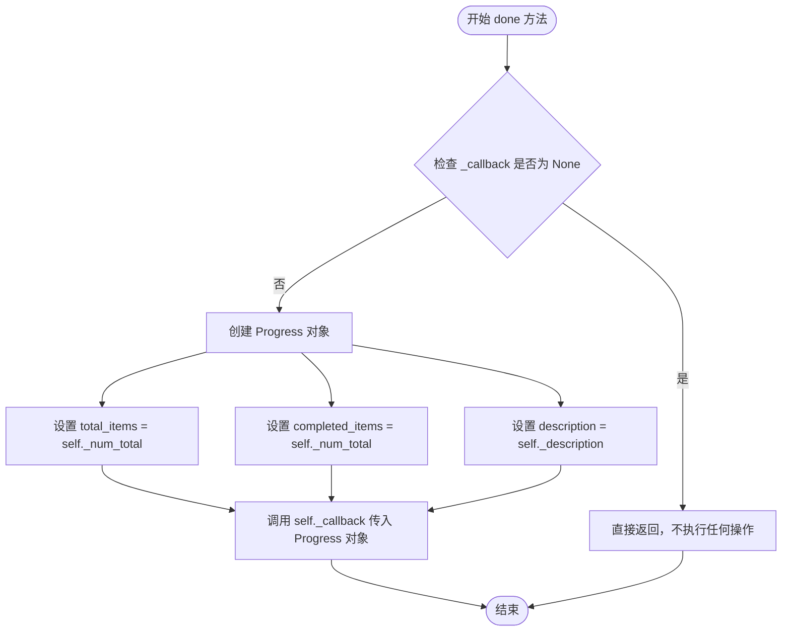

# `graphrag\packages\graphrag\graphrag\logger\progress.py` 详细设计文档

一个进度日志工具库，通过回调机制报告任务执行进度，支持增量更新进度和包装可迭代对象以实时追踪处理状态。

## 整体流程

```mermaid
graph TD
    A[开始] --> B{检查 num_total}
    B -- None --> C[计算 iterable 长度]
    B -- 已有值 --> D[创建 ProgressTicker]
    C --> D
    D --> E[遍历 iterable]
    E --> F[调用 tick(1) 更新进度]
    F --> G{是否有回调函数?}
    G -- 是 --> H[创建 Progress 对象]
    H --> I[调用回调函数]
    G -- 否 --> J[记录日志]
    I --> K[yield item]
    J --> K
    K --> L{还有更多元素?}
    L -- 是 --> E
    L -- 否 --> M[结束]
```

## 类结构

```
TypeVar<T>
├── logger (logging.Logger)
├── Progress (dataclass)
│   ├── description: str | None
│   ├── total_items: int | None
│   └── completed_items: int | None
├── ProgressHandler (Callable type alias)
└── ProgressTicker
    ├── _callback: ProgressHandler | None
    ├── _description: str
    ├── _num_total: int
    ├── _num_complete: int
    ├── __init__()
    ├── __call__(num_ticks: int)
    └── done()
global functions:
├── progress_ticker()
└── progress_iterable()
```

## 全局变量及字段


### `T`
    
类型变量，用于泛型

类型：`TypeVar`
    


### `logger`
    
模块级日志记录器

类型：`logging.Logger`
    


### `ProgressHandler`
    
进度处理函数的类型别名

类型：`Callable[[Progress], None]`
    


### `Progress.description`
    
进度描述信息

类型：`str | None`
    


### `Progress.total_items`
    
总项目数

类型：`int | None`
    


### `Progress.completed_items`
    
已完成项目数

类型：`int | None`
    


### `ProgressTicker._callback`
    
进度回调函数

类型：`ProgressHandler | None`
    


### `ProgressTicker._description`
    
进度描述

类型：`str`
    


### `ProgressTicker._num_total`
    
总数量

类型：`int`
    


### `ProgressTicker._num_complete`
    
已完成数量

类型：`int`
    
    

## 全局函数及方法


### `progress_ticker`

这是一个工厂函数，用于创建 `ProgressTicker` 实例。它接收进度回调函数、总项目数和描述作为参数，并返回一个配置好的 `ProgressTicker` 对象，以便在迭代过程中报告进度。

参数：

- `callback`：`ProgressHandler | None`，用于处理进度报告的回调函数，当为 `None` 时不执行任何回调
- `num_total`：`int`，要处理的总项目数
- `description`：`str = ""`，进度任务的描述信息，默认为空字符串

返回值：`ProgressTicker`，返回新创建的 `ProgressTicker` 实例

#### 流程图



#### 带注释源码

```python
def progress_ticker(
    callback: ProgressHandler | None,  # 进度回调函数，可为 None
    num_total: int,                    # 总项目数
    description: str = ""              # 进度描述，默认为空字符串
) -> ProgressTicker:
    """Create a progress ticker.
    
    这是一个工厂函数，用于创建 ProgressTicker 实例。
    它简化了 ProgressTicker 对象的创建过程，提供了更直观的接口。
    
    参数:
        callback: 处理进度更新的回调函数，签名为 (Progress) -> None
        num_total: 要处理的总项目数
        description: 任务的描述信息，用于日志输出
        
    返回:
        配置好的 ProgressTicker 实例，可用于报告进度
    """
    # 直接调用 ProgressTicker 构造函数，创建并返回实例
    return ProgressTicker(callback, num_total, description=description)
```


### `progress_iterable`

该函数用于包装可迭代对象，添加进度报告功能。当迭代中的每个项目被 yielded 时，会调用进度回调函数来报告当前进度。

参数：

- `iterable`：`Iterable[T]`，要包装的可迭代对象
- `progress`：`ProgressHandler | None`，进度回调处理器，用于接收进度更新
- `num_total`：`int | None`，可选参数，要迭代的总项目数。如果为 `None`，则会通过将可迭代对象转换为列表来计算长度
- `description`：`str`，可选参数，任务描述字符串，默认为空

返回值：`Iterable[T]`，返回包装后的可迭代对象，当遍历该对象时会自动报告进度

#### 流程图



#### 带注释源码

```python
def progress_iterable(
    iterable: Iterable[T],
    progress: ProgressHandler | None,
    num_total: int | None = None,
    description: str = "",
) -> Iterable[T]:
    """Wrap an iterable with a progress handler. Every time an item is yielded, the progress handler will be called with the current progress."""
    # 如果未提供总数，则通过将可迭代对象转换为列表来计算长度
    # 注意：这会一次性将整个可迭代对象加载到内存中
    if num_total is None:
        num_total = len(list(iterable))

    # 创建ProgressTicker实例，用于管理进度状态
    tick = ProgressTicker(progress, num_total, description=description)

    # 遍历原始可迭代对象
    for item in iterable:
        # 每次迭代递增进度计数
        tick(1)
        # 返回当前迭代项
        yield item
```


### ProgressTicker.__init__

初始化进度追踪器，创建一个用于增量报告任务进度的对象。

参数：

- `callback`：`ProgressHandler | None`，用于处理进度报告的回调函数，当进度更新时被调用
- `num_total`：`int`，任务的总项目数
- `description`：`str`，可选的进度描述，默认为空字符串

返回值：`None`，构造函数无返回值

#### 流程图



#### 带注释源码

```python
def __init__(
    self, callback: ProgressHandler | None, num_total: int, description: str = ""
):
    """初始化进度追踪器。

    创建一个 ProgressTicker 实例，用于跟踪任务进度并通过回调函数报告进度。

    参数:
        callback: 处理进度报告的可调用对象，接收 Progress 对象作为参数。
                  如果为 None，则不会报告进度。
        num_total: 任务的总项目数，用于计算完成百分比。
        description: 进度描述文本，用于标识进度任务的内容。

    返回值:
        无返回值（__init__ 方法）。

    示例:
        >>> def handler(progress):
        ...     print(f"进度: {progress.completed_items}/{progress.total_items}")
        ...
        >>> ticker = ProgressTicker(handler, 100, "数据处理")
        >>> ticker(10)  # 报告进度为 10/100
    """
    self._callback = callback  # 存储进度回调函数，允许为 None（静默模式）
    self._description = description  # 存储描述信息，用于日志和进度报告
    self._num_total = num_total  # 存储总项目数
    self._num_complete = 0  # 初始化已完成项目计数为 0
```


### `ProgressTicker.__call__(num_ticks)`

发射进度更新，每当有进度更新时调用此方法，累积已完成的项数并通过回调函数报告当前进度。

参数：

- `num_ticks`：`int`，进度增加的步进数，默认为 1，表示每次调用增加 1 个已完成项

返回值：`None`，无返回值，仅通过回调函数更新进度

#### 流程图

```mermaid
flowchart TD
    A[开始 __call__] --> B[累加进度: _num_complete += num_ticks]
    B --> C{callback 是否为 None?}
    C -->|是| D[创建 Progress 对象]
    C -->|否| E[结束]
    D --> F{description 是否存在?}
    F -->|是| G[记录日志: description + completed/total]
    F -->|否| H[跳过日志记录]
    G --> I[调用回调函数: callback(p)]
    H --> I
    I --> E
```

#### 带注释源码

```python
def __call__(self, num_ticks: int = 1) -> None:
    """Emit progress."""
    # 1. 累加已完成的项数
    #    将传入的 num_ticks 加到已完成计数上
    self._num_complete += num_ticks
    
    # 2. 检查回调函数是否存在
    #    如果没有设置回调，则直接返回，不进行任何操作
    if self._callback is not None:
        # 3. 创建 Progress 对象
        #    封装当前进度信息，包括总数、已完成数和描述
        p = Progress(
            total_items=self._num_total,      # 总任务数
            completed_items=self._num_complete, # 已完成任务数
            description=self._description,     # 进度描述
        )
        
        # 4. 如果有描述，则记录日志
        #    格式: "描述 已完成/总数"
        if p.description:
            logger.info("%s%s/%s", p.description, p.completed_items, p.total_items)
        
        # 5. 调用回调函数，传递进度对象
        #    通知外部进度更新
        self._callback(p)
```


### `ProgressTicker.done`

标记进度为完成状态，通过调用回调函数并传入已完成项数等于总项数的 Progress 对象来通知进度完成。

参数：

- `self`：隐式参数，ProgressTicker 实例本身，无需显式传递

返回值：`None`，无返回值

#### 流程图



#### 带注释源码

```python
def done(self) -> None:
    """Mark the progress as done."""
    # 检查回调函数是否存在
    if self._callback is not None:
        # 创建一个 Progress 对象，将完成项数设置为总项数，表示任务已完成
        self._callback(
            Progress(
                total_items=self._num_total,          # 总项目数
                completed_items=self._num_total,      # 将完成数设为总数，标记为完成
                description=self._description,        # 描述信息
            )
        )
```

## 关键组件


### Progress 数据类

用于表示任务进度的数据结构，包含描述、总项目数和已完成项目数三个字段。

### ProgressHandler 类型

进度处理回调函数的类型定义，接收 Progress 对象作为参数。

### ProgressTicker 类

增量发出进度报告的核心类，维护进度状态并在每次调用时更新进度，支持通过回调函数报告进度。

### progress_ticker 函数

工厂函数，用于创建 ProgressTicker 实例，封装了进度计时器的创建逻辑。

### progress_iterable 函数

将可迭代对象包装为带进度报告功能的迭代器，每次 yield 项目时调用进度回调，支持自动计算总数或显式指定总数。

### 进度回调机制

基于回调的进度通知系统，通过 ProgressHandler 接口实现进度事件的发布和订阅。


## 问题及建议


### 已知问题

-   **性能问题（双重迭代）**：`progress_iterable` 函数中使用 `num_total = len(list(iterable))` 会先完整遍历一次 iterable 获取长度，然后再遍历一次。对于大型数据集或生成器，这会导致严重的性能问题和内存浪费。
-   **日志冗余**：当 `description` 为空字符串时，`if p.description:` 条件为 False，不会打印描述文字，但仍然会调用 `logger.info()` 记录空消息，造成不必要的日志开销。
-   **缺少异常安全**：在 `progress_iterable` 的迭代过程中，如果发生异常，进度更新回调可能不会被正确调用，导致进度状态不一致。
- **无线程安全机制**：`ProgressTicker` 类在多线程环境下直接修改 `_num_complete` 计数器，存在竞态条件风险。
- **进度回调频率不可控**：每处理一个 item 就会调用一次回调，对于大量小项目的场景（如处理数百万个小文件），回调频率过高会带来性能开销。

### 优化建议

-   **优化双重迭代问题**：移除强制计算 `num_total` 的逻辑，允许调用者直接传入 `num_total`；或者提供一个选项来跳过长度计算（当 `num_total` 已知时）。
-   **改进日志条件判断**：将 `if p.description:` 改为 `if p.description and p.total_items is not None:`，更精确地控制日志输出条件，避免空消息日志。
-   **添加异常处理**：在 `progress_iterable` 的 try-finally 块中确保进度回调的完整性，即使发生异常也能标记当前进度。
-   **考虑线程安全**：使用 `threading.Lock` 保护 `_num_complete` 的修改操作，或提供线程安全版本。
-   **添加节流机制**：提供选项让回调可以按固定百分比或固定数量触发，而不是每次都触发（例如每完成 1% 或每 100 个 item 触发一次）。
-   **日志级别可配置**：将日志级别作为参数或配置项，允许调用者根据需要调整。

## 其它


### 设计目标与约束

该模块的设计目标是提供一个轻量级的进度跟踪和日志记录工具，用于在长时间运行的任务中向用户报告进度。约束条件包括：1) 进度报告通过回调函数机制实现，解耦进度产生者和消费者；2) 不依赖外部重型库，仅使用Python标准库；3) 设计为线程不安全（因为进度跟踪通常在单线程场景下使用）。

### 错误处理与异常设计

该模块的错误处理设计如下：1) `progress_iterable`函数在`num_total`为None时尝试通过`len(list(iterable))`获取长度，如果iterable不支持len操作会抛出TypeError，此异常由调用方处理；2) callback参数可为None，此时进度报告会静默丢弃；3) 没有显式的异常捕获机制，异常会向上传播到调用方。

### 数据流与状态机

数据流如下：调用方创建`ProgressTicker`或通过`progress_iterable`包装可迭代对象 → 每次迭代或调用tick时更新`_num_complete`计数器 → 构建Progress对象 → 调用callback或记录日志。状态机方面，ProgressTicker有两个隐式状态：进行中（_num_complete < _num_total）和已完成（调用done()或_num_complete >= _num_total）。

### 外部依赖与接口契约

外部依赖：仅依赖Python标准库（logging、collections.abc、dataclasses、typing）。接口契约：1) ProgressHandler类型接受一个Progress对象作为唯一参数，返回None；2) progress_ticker和progress_iterable函数返回可调用对象或可迭代对象；3) Progress数据类的字段均可选，允许部分填充。

### 性能考虑

性能设计要点：1) `progress_iterable`在num_total为None时会一次性将整个iterable转换为列表以计算长度，对于大型数据集可能导致内存问题，应考虑流式计算或允许调用方提供估算值；2) 每次tick都创建新的Progress对象，可能产生GC压力，可考虑对象复用；3) 日志记录使用logger.info，在生产环境中需考虑日志级别配置。

### 安全性考虑

该模块不涉及敏感数据处理，安全性风险较低。日志输出需注意不要在日志中记录敏感信息（如用户凭证、个人身份信息等）。回调函数的安全性由调用方负责确保。

### 并发和线程安全性

该模块设计为非线程安全。多个线程同时调用同一个ProgressTicker实例可能导致计数不准确。如果需要在多线程环境中使用，建议每个线程创建独立的ProgressTicker实例，或在外部加锁保护。

### 使用示例

```python
import logging

logging.basicConfig(level=logging.INFO)

def my_progress_handler(progress):
    print(f"Progress: {progress.completed_items}/{progress.total_items}")

# 示例1：使用progress_ticker
ticker = progress_ticker(my_progress_handler, 10, "Processing")
for i in range(10):
    # 处理任务
    ticker(1)
ticker.done()

# 示例2：使用progress_iterable
for item in progress_iterable(range(20), my_progress_handler, description="Loading"):
    # 处理item
    pass
```

### 版本兼容性说明

该代码使用Python 3.10+的语法特性（|联合类型语法），不支持Python 3.9及以下版本。若需兼容旧版Python，需将`str | None`改为`Optional[str]`，`int | None`改为`Optional[int]`。

    