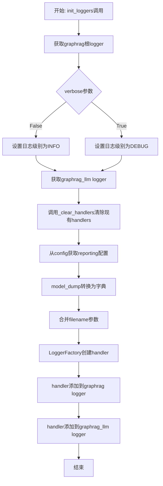
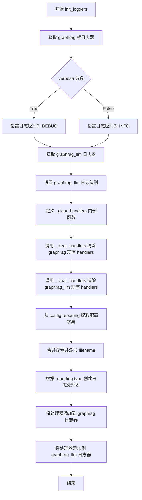
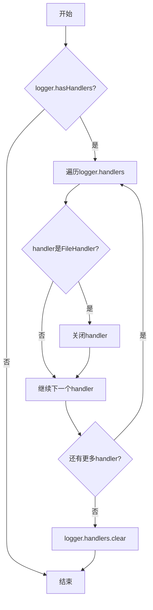

# `graphrag\packages\graphrag\graphrag\logger\standard_logging.py` 详细设计文档

graphrag包的标准化日志配置模块，提供统一的日志初始化功能，支持通过GraphRagConfig配置日志级别、处理器和输出文件，实现graphrag和graphrag_llm两个命名空间的日志统一管理。

## 整体流程



## 类结构

```
LoggerFactory (导入的工厂类)
└── init_loggers (主函数)
    └── _clear_handlers (内部函数)
```

## 全局变量及字段


### `DEFAULT_LOG_FILENAME`
    
Default log filename used when no filename is provided to the init_loggers function

类型：`str`
    


    

## 全局函数及方法


### `init_loggers`

该函数用于初始化 graphrag 包的日志系统，根据配置创建日志处理器并设置日志级别，支持文件和控制台两种日志输出方式。

参数：

- `config`：`GraphRagConfig`，GraphRAG 配置文件，包含报告配置等信息
- `verbose`：`bool`，是否启用 DEBUG 级别的详细日志，默认为 False
- `filename`：`str`，日志文件名，默认为 "indexing-engine.log"

返回值：`None`，该函数没有返回值

#### 流程图



#### 带注释源码

```python
def init_loggers(
    config: GraphRagConfig,
    verbose: bool = False,
    filename: str = DEFAULT_LOG_FILENAME,
) -> None:
    """Initialize logging handlers for graphrag based on configuration.

    Parameters
    ----------
    config : GraphRagConfig | None, default=None
        The GraphRAG configuration. If None, defaults to file-based reporting.
    verbose : bool, default=False
        Whether to enable verbose (DEBUG) logging.
    filename : Optional[str]
        Log filename on disk. If unset, will use a default name.
    """
    # 获取名为 "graphrag" 的根日志器
    logger = logging.getLogger("graphrag")
    
    # 根据 verbose 参数确定日志级别：详细模式为 DEBUG，否则为 INFO
    log_level = logging.DEBUG if verbose else logging.INFO
    # 设置根日志器的日志级别
    logger.setLevel(log_level)

    # 获取 LLM 专用日志器 "graphrag_llm"
    llm_logger = logging.getLogger("graphrag_llm")
    # 设置 LLM 日志器的日志级别与根日志器一致
    llm_logger.setLevel(log_level)

    def _clear_handlers(logger: logging.Logger) -> None:
        # 定义内部函数：清除日志器上所有现有的处理器
        # 避免重复添加处理器导致日志重复输出
        
        # 检查日志器是否有已存在的处理器
        if logger.hasHandlers():
            # 遍历所有处理器，关闭文件处理器以释放资源
            for handler in logger.handlers:
                if isinstance(handler, logging.FileHandler):
                    handler.close()
            # 清除所有处理器
            logger.handlers.clear()

    # 清除 graphrag 根日志器上的现有处理器
    _clear_handlers(logger)
    # 清除 graphrag_llm 日志器上的现有处理器
    _clear_handlers(llm_logger)

    # 从配置中获取 reporting 配置
    reporting_config = config.reporting
    # 将配置对象转换为字典
    config_dict = reporting_config.model_dump()
    # 合并配置字典，添加日志文件名参数
    args = {**config_dict, "filename": filename}

    # 使用工厂模式根据 reporting 类型创建对应的日志处理器
    handler = LoggerFactory().create(reporting_config.type, args)
    
    # 将创建的处理器添加到根日志器
    logger.addHandler(handler)
    # 将同一处理器添加到 LLM 日志器，实现日志共享
    llm_logger.addHandler(handler)
```


### `_clear_handlers`

清除指定日志记录器的所有处理器，用于避免重复日志。在初始化日志记录器时，先清除已有的处理器以防止重复记录日志。

参数：

-  `logger`：`logging.Logger`，要清除处理器的日志记录器对象

返回值：`None`，该函数没有返回值

#### 流程图



#### 带注释源码

```python
def _clear_handlers(logger: logging.Logger) -> None:
    """清除日志记录器的所有处理器，避免重复日志。
    
    Parameters
    ----------
    logger : logging.Logger
        要清除处理器的日志记录器对象
    """
    # 检查日志记录器是否有现有的处理器
    if logger.hasHandlers():
        # 遍历所有处理器，对于文件处理器先正确关闭
        for handler in logger.handlers:
            # 如果是文件处理器，关闭它以释放资源
            if isinstance(handler, logging.FileHandler):
                handler.close()
        # 清除所有处理器
        logger.handlers.clear()
```

## 关键组件


### 标准化日志配置模块

该模块提供GraphRAG包的标准化日志配置功能，支持基于配置的日志处理器创建、分层日志管理（graphrag根日志器和graphrag_llm子日志器）、处理器清理防止重复日志，以及verbose模式切换。

### init_loggers 函数

初始化graphrag的日志处理器，基于配置创建相应的日志处理器并添加到根日志器和LLM专用日志器。

### _clear_handlers 内部函数

清除日志器上所有现有处理器，关闭文件处理器防止资源泄漏。

### LoggerFactory

日志处理器工厂类，根据reporting类型创建对应的日志处理器实例。

### DEFAULT_LOG_FILENAME 常量

默认日志文件名常量，值为"indexing-engine.log"。

### logging.getLogger("graphrag")

GraphRAG包的根日志器，所有graphrag相关日志的父日志器。

### logging.getLogger("graphrag_llm")

专门用于LLM相关日志的子日志器，便于单独控制LLM日志级别。


## 问题及建议


### 已知问题

-   **内部函数重复定义**：`_clear_handlers` 定义在 `init_loggers` 函数内部，每次调用 `init_loggers` 都会重新定义该函数，造成资源浪费且不符合函数复用最佳实践
-   **缺少错误处理**：`LoggerFactory().create(reporting_config.type, args)` 调用缺乏异常捕获，若创建 handler 失败会导致程序崩溃
-   **handler 生命周期管理不当**：创建的 handler 添加到 logger 后没有保存引用，无法主动关闭或管理，可能导致资源泄漏
-   **缺少日志系统清理机制**：仅提供内部清理逻辑，但没有暴露公共方法供外部调用来正确关闭日志系统
-   **类型提示不一致**：`filename` 参数在文档字符串中标注为 `Optional[str]`，但函数签名中未体现此类型
-   **默认日志文件名固定**：`DEFAULT_LOG_FILENAME = "indexing-engine.log"` 是硬编码值，与实际日志配置可能不匹配
-   **多 logger 共享同一 handler**：主 logger 和 llm_logger 共用同一个 handler，可能导致日志交织、难以区分来源，且缺乏独立的日志级别控制
-   **缺乏线程安全考虑**：多线程环境下直接操作 `logger.handlers` 可能存在竞争条件

### 优化建议

-   将 `_clear_handlers` 提取为模块级私有函数，避免重复定义
-   为 `LoggerFactory().create()` 调用添加 try-except 异常处理，失败时回退到默认 handler 或抛出友好错误
-   在模块级别保存 handler 引用，并提供 `shutdown_loggers()` 公共方法用于资源清理
-   修正 `filename` 参数的类型提示为 `Optional[str]`
-   考虑让 llm_logger 使用独立的 handler，支持单独的日志级别和输出配置
-   添加线程锁保护对 logger handlers 的操作，确保多线程安全
-   考虑使用上下文管理器模式或提供初始化/清理的配对接口

## 其它


### 设计目标与约束

本模块的设计目标是为graphrag包提供统一、标准化的日志配置方案，确保整个应用使用一致的日志格式和输出方式。约束包括：必须与Python标准logging模块兼容；日志系统采用层级结构，根logger名为'graphrag'；所有graphrag相关的logger都应该是该根logger的子节点；配置应在应用启动时初始化一次。

### 错误处理与异常设计

代码中的错误处理主要体现在`_clear_handlers`函数中，在清理已有handler时会先关闭FileHandler以确保资源正确释放。如果`LoggerFactory().create()`创建handler失败，将抛出异常向上传递。调用方应确保config参数有效，reporting配置必须正确，否则会在运行时失败。

### 数据流与状态机

数据流：首先接收GraphRagConfig配置对象 → 提取reporting配置 → 转换为字典格式 → 调用LoggerFactory创建对应类型的handler → 清理旧handler → 将新handler添加到logger。无状态机设计，模块本身不维护状态。

### 外部依赖与接口契约

外部依赖包括：graphrag.logger.factory.LoggerFactory类、graphrag.config.models.graph_rag_config.GraphRagConfig配置模型、Python内置logging模块。接口契约：init_loggers函数接收config对象、verbose布尔值、filename字符串；无返回值；LoggerFactory.create()方法接收reporting类型字符串和配置字典，返回logging.Handler对象。

### 配置参数说明

config参数为GraphRagConfig类型，包含reporting子配置，用于指定日志报告类型。verbose参数为布尔类型，默认为False，为True时日志级别设为DEBUG，否则为INFO。filename参数为字符串类型，默认为"indexing-engine.log"，指定日志输出文件名。

### 使用示例与注意事项

使用示例在文档字符串中已给出：导入init_loggers函数，传入config配置调用初始化，然后在业务代码中通过logging.getLogger(__name__)获取logger并使用标准日志方法。注意事项：配置应在应用启动时执行一次；logger名称应以'graphrag.'开头以确保受根logger管理；重复调用init_loggers会清理之前的handler避免重复日志。

### 线程安全性

Python的logging模块本身是线程安全的，Logger对象可以在多线程环境中安全使用。但多个线程同时调用init_loggers可能存在竞态条件，建议在应用初始化阶段单线程环境下完成配置。

### 性能考虑

每次调用init_loggers都会清理并重新创建handler，在高频调用场景下可能影响性能。建议仅在应用启动时调用一次。DEBUG级别日志会产生大量输出，在生产环境应关闭verbose模式。

### 兼容性考虑

代码使用了TYPE_CHECKING进行类型提示的条件导入，确保运行时不会导入不必要的类型。依赖Python 3.8+的typing特性（typing.TYPE_CHECKING）。日志系统完全依赖Python标准库，无第三方依赖兼容性风险。

    