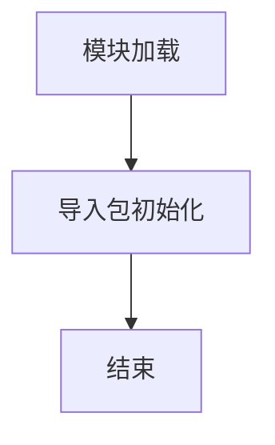

# `graphrag\packages\graphrag\graphrag\prompt_tune\__init__.py` 详细设计文档

这是prompt-tuning包的根模块，仅包含包的基本元信息（版权和MIT许可证声明），作为prompt-tuning包的入口点。

## 整体流程



## 类结构

```
prompt_tuning (根包)
└── __init__ (包初始化模块)
```

## 全局变量及字段


    

## 全局函数及方法


## 关键组件


### 模块概述

该代码为一个空白的 Python 包根模块，仅包含版权声明和模块文档字符串，无实际功能实现。

### 关键组件

由于提供的源代码仅包含包初始化文件和版权声明，未包含任何类、函数或变量定义，因此无法识别张量索引、惰性加载、反量化支持或量化策略等关键组件。

### 潜在的技术债务或优化空间

当前代码为占位符状态，需要实现核心功能模块。

### 其他说明

当前提供的代码片段不包含足够的实现细节来生成完整的详细设计文档。需要提供完整的源代码以便进行架构分析和文档生成。


## 问题及建议


### 已知问题

-   **缺乏版本信息**：未定义 `__version__` 变量，违反了 Python 包的常见最佳实践，用户无法通过 `package.__version__` 访问版本号
-   **未导出公共 API**：缺少 `__all__` 变量定义，不明确该包的公共接口是什么，不利于 IDE 自动补全和静态分析
-   **无实际功能暴露**：文件仅包含文档字符串，未导出任何子模块或便捷导入路径，用户需记忆完整的模块路径
-   **缺少包元数据**：未包含作者、主页、描述等元信息，不利于包管理和文档生成

### 优化建议

-   **添加版本信息**：在文件开头定义 `__version__ = "1.0.0"` 或从版本配置文件读取
-   **定义公共接口**：使用 `__all__` 显式声明导出的公共 API，如 `__all__ = ["PromptTuner", "Config", ...]`
-   **暴露子模块**：通过相对导入暴露核心模块，例如 `from .tuner import PromptTuner`，降低用户使用门槛
-   **添加包级文档**：在 docstring 中补充功能描述、使用示例和依赖信息
-   **配置元数据**：考虑添加 `__author__`、`__email__`、`__url__` 等元数据字段


## 其它


### 设计目标与约束

设计目标：构建一个轻量级、可扩展的prompt-tuning框架，支持多种预训练模型的提示调优功能，降低大模型微调的计算成本。约束：必须兼容主流开源大模型（如GPT、LLaMA等），保持代码的模块化和可测试性。

### 错误处理与异常设计

定义自定义异常类处理特定错误场景：PromptLengthExceededError（提示长度超限）、ModelLoadError（模型加载失败）、InvalidParameterError（参数验证失败）。异常设计遵循层次化原则，底层异常可被上层捕获并转换。

### 数据流与状态机

数据流：用户输入 → 提示模板处理 → 模型前向传播 → 输出解码 → 结果返回。状态机包含：初始化状态、就绪状态、运行状态、暂停状态、错误状态、终止状态。

### 外部依赖与接口契约

依赖：torch、transformers、numpy等主流深度学习框架。接口契约：暴露统一的PromptTuner接口类，定义train()、evaluate()、predict()等标准方法，确保不同模型实现的互换性。

### 配置管理与版本兼容性

采用YAML/JSON配置文件管理超参数，支持环境变量覆盖。建立版本语义化(semver)机制，记录breaking changes，确保不同版本间的向后兼容性。

### 性能指标与基准测试

定义关键性能指标：推理延迟、内存占用、GPU利用率、收敛速度。提供基准测试脚本，定期检测性能回归，设定性能阈值告警。

### 安全与合规

确保模型输出内容安全过滤，敏感数据脱敏处理。符合MIT开源许可要求，记录第三方依赖的许可证信息。

### 部署与运维

支持本地训练和分布式训练，提供Docker容器化部署方案。定义健康检查接口、日志级别配置、监控指标导出格式。

### 测试策略

单元测试覆盖核心算法逻辑，集成测试验证端到端流程，压力测试评估大规模场景下的稳定性。测试覆盖率目标不低于80%。

### 文档与示例

提供API文档自动生成（使用sphinx/doxygen），编写快速开始指南、API使用示例、最佳实践手册，包含常见问题排查文档。


    