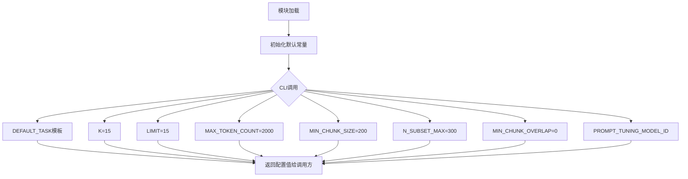

# `graphrag\packages\graphrag\graphrag\prompt_tune\defaults.py` 详细设计文档

该文件是prompt-tuning模块的默认配置定义文件，包含了用于提示词调优的各类默认参数值，如任务描述模板、K值、LIMIT、token计数限制、块大小配置以及默认模型ID等，供CLI和核心模块在运行时引用以设置默认行为。

## 整体流程



## 类结构

```
无类层次结构（纯配置模块）
```

## 全局变量及字段


### `DEFAULT_TASK`
    
默认的任务提示模板，包含领域占位符用于prompt-tuning

类型：`str`
    


### `K`
    
邻居节点采样数量的默认值，用于图社区发现算法

类型：`int`
    


### `LIMIT`
    
返回结果数量的限制值，约束查询或处理的上限

类型：`int`
    


### `MAX_TOKEN_COUNT`
    
最大token数量限制，用于控制生成文本的长度

类型：`int`
    


### `MIN_CHUNK_SIZE`
    
最小文本块大小，用于文本分块处理的最小单位

类型：`int`
    


### `N_SUBSET_MAX`
    
子集最大数量限制，用于控制数据子集的大小

类型：`int`
    


### `MIN_CHUNK_OVERLAP`
    
文本块之间的最小重叠大小，用于分块时的重叠区域

类型：`int`
    


### `PROMPT_TUNING_MODEL_ID`
    
默认的prompt-tuning模型标识符，指定使用的completion模型

类型：`str`
    


    

## 全局函数及方法


## 关键组件


### DEFAULT_TASK

用于定义提示调整任务的默认模板，通过{domain}占位符支持动态领域定制，描述社区关系和结构识别的核心目标。

### K

控制相关数据或邻居数量的限制参数，值为15，用于约束返回结果的数量规模。

### LIMIT

与K功能类似的限制参数，值为15，用于限制输出的数量上限。

### MAX_TOKEN_COUNT

定义生成内容的最长token数量，设置为2000，用于控制输出长度和资源消耗。

### MIN_CHUNK_SIZE

设置文本分块的最小大小为200字符，用于文本分割时的最小单元控制。

### N_SUBSET_MAX

定义子集的最大数量限制为300，用于控制数据子集的处理规模。

### MIN_CHUNK_OVERLAP

设置文本块之间的最小重叠量为0，表示块之间不进行重叠处理。

### PROMPT_TUNING_MODEL_ID

标识默认使用的提示调整模型，值为"default_completion_model"，用于指定底层语言模型。


## 问题及建议


### 已知问题

-   **魔法数字缺乏文档说明**：K=15、LIMIT=15、MAX_TOKEN_COUNT=2000、MIN_CHUNK_SIZE=200、N_SUBSET_MAX=300等数值作为硬编码的常量存在，没有注释解释这些值的来源、选择依据或业务意义
-   **缺乏类型注解**：所有变量都没有类型注解，不利于静态代码分析和IDE的智能提示支持
-   **单位不明确**：MIN_CHUNK_SIZE、MIN_CHUNK_OVERLAP、MAX_TOKEN_COUNT等数值未注释说明单位（字节、字符还是token数）
-   **DEFAULT_TASK模板字符串使用不当**：使用三引号但实际是单行字符串，且{domain}占位符的使用场景和替换方式缺乏说明
-   **配置值耦合且无验证**：K和LIMIT都等于15，但这两个变量名称不同，可能代表不同概念却使用相同值，且没有任何范围校验逻辑
-   **缺乏配置管理机制**：所有配置以模块级变量形式存在，无法支持运行时动态修改或从外部配置源加载
-   **接口契约不明确**：虽然注释提到"从CLI访问"，但未提供明确的公共API接口，无法确定哪些配置应该被导出使用
-   **注释与实现不一致**：注释警告"不要添加长运行代码"，但未说明具体的性能约束要求

### 优化建议

-   为每个常量添加类型注解和docstring，说明数值含义、单位和选择理由
-   考虑使用dataclass或Pydantic创建配置类，提供默认值验证和类型安全
-   将DEFAULT_TASK改为标准字符串格式（单引号或双引号），或若确实需要多行支持则添加详细文档
-   提取magic numbers为枚举类型或配置类，提供业务含义明确的命名
-   添加配置验证逻辑，确保参数之间的逻辑一致性（如MIN_CHUNK_SIZE应小于MAX_TOKEN_COUNT等）
-   提供显式的公共API（如__all__或get_config()函数）来定义哪些配置可被外部访问

## 其它


### 设计目标与约束

本模块旨在为prompt-tuning模块提供可配置的默认参数，确保CLI工具在快速响应的同时具备合理的默认行为。设计约束包括：1) 不能在此文件中添加长运行代码以保持CLI快速响应；2) 必须使用简洁的导入避免性能开销；3) 所有常量需保持为Python基本数据类型以支持跨平台兼容性。

### 错误处理与异常设计

本模块作为配置提供者，不直接处理业务逻辑错误。若配置值无效（如MIN_CHUNK_SIZE大于MAX_TOKEN_COUNT），应在调用方进行校验并抛出ValueError或AssertionError。建议在使用这些配置的项目启动时进行配置一致性检查。

### 数据流与状态机

本模块为纯数据提供模块，不涉及状态机设计。数据流为单向：配置文件定义常量 → 被CLI/业务代码导入使用 → 作为参数传递给prompt-tuning引擎。不存在内部状态变化或复杂的数据转换逻辑。

### 外部依赖与接口契约

本模块无外部依赖，仅包含Python内置类型（str、int）。接口契约：1) DEFAULT_TASK为字符串模板，需包含{domain}占位符；2) K、LIMIT、N_SUBSET_MAX为正整数；3) MAX_TOKEN_COUNT、MIN_CHUNK_SIZE为正整数且满足MIN_CHUNK_SIZE < MAX_TOKEN_COUNT；4) MIN_CHUNK_OVERLAP为非负整数；5) PROMPT_TUNING_MODEL_ID为非空字符串。

### 配置文件与参数说明

DEFAULT_TASK: 字符串，prompt-tuning的默认任务描述模板，包含{domain}占位符用于动态替换
K: 整数，默认值为15，邻居节点采样数量
LIMIT: 整数，默认值为15，查询结果返回数量限制
MAX_TOKEN_COUNT: 整数，默认值为2000，最大token数量上限
MIN_CHUNK_SIZE: 整数，默认值为200，最小chunk块大小
N_SUBSET_MAX: 整数，默认值为300，最大子集数量
MIN_CHUNK_OVERLAP: 整数，默认值为0，chunk之间的最小重叠量
PROMPT_TUNING_MODEL_ID: 字符串，默认值为"default_completion_model"，使用的模型标识符

### 使用示例

```python
from prompt_tuning_config import DEFAULT_TASK, K, LIMIT

# 使用默认任务模板
domain = "medical"
task = DEFAULT_TASK.format(domain=domain)
# 输出: "Identify the relations and structure of the community of interest, specifically within the medical domain."

# 使用限制参数
results = query_database(limit=LIMIT)
```

### 版本历史与变更记录

初始版本（2024）：创建prompt-tuning模块的默认配置常量，定义核心参数K、LIMIT、MAX_TOKEN_COUNT、MIN_CHUNK_SIZE、N_SUBSET_MAX、MIN_CHUNK_OVERLAP和PROMPT_TUNING_MODEL_ID。

### 测试策略

由于本模块为纯配置模块，测试重点在于：1) 验证常量类型正确性；2) 验证DEFAULT_TASK字符串模板格式正确；3) 验证数值常量满足业务约束（如正整数）；4) 验证模块可正常导入无语法错误。建议使用pytest框架进行类型检查和值域验证。

### 性能考虑

本模块设计时已考虑性能因素：不包含长运行代码、避免复杂导入、仅使用基础数据类型。这些设计确保了模块在CLI环境中不会造成明显的加载延迟。优化建议：如未来配置项增多，可考虑使用dataclass或pydantic进行配置分组以提升可维护性。

### 安全考虑

当前模块不涉及敏感数据处理。安全建议：1) 如PROMPT_TUNING_MODEL_ID需要从环境变量读取，应避免硬编码默认值；2) 如未来添加用户自定义配置，需对输入进行sanitization防止注入攻击。

### 可维护性设计

代码结构清晰，每个常量都有明确的命名约定（使用大写字母表示常量）。文档注释说明了对CLI性能的影响约束。建议未来添加类型注解（type hints）以提升代码可读性和IDE支持。

### 扩展性建议

未来可扩展方向：1) 添加配置验证器类用于集中管理配置有效性检查；2) 支持从配置文件（YAML/JSON）加载自定义默认值；3) 添加环境变量覆盖机制；4) 使用dataclass替代多个独立常量以提供更好的代码组织。


    