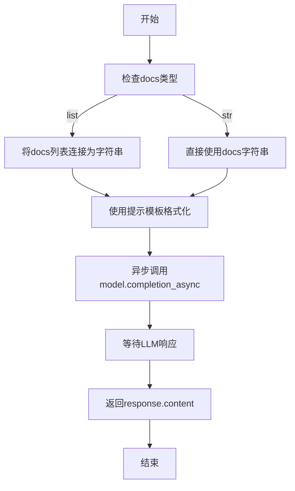
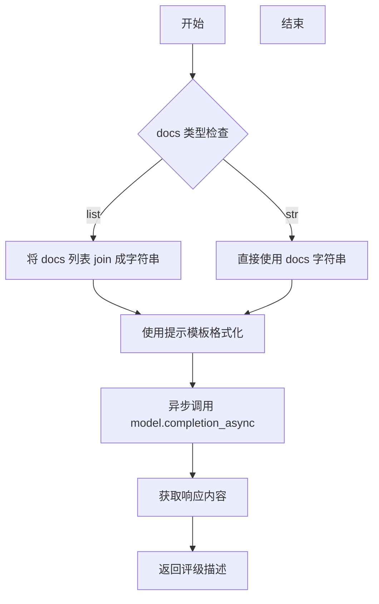

# `graphrag\packages\graphrag\graphrag\prompt_tune\generator\community_report_rating.py` 详细设计文档

这是一个社区报告评级生成模块，通过调用大型语言模型（LLM）根据指定的领域、角色和文档上下文，生成相应的评级描述文本。该模块接收模型实例、领域、角色和文档作为输入，格式化提示词后异步调用LLM生成评级响应。

## 整体流程



## 类结构

```
模块级别
└── generate_community_report_rating (函数)
```

## 全局变量及字段


### `GENERATE_REPORT_RATING_PROMPT`
    
用于生成社区报告评级的提示模板，包含占位符用于填充领域、角色和输入文本

类型：`str`
    


    

## 全局函数及方法


### `generate_community_report_rating`

这是一个异步生成函数，用于根据给定的领域（domain）、角色（persona）和文档（docs）调用 LLM 生成社区报告评级描述。

参数：

- `model`：`LLMCompletion`，用于生成的 LLM 模型实例
- `domain`：`str`，要生成评级的领域
- `persona`：`str`，要生成评级的角色
- `docs`：`str | list[str]`，用于上下文评级的文档

返回值：`str`，生成的评级描述提示响应内容

#### 流程图



#### 带注释源码

```python
"""Generate a rating description for community report rating."""

# Copyright (c) 2024 Microsoft Corporation.
# Licensed under the MIT License
from typing import TYPE_CHECKING

# 导入评级提示模板
from graphrag.prompt_tune.prompt.community_report_rating import (
    GENERATE_REPORT_RATING_PROMPT,
)

# 仅在类型检查时导入，避免运行时循环依赖
if TYPE_CHECKING:
    from graphrag_llm.completion import LLMCompletion
    from graphrag_llm.types import LLMCompletionResponse


async def generate_community_report_rating(
    model: "LLMCompletion", domain: str, persona: str, docs: str | list[str]
) -> str:
    """Generate an LLM persona to use for GraphRAG prompts.

    Parameters
    ----------
    - model (LLMCompletion): The LLM to use for generation
    - domain (str): The domain to generate a rating for
    - persona (str): The persona to generate a rating for for
    - docs (str | list[str]): Documents used to contextualize the rating

    Returns
    -------
    - str: The generated rating description prompt response.
    """
    # 将文档列表转换为字符串，如果是字符串则直接使用
    docs_str = " ".join(docs) if isinstance(docs, list) else docs
    
    # 使用提示模板格式化，填入领域、角色和文档内容
    domain_prompt = GENERATE_REPORT_RATING_PROMPT.format(
        domain=domain, persona=persona, input_text=docs_str
    )

    # 异步调用 LLM 的 completion 方法生成响应
    response: LLMCompletionResponse = await model.completion_async(
        messages=domain_prompt
    )  # type: ignore

    # 返回 LLM 生成的内容
    return response.content
```

## 关键组件


### 异步LLM调用机制

使用`model.completion_async()`进行异步调用，实现非阻塞的LLM响应生成，避免阻塞主线程，提高并发处理能力。

### 提示模板系统

通过`GENERATE_REPORT_RATING_PROMPT.format()`将领域、角色和文档内容动态注入到预定义提示模板中，生成符合LLM输入格式要求的提示词。

### 文档预处理模块

将输入的文档（字符串或字符串列表）统一转换为字符串格式的处理逻辑，支持两种输入类型并保持处理一致性。

### 类型提示系统

使用`TYPE_CHECKING`条件导入和字符串形式标注类型，实现运行时无导入依赖的同时保留开发时的类型检查能力。

### 异步函数签名设计

采用Python异步函数定义，接收LLM模型实例、领域字符串、角色字符串和文档内容作为参数，返回生成的评级描述字符串。


## 问题及建议


### 已知问题

- **错误处理缺失**：函数未包含任何 try-except 块，无法处理 LLM 调用失败、网络异常或响应解析错误
- **输入验证不足**：未对 `domain`、`persona` 和 `docs` 参数进行有效性校验，可能导致后续处理异常
- **类型安全风险**：使用 `messages=domain_prompt` 传递字符串，但 LLM 的 `completion_async` 方法通常期望 `messages` 为消息对象列表，类型标注 `# type: ignore` 掩盖了潜在类型问题
- **日志记录缺失**：没有任何日志输出，难以追踪函数执行状态和调试问题
- **异步超时控制缺失**：未设置请求超时时间，可能导致长时间阻塞或无限等待
- **文档处理简单**：`" ".join(docs)` 仅使用空格连接，可能导致上下文超出模型token限制且缺乏文档边界标识

### 优化建议

- 添加 try-except 块捕获异常，定义明确的错误类型并向上抛出，同时考虑添加重试机制
- 在函数入口添加参数校验，确保 `domain` 和 `persona` 非空，`docs` 符合长度和格式要求
- 修复类型标注，使用正确的消息格式（如 `list[dict[str, str]]`），移除 `# type: ignore`
- 引入结构化日志记录函数调用、参数和关键节点信息
- 为 `completion_async` 调用添加超时参数，防止无限等待
- 优化文档拼接逻辑，考虑添加分隔符或使用更高效的分块处理方式
- 考虑添加响应验证，确保 `response.content` 返回有效内容后再返回

## 其它


### 设计目标与约束

本函数的设计目标是提供一个异步接口，用于生成社区报告的评分描述。通过使用LLM模型，根据指定的领域、角色和文档上下文，生成符合GraphRAG系统要求的评分文本。约束包括：输入的docs参数可以是字符串或字符串列表，模型需要支持异步completion调用，返回结果为字符串类型。

### 错误处理与异常设计

函数依赖`model.completion_async`返回的`LLMCompletionResponse`对象，假设响应对象必然包含`content`属性。若模型调用失败或响应格式异常，将向上层传播异常。当前实现未对以下情况进行处理：模型为空或未初始化、领域或角色参数为空、文档内容为空、LLM响应超时或网络错误、响应对象缺少content属性。建议添加参数校验和异常捕获机制。

### 数据流与状态机

数据流如下：输入参数(domain, persona, docs) → docs字符串化处理 → 提示模板格式化 → LLM异步调用 → 响应内容提取 → 返回结果。状态机涉及：等待输入 → 处理中(调用LLM) → 返回结果 或 异常终止。无复杂状态转换，状态管理主要依赖调用方。

### 外部依赖与接口契约

本模块依赖以下外部组件：`graphrag_llm.completion`模块中的`LLMCompletion`类型（模型接口）、`graphrag_llm.types`模块中的`LLMCompletionResponse`类型（响应类型）、`graphrag.prompt_tune.prompt.community_report_rating`模块中的`GENERATE_REPORT_RATING_PROMPT`（提示模板）。接口契约要求：model参数必须实现`completion_async`方法且返回包含`content`属性的响应对象；提示模板需支持domain、persona、input_text三个占位符。

### 性能考虑

函数本身为轻量级封装，主要性能开销在LLM调用。潜在优化点：在docs为列表时使用更高效的文件串接方式（如"\n".join()而非" ".join()以保持文档边界）；可考虑添加请求超时控制；可添加重试机制应对临时性LLM调用失败。

### 安全性考虑

当前实现未对输入进行安全校验。潜在风险：LLM提示注入攻击（如果docs包含恶意构造的文本）、敏感信息泄露（如果domain/persona包含敏感数据）。建议：对输入参数进行长度限制和内容过滤；在生产环境中添加审计日志。

### 可测试性

函数设计为纯异步函数，便于单元测试。测试策略：使用mock替换model对象验证参数传递正确性；验证docs字符串化逻辑（列表vs字符串）；验证提示模板格式化参数。由于依赖外部LLM，建议将LLM调用结果抽象为可mock的接口。

### 并发处理

函数为async定义，支持并发调用。需注意：多个并发调用共享同一个model实例时，LLM提供者可能有速率限制；函数本身无并发控制逻辑，由调用方负责管理并发度和资源限制。

### 配置管理

函数无独立配置项。相关配置（如LLM超时设置、重试策略、提示模板内容）由调用方或外部配置管理。GENERATE_REPORT_RATING_PROMPT模板的内容决定了生成评分的具体格式和要求，属于业务逻辑配置。

### 日志与监控

当前实现未包含日志记录。建议添加：函数入口日志（记录输入参数脱敏后的概要）；LLM调用前后日志（用于性能监控和问题排查）；异常日志（记录错误堆栈便于问题定位）。

### 资源管理

函数本身无显式资源管理（无文件句柄、数据库连接等）。隐含资源：model代表的LLM连接，由调用方负责生命周期管理。建议在文档中明确调用方需要在应用关闭时释放LLM资源。

### 版本兼容性

代码使用Python 3.10+的类型注解语法（str | list[str））；依赖TYPE_CHECKING进行类型检查时导入，避免运行时循环依赖。需要Python 3.10+环境运行。

### 使用示例与调用约定

典型调用方式：```python
rating = await generate_community_report_rating(
    model=llm_model,
    domain="学术研究",
    persona="技术评审员",
    docs=["文档1内容", "文档2内容"]
)
```
调用方需要自行管理model实例的创建和销毁；docs参数建议传入与domain相关的文档内容以获得更准确的评分。


    