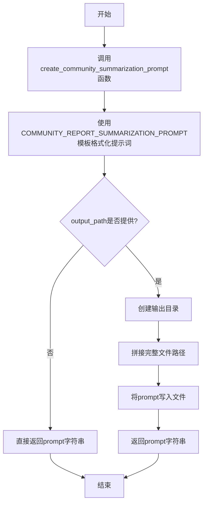
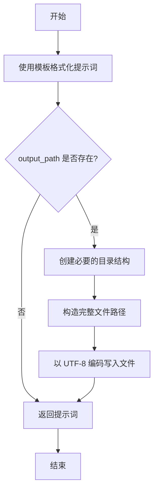

# `graphrag\packages\graphrag\graphrag\prompt_tune\generator\community_report_summarization.py` 详细设计文档

该模块用于生成社区报告摘要的提示词（prompt），支持将生成的提示词写入指定文件路径。

## 整体流程



## 类结构

```
community_report_summarization.py (模块，无类层次结构)
```

## 全局变量及字段


### `COMMUNITY_SUMMARIZATION_FILENAME`
    
社区报告摘要文件名常量，用于指定生成的提示词文件的名称

类型：`str`
    


### `COMMUNITY_REPORT_SUMMARIZATION_PROMPT`
    
社区报告摘要提示词模板，从外部模块导入的格式化字符串模板

类型：`str`
    


    

## 全局函数及方法


### `create_community_summarization_prompt`

创建社区报告摘要提示词的全局函数。该函数使用预定义的模板，根据指定的人员角色（persona）、角色（role）、报告评级描述（report_rating_description）和语言（language）生成社区报告摘要的提示词。如果提供了 `output_path` 参数，则将生成的提示词写入指定路径的文件中。

参数：

- `persona`：`str`，用于社区摘要提示词的角色设定（persona）
- `role`：`str`，用于社区摘要提示词的角色身份
- `report_rating_description`：`str`，报告评级描述，用于提示词中的评价标准
- `language`：`str`，用于社区摘要提示词的目标语言
- `output_path`：`Path | None`，可选参数，写入提示词的输出路径，默认为 None

返回值：`str`，生成的社区摘要提示词内容

#### 流程图



#### 带注释源码

```python
# 导入 Path 用于路径处理
from pathlib import Path

# 导入社区报告摘要提示词模板
from graphrag.prompt_tune.template.community_report_summarization import (
    COMMUNITY_REPORT_SUMMARIZATION_PROMPT,
)

# 定义输出文件名常量
COMMUNITY_SUMMARIZATION_FILENAME = "community_report_graph.txt"


def create_community_summarization_prompt(
    persona: str,                     # 角色设定，如"专家分析师"
    role: str,                        # 角色身份，如"数据分析师"
    report_rating_description: str,  # 报告评级描述
    language: str,                    # 目标语言
    output_path: Path | None = None, # 可选的输出路径
) -> str:
    """创建社区摘要提示词。如果提供 output_path，则将提示词写入文件。

    Parameters
    ----------
    - persona (str): 用于社区摘要提示词的角色设定
    - role (str): 用于社区摘要提示词的角色
    - report_rating_description (str): 报告评级描述
    - language (str): 用于社区摘要提示词的语言
    - output_path (Path | None): 写入提示词的路径，默认为 None

    Returns
    -------
    - str: 社区摘要提示词内容
    """
    # 使用预定义模板格式化提示词，填充 persona、role、report_rating_description 和 language
    prompt = COMMUNITY_REPORT_SUMMARIZATION_PROMPT.format(
        persona=persona,
        role=role,
        report_rating_description=report_rating_description,
        language=language,
    )

    # 检查是否提供了输出路径
    if output_path:
        # 创建必要的父目录，确保路径存在
        output_path.mkdir(parents=True, exist_ok=True)

        # 拼接完整文件路径（目录 + 文件名）
        output_path = output_path / COMMUNITY_SUMMARIZATION_FILENAME
        
        # 以二进制写入模式打开文件，使用 UTF-8 编码
        with output_path.open("wb") as file:
            # 将提示词编码为字节并写入文件
            file.write(prompt.encode(encoding="utf-8", errors="strict"))

    # 返回生成的提示词内容
    return prompt
```

## 关键组件


### COMMUNITY_SUMMARIZATION_FILENAME

全局常量，定义了社区报告图的输出文件名，用于标识生成的提示文件名称。

### COMMUNITY_REPORT_SUMMARIZATION_PROMPT

从外部模板导入的社区报告摘要提示模板，用于格式化生成具体的提示内容。

### create_community_summarization_prompt 函数

核心功能函数，用于创建社区报告摘要的提示内容。支持通过persona、role、report_rating_description和language参数定制提示，并将生成的提示返回，可选地写入指定输出路径。


## 问题及建议


### 已知问题

-   函数文档字符串中参数顺序与实际函数签名不一致（`language` 在文档中排在第三位，但实际在最后一位）
-   参数 `report_rating_description` 在文档字符串的 Parameters 描述中缺失，没有提供说明
-   写入文件时缺乏异常处理机制，如果 `output_path.mkdir()` 或文件写入失败，程序会直接抛出异常导致中断
-   `output_path` 参数在函数内部被重新赋值为新路径后，原始输入路径信息丢失，不利于调试和日志记录
-   写入文件时使用 `open("wb")` 而非上下文管理器，虽然代码可以工作，但不够符合 Python 最佳实践

### 优化建议

-   统一文档字符串中参数顺序与函数签名顺序，确保一致性
-   为 `report_rating_description` 参数添加完整的参数描述
-   添加 try-except 块处理文件操作可能的异常（权限错误、磁盘空间不足等），并提供有意义的错误信息
-   考虑使用临时变量保存最终文件路径，避免覆盖输入参数，保留调试信息
-   使用 `with` 上下文管理器替代手动 `open()` 和 `file.write()`，确保文件句柄正确关闭
-   添加日志记录功能，在写入文件成功或失败时提供可追溯的操作记录

## 其它


### 设计目标与约束

该模块旨在为社区报告摘要生成提供标准化的提示模板，支持通过配置persona、role、report_rating_description和language参数自定义提示内容，并可选地将生成的提示写入文件。设计约束包括：依赖外部模板COMMUNITY_REPORT_SUMMARIZATION_PROMPT，必须保证模板中存在对应的占位符{ persona}、{role}、{report_rating_description}、{language}；输出路径处理依赖Path对象，需确保具有文件系统写权限。

### 错误处理与异常设计

代码中的错误处理主要体现在以下方面：使用errors="strict"参数进行UTF-8编码，确保编码错误时抛出UnicodeEncodeError；通过output_path.mkdir(parents=True, exist_ok=True)处理目录创建，避免目录已存在的异常。潜在改进空间：未对persona、role、language等参数进行空值校验；未捕获文件写入失败（如磁盘空间不足、权限不足）的异常；未对COMMUNITY_REPORT_SUMMARIZATION_PROMPT.format()可能抛出的KeyError进行捕获。

### 数据流与状态机

数据流如下：输入参数(persona, role, report_rating_description, language) → 模板格式化(COMMUNITY_REPORT_SUMMARIZATION_PROMPT.format) → 生成prompt字符串 → 条件判断是否需要写入文件 → 若写入则创建目录并写入文件 → 返回prompt字符串。该流程为线性状态机，无状态分支或循环。

### 外部依赖与接口契约

外部依赖包括：graphrag.prompt_tune.template.community_report_summarization模块中的COMMUNITY_REPORT_SUMMARIZATION_PROMPT常量（必须为字符串类型，需包含四个占位符）；pathlib.Path类（标准库）。接口契约：create_community_summarization_prompt函数接受persona(str)、role(str)、report_rating_description(str)、language(str)、output_path(Path|None)五个参数，返回str类型的prompt内容。

### 性能考虑

性能优化点：模板格式化仅在函数调用时执行，无缓存机制；文件写入使用二进制模式("wb")避免编码开销。潜在性能问题：当output_path为None时仍执行模板格式化，可考虑延迟计算；大规模调用时可考虑对模板进行预编译或缓存。

### 安全性考虑

安全措施：使用errors="strict"防止编码混淆攻击；目录创建使用exist_ok=True避免竞态条件。安全建议：未对输出路径进行路径遍历验证（如防止output_path包含"../"进行目录穿越攻击）；未对写入内容进行长度限制或恶意内容过滤。

### 可测试性

测试策略建议：单元测试应覆盖正常场景（带output_path和不带output_path）、异常场景（空字符串参数、非法路径、模板缺失占位符）；Mock COMMUNITY_REPORT_SUMMARIZATION_PROMPT进行隔离测试；验证文件写入的编码正确性和路径正确性。

### 配置说明

主要配置项：COMMUNITY_REPORT_SUMMARIZATION_PROMPT模板内容（在外部模块定义）；COMMUNITY_SUMMARIZATION_FILENAME常量定义输出文件名。运行时配置通过函数参数传入：persona、role、report_rating_description、language、output_path。

### 使用示例

```python
from pathlib import Path
from graphrag.prompt_tune.workflow import create_community_summarization_prompt

# 示例1：不写入文件
prompt = create_community_summarization_prompt(
    persona="AI助手",
    role="社区报告分析员",
    report_rating_description="高质量的社区报告",
    language="zh"
)

# 示例2：写入文件
prompt = create_community_summarization_prompt(
    persona="AI助手",
    role="社区报告分析员",
    report_rating_description="高质量的社区报告",
    language="zh",
    output_path=Path("./output/prompts")
)
```

### 版本历史

当前版本：基于MIT License的开源版本（2024年Microsoft Corporation）。无明显的版本演进信息记录在代码中，建议添加docstring或CHANGELOG记录版本变更。


    