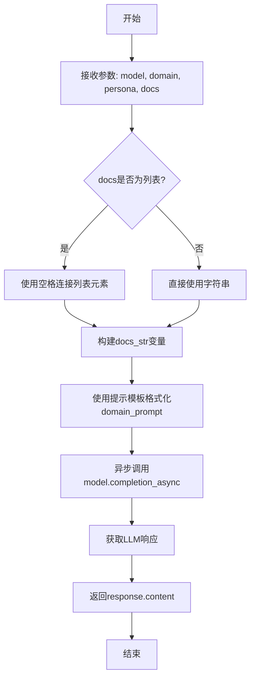
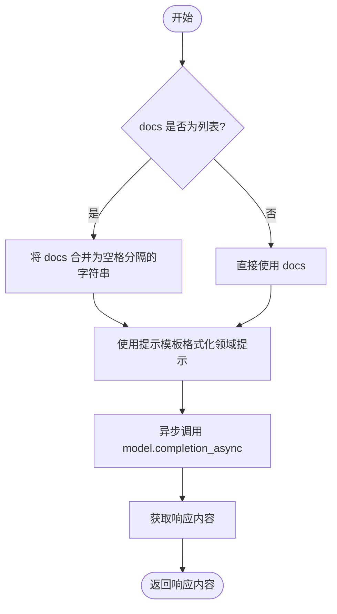

# `graphrag\packages\graphrag\graphrag\prompt_tune\generator\community_reporter_role.py` 详细设计文档

该文件实现了一个异步函数generate_community_reporter_role，用于根据给定的领域、角色和文档内容，通过LLM生成社区摘要报告的角色提示词。函数首先将文档转换为字符串格式，然后使用预定义的提示模板格式化请求，最后异步调用LLM完成生成并返回结果。

## 整体流程



## 类结构

```
无类定义 - 该文件仅包含一个模块级异步函数
```

## 全局变量及字段


### `GENERATE_COMMUNITY_REPORTER_ROLE_PROMPT`
    
从 graphrag.prompt_tune.prompt.community_reporter_role 模块导入的提示模板，用于生成社区 reporter 角色

类型：`str (常量)`
    


### `docs_str`
    
将输入的文档参数（字符串或字符串列表）转换为单一字符串的局部变量

类型：`str`
    


### `domain_prompt`
    
通过格式化提示模板生成的完整提示字符串，包含域、角色和文档内容

类型：`str`
    


### `response`
    
调用 LLM 模型异步生成后返回的响应对象，包含生成的内容

类型：`LLMCompletionResponse`
    


    

## 全局函数及方法


### `generate_community_reporter_role`

这是一个异步全局函数，用于根据给定的领域、角色和文档生成一个LLM角色提示（persona），以供GraphRAG提示词使用。

参数：

- `model`：`LLMCompletion`，用于生成响应的语言模型
- `domain`：`str`，要生成角色的领域
- `persona`：`str`，要生成角色的角色描述
- `docs`：`str | list[str]`，用于生成角色的文档内容

返回值：`str`，生成的领域提示响应内容

#### 流程图



#### 带注释源码

```python
# 异步全局函数：为社区报告生成LLM角色
async def generate_community_reporter_role(
    model: "LLMCompletion",  # LLM实例，用于生成响应
    domain: str,             # 目标领域，如"医疗"、"金融"等
    persona: str,            # 角色描述，如"专业分析师"
    docs: str | list[str]    # 领域文档，支持单字符串或字符串列表
) -> str:                   # 返回生成的提示响应
    """Generate an LLM persona to use for GraphRAG prompts.

    Parameters
    ----------
    - model (LLMCompletion): The LLM to use for generation
    - domain (str): The domain to generate a persona for
    - persona (str): The persona to generate a role for
    - docs (str | list[str]): The domain to generate a persona for

    Returns
    -------
    - str: The generated domain prompt response.
    """
    # 如果docs是列表，将其合并为空格分隔的字符串；否则直接使用
    docs_str = " ".join(docs) if isinstance(docs, list) else docs
    
    # 使用提示模板格式化请求，填充领域、角色和文档内容
    domain_prompt = GENERATE_COMMUNITY_REPORTER_ROLE_PROMPT.format(
        domain=domain, 
        persona=persona, 
        input_text=docs_str
    )

    # 异步调用LLM生成响应
    response: LLMCompletionResponse = await model.completion_async(
        messages=domain_prompt
    )  # type: ignore

    # 返回LLM生成的内容
    return response.content
```

## 关键组件


### generate_community_reporter_role

异步生成函数，用于根据给定的领域、角色和文档生成LLM personas，用于GraphRAG提示词工程

### LLMCompletion 接口

模型调用抽象，提供了completion_async异步方法用于获取LLM响应

### GENERATE_COMMUNITY_REPORTER_ROLE_PROMPT

prompt模板，提供领域、角色和输入文本的格式化填充

### docs 参数处理

将输入的字符串或字符串列表统一转换为字符串格式的处理逻辑

### LLMCompletionResponse 响应处理

异步响应对象，通过content属性提取生成的prompt内容

### 类型提示

使用TYPE_CHECKING进行条件导入，避免运行时循环依赖


## 问题及建议


### 已知问题

- **错误处理缺失**：函数未对 LLM 调用结果进行空值或异常检查，`response` 或 `response.content` 可能为 `None`，导致运行时错误
- **类型安全不足**：使用 `# type: ignore` 掩盖类型不匹配问题，`domain_prompt` 作为字符串传递给 `messages` 参数存在类型不一致风险
- **文档字符串错误**：`docs` 参数描述错误，描述为 "The domain to generate a persona for"，应描述为文档内容
- **字符串拼接简单粗暴**：使用 `" ".join(docs)` 连接文档列表，可能在文档本身包含空格时产生歧义，应考虑使用双换行符或其他明确分隔符
- **缺乏日志记录**：无任何日志输出，难以追踪函数执行状态和调试问题
- **缺少超时和重试机制**：LLM 调用无超时设置和重试逻辑，网络异常时可能导致函数直接失败

### 优化建议

- 添加 `try-except` 块捕获 LLM 调用异常，并对 `response.content` 进行空值校验后返回或抛出自定义异常
- 完善类型注解，考虑定义 `Messages` 类型或使用 `Any` 明确 `messages` 参数类型，移除 `# type: ignore`
- 修正 `docs` 参数的文档字符串，描述为 "The documentation text(s) to generate a persona for"
- 使用 `"\n\n".join(docs)` 或其他更明确的分隔符连接文档列表，避免边界模糊
- 引入日志记录，记录函数调用参数、LLM 响应状态等信息
- 为 `model.completion_async` 调用添加超时参数和可选的重试机制，提升容错能力

## 其它


### 设计目标与约束

本模块的核心设计目标是为GraphRAG系统生成社区报告器的LLM角色提示（persona），通过动态构建提示模板来定制化LLM的行为，使其能够更好地理解和生成社区摘要内容。主要设计约束包括：1) 依赖外部LLM服务完成实际生成任务；2) 输入的docs参数支持字符串或字符串列表两种形式；3) 必须使用异步调用模式以提高并发性能；4) 返回结果为字符串格式的prompt响应内容。

### 错误处理与异常设计

代码中错误处理机制相对薄弱，存在以下改进空间：1) 缺少对model对象为None或无效的校验；2) 缺少对domain、persona参数为空或非法格式的校验；3) 缺少对docs参数为空情况的处理；4) 缺少对LLM调用失败（如网络超时、服务不可用、rate limit等）的重试机制和降级策略；5) 缺少对response对象为None或response.content为空的校验；6) 建议添加自定义异常类如CommunityReporterRoleGenerationError以区分不同类型的错误；7) 建议添加详细的错误日志记录，包括输入参数（脱敏后）和错误堆栈信息。

### 外部依赖与接口契约

本函数依赖以下外部组件：1) **LLMCompletion接口**：model参数必须实现completion_async方法，接受messages参数并返回LLMCompletionResponse对象，该接口的具体实现由graphrag_llm包提供；2) **提示模板**：GENERATE_COMMUNITY_REPORTER_ROLE_PROMPT来自graphrag.prompt_tune.prompt.community_reporter_role模块，format方法接收domain、persona、input_text三个命名参数；3) **类型注解**：依赖TYPE_CHECKING条件导入的LLMCompletion和LLMCompletionResponse类型，用于静态类型检查而非运行时检查。接口契约要求调用方确保model对象可用且已正确初始化，docs参数非空，domain和persona参数符合业务规则。

### 性能考虑与优化空间

当前实现存在以下性能优化机会：1) docs字符串拼接使用" ".join()，当docs为大型列表时效率较低，可考虑流式处理或分块处理；2) 缺少请求超时设置，LLM调用可能无限期等待，建议添加合理的超时配置；3) 缺少并发请求限制机制，当多个调用同时发起时可能导致资源耗尽；4) 可以考虑添加响应缓存机制，对于相同domain+persona+docs组合的请求直接返回缓存结果；5) 缺少对LLM响应长度限制的配置，大响应可能消耗过多内存。

### 安全性考虑

代码安全性设计存在以下关注点：1) docs参数直接拼接到prompt中，可能存在提示注入风险，建议对输入进行必要的转义或过滤；2) LLM响应内容直接返回，缺少内容安全校验，可能返回恶意或不当内容；3) 缺少对敏感信息的处理，如果docs包含敏感数据可能被记录在日志中；4) model对象的具体实现未知，需要确保使用的LLM服务符合安全要求；5) 建议添加输入长度限制防止拒绝服务攻击。

### 配置管理与扩展性

当前代码的扩展性考虑：1) 硬编码的字符串连接符" "可以通过配置外部化；2) 提示模板格式字符串目前是固定的，可考虑支持自定义模板；3) 函数设计遵循单一职责原则，便于单独测试和复用；4) 缺少对不同LLM提供商的适配支持，当前仅支持completion_async接口；5) 可考虑添加回调机制，允许调用方在LLM调用前后执行自定义逻辑。

### 测试策略建议

针对该函数建议的测试用例包括：1) 单元测试：验证不同输入类型（字符串vs列表）的处理逻辑；2) 集成测试：使用mock LLM测试完整流程；3) 边界测试：空字符串、空列表、None值的处理；4) 异常测试：模拟LLM调用失败场景；5) 性能测试：大量docs列表的处理效率；6) 模糊测试：异常格式输入的容错能力。

### 日志与可观测性

建议添加以下日志和监控点：1) 函数入口日志，记录输入参数（脱敏处理后）；2) LLM调用前后记录耗时，用于性能监控；3) 错误日志，包含完整错误信息和堆栈；4) 成功率指标，监控LLM调用成功/失败比例；5) 响应长度统计，监控生成结果的大小分布；6) 建议使用结构化日志格式，便于后续分析。


    