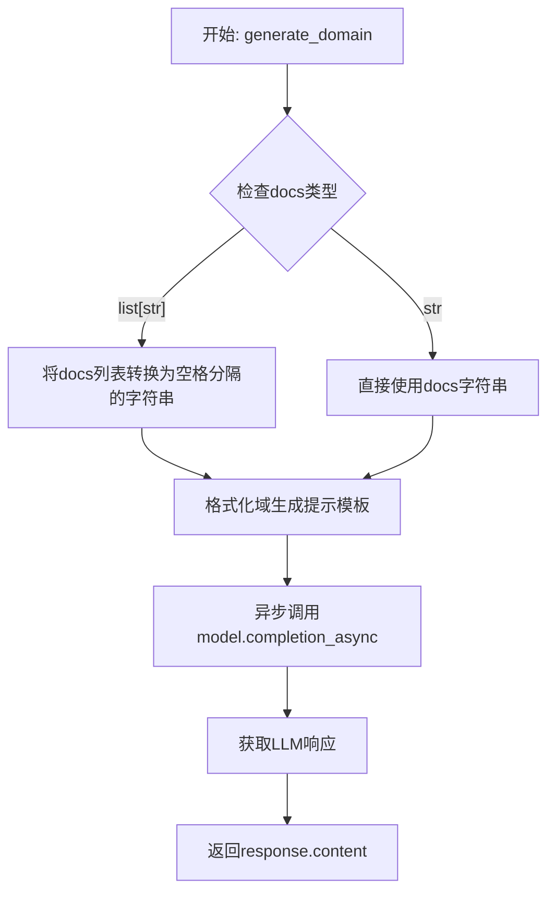
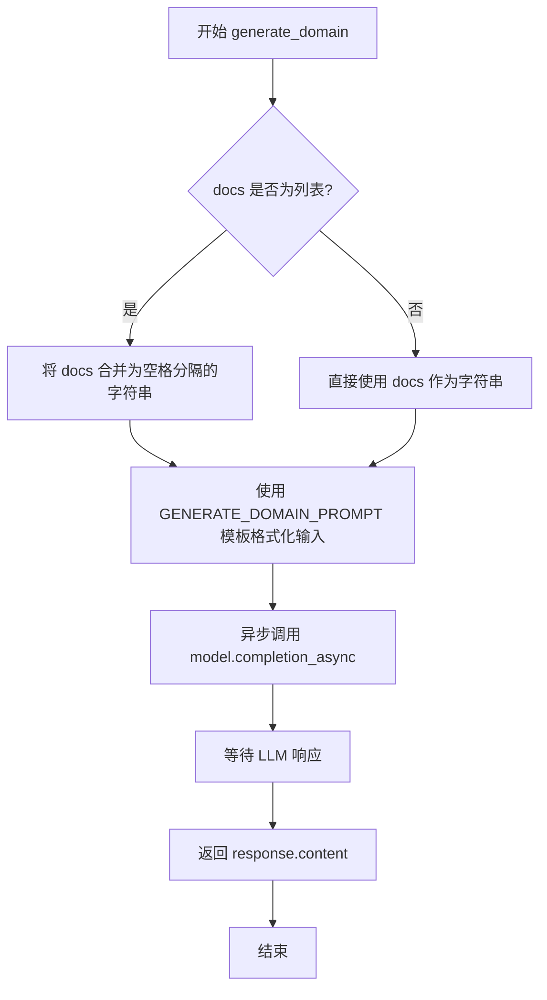
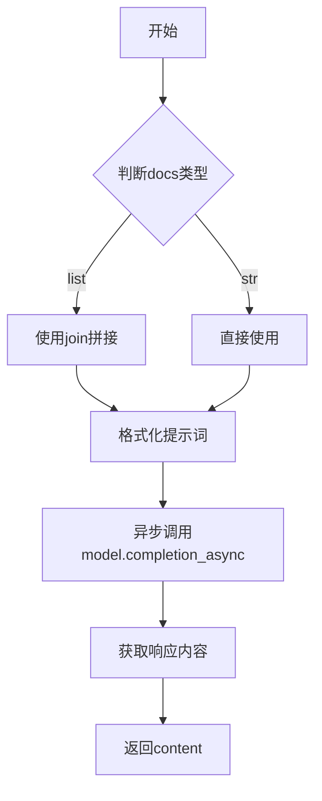

# `graphrag\packages\graphrag\graphrag\prompt_tune\generator\domain.py` 详细设计文档

一个异步域生成模块，用于根据输入的文档内容调用大语言模型生成GraphRAG提示词中使用的角色定义。该模块接收LLM模型实例和文档字符串或字符串列表，通过格式化域生成提示模板并异步调用LLM完成生成任务，返回生成的域提示内容。

## 整体流程



## 类结构

```
无类层次结构（模块级函数）
└── generate_domain (模块级异步函数)
```

## 全局变量及字段


### `GENERATE_DOMAIN_PROMPT`
    
从graphrag.prompt_tune.prompt.domain模块导入的提示模板，用于生成域的prompt模板，经过format方法填充输入文本后用于LLM调用

类型：`str`
    


    

## 全局函数及方法


### `generate_domain`

生成一个用于 GraphRAG 提示的 LLM 角色（ persona），通过调用 LLM 模型并传入领域文档内容，返回生成的域提示响应。

参数：

- `model`：`LLMCompletion`，用于生成角色的 LLM 模型实例
- `docs`：`str | list[str]`，要生成角色的领域文档，可以是单个字符串或字符串列表

返回值：`str`，生成的域提示响应内容

#### 流程图



#### 带注释源码

```python
# 导入类型检查模块，避免运行时循环导入
from typing import TYPE_CHECKING

# 导入域生成提示模板
from graphrag.prompt_tune.prompt.domain import GENERATE_DOMAIN_PROMPT

# 仅在类型检查时导入 LLM 相关类型
if TYPE_CHECKING:
    from graphrag_llm.completion import LLMCompletion
    from graphrag_llm.types import LLMCompletionResponse


async def generate_domain(model: "LLMCompletion", docs: str | list[str]) -> str:
    """Generate an LLM persona to use for GraphRAG prompts.

    Parameters
    ----------
    - model (LLMCompletion): The LLM to use for generation
    - docs (str | list[str]): The domain to generate a persona for

    Returns
    -------
    - str: The generated domain prompt response.
    """
    # 如果 docs 是列表，将其合并为空格分隔的字符串；否则直接使用
    docs_str = " ".join(docs) if isinstance(docs, list) else docs
    
    # 使用域生成提示模板格式化输入文本
    domain_prompt = GENERATE_DOMAIN_PROMPT.format(input_text=docs_str)

    # 异步调用 LLM 模型的 completion 方法获取响应
    response: LLMCompletionResponse = await model.completion_async(
        messages=domain_prompt
    )  # type: ignore

    # 返回 LLM 生成的响应内容
    return response.content
```

## 关键组件


### 核心功能概述

该代码是一个GraphRAG领域的提示词生成模块，通过异步调用LLM模型，根据输入的文档内容生成定制化的领域提示词，实现文档到领域知识的转换。

### 文件整体运行流程

1. 接收LLM模型实例和文档输入（字符串或字符串列表）
2. 将文档列表拼接为单一字符串
3. 使用预定义的GENERATE_DOMAIN_PROMPT模板格式化输入
4. 异步调用LLM的completion_async方法生成响应
5. 返回LLM生成的领域提示内容

### 全局函数详细信息

#### generate_domain 异步函数

**参数：**
- model (LLMCompletion): LLM模型实例，用于生成响应
- docs (str | list[str]): 输入的文档内容，可以是字符串或字符串列表

**返回值：**
- str: LLM生成的领域提示响应内容

**mermaid流程图：**



**源码：**
```python
async def generate_domain(model: "LLMCompletion", docs: str | list[str]) -> str:
    """Generate an LLM persona to use for GraphRAG prompts.

    Parameters
    ----------
    - model (LLMCompletion): The LLM to use for generation
    - docs (str | list[str]): The domain to generate a persona for

    Returns
    -------
    - str: The generated domain prompt response.
    """
    docs_str = " ".join(docs) if isinstance(docs, list) else docs
    domain_prompt = GENERATE_DOMAIN_PROMPT.format(input_text=docs_str)

    response: LLMCompletionResponse = await model.completion_async(
        messages=domain_prompt
    )  # type: ignore

    return response.content
```

### 关键组件信息

#### GENERATE_DOMAIN_PROMPT
预定义的提示词模板，用于格式化输入文档，触发LLM生成领域相关的内容

#### TYPE_CHECKING导入
用于类型检查的延迟导入，避免运行时循环依赖

#### LLMCompletionResponse类型
LLM响应的数据结构，包含content字段存储生成的文本

### 潜在技术债务与优化空间

1. **错误处理缺失**：未对LLM调用失败、网络异常、响应为空等情况进行处理
2. **类型断言风险**：使用`# type: ignore`忽略类型检查，可能导致运行时错误
3. **提示词模板硬编码**：GENERATE_DOMAIN_PROMPT直接导入，缺乏配置灵活性
4. **文档处理简单**：简单的空格拼接可能丢失原始文档的结构信息
5. **缺少重试机制**：LLM调用失败时无重试逻辑

### 其它项目

#### 设计目标与约束
- 目标：简化GraphRAG领域提示的生成流程
- 约束：依赖外部LLM服务，需保证模型可用性

#### 错误处理与异常设计
- 需添加try-except捕获LLM调用异常
- 需验证response.content非空
- 建议添加超时控制和重试机制

#### 数据流与状态机
- 输入：docs (str | list[str]) → 处理：字符串拼接 → 格式化：prompt模板 → 输出：LLM响应内容

#### 外部依赖与接口契约
- 依赖graphrag_llm的LLMCompletion接口
- 依赖graphrag.prompt_tune.prompt.domain的GENERATE_DOMAIN_PROMPT模板


## 问题及建议


### 已知问题

- **错误处理机制缺失**：未对 `model.completion_async()` 调用进行 try-except 包装，无法捕获 LLM 调用可能出现的异常（如超时、网络错误、API 错误等）
- **参数校验不足**：未对 `docs` 参数进行有效性验证（空字符串、空列表、None 值）；未对 `model` 对象进行空值或类型校验
- **类型安全问题**：`response: LLMCompletionResponse = await model.completion_async(messages=domain_prompt)  # type: ignore` 使用了 type: ignore 注释，表明存在类型不匹配问题但被静默忽略
- **响应内容未校验**：未检查 `response.content` 是否为 None、空字符串或异常格式，直接返回可能导致下游调用出错
- **日志记录缺失**：没有任何日志输出，无法追踪函数执行状态、调试问题或监控调用情况
- **文档字符串冗余**：函数 docstring 中参数描述使用了 `-` 前缀且格式不够规范，与项目文档风格可能不统一

### 优化建议

- 添加 try-except 块捕获异常，并根据异常类型进行相应处理（如重试、降级返回默认值或抛出自定义异常）
- 在函数入口添加参数校验：检查 `docs` 非空、验证 `model` 对象具有 `completion_async` 方法
- 移除 type: ignore，明确类型定义或调整 LLM 调用方式以确保类型安全
- 在返回前添加响应内容校验，若内容为空或异常可抛出明确错误或返回降级值
- 引入日志记录（使用标准 logging 模块），记录函数调用、输入长度、响应状态等关键信息
- 统一文档字符串格式，移除不必要的 `-` 前缀，与项目其他函数保持风格一致

## 其它


### 设计目标与约束

本模块旨在为GraphRAG系统提供一个轻量级的域生成功能，通过调用LLM将输入的文档内容转换为适合GraphRAG提示的域描述。设计约束包括：必须支持异步调用、输入可以是字符串或字符串列表、依赖graphrag_llm提供的LLMCompletion接口、不涉及持久化存储。

### 错误处理与异常设计

代码中未显式实现错误处理机制。潜在异常场景包括：LLM调用失败（网络异常、服务不可用）、模型响应格式不符合预期（content字段缺失或为空）、输入文档为空或格式异常。改进建议：添加try-except捕获asyncio异常、对response.content进行空值校验、定义自定义异常类如DomainGenerationError以区分不同失败场景。

### 数据流与状态机

数据流为：输入文档（str或list）→ 字符串拼接转换为docs_str→ 拼接域生成提示模板→ 异步调用LLM→ 提取响应内容并返回。无状态机设计，属于简单的线性转换流程。

### 外部依赖与接口契约

依赖项包括：graphrag.prompt_tune.prompt.domain模块（提供GENERATE_DOMAIN_PROMPT模板）、graphrag_llm.completion.LLMCompletion接口（需实现completion_async方法）、graphrag_llm.types.LLMCompletionResponse（需包含content属性）。接口契约要求model对象必须支持异步completion_async方法，接收messages参数并返回包含content字段的响应对象。

### 性能考虑

当前实现无缓存机制，每次调用都会触发LLM请求。对于相同文档的重复调用，可考虑引入结果缓存（基于文档哈希）。由于使用异步IO，可支持并发调用，但需注意LLM服务的QPS限制。

### 安全性考虑

输入文档内容直接拼接至提示模板，存在提示注入风险。建议对输入进行基础清理或使用结构化输入方式。LLM响应内容未经校验直接返回调用方，需确保下游使用方对内容进行适当处理。

### 配置管理

GENERATE_DOMAIN_PROMPT模板来自外部模块，模板内容在此处不可见。建议在配置文件中管理提示模板，支持运行时替换。LLM模型选择、超时设置、重试策略等应通过配置参数注入。

### 测试策略

建议添加单元测试覆盖：输入字符串与列表的处理等价性、空输入行为、LLM响应为空或异常时的容错能力、异步函数正确性验证。可使用mock对象模拟LLMCompletion接口进行测试。

### 并发处理

函数本身支持并发调用，但未实现任何并发控制机制（如信号量、速率限制）。在多并发场景下需依赖上游调用方进行流量控制，或在模块层面添加全局并发限制。

### 监控与日志

代码中无日志记录语句。建议添加关键操作日志：LLM调用开始/结束、异常捕获记录、输入文档长度统计。性能指标可包括LLM调用耗时、成功率等。

    