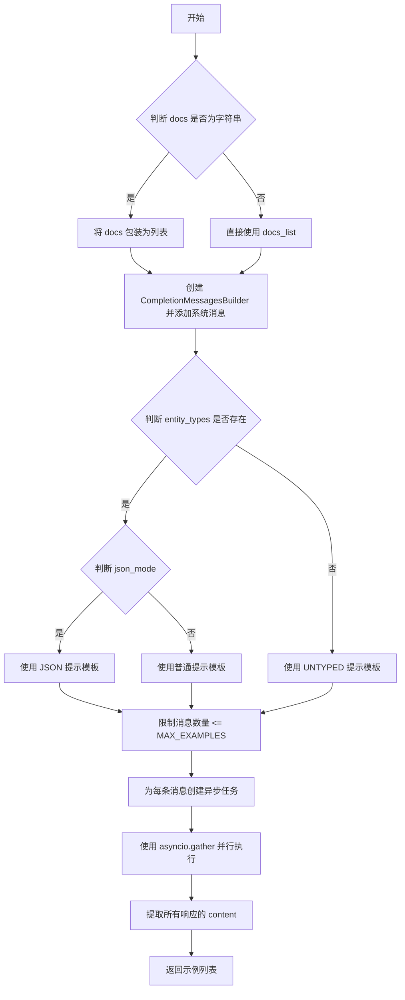

# `graphrag\packages\graphrag\graphrag\prompt_tune\generator\entity_relationship.py` 详细设计文档

这是一个实体关系示例生成模块，通过异步调用LLM模型根据给定的文档和实体类型生成实体/关系示例，支持JSON模式和元组分隔符格式输出，可用于生成实体配置。

## 整体流程

```mermaid
graph TD
    A[开始] --> B[输入: model, persona, entity_types, docs, language, json_mode]
B --> C{docs是否为字符串?}
C -- 是 --> D[docs_list = [docs]]
C -- 否 --> E[docs_list = docs]
D --> F[创建CompletionMessagesBuilder并添加系统消息]
E --> F
F --> G{entity_types是否存在?}
G -- 是 --> H{entity_types是否为字符串?}
G -- 否 --> I[使用UNTYPED_ENTITY_RELATIONSHIPS_GENERATION_PROMPT]
H -- 是 --> J[entity_types_str = entity_types]
H -- 否 --> K[entity_types_str = ', '.join(entity_types)]
J --> L{json_mode为true?]
K --> L
L -- 是 --> M[使用ENTITY_RELATIONSHIPS_GENERATION_JSON_PROMPT]
L -- 否 --> N[使用ENTITY_RELATIONSHIPS_GENERATION_PROMPT]
I --> O[messages = [prompt.format(...) for doc in docs_list]]
M --> O
N --> O
O --> P[messages = messages[:MAX_EXAMPLES]]
P --> Q[创建异步任务列表]
Q --> R[asyncio.gather并发执行所有任务]
R --> S[获取所有LLM响应]
S --> T[提取response.content组成列表]
T --> U[返回示例列表]
```

## 类结构

```
无类定义 (模块级函数实现)
└── generate_entity_relationship_examples (异步全局函数)
```

## 全局变量及字段


### `MAX_EXAMPLES`
    
限制生成的最大示例数量，值为5

类型：`int`
    


    

## 全局函数及方法


### `generate_entity_relationship_examples`

这是一个异步函数，接收LLM模型实例、角色设定、实体类型、文档内容和语言参数，根据是否提供实体类型选择相应的提示模板，限制处理文档数量在MAX_EXAMPLES以内，并行调用模型生成实体/关系示例，最后以列表形式返回生成的示例内容（支持JSON或文本格式）。

#### 参数

- `model`：`LLMCompletion`，执行实体/关系示例生成的LLM模型实例
- `persona`：str，用于构建系统消息的角色设定或指令
- `entity_types`：str | list[str] | None，要生成的实体类型，可以是单个类型、类型列表或空值
- `docs`：str | list[str]，用于生成示例的输入文档，可以是单个文档或文档列表
- `language`：str，生成示例所用的语言
- `json_mode`：bool = False，是否使用JSON格式输出，默认值为False

#### 返回值

`list[str]`，生成的实体/关系示例列表，每个元素对应一个输入文档生成的示例

#### 流程图



#### 带注释源码

```python
# 异步函数：生成实体/关系示例
# 根据文档和实体类型生成实体/关系示例，输出名称、描述等
async def generate_entity_relationship_examples(
    model: "LLMCompletion",           # LLM模型实例，负责生成内容
    persona: str,                      # 角色设定，用于构建系统提示
    entity_types: str | list[str] | None,  # 实体类型列表或单个类型
    docs: str | list[str],             # 输入文档，可以是字符串或列表
    language: str,                     # 语言设置
    json_mode: bool = False,           # 是否返回JSON格式，默认为False
) -> list[str]:
    """Generate a list of entity/relationships examples for use in generating an entity configuration.

    Will return entity/relationships examples as either JSON or in tuple_delimiter format depending
    on the json_mode parameter.
    """
    # 统一将docs转换为列表，便于后续统一处理
    docs_list = [docs] if isinstance(docs, str) else docs

    # 创建消息构建器并添加系统消息（角色设定）
    msg_builder = CompletionMessagesBuilder().add_system_message(persona)

    # 根据entity_types是否存在选择不同的提示模板
    if entity_types:
        # 将entity_types转换为字符串格式
        entity_types_str = (
            entity_types
            if isinstance(entity_types, str)
            else ", ".join(map(str, entity_types))
        )

        # 根据json_mode选择JSON或普通提示模板，并格式化消息
        messages = [
            (
                ENTITY_RELATIONSHIPS_GENERATION_JSON_PROMPT
                if json_mode
                else ENTITY_RELATIONSHIPS_GENERATION_PROMPT
            ).format(entity_types=entity_types_str, input_text=doc, language=language)
            for doc in docs_list
        ]
    else:
        # 无实体类型时使用无类型提示模板
        messages = [
            UNTYPED_ENTITY_RELATIONSHIPS_GENERATION_PROMPT.format(
                input_text=doc, language=language
            )
            for doc in docs_list
        ]

    # 限制消息数量不超过MAX_EXAMPLES（5条）
    messages = messages[:MAX_EXAMPLES]

    # 为每条消息创建异步completion任务
    tasks = [
        model.completion_async(
            messages=msg_builder.add_user_message(message).build(),
            response_format_json_object=json_mode,
        )
        for message in messages
    ]

    # 并行执行所有异步任务
    responses: list[LLMCompletionResponse] = await asyncio.gather(*tasks)  # type: ignore

    # 提取所有响应中的content并返回
    return [response.content for response in responses]
```

---

### 关键组件信息

| 组件名称 | 一句话描述 |
|---------|-----------|
| `CompletionMessagesBuilder` | 消息构建工具类，用于组装系统消息和用户消息 |
| `ENTITY_RELATIONSHIPS_GENERATION_JSON_PROMPT` | JSON格式实体/关系生成的提示词模板 |
| `ENTITY_RELATIONSHIPS_GENERATION_PROMPT` | 普通格式实体/关系生成的提示词模板 |
| `UNTYPED_ENTITY_RELATIONSHIPS_GENERATION_PROMPT` | 无实体类型时使用的提示词模板 |
| `MAX_EXAMPLES` | 全局常量，限制最大处理文档数量为5 |

---

### 潜在的技术债务或优化空间

1. **缺乏错误处理机制**：使用`asyncio.gather`时未传递`return_exceptions=True`，任何一个任务失败将导致整个函数抛出异常
2. **缺少日志记录**：函数执行过程中没有任何日志输出，难以追踪执行状态和排查问题
3. **无重试逻辑**：LLM调用可能因网络波动或服务限流失败，当前实现不具备重试机制
4. **类型注解不完整**：`await asyncio.gather(*tasks)`后使用了`# type: ignore`掩盖了类型推断问题
5. **硬编码的限制值**：MAX_EXAMPLES为5，若需要动态调整需修改源码
6. **重复的消息构建器使用**：循环中每次调用`msg_builder.add_user_message()`可能存在状态累积问题

---

### 其它项目

#### 设计目标与约束

- **目标**：为实体配置生成提供示例数据，支持有类型和无类型的实体关系描述
- **约束**：单次调用最多处理5个文档示例

#### 错误处理与异常设计

- 当前未实现错误处理，LLM调用失败将直接向上抛出异常
- 建议增加重试机制和降级策略

#### 数据流与状态机

- 输入：docs → 消息列表 → 并行LLM调用 → 响应内容列表 → 输出
- 状态转换：文档预处理 → 消息构建 → 并发执行 → 结果提取

#### 外部依赖与接口契约

- 依赖`graphrag_llm`模块的`CompletionMessagesBuilder`和LLM接口
- 依赖`graphrag.prompt_tune`模块的提示词模板
- `model.completion_async`必须支持异步调用和JSON格式响应

## 关键组件


### 异步任务并发处理

使用asyncio.gather并发执行多个LLM调用，提高示例生成效率

### CompletionMessagesBuilder消息构建器

用于构建LLM请求的消息结构，支持系统消息和用户消息的添加

### 动态提示模板选择

根据entity_types和json_mode参数动态选择不同的提示模板（JSON格式或元组分隔符格式）

### 文档列表处理与切片

将输入文档统一转换为列表，并限制最多处理MAX_EXAMPLES个文档

### 类型提示与条件导入

使用TYPE_CHECKING进行类型提示的条件导入，避免运行时循环依赖


## 问题及建议


### 已知问题

- **错误处理缺失**：`asyncio.gather(*tasks)` 没有传递 `return_exceptions=True`，任何一个任务失败都会导致整个函数抛出异常，缺乏容错机制
- **响应验证缺失**：没有对 LLM 返回的 `response.content` 进行有效性验证，可能返回空字符串或 None
- **硬编码配置**：`MAX_EXAMPLES = 5` 硬编码在模块级别，无法通过参数动态配置
- **文档不一致**：函数文档字符串提到 "tuple_delimiter format"，但实际代码中未实现该格式化逻辑
- **类型安全风险**：直接通过列表推导 `[response.content for response in responses]` 提取内容，未检查 `response` 对象是否包含 `content` 属性
- **消息构建器状态风险**：`CompletionMessagesBuilder` 实例在循环中被复用，如果 builder 内部维护状态，可能导致消息累积错误
- **并发控制缺失**：没有对并发请求数量进行限制，当 `docs_list` 很大时可能导致资源耗尽
- **日志缺失**：没有任何日志记录，无法追踪调试或监控请求状态

### 优化建议

- 在 `asyncio.gather` 中添加 `return_exceptions=True`，并在后续处理异常响应
- 添加响应验证逻辑，检查 `content` 是否为空或符合预期格式
- 将 `MAX_EXAMPLES` 改为函数参数或从配置读取，提高灵活性
- 添加请求重试机制，处理临时性 LLM 调用失败
- 使用 `asyncio.Semaphore` 控制最大并发数，避免资源过度占用
- 添加结构化日志，记录请求参数、响应状态和耗时等信息
- 考虑添加响应类型的运行时检查或使用 Pydantic 模型进行验证

## 其它


### 设计目标与约束

本模块的设计目标是根据输入的文档内容，通过调用大语言模型生成实体和关系的示例，用于后续实体配置的生成。约束条件包括：1）最多生成5个示例（由MAX_EXAMPLES常量限制）；2）支持JSON模式和纯文本模式两种输出格式；3）实体类型为可选参数，有实体类型时使用特定提示词，无实体类型时使用通用提示词。

### 错误处理与异常设计

当前代码存在以下错误处理不足：1）异步任务执行使用asyncio.gather时未捕获异常，可能导致整个流程中断；2）未对model.completion_async的返回值进行空值检查；3）未对response.content进行有效性验证；4）缺少重试机制以应对API调用失败。建议增加异常捕获、结果校验和重试逻辑，确保在部分请求失败时能够返回有效的部分结果。

### 数据流与状态机

数据流处理如下：1）输入阶段：将单个文档字符串转换为列表，处理实体类型参数；2）消息构建阶段：根据json_mode和entity_types参数选择对应的提示模板，格式化生成用户消息；3）并发执行阶段：使用asyncio.gather并发调用模型API；4）结果提取阶段：从响应对象中提取content属性返回。状态机较为简单，主要经历"就绪"→"消息构建中"→"等待响应"→"完成"四个状态。

### 外部依赖与接口契约

本模块依赖以下外部组件：1）LLMCompletion接口：需实现completion_async方法，接受messages、response_format_json_object参数，返回LLMCompletionResponse对象；2）CompletionMessagesBuilder：用于构建消息序列；3）提示模板：ENTITY_RELATIONSHIPS_GENERATION_JSON_PROMPT、ENTITY_RELATIONSHIPS_GENERATION_PROMPT、UNTYPED_ENTITY_RELATIONSHIPS_GENERATION_PROMPT三个模板文件。接口契约要求model参数必须实现异步completion_async方法，responses返回的content字段不能为空。

### 性能考量

当前实现存在以下性能优化空间：1）使用asyncio.gather实现并发调用，提升整体响应速度；2）MAX_EXAMPLES限制有效控制了资源消耗；3）消息构建器msg_builder在循环中重复使用但每次都add_user_message，可能存在状态累积问题；4）未实现请求超时控制；5）对于大量文档场景，可考虑增加批量大小控制和流式处理能力。

### 安全性考虑

代码中未包含敏感信息处理，但存在以下安全相关注意事项：1）persona参数直接作为系统消息使用，需确保其内容可信；2）docs和entity_types参数未做输入校验，可能存在注入风险；3）json_mode参数控制输出格式，需确保下游能正确解析；4）建议增加输入长度限制和内容过滤机制。

### 配置说明

本模块通过函数参数暴露配置能力：1）json_mode：布尔值，控制输出格式为JSON还是文本；2）language：字符串，指定生成内容的语言；3）entity_types：支持字符串、字符串列表或None，定义实体类型；4）MAX_EXAMPLES：模块级常量，限制最大示例数量，可在导入前修改。

### 使用示例

```python
# 基础用法
examples = await generate_entity_relationship_examples(
    model=llm_model,
    persona="你是一个知识图谱专家",
    entity_types=["人物", "地点", "组织"],
    docs="文档内容...",
    language="zh"
)

# JSON模式用法
json_examples = await generate_entity_relationship_examples(
    model=llm_model,
    persona="你是一个知识图谱专家",
    entity_types=["人物", "机构"],
    docs=["文档1", "文档2"],
    language="zh",
    json_mode=True
)

# 无实体类型用法
untyped_examples = await generate_entity_relationship_examples(
    model=llm_model,
    persona="你是一个知识图谱专家",
    entity_types=None,
    docs="文档内容...",
    language="en"
)
```

### 版本历史与兼容性

当前版本为初始版本（2024年），基于MIT许可证发布。API接口稳定，暂无版本兼容性策略。建议在后续版本中增加：1）版本号管理；2）废弃接口警告；3）向前兼容性处理。


    