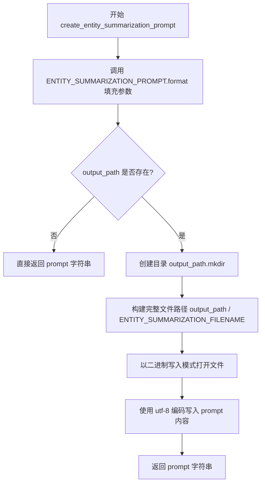
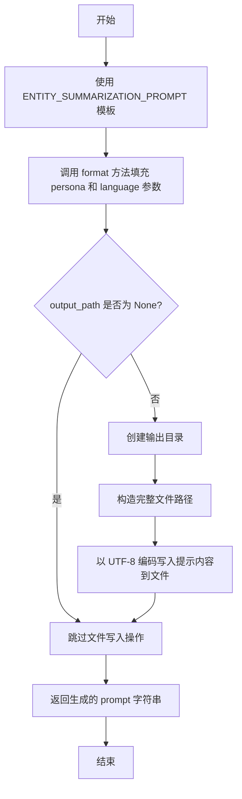

# `graphrag\packages\graphrag\graphrag\prompt_tune\generator\entity_summarization_prompt.py` 详细设计文档

该模块用于生成实体摘要提示（Entity Summarization Prompt），通过将 persona 和 language 参数填充到预定义的提示模板中，生成定制化的实体摘要提示内容，并支持将生成的提示写入指定文件路径。

## 整体流程



## 类结构

```
该文件为模块文件，无类层次结构
仅包含一个模块级函数: create_entity_summarization_prompt
```

## 全局变量及字段


### `ENTITY_SUMMARIZATION_FILENAME`
    
实体摘要提示文件的默认文件名，值为 'summarize_descriptions.txt'

类型：`str`
    


    

## 全局函数及方法


### `create_entity_summarization_prompt`

该函数是模块级函数，用于根据指定的人物角色（persona）和语言（language）生成实体摘要提示（Entity Summarization Prompt），并将生成的提示内容返回给调用者，同时可选地将其写入到指定的输出路径文件中。

参数：

- `persona`：`str`，用于实体摘要提示的角色/人物设定，定义生成提示时使用的身份或视角
- `language`：`str`，用于实体摘要提示的语言，指定生成提示内容所使用的语言
- `output_path`：`Path | None`，可选的输出路径，指定将提示内容写入文件的目标目录，默认为 None（不写入文件）

返回值：`str`，返回格式化后的实体摘要提示内容字符串

#### 流程图



#### 带注释源码

```python
# 导入 Path 用于处理文件路径
from pathlib import Path

# 从 graphrag 库中导入实体摘要提示模板
from graphrag.prompt_tune.template.entity_summarization import (
    ENTITY_SUMMARIZATION_PROMPT,
)

# 定义输出文件名常量
ENTITY_SUMMARIZATION_FILENAME = "summarize_descriptions.txt"


def create_entity_summarization_prompt(
    persona: str,          # 角色/人物设定参数
    language: str,         # 语言参数
    output_path: Path | None = None,  # 可选的输出路径
) -> str:                 # 返回生成的提示字符串
    """
    Create a prompt for entity summarization.

    Parameters
    ----------
    - persona (str): The persona to use for the entity summarization prompt
    - language (str): The language to use for the entity summarization prompt
    - output_path (Path | None): The path to write the prompt to. Default is None.
    """
    # 使用模板和传入的参数格式化生成提示内容
    prompt = ENTITY_SUMMARIZATION_PROMPT.format(persona=persona, language=language)

    # 检查是否需要将提示写入文件
    if output_path:
        # 创建必要的父目录，确保路径存在
        output_path.mkdir(parents=True, exist_ok=True)

        # 拼接完整的输出文件路径
        output_path = output_path / ENTITY_SUMMARIZATION_FILENAME
        
        # 打开文件并以 UTF-8 编码写入提示内容
        with output_path.open("wb") as file:
            file.write(prompt.encode(encoding="utf-8", errors="strict"))

    # 返回生成的提示字符串
    return prompt
```

## 关键组件


### 实体摘要提示模板 (ENTITY_SUMMARIZATION_PROMPT)

从 graphrag.prompt_tune.template.entity_summarization 模块导入的提示模板，用于生成实体摘要的格式化字符串模板，包含 persona 和 language 占位符。

### 文件名常量 (ENTITY_SUMMARIZATION_FILENAME)

定义为 "summarize_descriptions.txt" 的常量，指定实体摘要提示输出文件的默认文件名。

### 实体摘要提示生成函数 (create_entity_summarization_prompt)

核心功能函数，用于创建实体摘要提示。支持指定 persona 和 language 参数，将模板格式化为完整提示字符串，可选地将提示写入指定输出路径。包含目录创建、文件写入和 UTF-8 编码处理逻辑。


## 问题及建议


### 已知问题

- 缺少对输入参数 persona 和 language 的有效性验证（如空字符串检查）
- output_path 变量在函数内部被重新赋值，覆盖了原始输入参数，容易造成混淆
- 文件写入操作缺少错误处理机制，未捕获可能的 IOError 或 OSError
- 缺少对 ENTITY_SUMMARIZATION_PROMPT 格式化失败的异常处理
- 未对 output_path.mkdir 的潜在异常进行处理
- 打开文件使用 "wb" 模式但内容是已编码的字节串，语义上不够直观
- 函数职责过多，同时承担了提示词生成、目录创建和文件写入三个职责

### 优化建议

- 在函数入口添加参数校验，确保 persona 和 language 非空
- 使用不同的变量名存储最终文件路径，避免覆盖输入参数
- 添加 try-except 块处理文件操作可能的异常
- 将文件写入逻辑抽取为独立的辅助函数，提高函数单一职责性
- 考虑添加日志记录以追踪提示词生成和文件写入状态
- 考虑返回 Optional[str] 或使用 typing.Tuple 来区分返回不同内容的场景
- 添加异常声明或文档说明可能的异常类型

## 其它


### 设计目标与约束

本模块的设计目标是提供一个轻量级、可配置的实体摘要提示生成功能，支持多语言和多角色定制。核心约束包括：仅依赖标准库和项目内部模板，不引入外部复杂依赖；输出格式为UTF-8编码的文本文件；支持可选的文件输出路径。

### 错误处理与异常设计

本模块的错误处理机制主要体现在文件操作层面：当output_path指定时，调用mkdir创建目录可能抛出OSError或PermissionError；文件写入时可能抛出IOError或UnicodeEncodeError。代码使用errors="strict"参数，意味着编码错误将直接抛出异常。函数参数验证依赖调用方保证类型正确性，未进行显式参数校验。

### 外部依赖与接口契约

主要外部依赖包括：pathlib.Path（标准库）、graphrag.prompt_tune.template.entity_summarization模块中的ENTITY_SUMMARIZATION_PROMPT模板。接口契约规定：persona和language参数必须为字符串类型，output_path必须为Path对象或None，返回值为字符串类型的提示内容。

### 性能考虑

模块性能开销主要来自文件IO操作和字符串模板格式化。模板格式化使用str.format()方法，时间复杂度为O(n)，其中n为模板和参数的总长度。文件写入采用二进制模式（"wb"），相比文本模式有轻微性能优势。建议在高频调用场景下缓存已生成的提示内容。

### 安全性考虑

代码使用errors="strict"严格编码模式，可防止静默的编码错误导致数据损坏。文件写入操作存在路径遍历风险，若output_path参数来自用户输入，建议增加路径安全校验。模块本身不涉及敏感数据处理，安全性风险较低。

### 配置管理

模块无独立配置项，配置通过函数参数传递：persona（角色定义）、language（语言设置）、output_path（输出位置）。ENTITY_SUMMARIZATION_FILENAME作为模块级常量，可考虑提取至配置中心实现动态管理。

### 版本兼容性

代码使用了Python 3.10+的联合类型语法（Path | None），需要Python 3.10及以上版本。pathlib.Path为Python 3.4+引入，建议在项目requirements中明确Python版本要求。

### 测试策略建议

建议覆盖以下测试场景：正常流程生成提示、输出路径为空时返回提示但不写入文件、输出路径有效时正确创建目录和文件、编码异常处理、多语言和空字符串persona的边界情况。

### 扩展性考虑

当前模块仅支持单一模板ENTITY_SUMMARIZATION_PROMPT。可通过增加template_name参数支持多模板选择，或通过抽象基类实现策略模式支持不同类型的提示生成任务。模块设计符合开闭原则，扩展功能时无需修改现有逻辑。


    