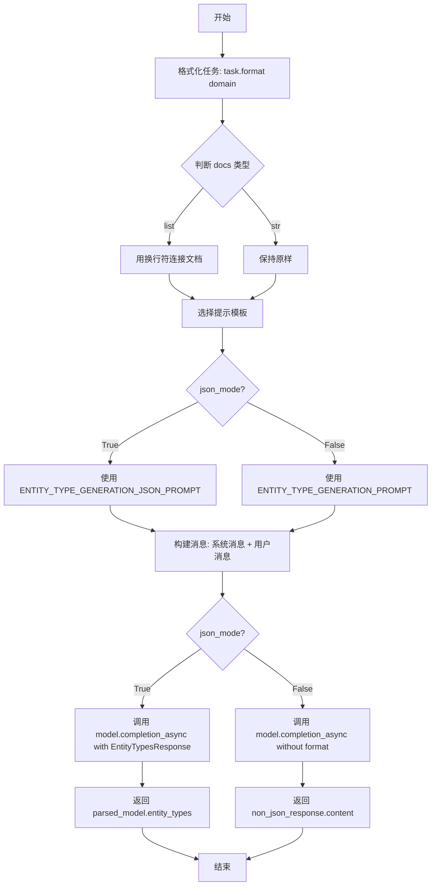
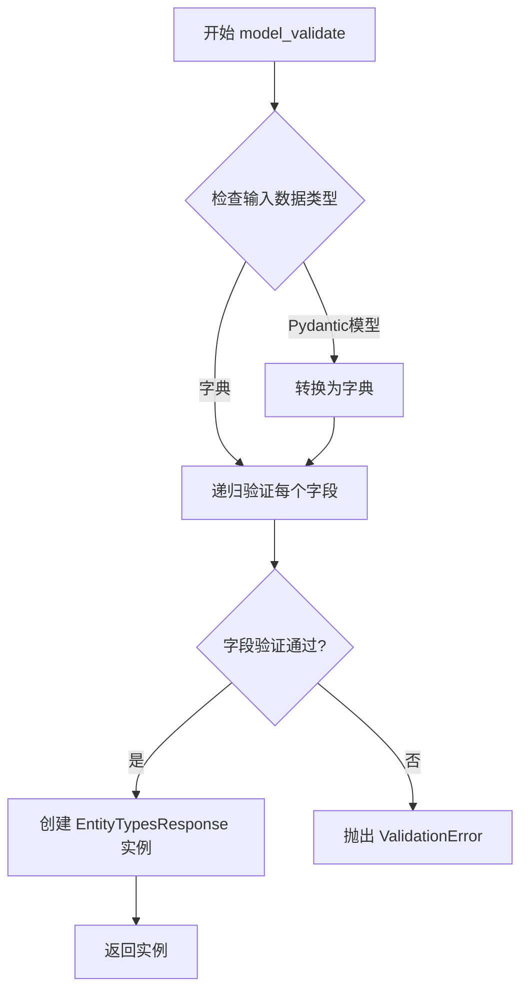
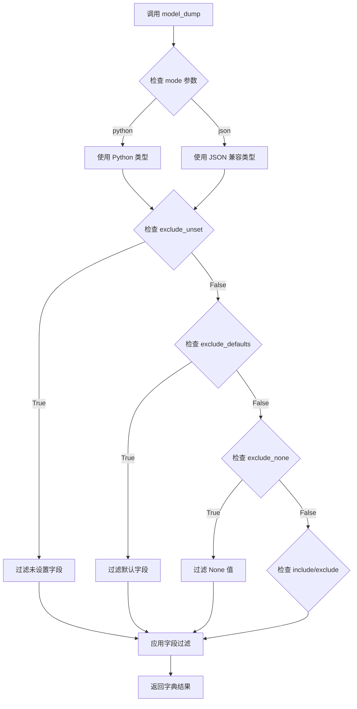
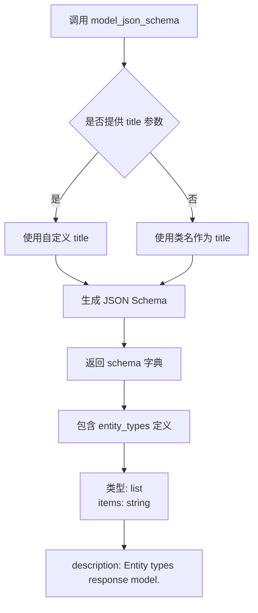
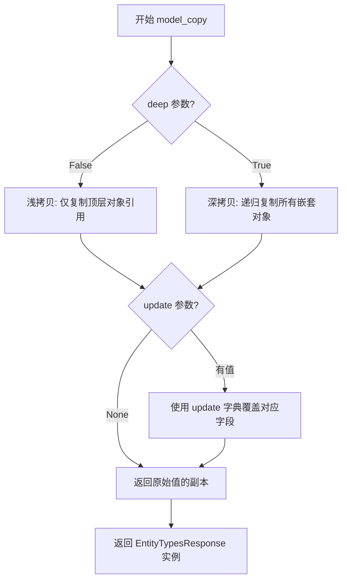
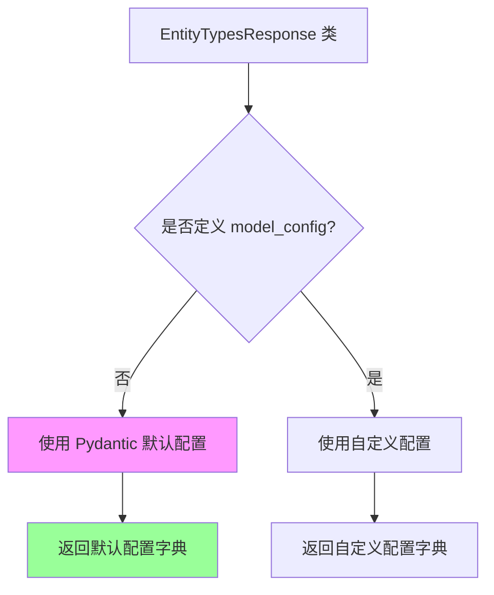

# `graphrag\packages\graphrag\graphrag\prompt_tune\generator\entity_types.py` 详细设计文档

该模块用于从给定的一组（小）文档中生成实体类型分类，通过调用LLM模型根据领域、角色和文档内容生成实体类型列表，支持JSON和非JSON两种输出模式。

## 整体流程

```mermaid
graph TD
A[开始 generate_entity_types] --> B[格式化任务 task.format(domain)]
B --> C{docs是否为列表?}
C -- 是 --> D[用换行符连接文档 docs.join]
C -- 否 --> E[直接使用docs字符串]
D --> F[选择提示模板]
E --> F
F --> G{json_mode?}
G -- 是 --> H[使用ENTITY_TYPE_GENERATION_JSON_PROMPT]
G -- 否 --> I[使用ENTITY_TYPE_GENERATION_PROMPT]
H --> J[构建消息: system(persona) + user(prompt)]
I --> J
J --> K{json_mode?}
K -- 是 --> L[调用model.completion_async with EntityTypesResponse]
K -- 否 --> M[调用model.completion_async without response_format]
L --> N[返回 parsed_model.entity_types 或空列表]
M --> O[返回 non_json_response.content]
```

## 类结构

```
EntityTypesResponse (Pydantic BaseModel)
└── entity_types: list[str]
```

## 全局变量及字段


### `TYPE_CHECKING`
    
用于类型检查的条件导入标志

类型：`typing.TYPE_CHECKING`
    


### `DEFAULT_TASK`
    
默认任务提示模板

类型：`str`
    


### `ENTITY_TYPE_GENERATION_JSON_PROMPT`
    
JSON模式实体类型生成提示模板

类型：`str`
    


### `ENTITY_TYPE_GENERATION_PROMPT`
    
普通模式实体类型生成提示模板

类型：`str`
    


### `EntityTypesResponse.entity_types`
    
实体类型列表

类型：`list[str]`
    
    

## 全局函数及方法


### `generate_entity_types`

该函数是一个异步函数，用于根据给定的文档集合生成实体类型类别列表。它通过调用LLM模型并使用预定义的提示模板来从文档中提取实体类型，可选择JSON模式或文本模式返回结果。

参数：

- `model`：`"LLMCompletion"`，LLM模型实例，用于生成实体类型
- `domain`：`str`，领域信息，用于任务提示的格式化
- `persona`：`str`，角色设定，作为系统消息传递给LLM
- `docs`：`str | list[str]`，待分析的文档内容，可以是单字符串或字符串列表
- `task`：`str = DEFAULT_TASK`，任务提示模板，默认为DEFAULT_TASK
- `json_mode`：`bool = False`，是否使用JSON模式，默认为False

返回值：`str | list[str]`，返回生成的实体类型列表（JSON模式）或字符串（非JSON模式）

#### 流程图



#### 带注释源码

```python
async def generate_entity_types(
    model: "LLMCompletion",
    domain: str,
    persona: str,
    docs: str | list[str],
    task: str = DEFAULT_TASK,
    json_mode: bool = False,
) -> str | list[str]:
    """
    Generate entity type categories from a given set of (small) documents.

    Example Output:
    "entity_types": ['military unit', 'organization', 'person', 'location', 'event', 'date', 'equipment']
    """
    # 格式化任务提示，将domain插入到任务模板中
    formatted_task = task.format(domain=domain)

    # 处理文档输入：如果docs是列表则用换行符连接，否则保持字符串不变
    docs_str = "\n".join(docs) if isinstance(docs, list) else docs

    # 根据json_mode选择对应的提示模板，并格式化提示词
    entity_types_prompt = (
        ENTITY_TYPE_GENERATION_JSON_PROMPT
        if json_mode
        else ENTITY_TYPE_GENERATION_PROMPT
    ).format(task=formatted_task, input_text=docs_str)

    # 构建消息队列：先添加系统消息（角色设定），再添加用户消息（提示词）
    messages = (
        CompletionMessagesBuilder()
        .add_system_message(persona)
        .add_user_message(entity_types_prompt)
        .build()
    )

    # 根据json_mode选择不同的调用方式
    if json_mode:
        # JSON模式：指定response_format为EntityTypesResponse，让LLM返回结构化JSON
        response: LLMCompletionResponse[
            EntityTypesResponse
        ] = await model.completion_async(
            messages=messages,
            response_format=EntityTypesResponse,
        )  # type: ignore
        # 解析响应，提取entity_types列表，如果解析失败则返回空列表
        parsed_model = response.formatted_response
        return parsed_model.entity_types if parsed_model else []

    # 非JSON模式：直接获取LLM返回的文本内容
    non_json_response: LLMCompletionResponse = await model.completion_async(
        messages=messages
    )  # type: ignore
    return non_json_response.content
```


### `EntityTypesResponse.model_validate`

Pydantic BaseModel 的类方法，用于验证输入数据并根据模型定义创建一个 `EntityTypesResponse` 实例。当传入的数据符合模型 schema 时，返回一个包含 `entity_types` 字段的模型实例；若数据不符合 schema，则抛出 `ValidationError` 异常。

参数：

- `data`：`dict | BaseModel`，需要验证的数据，可以是字典或其他 Pydantic 模型实例
- `context`：`dict | None`，可选的额外上下文信息，会传递给字段验证器

返回值：`EntityTypesResponse`，验证通过后返回的模型实例，包含 `entity_types: list[str]` 属性

#### 流程图



#### 带注释源码

```
# 注意：此方法继承自 Pydantic BaseModel，未在当前代码文件中显式定义
# 以下是 Pydantic 内部实现的逻辑说明

class EntityTypesResponse(BaseModel):
    """Entity types response model."""
    
    entity_types: list[str]
    
    @classmethod
    def model_validate(cls, data: dict | BaseModel, context: dict | None = None) -> "EntityTypesResponse":
        """
        验证并创建模型实例的类方法。
        
        参数:
            data: 要验证的数据，可以是字典或另一个 Pydantic 模型
            context: 可选的上下文信息，用于自定义验证器
            
        返回:
            验证通过的 EntityTypesResponse 实例
            
        异常:
            ValidationError: 当数据不符合模型定义时抛出
        """
        # 1. 如果输入是 Pydantic 模型，提取其字典表示
        if isinstance(data, BaseModel):
            data = data.model_dump()
        
        # 2. 对每个字段进行类型检查和验证
        #    - entity_types: 必须 list[str]
        #    - 如果验证失败，Pydantic 会抛出 ValidationError
        
        # 3. 返回验证通过的模型实例
        return cls(**data)
```

#### 使用场景说明

在当前代码中，`model_validate` 方法虽然未被显式调用，但它是 `EntityTypesResponse` 类的核心组成部分。当 LLM 返回 JSON 格式响应时，Pydantic 会自动使用 `model_validate`（或 `model_validate_json`）将原始响应数据转换为 `EntityTypesResponse` 实例。

例如在 `generate_entity_types` 函数的 `json_mode=True` 分支中：

```python
response: LLMCompletionResponse[EntityTypesResponse] = await model.completion_async(
    messages=messages,
    response_format=EntityTypesResponse,  # 指定响应格式
)
parsed_model = response.formatted_response  # 内部使用 model_validate 验证
return parsed_model.entity_types if parsed_model else []
```

这里的 `response_format=EntityTypesResponse` 参数告诉 Pydantic 风格的 LLM 客户端，需要将响应解析为 `EntityTypesResponse` 模型实例，底层会调用 `model_validate` 进行数据验证。


### `EntityTypesResponse.model_dump`

该方法是 Pydantic BaseModel 内置的序列化方法，用于将 `EntityTypesResponse` 模型实例转换为字典格式。在代码中未显式定义，但继承自 Pydantic 的 `BaseModel` 基类。

参数：

- `mode`：`Literal['python', 'json']`，可选，指定输出模式。`'python'` 返回 Python 原生类型（str, int, list, dict），`'json'` 返回 JSON 兼容的字典（str, int, float, bool, list, dict, None）
- `include`：`Set[int | str] | Mapping[int | str, Any] | None`，可选，指定需要包含的字段
- `exclude`：`Set[int | str] | Mapping[int | str, Any] | None`，可选，指定需要排除的字段
- `exclude_unset`：`bool`，可选，若为 True，只包含被显式设置的字段
- `exclude_defaults`：`bool`，可选，若为 True，不包含默认值的字段
- `exclude_none`：`bool`，可选，若为 True，不包含值为 None 的字段
- `by_alias`：`bool`，可选，若为 True，使用字段别名作为键

返回值：`dict[str, Any]`，返回序列化后的字典

#### 流程图



#### 带注释源码

```python
# EntityTypesResponse 类的 model_dump 方法继承自 Pydantic.BaseModel
# 该方法用于将模型实例序列化为字典

class EntityTypesResponse(BaseModel):
    """实体类型响应模型"""
    
    entity_types: list[str]  # 实体类型列表字段

# 使用示例：
response = EntityTypesResponse(entity_types=["person", "organization", "location"])

# 调用 model_dump 方法（隐式调用）
dict_result = response.model_dump()

# 返回结果：{'entity_types': ['person', 'organization', 'location']}

# 使用 JSON 模式：
json_result = response.model_dump(mode='json')
# 返回结果：{'entity_types': ['person', 'organization', 'location']}

# 排除空值：
filtered_result = response.model_dump(exclude_none=True)
```


### `EntityTypesResponse.model_json_schema`

该方法是 Pydantic BaseModel 内置的方法，用于生成 EntityTypesResponse 模型的 JSON Schema 定义，描述模型的结构和类型信息。

参数：
- 无直接参数（使用 Pydantic 默认参数）
- `mode`: `str`（可选），模式类型，默认为 "python"
- `title`: `str | None`（可选），自定义 schema 标题

返回值：`dict`，返回包含模型 JSON Schema 定义的字典，描述 entity_types 字段的类型和约束。

#### 流程图



#### 带注释源码

```python
# EntityTypesResponse 类的 model_json_schema 方法
# 继承自 pydantic.BaseModel

class EntityTypesResponse(BaseModel):
    """Entity types response model."""
    # 实体类型列表字段
    entity_types: list[str]

# 调用 model_json_schema 方法获取 JSON Schema
# 来源：pydantic.main.BaseModel.model_json_schema

# 基础调用示例：
# schema = EntityTypesResponse.model_json_schema()

# 带参数调用示例：
# schema = EntityTypesResponse.model_json_schema(
#     mode='validation',  # 或 'serialization'
#     title='CustomEntityTypesResponse'  # 自定义标题
# )

# 返回的 JSON Schema 结构大致如下：
# {
#     'type': 'object',
#     'title': 'EntityTypesResponse',
#     'properties': {
#         'entity_types': {
#             'type': 'array',
#             'items': {'type': 'string'},
#             'description': '实体类型列表'
#         }
#     },
#     'required': ['entity_types']
# }

# 实际返回的完整 schema（使用 Pydantic v2）：
# {
#     'properties': {
#         'entity_types': {
#             'items': {'type': 'string'},
#             'type': 'array'
#         }
#     },
#     'required': ['entity_types'],
#     'title': 'EntityTypesResponse',
#     'type': 'object'
# }
```

#### 补充说明

**方法来源**：这是 Pydantic v2 中 `BaseModel` 类的内置方法，无需显式定义即可使用。

**使用场景**：
- 生成 API 文档
- 数据验证
- 与其他系统集成时交换类型信息
- 动态类型检查

**相关字段信息**：
- `entity_types`: `list[str]` — 表示返回的实体类型列表，如 `['person', 'organization', 'location']`


### `EntityTypesResponse.model_copy`

该方法是 Pydantic BaseModel 的内置方法，用于创建 `EntityTypesResponse` 模型的副本。由于代码中未显式定义此方法，它继承自 Pydantic v2 的 `BaseModel` 类。

参数：

- `deep`：`bool`，是否进行深拷贝（默认为 `False`）。当设为 `True` 时，会递归复制所有嵌套对象。
- `update`：`dict | None`，用于更新副本值的字典（默认为 `None`）。传入字典后，副本将使用新值覆盖对应字段。

返回值：`EntityTypesResponse`，返回当前模型的副本（深拷贝或浅拷贝）。

#### 流程图



#### 带注释源码

```python
# 该方法继承自 pydantic.BaseModel，在代码中未显式定义
# 下面是 Pydantic v2 中 model_copy 方法的典型实现逻辑示意：

def model_copy(
    self,
    *,
    deep: bool = False,
    update: dict | None = None,
) -> "EntityTypesResponse":
    """
    创建模型的副本。
    
    参数:
        deep: 如果为 True，进行深拷贝（递归复制所有嵌套对象）
              如果为 False，进行浅拷贝（嵌套对象仍为引用）
        update: 可选的字典，用于更新副本的字段值
    
    返回值:
        EntityTypesResponse: 模型的新副本实例
    """
    # 1. 获取当前模型的字段值
    # 2. 如果 deep=True，递归复制所有嵌套的 BaseModel/对象
    # 3. 如果提供了 update 字典，合并更新值
    # 4. 返回新的实例
    ...
    # 示例用法：
    # original = EntityTypesResponse(entity_types=["person", "location"])
    # shallow_copy = original.model_copy()
    # deep_copy = original.model_copy(deep=True)
    # updated_copy = original.model_copy(update={"entity_types": ["new_type"]})
```

> **注意**: 由于该方法未在代码中显式定义，而是继承自 Pydantic v2 的 `BaseModel` 类，因此分析基于 Pydantic 官方文档对该方法的描述。


### EntityTypesResponse.model_config

`EntityTypesResponse` 类继承自 Pydantic 的 `BaseModel`，使用了 Pydantic v2 的配置方式。该类未显式定义自定义的 `model_config`，因此使用 Pydantic 的默认配置。

参数：

- 无显式参数（这是 Pydantic BaseModel 的类属性配置）

返回值：`dict` 或 `ConfigDict` 类型，返回模型的配置字典

#### 流程图



#### 带注释源码

```python
class EntityTypesResponse(BaseModel):
    """Entity types response model."""
    
    # Pydantic v2 中的 model_config 是一个类属性
    # 用于配置模型的元数据、验证规则等
    # 当前类没有显式定义 model_config，使用 Pydantic 默认配置
    
    entity_types: list[str]  # 实体类型列表字段
    
    # model_config 的常见配置项（当前未使用）：
    # - model_config = ConfigDict(
    #     str_strip_whitespace=True,  # 自动去除字符串首尾空格
    #     validate_assignment=True,   # 赋值时验证
    #     extra='forbid',            # 禁止额外字段
    #     frozen=True,               # 不可变模型
    #     arbitrary_types_allowed=True,  # 允许任意类型
    #   )
```

#### 备注

由于 `EntityTypesResponse` 类本身没有显式定义 `model_config`，该方法返回 Pydantic v2 的默认配置。如需自定义配置，应使用 `pydantic.ConfigDict` 来定义，例如：

```python
from pydantic import ConfigDict, BaseModel

class EntityTypesResponse(BaseModel):
    model_config = ConfigDict(
        str_strip_whitespace=True,
        validate_assignment=True
    )
    
    entity_types: list[str]
```


## 关键组件


### EntityTypesResponse 实体类型响应模型

Pydantic 数据模型，用于解析 LLM 返回的实体类型列表，包含 `entity_types: list[str]` 字段。

### generate_entity_types 实体类型生成函数

异步核心函数，负责根据输入的文档内容生成实体类型分类。通过提示词模板和 LLM 完成调用，根据 `json_mode` 参数选择不同模式，支持字符串或字符串列表形式的文档输入。

### 提示词模板组件

包含 `ENTITY_TYPE_GENERATION_JSON_PROMPT` 和 `ENTITY_TYPE_GENERATION_PROMPT` 两个提示词模板，分别用于 JSON 模式和非 JSON 模式下的实体类型生成。

### CompletionMessagesBuilder 消息构建器

用于构建 LLM 调用的消息序列，支持添加系统消息和用户消息，最终构建出符合格式要求的 messages 列表。

### LLMCompletion 接口

异步 LLM 完成接口，支持 `completion_async` 方法调用，可指定响应格式（通过 `response_format` 参数），支持结构化输出。

### JSON 模式支持

通过 `json_mode` 参数控制响应解析方式：JSON 模式使用 Pydantic 模型解析返回的结构化数据，非 JSON 模式直接返回文本内容。

### 文档处理组件

支持两种文档输入格式（字符串或字符串列表），通过 `docs_str = "\n".join(docs)` 实现格式统一处理。


## 问题及建议


### 已知问题

-   **返回类型不一致**：函数签名声明返回类型为 `str | list[str]`，但当 `json_mode=True` 且解析失败时返回空列表 `[]`，类型为 `list[str]`，而 `json_mode=False` 时返回 `non_json_response.content`（类型不确定），导致调用方难以正确处理返回值
-   **缺少异常处理**：对 `model.completion_async()` 的调用没有 try-except 包装，若 LLM 服务不可用或请求超时将直接抛出异常向上传播，缺乏优雅的错误处理机制
-   **类型注解使用 `# type: ignore`**：代码中两处使用 `# type: ignore` 抑制类型检查器警告，表明可能存在类型定义不精确或临时规避问题，长期来看应修复类型注解而非忽略
-   **task.format() 缺乏校验**：`task.format(domain=domain)` 假设 task 字符串包含 `{domain}` 占位符，若格式不匹配将抛出 KeyError，缺乏前置校验
-   **输入验证不足**：`docs` 参数虽然支持 list 或 str，但未对文档长度、内容大小做限制，可能导致发送给 LLM 的上下文过长超出模型限制
-   **硬编码的列表空值**：JSON 模式解析失败时返回空列表而非 None 或抛出特定异常，可能导致调用方无法区分"未生成"和"生成失败"两种状态

### 优化建议

-   **统一返回类型或明确文档**：将返回类型明确为 `list[str]`，对于非 JSON 模式也解析为列表返回；或在文档中明确说明不同模式下的返回类型差异
-   **添加异常处理和重试机制**：使用 try-except 捕获 LLM 调用异常，可选地添加重试逻辑（如使用 tenacity 库），并考虑引入超时控制
-   **移除 type ignore 并修正类型定义**：与 `graphrag_llm` 库协调确保类型定义准确，或在本地定义合适的类型别名替代忽略
-   **增强输入校验**：在函数入口处校验 `task` 是否可格式化、对 `docs` 总长度做限制、校验 `persona` 非空等
-   **定义明确的错误信号**：定义自定义异常类或返回 Result 类型（如 `Either[str, list[str]]`），区分成功、空结果、错误等不同状态

## 其它


### 设计目标与约束

该模块的核心设计目标是从给定的文档集合中自动生成实体类型类别列表，用于微调场景。约束条件包括：支持JSON和非JSON两种响应模式，默认使用非JSON模式；domain参数用于指定领域范围，persona参数用于定义LLM的角色设定；task参数支持自定义格式化模板，默认为DEFAULT_TASK。

### 错误处理与异常设计

该模块的错误处理设计存在以下不足之处需要改进：

1. JSON模式解析失败时未提供明确的错误提示，当parsed_model为None时直接返回空列表，可能导致调用方难以追踪问题根源
2. LLM调用过程中可能出现的网络异常、超时等问题未进行显式捕获和处理
3. 缺少对输入参数的有效性校验，如model为None、domain或persona为空字符串等边界情况
4. 类型标注中使用# type: ignore表明开发者已知悉类型不匹配问题，但未从根本上解决类型安全问题

建议增加自定义异常类（如EntityTypesGenerationError），并在关键节点添加try-except块进行异常捕获与日志记录。

### 数据流与状态机

该模块的数据流相对简单，主要包含以下步骤：

1. **输入阶段**：接收model（LLM实例）、domain、persona、docs等参数
2. **格式化阶段**：将task模板与domain结合生成formatted_task；将docs列表转为字符串格式
3. **Prompt构建阶段**：根据json_mode选择对应的Prompt模板，格式化生成最终Prompt
4. **消息构建阶段**：使用CompletionMessagesBuilder构建包含system message和user message的消息列表
5. **LLM调用阶段**：异步调用model.completion_async方法
6. **响应解析阶段**：根据json_mode决定是否使用Pydantic模型解析响应
7. **输出阶段**：返回实体类型列表或原始响应内容

状态机模型较为简单，无复杂状态转换，主要为线性流程。

### 外部依赖与接口契约

该模块的外部依赖主要包括：

1. **graphrag_llm.utils.CompletionMessagesBuilder**：消息构建工具类，用于构建符合LLM要求的对话消息格式
2. **pydantic.BaseModel**：用于定义EntityTypesResponse响应模型，实现JSON响应的自动校验与解析
3. **graphrag.prompt_tune.defaults.DEFAULT_TASK**：默认任务模板字符串
4. **graphrag.prompt_tune.prompt.entity_types**：包含ENTITY_TYPE_GENERATION_JSON_PROMPT和ENTITY_TYPE_GENERATION_PROMPT两种Prompt模板
5. **LLMCompletion**：LLMCompletion接口，定义completion_async方法签名
6. **LLMCompletionResponse**：响应类型，包含formatted_response和content属性

接口契约说明：
- model参数必须实现completion_async方法，支持messages和可选的response_format参数
- 返回类型为str | list[str]，取决于json_mode参数
- 当json_mode为True时，返回list[str]；当json_mode为False时，返回str

### 性能考虑与资源消耗

该模块在性能方面存在以下考量：

1. 文档字符串拼接使用"\n".join()，对于大量文档可能产生较大内存开销，建议评估是否需要流式处理或分批处理
2. 异步函数设计合理，但缺少并发控制机制，在高并发场景下可能对LLM服务造成压力
3. 未实现缓存机制，相同domain和docs的请求会重复调用LLM

### 安全性考量

该模块的安全性设计相对薄弱：

1. 直接将用户输入的docs拼接到prompt中，可能存在Prompt注入风险
2. persona参数未进行校验，恶意的persona可能影响LLM行为
3. 缺少输入长度限制，可能导致超长输入引发LLM处理异常

### 可测试性分析

该模块的可测试性存在一定挑战：

1. 依赖外部LLM服务，单元测试需要mock LLMCompletion接口
2. Prompt模板的格式化逻辑与业务逻辑混合，测试时需要覆盖多种输入组合
3. 建议增加对不同json_mode参数值的分支测试覆盖

### 配置与扩展性

该模块的扩展性设计：

1. 通过json_mode参数支持两种响应模式，便于适配不同LLM服务能力
2. task参数支持自定义模板，具备一定的灵活性
3. 未来可考虑增加temperature、max_tokens等LLM生成参数的支持
4. EntityTypesResponse模型可通过继承扩展更多字段

### 日志与监控

该模块缺少日志记录机制，建议增加：

1. 函数入口日志，记录输入参数（脱敏处理）
2. LLM调用前后的时间戳记录，便于性能监控
3. 响应状态的日志记录，包括成功/失败状态
4. 异常发生时的详细堆栈信息记录


    