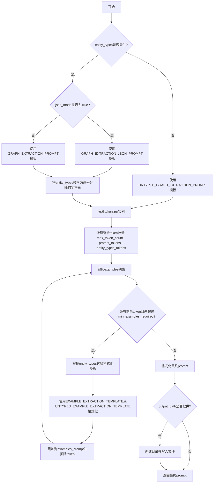
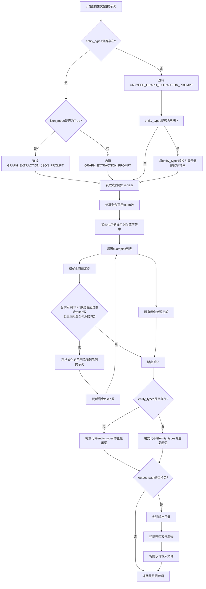

# `graphrag\packages\graphrag\graphrag\prompt_tune\generator\extract_graph_prompt.py` 详细设计文档

实体提取提示词生成模块，用于根据文档和示例创建带有token限制管理的实体图提取提示词，支持有类型和无类型两种模式以及JSON和纯文本两种输出格式。

## 整体流程



## 类结构

```
无类层次结构 - 纯函数模块
```

## 全局变量及字段


### `EXTRACT_GRAPH_FILENAME`
    
输出提示词文件的常量文件名，用于指定生成的实体提取提示文件的名称

类型：`str`
    


    

## 全局函数及方法


### `create_extract_graph_prompt`

创建实体提取提示词的主函数，用于根据给定的文档、示例和配置生成用于从文本中提取实体的LLM提示词。

参数：

- `entity_types`：`str | list[str] | None`，要提取的实体类型，可以是单个类型、类型列表或None（无类型）
- `docs`：`list[str]`，要从中提取实体的文档列表
- `examples`：`list[str]`，用于实体提取的示例列表
- `language`：`str`，输入和输出的语言
- `max_token_count`：`int`，提示词的最大token数量限制
- `tokenizer`：`Tokenizer | None`，用于编码和解码文本的tokenizer，默认为None（自动获取）
- `json_mode`：`bool`，是否使用JSON模式生成提示词，默认为False
- `output_path`：`Path | None`，可选的输出路径，用于将提示词写入文件
- `min_examples_required`：`int`，所需的最少示例数量，默认为2

返回值：`str`，生成的实体提取提示词

#### 流程图



#### 带注释源码

```python
def create_extract_graph_prompt(
    entity_types: str | list[str] | None,
    docs: list[str],
    examples: list[str],
    language: str,
    max_token_count: int,
    tokenizer: Tokenizer | None = None,
    json_mode: bool = False,
    output_path: Path | None = None,
    min_examples_required: int = 2,
) -> str:
    """
    创建实体提取提示词。

    Parameters
    ----------
    - entity_types (str | list[str]): 要提取的实体类型
    - docs (list[str]): 要从中提取实体的文档列表
    - examples (list[str]): 用于实体提取的示例列表
    - language (str): 输入和输出的语言
    - tokenizer (Tokenizer): 用于编码和解码文本的tokenizer
    - max_token_count (int): 提示词的最大token数量
    - json_mode (bool): 是否使用JSON模式生成提示词，默认为False
    - output_path (Path | None): 写入提示词的路径，默认为None
    - min_examples_required (int): 所需的最少示例数，默认为2

    Returns
    -------
    - str: 实体提取提示词
    """
    # ===== 第1步：选择基础提示词模板 =====
    # 根据json_mode和entity_types是否存在的条件，选择对应的提示词模板
    # 如果entity_types存在：根据json_mode选择JSON格式或普通格式的提示词
    # 如果entity_types不存在：选择无类型的提示词模板
    prompt = (
        (GRAPH_EXTRACTION_JSON_PROMPT if json_mode else GRAPH_EXTRACTION_PROMPT)
        if entity_types
        else UNTYPED_GRAPH_EXTRACTION_PROMPT
    )

    # ===== 第2步：处理实体类型列表 =====
    # 如果entity_types是列表，将其转换为逗号分隔的字符串格式
    # 例如：["人物", "地点"] -> "人物, 地点"
    if isinstance(entity_types, list):
        entity_types = ", ".join(map(str, entity_types))

    # ===== 第3步：获取tokenizer =====
    # 如果未提供tokenizer，则使用默认的get_tokenizer()获取
    tokenizer = tokenizer or get_tokenizer()

    # ===== 第4步：计算剩余可用token数 =====
    # 从最大token数中减去主提示词和实体类型占用的token数
    # 如果entity_types为None，则剩余token数为0（后续会特殊处理）
    tokens_left = (
        max_token_count
        - tokenizer.num_tokens(prompt)
        - tokenizer.num_tokens(entity_types)
        if entity_types
        else 0
    )

    # ===== 第5步：初始化示例提示词 =====
    # 用于累积所有格式化后的示例
    examples_prompt = ""

    # ===== 第6步：遍历示例并格式化 =====
    # 迭代处理每个示例，在token数允许的范围内尽可能多地包含示例
    for i, output in enumerate(examples):
        # 获取对应的输入文档
        input = docs[i]
        
        # 根据是否有entity_types选择对应的示例模板进行格式化
        # 格式化内容包括：示例编号、输入文本、实体类型、期望输出
        example_formatted = (
            EXAMPLE_EXTRACTION_TEMPLATE.format(
                n=i + 1, input_text=input, entity_types=entity_types, output=output
            )
            if entity_types
            else UNTYPED_EXAMPLE_EXTRACTION_TEMPLATE.format(
                n=i + 1, input_text=input, output=output
            )
        )

        # 计算当前示例的token数
        example_tokens = tokenizer.num_tokens(example_formatted)

        # ===== 第7步：检查是否需要停止添加示例 =====
        # 条件：已满足最少示例要求 且 当前示例token数超过剩余token数
        # 保证至少包含min_examples_required个示例
        if i >= min_examples_required and example_tokens > tokens_left:
            break

        # 将格式化后的示例添加到示例提示词中
        examples_prompt += example_formatted
        # 扣减已使用的token数
        tokens_left -= example_tokens

    # ===== 第8步：格式化最终提示词 =====
    # 将示例插入到主提示词模板中，并指定语言
    # 根据entity_types是否存在选择不同的格式化方式
    prompt = (
        prompt.format(
            entity_types=entity_types, examples=examples_prompt, language=language
        )
        if entity_types
        else prompt.format(examples=examples_prompt, language=language)
    )

    # ===== 第9步：写入输出文件（如果指定） =====
    if output_path:
        # 创建必要的父目录
        output_path.mkdir(parents=True, exist_ok=True)

        # 拼接完整文件路径
        output_path = output_path / EXTRACT_NAME
        
        # 将提示词以UTF-8编码写入文件
        with output_path.open("wb") as file:
            file.write(prompt.encode(encoding="utf-8", errors="strict"))

    # ===== 第10步：返回最终提示词 =====
    return prompt
```

## 关键组件


### 实体类型与模板选择机制

根据entity_types参数和json_mode标志，动态选择不同的提示模板。包含四种模板变体：GRAPH_EXTRACTION_PROMPT（类型化）、GRAPH_EXTRACTION_JSON_PROMPT（类型化+JSON）、UNTYPED_GRAPH_EXTRACTION_PROMPT（非类型化）和UNTYPED_EXAMPLE_EXTRACTION_TEMPLATE。实现了typed和untyped模式的统一处理入口。

### Token计算与动态示例选择

基于tokenizer计算可用token数量，采用惰性迭代方式遍历示例列表。每次迭代计算当前示例的token占用，从总token预算中扣除，动态决定是否继续添加示例。确保提示不超过max_token_count限制，同时保证至少包含min_examples_required个示例。

### 提示格式化与模板应用

使用Python的str.format()方法将entity_types、examples_prompt和language动态注入到模板中。对于typed模式传递entity_types参数，untyped模式则省略该参数。实现了模板参数的条件填充逻辑。

### 文件输出与持久化

支持将生成的提示写入指定路径的extract_graph.txt文件。自动创建父目录，处理文件编码（UTF-8）并使用二进制写入模式。提供了output_path参数控制是否持久化。

### 多语言支持

通过language参数将语言信息注入提示模板，支持跨语言的实体提取任务。语言参数作为占位符传递给底层LLM，指导生成特定语言的输出。


## 问题及建议


### 已知问题

- **逻辑缺陷**：当 `entity_types` 为 `None` 时，`tokens_left` 计算中 `tokenizer.num_tokens(entity_types)` 会传入 `None` 给 tokenize 方法，可能导致运行时错误
- **变量命名冲突**：代码中使用 `input` 作为变量名，这与 Python 内置关键字冲突，虽然可以运行但易造成混淆
- **参数校验缺失**：函数未对 `docs` 和 `examples` 列表长度一致性进行校验，若两者长度不匹配会导致索引越界或部分示例丢失
- **文档字符串格式错误**：`min_examples_required` 参数的文档说明未正确缩进，与其他参数格式不一致
- **职责过度耦合**：`create_extract_graph_prompt` 函数同时承担了提示生成和文件写入两个职责，违反单一职责原则
- **字符串拼接效率**：使用 `examples_prompt += example_formatted` 进行字符串拼接，在大量示例场景下效率较低
- **硬编码阈值**：`min_examples_required` 默认为 2，但代码注释说"确保至少包含三个示例"，数值不匹配

### 优化建议

- 在 `tokens_left` 计算前增加 `entity_types` 的空值检查，确保传入 tokenizer 的是有效字符串
- 将变量名 `input` 重命名为 `input_text` 或 `document` 以避免关键字冲突
- 在函数入口处添加 `docs` 和 `examples` 长度一致性校验，不一致时抛出明确的 `ValueError`
- 修复文档字符串格式，将 `min_examples_required` 参数说明正确对齐
- 将文件写入逻辑抽取为独立的辅助函数，提升函数可测试性
- 使用列表推导式或 `join` 方法替代字符串 `+=` 操作提升性能
- 统一 `min_examples_required` 的默认值与注释描述，或提取为常量以便于配置

## 其它


### 设计目标与约束

本模块的设计目标是为实体提取任务生成最优化的LLM提示，通过精确控制token使用量来确保提示能够被LLM有效处理。核心约束包括：1) 必须严格控制最终提示的token数量不超过max_token_count；2) 必须确保至少包含min_examples_required个示例（默认2个）；3) 支持Typed和Untyped两种实体提取模式；4) 必须支持JSON和普通文本两种输出格式；5) 所有路径操作必须确保目录存在。

### 错误处理与异常设计

错误处理主要包括：1) tokenizer为None时的默认处理，使用get_tokenizer()获取默认tokenizer；2) output_path.mkdir使用parents=True和exist_ok=True确保目录创建的容错性；3) 文件写入使用utf-8编码和strict错误模式确保编码正确性；4) entity_types为None或空列表时自动切换到UNTYPED_GRAPH_EXTRACTION_PROMPT；5) 当examples列表长度小于docs列表时，通过索引访问docs[i]可能引发IndexError，这需要在调用前确保docs和examples长度一致。

### 数据流与状态机

数据流处理流程：1) 输入验证阶段：接收entity_types、docs、examples、language、max_token_count等参数；2) 模板选择阶段：根据json_mode和entity_types是否为空选择对应的提示模板；3) Token计算阶段：计算基础提示的token数量和entity_types的token数量；4) 示例填充阶段：迭代处理examples，逐个格式化示例并计算token占用，当示例token超过剩余token量且已满足最小示例数时停止；5) 最终格式化阶段：将entity_types和examples_prompt填入提示模板；6) 输出阶段：可选地将提示写入文件或直接返回字符串。

### 外部依赖与接口契约

外部依赖包括：1) graphrag_llm.tokenizer.Tokenizer：用于token计数和编码；2) graphrag.prompt_tune.template.extract_graph模块：提供各种提示模板（GRAPH_EXTRACTION_JSON_PROMPT、GRAPH_EXTRACTION_PROMPT、UNTYPED_GRAPH_EXTRACTION_PROMPT等）；3) graphrag.tokenizer.get_tokenizer：获取默认tokenizer实例；4) pathlib.Path：用于路径操作。接口契约方面：entity_types接受str、list[str]或None；docs和examples必须为list[str]类型且长度应一致；language必须为字符串；max_token_count必须为正整数；tokenizer可选，为None时自动获取；json_mode默认为False；output_path可选；min_examples_required默认为2。

### 性能考虑

性能优化点：1) 使用tokenizer.num_tokens()在添加每个示例前检查剩余token量，避免过度计算；2) 一旦token不足立即break，避免不必要的循环；3) 使用字符串+=操作符累加examples_prompt，在示例数量不多时性能可接受；4) 文件写入使用二进制模式"wb"并一次性写入，避免多次IO操作。

### 安全性考虑

安全性方面：1) 文件写入使用utf-8编码和strict错误模式，防止编码错误导致的潜在安全问题；2) output_path使用mkdir的parents=True和exist_ok=True参数，防止路径遍历攻击和目录冲突；3) 未对输入进行充分的验证和清理，可能存在注入风险。

### 可测试性

可测试性设计：1) 函数式设计，无状态，易于单元测试；2) 所有依赖通过参数传入，便于mock；3) 返回值明确（str类型的prompt），便于断言验证；4) 文件输出为可选功能，测试时可跳过以简化测试；5) 建议增加针对各种边界条件的测试用例：空entity_types、空docs、token不足场景、json_mode切换等。

### 配置管理

配置通过函数参数管理，无独立的配置文件。主要配置项包括：max_token_count（最大token限制）、json_mode（输出格式）、min_examples_required（最小示例数）、output_path（输出路径）。这些参数都应在调用方根据实际场景进行合理设置。

### 版本兼容性

需要关注：1) Python版本兼容性（需要Python 3.9+以支持str | list[str]联合类型语法）；2) Tokenizer接口的兼容性，确保num_tokens方法签名一致；3) 模板模块的兼容性，GRAPH_EXTRACTION_JSON_PROMPT等模板必须包含{entity_types}、{examples}、{language}占位符。

    