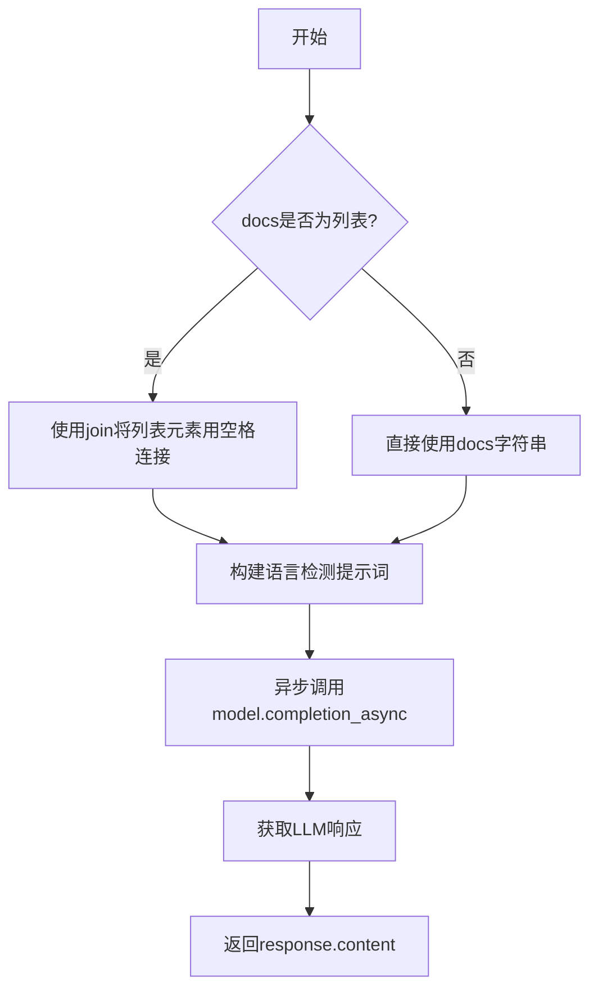
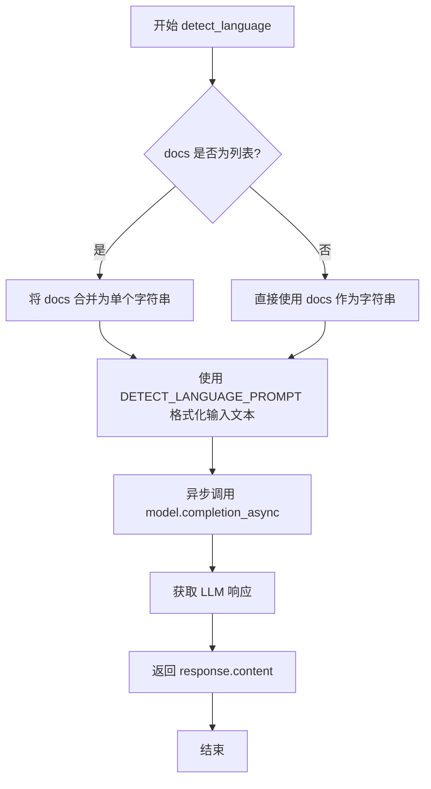

# `graphrag\packages\graphrag\graphrag\prompt_tune\generator\language.py` 详细设计文档

这是一个GraphRAG提示词语言检测模块，通过异步调用LLM模型来识别输入文档的语言类型，并返回检测到的语言字符串

## 整体流程



## 类结构

```
detect_language (模块)
└── detect_language (异步函数)
```

## 全局变量及字段


### `DETECT_LANGUAGE_PROMPT`
    
语言检测提示模板，用于格式化输入文本来检测文档语言

类型：`str | Template`
    


    

## 全局函数及方法


### `detect_language`

检测输入文档的语言，用于GraphRAG提示词的本地化处理。

参数：

- `model`：`LLMCompletion`，用于生成响应的语言模型实例
- `docs`：`str | list[str]`：需要检测语言的文档，可以是单个字符串或字符串列表

返回值：`str`，检测到的语言

#### 流程图



#### 带注释源码

```python
# 异步函数：检测输入文档的语言
async def detect_language(model: "LLMCompletion", docs: str | list[str]) -> str:
    """Detect input language to use for GraphRAG prompts.

    Parameters
    ----------
    - model (LLMCompletion): The LLM to use for generation
    - docs (str | list[str]): The docs to detect language from

    Returns
    -------
    - str: The detected language.
    """
    # 如果 docs 是列表，将其合并为单个字符串；否则直接使用
    docs_str = " ".join(docs) if isinstance(docs, list) else docs
    
    # 使用预定义的语言检测提示词模板格式化输入文本
    language_prompt = DETECT_LANGUAGE_PROMPT.format(input_text=docs_str)

    # 异步调用语言模型的completion方法获取响应
    response: LLMCompletionResponse = await model.completion_async(
        messages=language_prompt
    )  # type: ignore

    # 返回LLM响应中的语言内容
    return response.content
```

## 关键组件


### 异步语言检测函数 (detect_language)

核心功能：接收LLM模型和文档输入，将文档格式化为字符串后结合语言检测提示模板，通过异步调用LLM完成语言检测并返回检测结果。

### DETECT_LANGUAGE_PROMPT 提示模板

从graphrag.prompt_tune.prompt.language模块导入的提示模板，用于构建发送给LLM的语言检测指令，通过.format()方法注入待检测的文本内容。

### LLMCompletion 异步调用

使用model.completion_async()方法异步调用语言模型，传入格式化后的提示消息，获取LLMCompletionResponse响应对象。

### 文档字符串处理逻辑

将输入的docs参数（支持str或list[str]类型）统一转换为字符串格式，如果是列表则用空格连接，便于后续提示模板的格式化处理。

### 响应结果提取

从LLM异步响应中提取content字段作为检测到的语言结果并返回。


## 问题及建议


### 已知问题

-   **类型注解使用字符串形式**：虽然使用了`TYPE_CHECKING`来避免循环导入，但`"LLMCompletion"`和`"LLMCompletionResponse"`作为字符串类型注解可能在运行时导致类型检查问题
-   **缺少错误处理机制**：异步调用`model.completion_async`时没有try-except捕获异常，如果LLM调用失败（如网络错误、服务不可用），异常会直接向上传播
-   **响应内容未验证**：直接返回`response.content`，没有检查其是否为None、空字符串或无效值，可能导致后续处理出错
-   **输入验证缺失**：未对`docs`参数进行有效性检查，如空字符串、None值或列表为空的情况
-   **文档字符串格式不规范**：参数描述使用了Markdown列表格式（短横线），与Python文档字符串规范（Google/NumPy风格）不一致
-   **日志记录缺失**：没有日志打印，不利于问题排查和监控
-   **字符串拼接方式简单**：使用空格简单拼接多个文档字符串，可能不是最佳的语言检测方式，且没有考虑分隔符
-   **重试机制缺失**：对于网络不稳定场景，没有实现重试逻辑

### 优化建议

-   添加try-except块处理可能的异常，并考虑定义自定义异常或使用_result_or_raise模式
-   在返回前验证`response.content`的有效性，如检查非空、去除首尾空格等
-   在函数入口处添加输入验证逻辑，确保`docs`参数有效
-   改进文档字符串格式，使用标准的Google风格或NumPy风格
-   添加日志记录，记录语言检测的输入长度、检测结果等信息
-   考虑使用更健壮的文档字符串拼接方式，或在拼接时添加适当分隔符
-   实现重试机制，使用指数退避策略处理临时性失败
-   考虑添加超时参数，控制LLM调用时间

## 其它


### 设计目标与约束

**设计目标**：为GraphRAG系统提供多语言支持，通过LLM自动检测输入文档的语言，以便选择合适的语言提示词进行处理。

**约束条件**：
- 依赖外部LLM进行语言检测，需保证LLM可用
- 仅支持单轮对话完成语言检测，无复杂状态管理
- 输入文档格式限定为字符串或字符串列表

### 错误处理与异常设计

**异常场景**：
- LLM调用失败（网络超时、服务不可用等）→ 向上抛出异常，由调用方处理
- model参数为None → 抛出ValueError
- docs参数为空 → 返回空字符串或抛出ValueError
- LLM响应为空或格式异常 → 返回空字符串并记录警告日志

**错误传播机制**：采用try-except捕获LLM调用异常，必要时记录日志后重新抛出

### 数据流与状态机

**数据流向**：
1. 输入：docs (str | list[str]) → 2. 合并为单一字符串 → 3. 拼接DETECT_LANGUAGE_PROMPT模板 → 4. 调用model.completion_async → 5. 解析response.content → 6. 输出：language (str)

**状态转换**：无复杂状态机，仅为简单的请求-响应模式

### 外部依赖与接口契约

**外部依赖**：
- `graphrag.prompt_tune.prompt.language.DETECT_LANGUAGE_PROMPT`：语言检测提示词模板
- `graphrag_llm.completion.LLMCompletion`：LLMCompletion接口，需实现completion_async方法
- `graphrag_llm.types.LLMCompletionResponse`：响应类型，需包含content属性

**接口契约**：
- model参数必须实现completion_async方法，接受messages参数并返回LLMCompletionResponse
- response.content必须为字符串类型

### 性能考虑与资源需求

**性能特性**：
- 异步函数设计，支持并发调用
- 单次LLM调用，无批量处理优化

**资源需求**：
- 网络IO：LLM API调用
- 内存：文档字符串拼接处理

### 安全性考虑

**输入验证**：docs参数需进行类型检查，防止注入攻击

**敏感信息**：无敏感数据处理，文档内容直接透传给LLM

### 配置与可扩展性

**可扩展点**：
- 可替换DETECT_LANGUAGE_PROMPT模板实现自定义检测逻辑
- 可通过装饰器模式添加缓存层避免重复检测相同文档
- 可支持自定义语言代码映射表

### 测试策略

**单元测试**：
- 测试字符串和列表两种docs输入格式
- 测试空输入边界条件
- Mock LLM响应进行功能验证

**集成测试**：
- 测试真实LLM调用场景
- 测试多语言检测准确性

### 监控与日志

**日志记录点**：
- LLM调用前后记录调试日志
- 检测失败时记录警告日志并包含文档摘要（截断）

**监控指标**：
- 语言检测成功率
- 检测耗时
- LLM调用错误率

### 版本兼容性

**Python版本**：需支持Python 3.8+（异步语法）

**依赖版本**：
- graphrag_llm相关接口需保持稳定
- TYPE_CHECKING导入确保静态类型检查兼容

    