# `graphrag\packages\graphrag\graphrag\prompt_tune\generator\persona.py` 详细设计文档

这是一个用于GraphRAG提示词微调的人设（Persona）生成模块，通过调用大语言模型生成特定领域和任务的人设描述。

## 整体流程

```mermaid
graph TD
    A[开始: 调用generate_persona] --> B[接收参数: model, domain, task]
B --> C{检查task是否提供}
C -- 否 --> D[使用DEFAULT_TASK]
C -- 是 --> E[使用传入的task]
D --> F[格式化task: task.format(domain=domain)]
E --> F
F --> G[拼接人设提示词: GENERATE_PERSONA_PROMPT.format(sample_task=formatted_task)]
G --> H[调用LLM异步接口: await model.completion_async(messages=persona_prompt)]
H --> I[获取响应: response.content]
I --> J[返回人设字符串: return response.content]
```

## 类结构

```
无类定义（纯函数模块）
└── generate_persona (模块级异步函数)
```

## 全局变量及字段


### `DEFAULT_TASK`
    
从graphrag.prompt_tune.defaults导入的默认任务模板，用于生成人设的默认任务描述

类型：`str`
    


### `GENERATE_PERSONA_PROMPT`
    
从graphrag.prompt_tune.prompt.persona导入的人设生成提示模板，用于格式化生成人设的LLM提示

类型：`str`
    


    

## 全局函数及方法


### `generate_persona`

该异步函数接收LLM模型实例、领域名称和任务参数，格式化任务描述后结合人设提示词模板，异步调用LLM生成并返回人设描述字符串。

参数：

- `model`：`LLMCompletion`，用于生成人设的LLM模型实例
- `domain`：`str`，指定要生成人设的领域
- `task`：`str`，任务描述，默认为 DEFAULT_TASK

返回值：`str`，生成的人设描述文本内容

#### 流程图

```mermaid
flowchart TD
    A[开始 generate_persona] --> B[接收参数: model, domain, task]
    B --> C{格式化任务字符串}
    C --> D[formatted_task = task.format&#40;domain=domain&#41;]
    D --> E[格式化提示词]
    E --> F[persona_prompt = GENERATE_PERSONA_PROMPT.format&#40;sample_task=formatted_task&#41;]
    F --> G[异步调用LLM]
    G --> H[response = await model.completion_async&#40;messages=persona_prompt&#41;]
    H --> I[返回人设内容]
    I --> J[结束]
```



#### 带注释源码

```python
# 异步人设生成模块，用于微调 GraphRAG 提示词
# 引入类型检查，避免运行时循环导入
from typing import TYPE_CHECKING

# 引入默认任务常量
from graphrag.prompt_tune.defaults import DEFAULT_TASK
# 引入人设提示词模板
from graphrag.prompt_tune.prompt.persona import GENERATE_PERSONA_PROMPT

# 仅在类型检查时导入，避免运行时依赖
if TYPE_CHECKING:
    from graphrag_llm.completion import LLMCompletion
    from graphrag_llm.types import LLMCompletionResponse


async def generate_persona(
    model: "LLMCompletion",  # LLM模型实例，用于生成人设
    domain: str,             # 领域名称，如 "医疗"、"金融" 等
    task: str = DEFAULT_TASK # 任务描述，默认为预定义的任务常量
) -> str:
    """生成用于 GraphRAG 提示词的 LLM 人设描述。

    Parameters
    ----------
    - model (LLMCompletion): 用于生成的 LLM 模型
    - domain (str): 要生成人设的领域
    - task (str): 要生成人设的任务，默认为 DEFAULT_TASK
    """
    # 1. 将领域信息格式化到任务字符串中
    formatted_task = task.format(domain=domain)
    
    # 2. 使用格式化后的任务和人设提示词模板生成完整提示词
    persona_prompt = GENERATE_PERSONA_PROMPT.format(sample_task=formatted_task)

    # 3. 异步调用 LLM 模型生成人设内容
    # 注意：使用类型忽略因为 LLMCompletion 类型可能在运行时不可用
    response: "LLMCompletionResponse" = await model.completion_async(
        messages=persona_prompt
    )  # type: ignore

    # 4. 返回 LLM 生成的人设描述文本
    return response.content
```

## 关键组件


### generate_persona

异步函数，负责生成用于 GraphRAG 提示词的大语言模型角色。通过调用 LLM 并传入格式化的人物角色提示词模板，返回生成的角色描述内容。

### LLMCompletion

LLM Completion 接口类型，来自 graphrag_llm 包。用于调用底层大语言模型执行异步补全任务，是生成角色描述的核心依赖。

### GENERATE_PERSONA_PROMPT

人物角色生成的提示词模板，存储在 graphrag.prompt_tune.prompt.persona 模块中。包含用于指导 LLM 生成特定领域角色的指令和格式。

### DEFAULT_TASK

默认任务配置常量，定义在 graphrag.prompt_tune.defaults 模块中。提供任务格式化的基础模板，支持 domain 变量的替换。

### LLMCompletionResponse

LLM 异步调用的响应类型，来自 graphrag_llm.types 模块。包含 LLM 返回的内容，通过 .content 属性提取生成的字符串。


## 问题及建议


### 已知问题

- **类型安全问题**：`model.completion_async` 返回值使用 `# type: ignore` 忽略类型检查，`response.content` 访问前没有空值验证，可能导致运行时 AttributeError
- **缺少错误处理**：没有 try-except 块捕获网络异常、模型调用失败等异常情况，调用方无法获得有意义的错误信息
- **参数验证缺失**：`domain` 和 `task` 参数没有进行有效性校验（如空字符串、None 值检查）
- **日志和监控缺失**：没有任何日志记录，无法追踪 persona 生成过程和调试问题
- **返回值未验证**：直接返回 `response.content`，没有验证返回值是否为空或符合预期格式
- **超时控制缺失**：异步调用没有设置超时时间，可能导致长时间挂起
- **依赖隐式耦合**：`GENERATE_PERSONA_PROMPT` 和 `DEFAULT_TASK` 的导入没有显式声明依赖关系，可测试性差
- **prompt 格式化风险**：`task.format(domain=domain)` 和字符串格式化可能因格式错误导致异常

### 优化建议

- 添加类型注解并移除 `# type: ignore`，或使用 `typing.cast` 明确类型转换
- 添加参数验证（domain 非空、task 有效），使用 Pydantic 或自定义验证逻辑
- 包裹异步调用在 try-except 中，捕获并处理可能的异常，抛出有意义的自定义异常
- 添加日志记录（使用标准 logging 模块），记录关键操作和异常信息
- 在访问 `response.content` 前添加 None 检查，或使用 Optional 类型和空值处理
- 为 `completion_async` 调用添加超时参数（如使用 `asyncio.timeout` 或模型支持的 timeout 参数）
- 将 prompt 模板和默认值配置化，便于测试和修改
- 考虑添加重试机制处理临时性失败
- 返回值添加验证逻辑，确保非空字符串返回

## 其它


### 设计目标与约束

本模块旨在为GraphRAG提示工程提供一个灵活的角色（persona）生成能力，允许根据不同领域和任务动态生成适配的LLM角色描述，以提升提示工程的效果和针对性。设计约束包括：必须使用异步调用以保证性能，依赖外部LLM完成实际生成任务，遵循GraphRAG框架的prompt模板规范。

### 错误处理与异常设计

模块本身未实现显式的错误处理机制，存在以下潜在异常场景需关注：LLM调用超时或失败时会导致异步任务异常终止；LLM返回空响应或无效内容时将直接返回空字符串；domain或task参数为空时可能导致prompt格式化异常。建议调用方在业务层实现重试机制、响应验证逻辑，并设置合理的超时配置。

### 外部依赖与接口契约

核心依赖包括：`graphrag_llm.completion.LLMCompletion` 提供LLM异步调用能力；`graphrag_llm.types.LLMCompletionResponse` 定义LLM响应结构；`graphrag.prompt_tune.defaults.DEFAULT_TASK` 提供默认任务模板；`graphrag.prompt_tune.prompt.persona.GENERATE_PERSONA_PROMPT` 提供角色生成提示模板。接口契约要求model参数必须实现`completion_async`方法并返回包含`content`属性的响应对象。

### 数据流与状态机

数据流路径为：输入参数（model/domain/task） → 格式化任务描述（task.format） → 格式化提示模板（GENERATE_PERSONA_PROMPT.format） → LLM异步调用（model.completion_async） → 提取响应内容（response.content） → 返回角色字符串。状态机较为简单，包含"初始化→格式化→调用→响应→返回"五个基本状态，无复杂状态分支。

### 配置与参数说明

generate_persona函数接收三个参数：model（必填，LLMCompletion类型）指定用于生成的LLM实例；domain（必填，str类型）指定目标领域如"医疗"、"金融"等；task（可选，str类型，默认值为DEFAULT_TASK）指定任务描述模板。返回值统一为str类型，表示生成的角色描述文本。

### 使用示例

```python
# 基本调用示例
persona = await generate_persona(
    model=llm_instance,
    domain="学术研究"
)

# 指定自定义任务
persona = await generate_persona(
    model=llm_instance,
    domain="客户服务",
    task="请为{domain}领域生成一个专业的AI助手角色描述"
)
```

### 性能考虑与优化空间

当前实现为串行调用，如需批量生成多个角色建议引入并发控制（如asyncio.Semaphore）限制并发数；GENERATE_PERSONA_PROMPT模板可考虑缓存避免重复格式化；建议添加响应缓存机制防止相同domain/task重复调用LLM。

### 安全性考量

用户输入的domain和task参数应进行输入验证和清洗，防止prompt注入风险；LLM返回的内容未经安全过滤直接返回，建议调用方实施内容安全审核；敏感领域使用时需考虑数据隐私保护。

### 测试策略建议

建议补充以下测试用例：单元测试验证格式化逻辑正确性；集成测试验证LLM调用链路；mock测试验证异常场景处理；边界测试验证空值/特殊字符输入处理。

### 版本兼容性说明

当前版本依赖graphrag_llm包，接口稳定性取决于上游LLM实现的变化；GENERATE_PERSONA_PROMPT模板格式可能随GraphRAG框架版本演进而变化，建议锁定依赖版本或提供模板自定义能力。


    