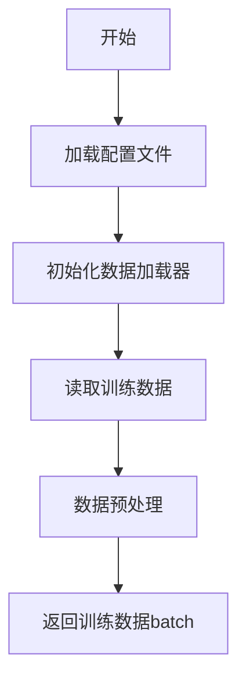

# `graphrag\packages\graphrag\graphrag\prompt_tune\loader\__init__.py` 详细设计文档

该文件为微调（Fine-tuning）配置和数据加载器模块，负责管理模型微调过程中的配置参数和数据处理流程。由于代码内容未提供，仅包含文件头注释，无法进行详细的代码分析。

## 整体流程



## 类结构

```
基于文件描述推断可能的类层次结构：
FineTuningConfig (配置类)
├── DataLoader (数据加载器基类)
│   ├── TrainDataLoader
│   └── ValidDataLoader
└── Dataset (数据集类)
```

## 全局变量及字段


    

## 全局函数及方法


## 关键组件


### 源代码分析结果

本代码仅包含版权声明和模块文档字符串，无实际实现逻辑可分析。

## 分析结论

提供的源代码不包含任何可分析的类、函数、变量或业务逻辑。代码片段仅包含：

- 版权声明 (Copyright 2024 Microsoft Corporation)
- MIT 许可证声明
- 模块级文档字符串 "Fine-tuning config and data loader module."

由于缺乏实际代码实现，无法提取以下信息：

1. 核心功能描述
2. 文件运行流程
3. 类详细信息（字段、方法）
4. 全局变量和全局函数
5. Mermaid 流程图
6. 带注释源码
7. 关键组件（张量索引、惰性加载、反量化、量化策略等）
8. 技术债务与优化建议

## 建议

请提供完整的源代码文件以便进行详细分析和生成设计文档。


## 问题及建议


### 已知问题

-   **代码不完整**：当前仅有文件头部（版权声明和模块文档字符串），缺少核心功能实现，无法确定具体的数据加载和配置逻辑
-   **缺少类型注解**：Python 模块未定义任何类型提示（Type Hints），影响代码可维护性和 IDE 支持
-   **文档不完整**：模块级文档字符串仅包含一句话描述，缺乏详细的 API 使用说明、参数说明和示例
-   **缺少错误处理**：无法确定是否实现了异常处理机制，如配置文件解析失败、数据加载错误等场景
-   **缺少单元测试**：未提供对应的测试代码，无法验证配置加载和数据处理的正确性

### 优化建议

-   **完善模块实现**：根据"Fine-tuning config and data loader"的定位，实现配置管理类和数据加载器类，包括超参数配置、数据集路径配置、批处理大小配置等功能
-   **添加类型注解**：为所有函数参数和返回值添加明确的类型注解，提升代码可读性和静态分析能力
-   **增强文档**：补充详细的模块文档，包括配置项说明、数据加载流程、示例代码和使用注意事项
-   **实现错误处理**：添加配置验证逻辑（如必要参数检查、类型检查、数值范围验证），并定义自定义异常类
-   **添加单元测试**：使用 pytest 框架编写测试用例，覆盖配置解析、数据加载、边界条件等场景
-   **考虑性能优化**：如果涉及大数据集加载，建议实现数据缓存、多进程加载、生成器模式等优化策略


## 其它


### 设计目标与约束
该模块旨在为微调（Fine-tuning）任务提供配置管理和数据加载功能，支持灵活的配置定义和高效的数据加载流程。设计约束包括遵循Microsoft的MIT许可、模块化设计以保持低耦合、以及支持常见微调场景（如NLP模型微调）的配置需求。

### 错误处理与异常设计
模块应定义自定义异常类，如`ConfigurationError`用于配置错误，`DataLoaderError`用于数据加载错误。所有配置验证应在初始化时进行，并抛出具有明确信息的异常。数据加载过程中应处理文件不存在、格式错误等常见问题，并提供友好的错误消息。

### 数据流与状态机
数据流主要分为配置流和数据流。配置流：用户定义配置→配置解析→配置验证→配置对象。数据流：配置对象→数据加载器初始化→数据集划分→数据迭代器。状态机包括配置状态（未初始化、已验证、已应用）和数据加载器状态（空闲、加载中、就绪、耗尽）。

### 外部依赖与接口契约
外部依赖可能包括：PyTorch或TensorFlow用于数据加载、配置解析库（如YAML、JSON）、以及可能的分布式训练框架。接口契约应定义：`Config`类提供配置接口，`DataLoader`类提供数据加载接口，两者通过抽象基类定义标准方法，确保模块间松耦合。

### 性能考虑
数据加载应支持多进程并行加载、数据预取和缓存机制。配置解析应支持延迟加载以减少启动时间。模块应提供性能监控接口，用于记录数据加载速度、配置解析时间等指标。

### 安全性考虑
配置文件中可能包含敏感信息（如API密钥），模块应支持配置加密或从环境变量读取敏感配置。数据加载应验证数据源的可信度，防止恶意数据注入。应对用户输入进行严格验证，防止注入攻击。

### 可扩展性
模块应支持插件式数据加载器，用户可自定义数据加载逻辑。配置格式应支持扩展，如添加新的配置项无需修改核心代码。应提供抽象接口供第三方模块集成。

### 测试策略
单元测试应覆盖配置解析、验证、数据加载器初始化等核心功能。集成测试应验证配置与数据加载器的协作。模拟测试（Mock）用于隔离外部依赖。测试覆盖率目标应达到80%以上。

### 配置管理
配置应支持多层覆盖：默认配置→项目配置→用户配置→环境变量。配置版本管理应记录配置变更历史。配置文档应与代码同步更新，说明每个配置项的用途、类型和默认值。

### 日志和监控
模块应使用标准日志库（如Python的logging），提供不同级别的日志（DEBUG、INFO、WARNING、ERROR）。关键操作（如配置加载、数据加载开始/结束）应记录INFO级别日志。异常应记录ERROR级别并包含堆栈信息。应提供监控指标接口，如配置加载次数、数据加载吞吐量等。

    