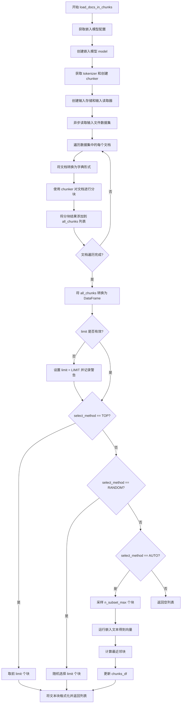

# `graphrag\packages\graphrag\graphrag\prompt_tune\loader\input.py` 详细设计文档

这是一个文档输入加载模块，用于将原始文档加载并分块，以便为提示词生成提供文本内容。该模块支持多种文档选择方法（TOP、RANDOM、AUTO），其中AUTO方法使用文本嵌入进行语义相似度采样，并处理LaTeX格式的特殊字符转义。

## 整体流程

```mermaid
graph TD
    A[开始 load_docs_in_chunks] --> B[获取嵌入模型配置]
    B --> C[创建嵌入模型、分块器和存储]
    C --> D[读取输入文件数据集]
    D --> E{遍历文档}
    E -->|每个文档| F[将文档转为字典并分块]
    F --> G[将所有分块添加到列表]
    E --> H[转换为DataFrame]
    H --> I{检查limit范围}
    I -->|无效| J[使用默认LIMIT]
    I -->|有效| K{选择方法}
    K -->|TOP| L[取前limit条]
    K -->|RANDOM| M[随机采样limit条]
    K -->|AUTO| N[采样n_subset_max条]
    N --> O[运行嵌入文本]
    O --> P[计算嵌入中心点]
    P --> Q[计算距离并选取最近k个]
    L --> R[转义{和}字符]
    M --> R
    Q --> R
    R --> S[返回字符串列表]
```

## 类结构

```
无显式类定义
该文件为模块级实现
主要包含全局函数
```

## 全局变量及字段


### `text_chunks`
    
包含文本块的数据框，列名为'text'，用于存储待处理的文本片段

类型：`pd.DataFrame`
    


### `embeddings`
    
文本的密集嵌入向量数组，通过嵌入模型将文本转换为数值向量表示

类型：`np.ndarray`
    


### `k`
    
采样邻居数量参数，用于AUTO选择模式中选取最接近中心点的k个文本块

类型：`int`
    


### `limit`
    
限制返回的文档块数量，用于控制生成提示词时使用的文档块数量上限

类型：`int`
    


### `n_subset_max`
    
最大子集数量，用于AUTO模式中随机采样进行嵌入计算的最大文本块数

类型：`int`
    


### `all_chunks`
    
存储所有读取文档的文本块列表，通过分块器将每个文档分割成多个文本块

类型：`list[str]`
    


### `chunks_df`
    
临时数据框，用于存储和管理经过筛选处理后的文本块数据

类型：`pd.DataFrame`
    


### `sampled_text_chunks`
    
随机采样的文本块列表，用于AUTO模式中进行嵌入计算的代表性子集

类型：`list`
    


### `embedding_results`
    
嵌入操作的结果对象，包含文本的嵌入向量数组和其他嵌入相关数据

类型：`object`
    


    

## 全局函数及方法


### `_sample_chunks_from_embeddings`

该函数通过计算嵌入向量的中心点，然后找出距离中心点最近的 k 个文本块，实现基于嵌入空间的采样功能。

参数：

- `text_chunks`：`pd.DataFrame`，包含文本块的数据框
- `embeddings`：`np.ndarray[Any, np.dtype[np.float64]]`，文本块对应的嵌入向量数组
- `k`：`int`，采样数量，默认为 K

返回值：`pd.DataFrame`，返回距离中心点最近的 k 个文本块组成的数据框

#### 流程图

```mermaid
flowchart TD
    A[开始] --> B[计算嵌入向量的中心点<br/>center = np.meanembeddings, axis=0]
    B --> C[计算每个嵌入到中心的欧氏距离<br/>distances = np.linalg.normembeddings - center, axis=1]
    C --> D[对距离进行升序排序并取前k个索引<br/>nearest_indices = np.argsortdistances[:k]]
    D --> E[根据索引提取文本块<br/>return text_chunks.iloc[nearest_indices]]
    E --> F[结束]
```

#### 带注释源码

```python
def _sample_chunks_from_embeddings(
    text_chunks: pd.DataFrame,
    embeddings: np.ndarray[Any, np.dtype[np.float64]],
    k: int = K,
) -> pd.DataFrame:
    """Sample text chunks from embeddings."""
    # 计算所有嵌入向量的中心点（均值）
    center = np.mean(embeddings, axis=0)
    
    # 计算每个嵌入向量到中心点的欧氏距离
    distances = np.linalg.norm(embeddings - center, axis=1)
    
    # 对距离进行升序排序，取前k个最近邻的索引
    nearest_indices = np.argsort(distances)[:k]

    # 根据索引从文本块数据框中提取对应的文本块并返回
    return text_chunks.iloc[nearest_indices]
```


### `load_docs_in_chunks`

该函数是图谱RAG系统的文档加载核心模块，负责将输入文档分块处理，并根据指定的文档选择方法（TOP、RANDOM或AUTO）从分块后的文档中选取合适的子集，最终返回用于生成提示的文本块列表。

参数：

- `config`：`GraphRagConfig`，图谱RAG系统的配置对象，包含嵌入模型、分块、输入等配置信息
- `select_method`：`DocSelectionType`，文档选择方法，枚举类型，可选值为TOP、RANDOM、AUTO
- `limit`：`int`，要选择的文档块数量限制
- `logger`：`logging.Logger`，日志记录器，用于输出警告和信息
- `n_subset_max`：`int`，默认为`N_SUBSET_MAX`，在AUTO模式下用于采样的最大子集数量
- `k`：`int`，默认为`K`，在AUTO模式下用于选择最近邻块的数量

返回值：`list[str]`，返回处理后的文本块列表，每个元素是一个字符串类型的文本块

#### 流程图



#### 带注释源码

```python
async def load_docs_in_chunks(
    config: GraphRagConfig,
    select_method: DocSelectionType,
    limit: int,
    logger: logging.Logger,
    n_subset_max: int = N_SUBSET_MAX,
    k: int = K,
) -> list[str]:
    """Load docs into chunks for generating prompts.
    
    该函数是图谱RAG系统的核心文档加载模块，主要完成以下任务：
    1. 初始化嵌入模型、tokenizer和chunker
    2. 读取输入文件并对每个文档进行分块
    3. 根据select_method选择合适的文档块子集
    4. 返回格式化后的文本块列表
    
    Args:
        config: GraphRagConfig对象，包含系统所有配置
        select_method: DocSelectionType枚举，指定选择方法
        limit: int，要选择的块数量
        logger: logging.Logger，用于记录警告信息
        n_subset_max: int，AUTO模式下采样块的最大数量
        k: int，AUTO模式下选择最近邻块的数量
    
    Returns:
        list[str]: 处理并格式化后的文本块列表
    """
    # 获取嵌入模型的配置信息
    embeddings_llm_settings = config.get_embedding_model_config(
        config.embed_text.embedding_model_id
    )
    # 创建嵌入模型实例
    model = create_embedding(embeddings_llm_settings)
    # 获取模型的tokenizer用于编解码
    tokenizer = model.tokenizer
    # 根据配置创建文档分块器，使用tokenizer的encode和decode方法
    chunker = create_chunker(config.chunking, tokenizer.encode, tokenizer.decode)
    
    # 创建输入存储和输入读取器
    input_storage = create_storage(config.input_storage)
    input_reader = create_input_reader(config.input, input_storage)
    # 异步读取所有输入文件
    dataset = await input_reader.read_files()

    # 存储所有分块后的文档文本
    all_chunks: list[str] = []
    # 遍历数据集中的每个文档
    for doc in dataset:
        # 将文档对象转换为字典形式
        doc_dict = dataclasses.asdict(doc)
        # 使用chunker对文档进行分块处理
        chunks = chunk_document(doc_dict, chunker)
        # 将分块结果添加到总列表中
        all_chunks.extend(chunks)

    # 将所有文本块转换为DataFrame便于处理
    chunks_df = pd.DataFrame({"text": all_chunks})

    # 验证limit参数的有效性
    if limit <= 0 or limit > len(chunks_df):
        # 如果limit无效，使用默认的LIMIT值并记录警告
        logger.warning(f"Limit out of range, using default number of chunks: {LIMIT}")
        limit = LIMIT

    # 根据选择方法处理文档块
    if select_method == DocSelectionType.TOP:
        # TOP方法：取前limit个块（按顺序）
        chunks_df = chunks_df[:limit]
    elif select_method == DocSelectionType.RANDOM:
        # RANDOM方法：随机选择limit个块
        chunks_df = chunks_df.sample(n=limit)
    elif select_method == DocSelectionType.AUTO:
        # AUTO方法：基于嵌入向量的语义相似度选择块
        if k is None or k <= 0:
            msg = "k must be an integer > 0"
            raise ValueError(msg)

        # 从所有块中采样子集用于生成嵌入向量
        sampled_text_chunks = chunks_df.sample(n=min(n_subset_max, len(chunks_df)))[
            "text"
        ].tolist()

        # 运行嵌入文本操作获取向量表示
        embedding_results = await run_embed_text(
            sampled_text_chunks,
            callbacks=NoopWorkflowCallbacks(),
            model=model,
            tokenizer=tokenizer,
            batch_size=config.embed_text.batch_size,
            batch_max_tokens=config.embed_text.batch_max_tokens,
            num_threads=config.concurrent_requests,
        )
        # 将嵌入结果转换为numpy数组
        embeddings = np.array(embedding_results.embeddings)
        # 使用嵌入向量计算最近邻块
        chunks_df = _sample_chunks_from_embeddings(chunks_df, embeddings, k=k)

    # 将选中的块转换为列表形式，并对花括号进行转义以防止字符串格式化问题
    return [
        # 需要对花括号进行转义，以防止在解析LaTeX或markdown文件时破坏str.format()函数
        i.replace("{", "{{").replace("}", "}}")
        for i in chunks_df["text"]
    ]
```

## 关键组件


该代码是一个文档加载与分块模块，核心功能是异步加载输入文档，使用分块器将文档切分为文本块，并根据指定的选择方法（TOP、RANDOM、AUTO）从所有文本块中选取指定数量的块返回给下游prompt生成流程。对于AUTO模式，代码通过将文本块转换为embedding向量，计算各文本块到中心点的距离，选取距离最近的k个块作为最终结果。

### 运行流程

1. **初始化阶段**：从配置中获取embedding模型配置、创建embedding模型、tokenizer、分块器、存储和输入读取器
2. **文档加载阶段**：使用input_reader异步读取所有输入文件
3. **分块阶段**：遍历每个文档，使用chunker对文档进行分块，收集所有文本块到列表
4. **选择阶段**：
   - 若选择方法为TOP：直接取前limit个块
   - 若选择方法为RANDOM：随机采样limit个块
   - 若选择方法为AUTO：先采样n_subset_max个块，调用run_embed_text生成embedding，计算到中心点的距离，选取距离最近的k个块
5. **后处理阶段**：对文本块进行LaTeX格式保护处理（替换大括号）
6. **返回结果**：返回文本块列表

### 函数详情

#### _sample_chunks_from_embeddings

| 属性 | 值 |
|------|-----|
| 名称 | _sample_chunks_from_embeddings |
| 参数 | text_chunks: pd.DataFrame, embeddings: np.ndarray[Any, np.dtype[np.float64]], k: int = K |
| 参数描述 | text_chunks为包含text列的DataFrame；embeddings为文本块对应的embedding向量矩阵；k为要选取的块数量 |
| 返回值类型 | pd.DataFrame |
| 返回值描述 | 选取的k个最近文本块 |

```mermaid
flow TD
    A[输入text_chunks和embeddings] --> B[计算embeddings的中心点center]
    B --> C[计算每个embedding到center的欧氏距离]
    C --> D[argsort距离数组, 取前k个索引]
    D --> E[返回text_chunksiloc前k个]
```

```python
def _sample_chunks_from_embeddings(
    text_chunks: pd.DataFrame,
    embeddings: np.ndarray[Any, np.dtype[np.float64]],
    k: int = K,
) -> pd.DataFrame:
    """Sample text chunks from embeddings."""
    # 计算embedding矩阵的中心向量
    center = np.mean(embeddings, axis=0)
    # 计算每个embedding到中心的L2距离
    distances = np.linalg.norm(embeddings - center, axis=1)
    # 选取距离最小的k个索引
    nearest_indices = np.argsort(distances)[:k]

    return text_chunks.iloc[nearest_indices]
```

#### load_docs_in_chunks

| 属性 | 值 |
|------|-----|
| 名称 | load_docs_in_chunks |
| 参数 | config: GraphRagConfig, select_method: DocSelectionType, limit: int, logger: logging.Logger, n_subset_max: int = N_SUBSET_MAX, k: int = K |
| 参数描述 | config为GraphRAG配置对象；select_method为文档选择方法枚举；limit为返回的块数量；logger为日志记录器；n_subset_max为AUTO模式下采样生成embedding的最大块数；k为AUTO模式下选取的最近块数量 |
| 返回值类型 | list[str] |
| 返回值描述 | 处理后的文本块列表 |

```mermaid
flow TD
    A[load_docs_in_chunks开始] --> B[创建embedding模型和tokenizer]
    B --> C[创建chunker]
    C --> D[创建input_storage和input_reader]
    D --> E[read_files读取所有文档]
    E --> F[遍历文档分块]
    F --> G{select_method类型}
    G -->|TOP| H[取前limit个块]
    G -->|RANDOM| I[随机采样limit个块]
    G -->|AUTO| J[采样n_subset_max个块]
    J --> K[run_embed_text生成embeddings]
    K --> L[_sample_chunks_from_embeddings选取最近k个]
    H --> M[LaTeX格式保护替换]
    I --> M
    L --> M
    M --> N[返回文本块列表]
```

```python
async def load_docs_in_chunks(
    config: GraphRagConfig,
    select_method: DocSelectionType,
    limit: int,
    logger: logging.Logger,
    n_subset_max: int = N_SUBSET_MAX,
    k: int = K,
) -> list[str]:
    """Load docs into chunks for generating prompts."""
    # 从配置获取embedding模型设置并创建模型
    embeddings_llm_settings = config.get_embedding_model_config(
        config.embed_text.embedding_model_id
    )
    model = create_embedding(embeddings_llm_settings)
    tokenizer = model.tokenizer
    # 使用tokenizer的encode/decode创建分块器
    chunker = create_chunker(config.chunking, tokenizer.encode, tokenizer.decode)
    # 创建存储和输入读取器
    input_storage = create_storage(config.input_storage)
    input_reader = create_input_reader(config.input, input_storage)
    # 异步读取所有输入文件
    dataset = await input_reader.read_files()

    all_chunks: list[str] = []
    # 遍历每个文档进行分块
    for doc in dataset:
        doc_dict = dataclasses.asdict(doc)
        chunks = chunk_document(doc_dict, chunker)
        all_chunks.extend(chunks)

    chunks_df = pd.DataFrame({"text": all_chunks})

    # 检查limit有效性
    if limit <= 0 or limit > len(chunks_df):
        logger.warning(f"Limit out of range, using default number of chunks: {LIMIT}")
        limit = LIMIT

    # 根据选择方法处理数据
    if select_method == DocSelectionType.TOP:
        chunks_df = chunks_df[:limit]
    elif select_method == DocSelectionType.RANDOM:
        chunks_df = chunks_df.sample(n=limit)
    elif select_method == DocSelectionType.AUTO:
        if k is None or k <= 0:
            msg = "k must be an integer > 0"
            raise ValueError(msg)

        # AUTO模式：基于embedding的智能选取
        sampled_text_chunks = chunks_df.sample(n=min(n_subset_max, len(chunks_df)))[
            "text"
        ].tolist()

        # 运行embedding生成
        embedding_results = await run_embed_text(
            sampled_text_chunks,
            callbacks=NoopWorkflowCallbacks(),
            model=model,
            tokenizer=tokenizer,
            batch_size=config.embed_text.batch_size,
            batch_max_tokens=config.embed_text.batch_max_tokens,
            num_threads=config.concurrent_requests,
        )
        embeddings = np.array(embedding_results.embeddings)
        # 基于embedding距离选取最近块
        chunks_df = _sample_chunks_from_embeddings(chunks_df, embeddings, k=k)

    # LaTeX格式保护：防止str.format解析时出错
    return [
        i.replace("{", "{{").replace("}", "}}")
        for i in chunks_df["text"]
    ]
```

### 关键组件

#### embedding-based selection

基于embedding向量距离的文档块选择机制，通过计算文本块embedding到中心点的距离来选取最具代表性的块

#### document chunking pipeline

文档分块处理流水线，包括输入读取、文档到字典转换、分块处理、结果收集的完整流程

#### DocSelectionType selection strategy

三种文档选择策略（TOP/RANDOM/AUTO）的实现，支持不同的采样需求

#### LaTeX format protection

LaTeX格式保护机制，通过双重大括号替换防止markdown中的LaTeX表达式被format函数错误解析

### 技术债务与优化空间

1. **重复embedding计算**：AUTO模式下，如果采样数量接近总块数，可能存在重复计算问题，可考虑缓存或增量计算
2. **内存占用**：将所有文档分块后转为DataFrame，对于大规模文档可能导致内存压力，可考虑流式处理
3. **缺乏错误边界**：input_reader.read_files()和chunk_document()的错误未捕获，可能导致整个流程失败
4. **配置硬编码**：LIMIT和N_SUBSET_MAX等常量虽然可配置，但缺乏运行时验证

### 其它项目

#### 设计目标

为prompt tuning模块提供经过智能选取的文本块输入，支持多种选取策略以适应不同场景

#### 约束

- limit必须在有效范围内，否则降级为默认LIMIT值
- AUTO模式下k必须大于0
- 依赖graphrag系统的embedding模型、分块器、存储等组件

#### 错误处理

- limit超出范围时记录warning并使用默认值
- k无效时抛出ValueError
- 依赖组件（create_embedding、create_chunker等）的错误会直接传播

#### 外部依赖

- graphrag_chunking.chunker_factory: create_chunker
- graphrag_input: create_input_reader
- graphrag_llm.embedding: create_embedding
- graphrag_storage: create_storage
- graphrag.index.operations.embed_text.run_embed_text: run_embed_text


## 问题及建议


### 已知问题

- **异常处理不完整**：`create_embedding`、`create_chunker`、`create_storage`、`create_input_reader` 等工厂函数可能返回 `None` 或抛出异常，但代码中没有适当的错误处理和空值检查。`input_reader.read_files()` 也可能失败，同样缺少异常处理。
- **采样逻辑缺陷**：在 `DocSelectionType.RANDOM` 分支中，`chunks_df.sample(n=limit)` 当 `limit` 大于 `DataFrame` 长度时会抛出 `ValueError`，代码未处理此边界情况。
- **类型注解兼容性**：`np.ndarray[Any, np.dtype[np.float64]]` 这种写法在某些 numpy 版本中可能不兼容，应该使用 `np.ndarray[np.float64, ...]` 或 `np.ndarray[Any, np.dtype["float64"]]`。
- **内存效率问题**：所有文档块都存储在内存的 `all_chunks` 列表中，对于大型文档集可能导致内存溢出问题。
- **重复计算**：每次调用 `load_docs_in_chunks` 都会创建新的 embedding model、chunker 等实例，没有实现缓存机制，造成资源浪费。
- **逻辑顺序问题**：`limit` 的范围检查在各种选择方法处理之后进行，但实际上应该在采样之前提前验证，避免无效计算。

### 优化建议

- 添加完整的异常处理逻辑，包括工厂函数返回值检查、`read_files()` 的错误处理、以及采样时的边界条件检查。
- 修复类型注解以确保 numpy 版本兼容性，使用 `np.typing.NDArray[np.float64]` 或简化为 `np.ndarray` 配合运行时类型检查。
- 考虑使用生成器模式或流式处理来替代一次性加载所有文档块到内存，提高大规模数据的处理能力。
- 引入缓存机制或依赖注入模式复用 model、chunker 等 expensive 对象。
- 在函数入口处提前验证 `limit` 参数的有效性，并统一错误处理方式。
- 添加详细的日志记录，便于排查问题和监控运行状态。

## 其它


### 设计目标与约束

本模块的核心目标是将输入文档加载并分块，为后续的提示调优（prompt tuning）生成合适的文档片段。主要约束包括：1）支持三种文档选择策略（TOP、RANDOM、AUTO），其中AUTO策略依赖文本嵌入进行智能采样；2）分块大小和采样数量受配置文件中的`LIMIT`、`N_SUBSET_MAX`、`K`等参数控制；3）需要异步处理以支持大规模文档集；4）必须处理LaTeX格式以防止字符串格式化冲突。

### 错误处理与异常设计

代码中存在以下错误处理机制：1）当`limit`参数超出范围时，记录警告日志并使用默认值`LIMIT`；2）当`k`参数无效（None或<=0）时，抛出`ValueError`异常；3）数据转换过程中使用`dataclasses.asdict()`处理文档对象；4）对于AUTO选择方法，调用`run_embed_text`时传入`NoopWorkflowCallbacks()`作为回调。当前潜在改进空间：缺少对`embeddings`为空数组的检查，以及对`input_reader.read_files()`可能返回空数据集的处理。

### 数据流与状态机

数据流遵循以下路径：1）初始化阶段：创建嵌入模型、分块器、存储适配器和输入读取器；2）读取阶段：通过`input_reader.read_files()`异步读取所有文档；3）分块阶段：遍历文档并使用`chunk_document`将每个文档转换为文本块；4）选择阶段：根据`select_method`应用不同策略（AUTO策略额外执行嵌入计算）；5）后处理阶段：对选中的文本进行花括号转义以防止LaTeX解析问题。状态转换主要体现在`chunks_df` DataFrame的筛选和更新过程中。

### 外部依赖与接口契约

本模块依赖以下外部组件：1）**graphrag_chunking.chunker_factory**：通过`create_chunker`创建分块器；2）**graphrag_input**：通过`create_input_reader`创建输入读取器；3）**graphrag_llm.embedding**：通过`create_embedding`创建嵌入模型；4）**graphrag_storage**：通过`create_storage`创建存储适配器；5）**graphrag.index.operations.embed_text.run_embed_text**：执行文本嵌入计算。接口契约方面：`load_docs_in_chunks`接受`GraphRagConfig`、`DocSelectionType`、`limit`、`logger`和可选的`n_subset_max`、`k`参数，返回`list[str]`；`_sample_chunks_from_embeddings`接受`DataFrame`、嵌入数组和`k`值，返回采样后的`DataFrame`。

### 性能考量

1）AUTO策略中嵌入计算是性能瓶颈，仅对`min(n_subset_max, len(chunks_df))`个样本进行嵌入；2）使用`np.linalg.norm`和`np.argsort`进行最近邻计算，时间复杂度为O(n)；3）所有I/O操作均为异步以提高吞吐量；4）`chunks_df.sample`在数据量较大时可能产生内存压力，可考虑分批处理。当前优化空间：可添加嵌入结果缓存机制、支持批量采样、考虑使用Faiss等向量索引加速最近邻搜索。

### 安全性与边界条件

1）字符串替换`replace("{", "{{").replace("}", "}}")`用于防止LaTeX解析，但可能影响实际包含花括号的文本内容；2）`k`值过大会导致采样数量超过可用块数量，此时`np.argsort`会自动处理索引越界；3）当`embeddings`为空数组时，`np.mean`会返回NaN，可能导致后续计算异常；4）`tokenizer.encode/decode`假设始终可用，未做空值检查。建议添加：输入验证层、更详细的边界条件检查、采样不足时的fallback策略。

    