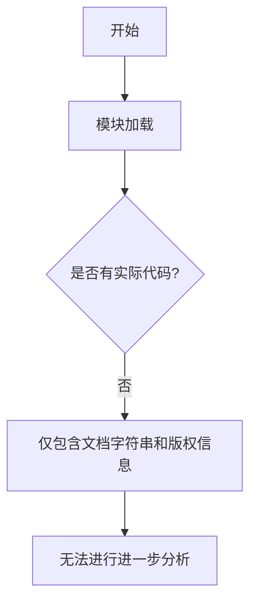

# `graphrag\packages\graphrag\graphrag\prompt_tune\prompt\__init__.py` 详细设计文档

该代码文件仅包含版权声明和模块级文档字符串，无实际实现代码。根据文件头注释推测，这可能是一个与 Persona（角色）、entity type（实体类型）、relationships（关系）和 domain generation（领域生成）相关的提示词（prompts）模块，但具体功能无法从现有代码中确定。

## 整体流程



## 类结构

```
该文件无类结构
```

## 全局变量及字段


    

## 全局函数及方法


## 关键组件


### 概述

该代码为一个模块的头文件，仅包含版权声明和模块文档字符串，没有实际的功能实现代码。

### 文件运行流程

由于该文件仅包含模块文档字符串和版权声明，不包含任何可执行代码，因此不存在实际的运行流程。

### 类详细信息

由于该文件不包含任何类定义，无法提供类的详细信息。

### 全局变量和全局函数

由于该文件不包含任何全局变量或全局函数定义，无法提供详细信息。

### 关键组件信息

由于提供的源代码仅包含版权信息和模块文档字符串，未包含任何实现代码，因此无法识别张量索引、惰性加载、反量化支持或量化策略等关键组件。

### 潜在技术债务或优化空间

由于没有实际代码实现，无法评估技术债务或优化空间。

### 其它项目

由于代码量不足，无法提供设计目标、错误处理、数据流、外部依赖等其他项目的详细信息。


## 问题及建议


### 已知问题

- **功能实现缺失**：模块文档字符串声明了功能范围（Persona、entity type、relationships 和 domain generation prompts），但实际代码块为空，未实现任何 prompt 生成逻辑或相关功能
- **文档不完整**：仅有模块级文档字符串，缺少详细的功能说明、API 接口定义、参数说明和返回值说明
- **接口契约缺失**：未定义任何全局函数或类来提供 prompt 生成的公共接口
- **测试覆盖缺失**：未提供任何测试文件或测试用例，无法验证功能的正确性和稳定性
- **可维护性问题**：prompt 内容通常需要根据业务需求调整，当前结构未考虑配置的灵活性

### 优化建议

- **补充核心实现代码**：实现 prompt 生成器类或函数，包含 Persona 定义、entity type 模板、relationship 模板和 domain 生成逻辑
- **完善文档字符串**：为模块添加详细的文档说明，包括功能概述、使用示例、支持的类型和约束条件
- **定义清晰的 API 接口**：提供全局函数（如 `get_persona_prompt()`、`get_entity_type_prompt()`、`get_relationship_prompt()` 等），明确参数类型和返回值
- **添加单元测试**：创建测试文件验证各类 prompt 的生成逻辑和输出格式
- **考虑配置化设计**：将 prompt 模板外置到配置文件或数据库，提升可维护性和灵活性


## 其它


### 1. 一段话描述

该模块是微软GraphRAG项目的一部分，作为Persona（角色）、实体类型、关系和领域生成提示词的占位模块。根据文件开头的描述信息，该模块旨在定义和生成与实体识别、关系提取和领域知识图谱构建相关的提示词模板，为后续的图谱生成流程提供必要的prompt支持。

### 2. 文件的整体运行流程

由于当前代码文件中仅包含版权声明和模块文档字符串，没有实际的实现代码，因此该模块目前处于占位符状态。按照设计意图，该模块将在GraphRAG框架中作为提示词模板库被调用，其预期运行流程如下：

1. 模块初始化时加载预定义的提示词模板
2. 外部模块（如图谱生成器）根据需求调用相应的提示词生成函数
3. 函数返回格式化后的提示词字符串，供下游的LLM调用使用
4. LLM根据提示词生成相应的实体、关系或领域信息

### 3. 类的详细信息

当前文件中未定义任何类。根据模块名称"Persona, entity type, relationships and domain generation prompts module"推断，该模块应该包含以下可能的类结构设计：

#### 3.1 建议的PromptTemplate类（当前未实现）

**类字段：**

| 名称 | 类型 | 描述 |
|------|------|------|
| template_id | str | 提示词模板的唯一标识符 |
| template_content | str | 提示词模板的实际内容 |
| parameters | List[str] | 模板中需要替换的参数列表 |
| description | str | 模板用途的描述信息 |

**类方法：**

| 方法名称 | 参数 | 参数类型 | 参数描述 | 返回值类型 | 返回值描述 |
|----------|------|----------|----------|------------|------------|
| __init__ | template_id, content, params, desc | str, str, List[str], str | 初始化提示词模板对象 | None | 初始化对象自身 |
| render | variables | Dict[str, Any] | 根据提供的变量渲染模板 | str | 返回渲染后的提示词字符串 |
| validate | None | - | 验证模板参数完整性 | bool | 返回验证结果 |

### 4. 全局变量和全局函数信息

#### 4.1 全局变量

当前文件中未定义任何全局变量。建议的全局变量包括：

| 名称 | 类型 | 描述 |
|------|------|------|
| PERSONA_PROMPTS | Dict[str, str] | 角色定义相关的提示词字典 |
| ENTITY_TYPE_PROMPTS | Dict[str, str] | 实体类型识别相关的提示词字典 |
| RELATIONSHIP_PROMPTS | Dict[str, str] | 关系提取相关的提示词字典 |
| DOMAIN_GENERATION_PROMPTS | Dict[str, str] | 领域生成相关的提示词字典 |

#### 4.2 全局函数

当前文件中未定义任何全局函数。建议的全局函数包括：

| 函数名称 | 参数名称 | 参数类型 | 参数描述 | 返回值类型 | 返回值描述 |
|----------|----------|----------|----------|------------|------------|
| get_persona_prompt | persona_type | str | 获取指定类型的角色提示词 | str | 返回角色提示词模板字符串 |
| get_entity_type_prompt | entity_category | str | 获取实体类型识别提示词 | str | 返回实体类型提示词模板 |
| get_relationship_prompt | relationship_type | str | 获取关系提取提示词 | str | 返回关系提示词模板 |
| get_domain_prompt | domain_name | str | 获取领域生成提示词 | str | 返回领域提示词模板 |
| render_prompt | template, variables | str, Dict | 渲染提示词模板 | str | 返回渲染后的完整提示词 |

### 5. 关键组件信息

根据模块名称和版权信息，以下是关键组件的推测：

| 组件名称 | 一句话描述 |
|----------|------------|
| Persona Prompts | 定义不同角色（如分析师、研究员等）的系统提示词和行为规范 |
| Entity Type Prompts | 用于指导LLM识别和分类文本中实体的提示词模板 |
| Relationship Prompts | 用于指导LLM从文本中提取实体间关系的提示词模板 |
| Domain Generation Prompts | 用于生成特定领域知识图谱的提示词模板 |

### 6. 潜在的技术债务或优化空间

1. **模块完整性缺失**：当前模块仅为占位符，缺少实际的功能实现，需要完成所有提示词模板的定义

2. **可扩展性设计不足**：建议增加动态提示词生成机制，支持用户自定义模板变量和模板继承

3. **国际化支持缺失**：提示词目前仅支持英文，对于多语言场景需要添加国际化支持

4. **版本管理缺失**：提示词模板缺少版本控制机制，无法追踪模板的历史变更

5. **单元测试缺失**：由于没有实现代码，相应的单元测试也需要补充

### 7. 其它项目

#### 7.1 设计目标与约束

- **设计目标**：为GraphRAG提供模块化、可配置的提示词管理机制，支持灵活的提示词模板定义和动态渲染
- **约束条件**：必须保持与MIT License的兼容性，代码需遵循微软开源项目的编码规范

#### 7.2 错误处理与异常设计

- 当请求的提示词模板不存在时，应抛出自定义异常`PromptNotFoundError`
- 当模板参数验证失败时，应抛出`TemplateValidationError`
- 建议实现错误码和错误消息的标准化管理

#### 7.3 数据流与状态机

- **数据输入**：外部模块传入模板名称和变量字典
- **数据处理**：根据模板ID查找对应模板，进行变量替换和验证
- **数据输出**：返回渲染后的提示词字符串
- **状态机**：IDLE → LOADING_TEMPLATE → VALIDATING → RENDERING → COMPLETED 或 ERROR

#### 7.4 外部依赖与接口契约

- **外部依赖**：无明确外部依赖，建议使用Python标准库中的string.Template或引入jinja2作为模板引擎
- **接口契约**：提供统一的`get_prompt(template_name, **kwargs)`接口，返回格式化后的提示词字符串
- **配置管理**：建议支持从外部配置文件（如YAML或JSON）加载提示词模板

#### 7.5 配置与扩展性设计

- 支持从环境变量或配置文件读取默认的提示词路径
- 提供插件机制允许第三方扩展新的提示词类型
- 支持提示词的运行时热更新，无需重启应用

#### 7.6 性能考量

- 对于高频调用的场景，建议实现模板缓存机制
- 考虑使用LRU缓存存储已渲染的提示词结果
- 避免在渲染过程中进行耗时的字符串拼接操作

    