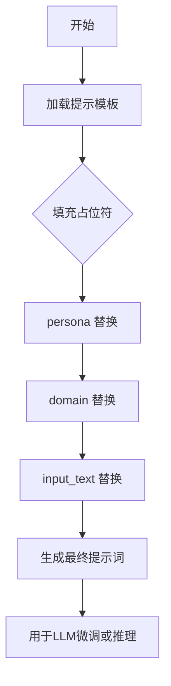

# `graphrag\packages\graphrag\graphrag\prompt_tune\prompt\community_reporter_role.py` 详细设计文档

该文件定义了一个用于生成社区记者角色的微调提示模板，包含 persona、domain 和 input_text 三个占位符，用于大型语言模型的提示工程。

## 整体流程



## 类结构

```
无类结构（纯模块级变量）
```

## 全局变量及字段


### `GENERATE_COMMUNITY_REPORTER_ROLE_PROMPT`
    
用于生成社区 reporter 角色定义的提示模板，包含 persona、domain 和 input_text 占位符

类型：`str`
    


    

## 全局函数及方法


## 关键组件


### GENERATE_COMMUNITY_REPORTER_ROLE_PROMPT

全局提示模板常量，用于生成社区 reporter 角色定义。该模板接受三个输入变量（persona、domain、input_text），通过占位符替换机制动态生成具体的角色定义任务。

### 输入变量

- persona: 角色人设定义
- domain: 领域上下文
- input_text: 待分析的文本内容

### 模板结构

- 示例部分：提供输出格式参考
- 指令部分：指导模型生成符合示例结构的角色定义

### 潜在技术债务

- 模板硬编码，缺乏动态配置能力
- 无输入验证机制
- 缺少多语言支持


## 问题及建议


### 已知问题

- **缺乏输入验证**：模板使用字符串占位符但没有验证所需的键是否会被提供，占位符未被替换时会产生尴尬的输出
- **硬编码示例**：示例内容直接嵌入在提示模板中，降低了模板的可重用性
- **无类型注解**：常量缺乏类型注解，影响代码可读性和IDE支持
- **魔法字符串**：占位符名称（如{persona}、{domain}、{input_text}）未定义为常量，难以维护
- **职责混杂**：提示模板混合了多个关注点（角色设定、领域信息、示例文本），违反单一职责原则
- **文档缺失**：缺少模块级或常量级的文档字符串
- **不完整的输出结构**：模板末尾的"Role:"似乎期望LLM自动补全，输出格式不够明确
- **本地化支持缺失**：未设计多语言支持机制

### 优化建议

- 添加类型注解，如 `GENERATE_COMMUNITY_REPORTER_ROLE_PROMPT: str = ...`
- 将占位符定义为具名常量，便于维护和IDE自动补全
- 将示例内容参数化，提取为独立变量或配置
- 添加文档字符串说明模板用途和参数要求
- 考虑使用字符串模板库（如string.Template）或f-string重构，提高可读性
- 添加输入验证函数，确保所有占位符都被正确替换
- 明确定义输出格式规范，例如返回JSON结构或使用明确的分隔符
- 考虑将提示模板与业务逻辑分离，移到独立的配置文件或资源文件
</think>

## 其它


### 设计目标与约束

该模块的设计目标是为社区Reporter角色生成提供标准化的提示模板，支持动态填充人物设定(persona)、领域(domain)和输入文本(input_text)三个参数，输出符合示例结构的角色定义。约束包括：模板字符串必须保持占位符{persona}、{domain}、{input_text}的完整性；输出格式需与示例保持一致；不支持除这三个参数外的动态内容注入。

### 错误处理与异常设计

该模块为纯数据定义模块，不涉及运行时错误处理。若调用方在填充模板时缺少必要参数，会导致KeyError异常，这属于调用方的责任。模块本身不提供默认值或异常捕获机制，建议调用方在使用前进行参数完整性校验。

### 外部依赖与接口契约

该模块无外部依赖，仅使用Python内置的字符串格式化功能。接口契约方面：调用方需传入包含{persona}、{domain}、{input_text}三个键的字典或使用str.format()方法传递对应参数，返回值为格式化后的字符串。模块不限制具体的填充方式，但必须保证输出保持示例中的结构完整性。

### 安全考虑

该模块本身不涉及敏感数据处理，但模板内容可能根据输入产生不同输出。建议调用方对input_text参数进行输入验证，防止恶意构造的输入导致提示注入或不当内容生成。由于模板最终可能用于与语言模型交互，需确保上游调用链中的内容过滤机制。

### 测试策略

建议为该模块编写以下测试用例：模板占位符完整性校验测试、格式化输出结构验证测试、边界情况测试（空字符串参数、超长输入）。由于模块功能简单，主要测试应聚焦于参数填充后的输出格式是否符合预期结构。

### 版本兼容性

该代码使用Python 3的基本字符串格式化功能（str.format()），兼容Python 3.6+版本。无特殊版本依赖，建议在项目CI/CD流程中设置Python 3.6+的测试矩阵以确保兼容性。

### 使用示例

```python
# 基本用法
persona = "You are a tech journalist"
domain = "Artificial Intelligence"
input_text = "The new GPT-4 model shows remarkable capabilities..."

formatted_prompt = GENERATE_COMMUNITY_REPORTER_ROLE_PROMPT.format(
    persona=persona,
    domain=domain,
    input_text=input_text
)

# 使用f-string（Python 3.6+）
formatted_prompt = f"{GENERATE_COMMUNITY_REPORTER_ROLE_PROMPT.replace('{persona}', persona).replace('{domain}', domain).replace('{input_text}', input_text)}"
```

### 配置管理

该模块不含动态配置，所有模板内容在模块加载时定义。若需要支持运行时调整提示内容，建议将模板迁移至独立配置文件（如JSON或YAML），通过配置加载模块读取。


    