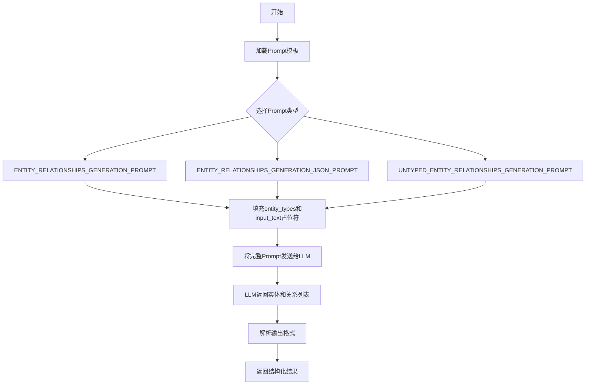

# `graphrag\packages\graphrag\graphrag\prompt_tune\prompt\entity_relationship.py` 详细设计文档

该文件定义了用于实体关系抽取的大语言模型提示模板，包含三种不同格式的prompt：自定义分隔符格式、JSON格式以及无类型实体格式，用于指导模型从文本中识别实体及其相互关系。

## 整体流程



## 类结构

```

```

## 全局变量及字段


### `ENTITY_RELATIONSHIPS_GENERATION_PROMPT`
    
用于从文本中提取实体和关系的提示模板，输出格式使用自定义分隔符（<|>）和##列表分隔符

类型：`str`
    


### `ENTITY_RELATIONSHIPS_GENERATION_JSON_PROMPT`
    
用于从文本中提取实体和关系的提示模板，输出格式为JSON数组，包含实体和关系对象

类型：`str`
    


### `UNTYPED_ENTITY_RELATIONSHIPS_GENERATION_PROMPT`
    
用于从文本中提取实体和关系的提示模板，无需预定义实体类型，输出格式使用自定义分隔符

类型：`str`
    


    

## 全局函数及方法


## 关键组件


### ENTITY_RELATIONSHIPS_GENERATION_PROMPT

主Prompt模板，使用自定义分隔符格式（"##"）输出实体和关系，支持实体类型限制、多语言输出和关系强度评分

### ENTITY_RELATIONSHIPS_GENERATION_JSON_PROMPT

JSON格式输出的Prompt模板，将实体和关系以JSON数组形式返回，便于程序化解析处理

### UNTYPED_ENTITY_RELATIONSHIPS_GENERATION_PROMPT

无类型实体关系抽取Prompt，实体类型由模型自动推断生成，而非预定义类型列表

### 自定义分隔符格式

实体格式：("entity"\|<entity_name>\|<entity_type>\|<entity_description>)，关系格式：("relationship"\|<source_entity>\|<target_entity>\|<relationship_description>\|<relationship_strength>)

### 多语言支持机制

通过{language}占位符支持目标语言指定，仅翻译描述内容，保持结构不变

### 实体类型注入

通过{entity_types}占位符动态注入允许的实体类型列表，限制抽取范围

### 关系强度评分

关系包含1-10的强度评分，量化实体间关系的紧密程度

### 三阶段处理流程

Step 1识别实体，Step 2抽取关系对，Step 3格式化输出并标记完成（<|COMPLETE|>）


## 问题及建议


### 已知问题

- **大量重复代码**：三个提示模板（ENTITY_RELATIONSHIPS_GENERATION_PROMPT、ENTITY_RELATIONSHIPS_GENERATION_JSON_PROMPT、UNTYPED_ENTITY_RELATIONSHIPS_GENERATION_PROMPT）之间存在大量重复的示例、说明和指令，仅输出格式不同，导致维护成本高且容易出现不一致。
- **缺少文档注释**：变量命名虽然具有描述性，但缺乏模块级或文件级的文档注释来说明这些提示模板的用途、使用场景和预期输出。
- **硬编码的占位符**：使用`{entity_types}`、`{input_text}`、`{language}`占位符，但没有提供模板化的工具函数或类来安全地进行字符串替换，可能导致格式化错误。
- **格式不一致**：
  - JSON版本的提示使用双大括号`{{` `}}`进行转义（Python字符串格式化语法），而其他版本使用单大括号
  - JSON版本没有`<|COMPLETE|>`结束标记，与其他版本不一致
  - 分隔符使用不一致（`##` vs JSON数组）
- **示例数据重复**：三个相同的示例（Example 1-3）在每个提示模板中重复出现三次，增加文件体积且维护困难。
- **缺少输入验证**：模板直接使用占位符，没有对`entity_types`、`input_text`、`language`等参数进行类型检查或有效性验证。
- **实体类型未约束**：`{entity_types}`占位符的使用方式不明确，示例中是列表形式`[ORGANIZATION,PERSON]`，实际使用时应如何传入不清晰。
- **Magic Strings**：分隔符`##`、结束标记`<|COMPLETE|>`、实体/关系标记`("entity"<|>`等以魔法字符串形式硬编码，分散在模板各处。

### 优化建议

- **提取公共模板**：将示例、通用指令、多语言说明等公共部分提取为独立模块或使用模板继承机制，减少重复。
- **创建模板工具类**：实现一个PromptTemplate类或函数，提供类型安全的参数替换、验证和渲染功能。
- **统一格式规范**：标准化分隔符、结束标记和输出格式，或通过配置管理不同输出格式的变体。
- **添加文档注释**：为文件添加模块级docstring，说明每个提示模板的用途、输入参数和预期输出格式。
- **集中管理常量**：将分隔符、标记符号等魔法字符串提取为常量，提高可维护性和可搜索性。
- **增加单元测试**：验证不同输入组合下模板渲染的正确性，确保占位符替换无误。
- **添加类型注解**：为所有全局变量添加类型注解，如`ENTITY_RELATIONSHIPS_GENERATION_PROMPT: str = ...`。
- **考虑国际化框架**：对于多语言支持（`{language}`），可考虑使用gettext或i18n框架而非字符串替换。

## 其它


### 设计目标与约束

本模块的核心设计目标是为实体关系抽取任务提供三种不同格式的提示模板，支持结构化输出（自定义分隔符格式、JSON格式）和非结构化输出（未指定实体类型）。约束条件包括：提示模板仅作为静态字符串提供，不包含运行时逻辑；模板变量`{entity_types}`、`{input_text}`、`{language}`需由调用方在运行时填充；所有提示模板均包含示例用于few-shot learning。

### 错误处理与异常设计

本模块作为纯数据模块（仅包含字符串常量），不涉及运行时错误处理。调用方需确保：1）传入的`entity_types`参数与提示中的占位符`{entity_types}`正确替换；2）`input_text`不为空且符合示例中的文本格式；3）`language`参数为有效的语言代码。若替换模板变量时出现格式错误（如缺少占位符），调用方应捕获并报告TemplateVariableMissingError或类似异常。

### 数据流与状态机

数据流为单向流动：调用方（外部系统）→ 填充模板变量 → 传递至LLM API → 接收结构化输出。无状态机设计，因为本模块仅存储静态提示模板，不维护任何运行时状态。

### 外部依赖与接口契约

本模块无外部Python依赖，仅依赖Python标准库字符串操作。接口契约：导出三个全局字符串变量`ENTITY_RELATIONSHIPS_GENERATION_PROMPT`、`ENTITY_RELATIONSHIPS_GENERATION_JSON_PROMPT`、`UNTYPED_ENTITY_RELATIONSHIPS_GENERATION_PROMPT`，调用方需自行实现模板变量替换逻辑（如使用Python的str.format()或string.Template）。

### 输出格式规范

本模块定义了三种输出格式规范：
1. **自定义分隔符格式**：实体使用`("entity"<|><name><|><type><|><description>)`，关系使用`("relationship"<|><source><|><target><|><description><|><strength>)`，使用`##`作为列表分隔符，以`<|COMPLETE|>`结束
2. **JSON格式**：实体为`{"name":..., "type":..., "description":...}`，关系为`{"source":..., "target":..., "relationship":..., "relationship_strength":...}`，返回JSON数组
3. **未指定类型格式**：与自定义分隔符格式类似，但实体类型由模型自由推断，使用`##`作为分隔符

### 模板变量说明

| 变量名称 | 位置 | 预期类型 | 说明 |
|---------|------|---------|------|
| `{entity_types}` | ENTITY_RELATIONSHIPS_GENERATION_PROMPT, ENTITY_RELATIONSHIPS_GENERATION_JSON_PROMPT | 字符串（逗号分隔的实体类型列表） | 指定要提取的实体类型，如"ORGANIZATION,PERSON,GEO" |
| `{input_text}` | 所有三个提示 | 字符串 | 待分析的原始文本内容 |
| `{language}` | ENTITY_RELATIONSHIPS_GENERATION_PROMPT, ENTITY_RELATIONSHIPS_GENERATION_JSON_PROMPT, UNTYPED_ENTITY_RELATIONSHIPS_GENERATION_PROMPT | 字符串（如"en", "zh"） | 指定输出语言，提示要求仅翻译描述部分 |

### 示例数据参考

模块内置三个完整示例（Example 1-3），涵盖：金融领域（中央银行政策）、商业领域（IPO和公司收购）、地缘政治领域（人质交换），用于指导LLM理解输出格式和实体关系类型。调用方可通过观察示例学习如何设计有效的few-shot提示。

### 潜在技术债务与优化空间

1. **硬编码示例**：示例数据直接嵌入提示字符串中，若需更新示例需修改源码，可考虑外部化示例配置
2. **重复结构**：三种提示存在大量重复的指令文本，可考虑提取公共部分为基类模板
3. **缺乏验证**：模块不验证模板变量是否被正确替换，可添加简单的占位符检查函数
4. **国际化局限**：仅支持单一语言参数，未考虑多语言并行输出的场景

### 使用注意事项

1. 本模块不执行任何LLM调用，仅提供提示模板
2. 提示中的`relationship_strength`评分标准为主观判断（1-10分），不同模型可能产生不一致的评分
3. JSON格式提示中的示例使用了双花括号`{{}}`来转义JSON中的大括号，这是Python字符串格式化所需的
4. 在使用`UNTYPED_ENTITY_RELATIONSHIPS_GENERATION_PROMPT`时，实体类型由模型自由推断，可能导致类型不一致


    