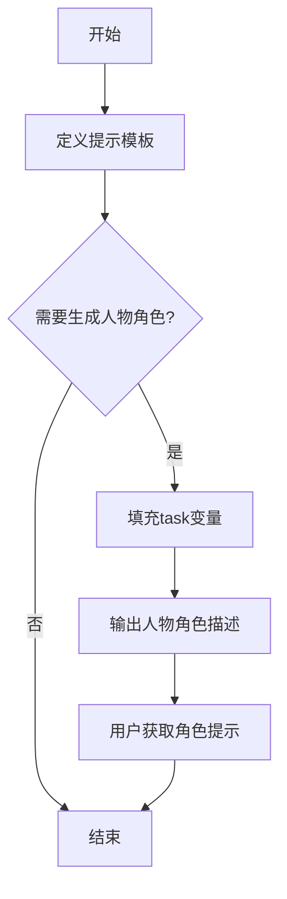

# `graphrag\packages\graphrag\graphrag\prompt_tune\prompt\persona.py` 详细设计文档

该文件定义了一个用于人物角色生成的微调提示模板，通过填充任务描述来生成3到4句的人物角色描述，帮助用户创建能够解决特定问题的专家角色。

## 整体流程



## 类结构

```
该文件为纯配置模块，无类层次结构
└── 全局常量: GENERATE_PERSONA_PROMPT
```

## 全局变量及字段


### `GENERATE_PERSONA_PROMPT`
    
用于生成角色描述的提示模板，包含任务描述和角色设定的占位符。

类型：`str`
    


    

## 全局函数及方法


## 关键组件


### 代码核心功能概述

该代码定义了一个用于微调（fine-tuning）的人物角色生成提示模板，通过模板化方式帮助生成3-4句话的专家角色描述，用于辅助用户分析文本信息中的特定任务。

### 文件整体运行流程

该文件为配置型代码，不涉及运行时执行流程。在实际使用时，模板字符串会被外部系统加载，替换 `{sample_task}` 占位符后发送给语言模型，模型根据提示生成相应的人物角色描述。

### 全局变量详细信息

| 名称 | 类型 | 描述 |
|------|------|------|
| GENERATE_PERSONA_PROMPT | str | 用于fine-tuning的人物角色生成提示模板，包含任务描述占位符和输出格式指引 |

### 全局函数详细信息

该文件不包含任何函数。

### 类详细信息

该文件不包含任何类。

### 关键组件信息

#### 提示模板结构

包含三个主要部分：任务说明（task）、角色定义（You are an expert...）、输出格式指引（persona description:）

#### 占位符系统

支持动态注入 `{sample_task}` 参数，实现提示模板的个性化定制

#### 角色描述生成规则

定义了3-4句话的角色描述长度约束，明确了角色应具备的三个维度：专业领域（role）、相关技能（skills）、具体任务协助能力（specific task）

### 潜在技术债务或优化空间

1. **硬编码问题**：提示模板完全硬编码在代码中，缺乏配置化管理和多版本支持
2. **国际化限制**：模板语言固定为英文，无法直接支持多语言场景
3. **缺少验证机制**：没有对输入参数 `sample_task` 的格式、长度、合法性进行校验
4. **可扩展性不足**：角色描述长度固定为3-4句，缺乏灵活性配置
5. **版本管理缺失**：没有版本号或变更记录，难以追踪模板迭代历史

### 其它项目

#### 设计目标与约束

- 目标：为人形角色生成任务提供标准化的fine-tuning提示模板
- 约束：输出格式需遵循"expert + skilled at + adept at"三段式结构

#### 错误处理与异常设计

- 当前无错误处理机制
- 建议：添加占位符未填充时的默认值或异常抛出逻辑

#### 数据流与状态机

- 静态配置数据，无运行时状态变化
- 数据流向：模板定义 → 外部调用方填充 → 传递给语言模型

#### 外部依赖与接口契约

- 无外部依赖
- 接口契约：调用方需提供 `sample_task` 字符串参数，模板返回格式化后的完整提示


## 问题及建议


### 已知问题

-   **硬编码提示模板** - 提示内容直接作为字符串常量存储在代码中，导致维护性差，修改提示内容需要修改源代码
-   **缺少模块文档字符串** - 模块没有 `__doc__` 或文档注释来说明其用途
-   **缺乏输入验证** - 未对 `sample_task` 参数进行空值、类型或长度验证
-   **字符串格式化方式不明确** - 使用 `{sample_task}` 占位符但未指定具体的格式化方法（format/f-string），可能引起混淆
-   **magic number 硬编码** - "3 to 4 sentence" 作为业务规则硬编码在提示文本中，修改需改代码
-   **缺乏错误处理机制** - 当传入特殊字符或空字符串时可能导致生成的提示不符合预期
-   **国际化支持缺失** - 提示文本为英文硬编码，无法支持多语言场景

### 优化建议

-   **提取配置或外部文件** - 将提示模板移至配置文件（如 JSON/YAML）或数据库，提高可维护性
-   **添加模块级文档字符串** - 编写清晰的模块说明，包括用途、使用方式等
-   **封装为函数并添加验证** - 创建函数包装，提供输入验证和默认值处理
-   **使用显式格式化方法** - 推荐使用 `str.format()` 或 f-string，明确格式化逻辑
-   **配置化管理规则** - 将 "3 to 4 sentence" 等业务规则提取为配置参数
-   **添加异常处理** - 针对边界情况和异常输入进行处理
-   **考虑国际化框架** - 如项目需要多语言支持，使用 i18n 框架管理提示文本
-   **添加单元测试** - 为格式化后的结果编写测试用例，确保输出符合预期格式


## 其它


### 设计目标与约束

**设计目标**：为生成任务专家角色描述提供标准化的提示模板，确保生成的角色描述符合3-4句话的长度要求，并保持一致的格式。

**设计约束**：
- 遵循MIT开源许可证
- 仅包含静态配置数据，无运行时逻辑
- 模板格式固定，使用双花括号`{{}}`表示变量占位符

### 错误处理与异常设计

- 本模块为纯配置模块，不涉及运行时错误处理
- 使用方需确保传入的`sample_task`参数非空且为字符串类型
- 模板变量占位符`{sample_task}`和`{{role}}`、`{{relevant skills}}`、`{{specific task}}`需由调用方正确替换

### 外部依赖与接口契约

**接口契约**：
- 模块导出单个常量：`GENERATE_PERSONA_PROMPT`
- 类型：`str`（字符串）
- 调用方需使用Python的字符串格式化方法（`str.format()`或f-string）替换占位符

**外部依赖**：
- 无外部依赖，仅使用Python标准库

### 安全性考虑

- 本模块不涉及敏感数据处理
- 模板内容为通用提示词，不包含任何机密信息
- 调用方需对用户输入进行适当验证和清理，防止提示注入攻击

### 配置管理

- 配置项：`GENERATE_PERSONA_PROMPT`
- 管理方式：硬编码在代码中的静态常量
- 修改方式：直接编辑源代码中的模板字符串

### 版本兼容性

- Python版本要求：无特定版本限制，兼容Python 3.x
- 许可证：MIT License（2024 Microsoft Corporation）

### 测试策略

- 单元测试：验证字符串模板格式正确性
- 集成测试：验证模板与下游LLM调用流程的兼容性
- 测试重点：占位符替换功能、输出格式验证

### 国际化与本地化

- 当前仅支持英文模板
- 如需支持多语言，需创建对应语言的模板文件或使用国际化框架

### 性能考虑

- 静态常量，加载无性能开销
- 无缓存需求


    