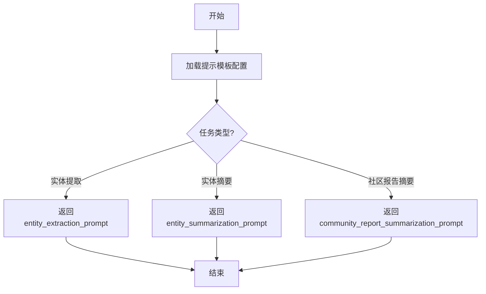

# `graphrag\packages\graphrag\graphrag\prompt_tune\template\__init__.py` 详细设计文档

该文件包含用于实体提取、实体摘要和社区报告摘要的微调提示模板（Fine-tuning prompts），主要用于大型语言模型的微调训练。

## 整体流程



## 类结构

```
无类层次结构（纯配置文件）
```

## 全局变量及字段


    

## 全局函数及方法


## 关键组件


## 代码概述

该模块为实体提取、实体摘要和社区报告摘要任务提供微调提示词，包含了用于指导语言模型执行特定领域信息抽取和生成任务的提示模板。

## 文件整体运行流程

该代码文件为纯配置性质，不包含可执行逻辑，仅作为提示词模板的声明性定义存在，供其他模块导入使用。

## 类详细信息

该代码中未定义任何类。

## 全局变量和全局函数

该代码中未定义任何全局变量或全局函数。

## 关键组件信息

### Module: fine_tuning_prompts

该模块作为提示词配置容器，定义了实体提取、实体摘要和社区报告摘要三个核心任务的提示模板，为下游微调任务提供统一的提示规范。

## 潜在的技术债务或优化空间

1. 当前仅包含声明性文档，缺少实际的提示词模板实现内容
2. 未提供版本管理机制，难以追踪提示词的变更历史
3. 缺少提示词的单元测试或验证机制

## 其它项目

### 设计目标与约束

- 设计目标：为实体提取、实体摘要和社区报告摘要提供标准化的微调提示词模板
- 约束：需遵循MIT许可证条款

### 错误处理与异常设计

由于该文件为纯声明性配置，不涉及运行时错误处理逻辑

### 数据流与状态机

不适用

### 外部依赖与接口契约

- 无外部依赖
- 提供模块级docstring作为接口契约


## 问题及建议


### 已知问题

- 该文件仅包含版权声明和模块文档字符串，缺乏实际的代码实现内容
- 缺少具体的功能实现，无法验证其描述的功能是否完整
- 没有定义任何函数、类或变量来支撑文档中提到的"entity extraction, entity summarization, and community report summarization"功能

### 优化建议

- 实现fine-tuning prompts的具体代码逻辑，包括实体提取、实体摘要和社区报告摘要的提示词模板
- 添加类型注解和详细的文档注释以提高代码可维护性
- 考虑将提示词模板组织为结构化的配置或独立的JSON/YAML文件，便于维护和扩展
- 增加单元测试以验证提示词生成逻辑的正确性
- 如有外部依赖，添加版本约束和依赖说明文档


## 其它


### 设计目标与约束

该模块旨在为实体提取、实体摘要和社区报告摘要提供微调提示。设计目标包括：1）提供标准化且高质量的提示模板，用于训练语言模型完成特定领域任务；2）模块化设计以便于维护和扩展；3）确保提示的通用性和可重用性。约束条件包括：依赖特定的AI模型架构（如GPT系列），提示内容需符合模型输入长度限制，且需考虑版权和许可问题。

### 错误处理与异常设计

由于该模块主要提供静态字符串资源，运行时错误较少。但需处理以下异常情况：1）提示模板缺失或为空；2）编码问题导致的字符串解析错误；3）外部调用时传入参数格式不符。建议在模块入口添加数据校验，抛出自定义异常如`PromptNotFoundError`或`InvalidPromptFormatError`，并记录详细日志。

### 数据流与状态机

该模块为数据源模块，不涉及复杂状态机。数据流如下：调用方导入模块 → 通过API获取对应提示模板 → 将提示与输入数据组合 → 送入模型推理。提示模板按功能分为三类：实体提取提示（用于识别文本中的关键实体）、实体摘要提示（用于生成实体的简洁描述）、社区报告摘要提示（用于整合社区信息生成报告）。

### 外部依赖与接口契约

该模块无外部运行时依赖，仅需Python标准库。接口契约包括：1）模块导出公开函数如`get_entity_extraction_prompt()`、`get_entity_summarization_prompt()`、`get_community_report_prompt()`；2）函数接受可选参数（如上下文变量）并返回格式化字符串；3）返回类型均为`str`，若提示不存在则抛出异常而非返回空值。

### 配置与参数说明

模块本身无需运行时配置，但提示模板内部可能包含占位符。占位符规范：使用双花括号`{{placeholder}}`表示必需参数，单花括号`{optional_placeholder}`表示可选参数。建议提供辅助函数`format_prompt(template, **kwargs)`用于填充占位符，并验证必需参数是否完整。

### 性能考虑

由于仅提供字符串资源，性能开销极低。关键点：1）避免在模块加载时执行复杂计算；2）提示模板应缓存以避免重复处理；3）若提示需动态生成，应使用懒加载模式。建议使用`functools.lru_cache`装饰器缓存格式化后的提示。

### 安全性与隐私

提示模板本身不包含敏感信息，但需注意：1）确保模块文件权限正确，防止未授权修改；2）若提示从外部配置读取，需进行输入验证防止注入攻击；3）遵守MIT许可证要求，保留版权声明。建议添加安全审计检查。

### 测试策略

测试重点包括：1）单元测试验证各提示函数返回非空字符串；2）集成测试验证提示与模拟模型输入的兼容性；3）占位符填充测试，确保必需参数缺失时正确抛出异常；4）边界情况测试，如超长输入、特殊字符处理。建议使用pytest框架，覆盖率目标90%以上。

### 版本兼容性

该模块面向Python 3.8+版本，确保兼容不同操作系统。API版本管理：采用语义化版本（SemVer），主版本号变更时可能破坏向后兼容。建议在模块`__init__.py`中定义`__version__`变量，并在文档中明确版本历史。

### 使用示例

提供典型用例代码：```python\nfrom prompts import get_entity_extraction_prompt\n\n# 获取实体提取提示\nprompt = get_entity_extraction_prompt()\nformatted = prompt.format(text=\"Your input text here\")\n# 使用formatted提示调用语言模型\n```建议在文档中分别展示三种提示的用法，并说明如何结合下游任务使用。

    