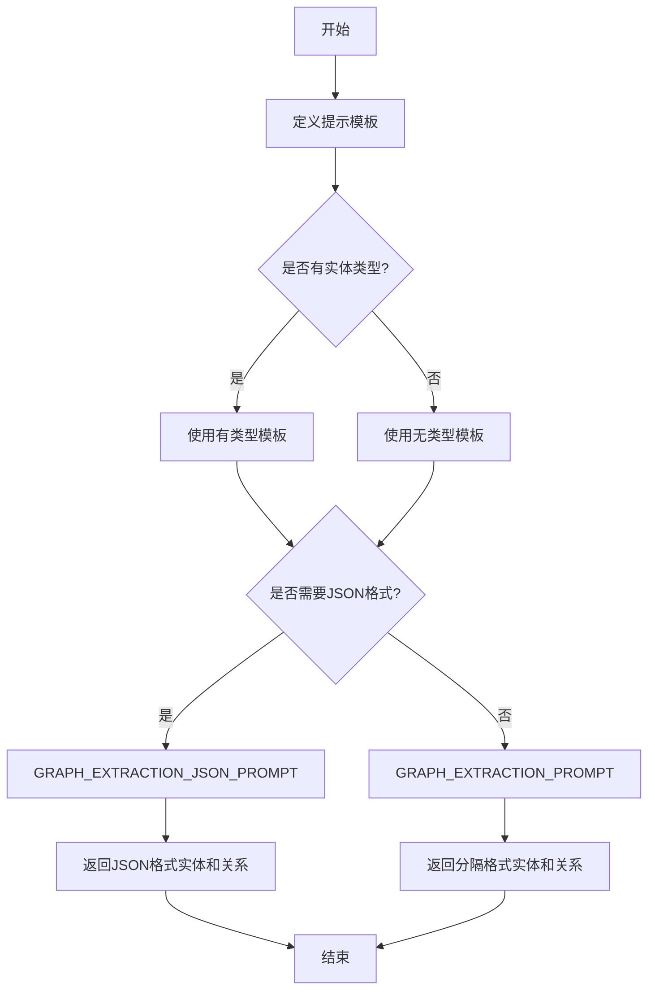

# `graphrag\packages\graphrag\graphrag\prompt_tune\template\extract_graph.py` 详细设计文档

该文件定义了用于实体和关系提取的微调提示模板，支持有类型和无类型的实体识别，以及纯文本和JSON格式的输出，用于指导大语言模型从文本中提取实体及其关系。

## 整体流程



## 类结构

```
无类层次结构 (纯常量定义模块)
```

## 全局变量及字段


### `GRAPH_EXTRACTION_PROMPT`
    
A prompt template for extracting typed entities and their relationships from text using a custom delimiter format with placeholders for entity types, language, examples, and input text.

类型：`str`
    


### `GRAPH_EXTRACTION_JSON_PROMPT`
    
A prompt template for extracting typed entities and their relationships from text in structured JSON format, with placeholders for entity types, language, examples, and input text.

类型：`str`
    


### `EXAMPLE_EXTRACTION_TEMPLATE`
    
A template string for formatting typed entity extraction examples in prompts, containing placeholders for example number, entity types, input text, and expected output.

类型：`str`
    


### `UNTYPED_EXAMPLE_EXTRACTION_TEMPLATE`
    
A template string for formatting untyped entity extraction examples in prompts without predefined entity types, containing placeholders for example number, input text, and expected output.

类型：`str`
    


### `UNTYPED_GRAPH_EXTRACTION_PROMPT`
    
A prompt template for extracting untyped entities with auto-detected categories and their relationships from text using a custom delimiter format.

类型：`str`
    


    

## 全局函数及方法


## 关键组件


### GRAPH_EXTRACTION_PROMPT

主要的实体和关系图谱提取提示模板，使用自定义分隔格式（|符号）输出实体和关系信息，支持多语言输出，包含示例填充、实体类型定义和文本输入占位符。

### GRAPH_EXTRACTION_JSON_PROMPT

JSON格式的实体和关系图谱提取提示模板，以结构化JSON形式输出实体和关系，便于程序解析处理，包含与主提示模板相同的功能但采用不同输出格式。

### EXAMPLE_EXTRACTION_TEMPLATE

带类型的实体提取示例模板，用于填充具体示例到提示中，包含示例编号、实体类型列表、输入文本和预期输出的占位符。

### UNTYPED_EXAMPLE_EXTRACTION_TEMPLATE

无类型的实体提取示例模板，与带类型版本类似但不包含entity_types字段，适用于不需要预定义实体类型的场景。

### UNTYPED_GRAPH_EXTRACTON_PROMPT

无类型的图谱提取提示模板，自动识别实体类型并生成通用类别标签，不依赖预定义的entity_types列表，适用于开放域实体提取场景。

### 占位符系统

代码中使用的{{input_text}}、{entity_types}、{language}、{examples}、{n}、{input_text}、{output}等占位符，用于动态填充提示模板的各个部分，实现提示工程的灵活配置。

### 多语言支持机制

通过{language}占位符和"If you have to translate into {language}"指令，实现实体描述的多语言翻译功能，仅翻译描述内容保留结构不变。


## 问题及建议


### 已知问题

- **硬编码的占位符缺乏验证机制**：代码中使用 `{entity_types}`、`{language}`、`{input_text}`、`{examples}` 等占位符，但没有对这些参数的合法性进行校验（如 entity_types 是否为空、language 是否为支持的语言等）
- **字符串转义过度导致可读性差**：大量使用 `{{` 和 `}}` 来转义 JSON 占位符，使代码难以阅读和维护，容易造成错误
- **重复代码模式**：GRAPH_EXTRACTION_PROMPT 和 UNTYPED_GRAPH_EXTRACTION_PROMPT 存在大量重复的结构定义，仅在实体类型处理上有细微差别
- **缺乏输入参数类型声明**：作为纯字符串常量文件，无法在静态分析时发现参数替换错误
- **模板与数据耦合**：实体类型列表直接嵌入提示模板的 `[{entity_types}]` 格式中，修改格式需要同时修改多处
- **示例模板缺乏灵活性**：EXAMPLE_EXTRACTION_TEMPLATE 和 UNTYPED_EXAMPLE_EXTRACTION_TEMPLATE 的输出格式固定，难以适配不同的输出格式需求

### 优化建议

- **抽取公共模板基类**：将 GRAPH_EXTRACTION_PROMPT 和 UNTYPED_GRAPH_EXTRACTION_PROMPT 的公共部分抽象为共享模块，减少代码重复
- **添加参数验证函数**：在模板使用前增加 entity_types 非空检查、language 支持列表验证等
- **使用模板引擎或配置文件**：考虑使用 Jinja2 等模板引擎替代字符串拼接，提高可维护性
- **统一占位符转义风格**：封装一个辅助函数来处理双花括号转义，提高代码可读性
- **增加类型注解和文档**：为模板常量添加类型提示，说明各占位符的预期格式和取值范围
- **解耦实体类型格式**：将 `[{entity_types}]` 改为可配置的格式模板，便于后续调整
- **添加版本控制和变更日志**：记录模板的修改历史，便于追踪和回滚


## 其它


### 设计目标与约束

**设计目标：**
1. 提供灵活的实体和关系提取能力，支持有类型和无类型的实体识别
2. 通过模板化设计实现提示词的可维护性和可扩展性
3. 支持多语言输出，通过参数化语言占位符实现国际化
4. 提供两种输出格式（自定义格式和JSON格式）以满足不同下游任务需求

**设计约束：**
1. 输出格式必须使用特定的分隔符（`##`）进行列表项分隔
2. 实体类型必须从预定义的类型列表中选择
3. 关系强度必须为1-10的整数评分
4. 提示词模板中的占位符（如 `{entity_types}`、`{language}`、`{input_text}`）必须在运行时进行替换
5. 示例模板数量和内容可根据实际场景动态配置

### 错误处理与异常设计

1. **模板占位符缺失处理**：当必需占位符（如 `{entity_types}`、`{language}`）未提供时，应抛出 `KeyError` 异常并提示具体的缺失参数
2. **无效实体类型处理**：如果提供的实体类型不在预定义列表中，应在文档中说明提示词可能产生不符合预期的结果
3. **语言参数验证**：应验证 `{language}` 参数是否为有效的语言代码（如 "en"、"zh" 等），无效语言可能导致输出翻译不准确
4. **空输入处理**：当 `input_text` 为空时，提示词设计要求模型仍需尝试识别实体，可能返回空列表或相关说明

### 数据流与状态机

**数据流：**
1. **输入阶段**：外部调用者提供 `entity_types`（实体类型列表）、`language`（输出语言）、`input_text`（待分析文本）、`examples`（可选示例）
2. **模板填充阶段**：根据选择的提示模板类型，替换模板中的占位符变量，生成最终提示词
3. **模型调用阶段**：将填充后的提示词发送给语言模型进行处理
4. **输出解析阶段**：根据使用的模板类型（自定义格式或JSON格式），解析模型返回的结果

**状态机：** 本模块为纯静态配置模块，无状态机设计，所有提示词模板在模块加载时初始化

### 外部依赖与接口契约

**外部依赖：**
1. **语言模型（LLM）**：需要外部LLM服务（如OpenAI、Azure OpenAI等）来执行实体提取任务
2. **Python标准库**：主要使用字符串格式化操作，无额外第三方依赖

**接口契约：**
1. **模块导出接口**：
   - `GRAPH_EXTRACTION_PROMPT`：图谱提取提示词（自定义格式）
   - `GRAPH_EXTRACTION_JSON_PROMPT`：图谱提取提示词（JSON格式）
   - `UNTYPED_GRAPH_EXTRACTION_PROMPT`：无类型图谱提取提示词
   - `EXAMPLE_EXTRACTION_TEMPLATE`：示例提取模板
   - `UNTYPED_EXAMPLE_EXTRACTION_TEMPLATE`：无类型示例提取模板

2. **调用约定**：
   - 调用方需提供所有必需的模板变量
   - 模板变量使用 Python 字符串格式化语法（`{variable_name}`）
   - 输出语言参数 `{language}` 支持多语言

3. **使用示例**：
   ```python
   prompt = GRAPH_EXTRACTION_PROMPT.format(
       entity_types="Person,Organization,Location",
       language="en",
       input_text="Microsoft was founded by Bill Gates.",
       examples="..."
   )
   ```

### 版本兼容性说明

1. **Python版本**：代码不指定特定Python版本，兼容Python 3.6+的字符串格式化语法
2. **字符编码**：提示词模板使用UTF-8编码，支持国际字符
3. **模块稳定性**：本模块为配置定义模块，接口稳定，无版本演进计划

### 安全与隐私考量

1. **敏感信息处理**：提示词模板本身不包含任何敏感信息，但调用方需注意不要在示例中泄露机密数据
2. **输入验证**：建议调用方对 `input_text` 进行长度限制，避免过长的文本导致模型处理超时或产生不完整结果
3. **输出审查**：模型生成的内容可能包含错误信息或不符合预期的格式，建议添加后处理验证步骤

### 性能考量

1. **模板预加载**：所有提示词模板在模块导入时加载，无运行时重复解析开销
2. **字符串格式化效率**：使用Python内置 `str.format()` 方法，性能满足大多数应用场景
3. **模板缓存**：建议在应用启动时格式化并缓存常用提示词，避免重复格式化操作

### 使用建议与最佳实践

1. **示例构建**：使用与目标领域相关的示例可以显著提升提取质量
2. **实体类型定义**：实体类型应具体且互斥，避免重叠导致识别混淆
3. **语言一致性**：输出语言参数应与输入文本语言匹配，以获得最佳翻译效果
4. **批量处理**：对于大量文档，建议批量构建提示词并利用模型批量处理能力提升效率


    